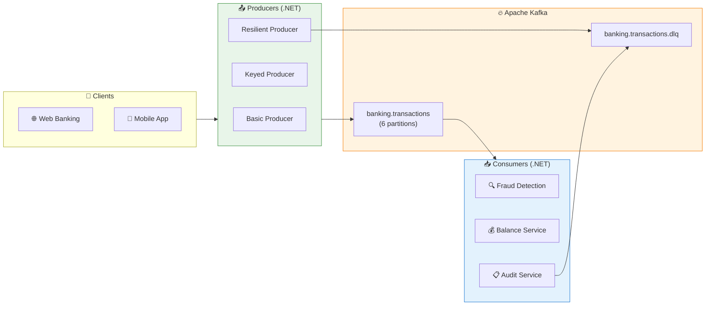

# Formation Apache Kafka avec .NET

> **Programme complet** : 3 jours | **Stack** : .NET 8, Confluent.Kafka, Docker, OpenShift | **Scénario** : E-Banking

---

## 📅 Informations pratiques

|   |   |
| --- | --- |
| **Dates** | 10 – 12 février 2026 |
| **Horaires** | 9h00 – 12h00 / 13h30 – 16h30 (6h/jour) |
| **Durée totale** | 18 heures (3 jours) |
| **Formateur** | M. Mokhtar Sellami |
| **Lieu** | En présentiel — locaux du client |

### Planning journalier

| Créneau | Durée | Contenu |
| ------- | ----- | ------- |
| 09h00 – 10h30 | 1h30 | Théorie + démo live |
| 10h30 – 10h45 | 15 min | ☕ Pause |
| 10h45 – 12h00 | 1h15 | Lab pratique guidé |
| 12h00 – 13h30 | 1h30 | 🍽️ Déjeuner |
| 13h30 – 15h00 | 1h30 | Lab pratique autonome |
| 15h00 – 15h15 | 15 min | ☕ Pause |
| 15h15 – 16h30 | 1h15 | Lab avancé + Q&A |

---

## 🏦 Contexte

Cette formation utilise un scénario **E-Banking** de bout en bout : des transactions bancaires (virements, paiements, retraits) sont produites vers Kafka, puis consommées par des services de **détection de fraude**, **calcul de solde** et **audit réglementaire**.



---

## 📋 Prérequis

- **.NET 8 SDK**
- **Docker Desktop 4.x+** (ou accès OpenShift Sandbox)
- **IDE** : Visual Studio 2022 / VS Code / Rider
- **Confluent.Kafka** NuGet package (2.3.0+)

---

## 📅 Programme

### Day 01 — Fondamentaux Kafka

> **Mardi 10 février** | 6h | **Niveau** : Débutant → Intermédiaire | [README Day 01](./day-01-foundations/module-01-cluster/README.md)

| Module | Titre | Labs | Description |
| ------ | ----- | ---- | ----------- |
| [**M01**](./day-01-foundations/module-01-cluster/README.md) | Architecture Kafka & KRaft | CLI | Cluster setup (Docker, K3s, OpenShift Sandbox), topics, partitions, KRaft mode |
| [**M02**](./day-01-foundations/module-02-producer/README.md) | Producer API (.NET) | 3 labs | Producer basique, partitionnement par cle, gestion d'erreurs & DLQ |
| [**M03**](./day-01-foundations/module-03-consumer/README.md) | Consumer API (.NET) | 3 labs | Consumer auto-commit, consumer groups & rebalancing, manual commit & idempotence |

<details>
<summary>Labs Day 01 (6 labs)</summary>

| Lab | Titre | Service | Concepts cles |
| --- | ----- | ------- | ------------- |
| [**1.2a**](./day-01-foundations/module-02-producer/lab-1.2a-producer-basic/README.md) | Producer Basique | `ebanking-producer-api` | `ProduceAsync()`, `Acks.All`, `DeliveryResult`, round-robin partitioning |
| [**1.2b**](./day-01-foundations/module-02-producer/lab-1.2b-producer-keyed/README.md) | Producer avec Cle | `ebanking-keyed-producer-api` | Partitionnement par `CustomerId`, ordering guarantee, hot partition detection |
| [**1.2c**](./day-01-foundations/module-02-producer/lab-1.2c-producer-error-handling/README.md) | Producer Resilient | `ebanking-resilient-producer-api` | Retry, circuit breaker, Dead Letter Queue (`banking.transactions.dlq`) |
| [**1.3a**](./day-01-foundations/module-03-consumer/lab-1.3a-consumer-basic/README.md) | Consumer Basique | `ebanking-fraud-detection-api` | Auto-commit, `EnableAutoOffsetStore`, fraud detection (amount > 10000) |
| [**1.3b**](./day-01-foundations/module-03-consumer/lab-1.3b-consumer-group/README.md) | Consumer Group | `ebanking-balance-api` | Consumer groups, CooperativeSticky rebalancing, balance calculation |
| [**1.3c**](./day-01-foundations/module-03-consumer/lab-1.3c-consumer-manual-commit/README.md) | Manual Commit | `ebanking-audit-api` | `EnableAutoCommit=false`, `StoreOffset()`, idempotence, audit DLQ |

</details>

---

### Day 02 — Patterns de Production & Serialisation

> **Mercredi 11 février** | 6h | **Niveau** : Intermédiaire → Avancé | [README Day 02](./day-02-development/README.md)

| Bloc | Titre | Stack | Description |
| ---- | ----- | ----- | ----------- |
| [**2.1**](./day-02-development/module-04-advanced-patterns/lab-2.1a-serialization/README.md) | Sérialisation Avancée | .NET 8 | Custom `ISerializer<T>`, JSON typé, validation, schema evolution, intro Avro/Schema Registry |
| [**2.2**](./day-02-development/module-04-advanced-patterns/lab-2.2-producer-advanced/README.md) | Producer Patterns Avancés | .NET 8 | `EnableIdempotence=true`, PID, sequence numbers, transactions Kafka, exactly-once |
| [**2.3**](./day-02-development/module-04-advanced-patterns/lab-2.3a-consumer-dlt-retry/README.md) | Consumer Patterns Avancés | .NET 8 | Dead Letter Topic, retry backoff exponentiel + jitter, rebalancing CooperativeSticky |
| **2.4** | Kafka Connect Introduction | Theory | Source/Sink connectors, Workers, Tasks, preview Day 03 |

<details>
<summary>Details Day 02</summary>

- **Bloc 2.1** : Web API `EBankingSerializationAPI` avec custom serializer/deserializer, background consumer, schema evolution demo
- **Bloc 2.2** : Web API `EBankingIdempotentProducerAPI` avec side-by-side comparison idempotent vs non-idempotent producer
- **Bloc 2.3** : Module M04 existant avec DLT, retries, rebalancing handlers, `EnableAutoOffsetStore=false`
- **Bloc 2.4** : Section théorique dans le README Day 02, preview du Module 06 (Day 03)

</details>

---

### Day 03 — Integration, Tests & Observabilite

> **Jeudi 12 février** | 6h | **Niveau** : Avancé → Production | [README Day 03](./day-03-integration/README.md)

| Module | Titre | Stack | Description |
| ------ | ----- | ----- | ----------- |
| [**M05**](./day-03-integration/module-05-kafka-streams/README.md) | Kafka Streams | Java | KStream, KTable, aggregations, windowing, jointures |
| [**M06**](./day-03-integration/module-06-kafka-connect/README.md) | Kafka Connect | Connect API | Source & Sink connectors, REST API management, SQL Server CDC |
| [**M07**](./day-03-integration/module-07-testing/README.md) | Testing Kafka | .NET / Java | Unit tests (MockProducer/MockConsumer), integration tests (Testcontainers) |
| [**M08**](./day-03-integration/module-08-observability/README.md) | Observabilite | Prometheus/Grafana | Metriques JMX, consumer lag, tracing distribue |

<details>
<summary>Details Day 03</summary>

- **M05** Kafka Streams (Java) — KStream, KTable, windowing. Inclut [tutoriel Java](./day-03-integration/module-05-kafka-streams/TUTORIAL-JAVA.md)
- **M06** inclut des [exemples SQL Server CDC](./day-03-integration/module-06-kafka-connect/SQLSERVER-CDC-EXAMPLES.md) et un [tutoriel Connect](./day-03-integration/module-06-kafka-connect/TUTORIAL.md)
- **M07** inclut des tutoriels [.NET](./day-03-integration/module-07-testing/TUTORIAL-DOTNET.md) et [Java](./day-03-integration/module-07-testing/TUTORIAL.md)
- **M08** inclut un stack Prometheus + Grafana + JMX Exporter preconfigure

</details>

---

## 🚀 Quick Start

### 1. Cloner le repository

```bash
git clone <repo-url>
cd formation-kafka-dotnet
```

### 2. Demarrer l'infrastructure Kafka

<details>
<summary>🐳 Docker</summary>

```bash
cd day-01-foundations/module-01-cluster
./scripts/up.sh
# Verifier : docker ps (kafka et kafka-ui doivent etre healthy)
```

</details>

<details>
<summary>☁️ OpenShift Sandbox</summary>

```bash
oc login --token=<TOKEN> --server=<SERVER>
cd day-01-foundations/module-01-cluster/infra/scripts
./08-install-kafka-sandbox.sh
```

</details>

### 3. Creer le topic principal

```bash
# Docker
docker exec kafka /opt/kafka/bin/kafka-topics.sh \
  --bootstrap-server localhost:9092 \
  --create --if-not-exists \
  --topic banking.transactions \
  --partitions 6 --replication-factor 1
```

### 4. Commencer le premier lab

```bash
cd day-01-foundations/module-02-producer/lab-1.2a-producer-basic/EBankingProducerAPI
dotnet run
# Ouvrir https://localhost:5001/swagger
```

---

## 🏗️ Structure du Repository

```text
formation-kafka-dotnet/
├── day-01-foundations/           # Jour 1 : Fondamentaux
│   ├── module-01-cluster/       # M01 : Architecture & Setup
│   ├── module-02-producer/      # M02 : Producer API
│   │   ├── lab-1.2a-producer-basic/
│   │   ├── lab-1.2b-producer-keyed/
│   │   └── lab-1.2c-producer-error-handling/
│   ├── module-03-consumer/      # M03 : Consumer API
│   │   ├── lab-1.3a-consumer-basic/
│   │   ├── lab-1.3b-consumer-group/
│   │   └── lab-1.3c-consumer-manual-commit/
│   └── scripts/                 # Scripts de deploiement automatise
│       ├── bash/
│       └── powershell/
├── day-02-development/          # Jour 2 : Avance
│   └── module-04-advanced-patterns/
│       ├── lab-2.1a-serialization/
│       ├── lab-2.2-producer-advanced/
│       └── lab-2.3a-consumer-dlt-retry/
├── day-03-integration/          # Jour 3 : Production
│   ├── module-05-kafka-streams/
│   ├── module-06-kafka-connect/
│   ├── module-07-testing/
│   └── module-08-observability/
└── docs/                        # Documentation curriculum
```

---

## 📊 Services URLs (Docker)

| Service | URL | Description |
| ------- | --- | ----------- |
| Kafka | `localhost:9092` | Bootstrap servers |
| Kafka UI | <http://localhost:8080> | Interface web de gestion |
| Producer API | <https://localhost:5001/swagger> | Lab 1.2a |
| Keyed Producer API | <https://localhost:5011/swagger> | Lab 1.2b |
| Resilient Producer API | <https://localhost:5021/swagger> | Lab 1.2c |
| Fraud Detection API | <https://localhost:5101/swagger> | Lab 1.3a |
| Balance API | <https://localhost:5111/swagger> | Lab 1.3b |
| Audit API | <https://localhost:5121/swagger> | Lab 1.3c |
| Serialization API | <http://localhost:5170/swagger> | Lab 2.1a |
| Idempotent Producer API | <http://localhost:5171/swagger> | Lab 2.2a |
| DLT Consumer API | <http://localhost:18083> | Lab 2.3a |

---

## ⚠️ Troubleshooting

| Erreur | Cause | Solution |
| ------ | ----- | -------- |
| `Broker transport failure` | Kafka non demarre | `docker ps` puis `./scripts/up.sh` |
| `UnknownTopicOrPartition` | Topic non cree | `kafka-topics.sh --create --topic banking.transactions` |
| `Coordinator load in progress` | Cluster Sandbox froid | Attendre 5 min ou `oc delete pods -l app=kafka` |
| `Connection refused :9092` | Port non expose | Verifier Docker ou port-forward OpenShift |
| `Rebalancing in progress` | Consumer group instable | Attendre fin du rebalance |

---

## 📜 Licence

Formation interne — Usage pedagogique uniquement.
