# Formation Apache Kafka avec .NET

> **Programme complet** : 3 jours | **Stack** : .NET 8, Confluent.Kafka, Docker, OpenShift | **Scénario** : E-Banking

---

## � Contexte

Cette formation utilise un scénario **E-Banking** de bout en bout : des transactions bancaires (virements, paiements, retraits) sont produites vers Kafka, puis consommées par des services de **détection de fraude**, **calcul de solde** et **audit réglementaire**.

```mermaid
flowchart LR
    subgraph Clients["🏦 Clients"]
        Web["🌐 Web Banking"]
        Mobile["📱 Mobile App"]
    end

    subgraph Producers["📤 Producers (.NET)"]
        P1["Basic Producer"]
        P2["Keyed Producer"]
        P3["Resilient Producer"]
    end

    subgraph Kafka["🔥 Apache Kafka"]
        T["banking.transactions<br/>(6 partitions)"]
        DLQ["banking.transactions.dlq"]
    end

    subgraph Consumers["📥 Consumers (.NET)"]
        C1["🔍 Fraud Detection"]
        C2["� Balance Service"]
        C3["📋 Audit Service"]
    end

    Clients --> Producers --> T
    T --> Consumers
    P3 --> DLQ
    C3 --> DLQ

    style Kafka fill:#fff3e0,stroke:#f57c00
    style Producers fill:#e8f5e9,stroke:#388e3c
    style Consumers fill:#e3f2fd,stroke:#1976d2
```



---

## 📋 Prérequis

- **.NET 8 SDK**
- **Docker Desktop 4.x+** (ou accès OpenShift Sandbox)
- **IDE** : Visual Studio 2022 / VS Code / Rider
- **Confluent.Kafka** NuGet package (2.3.0+)

---

## 📅 Programme

### Day 01 — Fondamentaux Kafka

> **Durée** : 4-5h | **Niveau** : Debutant → Intermediaire | [README Day 01](./day-01-foundations/module-01-cluster/README.md)

| Module | Titre | Labs | Description |
| ------ | ----- | ---- | ----------- |
| [**M01**](./day-01-foundations/module-01-cluster/README.md) | Architecture Kafka & KRaft | CLI | Cluster setup (Docker, K3s, OpenShift Sandbox), topics, partitions, KRaft mode |
| [**M02**](./day-01-foundations/module-02-producer/README.md) | Producer API (.NET) | 3 labs | Producer basique, partitionnement par cle, gestion d'erreurs & DLQ |
| [**M03**](./day-01-foundations/module-03-consumer/README.md) | Consumer API (.NET) | 3 labs | Consumer auto-commit, consumer groups & rebalancing, manual commit & idempotence |

<details>
<summary>Labs Day 01 (6 labs)</summary>

| Lab | Titre | Service | Concepts cles |
| --- | ----- | ------- | ------------- |
| [**1.2a**](./day-01-foundations/module-02-producer/lab-1.2a-producer-basic/README.md) | Producer Basique | `ebanking-producer-api` | `ProduceAsync()`, `Acks.All`, `DeliveryResult`, round-robin partitioning |
| [**1.2b**](./day-01-foundations/module-02-producer/lab-1.2b-producer-keyed/README.md) | Producer avec Cle | `ebanking-keyed-producer-api` | Partitionnement par `CustomerId`, ordering guarantee, hot partition detection |
| [**1.2c**](./day-01-foundations/module-02-producer/lab-1.2c-producer-error-handling/README.md) | Producer Resilient | `ebanking-resilient-producer-api` | Retry, circuit breaker, Dead Letter Queue (`banking.transactions.dlq`) |
| [**1.3a**](./day-01-foundations/module-03-consumer/lab-1.3a-consumer-basic/README.md) | Consumer Basique | `ebanking-fraud-detection-api` | Auto-commit, `EnableAutoOffsetStore`, fraud detection (amount > 10000) |
| [**1.3b**](./day-01-foundations/module-03-consumer/lab-1.3b-consumer-group/README.md) | Consumer Group | `ebanking-balance-api` | Consumer groups, CooperativeSticky rebalancing, balance calculation |
| [**1.3c**](./day-01-foundations/module-03-consumer/lab-1.3c-consumer-manual-commit/README.md) | Manual Commit | `ebanking-audit-api` | `EnableAutoCommit=false`, `StoreOffset()`, idempotence, audit DLQ |

</details>

---

### Day 02 — Developpement Avance & Kafka Streams

> **Durée** : 5-6h | **Niveau** : Intermediaire → Avance | [README Day 02](./day-02-development/README.md)

| Module | Titre | Stack | Description |
| ------ | ----- | ----- | ----------- |
| [**M04**](./day-02-development/module-04-advanced-patterns/README.md) | Advanced Consumer Patterns | .NET / Java | Dead Letter Topic, retry avec backoff exponentiel, rebalancing, erreurs transient vs permanent |
| [**M05**](./day-02-development/module-05-kafka-streams/README.md) | Kafka Streams | Java | KStream, KTable, aggregations windowed, joins, State Stores, Interactive Queries |

<details>
<summary>Details Day 02</summary>

- **M04** inclut des tutoriels [.NET](./day-02-development/module-04-advanced-patterns/TUTORIAL-DOTNET.md), [Java](./day-02-development/module-04-advanced-patterns/TUTORIAL-JAVA.md), et [Visual Studio 2022](./day-02-development/module-04-advanced-patterns/TUTORIAL-VS2022.md)
- **M05** inclut un tutoriel [Java Kafka Streams](./day-02-development/module-05-kafka-streams/TUTORIAL-JAVA.md) avec topologies completes

</details>

---

### Day 03 — Integration, Tests & Observabilite

> **Durée** : 5-6h | **Niveau** : Avance → Production | [README Day 03](./day-03-integration/README.md)

| Module | Titre | Stack | Description |
| ------ | ----- | ----- | ----------- |
| [**M06**](./day-03-integration/module-06-kafka-connect/README.md) | Kafka Connect | Connect API | Source & Sink connectors, REST API management, SQL Server CDC |
| [**M07**](./day-03-integration/module-07-testing/README.md) | Testing Kafka | .NET / Java | Unit tests (MockProducer/MockConsumer), integration tests (Testcontainers) |
| [**M08**](./day-03-integration/module-08-observability/README.md) | Observabilite | Prometheus/Grafana | Metriques JMX, consumer lag, tracing distribue |

<details>
<summary>Details Day 03</summary>

- **M06** inclut des [exemples SQL Server CDC](./day-03-integration/module-06-kafka-connect/SQLSERVER-CDC-EXAMPLES.md) et un [tutoriel Connect](./day-03-integration/module-06-kafka-connect/TUTORIAL.md)
- **M07** inclut des tutoriels [.NET](./day-03-integration/module-07-testing/TUTORIAL-DOTNET.md) et [Java](./day-03-integration/module-07-testing/TUTORIAL.md)
- **M08** inclut un stack Prometheus + Grafana + JMX Exporter preconfigure

</details>

---

## 🚀 Quick Start

### 1. Cloner le repository

```bash
git clone <repo-url>
cd formation-kafka-dotnet
```

### 2. Demarrer l'infrastructure Kafka

<details>
<summary>🐳 Docker</summary>

```bash
cd day-01-foundations/module-01-cluster
./scripts/up.sh
# Verifier : docker ps (kafka et kafka-ui doivent etre healthy)
```

</details>

<details>
<summary>☁️ OpenShift Sandbox</summary>

```bash
oc login --token=<TOKEN> --server=<SERVER>
cd day-01-foundations/module-01-cluster/infra/scripts
./08-install-kafka-sandbox.sh
```

</details>

### 3. Creer le topic principal

```bash
# Docker
docker exec kafka /opt/kafka/bin/kafka-topics.sh \
  --bootstrap-server localhost:9092 \
  --create --if-not-exists \
  --topic banking.transactions \
  --partitions 6 --replication-factor 1
```

### 4. Commencer le premier lab

```bash
cd day-01-foundations/module-02-producer/lab-1.2a-producer-basic/EBankingProducerAPI
dotnet run
# Ouvrir https://localhost:5001/swagger
```

---

## 🏗️ Structure du Repository

```text
formation-kafka-dotnet/
├── day-01-foundations/           # Jour 1 : Fondamentaux
│   ├── module-01-cluster/       # M01 : Architecture & Setup
│   ├── module-02-producer/      # M02 : Producer API
│   │   ├── lab-1.2a-producer-basic/
│   │   ├── lab-1.2b-producer-keyed/
│   │   └── lab-1.2c-producer-error-handling/
│   ├── module-03-consumer/      # M03 : Consumer API
│   │   ├── lab-1.3a-consumer-basic/
│   │   ├── lab-1.3b-consumer-group/
│   │   └── lab-1.3c-consumer-manual-commit/
│   └── scripts/                 # Scripts de deploiement automatise
│       ├── bash/
│       └── powershell/
├── day-02-development/          # Jour 2 : Avance
│   ├── module-04-advanced-patterns/
│   └── module-05-kafka-streams/
├── day-03-integration/          # Jour 3 : Production
│   ├── module-06-kafka-connect/
│   ├── module-07-testing/
│   └── module-08-observability/
└── docs/                        # Documentation curriculum
```

---

## 📊 Services URLs (Docker)

| Service | URL | Description |
| ------- | --- | ----------- |
| Kafka | `localhost:9092` | Bootstrap servers |
| Kafka UI | <http://localhost:8080> | Interface web de gestion |
| Producer API | <https://localhost:5001/swagger> | Lab 1.2a |
| Keyed Producer API | <https://localhost:5011/swagger> | Lab 1.2b |
| Resilient Producer API | <https://localhost:5021/swagger> | Lab 1.2c |
| Fraud Detection API | <https://localhost:5101/swagger> | Lab 1.3a |
| Balance API | <https://localhost:5111/swagger> | Lab 1.3b |
| Audit API | <https://localhost:5121/swagger> | Lab 1.3c |

---

## ⚠️ Troubleshooting

| Erreur | Cause | Solution |
| ------ | ----- | -------- |
| `Broker transport failure` | Kafka non demarre | `docker ps` puis `./scripts/up.sh` |
| `UnknownTopicOrPartition` | Topic non cree | `kafka-topics.sh --create --topic banking.transactions` |
| `Coordinator load in progress` | Cluster Sandbox froid | Attendre 5 min ou `oc delete pods -l app=kafka` |
| `Connection refused :9092` | Port non expose | Verifier Docker ou port-forward OpenShift |
| `Rebalancing in progress` | Consumer group instable | Attendre fin du rebalance |

---

## 📜 Licence

Formation interne — Usage pedagogique uniquement.
