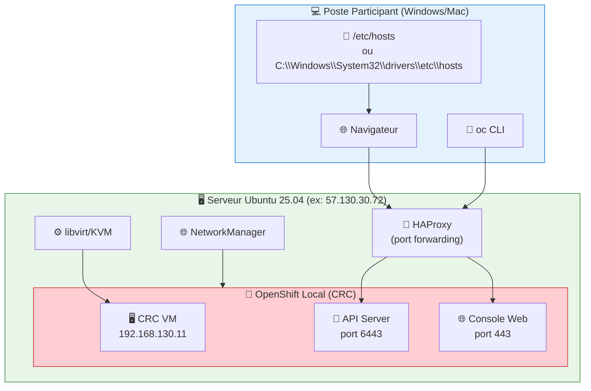
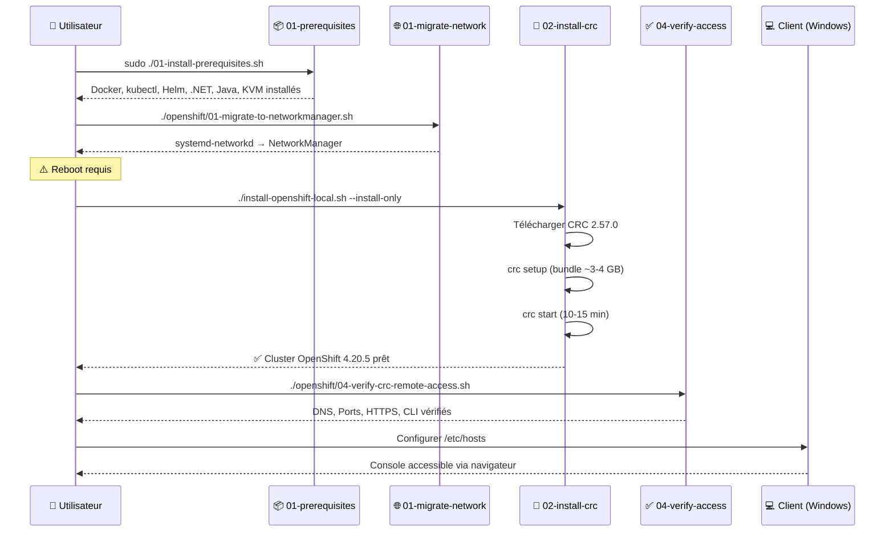

# 🚀 OpenShift Local (CRC) — Installation & Configuration

> Guide complet pour installer et configurer OpenShift Local (CRC) sur Ubuntu 25.04 pour la formation Kafka .NET

---

## 📋 Vue d'ensemble

Ce répertoire contient un **orchestrateur d'installation** et des scripts modulaires pour déployer **OpenShift Local (CRC)** sur un serveur Ubuntu distant, avec accès public pour les participants de la formation.

### Architecture



### Séquence d'Installation Complète



---

## 📂 Structure des Scripts

### Orchestrateur Principal

| Script | Description |
| ------ | ----------- |
| `install-openshift-local.sh` | **Orchestrateur principal** — Menu interactif ou options CLI pour piloter toute l'installation |

### Scripts Modulaires (`openshift/`)

| Script | Description | Étape |
| ------ | ----------- | ----- |
| `01-migrate-to-networkmanager.sh` | Migration réseau `systemd-networkd` → `NetworkManager` | Pré-requis |
| `02-install-crc-ubuntu-public.sh` | Installation CRC + HAProxy + Firewall | Installation |
| `03-crc-manage.sh` | Gestion quotidienne (start/stop/status/credentials) | Opérations |
| `04-verify-crc-remote-access.sh` | Vérification DNS, ports, HTTPS, CLI | Validation |
| `05-backup-crc.sh` | Backup de la configuration et des données CRC | Maintenance |
| `06-fix-crc-virtiofsd.sh` | Correctif pour l'erreur `virtiofsd` | Dépannage |
| `pull-secret.txt` | Pull secret Red Hat (requis pour l'installation) | Configuration |

---

## 🛠️ Prérequis

### Configuration Minimale du Serveur

| Ressource | Minimum | Recommandé |
| --------- | ------- | ---------- |
| **CPU** | 4 cores | 8 cores |
| **RAM** | 10 GB | 16 GB |
| **Disque** | 60 GB | 100 GB |
| **OS** | Ubuntu 24.04+ | Ubuntu 25.04 |
| **Virtualisation** | KVM activé | KVM activé |
| **Réseau** | IP publique | IP publique fixe |

### Vérifier les ressources

```bash
nproc                    # CPU cores
free -h                  # RAM
df -h /                  # Espace disque
egrep -c '(vmx|svm)' /proc/cpuinfo  # KVM support (>0 = OK)
```

### Pull Secret Red Hat

Obtenez votre pull secret depuis :
👉 [https://console.redhat.com/openshift/create/local](https://console.redhat.com/openshift/create/local)

Sauvegardez-le dans `~/pull-secret.txt` :

```bash
# Copier le pull secret
nano ~/pull-secret.txt
# Coller le contenu JSON et sauvegarder
```

---

## 🚀 Installation Pas à Pas

### Étape 0 : Prérequis système

```bash
# Installer les prérequis (Docker, kubectl, Helm, .NET, KVM, virtiofsd...)
sudo ./01-install-prerequisites.sh

# ⚠️ Déconnectez-vous et reconnectez-vous pour appliquer les groupes
exit
# reconnexion SSH
```

### Étape 1 : Migration réseau (si nécessaire)

Ubuntu Server utilise `systemd-networkd` par défaut, mais CRC requiert **NetworkManager** :

```bash
# Vérifier l'état actuel
systemctl is-active NetworkManager     # Devrait être "active"
systemctl is-active systemd-networkd   # Devrait être "inactive"

# Si NetworkManager n'est pas actif :
./openshift/01-migrate-to-networkmanager.sh

# ⚠️ REBOOT OBLIGATOIRE après la migration
sudo reboot
```

### Étape 2 : Installer OpenShift Local (CRC)

#### Option A : Orchestrateur interactif

```bash
./install-openshift-local.sh
# Sélectionner : 1 (Full installation) ou 2 (Install CRC only)
```

#### Option B : Installation directe (CLI)

```bash
# Installation complète (migration + CRC)
./install-openshift-local.sh --full-install

# Installation CRC seule (migration déjà faite)
./install-openshift-local.sh --install-only

# Avec paramètres personnalisés
CRC_CPUS=6 CRC_MEMORY_MB=16384 CRC_DISK_GB=100 ./install-openshift-local.sh --install-only
```

#### Ce qui se passe pendant l'installation

```text
1. ✅ Vérification système (OS, RAM, CPU, KVM)
2. ✅ Installation des prérequis (libvirt, qemu-kvm)
3. ✅ Configuration utilisateur (groupes libvirt, kvm)
4. ✅ Téléchargement CRC (~36 MB)
5. ✅ Configuration CRC (CPU, RAM, disque, network-mode)
6. ✅ crc setup (télécharge le bundle OpenShift ~3-4 GB)
7. ✅ crc start (démarre la VM, configure le cluster ~10-15 min)
8. ✅ Configuration HAProxy (forwarding des ports)
9. ✅ Configuration Firewall (ports 80, 443, 6443)
```

> **⏱️ Durée totale** : 20-30 minutes (selon la bande passante réseau)

### Étape 3 : Vérifier l'installation

```bash
# Vérifier le statut CRC
crc status

# Attendu :
# CRC VM:          Running
# OpenShift:       Running (v4.20.5)
# RAM Usage:       8.5GB of 10GB
# Disk Usage:      15GB of 60GB

# Obtenir les credentials
crc console --credentials

# Tester le login
eval $(crc oc-env)
oc login -u kubeadmin -p <password> https://api.crc.testing:6443 --insecure-skip-tls-verify
oc get nodes
oc get clusterversion
```

---

## 🌐 Configuration Accès Distant

### Sur le serveur Ubuntu

```bash
# Vérifier l'accès distant
./openshift/04-verify-crc-remote-access.sh

# Configurer le DNS local
sudo tee -a /etc/hosts <<EOF
<PUBLIC_IP> api.crc.testing
<PUBLIC_IP> console-openshift-console.apps-crc.testing
<PUBLIC_IP> oauth-openshift.apps-crc.testing
<PUBLIC_IP> default-route-openshift-image-registry.apps-crc.testing
EOF

# Ou mieux, utiliser dnsmasq (wildcard pour *.apps-crc.testing) :
sudo tee /etc/NetworkManager/dnsmasq.d/crc.conf <<EOF
address=/apps-crc.testing/<PUBLIC_IP>
address=/api.crc.testing/<PUBLIC_IP>
EOF
sudo systemctl restart NetworkManager
```

### Sur les postes participants (Windows)

Éditer `C:\Windows\System32\drivers\etc\hosts` **en tant qu'administrateur** :

```text
57.130.30.72 api.crc.testing
57.130.30.72 console-openshift-console.apps-crc.testing
57.130.30.72 oauth-openshift.apps-crc.testing
57.130.30.72 default-route-openshift-image-registry.apps-crc.testing
```

### Sur les postes participants (Linux/Mac)

```bash
sudo tee -a /etc/hosts <<EOF
57.130.30.72 api.crc.testing
57.130.30.72 console-openshift-console.apps-crc.testing
57.130.30.72 oauth-openshift.apps-crc.testing
57.130.30.72 default-route-openshift-image-registry.apps-crc.testing
EOF
```

### Accès

| Service | URL | Credentials |
| ------- | --- | ----------- |
| **Console Web** | `https://console-openshift-console.apps-crc.testing` | `kubeadmin` / (voir `crc console --credentials`) |
| **API Server** | `https://api.crc.testing:6443` | Token via `oc login` |
| **Developer Login** | Console ou CLI | `developer` / `developer` |
| **Image Registry** | `https://default-route-openshift-image-registry.apps-crc.testing` | Token via `oc registry login` |

> **⚠️ Certificat auto-signé** : Acceptez l'avertissement de sécurité dans le navigateur.

---

## 🔧 Gestion Quotidienne

### Orchestrateur

```bash
# Menu interactif
./install-openshift-local.sh

# Ou commandes directes
./install-openshift-local.sh --manage    # Menu de gestion
./install-openshift-local.sh --status    # Vérifier l'état
./install-openshift-local.sh --backup    # Sauvegarder
./install-openshift-local.sh --restore   # Restaurer
```

### Script de gestion `03-crc-manage.sh`

```bash
./openshift/03-crc-manage.sh start        # Démarrer le cluster
./openshift/03-crc-manage.sh stop         # Arrêter le cluster
./openshift/03-crc-manage.sh restart      # Redémarrer
./openshift/03-crc-manage.sh status       # État du cluster
./openshift/03-crc-manage.sh credentials  # Afficher les credentials
./openshift/03-crc-manage.sh console      # Ouvrir la console
./openshift/03-crc-manage.sh login        # Login avec oc CLI
./openshift/03-crc-manage.sh ip           # IP de la VM CRC
./openshift/03-crc-manage.sh logs         # Logs récents
./openshift/03-crc-manage.sh cleanup      # Nettoyer le cache
./openshift/03-crc-manage.sh delete       # Supprimer le cluster
./openshift/03-crc-manage.sh info         # Informations complètes
```

### Commandes CRC directes

```bash
crc status                # État
crc start                 # Démarrer
crc stop                  # Arrêter
crc delete                # Supprimer la VM
crc console               # URL de la console
crc console --credentials # Credentials
crc ip                    # IP de la VM
crc logs                  # Logs
crc cleanup               # Nettoyer (nécessite crc setup après)
```

### Commandes OpenShift (oc)

```bash
# Configuration de l'environnement
eval $(crc oc-env)

# Login
oc login -u kubeadmin -p <password> https://api.crc.testing:6443 --insecure-skip-tls-verify
oc login -u developer -p developer https://api.crc.testing:6443 --insecure-skip-tls-verify

# Cluster
oc get nodes
oc get clusterversion
oc get co                # Cluster operators

# Projets et namespaces
oc new-project kafka-training
oc get projects

# Pods et déploiements
oc get pods -A
oc get pods -n kafka-training
oc logs -f <pod-name> -n kafka-training
```

---

## 🎯 Déployer Kafka sur OpenShift

### Étape 1 : Créer le namespace

```bash
oc new-project kafka-training
```

### Étape 2 : Installer Strimzi Operator

```bash
# Installer via le script existant
./03-install-kafka.sh

# Ou manuellement :
oc apply -f https://strimzi.io/install/latest?namespace=kafka-training -n kafka-training
oc wait --for=condition=Ready pod -l name=strimzi-cluster-operator -n kafka-training --timeout=300s
```

### Étape 3 : Déployer le cluster Kafka

```yaml
# kafka-cluster.yaml
apiVersion: kafka.strimzi.io/v1beta2
kind: Kafka
metadata:
  name: training-cluster
  namespace: kafka-training
spec:
  kafka:
    version: 3.6.0
    replicas: 1
    listeners:
      - name: plain
        port: 9092
        type: internal
        tls: false
    config:
      offsets.topic.replication.factor: 1
      transaction.state.log.replication.factor: 1
      transaction.state.log.min.isr: 1
    storage:
      type: ephemeral
    resources:
      requests:
        memory: 1Gi
        cpu: 500m
      limits:
        memory: 2Gi
        cpu: 1000m
  zookeeper:
    replicas: 1
    storage:
      type: ephemeral
    resources:
      requests:
        memory: 512Mi
        cpu: 250m
      limits:
        memory: 1Gi
        cpu: 500m
```

```bash
oc apply -f kafka-cluster.yaml -n kafka-training
oc wait --for=condition=Ready kafka/training-cluster -n kafka-training --timeout=600s
```

### Étape 4 : Créer les topics pour la formation

```bash
oc exec -it training-cluster-kafka-0 -n kafka-training -- \
  bin/kafka-topics.sh --bootstrap-server localhost:9092 \
  --create --if-not-exists \
  --topic banking.transactions \
  --partitions 6 \
  --replication-factor 1

oc exec -it training-cluster-kafka-0 -n kafka-training -- \
  bin/kafka-topics.sh --bootstrap-server localhost:9092 \
  --create --if-not-exists \
  --topic banking.transactions.dlq \
  --partitions 3 \
  --replication-factor 1
```

### Étape 5 : Vérifier

```bash
# Pods
oc get pods -n kafka-training
# Attendu : training-cluster-kafka-0, training-cluster-zookeeper-0, strimzi-cluster-operator

# Topics
oc exec -it training-cluster-kafka-0 -n kafka-training -- \
  bin/kafka-topics.sh --bootstrap-server localhost:9092 --list

# Bootstrap server pour les applications .NET :
# training-cluster-kafka-bootstrap:9092 (depuis l'intérieur du cluster)
```

---

## 🔍 Dépannage

### Problèmes Connus et Solutions

| Problème | Cause | Solution |
| -------- | ----- | -------- |
| **`crc config set` arrête le script** | `set -euo pipefail` + exit code non-zero | Les commandes ont `\|\| true` (déjà corrigé) |
| **Erreur `virtiofsd`** | Package manquant ou mauvais chemin | `./openshift/06-fix-crc-virtiofsd.sh` |
| **`systemd-networkd is active`** | Migration réseau non faite | `./openshift/01-migrate-to-networkmanager.sh` + reboot |
| **Pull secret not found** | Fichier absent dans `~/pull-secret.txt` | Copier depuis `openshift/pull-secret.txt` ou RedHat |
| **DNS `api.crc.testing` → 192.168.130.11** | DNS résout vers l'IP interne de la VM | Ajouter entrées `/etc/hosts` avec l'IP publique |
| **403 Forbidden sur l'API** | Accès anonyme (pas de token) | Login via `oc login` ou utiliser la console web |
| **Wildcard DNS warning** | `*.apps-crc.testing` non résolu | Configurer dnsmasq ou `/etc/hosts` |
| **Kubelet certificate expired** | Première installation | Attendre 5-10 minutes (renouvellement automatique) |
| **CRC VM ne démarre pas** | Cache corrompu | `crc cleanup` puis `crc setup` puis `crc start` |
| **Timeout lors de `crc start`** | Ressources insuffisantes | Augmenter CPU/RAM : `crc config set cpus 6` |

### Erreur virtiofsd

```bash
# Diagnostic et correction automatique
./openshift/06-fix-crc-virtiofsd.sh

# Vérification manuelle
which virtiofsd
virtiofsd --version
ls -la /usr/lib/qemu/virtiofsd
```

### Logs de diagnostic

```bash
# Logs CRC
crc logs
sudo journalctl -u libvirtd -n 100

# État de la VM
sudo virsh list --all
sudo virsh dominfo crc

# Réseau
ip addr show
sudo virsh net-list --all
sudo virsh net-info crc

# Capacités KVM
sudo virsh capabilities | grep -i virtio
```

### Réinitialisation complète

```bash
# Arrêter et supprimer tout
crc stop
crc delete -f
crc cleanup

# Réinstaller
crc setup
crc start -p ~/pull-secret.txt
```

---

## 💾 Backup & Restauration

### Backup

```bash
./install-openshift-local.sh --backup
# Ou directement :
./openshift/05-backup-crc.sh

# Crée une archive : ~/crc-backup-YYYYMMDD-HHMMSS.tar.gz
```

### Restauration

```bash
./install-openshift-local.sh --restore
# Suivre les instructions interactives
```

---

## 📊 Comparaison des Options d'Installation

| Critère | CRC (ce guide) | K3s | OKD Full |
| ------- | -------------- | --- | -------- |
| **Script** | `install-openshift-local.sh` | `02-install-k3s.sh` | `02-install-okd.sh` |
| **RAM** | 10 GB+ | 2 GB+ | 8 GB+ |
| **CPU** | 4+ | 1+ | 4+ |
| **Disque** | 60 GB+ | 20 GB+ | 100 GB+ |
| **Temps d'install** | 20-30 min | 5-10 min | 30-60 min |
| **Features OpenShift** | ✅ Complet | ❌ Non | ✅ Complet |
| **Console Web** | ✅ Oui | ❌ Non | ✅ Oui |
| **Operators (Strimzi)** | ✅ Oui | Via Helm | ✅ Oui |
| **Accès distant** | ✅ HAProxy | ✅ NodePort | ✅ Routes |
| **Recommandé** | **Formation standard** | Tests rapides | Production-like |

---

## ✅ Checklist Post-Installation

### Serveur

- [ ] CRC installé (`crc version` → `2.57.0+`)
- [ ] Cluster démarré (`crc status` → `Running`)
- [ ] OpenShift version confirmée (`oc get clusterversion`)
- [ ] `oc login` fonctionne avec `kubeadmin`
- [ ] `oc login` fonctionne avec `developer`
- [ ] HAProxy configuré (ports 80, 443, 6443 accessibles)
- [ ] DNS configuré (`/etc/hosts` ou dnsmasq)

### Client (Windows/Mac/Linux)

- [ ] Entrées `/etc/hosts` ajoutées pour `api.crc.testing` et `*.apps-crc.testing`
- [ ] Console web accessible : `https://console-openshift-console.apps-crc.testing`
- [ ] Login `kubeadmin` fonctionne
- [ ] Login `developer` fonctionne
- [ ] `oc` CLI installé et configuré (optionnel)

### Kafka

- [ ] Namespace `kafka-training` créé
- [ ] Strimzi Operator installé et Running
- [ ] Cluster Kafka `training-cluster` Ready
- [ ] Topic `banking.transactions` créé (6 partitions)
- [ ] Topic `banking.transactions.dlq` créé (3 partitions)
- [ ] Bootstrap server accessible : `training-cluster-kafka-bootstrap:9092`

---

## 📚 Ressources

- [OpenShift Local Documentation](https://developers.redhat.com/products/openshift-local/overview)
- [CRC Getting Started](https://crc.dev/crc/getting_started/getting_started/introducing/)
- [Red Hat Pull Secret](https://console.redhat.com/openshift/create/local)
- [Strimzi Documentation](https://strimzi.io/documentation/)
- [oc CLI Reference](https://docs.openshift.com/container-platform/latest/cli_reference/openshift_cli/getting-started-cli.html)
