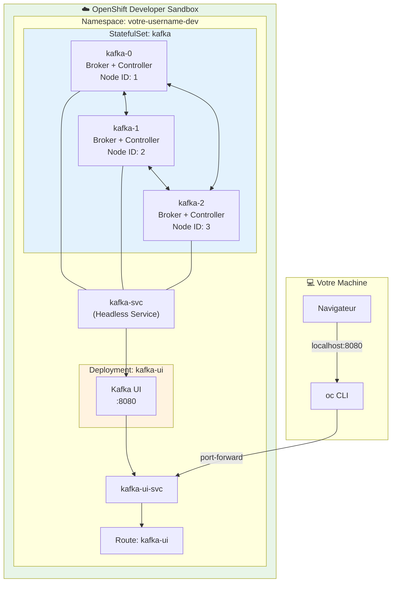

# 🌐 Kafka sur OpenShift Developer Sandbox

> Guide complet pour déployer Apache Kafka 4.0 (KRaft) sur OpenShift Developer Sandbox

## 📋 Table des matières

1. [Présentation](#-présentation)
2. [Prérequis](#-prérequis)
3. [Démarrage rapide](#-démarrage-rapide)
4. [Architecture](#-architecture)
5. [Tutoriel pas à pas](#-tutoriel-pas-à-pas)
6. [Configuration avancée](#-configuration-avancée)
7. [Dépannage](#-dépannage)
8. [Nettoyage](#-nettoyage)

---

## 🎯 Présentation

### Qu'est-ce que l'OpenShift Developer Sandbox ?

L'**OpenShift Developer Sandbox** est un environnement OpenShift **gratuit** fourni par Red Hat pour les développeurs. Il offre :

| Caractéristique | Description |
|-----------------|-------------|
| **Coût** | 100% gratuit |
| **Durée** | 30 jours (renouvelable) |
| **Accès** | Compte Red Hat requis |
| **Ressources** | Limité (~7 CPU, 15Gi RAM partagés) |
| **Fonctionnalités** | Pods, Services, Routes, PVCs |

### Différences avec OpenShift Local (CRC)

| Aspect | Sandbox | CRC (Local) |
|--------|---------|-------------|
| **Installation** | Aucune | ~20GB sur disque |
| **Connectivité** | Cloud (Internet requis) | Totalement local |
| **Opérateurs** | ❌ Non disponibles | ✅ Installables |
| **Strimzi** | ❌ Pas possible | ✅ Recommandé |
| **Méthode Kafka** | Manifests YAML directs | Strimzi Operator |

### Pourquoi ce guide ?

Puisque l'opérateur Strimzi ne peut pas être installé sur le Sandbox, ce guide utilise des **manifests Kubernetes natifs** pour déployer Kafka en mode KRaft.

---

## ✅ Prérequis

### 1. Compte Red Hat (gratuit)

Créez un compte sur [developers.redhat.com](https://developers.redhat.com/register)

### 2. Accès au Sandbox

1. Allez sur [console.redhat.com/openshift/sandbox](https://console.redhat.com/openshift/sandbox)
2. Cliquez sur **"Get started in the Sandbox"**
3. Attendez la création de votre environnement (~2-3 minutes)

### 3. OpenShift CLI (`oc`)

```bash
# Télécharger depuis
# https://access.redhat.com/downloads/content/290

# Vérifier l'installation
oc version
```

### 4. Se connecter au cluster

1. Dans la console OpenShift, cliquez sur votre nom en haut à droite
2. Sélectionnez **"Copy login command"**
3. Cliquez **"Display Token"**
4. Copiez et exécutez la commande `oc login`

```bash
oc login --token=sha256~xxxxx --server=https://api.sandbox-xxxx.openshiftapps.com:6443
```

---

## 🚀 Démarrage rapide

### Option 1 : Script automatisé (recommandé)

```bash
# Aller dans le répertoire des scripts
cd infra/Scripts
chmod +  *.sh
# Déployer un cluster Kafka 3-brokers
./08-install-kafka-sandbox.sh

# Ou un seul broker (moins de ressources)
./08-install-kafka-sandbox.sh --single-node
```

### Option 2 : Manifest manuel

```bash
# Appliquer le manifest existant
oc apply -f kafka-sandbox/kafka-manifest.yaml

# Vérifier les pods
oc get pods -l app=kafka

# Accéder à Kafka UI via port-forward
oc port-forward svc/kafka-ui-svc 8080:80
```

👉 Ouvrir [http://localhost:8080](http://localhost:8080)

---

## 🏗️ Architecture



### Composants déployés

| Composant | Type | Description |
|-----------|------|-------------|
| `kafka` | StatefulSet | 3 brokers Kafka en mode KRaft |
| `kafka-svc` | Headless Service | Communication inter-brokers |
| `kafka-ui` | Deployment | Interface web Kafka UI |
| `kafka-ui-svc` | Service | Expose Kafka UI |
| `kafka-ui` | Route | Accès externe (si disponible) |

---

## 📖 Tutoriel pas à pas

### Étape 1 : Connexion au Sandbox

```bash
# Vérifier la connexion
oc whoami
# Attendu: votre-email@example.com

# Vérifier le projet (namespace)
oc project
# Attendu: Using project "votre-username-dev"
```

### Étape 2 : Déployer Kafka

```bash
# Créer le répertoire si nécessaire
mkdir -p kafka-sandbox
cd kafka-sandbox

# Appliquer le manifest
oc apply -f kafka-manifest.yaml

# Attendre que les pods soient prêts
oc get pods -w
```

**Résultat attendu** :

```
NAME                        READY   STATUS    RESTARTS   AGE
kafka-0                     1/1     Running   0          2m
kafka-1                     1/1     Running   0          2m
kafka-2                     1/1     Running   0          2m
kafka-ui-6cd86b679c-xxxxx   1/1     Running   0          2m
```

> ⏱️ **Temps d'attente** : 2-5 minutes pour l'initialisation complète

### Étape 3 : Accéder à Kafka UI

La Route OpenShift peut ne pas fonctionner dans le Sandbox. Utilisez port-forwarding :

```bash
# Démarrer le port-forward
oc port-forward svc/kafka-ui-svc 8080:80
```

👉 Ouvrez [http://localhost:8080](http://localhost:8080)

**Ce que vous devez voir** :
- Cluster **sandbox-cluster** en ligne
- 3 brokers actifs
- Topics créés automatiquement

### Étape 4 : Créer un topic

```bash
# Créer un topic avec 3 partitions et réplication factor 3
oc exec kafka-0 -- /opt/kafka/bin/kafka-topics.sh \
    --bootstrap-server localhost:9092 \
    --create --topic mon-topic \
    --partitions 3 \
    --replication-factor 3
```

### Étape 5 : Produire des messages

```bash
# Produire un message
echo "Hello Kafka Sandbox!" | oc exec -i kafka-0 -- \
    /opt/kafka/bin/kafka-console-producer.sh \
    --bootstrap-server localhost:9092 \
    --topic mon-topic
```

### Étape 6 : Consommer des messages

```bash
# Consommer depuis le début
oc exec kafka-0 -- /opt/kafka/bin/kafka-console-consumer.sh \
    --bootstrap-server localhost:9092 \
    --topic mon-topic \
    --from-beginning \
    --timeout-ms 10000
```

**Résultat attendu** :

```
Hello Kafka Sandbox!
```

---

## ⚙️ Configuration avancée

### Manifest Kafka (kafka-manifest.yaml)

Le manifest inclut les configurations clés pour fonctionner sur le Sandbox :

#### Init Container pour Node ID dynamique

```yaml
initContainers:
  - name: init-config
    image: busybox:1.36
    command:
      - sh
      - -c
      - |
        # kafka-0 → Node ID 1, kafka-1 → Node ID 2, etc.
        ORDINAL=${HOSTNAME##*-}
        NODE_ID=$((ORDINAL + 1))
        echo "KAFKA_NODE_ID=${NODE_ID}" > /config/node.env
```

#### Volumes emptyDir pour les permissions

```yaml
volumes:
  - name: kafka-config
    emptyDir: {}   # Remplace /opt/kafka/config (read-only par défaut)
  - name: kafka-data
    emptyDir: {}   # Données Kafka (non persistantes)
  - name: kafka-logs
    emptyDir: {}   # Logs Kafka
  - name: tmp-dir
    emptyDir: {}   # Répertoire temporaire
```

> ⚠️ **Important** : Les données sont perdues au redémarrage des pods car nous utilisons `emptyDir`.

#### Controller Quorum Voters

```yaml
env:
  - name: KAFKA_CONTROLLER_QUORUM_VOTERS
    value: "1@kafka-0.kafka-svc:9093,2@kafka-1.kafka-svc:9093,3@kafka-2.kafka-svc:9093"
```

### Ajuster les ressources

Le Sandbox a des limites de ressources. Ajustez si nécessaire :

```yaml
resources:
  requests:
    memory: "512Mi"
    cpu: "250m"
  limits:
    memory: "1Gi"
    cpu: "500m"
```

### Passer en mode single-node

Pour économiser les ressources :

```bash
./08-install-kafka-sandbox.sh --single-node
```

Ou modifiez le manifest :

```yaml
spec:
  replicas: 1  # Au lieu de 3
```

---

## 🔧 Dépannage

### Problème : Pod en ImagePullBackOff

**Symptôme** : Le pod ne démarre pas, affiche `ImagePullBackOff`

**Solution** : Vérifiez l'image utilisée

```bash
oc describe pod kafka-0 | grep -A5 "Events:"
```

L'image `apache/kafka:4.0.0` est recommandée. Évitez `bitnami/kafka:latest` ou `confluent` qui peuvent avoir des problèmes de pull.

### Problème : CrashLoopBackOff

**Symptôme** : Le pod redémarre en boucle

**Causes possibles** :

1. **Permissions d'écriture**
   ```bash
   oc logs kafka-0 | grep -i "permission\|denied"
   ```
   → Assurez-vous que tous les volumes sont en `emptyDir`

2. **Ressources insuffisantes**
   ```bash
   oc describe pod kafka-0 | grep -A5 "Conditions:"
   ```
   → Réduisez les replicas à 1

3. **Configuration Kafka**
   ```bash
   oc logs kafka-0 --tail=50
   ```
   → Vérifiez les variables d'environnement

### Problème : Route non accessible

**Symptôme** : L'URL de la Route affiche une erreur 503

**Solution** : Utilisez port-forwarding

```bash
oc port-forward svc/kafka-ui-svc 8080:80
```

> 📝 Les Routes vers l'extérieur sont limitées dans le Sandbox gratuit.

### Problème : Brokers ne se trouvent pas

**Symptôme** : Messages d'erreur "Unknown broker" dans les logs

**Solution** : Vérifiez le headless service

```bash
# Le service doit avoir clusterIP: None
oc get svc kafka-svc -o yaml | grep clusterIP

# Les endpoints doivent lister tous les pods
oc get endpoints kafka-svc
```

### Problème : Timeout sur port-forward

**Symptôme** : Le port-forward se déconnecte après un moment

**Solution** : C'est normal pour les connexions inactives. Relancez simplement la commande.

---

## 🧹 Nettoyage

### Via script

```bash
cd infra/scripts
./09-cleanup-sandbox.sh
```

### Manuellement

```bash
# Supprimer toutes les ressources
oc delete route kafka-ui
oc delete service kafka-ui-svc kafka-svc
oc delete deployment kafka-ui
oc delete statefulset kafka

# Vérifier le nettoyage
oc get all
```

---

## 📚 Ressources

- [OpenShift Developer Sandbox](https://developers.redhat.com/developer-sandbox)
- [Apache Kafka Documentation](https://kafka.apache.org/documentation/)
- [KRaft Mode](https://kafka.apache.org/documentation/#kraft)
- [Kafka UI](https://github.com/provectus/kafka-ui)

---

## ➡️ Prochaines étapes

Retournez au module principal pour continuer les exercices :

👉 **[Module 01 - Architecture du Cluster Kafka](../README.md)**
