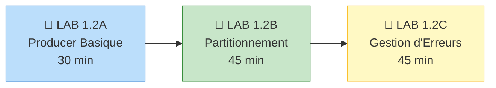

# Module 02 - Premier Producer C# - Formation Auto-rythmée

## Durée estimée

⏱️ **2 heures**

## Objectifs pédagogiques

À la fin de ce module, vous serez capable de :

1. ✅ Développer un Producer .NET minimaliste
2. ✅ Comprendre la configuration de base et les trade-offs
3. ✅ Implémenter le partitionnement par clé
4. ✅ Gérer les erreurs et confirmations de livraison
5. ✅ Optimiser les performances (batching, compression)

---

## 🧭 Parcours d'Apprentissage



**Progression** : Basique → Intermédiaire → Avancé

---

## 📖 Structure du Module

Ce module contient 3 labs progressifs :

### LAB 1.2A : Producer Synchrone Basique
**Durée** : 30 minutes  
**Objectif** : Créer un producer simple qui envoie des messages string à Kafka avec gestion d'erreurs de base.

📁 [`lab-1.2a-producer-basic/`](./lab-1.2a-producer-basic/)
 
**Java (Spring Boot)** : `lab-1.2a-producer-basic/java/`

**Ce que vous allez apprendre** :
- Configuration minimale d'un Producer
- Envoi de messages avec `ProduceAsync()`
- Gestion des `DeliveryResult`
- Error handlers et log handlers
- Importance du `Flush()` avant fermeture

---

### LAB 1.2B : Producer avec Clé (Partitionnement Déterministe)
**Durée** : 45 minutes  
**Objectif** : Comprendre comment la clé détermine la partition et garantit l'ordre des messages.

📁 [`lab-1.2b-producer-keyed/`](./lab-1.2b-producer-keyed/)
 
**Java (Spring Boot)** : `lab-1.2b-producer-keyed/java/`

**Ce que vous allez apprendre** :
- Différence entre messages avec et sans clé
- Partitionnement hash-based (Murmur2)
- Garantie d'ordre par clé
- Distribution des messages sur les partitions
- Éviter les hot partitions

---

### LAB 1.2C : Producer avec Gestion d'Erreurs et DLQ
**Durée** : 45 minutes  
**Objectif** : Implémenter un pattern production-ready avec retry et Dead Letter Queue.

📁 [`lab-1.2c-producer-error-handling/`](./lab-1.2c-producer-error-handling/)
 
**Java (Spring Boot)** : `lab-1.2c-producer-error-handling/java/`

**Ce que vous allez apprendre** :
- Classification des erreurs (retriable vs permanent)
- Pattern Dead Letter Queue (DLQ)
- Retry avec exponential backoff
- Métadonnées d'erreur dans headers
- Logging et monitoring des échecs

---

## 🚀 Prérequis

### Environnement

Vous devez avoir un cluster Kafka en fonctionnement. Deux options :

#### Option A : Docker (Développement local)
```bash
cd ../module-01-cluster
./scripts/up.sh
```

Vérifiez que Kafka est accessible :
```bash
docker ps
# Vous devez voir : kafka (healthy) et kafka-ui (healthy)
```

#### Option B : OKD/K3s/OpenShift (Production-like)

> ℹ️ Sur OpenShift/OKD, remplacez `kubectl` par `oc`.
```bash
kubectl get kafka -n kafka
# Attendu : bhf-kafka avec status Ready
```

#### Option C : OpenShift Developer Sandbox

Pour ce lab, nous devons exposer les brokers localement via `port-forward`.

1. **Ouvrez 3 terminaux séparés** et lancez ces commandes pour créer les tunnels :

   **Terminal A (Broker 0)** :
   ```bash
   oc port-forward kafka-0 9094:9094
   ```

   **Terminal B (Broker 1)** :
   ```bash
   oc port-forward kafka-1 9095:9094
   ```

   **Terminal C (Broker 2)** :
   ```bash
   oc port-forward kafka-2 9096:9094
   ```

2. **Configuration** :
   Utilisez `localhost:9094` comme `BootstrapServers`.

### Outils de développement

**Visual Studio Code** :
- Extension C# Dev Kit
- Extension Docker (optionnel)

**Visual Studio 2022** :
- Workload ".NET Desktop Development"
- Workload "ASP.NET and web development"

### SDK .NET
```bash
dotnet --version
# Attendu : 8.0.x ou supérieur
```

### Java (Spring Boot)

#### JDK
```bash
java -version
# Attendu : 17.x
```

#### Maven
```bash
mvn -version
```

---

## ☕ Java Track (Spring Boot) — Run & Test

Chaque lab contient une version Java Spring Boot dans le dossier `java/`.

### Variables d'environnement

Les applications Java utilisent les variables suivantes (avec valeurs par défaut) :

- **`KAFKA_BOOTSTRAP_SERVERS`** (default: `localhost:9092`)
- **`KAFKA_TOPIC`** (default: `banking.transactions`)
- **`KAFKA_DLQ_TOPIC`** (Lab 1.2C only, default: `banking.transactions.dlq`)
- **`SERVER_PORT`** (default: `8080`)

Lab 1.2C (résilience) ajoute :

- **`MAX_RETRIES`** (default: `3`)
- **`RETRY_BACKOFF_MS`** (default: `1000`)
- **`CIRCUIT_BREAKER_THRESHOLD`** (default: `5`)
- **`CIRCUIT_BREAKER_OPEN_MS`** (default: `60000`)

### Démarrer une application Java

#### Lab 1.2A — Producer Basic
```bash
cd lab-1.2a-producer-basic/java
mvn spring-boot:run
```

#### Lab 1.2B — Producer Keyed (key = customerId)
```bash
cd lab-1.2b-producer-keyed/java
mvn spring-boot:run
```

#### Lab 1.2C — Producer Resilient (retry + DLQ)
```bash
cd lab-1.2c-producer-error-handling/java
mvn spring-boot:run
```

### Endpoints

Labs 1.2A / 1.2B / 1.2C exposent :

- **POST** `http://localhost:8080/api/v1/transactions`
- **POST** `http://localhost:8080/api/v1/transactions/batch`

Lab 1.2C expose aussi :

- **GET** `http://localhost:8080/api/v1/transactions/metrics`

### Health

```bash
curl http://localhost:8080/actuator/health
```

### Docker (Java)

Each Java lab includes a `java/Dockerfile`.

#### Build

```bash
# Lab 1.2A
cd lab-1.2a-producer-basic/java
docker build -t ebanking-producer-basic-java:latest .

# Lab 1.2B
cd ../../lab-1.2b-producer-keyed/java
docker build -t ebanking-producer-keyed-java:latest .

# Lab 1.2C
cd ../../lab-1.2c-producer-error-handling/java
docker build -t ebanking-producer-resilient-java:latest .
```

#### Run

```bash
docker run --rm -p 8080:8080 \
  -e KAFKA_BOOTSTRAP_SERVERS=localhost:9092 \
  -e KAFKA_TOPIC=banking.transactions \
  ebanking-producer-basic-java:latest
```

For Lab 1.2C, add DLQ + retry env vars:

```bash
docker run --rm -p 8080:8080 \
  -e KAFKA_BOOTSTRAP_SERVERS=localhost:9092 \
  -e KAFKA_TOPIC=banking.transactions \
  -e KAFKA_DLQ_TOPIC=banking.transactions.dlq \
  -e MAX_RETRIES=3 \
  -e RETRY_BACKOFF_MS=1000 \
  ebanking-producer-resilient-java:latest
```

### OpenShift (Java)

Each Java lab includes an OpenShift manifest:

- Lab 1.2A: `lab-1.2a-producer-basic/java/deployment/openshift-deployment.yaml`
- Lab 1.2B: `lab-1.2b-producer-keyed/java/deployment/openshift-deployment.yaml`
- Lab 1.2C: `lab-1.2c-producer-error-handling/java/deployment/openshift-deployment.yaml`

#### Deploy (example: Lab 1.2A)

```bash
cd lab-1.2a-producer-basic/java

# Build image in your registry/workflow (Docker/CI), then update image field if needed.

oc apply -f deployment/openshift-deployment.yaml

# Get route
oc get route ebanking-producer-basic-java -o jsonpath='{.spec.host}'
```

#### Health check

```bash
HOST=$(oc get route ebanking-producer-basic-java -o jsonpath='{.spec.host}')
curl -k "https://$HOST/actuator/health"
```

#### Option A (Recommended): OpenShift S2I Binary Build (no external registry)

This option builds the Java application **inside OpenShift** using the S2I builder image and a **binary build**.

**Builder image** used in this training:

- `java:17`

##### Lab 1.2A — Basic Producer (Java)

```bash
APP=ebanking-producer-basic-java
ROUTE=${APP}-secure

cd lab-1.2a-producer-basic/java

# 1) Create BuildConfig (with explicit image stream)
oc new-build --image-stream="openshift/java:openjdk-17-ubi8" --binary=true --name=$APP

# 2) Start binary build from local folder
oc start-build $APP --from-dir=. --follow

# 3) Create app + configure env vars
oc new-app $APP
oc set env deployment/$APP \
  SERVER_PORT=8080 \
  KAFKA_BOOTSTRAP_SERVERS=kafka-svc:9092 \
  KAFKA_TOPIC=banking.transactions

# 4) Expose via edge route
oc create route edge $ROUTE --service=$APP --port=8080-tcp

# 5) Wait + test
oc wait --for=condition=available deployment/$APP --timeout=300s
HOST=$(oc get route $ROUTE -o jsonpath='{.spec.host}')
curl -k "https://$HOST/actuator/health"
```

##### Lab 1.2B — Keyed Producer (Java)

Same process, different `APP` name and folder:

```bash
APP=ebanking-producer-keyed-java
ROUTE=${APP}-secure

cd lab-1.2b-producer-keyed/java
oc new-build --image-stream="openshift/java:openjdk-17-ubi8" --binary=true --name=$APP
oc start-build $APP --from-dir=. --follow
oc new-app $APP
oc set env deployment/$APP SERVER_PORT=8080 KAFKA_BOOTSTRAP_SERVERS=kafka-svc:9092 KAFKA_TOPIC=banking.transactions
oc create route edge $ROUTE --service=$APP --port=8080-tcp
```

##### Lab 1.2C — Resilient Producer (Java)

```bash
APP=ebanking-producer-resilient-java
ROUTE=${APP}-secure

cd lab-1.2c-producer-error-handling/java
oc new-build --image-stream="openshift/java:openjdk-17-ubi8" --binary=true --name=$APP
oc start-build $APP --from-dir=. --follow
oc new-app $APP
oc set env deployment/$APP \
  SERVER_PORT=8080 \
  KAFKA_BOOTSTRAP_SERVERS=kafka-svc:9092 \
  KAFKA_TOPIC=banking.transactions \
  KAFKA_DLQ_TOPIC=banking.transactions.dlq \
  MAX_RETRIES=3 \
  RETRY_BACKOFF_MS=1000 \
  CIRCUIT_BREAKER_THRESHOLD=5 \
  CIRCUIT_BREAKER_OPEN_MS=60000
oc create route edge $ROUTE --service=$APP --port=8080-tcp
```

> **⚠️ Important Note** : All Java applications require the Spring Boot Maven plugin to be configured with the `repackage` goal to create an executable JAR. See individual lab READMEs for the exact `pom.xml` configuration.

#### Automated scripts (Option A)

The repository includes scripts that automate the steps above:

- Bash:
  - `day-01-foundations/scripts/bash/deploy-and-test-1.2a-java.sh`
  - `day-01-foundations/scripts/bash/deploy-and-test-1.2b-java.sh`
  - `day-01-foundations/scripts/bash/deploy-and-test-1.2c-java.sh`
- PowerShell:
  - `day-01-foundations/scripts/powershell/deploy-and-test-1.2a-java.ps1`
  - `day-01-foundations/scripts/powershell/deploy-and-test-1.2b-java.ps1`
  - `day-01-foundations/scripts/powershell/deploy-and-test-1.2c-java.ps1`

---

## Ordre de Réalisation

Suivez les labs dans l'ordre :

1. **LAB 1.2A** → Bases du Producer
2. **LAB 1.2B** → Partitionnement par clé
3. **LAB 1.2C** → Gestion d'erreurs production-ready

Chaque lab contient :
- ✅ Un README détaillé avec instructions pas à pas
- ✅ Le code complet commenté
- ✅ Les fichiers de configuration
- ✅ Les commandes de test et validation
- ✅ Des exercices pratiques

---

## 🎯 Concepts Théoriques Clés

### Anatomie d'un Message Kafka

```
┌─────────────────────────────────────────┐
│           MESSAGE KAFKA                 │
├─────────────────────────────────────────┤
│ Key (optional)    : byte[]              │  → Détermine la partition
│ Value             : byte[]              │  → Contenu du message
│ Headers (optional): Map<string, byte[]> │  → Métadonnées
│ Timestamp         : long                │  → Horodatage
│ Partition         : int                 │  → Calculé par Kafka
│ Offset            : long                │  → Assigné après écriture
└─────────────────────────────────────────┘
```

### Partitionnement

**Sans clé** : Round-robin (sticky partitioner depuis Kafka 2.4+)
```csharp
await producer.ProduceAsync("orders", new Message<Null, string>
{
    Value = "{...}"  // Partition choisie automatiquement
});
```

**Avec clé** : Hash-based (déterministe)
```csharp
await producer.ProduceAsync("orders", new Message<string, string>
{
    Key = "customer-123",  // Ira TOUJOURS sur la même partition
    Value = "{...}"
});
```

**Formule** :
```
partition = murmur2_hash(key) % nombre_partitions
```

### Configuration Producer : Trade-offs

| Paramètre | Latence faible | Throughput élevé |
|-----------|----------------|------------------|
| `LingerMs` | 0 | 10-100 |
| `BatchSize` | 16384 (16 KB) | 100000 (100 KB) |
| `CompressionType` | None | Lz4 |
| `Acks` | Leader (1) | All (-1) |

### Garanties de Livraison

| Acks | Garantie | Performance | Cas d'usage |
|------|----------|-------------|-------------|
| `None (0)` | Aucune | Très rapide | Métriques, logs non-critiques |
| `Leader (1)` | Leader uniquement | Rapide | Logs applicatifs |
| `All (-1)` | Tous les ISR | Plus lent | Transactions, commandes |

---

## 🛠️ Commandes Utiles

### Créer un topic pour les labs
```bash
# Docker
docker exec kafka /opt/kafka/bin/kafka-topics.sh \
  --bootstrap-server localhost:9092 \
  --create --if-not-exists \
  --topic banking.transactions \
  --partitions 6 \
  --replication-factor 1

# OKD/K3s
kubectl run kafka-cli -it --rm --image=quay.io/strimzi/kafka:latest-kafka-4.0.0 \
  --restart=Never -n kafka -- \
  bin/kafka-topics.sh --bootstrap-server bhf-kafka-kafka-bootstrap:9092 \
  --create --if-not-exists --topic banking.transactions --partitions 6 --replication-factor 3

# OpenShift Sandbox (via pod existant)
oc exec kafka-0 -- /opt/kafka/bin/kafka-topics.sh \
  --bootstrap-server localhost:9092 \
  --create \
  --if-not-exists \
  --topic banking.transactions \
  --partitions 6 \
  --replication-factor 3
```

### Lister les messages produits
```bash
# Docker
docker exec kafka /opt/kafka/bin/kafka-console-consumer.sh \
  --bootstrap-server localhost:9092 \
  --topic banking.transactions \
  --from-beginning \
  --max-messages 10

# OKD/K3s
kubectl run kafka-cli -it --rm --image=quay.io/strimzi/kafka:latest-kafka-4.0.0 \
  --restart=Never -n kafka -- \
  bin/kafka-console-consumer.sh --bootstrap-server bhf-kafka-kafka-bootstrap:9092 \
  --topic banking.transactions --from-beginning --max-messages 10

# OpenShift Sandbox (via pod existant)
oc exec kafka-0 -- /opt/kafka/bin/kafka-console-consumer.sh \
  --bootstrap-server localhost:9092 \
  --topic banking.transactions \
  --from-beginning \
  --max-messages 10
```

### Voir les détails d'un topic
```bash
# Docker
docker exec kafka /opt/kafka/bin/kafka-topics.sh \
  --bootstrap-server localhost:9092 \
  --describe \
  --topic banking.transactions

# OKD/K3s
kubectl run kafka-cli -it --rm --image=quay.io/strimzi/kafka:latest-kafka-4.0.0 \
  --restart=Never -n kafka -- \
  bin/kafka-topics.sh --bootstrap-server bhf-kafka-kafka-bootstrap:9092 \
  --describe --topic banking.transactions

# OpenShift Sandbox (via pod existant)
oc exec kafka-0 -- /opt/kafka/bin/kafka-topics.sh \
  --bootstrap-server localhost:9092 \
  --describe \
  --topic banking.transactions
```

---

## 💡 Tips & Best Practices

### TIP #1 : Singleton Producer en ASP.NET Core
```csharp
// ✅ BON : Singleton (réutilisé)
builder.Services.AddSingleton<IProducer<string, string>>(sp => ...);

// ❌ MAUVAIS : Scoped ou Transient (nouvelle connexion TCP)
builder.Services.AddScoped<IProducer<string, string>>(sp => ...);
```

### TIP #2 : Flush() avant fermeture
```csharp
// TOUJOURS flush avant Dispose
producer.Flush(TimeSpan.FromSeconds(10));
producer.Dispose();
```

### TIP #3 : Headers pour correlation IDs
```csharp
Headers = new Headers
{
    { "correlation-id", Encoding.UTF8.GetBytes(Guid.NewGuid().ToString()) },
    { "trace-id", Encoding.UTF8.GetBytes(Activity.Current?.TraceId.ToString() ?? "") }
}
```

### TIP #4 : Utilisez toujours une clé si besoin d'ordre
Si vous avez besoin que les événements d'une même entité (client, commande, compte) arrivent dans l'ordre, utilisez une clé :
```csharp
Key = customerId  // Tous les events du même client sur la même partition
```

---

## 🎯 Validation du Module

À la fin de ce module, vous devez être capable de :

- [ ] Créer un Producer .NET avec configuration minimale
- [ ] Envoyer des messages avec et sans clé
- [ ] Comprendre comment les messages sont partitionnés
- [ ] Gérer les erreurs de production (retriable vs permanent)
- [ ] Implémenter un pattern Dead Letter Queue
- [ ] Configurer le Producer pour latence vs throughput
- [ ] Utiliser les headers pour métadonnées
- [ ] Monitorer les confirmations de livraison

---

## 📖 Ressources Complémentaires

- [Documentation Confluent.Kafka](https://docs.confluent.io/kafka-clients/dotnet/current/overview.html)
- [Kafka Producer Configuration](https://kafka.apache.org/documentation/#producerconfigs)
- [Best Practices for Kafka Producers](https://docs.confluent.io/platform/current/installation/configuration/producer-configs.html)

---

## 🚀 Commencer le Module

Rendez-vous dans le premier lab :

👉 **[LAB 1.2A : Producer Synchrone Basique](./lab-1.2a-producer-basic/README.md)**
