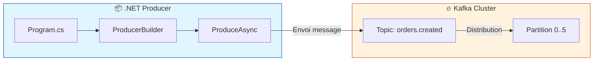
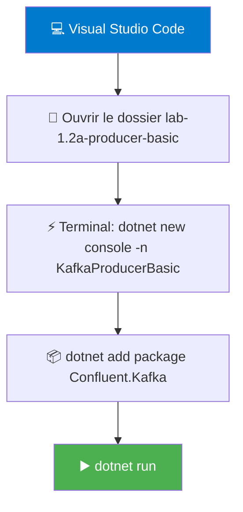
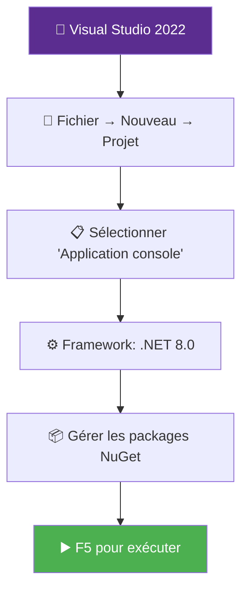
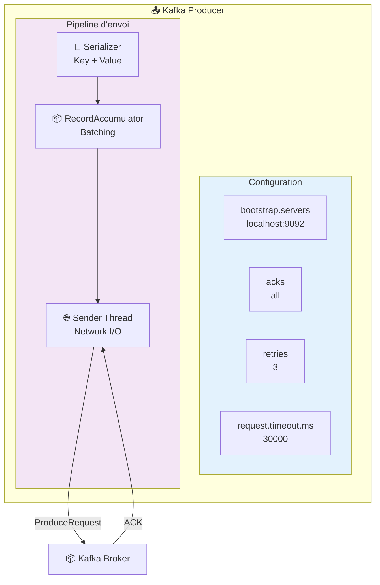
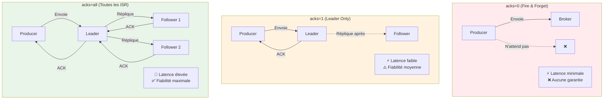
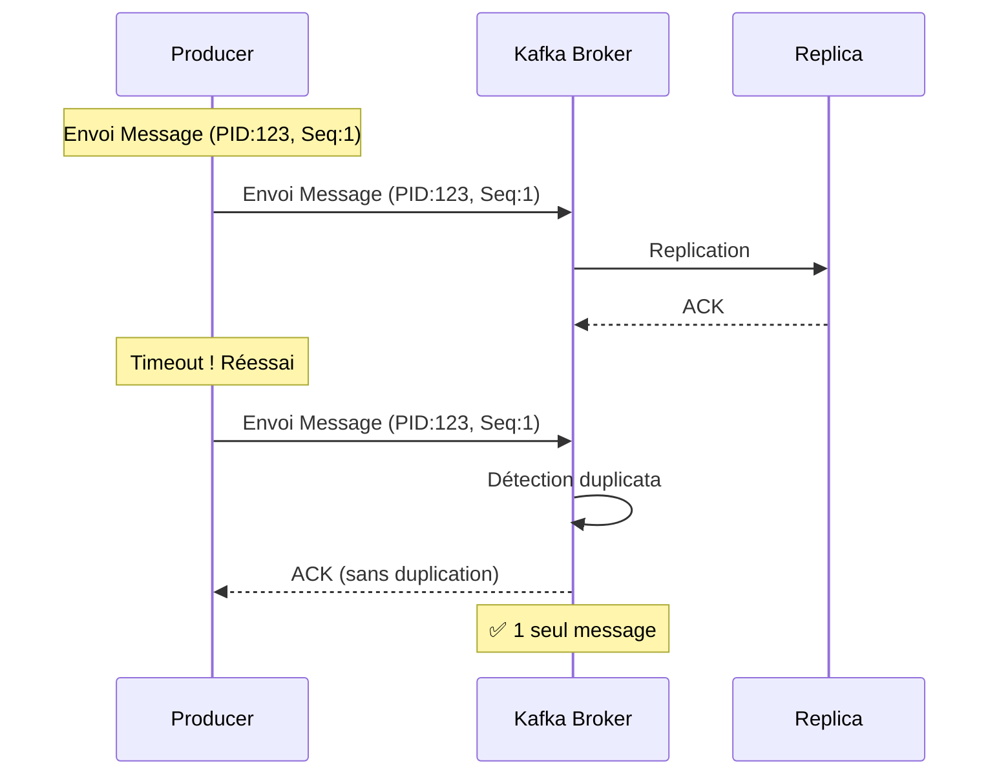
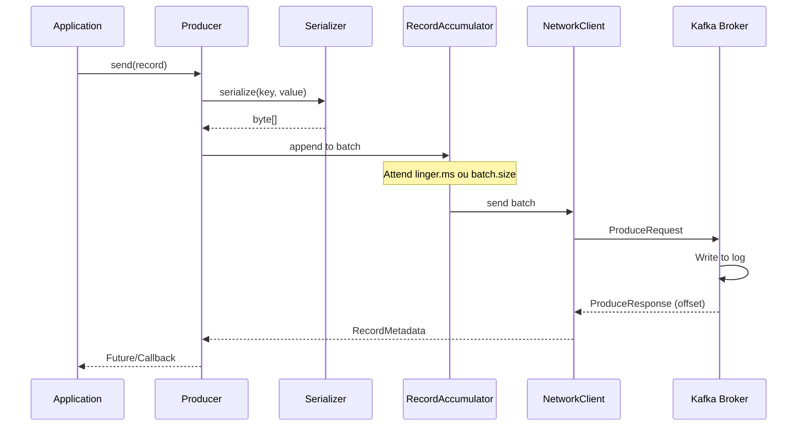
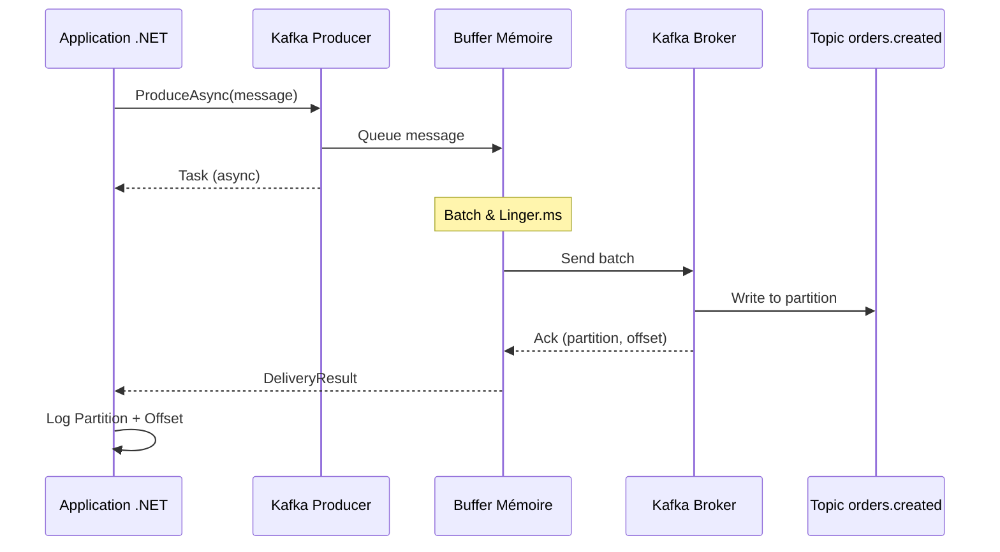

# LAB 1.2A : Producer Synchrone Basique

## ⏱️ Durée estimée : 30 minutes

## 🎯 Objectif

Créer une application console .NET qui envoie des messages simples (string) à Kafka avec gestion d'erreurs de base.

### Architecture du Lab



Ce diagramme illustre le flux de données : votre application .NET crée un producer, qui envoie des messages au topic Kafka qui les distribue sur ses partitions.

## 📚 Ce que vous allez apprendre

- Configuration minimale d'un Producer Kafka
- Envoi de messages avec `ProduceAsync()`
- Gestion des `DeliveryResult` (partition, offset, timestamp)
- Error handlers et log handlers
- Importance du `Flush()` avant fermeture du producer
- Utilisation des headers pour métadonnées

---

## 🛠️ Quick Start (5 minutes)

Pour une exécution rapide sans lire tout le lab :

```bash
# 1. Créer et configurer
cd lab-1.2a-producer-basic
dotnet new console -n KafkaProducerBasic
cd KafkaProducerBasic
dotnet add package Confluent.Kafka --version 2.3.0
```

**Commandes** :

```bash
# Naviguer vers le dossier du lab
cd lab-1.2a-producer-basic

# Créer le projet console
dotnet new console -n KafkaProducerBasic

# Naviguer dans le projet
cd KafkaProducerBasic

# Ajouter le package Confluent.Kafka
dotnet add package Confluent.Kafka --version 2.3.0

# Ajouter les packages de logging
dotnet add package Microsoft.Extensions.Logging --version 8.0.0
dotnet add package Microsoft.Extensions.Logging.Console --version 8.0.0
```

---

## � Prérequis

### Cluster Kafka en fonctionnement

**Docker** :

```bash
cd ../../module-01-cluster
./scripts/up.sh
# Vérifier : docker ps (kafka et kafka-ui doivent être healthy)
```

**OKD/K3s** :

```bash
kubectl get kafka -n kafka
# Attendu : bhf-kafka avec status Ready
```

### Créer le topic

**Docker** :

```bash
docker exec kafka /opt/kafka/bin/kafka-topics.sh \
  --bootstrap-server localhost:9092 \
  --create --if-not-exists \
  --topic orders.created \
  --partitions 6 \
  --replication-factor 1
```

**OKD/K3s** :

```bash
kubectl run kafka-cli -it --rm --image=quay.io/strimzi/kafka:latest-kafka-4.0.0 \
  --restart=Never -n kafka -- \
  bin/kafka-topics.sh --bootstrap-server bhf-kafka-kafka-bootstrap:9092 \
  --create --if-not-exists --topic orders.created --partitions 6 --replication-factor 3
```

---

## 🚀 Instructions Pas à Pas

### Étape 1 : Créer le projet

#### 💻 Option A : Visual Studio Code (Recommandé pour débutants)

Visual Studio Code est un éditeur léger, gratuit et multiplateforme. Idéal pour les labs Kafka.

**Prérequis** :

- [Visual Studio Code](https://code.visualstudio.com/download) installé
- [.NET 8.0 SDK](https://dotnet.microsoft.com/download/dotnet/8.0) installé
- Extension C# Dev Kit (optionnel mais recommandé)



**Commandes** :

```bash
# Naviguer vers le dossier du lab
cd lab-1.2a-producer-basic

# Créer le projet console
dotnet new console -n KafkaProducerBasic

# Naviguer dans le projet
cd KafkaProducerBasic

# Ajouter le package Confluent.Kafka
dotnet add package Confluent.Kafka --version 2.3.0

# Ajouter les packages de logging
dotnet add package Microsoft.Extensions.Logging --version 8.0.0
dotnet add package Microsoft.Extensions.Logging.Console --version 8.0.0
```

**Dans VS Code** :
1. `Ctrl+J` pour ouvrir le terminal intégré
2. `F5` pour déboguer ou `Ctrl+F5` pour exécuter sans débogage
3. `Ctrl+Shift+P` → ".NET: Generate Assets for Build and Debug" (pour créer launch.json)

---

#### 🎨 Option B : Visual Studio 2022 (IDE complet)

Visual Studio 2022 offre une expérience IDE complète avec IntelliSense avancé, débogage graphique et designers visuels.

**Prérequis** :
- [Visual Studio 2022](https://visualstudio.microsoft.com/vs/) installé
- Workload **"Développement .NET Desktop"** sélectionné lors de l'installation



**Instructions détaillées** :

1.  **Fichier** → **Nouveau** → **Projet** (`Ctrl+Shift+N`)

2.  Sélectionner **Application console** (pas "Application console (.NET Framework)")

    ```
    Modèles > C# > Application console
    ```

3.  Configuration du projet :

    | Paramètre | Valeur |
    |-----------|--------|
    | Nom du projet | `KafkaProducerBasic` |
    | Emplacement | `lab-1.2a-producer-basic` |
    | Framework | **.NET 8.0** |

4.  Ajouter les packages NuGet :

    - Clic droit sur le projet → **Gérer les packages NuGet**
    - Onglet **Parcourir**, rechercher et installer :
      - ✅ `Confluent.Kafka` version **2.3.0**
      - ✅ `Microsoft.Extensions.Logging` version **8.0.0**
      - ✅ `Microsoft.Extensions.Logging.Console` version **8.0.0**

5.  Exécuter le projet :

    - **F5** : Exécuter avec débogage (breakpoints, inspection variables)
    - **Ctrl+F5** : Exécuter sans débogage (plus rapide)

---

#### 📊 Comparaison VS Code vs Visual Studio

| Critère | VS Code | Visual Studio 2022 |
|---------|---------|---------------------|
| **Poids** | Léger (~300MB) | Lourd (~2-3GB) |
| **Prix** | Gratuit | Gratuit (Community) |
| **Débogage** | Basique | Avancé (points d'arrêt conditionnels, visualization) |
| **IntelliSense** | Bon | Excellent |
| **Idéal pour** | Labs, scripts | Projets complexes, équipes |
| **Multiplateforme** | ✅ Windows/Mac/Linux | ⚠️ Windows uniquement |

---

### Étape 2 : Copier le code

Remplacez le contenu de `Program.cs` par le code fourni dans ce dossier.

**Fichiers fournis** :
- ✅ `Program.cs` - Code principal du producer
- ✅ `KafkaProducerBasic.csproj` - Configuration du projet
- ✅ `appsettings.json` - Configuration (optionnel)

---

### Étape 3 : Comprendre le code

#### 🎯 Concepts Fondamentaux du Producer

##### 3.1 Architecture du Producer



##### 3.2 Niveaux de Confirmation (ACK Levels)



**Dans notre code** : `Acks = Acks.All` pour une fiabilité maximale.

##### 3.3 Idempotence : Garantie d'Exact-Once



**Configuration pour idempotence** (non activée dans ce lab) :
```csharp
EnableIdempotence = true,  // Active déduplication automatique
Acks = Acks.All,           // Requis pour idempotence
MaxInFlight = 5             // Max 5 requêtes simultanées
```

##### 3.4 Cycle de vie d'un message



#### Configuration du Producer

```csharp
var config = new ProducerConfig
{
    // Adresse du cluster Kafka
    BootstrapServers = "localhost:9092",  // Docker
    // BootstrapServers = "bhf-kafka-kafka-bootstrap:9092",  // OKD/K3s
    
    // Identification du client (pour logs et monitoring)
    ClientId = "dotnet-basic-producer",
    
    // Garantie de livraison : attendre confirmation de tous les ISR
    Acks = Acks.All,
    
    // Retry automatique en cas d'erreur retriable
    MessageSendMaxRetries = 3,
    RetryBackoffMs = 1000,
    RequestTimeoutMs = 30000
};
```

**Points clés** :
- `BootstrapServers` : Adresse du cluster (adapter selon votre environnement)
- `Acks.All` : Garantie maximale (tous les réplicas synchronisés)
- Retry automatique pour erreurs transientes

#### Création du Producer avec Handlers

```csharp
using var producer = new ProducerBuilder<Null, string>(config)
    .SetErrorHandler((_, e) => 
    {
        // Gestion des erreurs fatales et non-fatales
        logger.LogError("Producer error: Code={Code}, Reason={Reason}", 
            e.Code, e.Reason);
        if (e.IsFatal)
        {
            Environment.Exit(1);  // Arrêt si erreur fatale
        }
    })
    .SetLogHandler((_, logMessage) => 
    {
        // Logs internes de Kafka
        logger.Log(logLevel, "Kafka internal log: {Message}", logMessage.Message);
    })
    .Build();
```

**Points clés** :
- `<Null, string>` : Type de la clé (Null = pas de clé) et valeur (string)
- `SetErrorHandler` : Callback pour erreurs
- `SetLogHandler` : Logs internes de librdkafka

#### Envoi de Messages



Ce diagramme montre le flux asynchrone : l'application envoie un message, il est mis en buffer, envoyé au broker, et la confirmation arrive avec les métadonnées (partition, offset).

```csharp
var deliveryResult = await producer.ProduceAsync(topicName, new Message<Null, string>
{
    Value = messageValue,
    Headers = new Headers
    {
        { "correlation-id", Encoding.UTF8.GetBytes(Guid.NewGuid().ToString()) },
        { "source", Encoding.UTF8.GetBytes("dotnet-producer") }
    }
});

// Confirmation de livraison
logger.LogInformation(
    "✓ Message delivered → Partition: {Partition}, Offset: {Offset}",
    deliveryResult.Partition.Value,
    deliveryResult.Offset.Value
);
```

**Points clés** :
- `ProduceAsync` : Envoi asynchrone (non-bloquant)
- `DeliveryResult` : Confirmation avec partition, offset, timestamp
- `Headers` : Métadonnées optionnelles (correlation ID, tracing)

#### Fermeture Propre

```csharp
finally
{
    // IMPORTANT : Flush des messages en attente
    producer.Flush(TimeSpan.FromSeconds(10));
    logger.LogInformation("Producer closed gracefully.");
}
```

**Points clés** :
- `Flush()` : Envoie tous les messages en buffer avant fermeture
- Timeout de 10 secondes pour éviter blocage infini

---

### Étape 4 : Configurer l'environnement

#### Docker (localhost)

Modifier `Program.cs` ligne 11 :

```csharp
BootstrapServers = "localhost:9092"
```

#### OKD/K3s

Modifier `Program.cs` ligne 11 :

```csharp
BootstrapServers = "bhf-kafka-kafka-bootstrap:9092"
```

Ou utiliser une variable d'environnement :

```csharp
BootstrapServers = Environment.GetEnvironmentVariable("KAFKA_BOOTSTRAP_SERVERS") 
                   ?? "localhost:9092"
```

---

### Étape 5 : Exécuter le producer

#### Avec Visual Studio Code

```bash
dotnet run
```

#### Avec Visual Studio 2022

1.  Appuyer sur **F5** (ou **Ctrl+F5** sans debugger)
2.  Observer les logs dans la console

---

### Étape 6 : Observer les résultats

#### Logs attendus

```
info: Program[0]
      Producer started. Connecting to localhost:9092
info: Program[0]
      Sending message 1: {"orderId": "ORD-0001", "timestamp": "2026-02-05T11:30:00Z", "amount": 110}
info: Program[0]
      ✓ Message 1 delivered → Topic: orders.created, Partition: 3, Offset: 0, Timestamp: 2026-02-05 11:30:00
info: Program[0]
      Sending message 2: {"orderId": "ORD-0002", "timestamp": "2026-02-05T11:30:01Z", "amount": 120}
info: Program[0]
      ✓ Message 2 delivered → Topic: orders.created, Partition: 1, Offset: 0, Timestamp: 2026-02-05 11:30:01
...
info: Program[0]
      All messages sent successfully!
info: Program[0]
      Flushing pending messages...
info: Program[0]
      Producer closed gracefully.
```

**Points à noter** :
- ✅ Messages répartis sur les 6 partitions (round-robin car pas de clé)
- ✅ Offset commence à 0 pour chaque partition (si topic vide)
- ✅ Pas d'erreurs de connexion
- ✅ Latence d'envoi : ~5-10ms par message

---

### Étape 7 : Vérifier dans Kafka

#### Avec Kafka UI

**Docker** : http://localhost:8080  
**OKD/K3s** : http://<NODE_IP>:30808

1. Aller dans **Topics** → **orders.created**
2. Cliquer sur **Messages**
3. Vous devez voir les 10 messages produits

#### Avec CLI Kafka

**Docker** :

```bash
docker exec kafka /opt/kafka/bin/kafka-console-consumer.sh \
  --bootstrap-server localhost:9092 \
  --topic orders.created \
  --from-beginning \
  --max-messages 10
```

**OKD/K3s** :

```bash
kubectl run kafka-cli -it --rm --image=quay.io/strimzi/kafka:latest-kafka-4.0.0 \
  --restart=Never -n kafka -- \
  bin/kafka-console-consumer.sh --bootstrap-server bhf-kafka-kafka-bootstrap:9092 \
  --topic orders.created --from-beginning --max-messages 10
```

**Résultat attendu** :

```json
{"orderId": "ORD-0001", "timestamp": "2026-02-05T11:30:00Z", "amount": 110}
{"orderId": "ORD-0002", "timestamp": "2026-02-05T11:30:01Z", "amount": 120}
...
```

---

## 🧪 Exercices Pratiques

### Exercice 1 : Modifier le nombre de messages

**Objectif** : Envoyer 50 messages au lieu de 10.

**Instructions** :

1.  Modifier la ligne `for (int i = 1; i <= 10; i++)` → `for (int i = 1; i <= 50; i++)`
2.  Relancer le producer
3.  Observer la distribution sur les partitions

**Question** : Combien de messages par partition en moyenne ?

<details>
<summary>💡 Solution</summary>

Avec 50 messages et 6 partitions, distribution attendue : ~8-9 messages par partition (peut varier légèrement avec sticky partitioner).

</details>

---

### Exercice 2 : Ajouter un header personnalisé

**Objectif** : Ajouter un header `environment` avec la valeur `dev`.

**Instructions** :

1.  Ajouter dans les headers :

    ```csharp
    { "environment", Encoding.UTF8.GetBytes("dev") }
    ```

2.  Relancer et vérifier dans Kafka UI (onglet Headers)

---

### Exercice 3 : Tester la gestion d'erreurs

**Objectif** : Observer le comportement en cas d'erreur de connexion.

**Instructions** :

1.  Arrêter Kafka : `docker stop kafka` (Docker) ou `kubectl scale kafka bhf-kafka --replicas=0 -n kafka` (K8s)
2.  Relancer le producer
3.  Observer les logs d'erreur et les retries

**Question** : Combien de retries avant échec final ?

<details>
<summary>💡 Solution</summary>

Le producer tentera 3 retries (configuré via `MessageSendMaxRetries = 3`) avec 1 seconde entre chaque (`RetryBackoffMs = 1000`).

</details>

4.  Redémarrer Kafka : `docker start kafka` ou `kubectl scale kafka bhf-kafka --replicas=3 -n kafka`

---

### Exercice 4 : Activer l'Idempotence (Avancé)

**Objectif** : Activer l'idempotence pour garantir exactly-once semantics.

**Instructions** :

1.  Modifier la configuration pour activer l'idempotence :

    ```csharp
    var config = new ProducerConfig
    {
        BootstrapServers = Environment.GetEnvironmentVariable("KAFKA_BOOTSTRAP_SERVERS") 
                           ?? "localhost:9092",
        ClientId = "dotnet-idempotent-producer",
        Acks = Acks.All,
        
        // 🔑 Activation de l'idempotence
        EnableIdempotence = true,
        MaxInFlight = 5,  // Requis pour idempotence
        
        MessageSendMaxRetries = 3,
        RetryBackoffMs = 1000,
        RequestTimeoutMs = 30000
    };
    ```

2.  Envoyer le même message deux fois avec le même clé :

    ```csharp
    for (int i = 1; i <= 2; i++)
    {
        var messageValue = $"{{\"orderId\": \"ORD-123\", \"attempt\": {i}}}";
        var deliveryResult = await producer.ProduceAsync(topicName, new Message<string, string>
        {
            Key = "customer-123",  // Même clé
            Value = messageValue
        });
        
        logger.LogInformation("Attempt {Index}: Partition {Partition}, Offset {Offset}", 
            i, deliveryResult.Partition.Value, deliveryResult.Offset.Value);
    }
    ```

3.  Observer que seul le premier message est écrit (le second est détecté comme duplicata).

<details>
<summary>💡 Explication</summary>

Avec l'idempotence activée, Kafka utilise un PID (Producer ID) et des numéros de séquence pour détecter les doublons. Le second envoi avec le même PID et numéro de séquence est ignoré.

</details>

---

### Exercice 5 : Optimisation Performance (Production-Ready)

**Objectif** : Optimiser le producer pour haute performance.

**Instructions** :

1.  Ajouter les paramètres de performance :

    ```csharp
    var config = new ProducerConfig
    {
        BootstrapServers = Environment.GetEnvironmentVariable("KAFKA_BOOTSTRAP_SERVERS") 
                           ?? "localhost:9092",
        ClientId = "dotnet-optimized-producer",
        Acks = Acks.All,
        
        // 🚀 Optimisations performance
        BatchSize = 32768,              // 32KB batch size
        LingerMs = 5,                     // Attendre 5ms pour batcher
        CompressionType = CompressionType.Snappy,  // Compression
        
        MessageSendMaxRetries = 3,
        RetryBackoffMs = 1000,
        RequestTimeoutMs = 30000
    };
    ```

2.  Envoyer 1000 messages et mesurer le temps total :

    ```csharp
    var stopwatch = System.Diagnostics.Stopwatch.StartNew();

    for (int i = 1; i <= 1000; i++)
    {
        var messageValue = $"{{\"orderId\": \"ORD-{i:D4}\", \"timestamp\": \"{DateTime.UtcNow:o}\"}}";
        await producer.ProduceAsync(topicName, new Message<Null, string>
        {
            Value = messageValue
        });
    }

    stopwatch.Stop();
    logger.LogInformation("Sent 1000 messages in {ElapsedMs}ms", stopwatch.ElapsedMilliseconds);
    logger.LogInformation("Throughput: {Throughput:F2} messages/sec", 1000.0 / stopwatch.Elapsed.TotalSeconds);
    ```

3.  Comparer avec la version non optimisée.

<details>
<summary>💡 Résultats attendus</summary>

Avec optimisation :
- **Batch size 32KB** : Groupement plus efficace
- **Linger 5ms** : Meilleur batching sans trop de latence  
- **Compression Snappy** : Réduction bande passante
- **Expected** : 2-5x plus rapide que la version basique

</details>

---

### Exercice 6 : Circuit Breaker Pattern (Expert)

**Objectif** : Implémenter un circuit breaker pour éviter les cascades d'échecs.

**Instructions** :

1.  Ajouter une classe CircuitBreaker :

    ```csharp
    public class CircuitBreakerProducer
    {
        private int _failureCount = 0;
        private DateTime _lastFailure = DateTime.MinValue;
        private readonly int _threshold = 5;
        private readonly TimeSpan _timeout = TimeSpan.FromMinutes(1);
        
        public async Task<DeliveryResult<Null, string>> SendAsync(
            IProducer<Null, string> producer, 
            string topic,
            Message<Null, string> message)
        {
            if (IsCircuitOpen())
                throw new InvalidOperationException("Circuit breaker is open");
                
            try
            {
                var result = await producer.ProduceAsync(topic, message);
                ResetCircuit();
                return result;
            }
            catch (Exception ex)
            {
                RecordFailure();
                throw;
            }
        }
        
        private bool IsCircuitOpen() => 
            _failureCount >= _threshold && 
            DateTime.UtcNow - _lastFailure < _timeout;
            
        private void RecordFailure()
        {
            _failureCount++;
            _lastFailure = DateTime.UtcNow;
        }
        
        private void ResetCircuit() => _failureCount = 0;
    }
    ```

2.  Utiliser le circuit breaker dans le producer principal.

<details>
<summary>💡 Pattern avancé</summary>

Le circuit breaker protège contre les pannes en cascade :
- **5 échecs consécutifs** → Circuit ouvert
- **1 minute** → Tentative de rétablissement
- **Succès** → Circuit fermé immédiatement

Idéal pour les environnements de production où Kafka peut être temporairement indisponible.

</details>

---

## 🔧 Troubleshooting

### Problèmes courants

| Symptôme | Cause probable | Solution |
|----------|---------------|----------|
| ❌ `Kafka Error: Local: Broker transport failure` | Kafka non démarré | `cd ../../module-01-cluster && ./scripts/up.sh` |
| ❌ `UnknownTopicOrPartitionException` | Topic non créé | Créer le topic `orders.created` (voir Étape 1) |
| ❌ Timeout après 30 secondes | Mauvais `BootstrapServers` | Vérifier Docker vs OKD configuration |
| ❌ `No such file or directory` | Mauvais dossier de travail | `cd lab-1.2a-producer-basic/KafkaProducerBasic` |

### Commandes de diagnostic

```bash
# Vérifier Kafka (Docker)
docker ps | grep kafka

# Vérifier le topic
docker exec kafka /opt/kafka/bin/kafka-topics.sh --bootstrap-server localhost:9092 --list

# Tester connectivité
docker exec kafka /opt/kafka/bin/kafka-console-producer.sh --bootstrap-server localhost:9092 --topic test
```

---

## 📊 Performance Comparison

| Configuration | Latence | Throughput | Use Case |
|---------------|---------|------------|----------|
| **Default** | 5-10ms | ~100 msg/s | Développement, debugging |
| **Optimized** | 2-5ms | ~500 msg/s | Production, haute performance |
| **Batch Mode** | 10-50ms | ~2000 msg/s | Bulk processing |

---

## ✅ Validation du Lab

Vous avez réussi ce lab si :

- [ ] **✅ Connexion réussie** : Le producer se connecte à Kafka sans erreur
- [ ] **✅ Messages envoyés** : Les 10 messages sont envoyés avec succès
- [ ] **✅ Visibilité** : Les messages sont visibles dans Kafka UI ou via CLI
- [ ] **✅ Métadonnées** : Les logs affichent partition et offset pour chaque message
- [ ] **✅ Fermeture propre** : Le producer se ferme avec `Flush()`
- [ ] **✅ Compréhension** : Vous comprenez le rôle de `Acks`, `ProduceAsync`, et `DeliveryResult`
- [ ] **🚀 Bonus** : Vous avez testé les exercices de performance

### 🎯 Points Clés à Retenir

1.  **ProduceAsync est non-bloquant** : Le message est mis en buffer et envoyé de manière asynchrone
2.  **Flush() est obligatoire** : Avant fermeture pour éviter perte de messages en attente
3.  **DeliveryResult contient les métadonnées** : Partition, offset, timestamp de livraison
4.  **Acks.All garantit durabilité** : Tous les réplicas synchronisés avant confirmation
5.  **Retry automatique** : Kafka gère les erreurs transientes automatiquement
6.  **Headers pour métadonnées** : Correlation ID, tracing, source, etc.

---

## 📖 Concepts Théoriques

### Sticky Partitioner (Kafka 2.4+)

Sans clé, Kafka utilise le **sticky partitioner** au lieu du round-robin classique :
- Messages groupés par batch sur la même partition
- Meilleure performance (moins de requêtes réseau)
- Distribution reste équilibrée sur le long terme

### Acks : Garanties de Livraison

| Acks | Garantie | Latence | Cas d'usage |
|------|----------|---------|-------------|
| `None (0)` | Aucune | Très faible | Métriques, logs non-critiques |
| `Leader (1)` | Leader uniquement | Faible | Logs applicatifs |
| `All (-1)` | Tous les ISR | Plus élevée | Transactions, commandes |

**ISR** (In-Sync Replicas) : Réplicas synchronisés avec le leader.

---

## 🚀 Prochaine Étape

Vous maîtrisez maintenant les bases du Producer Kafka !

👉 **Passez au [LAB 1.2B : Producer avec Clé](../lab-1.2b-producer-keyed/README.md)**

Dans le prochain lab, vous apprendrez :
- Comment utiliser une clé pour contrôler le partitionnement
- Garantir l'ordre des messages pour une même entité
- Éviter les hot partitions
