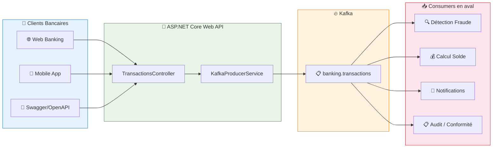
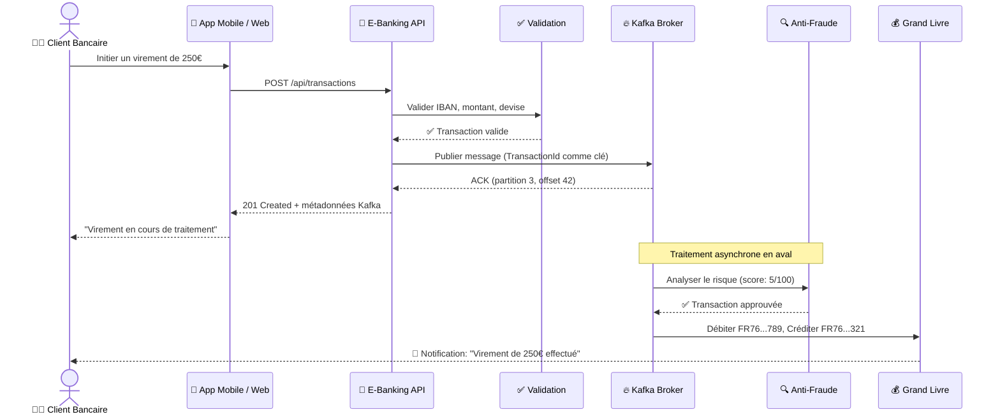
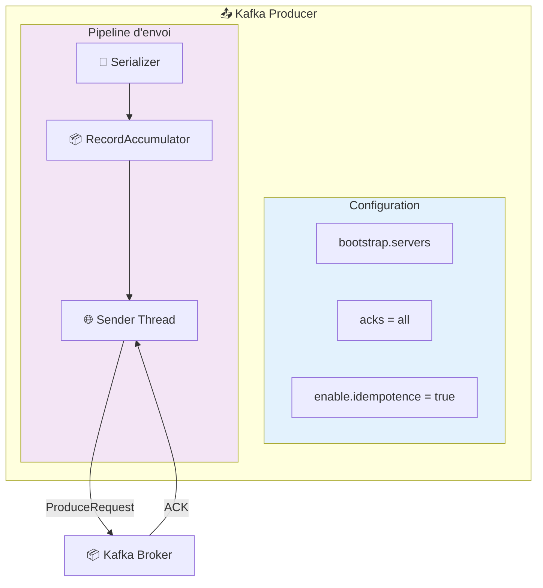
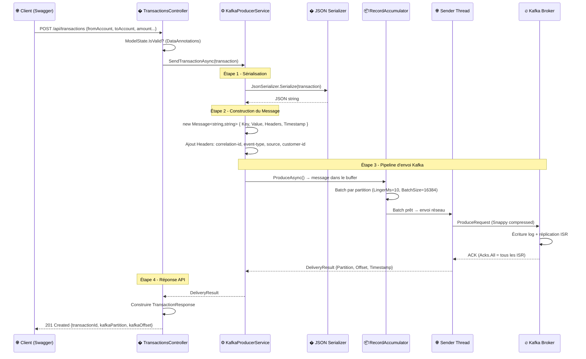
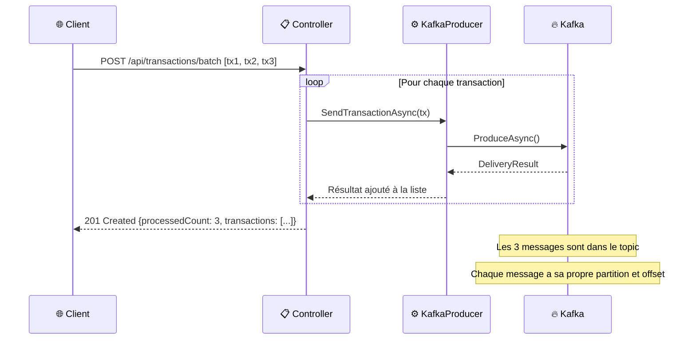

# LAB 1.2A : API Producer Basique - E-Banking Transactions

## ⏱️ Durée estimée : 45 minutes

## 🏦 Contexte E-Banking

Dans une banque moderne, chaque opération client (virement, paiement carte, retrait DAB, prélèvement) doit être **capturée en temps réel** pour alimenter les systèmes de détection de fraude, de calcul de solde, de conformité réglementaire et de notification client.

Dans ce lab, vous allez créer une **API Web ASP.NET Core** qui expose des endpoints REST pour traiter des **transactions bancaires** et les publier vers Apache Kafka. Chaque transaction sera un message Kafka, simulant le **cœur du système de traitement transactionnel** d'une banque.

### Architecture Globale



### Cycle de Vie d'une Transaction Bancaire



### Scénarios E-Banking Couverts

| Scénario | Type | Montant | Risque | Description |
| -------- | ---- | ------- | ------ | ----------- |
| **Virement mensuel** | Transfer | 250€ - 2000€ | Faible (5) | Loyer, épargne, entre comptes |
| **Paiement facture** | BillPayment | 30€ - 500€ | Faible (2) | EDF, téléphone, assurance |
| **Paiement carte** | CardPayment | 5€ - 300€ | Moyen (15) | Restaurant, courses, shopping |
| **Virement international** | InternationalTransfer | 1000€ - 50000€ | Élevé (75) | SWIFT, conformité AML requise |
| **Dépôt salaire** | Deposit | 1500€ - 5000€ | Faible (1) | Virement employeur mensuel |
| **Retrait DAB** | Withdrawal | 20€ - 500€ | Moyen (10) | Retrait espèces distributeur |

---

## 🎯 Objectifs

À la fin de ce lab, vous serez capable de :

1. Créer une **API Web ASP.NET Core** avec intégration Kafka
2. Configurer un **Kafka Producer** avec `ProducerConfig`
3. Envoyer des **transactions bancaires** via `ProduceAsync()`
4. Exploiter les **métadonnées de livraison** (partition, offset, timestamp)
5. Tester tous les endpoints via **Swagger/OpenAPI**
6. Gérer les **erreurs de base** et le cycle de vie du producer

---

## 📋 Prérequis

### Cluster Kafka en fonctionnement

**Docker** :

```bash
cd ../../module-01-cluster
./scripts/up.sh
# Vérifier : docker ps (kafka et kafka-ui doivent être healthy)
```

**OKD/K3s** :

```bash
kubectl get kafka -n kafka
# Attendu : bhf-kafka avec status Ready
```

**OpenShift Sandbox** :

> ⚠️ Assurez-vous d'avoir configuré l'accès externe (port-forward) comme décrit dans le README du module.

```bash
# Vérifiez les pods
oc get pods -l app=kafka
# Configurez les tunnels (dans 3 terminaux) :
# oc port-forward kafka-0 9094:9094
# oc port-forward kafka-1 9095:9094
# oc port-forward kafka-2 9096:9094
```

### Créer le topic

**Docker** :

```bash
docker exec kafka /opt/kafka/bin/kafka-topics.sh \
  --bootstrap-server localhost:9092 \
  --create --if-not-exists \
  --topic banking.transactions \
  --partitions 6 \
  --replication-factor 1
```

**OKD/K3s** :

```bash
kubectl run kafka-cli -it --rm --image=quay.io/strimzi/kafka:latest-kafka-4.0.0 \
  --restart=Never -n kafka -- \
  bin/kafka-topics.sh --bootstrap-server bhf-kafka-kafka-bootstrap:9092 \
  --create --if-not-exists --topic banking.transactions --partitions 6 --replication-factor 3
```

**OpenShift Sandbox** :

```bash
oc exec kafka-0 -- /opt/kafka/bin/kafka-topics.sh \
  --bootstrap-server localhost:9092 \
  --create --if-not-exists \
  --topic banking.transactions \
  --partitions 3 \
  --replication-factor 3
```

---

## 🚀 Instructions Pas à Pas

### Étape 1 : Créer le projet API Web

#### 💻 Option A : Visual Studio Code

```bash
cd lab-1.2a-producer-basic
dotnet new webapi -n EBankingProducerAPI
cd EBankingProducerAPI
dotnet add package Confluent.Kafka --version 2.3.0
dotnet add package Swashbuckle.AspNetCore --version 6.5.0
```

#### 🎨 Option B : Visual Studio 2022

1. **Fichier** → **Nouveau** → **Projet** (`Ctrl+Shift+N`)
2. Sélectionner **API Web ASP.NET Core**
3. Nom : `EBankingProducerAPI`, Framework : **.NET 8.0**
4. Clic droit projet → **Gérer les packages NuGet** :
   - `Confluent.Kafka` version **2.3.0**
   - `Swashbuckle.AspNetCore` version **6.5.0**

---

### Étape 2 : Créer le modèle Transaction

Créer le fichier `Models/Transaction.cs` :

```csharp
using System.ComponentModel.DataAnnotations;

namespace EBankingProducerAPI.Models;

public class Transaction
{
    [Required]
    public string TransactionId { get; set; } = Guid.NewGuid().ToString();

    [Required]
    [StringLength(20, MinimumLength = 10)]
    public string FromAccount { get; set; } = string.Empty;

    [Required]
    [StringLength(20, MinimumLength = 10)]
    public string ToAccount { get; set; } = string.Empty;

    [Required]
    [Range(0.01, 1_000_000.00)]
    public decimal Amount { get; set; }

    [Required]
    [StringLength(3, MinimumLength = 3)]
    public string Currency { get; set; } = "EUR";

    [Required]
    public TransactionType Type { get; set; }

    [StringLength(500)]
    public string? Description { get; set; }

    [Required]
    public string CustomerId { get; set; } = string.Empty;

    public DateTime Timestamp { get; set; } = DateTime.UtcNow;

    [Range(0, 100)]
    public int RiskScore { get; set; } = 0;

    public TransactionStatus Status { get; set; } = TransactionStatus.Pending;
}

public enum TransactionType
{
    Transfer = 1,
    Payment = 2,
    Deposit = 3,
    Withdrawal = 4,
    CardPayment = 5,
    InternationalTransfer = 6,
    BillPayment = 7
}

public enum TransactionStatus
{
    Pending = 1,
    Processing = 2,
    Completed = 3,
    Failed = 4,
    Rejected = 5
}
```

---

### Étape 3 : Créer le service Kafka Producer

Créer le fichier `Services/KafkaProducerService.cs` :

```csharp
using Confluent.Kafka;
using System.Text.Json;
using EBankingProducerAPI.Models;

namespace EBankingProducerAPI.Services;

public class KafkaProducerService : IDisposable
{
    private readonly IProducer<string, string> _producer;
    private readonly ILogger<KafkaProducerService> _logger;
    private readonly string _topic;

    public KafkaProducerService(IConfiguration config, ILogger<KafkaProducerService> logger)
    {
        _logger = logger;
        _topic = config["Kafka:Topic"] ?? "banking.transactions";

        var producerConfig = new ProducerConfig
        {
            BootstrapServers = config["Kafka:BootstrapServers"] ?? "localhost:9092",
            ClientId = config["Kafka:ClientId"] ?? "ebanking-producer-api",
            Acks = Acks.All,
            EnableIdempotence = true,
            MessageSendMaxRetries = 3,
            RetryBackoffMs = 1000,
            LingerMs = 10,
            BatchSize = 16384,
            CompressionType = CompressionType.Snappy
        };

        _producer = new ProducerBuilder<string, string>(producerConfig)
            .SetErrorHandler((_, error) =>
                _logger.LogError("Kafka Error: {Reason} (Code: {Code})", error.Reason, error.Code))
            .SetLogHandler((_, msg) =>
            {
                if (msg.Level >= SyslogLevel.Warning)
                    _logger.LogWarning("Kafka Log: {Message}", msg.Message);
            })
            .Build();

        _logger.LogInformation("Kafka Producer initialized → {Servers}, Topic: {Topic}",
            producerConfig.BootstrapServers, _topic);
    }

    public async Task<DeliveryResult<string, string>> SendTransactionAsync(
        Transaction transaction, CancellationToken ct = default)
    {
        var json = JsonSerializer.Serialize(transaction, new JsonSerializerOptions
        {
            PropertyNamingPolicy = JsonNamingPolicy.CamelCase
        });

        var message = new Message<string, string>
        {
            Key = transaction.TransactionId,
            Value = json,
            Headers = new Headers
            {
                { "correlation-id", System.Text.Encoding.UTF8.GetBytes(Guid.NewGuid().ToString()) },
                { "event-type", System.Text.Encoding.UTF8.GetBytes("transaction.created") },
                { "source", System.Text.Encoding.UTF8.GetBytes("ebanking-api") },
                { "customer-id", System.Text.Encoding.UTF8.GetBytes(transaction.CustomerId) },
                { "transaction-type", System.Text.Encoding.UTF8.GetBytes(transaction.Type.ToString()) }
            },
            Timestamp = new Timestamp(transaction.Timestamp)
        };

        var result = await _producer.ProduceAsync(_topic, message, ct);

        _logger.LogInformation(
            "✅ Transaction {Id} → Partition: {P}, Offset: {O}, Type: {Type}, Amount: {Amt} {Cur}",
            transaction.TransactionId, result.Partition.Value, result.Offset.Value,
            transaction.Type, transaction.Amount, transaction.Currency);

        return result;
    }

    public void Dispose()
    {
        _producer?.Flush(TimeSpan.FromSeconds(10));
        _producer?.Dispose();
        _logger.LogInformation("Kafka Producer disposed");
    }
}
```

---

### Étape 4 : Créer le contrôleur API

Créer le fichier `Controllers/TransactionsController.cs` :

```csharp
using Microsoft.AspNetCore.Mvc;
using EBankingProducerAPI.Models;
using EBankingProducerAPI.Services;

namespace EBankingProducerAPI.Controllers;

[ApiController]
[Route("api/[controller]")]
[Produces("application/json")]
public class TransactionsController : ControllerBase
{
    private readonly KafkaProducerService _kafka;
    private readonly ILogger<TransactionsController> _logger;

    public TransactionsController(KafkaProducerService kafka, ILogger<TransactionsController> logger)
    {
        _kafka = kafka;
        _logger = logger;
    }

    /// <summary>
    /// Créer une transaction bancaire et l'envoyer à Kafka
    /// </summary>
    /// <remarks>
    /// Exemple de requête :
    ///
    ///     POST /api/transactions
    ///     {
    ///         "fromAccount": "FR76300010001234567890",
    ///         "toAccount":   "FR76300010009876543210",
    ///         "amount": 250.00,
    ///         "currency": "EUR",
    ///         "type": 1,
    ///         "description": "Virement mensuel loyer",
    ///         "customerId": "CUST-001"
    ///     }
    ///
    /// </remarks>
    [HttpPost]
    [ProducesResponseType(typeof(TransactionResponse), StatusCodes.Status201Created)]
    [ProducesResponseType(typeof(ProblemDetails), StatusCodes.Status400BadRequest)]
    [ProducesResponseType(typeof(ProblemDetails), StatusCodes.Status500InternalServerError)]
    public async Task<ActionResult<TransactionResponse>> CreateTransaction(
        [FromBody] Transaction transaction, CancellationToken ct)
    {
        if (string.IsNullOrEmpty(transaction.TransactionId))
            transaction.TransactionId = Guid.NewGuid().ToString();

        var result = await _kafka.SendTransactionAsync(transaction, ct);

        var response = new TransactionResponse
        {
            TransactionId = transaction.TransactionId,
            Status = "Processing",
            KafkaPartition = result.Partition.Value,
            KafkaOffset = result.Offset.Value,
            Timestamp = result.Timestamp.UtcDateTime
        };

        return CreatedAtAction(nameof(GetTransaction),
            new { transactionId = transaction.TransactionId }, response);
    }

    /// <summary>
    /// Envoyer un lot de transactions bancaires
    /// </summary>
    [HttpPost("batch")]
    [ProducesResponseType(typeof(BatchResponse), StatusCodes.Status201Created)]
    [ProducesResponseType(typeof(ProblemDetails), StatusCodes.Status400BadRequest)]
    public async Task<ActionResult<BatchResponse>> CreateBatch(
        [FromBody] List<Transaction> transactions, CancellationToken ct)
    {
        var results = new List<TransactionResponse>();

        foreach (var tx in transactions)
        {
            if (string.IsNullOrEmpty(tx.TransactionId))
                tx.TransactionId = Guid.NewGuid().ToString();

            var dr = await _kafka.SendTransactionAsync(tx, ct);
            results.Add(new TransactionResponse
            {
                TransactionId = tx.TransactionId,
                Status = "Processing",
                KafkaPartition = dr.Partition.Value,
                KafkaOffset = dr.Offset.Value,
                Timestamp = dr.Timestamp.UtcDateTime
            });
        }

        return Created("", new BatchResponse
        {
            ProcessedCount = results.Count,
            Transactions = results
        });
    }

    /// <summary>
    /// Obtenir le statut d'une transaction (placeholder)
    /// </summary>
    [HttpGet("{transactionId}")]
    [ProducesResponseType(typeof(TransactionResponse), StatusCodes.Status200OK)]
    public ActionResult<TransactionResponse> GetTransaction(string transactionId)
    {
        return Ok(new TransactionResponse
        {
            TransactionId = transactionId,
            Status = "Processing",
            Timestamp = DateTime.UtcNow
        });
    }

    /// <summary>
    /// Health check du service
    /// </summary>
    [HttpGet("health")]
    [ProducesResponseType(typeof(object), StatusCodes.Status200OK)]
    public ActionResult GetHealth()
    {
        return Ok(new { Status = "Healthy", Service = "EBanking Producer API", Timestamp = DateTime.UtcNow });
    }
}

// --- Response DTOs ---

public class TransactionResponse
{
    public string TransactionId { get; set; } = string.Empty;
    public string Status { get; set; } = string.Empty;
    public int KafkaPartition { get; set; }
    public long KafkaOffset { get; set; }
    public DateTime Timestamp { get; set; }
}

public class BatchResponse
{
    public int ProcessedCount { get; set; }
    public List<TransactionResponse> Transactions { get; set; } = new();
}
```

---

### Étape 5 : Configurer Program.cs

Remplacer le contenu de `Program.cs` :

```csharp
using EBankingProducerAPI.Services;
using Microsoft.OpenApi.Models;
using System.Reflection;

var builder = WebApplication.CreateBuilder(args);

builder.Services.AddControllers();
builder.Services.AddSingleton<KafkaProducerService>();

builder.Services.AddEndpointsApiExplorer();
builder.Services.AddSwaggerGen(options =>
{
    options.SwaggerDoc("v1", new OpenApiInfo
    {
        Title = "E-Banking Producer API",
        Version = "v1",
        Description = "API de traitement de transactions bancaires avec Apache Kafka.\n\n"
            + "**Endpoints disponibles :**\n"
            + "- `POST /api/transactions` — Créer une transaction\n"
            + "- `POST /api/transactions/batch` — Envoyer un lot\n"
            + "- `GET /api/transactions/{id}` — Statut d'une transaction\n"
            + "- `GET /api/transactions/health` — Health check",
        Contact = new OpenApiContact { Name = "E-Banking Team" }
    });

    var xmlFile = $"{Assembly.GetExecutingAssembly().GetName().Name}.xml";
    var xmlPath = Path.Combine(AppContext.BaseDirectory, xmlFile);
    if (File.Exists(xmlPath))
        options.IncludeXmlComments(xmlPath);
});

var app = builder.Build();

app.UseSwagger();
app.UseSwaggerUI(c =>
{
    c.SwaggerEndpoint("/swagger/v1/swagger.json", "E-Banking Producer API v1");
    c.RoutePrefix = "swagger";
});

app.MapControllers();

var logger = app.Services.GetRequiredService<ILogger<Program>>();
logger.LogInformation("========================================");
logger.LogInformation("  E-Banking Producer API");
logger.LogInformation("  Swagger UI : https://localhost:5001/swagger");
logger.LogInformation("  Kafka      : {Servers}", builder.Configuration["Kafka:BootstrapServers"] ?? "localhost:9092");
logger.LogInformation("  Topic      : {Topic}", builder.Configuration["Kafka:Topic"] ?? "banking.transactions");
logger.LogInformation("========================================");

app.Run();
```

---

### Étape 6 : Configurer appsettings.json

```json
{
  "Logging": {
    "LogLevel": {
      "Default": "Information",
      "Microsoft.AspNetCore": "Warning"
    }
  },
  "Kafka": {
    "BootstrapServers": "localhost:9092",
    "Topic": "banking.transactions",
    "ClientId": "ebanking-producer-api"
  }
}
```

> **OKD/K3s** : Remplacer `localhost:9092` par `bhf-kafka-kafka-bootstrap:9092`

> **OpenShift Sandbox (Localisé)** : Utilisez `localhost:9094` et assurez-vous que les tunnels sont actifs.

---

### Étape 7 : Exécuter et tester

#### Lancer l'API

```bash
dotnet run
```

L'API démarre sur `https://localhost:5001` (ou le port configuré).

#### Ouvrir Swagger UI

Naviguer vers : **<https://localhost:5001/swagger>**

Vous verrez l'interface OpenAPI avec tous les endpoints documentés.

---

## 🧪 Tests OpenAPI (Swagger)

### Test 1 : Créer un virement bancaire

Dans Swagger UI, cliquer sur **POST /api/transactions** → **Try it out** :

```json
{
  "fromAccount": "FR7630001000123456789",
  "toAccount": "FR7630001000987654321",
  "amount": 250.00,
  "currency": "EUR",
  "type": 1,
  "description": "Virement mensuel loyer",
  "customerId": "CUST-001",
  "riskScore": 5
}
```

**Réponse attendue** (201 Created) :

```json
{
  "transactionId": "a1b2c3d4-...",
  "status": "Processing",
  "kafkaPartition": 3,
  "kafkaOffset": 0,
  "timestamp": "2026-02-06T00:00:00Z"
}
```

### Test 2 : Paiement de facture

```json
{
  "fromAccount": "FR7630001000123456789",
  "toAccount": "FR7630001000111222333",
  "amount": 89.99,
  "currency": "EUR",
  "type": 7,
  "description": "Facture électricité EDF",
  "customerId": "CUST-001",
  "riskScore": 2
}
```

### Test 3 : Virement international (risque élevé)

```json
{
  "fromAccount": "FR7630001000123456789",
  "toAccount": "GB29NWBK60161331926819",
  "amount": 15000.00,
  "currency": "EUR",
  "type": 6,
  "description": "International transfer to UK",
  "customerId": "CUST-002",
  "riskScore": 75
}
```

### Test 4 : Lot de transactions (batch)

Cliquer sur **POST /api/transactions/batch** → **Try it out** :

```json
[
  {
    "fromAccount": "FR7630001000123456789",
    "toAccount": "FR7630001000111111111",
    "amount": 50.00,
    "currency": "EUR",
    "type": 2,
    "description": "Paiement abonnement Netflix",
    "customerId": "CUST-001"
  },
  {
    "fromAccount": "FR7630001000123456789",
    "toAccount": "FR7630001000222222222",
    "amount": 120.00,
    "currency": "EUR",
    "type": 2,
    "description": "Paiement assurance auto",
    "customerId": "CUST-001"
  },
  {
    "fromAccount": "FR7630001000123456789",
    "toAccount": "FR7630001000333333333",
    "amount": 35.00,
    "currency": "EUR",
    "type": 5,
    "description": "Paiement carte restaurant",
    "customerId": "CUST-001"
  }
]
```

### Test 5 : Health check

Cliquer sur **GET /api/transactions/health** → **Try it out** → **Execute**

**Réponse attendue** :

```json
{
  "status": "Healthy",
  "service": "EBanking Producer API",
  "timestamp": "2026-02-06T00:00:00Z"
}
```

---

## 📊 Vérifier dans Kafka

### Avec Kafka UI

**Docker** : <http://localhost:8080>

1. Aller dans **Topics** → **banking.transactions**
2. Cliquer sur **Messages**
3. Vérifier les transactions envoyées avec leurs headers

### Avec CLI Kafka

```bash
docker exec kafka /opt/kafka/bin/kafka-console-consumer.sh \
  --bootstrap-server localhost:9092 \
  --topic banking.transactions \
  --from-beginning \
  --max-messages 10
```

**OpenShift Sandbox** :

```bash
oc exec kafka-0 -- /opt/kafka/bin/kafka-console-consumer.sh \
  --bootstrap-server localhost:9092 \
  --topic banking.transactions \
  --from-beginning \
  --max-messages 10
```

**Résultat attendu** :

```json
{"transactionId":"a1b2c3d4-...","fromAccount":"FR7630001000123456789","toAccount":"FR7630001000987654321","amount":250.00,"currency":"EUR","type":1,"description":"Virement mensuel loyer","customerId":"CUST-001","timestamp":"2026-02-06T00:00:00Z","riskScore":5,"status":1}
```

---

## ☁️ Déploiement sur OpenShift Sandbox

> **🎯 Objectif** : Ce déploiement ne se limite pas à mettre l'API en ligne. L'objectif est de **valider les concepts fondamentaux du Producer Kafka** dans un environnement cloud réel :
> - **Envoi de messages** vers un topic Kafka depuis une API REST
> - **Partition et Offset** : chaque message reçoit une partition (round-robin) et un offset séquentiel
> - **Acknowledgment (acks)** : le broker confirme la réception du message
> - **Vérification via Kafka CLI** : consommer les messages produits pour confirmer le flux de bout en bout

### 🚀 Déploiement Automatisé (Recommandé)

> [!TIP]
> Utilisez les scripts de déploiement automatisé pour un déploiement complet avec validation des objectifs du lab.

**Option 1 : Script Bash (Linux/macOS/WSL)**
```bash
# Depuis la racine du repository
cd day-01-foundations/scripts
./deploy-and-test-1.2a.sh
```

**Option 2 : Script PowerShell (Windows)**
```powershell
# Depuis la racine du repository
cd day-01-foundations/scripts
.\deploy-and-test-1.2a.ps1
```

Ces scripts effectuent automatiquement :
- ✅ Build de l'application
- ✅ Déploiement sur OpenShift
- ✅ Configuration des variables d'environnement
- ✅ Création de la route sécurisée
- ✅ Tests d'accessibilité (Health, Swagger)
- ✅ Validation des objectifs du lab (production, sérialisation, partition, batch)
- ✅ Vérification du topic Kafka

---

### Déploiement Manuel (Étape par Étape)

Si vous préférez déployer manuellement pour comprendre chaque étape :

### 1. Préparer le déploiement

Assurez-vous d'être dans le dossier du projet :
```bash
cd EBankingProducerAPI
```

### 2. Déployer avec `oc new-app`

Nous allons utiliser la stratégie "Source-to-Image" (S2I) ou "Binary Build" de OpenShift.

```bash
# Créer une build binaire pour .NET
oc new-build dotnet:8.0-ubi8 --binary=true --name=ebanking-producer-api

# Lancer la build en envoyant le dossier courant
oc start-build ebanking-producer-api --from-dir=. --follow

# Créer l'application
oc new-app ebanking-producer-api
```

### 3. Configurer les variables d'environnement

L'API doit savoir où se trouve Kafka (interne au cluster).

```bash
oc set env deployment/ebanking-producer-api \
  Kafka__BootstrapServers=kafka-svc:9092 \
  Kafka__Topic=banking.transactions \
  ASPNETCORE_URLS=http://0.0.0.0:8080 \
  ASPNETCORE_ENVIRONMENT=Development
```

### 4. Exposer publiquement (Secure Edge Route)

> [!IMPORTANT]
> Standard routes may hang on the Sandbox. Use an **edge route** for reliable public access.

```bash
oc create route edge ebanking-producer-api --service=ebanking-producer-api --port=8080-tcp
```

### 5. Obtenir l'URL publique

```bash
HOST=$(oc get route ebanking-producer-api -o jsonpath='{.spec.host}')
echo "Swagger UI : https://$HOST/swagger"
```

Ouvrez cette URL dans votre navigateur pour accéder à Swagger UI.

### 5.1 ✅ Vérification du Déploiement

Après avoir exécuté les étapes ci-dessus, vérifiez que tout fonctionne correctement :

#### Étape 1 : Vérifier le build
```bash
# Le build doit afficher "Build successful!" à la fin
oc start-build ebanking-producer-api --from-dir=. --follow
```
**Résultat attendu** : `Build successful! Now deploying the application:`

#### Étape 2 : Vérifier le déploiement
```bash
# Vérifier que le pod est en cours d'exécution
oc get pod -l app=ebanking-producer-api
```
**Résultat attendu** : Pod avec status `Running` et `1/1` dans la colonne `READY`

#### Étape 3 : Vérifier la configuration
```bash
# Vérifier les variables d'environnement
oc env deployment/ebanking-producer-api --list
```
**Résultat attendu** : Doit contenir `Kafka__BootstrapServers=kafka-svc:9092`

#### Étape 4 : Vérifier la route
```bash
# Vérifier que la route a été créée
oc get route ebanking-producer-api-secure
```
**Résultat attendu** : Route avec le bon HOST et service `ebanking-producer-api`

#### Étape 5 : Vérifier le health endpoint
```bash
# Tester le endpoint de santé
curl -k -s "https://$HOST/api/Transactions/health"
```
**Résultat attendu** :
```json
{
  "status": "Healthy",
  "service": "EBanking Producer API",
  "timestamp": "2026-02-08T23:38:25.2965637Z"
}
```

#### Étape 6 : Envoyer une transaction de test
```bash
# Créer un fichier de test
cat > test-transaction.json << EOF
{
  "fromAccount": "FR7630001000123456",
  "toAccount": "FR7630001000987654",
  "amount": 1500.00,
  "currency": "EUR",
  "type": 1,
  "description": "Test transaction",
  "customerId": "CUST-001"
}
EOF

# Envoyer la transaction
curl -k -s -X POST "https://$HOST/api/Transactions" \
  -H "Content-Type: application/json" \
  -d @test-transaction.json
```
**Résultat attendu** :
```json
{
  "transactionId": "b4692c60-873c-4c43-83d1-586dbeda75b9",
  "status": "Processing",
  "kafkaPartition": 1,
  "kafkaOffset": 1,
  "timestamp": "2026-02-08T23:39:11.109Z"
}
```

#### Étape 7 : Vérifier dans Kafka
```bash
# Vérifier que le message est bien dans Kafka
oc exec kafka-0 -- /opt/kafka/bin/kafka-console-consumer.sh \
  --bootstrap-server localhost:9092 \
  --topic banking.transactions \
  --from-beginning \
  --max-messages 1
```
**Résultat attendu** : Le message JSON de la transaction doit apparaître

### 📊 Résumé du Déploiement Réussi

✅ **Build completed** - .NET 8 application built successfully  
✅ **Deployment created** - Pod is running on OpenShift  
✅ **Environment configured** - Kafka connection set to `kafka-svc:9092`  
✅ **Route created** - API accessible at: `https://ebanking-producer-api-secure-msellamitn-dev.apps.rm3.7wse.p1.openshiftapps.com`  
✅ **Health check passed** - API responding correctly  
✅ **Transaction sent** - Successfully sent to Kafka topic `banking.transactions`  
✅ **Message verified** - Confirmed in Kafka with partition 1, offset 1

### 7. 🧪 Scénarios de Test et Validation des Concepts

#### Scénario 1 : Envoyer une transaction simple (POST /api/Transactions)

Dans Swagger UI, cliquer sur **POST /api/Transactions** → **Try it out** :

```json
{
  "fromAccount": "FR7630001000123456789",
  "toAccount": "FR7630001000987654321",
  "amount": 1500.00,
  "currency": "EUR",
  "type": 1,
  "description": "Virement salaire janvier",
  "customerId": "CUST-001"
}
```

Ou via `curl` :

```bash
curl -k -s -X POST "https://$HOST/api/Transactions" \
  -H "Content-Type: application/json" \
  -d '{
    "fromAccount": "FR7630001000123456789",
    "toAccount": "FR7630001000987654321",
    "amount": 1500.00,
    "currency": "EUR",
    "type": 1,
    "description": "Virement salaire janvier",
    "customerId": "CUST-001"
  }' | jq .
```

**Réponse attendue (201 Created)** :

```json
{
  "transactionId": "a1b2c3d4-...",
  "status": "Processing",
  "kafkaPartition": 3,
  "kafkaOffset": 0,
  "timestamp": "2026-02-08T22:00:00Z"
}
```

**📖 Concepts observés** :

| Champ | Concept Kafka |
| ----- | ------------- |
| `kafkaPartition: 3` | Le broker assigne une partition via **round-robin** (pas de clé spécifiée) |
| `kafkaOffset: 0` | Offset séquentiel — premier message de cette partition |
| `status: "Processing"` | Envoi **fire-and-forget** — le producer n'attend pas le traitement |

#### Scénario 3 : Envoyer un lot de transactions (POST /api/Transactions/batch)

```bash
curl -k -s -X POST "https://$HOST/api/Transactions/batch" \
  -H "Content-Type: application/json" \
  -d '[
    {"fromAccount": "FR7630001000111111111", "toAccount": "FR7630001000222222222", "amount": 100.00, "currency": "EUR", "type": 1, "description": "Virement 1", "customerId": "CUST-001"},
    {"fromAccount": "FR7630001000333333333", "toAccount": "FR7630001000444444444", "amount": 250.00, "currency": "EUR", "type": 2, "description": "Paiement facture", "customerId": "CUST-002"},
    {"fromAccount": "FR7630001000555555555", "toAccount": "GB29NWBK60161331926819", "amount": 5000.00, "currency": "EUR", "type": 6, "description": "Transfert international", "customerId": "CUST-003"}
  ]' | jq .
```

**📖 Concepts observés** :
- Les 3 transactions arrivent sur des **partitions potentiellement différentes** (round-robin sans clé)
- Chaque message reçoit un **offset séquentiel** au sein de sa partition
- Le batch n'est **pas atomique** : chaque message est produit indépendamment

#### Scénario 4 : Vérifier les messages dans Kafka (CLI)

```bash
# Consommer les messages du topic depuis le début
oc exec kafka-0 -- /opt/kafka/bin/kafka-console-consumer.sh \
  --bootstrap-server localhost:9092 \
  --topic banking.transactions \
  --from-beginning \
  --max-messages 10
```

**Vérification** : Vous devez voir les transactions envoyées en format JSON, confirmant que le Producer a bien écrit dans le topic.

```bash
# Vérifier les offsets par partition
oc exec kafka-0 -- /opt/kafka/bin/kafka-run-class.sh kafka.tools.GetOffsetShell \
  --broker-list localhost:9092 \
  --topic banking.transactions
```

**Sortie attendue** (exemple avec 6 partitions) :

```text
banking.transactions:0:2
banking.transactions:1:1
banking.transactions:2:0
banking.transactions:3:1
banking.transactions:4:0
banking.transactions:5:0
```

Chaque ligne montre `topic:partition:dernier_offset`. Cela confirme la **distribution round-robin** des messages sans clé.

#### Scénario 5 : Health Check et monitoring

```bash
curl -k -s "https://$HOST/api/Transactions/health" | jq .
```

**Réponse attendue** :

```json
{
  "status": "Healthy",
  "service": "EBanking Producer API",
  "timestamp": "2026-02-08T22:05:00Z"
}
```

#### Récapitulatif des Endpoints

| Méthode | Endpoint | Objectif pédagogique |
| ------- | -------- | -------------------- |
| `POST` | `/api/Transactions` | Produire un message Kafka (fire-and-forget) |
| `POST` | `/api/Transactions/batch` | Produire plusieurs messages en séquence |
| `GET` | `/api/Transactions/{id}` | Obtenir le statut d'une transaction |
| `GET` | `/api/Transactions/health` | Vérifier la disponibilité du service |

### 8. Stability Warning

For Sandbox environments, use `Acks = Acks.Leader` and `EnableIdempotence = false` in `ProducerConfig` to avoid `Coordinator load in progress` hangs.

### 9. Troubleshooting (Sandbox)

- **503 Service Unavailable** :
    - Vérifiez que le pod est `Running` : `oc get pods -l deployment=ebanking-producer-api`
    - Vérifiez les logs : `oc logs -l deployment=ebanking-producer-api`
    - Assurez-vous que l'application écoute sur le port 8080. Si elle écoute sur 5000/5001 (défaut local), mettez à jour la variable d'environnement :
      ```bash
      oc set env deployment/ebanking-producer-api ASPNETCORE_URLS="http://0.0.0.0:8080"
      ```

- **Kafka Error: Coordinator load in progress** :
    - Cela signifie que le cluster Kafka est en train d'élire les leaders pour les transactions internes. Cela peut prendre quelques minutes sur un cluster Sandbox frais.
    - Solution : Attendez 5 minutes et rééssayez. Ou redémarrez les pods Kafka : `oc delete pods -l app=kafka`.

---

## 🖥️ Déploiement Local OpenShift (CRC / OpenShift Local)

Si vous disposez d'un cluster **OpenShift Local** (anciennement CRC — CodeReady Containers), vous pouvez déployer l'API directement depuis votre machine.

### 1. Prérequis

```bash
# Vérifier que le cluster est démarré
crc status

# Se connecter au cluster
oc login -u developer https://api.crc.testing:6443
oc project ebanking-labs
```

### 2. Build et Déploiement (Binary Build)

```bash
cd EBankingProducerAPI

# Créer la build config et lancer le build
oc new-build dotnet:8.0-ubi8 --binary=true --name=ebanking-producer-api
oc start-build ebanking-producer-api --from-dir=. --follow

# Créer l'application
oc new-app ebanking-producer-api
```

### 3. Configurer les variables d'environnement

```bash
oc set env deployment/ebanking-producer-api \
  Kafka__BootstrapServers=kafka-svc:9092 \
  Kafka__Topic=banking.transactions \
  ASPNETCORE_URLS=http://0.0.0.0:8080 \
  ASPNETCORE_ENVIRONMENT=Development
```

### 4. Exposer et tester

```bash
# Créer une route edge
oc create route edge ebanking-producer-api-secure --service=ebanking-producer-api --port=8080-tcp

# Obtenir l'URL
URL=$(oc get route ebanking-producer-api-secure -o jsonpath='{.spec.host}')
echo "https://$URL/swagger"

# Tester
curl -k -i "https://$URL/api/Transactions/health"
```

### 5. 🧪 Validation des concepts (CRC)

```bash
# Obtenir l'URL
URL=$(oc get route ebanking-producer-api-secure -o jsonpath='{.spec.host}')

# Envoyer une transaction
curl -k -s -X POST "https://$URL/api/Transactions" \
  -H "Content-Type: application/json" \
  -d '{"fromAccount":"FR7630001000123456789","toAccount":"FR7630001000987654321","amount":1500.00,"currency":"EUR","type":1,"description":"Test CRC","customerId":"CUST-001"}' | jq .

# Vérifier les messages dans Kafka
oc exec kafka-0 -- /opt/kafka/bin/kafka-console-consumer.sh \
  --bootstrap-server localhost:9092 \
  --topic banking.transactions \
  --from-beginning --max-messages 5

# Vérifier la distribution des offsets par partition
oc exec kafka-0 -- /opt/kafka/bin/kafka-run-class.sh kafka.tools.GetOffsetShell \
  --broker-list localhost:9092 --topic banking.transactions
```

### 6. Alternative : Déploiement par manifeste YAML

```bash
sed "s/\${NAMESPACE}/ebanking-labs/g" deployment/openshift-deployment.yaml | oc apply -f -
```

---

## ☸️ Déploiement Kubernetes / OKD (K3s, K8s, OKD)

Pour un cluster **Kubernetes standard** (K3s, K8s, Minikube) ou **OKD**, utilisez les manifestes YAML fournis dans le dossier `deployment/`.

### 1. Construire l'image Docker

```bash
cd EBankingProducerAPI

# Build de l'image
docker build -t ebanking-producer-api:latest .

# Pour un registry distant (adapter l'URL du registry)
docker tag ebanking-producer-api:latest <registry>/ebanking-producer-api:latest
docker push <registry>/ebanking-producer-api:latest
```

> **K3s / Minikube** : Si vous utilisez un cluster local, l'image locale suffit avec `imagePullPolicy: IfNotPresent`.

### 2. Déployer les manifestes

```bash
# Appliquer le Deployment + Service + Ingress
kubectl apply -f deployment/k8s-deployment.yaml

# Vérifier le déploiement
kubectl get pods -l app=ebanking-producer-api
kubectl get svc ebanking-producer-api
```

### 3. Configurer le Kafka Bootstrap (si différent)

```bash
kubectl set env deployment/ebanking-producer-api \
  Kafka__BootstrapServers=<kafka-bootstrap>:9092
```

### 4. Accéder à l'API

```bash
# Port-forward pour accès local
kubectl port-forward svc/ebanking-producer-api 8080:8080

# Tester
curl http://localhost:8080/api/Transactions/health
curl http://localhost:8080/swagger/index.html
```

> **Ingress** : Si vous avez un Ingress Controller (nginx, traefik), ajoutez `ebanking-producer-api.local` à votre fichier `/etc/hosts` pointant vers l'IP du cluster.

### 5. 🧪 Validation des concepts (K8s)

```bash
# Envoyer une transaction
curl -s -X POST "http://localhost:8080/api/Transactions" \
  -H "Content-Type: application/json" \
  -d '{"fromAccount":"FR7630001000123456789","toAccount":"FR7630001000987654321","amount":1500.00,"currency":"EUR","type":1,"description":"Test K8s","customerId":"CUST-001"}' | jq .

# Vérifier les messages dans Kafka (adapter le pod Kafka selon votre installation)
kubectl exec kafka-0 -- /opt/kafka/bin/kafka-console-consumer.sh \
  --bootstrap-server localhost:9092 \
  --topic banking.transactions \
  --from-beginning --max-messages 5

# Vérifier la distribution des offsets par partition
kubectl exec kafka-0 -- /opt/kafka/bin/kafka-run-class.sh kafka.tools.GetOffsetShell \
  --broker-list localhost:9092 --topic banking.transactions
```

> **Docker Compose** : Si Kafka tourne via Docker Compose, utilisez `docker exec kafka ...` au lieu de `kubectl exec kafka-0 ...`.

### 6. OKD : Utiliser les manifestes OpenShift

```bash
sed "s/\${NAMESPACE}/$(oc project -q)/g" deployment/openshift-deployment.yaml | oc apply -f -
```

---

## 🎯 Concepts Clés Expliqués

### Architecture du Producer Kafka



### Niveaux de Confirmation (ACK)

| Acks | Garantie | Latence | Cas d'usage E-Banking |
| ---- | -------- | ------- | --------------------- |
| `0` | Aucune | Très faible | Logs d'audit non-critiques |
| `1` | Leader | Faible | Notifications push |
| `all` | Tous ISR | Plus élevée | **Transactions financières** |

### Séquence Détaillée : API → Kafka (Code Expliqué)

Ce diagramme montre exactement ce que fait chaque composant du code :



### Séquence Batch : Traitement de Plusieurs Transactions



---

## 🔧 Troubleshooting

| Symptôme | Cause probable | Solution |
| -------- | -------------- | -------- |
| `Broker transport failure` | Kafka non démarré | `cd ../../module-01-cluster && ./scripts/up.sh` |
| `UnknownTopicOrPartition` | Topic non créé | Créer `banking.transactions` (voir Prérequis) |
| Swagger ne s'affiche pas | Mauvais URL | Vérifier le port dans la console de démarrage |
| 400 Bad Request | Validation échouée | Vérifier les champs requis dans le body JSON |
| Timeout 30s | Mauvais bootstrap servers | Vérifier `appsettings.json` |

---

## ✅ Validation du Lab

- [ ] L'API démarre sans erreur et Swagger UI est accessible
- [ ] `POST /api/transactions` retourne 201 avec les métadonnées Kafka
- [ ] `POST /api/transactions/batch` traite un lot de 3+ transactions
- [ ] `GET /api/transactions/health` retourne "Healthy"
- [ ] Les messages sont visibles dans Kafka UI / CLI
- [ ] Les headers Kafka contiennent `correlation-id`, `event-type`, `customer-id`
- [ ] Vous comprenez le rôle de `Acks.All`, `ProduceAsync()`, et `DeliveryResult`

---

## 🚀 Prochaine Étape

👉 **[LAB 1.2B : API Producer avec Clé - Partitionnement par Client](../lab-1.2b-producer-keyed/README.md)**

Dans le prochain lab :

- Partitionnement déterministe par `CustomerId`
- Garantie d'ordre des transactions par client
- Détection et prévention des hot partitions
