# LAB 1.2A (Java) : Producer Basique — API E-Banking Transactions

## ⏱️ Durée estimée : 30 minutes

## 🏦 Contexte E-Banking

Dans une banque, chaque transaction (virement, paiement, transfert) doit être **publiée sur Kafka** pour être consommée par d'autres services (fraude, audit, reporting). Ce lab implémente une API REST qui produit des transactions sur le topic `banking.transactions`.

## 🎯 Objectifs

À la fin de ce lab, vous serez capable de :

1. Créer un **Producer Kafka** dans une API Spring Boot
2. Configurer un `KafkaTemplate` pour la production de messages
3. Sérialiser des objets Java en JSON pour Kafka
4. Envoyer des messages de manière synchrone et asynchrone
5. Gérer les confirmations de livraison (DeliveryResult)
6. Exposer des endpoints REST pour la création de transactions

---

## 📊 Architecture

### API REST → Kafka Topic

```mermaid
flowchart LR
    subgraph API["🚀 Spring Boot API"]
        C["⚙️ TransactionController"]
        S["📦 KafkaTemplate"]
        P["📋 Transaction Producer"]
    end

    subgraph Kafka["🔥 Kafka"]
        T["📋 banking.transactions"]
    end

    subgraph Consumer["📥 Module 03 (plus tard)"]
        FD["🔍 Fraud Detection"]
        AU["📊 Audit"]
        BL["💰 Balance"]
    end

    C --> S
    S --> P
    P --> T
    T --> FD
    T --> AU
    T --> BL

    style API fill:#e8f5e8,stroke:#388e3c
    style Kafka fill:#fff3e0,stroke:#f57c00
    style Consumer fill:#e3f2fd,stroke:#1976d2
```



---

## 🏗️ Structure du Projet

```
java/
├── src/main/java/com/data2ai/kafka/producer/basic/
│   ├── EBankingProducerApplication.java
│   ├── config/
│   │   └── KafkaConfig.java
│   ├── model/
│   │   ├── Transaction.java
│   │   ├── TransactionType.java
│   │   └── TransactionStatus.java
│   ├── producer/
│   │   └── TransactionProducer.java
│   ├── controller/
│   │   └── TransactionController.java
│   └── dto/
│       └── CreateTransactionRequest.java
├── src/main/resources/
│   └── application.yml
└── pom.xml
```

---

## 📋 Étapes de Réalisation

### Étape 1 : Configuration Maven (`pom.xml`)

> **⚠️ Important** : Assurez-vous que le plugin Spring Boot Maven est correctement configuré pour créer un JAR exécutable :

```xml
<plugin>
    <groupId>org.springframework.boot</groupId>
    <artifactId>spring-boot-maven-plugin</artifactId>
    <version>${spring-boot.version}</version>
    <executions>
        <execution>
            <goals>
                <goal>repackage</goal>
            </goals>
        </execution>
    </executions>
</plugin>
```

### Étape 2 : Dépendances Maven (`pom.xml`)

```xml
<dependencies>
    <!-- Spring Boot Web -->
    <dependency>
        <groupId>org.springframework.boot</groupId>
        <artifactId>spring-boot-starter-web</artifactId>
    </dependency>

    <!-- Spring Kafka -->
    <dependency>
        <groupId>org.springframework.kafka</groupId>
        <artifactId>spring-kafka</artifactId>
    </dependency>

    <!-- Jackson pour JSON -->
    <dependency>
        <groupId>com.fasterxml.jackson.core</groupId>
        <artifactId>jackson-databind</artifactId>
    </dependency>

    <!-- Actuator pour health checks -->
    <dependency>
        <groupId>org.springframework.boot</groupId>
        <artifactId>spring-boot-starter-actuator</artifactId>
    </dependency>
</dependencies>
```

### Étape 3 : Configuration Kafka (`config/KafkaConfig.java`)

```java
@Configuration
@EnableKafka
public class KafkaConfig {

    @Value("${spring.kafka.bootstrap-servers:localhost:9092}")
    private String bootstrapServers;

    @Bean
    public ProducerFactory<String, String> producerFactory() {
        Map<String, Object> configProps = new HashMap<>();
        configProps.put(ProducerConfig.BOOTSTRAP_SERVERS_CONFIG, bootstrapServers);
        configProps.put(ProducerConfig.KEY_SERIALIZER_CLASS_CONFIG, StringSerializer.class);
        configProps.put(ProducerConfig.VALUE_SERIALIZER_CLASS_CONFIG, StringSerializer.class);
        configProps.put(ProducerConfig.ACKS_CONFIG, "all");
        configProps.put(ProducerConfig.RETRIES_CONFIG, 3);
        configProps.put(ProducerConfig.LINGER_MS_CONFIG, 10);
        configProps.put(ProducerConfig.BATCH_SIZE_CONFIG, 16384);
        return new DefaultKafkaProducerFactory<>(configProps);
    }

    @Bean
    public KafkaTemplate<String, String> kafkaTemplate() {
        return new KafkaTemplate<>(producerFactory());
    }
}
```

### Étape 4 : Modèle Transaction (`model/Transaction.java`)

```java
@Data
@AllArgsConstructor
@NoArgsConstructor
public class Transaction {
    private String transactionId;
    private String fromAccount;
    private String toAccount;
    private BigDecimal amount;
    private String currency;
    private TransactionType type;
    private String description;
    private String customerId;
    private Instant timestamp;
    private TransactionStatus status;
    private Integer kafkaPartition;
    private Long kafkaOffset;
}

public enum TransactionType {
    VIREMENT(1, "Virement"),
    PAIEMENT(2, "Paiement"),
    TRANSFERT(3, "Transfert"),
    DEPOT(4, "Dépôt"),
    RETRAIT(5, "Retrait"),
    INTERNATIONAL(6, "International");

    private final int code;
    private final String label;
}

public enum TransactionStatus {
    PENDING(0, "En attente"),
    PROCESSING(1, "En cours"),
    COMPLETED(2, "Complété"),
    FAILED(3, "Échoué");

    private final int code;
    private final String label;
}
```

### Étape 5 : Producer Kafka (`producer/TransactionProducer.java`)

```java
@Service
@Slf4j
public class TransactionProducer {

    private final KafkaTemplate<String, String> kafkaTemplate;
    private final ObjectMapper objectMapper;

    @Value("${app.kafka.topic:banking.transactions}")
    private String topic;

    public TransactionProducer(KafkaTemplate<String, String> kafkaTemplate, ObjectMapper objectMapper) {
        this.kafkaTemplate = kafkaTemplate;
        this.objectMapper = objectMapper;
    }

    public CompletableFuture<SendResult<String, String>> sendTransaction(Transaction transaction) {
        try {
            transaction.setTransactionId(UUID.randomUUID().toString());
            transaction.setTimestamp(Instant.now());
            transaction.setStatus(TransactionStatus.PENDING);

            String jsonValue = objectMapper.writeValueAsString(transaction);
            
            log.info("Sending transaction: {} | Amount: {} {} | Customer: {}",
                    transaction.getTransactionId(),
                    transaction.getAmount(),
                    transaction.getCurrency(),
                    transaction.getCustomerId());

            ListenableFuture<SendResult<String, String>> future = kafkaTemplate.send(topic, jsonValue);
            
            // Add callback for async handling
            future.addCallback(
                result -> {
                    transaction.setStatus(TransactionStatus.COMPLETED);
                    transaction.setKafkaPartition(result.getRecordMetadata().partition());
                    transaction.setKafkaOffset(result.getRecordMetadata().offset());
                    log.info("Transaction sent successfully: {} | Partition: {} | Offset: {}",
                            transaction.getTransactionId(),
                            result.getRecordMetadata().partition(),
                            result.getRecordMetadata().offset());
                },
                failure -> {
                    transaction.setStatus(TransactionStatus.FAILED);
                    log.error("Failed to send transaction: {} | Error: {}",
                            transaction.getTransactionId(),
                            failure.getMessage());
                }
            );

            return future.toCompletableFuture();
        } catch (Exception e) {
            log.error("Error preparing transaction for Kafka", e);
            throw new RuntimeException("Failed to prepare transaction", e);
        }
    }

    public Transaction sendTransactionSync(Transaction transaction) {
        try {
            transaction.setTransactionId(UUID.randomUUID().toString());
            transaction.setTimestamp(Instant.now());
            transaction.setStatus(TransactionStatus.PENDING);

            String jsonValue = objectMapper.writeValueAsString(transaction);
            
            log.info("Sending transaction synchronously: {} | Amount: {} {} | Customer: {}",
                    transaction.getTransactionId(),
                    transaction.getAmount(),
                    transaction.getCurrency(),
                    transaction.getCustomerId());

            RecordMetadata metadata = kafkaTemplate.send(topic, jsonValue).get(5, TimeUnit.SECONDS);
            
            transaction.setStatus(TransactionStatus.COMPLETED);
            transaction.setKafkaPartition(metadata.partition());
            transaction.setKafkaOffset(metadata.offset());
            
            log.info("Transaction sent successfully: {} | Partition: {} | Offset: {}",
                    transaction.getTransactionId(),
                    metadata.partition(),
                    metadata.offset());
            
            return transaction;
        } catch (Exception e) {
            transaction.setStatus(TransactionStatus.FAILED);
            log.error("Failed to send transaction synchronously: {} | Error: {}",
                    transaction.getTransactionId(),
                    e.getMessage());
            throw new RuntimeException("Failed to send transaction", e);
        }
    }
}
```

### Étape 6 : Contrôleur REST (`controller/TransactionController.java`)

```java
@RestController
@RequestMapping("/api/v1")
@Slf4j
public class TransactionController {

    private final TransactionProducer transactionProducer;

    public TransactionController(TransactionProducer transactionProducer) {
        this.transactionProducer = transactionProducer;
    }

    @PostMapping("/transactions")
    public ResponseEntity<Transaction> createTransaction(@RequestBody CreateTransactionRequest request) {
        Transaction transaction = new Transaction();
        transaction.setFromAccount(request.getFromAccount());
        transaction.setToAccount(request.getToAccount());
        transaction.setAmount(request.getAmount());
        transaction.setCurrency(request.getCurrency());
        transaction.setType(request.getType());
        transaction.setDescription(request.getDescription());
        transaction.setCustomerId(request.getCustomerId());

        try {
            // Send synchronously for immediate response
            Transaction result = transactionProducer.sendTransactionSync(transaction);
            return ResponseEntity.ok(result);
        } catch (Exception e) {
            log.error("Failed to create transaction", e);
            return ResponseEntity.status(HttpStatus.INTERNAL_SERVER_ERROR).build();
        }
    }

    @PostMapping("/transactions/async")
    public ResponseEntity<Map<String, String>> createTransactionAsync(@RequestBody CreateTransactionRequest request) {
        Transaction transaction = new Transaction();
        transaction.setFromAccount(request.getFromAccount());
        transaction.setToAccount(request.getToAccount());
        transaction.setAmount(request.getAmount());
        transaction.setCurrency(request.getCurrency());
        transaction.setType(request.getType());
        transaction.setDescription(request.getDescription());
        transaction.setCustomerId(request.getCustomerId());

        try {
            // Send asynchronously
            transactionProducer.sendTransaction(transaction);
            return ResponseEntity.ok(Map.of(
                "message", "Transaction submitted for processing",
                "status", "PENDING"
            ));
        } catch (Exception e) {
            log.error("Failed to submit transaction", e);
            return ResponseEntity.status(HttpStatus.INTERNAL_SERVER_ERROR).build();
        }
    }

    @PostMapping("/transactions/batch")
    public ResponseEntity<Map<String, Object>> createTransactionsBatch(@RequestBody List<CreateTransactionRequest> requests) {
        List<CompletableFuture<SendResult<String, String>>> futures = new ArrayList<>();
        AtomicInteger successCount = new AtomicInteger(0);
        AtomicInteger failureCount = new AtomicInteger(0);

        for (CreateTransactionRequest request : requests) {
            Transaction transaction = new Transaction();
            transaction.setFromAccount(request.getFromAccount());
            transaction.setToAccount(request.getToAccount());
            transaction.setAmount(request.getAmount());
            transaction.setCurrency(request.getCurrency());
            transaction.setType(request.getType());
            transaction.setDescription(request.getDescription());
            transaction.setCustomerId(request.getCustomerId());

            CompletableFuture<SendResult<String, String>> future = transactionProducer.sendTransaction(transaction);
            futures.add(future);
            
            future.thenAccept(result -> successCount.incrementAndGet())
                    .exceptionally(throwable -> {
                        failureCount.incrementAndGet();
                        return null;
                    });
        }

        // Wait for all to complete
        CompletableFuture.allOf(futures.toArray(new CompletableFuture[0])).join();

        return ResponseEntity.ok(Map.of(
            "total", requests.size(),
            "success", successCount.get(),
            "failed", failureCount.get(),
            "message", "Batch processing completed"
        ));
    }

    @GetMapping("/health")
    public ResponseEntity<Map<String, String>> health() {
        return ResponseEntity.ok(Map.of(
            "status", "UP",
            "service", "EBanking Producer API",
            "timestamp", Instant.now().toString()
        ));
    }
}
```

### Étape 7 : Configuration Application (`application.yml`)

```yaml
server:
  port: 8080

spring:
  application:
    name: ebanking-producer-basic-java
  
  kafka:
    bootstrap-servers: ${KAFKA_BOOTSTRAP_SERVERS:localhost:9092}
    producer:
      key-serializer: org.apache.kafka.common.serialization.StringSerializer
      value-serializer: org.apache.kafka.common.serialization.StringSerializer
      acks: all
      retries: 3
      linger-ms: 10
      batch-size: 16384

app:
  kafka:
    topic: ${KAFKA_TOPIC:banking.transactions}

logging:
  level:
    com.data2ai.kafka.producer: INFO
    org.apache.kafka: WARN
    org.springframework.kafka: WARN
```

---

## 🚀 Déploiement

### Développement Local

#### 1. Démarrer l'application

```bash
cd java
mvn spring-boot:run
```

#### 2. Tester l'API

```bash
# Health check
curl http://localhost:8080/api/v1/health

# Créer une transaction
curl -X POST http://localhost:8080/api/v1/transactions \
  -H "Content-Type: application/json" \
  -d '{
    "fromAccount": "FR7630001000123456789",
    "toAccount": "FR7630001000987654321",
    "amount": 1500.00,
    "currency": "EUR",
    "type": "VIREMENT",
    "description": "Virement mensuel",
    "customerId": "CUST-001"
  }'
```

### Docker

```bash
cd java
docker build -t ebanking-producer-basic-java .
docker run -p 8080:8080 \
  -e KAFKA_BOOTSTRAP_SERVERS=host.docker.internal:9092 \
  ebanking-producer-basic-java
```

### OpenShift Sandbox — Option A : Build S2I Binaire

> **🎯 Objectif** : Ce déploiement valide les concepts fondamentaux du **Producer Kafka** dans un environnement cloud :
> - **Envoi de messages** vers un topic Kafka depuis une API REST
> - **Sérialisation JSON** des objets Java pour Kafka
> - **Configuration Producer** avec acks, retries, et batching
> - **Endpoints REST** pour la création de transactions

#### 1. Build et Déploiement

```bash
cd module-02-producer/lab-1.2a-producer-basic/java

# Créer le BuildConfig (avec image stream explicite)
oc new-build --image-stream="openshift/java:openjdk-17-ubi8" --binary=true --name=ebanking-producer-basic-java

# Build depuis le source local
oc start-build ebanking-producer-basic-java --from-dir=. --follow

# Déployer
oc new-app ebanking-producer-basic-java
```

#### 2. Configurer les variables d'environnement

```bash
oc set env deployment/ebanking-producer-basic-java \
  SERVER_PORT=8080 \
  KAFKA_BOOTSTRAP_SERVERS=kafka-svc:9092 \
  KAFKA_TOPIC=banking.transactions
```

#### 3. Créer la route Edge

```bash
oc create route edge ebanking-producer-basic-java-secure \
  --service=ebanking-producer-basic-java --port=8080-tcp
```

#### 4. Vérifier le déploiement

```bash
# Obtenir l'URL publique
URL=$(oc get route ebanking-producer-basic-java-secure -o jsonpath='{.spec.host}')

# Health check
curl -k "https://$URL/api/v1/health"

# Créer une transaction
curl -k -X POST "https://$URL/api/v1/transactions" \
  -H "Content-Type: application/json" \
  -d '{
    "fromAccount": "FR7630001000123456789",
    "toAccount": "FR7630001000987654321",
    "amount": 1500.00,
    "currency": "EUR",
    "type": "VIREMENT",
    "description": "Test transaction",
    "customerId": "CUST-001"
  }'
```

#### 5. ✅ Critères de succès

```bash
# Pod en cours d'exécution ?
oc get pod -l deployment=ebanking-producer-basic-java
# Attendu : STATUS=Running, READY=1/1

# API accessible ?
curl -k -s "https://$URL/api/v1/health"
# Attendu : {"status":"UP",...}
```

#### 6. Script automatisé

```bash
# Bash
./scripts/bash/deploy-and-test-1.2a-java.sh

# PowerShell
.\scripts\powershell\deploy-and-test-1.2a-java.ps1
```

---

## 🧪 Tests

### Scénarios de test

```bash
URL=$(oc get route ebanking-producer-basic-java-secure -o jsonpath='{.spec.host}')

# 1. Health check
curl -k -s "https://$URL/api/v1/health"

# 2. Transaction simple (synchrone)
curl -k -X POST "https://$URL/api/v1/transactions" \
  -H "Content-Type: application/json" \
  -d '{
    "fromAccount": "FR7630001000123456789",
    "toAccount": "FR7630001000987654321",
    "amount": 1000.00,
    "currency": "EUR",
    "type": "VIREMENT",
    "description": "Test virement",
    "customerId": "CUST-001"
  }'

# 3. Transaction asynchrone
curl -k -X POST "https://$URL/api/v1/transactions/async" \
  -H "Content-Type: application/json" \
  -d '{
    "fromAccount": "FR7630001000222222222",
    "toAccount": "FR7630001000333333333",
    "amount": 500.00,
    "currency": "EUR",
    "type": "PAIEMENT",
    "description": "Test paiement",
    "customerId": "CUST-002"
  }'

# 4. Batch de transactions
curl -k -X POST "https://$URL/api/v1/transactions/batch" \
  -H "Content-Type: application/json" \
  -d '[
    {
      "fromAccount": "FR7630001000444444444",
      "toAccount": "FR7630001000555555555",
      "amount": 200.00,
      "currency": "EUR",
      "type": "DEPOT",
      "description": "Dépôt salaire",
      "customerId": "CUST-003"
    },
    {
      "fromAccount": "FR7630001000666666666",
      "toAccount": "FR7630001000777777777",
      "amount": 300.00,
      "currency": "EUR",
      "type": "PAIEMENT",
      "description": "Facture EDF",
      "customerId": "CUST-004"
    }
  ]'
```

### Vérification dans Kafka

```bash
# Vérifier les messages produits
oc exec kafka-0 -- /opt/kafka/bin/kafka-console-consumer.sh \
  --bootstrap-server localhost:9092 \
  --topic banking.transactions \
  --from-beginning \
  --max-messages 10
```

---

## 📋 Endpoints API

| Méthode | Endpoint | Description |
| ------- | -------- | ----------- |
| `POST` | `/api/v1/transactions` | Créer une transaction (synchrone) |
| `POST` | `/api/v1/transactions/async` | Créer une transaction (asynchrone) |
| `POST` | `/api/v1/transactions/batch` | Créer plusieurs transactions |
| `GET` | `/api/v1/health` | Health check |

---

## 🎯 Concepts Clés Expliqués

### Producer Configuration

| Paramètre | Valeur | Impact |
|-----------|--------|--------|
| `acks=all` | Garantie de livraison sur tous les replicas | Plus sûr, plus lent |
| `retries=3` | Nombre de tentatives en cas d'échec | Résilience |
| `linger.ms=10` | Temps d'attente pour batcher les messages | Throughput |
| `batch.size=16384` | Taille du batch en bytes | Optimisation |

### Synchrone vs Asynchrone

- **Synchrone** : `kafkaTemplate.send().get()` - Bloque jusqu'à confirmation
- **Asynchrone** : `kafkaTemplate.send()` + callbacks - Non-bloquant

### Serialization

- **StringSerializer** : Messages texte (JSON)
- **ObjectMapper** : Conversion Java ↔ JSON

---

## 🔧 Dépannage

### Problèmes courants

1. **Connection refused**
   - Vérifier que Kafka est accessible : `oc get pods -n kafka`
   - Vérifier les variables d'environnement : `oc env deployment/...`

2. **Timeout**
   - Augmenter le timeout dans le code : `.get(10, TimeUnit.SECONDS)`
   - Vérifier la latence du réseau

3. **Serialization errors**
   - Vérifier que les objets sont sérialisables en JSON
   - Ajouter des annotations Jackson si nécessaire

---

## ✅ Validation du Lab

À la fin de ce lab, vous devez être capable de :

- [ ] Créer un Producer Kafka avec Spring Boot
- [ ] Configurer le Producer avec les bonnes options
- [ ] Sérialiser des objets Java en JSON
- [ ] Envoyer des messages de manière synchrone et asynchrone
- [ ] Gérer les confirmations de livraison
- [ ] Exposer des endpoints REST pour la production
- [ ] Déployer sur OpenShift avec S2I
- [ ] Vérifier les messages dans Kafka

---

## 📚 Ressources

- [Spring Kafka Documentation](https://spring.io/projects/spring-kafka)
- [Kafka Producer Configuration](https://kafka.apache.org/documentation/#producerconfigs)
- [Spring Boot with Kafka](https://spring.io/guides/tutorials/spring-boot-kafka/)
