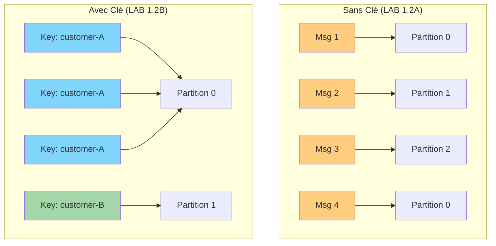
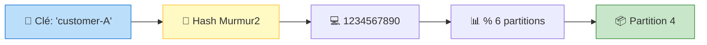

# LAB 1.2B : Producer avec Clé (Partitionnement Déterministe)

## ⏱️ Durée estimée : 45 minutes

## 🎯 Objectif

Comprendre comment la clé détermine la partition et garantit l'ordre des messages pour une même entité (client, commande, compte bancaire).

### Pourquoi utiliser une clé ?



**Sans clé** : Distribution aléatoire → pas d'ordre garanti  
**Avec clé** : Même clé = même partition → ordre garanti pour cette clé

## 📚 Ce que vous allez apprendre

- Différence entre messages avec et sans clé
- Partitionnement hash-based (algorithme Murmur2)
- Garantie d'ordre par clé (même clé = même partition)
- Distribution des messages sur les partitions
- Éviter les hot partitions (partitions surchargées)
- Prédire sur quelle partition une clé atterrira

---

## 📋 Prérequis

### Cluster Kafka et topic créés

Si ce n'est pas déjà fait, créez le topic `orders.created` avec 6 partitions (voir LAB 1.2A).

---

## 🚀 Instructions Pas à Pas

### Étape 1 : Créer le projet

```bash
cd lab-1.2b-producer-keyed
dotnet new console -n KafkaProducerKeyed
cd KafkaProducerKeyed
dotnet add package Confluent.Kafka --version 2.3.0
dotnet add package Microsoft.Extensions.Logging --version 8.0.0
dotnet add package Microsoft.Extensions.Logging.Console --version 8.0.0
```

---

### Étape 2 : Comprendre le partitionnement

#### Sans clé (LAB 1.2A)

```csharp
// Message sans clé → Sticky Partitioner (round-robin amélioré)
await producer.ProduceAsync("orders", new Message<Null, string>
{
    Value = "{...}"  // Partition choisie automatiquement
});
```

**Résultat** : Messages distribués uniformément sur toutes les partitions, mais **pas d'ordre garanti** entre les messages.

#### Avec clé (LAB 1.2B)

```csharp
// Message avec clé → Hash-based partitioning
await producer.ProduceAsync("orders", new Message<string, string>
{
    Key = "customer-123",  // Ira TOUJOURS sur la même partition
    Value = "{...}"
});
```

**Résultat** : Tous les messages avec `Key = "customer-123"` vont sur la **même partition**, garantissant l'**ordre**.

#### Formule de partitionnement



**Formule** : `partition = murmur2_hash(key) % nombre_partitions`

**Exemple concret** :
- Topic avec 6 partitions
- Clé = "customer-A"
- Hash Murmur2("customer-A") = 1234567890
- Partition = 1234567890 % 6 = 4

→ Tous les messages avec clé "customer-A" iront sur **partition 4**.

---

### Étape 3 : Copier et comprendre le code

Le code fourni dans `Program.cs` simule 5 clients différents envoyant chacun plusieurs commandes.

#### Points clés du code

**1. Type du Producer**

```csharp
// <string, string> = <Type de la clé, Type de la valeur>
using var producer = new ProducerBuilder<string, string>(config)
    .Build();
```

**2. Envoi avec clé**

```csharp
var customerId = customers[i % 5];  // customer-A, customer-B, etc.

var deliveryResult = await producer.ProduceAsync(topicName, new Message<string, string>
{
    Key = customerId,  // LA CLÉ DÉTERMINE LA PARTITION
    Value = messageValue,
    Timestamp = Timestamp.Default
});

logger.LogInformation(
    "✓ Delivered → Key: {Key}, Partition: {Partition}, Offset: {Offset}",
    customerId,
    deliveryResult.Partition.Value,
    deliveryResult.Offset.Value
);
```

**3. Observation de la distribution**

Le code envoie 30 messages (6 messages par client) et affiche sur quelle partition chaque message atterrit.

---

### Étape 4 : Exécuter et observer

```bash
dotnet run
```

#### Logs attendus

```
info: Sending order ORD-customer-A-0001 for customer customer-A
info: ✓ Delivered → Key: customer-A, Partition: 3, Offset: 0
info: Sending order ORD-customer-B-0002 for customer customer-B
info: ✓ Delivered → Key: customer-B, Partition: 1, Offset: 0
info: Sending order ORD-customer-C-0003 for customer customer-C
info: ✓ Delivered → Key: customer-C, Partition: 5, Offset: 0
info: Sending order ORD-customer-D-0004 for customer customer-D
info: ✓ Delivered → Key: customer-D, Partition: 2, Offset: 0
info: Sending order ORD-customer-E-0005 for customer customer-E
info: ✓ Delivered → Key: customer-E, Partition: 4, Offset: 0
info: Sending order ORD-customer-A-0006 for customer customer-A
info: ✓ Delivered → Key: customer-A, Partition: 3, Offset: 1  ← Même partition !
info: Sending order ORD-customer-B-0007 for customer customer-B
info: ✓ Delivered → Key: customer-B, Partition: 1, Offset: 1  ← Même partition !
...
```

#### Observations clés

✅ **customer-A** → Toujours **partition 3**  
✅ **customer-B** → Toujours **partition 1**  
✅ **customer-C** → Toujours **partition 5**  
✅ **customer-D** → Toujours **partition 2**  
✅ **customer-E** → Toujours **partition 4**

**Conclusion** : Le partitionnement par clé est **déterministe** et **reproductible**.

---

### Étape 5 : Vérifier l'ordre dans Kafka

#### Avec CLI Kafka (lire partition spécifique)

**Docker** :
```bash
# Lire uniquement la partition 3 (customer-A)
docker exec kafka /opt/kafka/bin/kafka-console-consumer.sh \
  --bootstrap-server localhost:9092 \
  --topic orders.created \
  --partition 3 \
  --from-beginning
```

**OKD/K3s** :
```bash
kubectl run kafka-cli -it --rm --image=quay.io/strimzi/kafka:latest-kafka-4.0.0 \
  --restart=Never -n kafka -- \
  bin/kafka-console-consumer.sh --bootstrap-server bhf-kafka-kafka-bootstrap:9092 \
  --topic orders.created --partition 3 --from-beginning
```

**Résultat attendu** : Vous ne verrez que les messages de **customer-A**, dans l'ordre d'envoi.

---

## 🧪 Exercices Pratiques

### Exercice 1 : Augmenter le nombre de clients

**Objectif** : Envoyer 60 messages avec 10 clients (customer-A à customer-J).

**Instructions** :

1. Modifier le code :

```csharp
var customers = Enumerable.Range(0, 10)
    .Select(i => $"customer-{(char)('A' + i)}")
    .ToArray();

for (int i = 1; i <= 60; i++)
{
    var customerId = customers[i % 10];
    // ... reste du code
}
```

2. Ajouter un compteur de distribution :

```csharp
var partitionCounts = new Dictionary<int, int>();

// Dans la boucle, après ProduceAsync :
partitionCounts[deliveryResult.Partition.Value] = 
    partitionCounts.GetValueOrDefault(deliveryResult.Partition.Value, 0) + 1;

// Après la boucle :
Console.WriteLine("\n=== Distribution des messages par partition ===");
foreach (var kvp in partitionCounts.OrderBy(x => x.Key))
{
    Console.WriteLine($"Partition {kvp.Key}: {kvp.Value} messages");
}
```

3. Exécuter et observer la distribution.

**Question** : La distribution est-elle uniforme ? Pourquoi ?

<details>
<summary>💡 Solution</summary>

Avec 10 clients et 6 partitions, la distribution dépend du hash de chaque clé. Elle ne sera pas parfaitement uniforme (certaines partitions peuvent avoir 1 client, d'autres 2), mais sur un grand nombre de clés, la distribution converge vers l'uniformité.

</details>

---

### Exercice 2 : Simuler une hot partition

**Objectif** : Observer le problème des hot partitions.

**Instructions** :

1. Modifier le code pour que 80% des messages aient la même clé :

```csharp
for (int i = 1; i <= 100; i++)
{
    // 80% des messages avec customer-A, 20% avec les autres
    var customerId = (i % 10 < 8) ? "customer-A" : $"customer-{(char)('B' + (i % 4))}";
    // ... reste du code
}
```

2. Observer la distribution.

**Question** : Quelle partition reçoit le plus de messages ? Quel est le problème ?

<details>
<summary>💡 Solution</summary>

La partition de "customer-A" reçoit 80 messages, les autres se partagent les 20 restants. C'est une **hot partition** : elle est surchargée, ce qui peut causer :
- Latence accrue pour les consumers de cette partition
- Déséquilibre de charge entre brokers
- Risque de saturation du disque sur le broker hébergeant cette partition

**Solution** : Utiliser une clé composite ou un hash de la clé pour mieux distribuer.

</details>

---

### Exercice 3 : Prédire la partition d'une clé

**Objectif** : Calculer sur quelle partition une clé atterrira avant de l'envoyer.

**Instructions** :

1. Ajouter cette méthode :

```csharp
static int PredictPartition(string key, int numPartitions)
{
    // Simuler le hash Murmur2 (simplifié)
    var hash = key.GetHashCode();
    return Math.Abs(hash) % numPartitions;
}
```

2. Avant d'envoyer un message, prédire sa partition :

```csharp
var predictedPartition = PredictPartition(customerId, 6);
Console.WriteLine($"Predicted partition for {customerId}: {predictedPartition}");

var deliveryResult = await producer.ProduceAsync(...);

Console.WriteLine($"Actual partition: {deliveryResult.Partition.Value}");
```

**Note** : La prédiction peut ne pas être exacte car `GetHashCode()` n'est pas Murmur2, mais elle donne une idée.

---

## ✅ Validation du Lab

Vous avez réussi ce lab si :

- [ ] Vous comprenez que **Key → Partition** est déterministe
- [ ] Même clé = même partition = **ordre préservé** pour cette clé
- [ ] Vous savez observer la distribution des clés sur les partitions
- [ ] Vous comprenez le problème des hot partitions
- [ ] Vous savez quand utiliser une clé (ordre, localité, compaction)

---

## 🎯 Points Clés à Retenir

### 1. Quand utiliser une clé ?

✅ **Utilisez une clé si vous avez besoin de** :
- **Ordre garanti** : Tous les événements d'une entité (client, commande) doivent arriver dans l'ordre
- **Localité** : Un consumer doit voir tous les événements d'une entité ensemble
- **Compaction** : Topic compacté (dernière valeur par clé conservée)

❌ **N'utilisez pas de clé si** :
- Vous voulez une distribution uniforme sans contrainte d'ordre
- Vous avez des clés très déséquilibrées (risque de hot partition)

### 2. Formule de partitionnement

```
partition = murmur2_hash(key) % nombre_partitions
```

- **Déterministe** : Même clé → même partition (toujours)
- **Uniforme** : Hash Murmur2 distribue bien les clés
- **Stable** : Ne change pas si nombre de partitions constant

### 3. Hot Partitions

**Problème** : Une partition reçoit beaucoup plus de messages que les autres.

**Causes** :
- Clés déséquilibrées (ex: 80% des messages avec même clé)
- Clés mal choisies (ex: date du jour → tous les messages du jour sur même partition)

**Solutions** :
- Choisir des clés bien distribuées
- Utiliser un hash de la clé si nécessaire
- Augmenter le nombre de partitions
- Utiliser une clé composite (ex: `customerId + orderId % 10`)

### 4. Ordre des messages

**Avec clé** :
- Ordre garanti **au sein d'une partition**
- Tous les messages avec même clé arrivent dans l'ordre

**Sans clé** :
- Aucune garantie d'ordre global
- Sticky partitioner groupe les messages par batch

---

## 📖 Concepts Théoriques

### Algorithme Murmur2

Kafka utilise l'algorithme de hash **Murmur2** pour calculer la partition à partir de la clé :

```java
// Pseudo-code simplifié
int partition = murmur2(key.getBytes()) % numPartitions;
```

**Propriétés** :
- Rapide (plus rapide que MD5, SHA)
- Bonne distribution (pas de collisions fréquentes)
- Non-cryptographique (pas sécurisé, mais ce n'est pas le but)

### Sticky Partitioner (sans clé)

Depuis Kafka 2.4, le partitionnement sans clé utilise le **sticky partitioner** :

1. Choisir une partition aléatoire
2. Envoyer tous les messages du batch sur cette partition
3. Quand le batch est plein, choisir une nouvelle partition

**Avantage** : Moins de requêtes réseau, meilleure performance.

### Compaction de Topic

Avec une clé, vous pouvez activer la **compaction** :

```bash
--config cleanup.policy=compact
```

Kafka conserve uniquement la **dernière valeur** pour chaque clé. Utile pour :
- Event Sourcing (état actuel d'une entité)
- CDC (Change Data Capture)
- Cache distribué

---

## 🚀 Prochaine Étape

Vous maîtrisez maintenant le partitionnement par clé !

👉 **Passez au [LAB 1.2C : Producer avec Gestion d'Erreurs et DLQ](../lab-1.2c-producer-error-handling/README.md)**

Dans le prochain lab, vous apprendrez :
- Classification des erreurs (retriable vs permanent)
- Pattern Dead Letter Queue (DLQ)
- Retry avec exponential backoff
- Logging et monitoring production-ready
