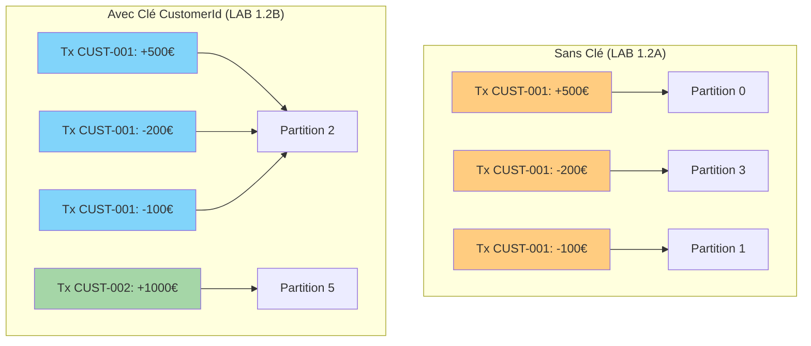
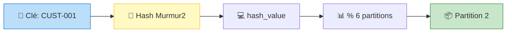

# LAB 1.2B : API Producer avec Clé - Partitionnement par Client

## ⏱️ Durée estimée : 60 minutes

## 🏦 Contexte E-Banking

Dans ce lab, vous allez étendre l'API Web du LAB 1.2A pour utiliser le **partitionnement par clé**. Toutes les transactions d'un même client (`CustomerId`) seront envoyées sur la **même partition Kafka**, garantissant l'**ordre chronologique** des opérations bancaires par client.



**Problème sans clé** : Les transactions d'un client arrivent dans le désordre → solde incohérent.
**Solution avec clé** : `CustomerId` comme clé → même partition → ordre garanti par client.

---

## 🎯 Objectifs

À la fin de ce lab, vous serez capable de :

1. Utiliser le **partitionnement par clé** (`CustomerId`) dans une API Web
2. Comprendre l'algorithme **Murmur2** et la formule `partition = hash(key) % N`
3. Garantir l'**ordre des transactions** par client
4. Détecter et prévenir les **hot partitions**
5. Tester le partitionnement via **Swagger/OpenAPI**
6. Observer la **distribution des messages** par partition

---

## 📋 Prérequis

### LAB 1.2A complété

Vous devez avoir complété le LAB 1.2A (API Producer Basique).

### Topic Kafka créé

**Docker** :

```bash
docker exec kafka /opt/kafka/bin/kafka-topics.sh \
  --bootstrap-server localhost:9092 \
  --create --if-not-exists \
  --topic banking.transactions \
  --partitions 6 \
  --replication-factor 1
```

**OKD/K3s** :

```bash
kubectl run kafka-cli -it --rm --image=quay.io/strimzi/kafka:latest-kafka-4.0.0 \
  --restart=Never -n kafka -- \
  bin/kafka-topics.sh --bootstrap-server bhf-kafka-kafka-bootstrap:9092 \
  --create --if-not-exists --topic banking.transactions --partitions 6 --replication-factor 3
```

---

## 🚀 Instructions Pas à Pas

### Étape 1 : Créer le projet API Web

#### 💻 Option A : Visual Studio Code

```bash
cd lab-1.2b-producer-keyed
dotnet new webapi -n EBankingKeyedProducerAPI
cd EBankingKeyedProducerAPI
dotnet add package Confluent.Kafka --version 2.3.0
dotnet add package Swashbuckle.AspNetCore --version 6.5.0
```

#### 🎨 Option B : Visual Studio 2022

1. **Fichier** → **Nouveau** → **Projet** (`Ctrl+Shift+N`)
2. Sélectionner **API Web ASP.NET Core**
3. Nom : `EBankingKeyedProducerAPI`, Framework : **.NET 8.0**
4. Clic droit projet → **Gérer les packages NuGet** :
   - `Confluent.Kafka` version **2.3.0**
   - `Swashbuckle.AspNetCore` version **6.5.0**

---

### Étape 2 : Comprendre le partitionnement par clé

#### Pourquoi c'est critique en e-banking ?

Considérez cette séquence de transactions pour CUST-001 :

1. Dépôt de 500€ (solde: 500€)
2. Paiement de 200€ (solde: 300€)
3. Virement de 100€ (solde: 200€)

**Sans clé** : Ces 3 transactions peuvent arriver sur 3 partitions différentes. Un consumer qui traite la partition du paiement avant le dépôt verra un solde négatif → **erreur**.

**Avec clé `CUST-001`** : Les 3 transactions arrivent sur la même partition, dans l'ordre → **cohérence garantie**.

#### Formule de partitionnement



**Formule** : `partition = murmur2_hash(key) % nombre_partitions`

---

### Étape 3 : Créer le modèle Transaction (réutiliser LAB 1.2A)

Copier le fichier `Models/Transaction.cs` du LAB 1.2A ou le recréer identique.

---

### Étape 4 : Créer le service Kafka Producer avec clé

Créer le fichier `Services/KeyedKafkaProducerService.cs` :

```csharp
using Confluent.Kafka;
using System.Text.Json;
using EBankingKeyedProducerAPI.Models;

namespace EBankingKeyedProducerAPI.Services;

public class KeyedKafkaProducerService : IDisposable
{
    private readonly IProducer<string, string> _producer;
    private readonly ILogger<KeyedKafkaProducerService> _logger;
    private readonly string _topic;

    // Statistiques de distribution
    private readonly Dictionary<int, int> _partitionStats = new();
    private readonly Dictionary<string, int> _customerPartitionMap = new();

    public KeyedKafkaProducerService(IConfiguration config, ILogger<KeyedKafkaProducerService> logger)
    {
        _logger = logger;
        _topic = config["Kafka:Topic"] ?? "banking.transactions";

        var producerConfig = new ProducerConfig
        {
            BootstrapServers = config["Kafka:BootstrapServers"] ?? "localhost:9092",
            ClientId = config["Kafka:ClientId"] ?? "ebanking-keyed-producer-api",
            Acks = Acks.All,
            EnableIdempotence = true,
            MessageSendMaxRetries = 3,
            RetryBackoffMs = 1000,
            LingerMs = 10,
            BatchSize = 16384,
            CompressionType = CompressionType.Snappy
        };

        _producer = new ProducerBuilder<string, string>(producerConfig)
            .SetErrorHandler((_, error) =>
                _logger.LogError("Kafka Error: {Reason} (Code: {Code})", error.Reason, error.Code))
            .SetLogHandler((_, msg) =>
            {
                if (msg.Level >= SyslogLevel.Warning)
                    _logger.LogWarning("Kafka Log: {Message}", msg.Message);
            })
            .Build();
    }

    /// <summary>
    /// Send transaction with CustomerId as partition key
    /// </summary>
    public async Task<DeliveryResult<string, string>> SendTransactionAsync(
        Transaction transaction, CancellationToken ct = default)
    {
        var json = JsonSerializer.Serialize(transaction, new JsonSerializerOptions
        {
            PropertyNamingPolicy = JsonNamingPolicy.CamelCase
        });

        // KEY = CustomerId → garantit l'ordre par client
        var message = new Message<string, string>
        {
            Key = transaction.CustomerId,  // PARTITION KEY
            Value = json,
            Headers = new Headers
            {
                { "correlation-id", System.Text.Encoding.UTF8.GetBytes(Guid.NewGuid().ToString()) },
                { "event-type", System.Text.Encoding.UTF8.GetBytes("transaction.created") },
                { "source", System.Text.Encoding.UTF8.GetBytes("ebanking-keyed-api") },
                { "partition-key", System.Text.Encoding.UTF8.GetBytes(transaction.CustomerId) },
                { "transaction-type", System.Text.Encoding.UTF8.GetBytes(transaction.Type.ToString()) }
            },
            Timestamp = new Timestamp(transaction.Timestamp)
        };

        var result = await _producer.ProduceAsync(_topic, message, ct);

        // Track partition statistics
        var partition = result.Partition.Value;
        _partitionStats[partition] = _partitionStats.GetValueOrDefault(partition, 0) + 1;
        _customerPartitionMap[transaction.CustomerId] = partition;

        _logger.LogInformation(
            "✅ Transaction {Id} → Key: {Key}, Partition: {P}, Offset: {O}, Amount: {Amt} {Cur}",
            transaction.TransactionId, transaction.CustomerId,
            partition, result.Offset.Value,
            transaction.Amount, transaction.Currency);

        return result;
    }

    /// <summary>
    /// Get current partition distribution statistics
    /// </summary>
    public Dictionary<int, int> GetPartitionStats() => new(_partitionStats);

    /// <summary>
    /// Get customer-to-partition mapping
    /// </summary>
    public Dictionary<string, int> GetCustomerPartitionMap() => new(_customerPartitionMap);

    public void Dispose()
    {
        _producer?.Flush(TimeSpan.FromSeconds(10));
        _producer?.Dispose();
        _logger.LogInformation("Kafka Producer disposed");
    }
}
```

---

### Étape 5 : Créer le contrôleur API

Créer le fichier `Controllers/TransactionsController.cs` :

```csharp
using Microsoft.AspNetCore.Mvc;
using EBankingKeyedProducerAPI.Models;
using EBankingKeyedProducerAPI.Services;

namespace EBankingKeyedProducerAPI.Controllers;

[ApiController]
[Route("api/[controller]")]
[Produces("application/json")]
public class TransactionsController : ControllerBase
{
    private readonly KeyedKafkaProducerService _kafka;
    private readonly ILogger<TransactionsController> _logger;

    public TransactionsController(KeyedKafkaProducerService kafka, ILogger<TransactionsController> logger)
    {
        _kafka = kafka;
        _logger = logger;
    }

    /// <summary>
    /// Créer une transaction avec partitionnement par CustomerId
    /// </summary>
    /// <remarks>
    /// La clé de partition est le CustomerId.
    /// Toutes les transactions d'un même client vont sur la même partition Kafka.
    ///
    ///     POST /api/transactions
    ///     {
    ///         "fromAccount": "FR7630001000123456789",
    ///         "toAccount":   "FR7630001000987654321",
    ///         "amount": 250.00,
    ///         "currency": "EUR",
    ///         "type": 1,
    ///         "description": "Virement mensuel loyer",
    ///         "customerId": "CUST-001"
    ///     }
    ///
    /// </remarks>
    [HttpPost]
    [ProducesResponseType(typeof(KeyedTransactionResponse), StatusCodes.Status201Created)]
    [ProducesResponseType(typeof(ProblemDetails), StatusCodes.Status400BadRequest)]
    public async Task<ActionResult<KeyedTransactionResponse>> CreateTransaction(
        [FromBody] Transaction transaction, CancellationToken ct)
    {
        if (string.IsNullOrEmpty(transaction.TransactionId))
            transaction.TransactionId = Guid.NewGuid().ToString();

        var result = await _kafka.SendTransactionAsync(transaction, ct);

        return CreatedAtAction(nameof(GetTransaction),
            new { transactionId = transaction.TransactionId },
            new KeyedTransactionResponse
            {
                TransactionId = transaction.TransactionId,
                CustomerId = transaction.CustomerId,
                PartitionKey = transaction.CustomerId,
                KafkaPartition = result.Partition.Value,
                KafkaOffset = result.Offset.Value,
                Timestamp = result.Timestamp.UtcDateTime,
                Status = "Processing"
            });
    }

    /// <summary>
    /// Envoyer un lot de transactions (partitionnées par client)
    /// </summary>
    [HttpPost("batch")]
    [ProducesResponseType(typeof(BatchKeyedResponse), StatusCodes.Status201Created)]
    public async Task<ActionResult<BatchKeyedResponse>> CreateBatch(
        [FromBody] List<Transaction> transactions, CancellationToken ct)
    {
        var results = new List<KeyedTransactionResponse>();

        foreach (var tx in transactions)
        {
            if (string.IsNullOrEmpty(tx.TransactionId))
                tx.TransactionId = Guid.NewGuid().ToString();

            var dr = await _kafka.SendTransactionAsync(tx, ct);
            results.Add(new KeyedTransactionResponse
            {
                TransactionId = tx.TransactionId,
                CustomerId = tx.CustomerId,
                PartitionKey = tx.CustomerId,
                KafkaPartition = dr.Partition.Value,
                KafkaOffset = dr.Offset.Value,
                Timestamp = dr.Timestamp.UtcDateTime,
                Status = "Processing"
            });
        }

        return Created("", new BatchKeyedResponse
        {
            ProcessedCount = results.Count,
            Transactions = results
        });
    }

    /// <summary>
    /// Obtenir les statistiques de distribution par partition
    /// </summary>
    [HttpGet("stats/partitions")]
    [ProducesResponseType(typeof(PartitionStatsResponse), StatusCodes.Status200OK)]
    public ActionResult<PartitionStatsResponse> GetPartitionStats()
    {
        return Ok(new PartitionStatsResponse
        {
            PartitionDistribution = _kafka.GetPartitionStats(),
            CustomerPartitionMap = _kafka.GetCustomerPartitionMap(),
            TotalMessages = _kafka.GetPartitionStats().Values.Sum()
        });
    }

    /// <summary>
    /// Obtenir le statut d'une transaction (placeholder)
    /// </summary>
    [HttpGet("{transactionId}")]
    [ProducesResponseType(typeof(KeyedTransactionResponse), StatusCodes.Status200OK)]
    public ActionResult<KeyedTransactionResponse> GetTransaction(string transactionId)
    {
        return Ok(new KeyedTransactionResponse
        {
            TransactionId = transactionId,
            Status = "Processing",
            Timestamp = DateTime.UtcNow
        });
    }

    /// <summary>
    /// Health check
    /// </summary>
    [HttpGet("health")]
    [ProducesResponseType(typeof(object), StatusCodes.Status200OK)]
    public ActionResult GetHealth()
    {
        return Ok(new
        {
            Status = "Healthy",
            Service = "EBanking Keyed Producer API",
            PartitioningStrategy = "CustomerId (Murmur2 Hash)",
            Timestamp = DateTime.UtcNow
        });
    }
}

// --- Response DTOs ---

public class KeyedTransactionResponse
{
    public string TransactionId { get; set; } = string.Empty;
    public string CustomerId { get; set; } = string.Empty;
    public string PartitionKey { get; set; } = string.Empty;
    public string Status { get; set; } = string.Empty;
    public int KafkaPartition { get; set; }
    public long KafkaOffset { get; set; }
    public DateTime Timestamp { get; set; }
}

public class BatchKeyedResponse
{
    public int ProcessedCount { get; set; }
    public List<KeyedTransactionResponse> Transactions { get; set; } = new();
}

public class PartitionStatsResponse
{
    public Dictionary<int, int> PartitionDistribution { get; set; } = new();
    public Dictionary<string, int> CustomerPartitionMap { get; set; } = new();
    public int TotalMessages { get; set; }
}
```

---

### Étape 6 : Configurer Program.cs

```csharp
using EBankingKeyedProducerAPI.Services;
using Microsoft.OpenApi.Models;
using System.Reflection;

var builder = WebApplication.CreateBuilder(args);

builder.Services.AddControllers();
builder.Services.AddSingleton<KeyedKafkaProducerService>();

builder.Services.AddEndpointsApiExplorer();
builder.Services.AddSwaggerGen(options =>
{
    options.SwaggerDoc("v1", new OpenApiInfo
    {
        Title = "E-Banking Keyed Producer API",
        Version = "v1",
        Description = "API de transactions bancaires avec partitionnement par CustomerId.\n\n"
            + "**Partitionnement** : `partition = murmur2(CustomerId) % 6`\n\n"
            + "**Endpoints :**\n"
            + "- `POST /api/transactions` — Transaction avec clé CustomerId\n"
            + "- `POST /api/transactions/batch` — Lot de transactions\n"
            + "- `GET /api/transactions/stats/partitions` — Distribution par partition\n"
            + "- `GET /api/transactions/health` — Health check"
    });

    var xmlFile = $"{Assembly.GetExecutingAssembly().GetName().Name}.xml";
    var xmlPath = Path.Combine(AppContext.BaseDirectory, xmlFile);
    if (File.Exists(xmlPath))
        options.IncludeXmlComments(xmlPath);
});

var app = builder.Build();

app.UseSwagger();
app.UseSwaggerUI(c =>
{
    c.SwaggerEndpoint("/swagger/v1/swagger.json", "E-Banking Keyed Producer API v1");
    c.RoutePrefix = "swagger";
});

app.MapControllers();

var logger = app.Services.GetRequiredService<ILogger<Program>>();
logger.LogInformation("========================================");
logger.LogInformation("  E-Banking Keyed Producer API");
logger.LogInformation("  Partitioning: CustomerId (Murmur2)");
logger.LogInformation("  Swagger UI : https://localhost:5001/swagger");
logger.LogInformation("========================================");

app.Run();
```

---

### Étape 7 : Configurer appsettings.json

```json
{
  "Logging": {
    "LogLevel": {
      "Default": "Information",
      "Microsoft.AspNetCore": "Warning"
    }
  },
  "Kafka": {
    "BootstrapServers": "localhost:9092",
    "Topic": "banking.transactions",
    "ClientId": "ebanking-keyed-producer-api"
  }
}
```

---

### Étape 8 : Exécuter et tester

```bash
dotnet run
```

Ouvrir Swagger UI : **<https://localhost:5001/swagger>**

---

## 🧪 Tests OpenAPI (Swagger)

### Test 1 : Transactions du même client (vérifier même partition)

Envoyer 3 transactions pour **CUST-001** via **POST /api/transactions** :

**Transaction 1** — Dépôt :

```json
{
  "fromAccount": "BANK-DEPOSIT-001",
  "toAccount": "FR7630001000123456789",
  "amount": 500.00,
  "currency": "EUR",
  "type": 3,
  "description": "Dépôt salaire janvier",
  "customerId": "CUST-001"
}
```

**Transaction 2** — Paiement :

```json
{
  "fromAccount": "FR7630001000123456789",
  "toAccount": "FR7630001000111222333",
  "amount": 200.00,
  "currency": "EUR",
  "type": 2,
  "description": "Paiement loyer",
  "customerId": "CUST-001"
}
```

**Transaction 3** — Virement :

```json
{
  "fromAccount": "FR7630001000123456789",
  "toAccount": "FR7630001000444555666",
  "amount": 100.00,
  "currency": "EUR",
  "type": 1,
  "description": "Virement épargne",
  "customerId": "CUST-001"
}
```

**Vérification** : Les 3 réponses doivent montrer le **même `kafkaPartition`**.

### Test 2 : Transactions de clients différents

Envoyer via **POST /api/transactions/batch** :

```json
[
  {
    "fromAccount": "FR7630001000111111111",
    "toAccount": "FR7630001000999999999",
    "amount": 75.00,
    "currency": "EUR",
    "type": 2,
    "description": "Paiement Netflix",
    "customerId": "CUST-001"
  },
  {
    "fromAccount": "FR7630001000222222222",
    "toAccount": "FR7630001000888888888",
    "amount": 1500.00,
    "currency": "EUR",
    "type": 1,
    "description": "Virement investissement",
    "customerId": "CUST-002"
  },
  {
    "fromAccount": "FR7630001000333333333",
    "toAccount": "GB29NWBK60161331926819",
    "amount": 5000.00,
    "currency": "EUR",
    "type": 6,
    "description": "International transfer",
    "customerId": "CUST-003"
  }
]
```

**Vérification** : Chaque `customerId` a un `kafkaPartition` potentiellement différent.

### Test 3 : Consulter les statistiques de distribution

Appeler **GET /api/transactions/stats/partitions** :

**Réponse attendue** :

```json
{
  "partitionDistribution": {
    "2": 4,
    "5": 1,
    "0": 1
  },
  "customerPartitionMap": {
    "CUST-001": 2,
    "CUST-002": 5,
    "CUST-003": 0
  },
  "totalMessages": 6
}
```

**Observation clé** : CUST-001 a 4 messages, tous sur la **même partition** (2).

---

## 📊 Vérifier dans Kafka

### Lire une partition spécifique

```bash
# Lire uniquement la partition 2 (CUST-001)
docker exec kafka /opt/kafka/bin/kafka-console-consumer.sh \
  --bootstrap-server localhost:9092 \
  --topic banking.transactions \
  --partition 2 \
  --from-beginning
```

Vous ne verrez que les transactions de **CUST-001**, dans l'ordre chronologique.

### Vérifier la distribution

```bash
docker exec kafka /opt/kafka/bin/kafka-run-class.sh kafka.tools.GetOffsetShell \
  --broker-list localhost:9092 --topic banking.transactions
```

---

## 🎯 Concepts Clés Expliqués

### Partitionnement Murmur2

| Élément | Description |
| ------- | ----------- |
| **Algorithme** | Murmur2 (non-cryptographique, rapide) |
| **Formule** | `partition = murmur2(key_bytes) % num_partitions` |
| **Déterministe** | Même clé → même partition (toujours) |
| **Stable** | Ne change pas tant que le nombre de partitions est constant |

### Quand utiliser une clé en e-banking ?

| Scénario | Clé recommandée | Raison |
| -------- | --------------- | ------ |
| **Transactions client** | `CustomerId` | Ordre des opérations par client |
| **Opérations compte** | `AccountId` | Cohérence du solde |
| **Paiements carte** | `CardNumber` | Détection fraude séquentielle |
| **Virements internationaux** | `CustomerId` | Conformité et audit |

### Anti-patterns en e-banking

| Anti-pattern | Problème | Solution |
| ------------ | -------- | -------- |
| Clé = date du jour | Hot partition (toutes les tx du jour) | Utiliser `CustomerId` |
| Clé = type de transaction | 80% des tx sont des paiements | Utiliser `CustomerId` |
| Pas de clé | Ordre des tx non garanti | Toujours utiliser `CustomerId` |

---

## 🔧 Troubleshooting

| Symptôme | Cause probable | Solution |
| -------- | -------------- | -------- |
| Même client sur partitions différentes | Clé inconsistante | Vérifier que `CustomerId` est identique (casse) |
| Hot partition (80%+ sur une partition) | Un client domine le trafic | Clé composite `CustomerId + AccountId` |
| Distribution inégale | Peu de clients uniques | Normal avec peu de clés, augmenter les clients |
| Ordre non respecté | `EnableIdempotence = false` | Activer l'idempotence |

---

## ✅ Validation du Lab

- [ ] L'API démarre et Swagger UI est accessible
- [ ] `POST /api/transactions` retourne la partition dans la réponse
- [ ] 3 transactions du même client vont sur la **même partition**
- [ ] 3 transactions de clients différents montrent des partitions (potentiellement) différentes
- [ ] `GET /api/transactions/stats/partitions` affiche la distribution correcte
- [ ] Le `customerPartitionMap` montre un mapping client → partition stable
- [ ] Vous comprenez la formule `partition = murmur2(key) % N`

---

## 🚀 Prochaine Étape

👉 **[LAB 1.2C : API Producer avec Gestion d'Erreurs et DLQ](../lab-1.2c-producer-error-handling/README.md)**

Dans le prochain lab :

- Classification des erreurs (retriable vs permanent)
- Pattern Dead Letter Queue (DLQ) pour les transactions échouées
- Retry avec exponential backoff
- Fallback fichier local si DLQ échoue
