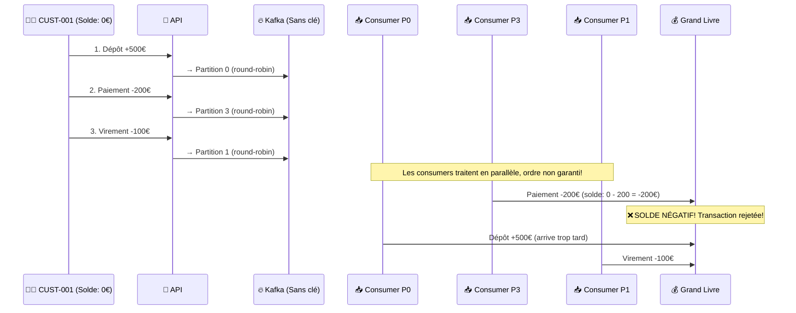
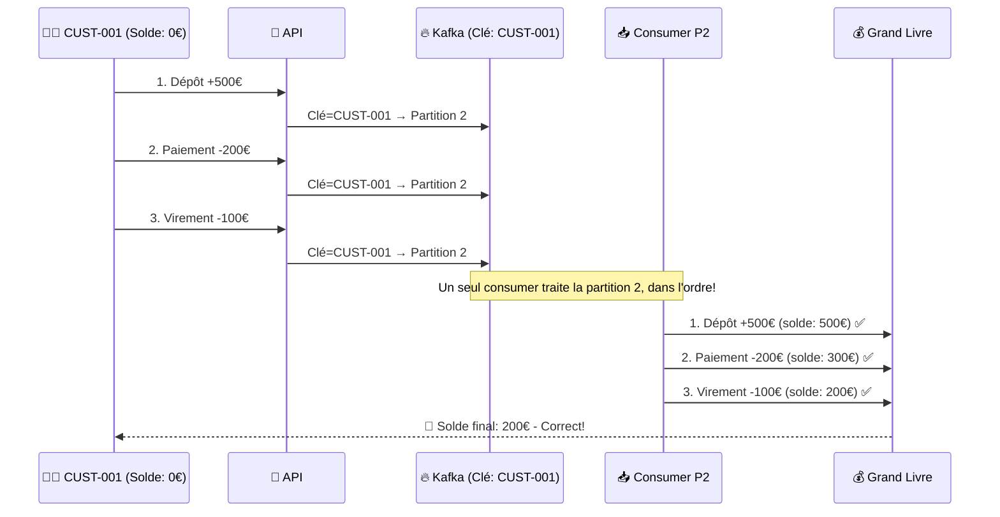
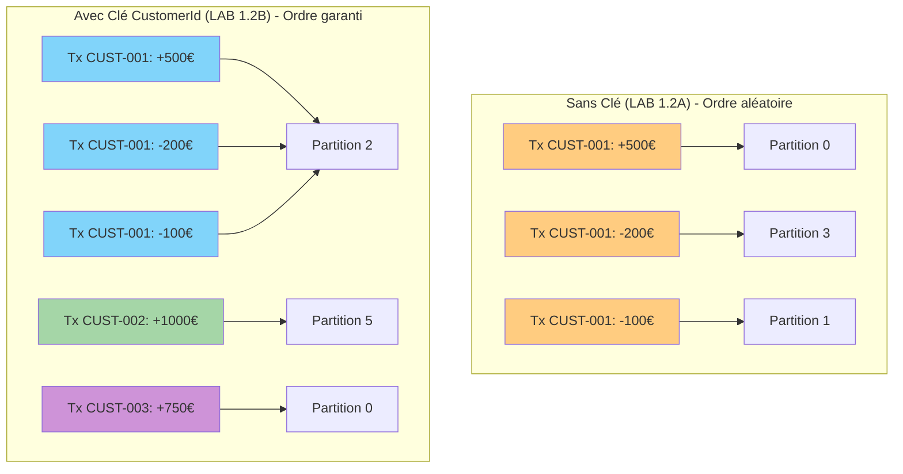
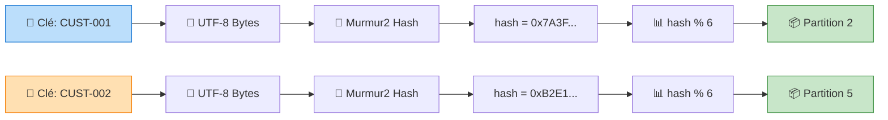
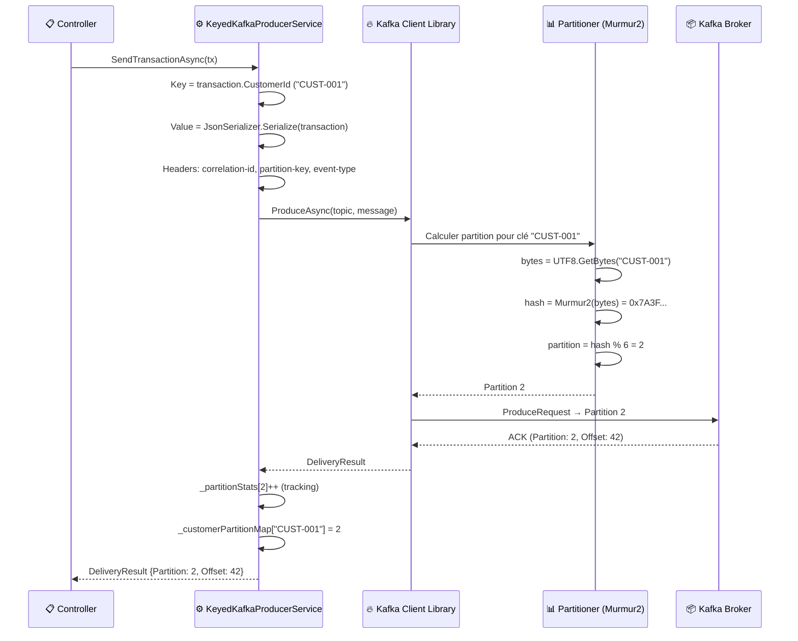
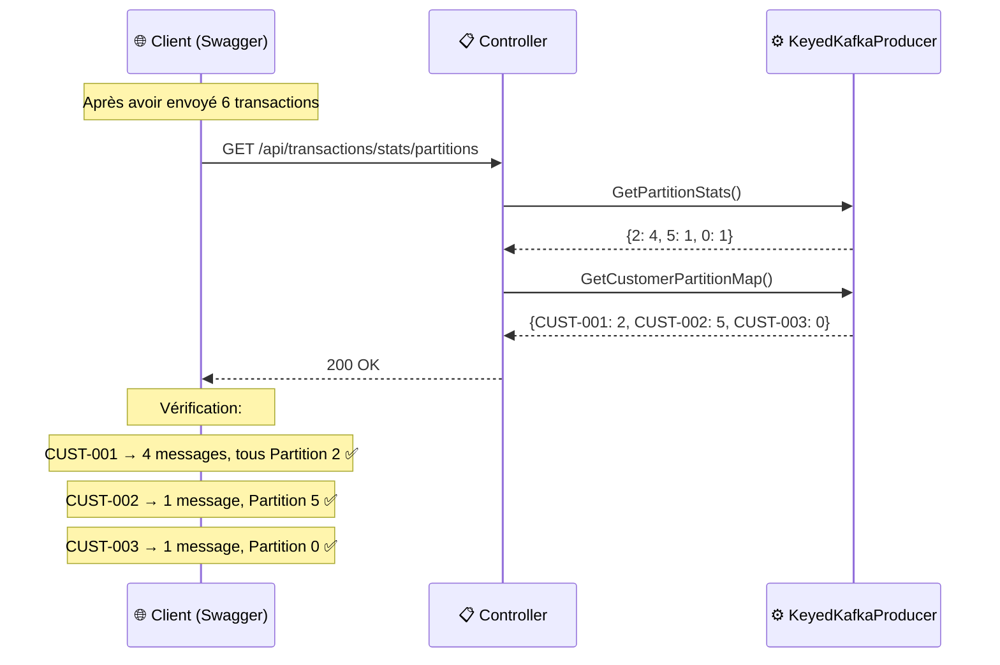
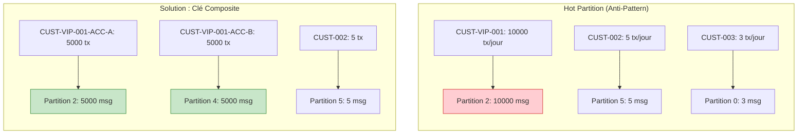

# LAB 1.2B : API Producer avec Clé - Partitionnement par Client

## ⏱️ Durée estimée : 60 minutes

## 🏦 Contexte E-Banking

Dans un système bancaire, l'**ordre des transactions** est critique. Si un client effectue un dépôt de 500€ puis un paiement de 200€, ces opérations **doivent être traitées dans l'ordre** pour éviter un solde négatif. Kafka garantit l'ordre **uniquement au sein d'une partition**. La solution : utiliser le `CustomerId` comme **clé de partition** pour que toutes les transactions d'un même client atterrissent sur la même partition.

Dans ce lab, vous allez étendre l'API Web du LAB 1.2A pour utiliser le **partitionnement par clé**, garantissant l'**ordre chronologique** des opérations bancaires par client.

### Le Problème : Désordre Sans Clé



### La Solution : Partitionnement par CustomerId



### Distribution Multi-Clients



### Scénarios E-Banking : Pourquoi l'Ordre est Critique

| Scénario | Séquence | Sans clé (risque) | Avec clé (garanti) |
| -------- | -------- | ------------------ | ------------------- |
| **Dépôt puis paiement** | +500€, -200€ | Paiement avant dépôt → rejet | Ordre respecté → OK |
| **Crédit puis débit carte** | +1000€, -950€ | Débit d'abord → solde négatif | Ordre respecté → OK |
| **Virement + frais** | -500€, -2.50€ frais | Frais avant virement → incohérence | Ordre respecté → OK |
| **Annulation** | -100€, +100€ annulé | Annulation avant débit → double crédit | Ordre respecté → OK |
| **Détection fraude** | Tx1, Tx2, Tx3 | Analyse désordonnée → faux positifs | Séquence complète → précis |

---

## 🎯 Objectifs

À la fin de ce lab, vous serez capable de :

1. Utiliser le **partitionnement par clé** (`CustomerId`) dans une API Web
2. Comprendre l'algorithme **Murmur2** et la formule `partition = hash(key) % N`
3. Garantir l'**ordre des transactions** par client
4. Détecter et prévenir les **hot partitions**
5. Tester le partitionnement via **Swagger/OpenAPI**
6. Observer la **distribution des messages** par partition

---

## 📋 Prérequis

### LAB 1.2A complété

Vous devez avoir complété le LAB 1.2A (API Producer Basique).

### Topic Kafka créé

<details>
<summary>🐳 Mode: Docker</summary>

```bash
docker exec kafka /opt/kafka/bin/kafka-topics.sh \
  --bootstrap-server localhost:9092 \
  --create --if-not-exists \
  --topic banking.transactions \
  --partitions 6 \
  --replication-factor 1
```
</details>

<details>
<summary>☸️ Mode: OKD / K3s</summary>

```bash
kubectl run kafka-cli -it --rm --image=quay.io/strimzi/kafka:latest-kafka-4.0.0 \
  --restart=Never -n kafka -- \
  bin/kafka-topics.sh --bootstrap-server bhf-kafka-kafka-bootstrap:9092 \
  --create --if-not-exists --topic banking.transactions --partitions 6 --replication-factor 3
```
</details>

<details>
<summary>☁️ Mode: OpenShift Sandbox</summary>

```bash
# Via le terminal OpenShift ou localement avec 'oc'
oc exec kafka-0 -- /opt/kafka/bin/kafka-topics.sh \
  --bootstrap-server localhost:9092 \
  --create --if-not-exists --topic banking.transactions --partitions 6 --replication-factor 3
```
</details>

---

## 🚀 Instructions Pas à Pas

### Étape 0 : Auto-Vérification de l'Environnement

Avant de commencer, vérifiez que votre cluster est prêt :

| Composant | Status | Commande de vérification |
| :--- | :--- | :--- |
| **Kafka Broker** | En ligne | `oc get pods \| grep kafka` ou `docker ps` |
| **Topic** | Créé (6 part.) | `oc exec kafka-0 -- bin/kafka-topics.sh --list --bootstrap-server localhost:9092` |
| **Connectivité** | OK | `oc exec kafka-0 -- bin/kafka-console-producer.sh --bootstrap-server localhost:9092 --topic test --request-required-acks 1` |

---

### Étape 1 : Créer le projet API Web

#### 💻 Option A : Visual Studio Code

```bash
cd lab-1.2b-producer-keyed
dotnet new webapi -n EBankingKeyedProducerAPI
cd EBankingKeyedProducerAPI
dotnet add package Confluent.Kafka --version 2.3.0
dotnet add package Swashbuckle.AspNetCore --version 6.5.0
```

#### 🎨 Option B : Visual Studio 2022

1. **Fichier** → **Nouveau** → **Projet** (`Ctrl+Shift+N`)
2. Sélectionner **API Web ASP.NET Core**
3. Nom : `EBankingKeyedProducerAPI`, Framework : **.NET 8.0**
4. Clic droit projet → **Gérer les packages NuGet** :
   - `Confluent.Kafka` version **2.3.0**
   - `Swashbuckle.AspNetCore` version **6.5.0**

---

### Étape 2 : Comprendre le partitionnement par clé

#### Algorithme Murmur2 : Comment Kafka Choisit la Partition



**Formule** : `partition = murmur2_hash(key_bytes) % nombre_partitions`

**Propriétés clés** :

- **Déterministe** : `CUST-001` → toujours la même partition (tant que le nombre de partitions ne change pas)
- **Rapide** : Murmur2 est un hash non-cryptographique optimisé pour la performance
- **Bien distribué** : Répartition uniforme des clés sur les partitions

#### Séquence Code : Partitionnement dans le Service



---

### Étape 3 : Créer le modèle Transaction

Créer le dossier `Models` et le fichier `Models/Transaction.cs` :

```csharp
using System.ComponentModel.DataAnnotations;

namespace EBankingKeyedProducerAPI.Models;

public enum TransactionType
{
    Transfer = 1, Payment = 2, Deposit = 3, 
    Withdrawal = 4, Refund = 5, International = 6
}

public enum TransactionStatus
{
    Pending, Processing, Completed, Failed, Rejected
}

public class Transaction
{
    [Required]
    public string TransactionId { get; set; } = Guid.NewGuid().ToString();

    [Required]
    [StringLength(20, MinimumLength = 10)]
    public string FromAccount { get; set; } = string.Empty;

    [Required]
    [StringLength(20, MinimumLength = 10)]
    public string ToAccount { get; set; } = string.Empty;

    [Required]
    [Range(0.01, 1_000_000.00)]
    public decimal Amount { get; set; }

    [Required]
    [StringLength(3, MinimumLength = 3)]
    public string Currency { get; set; } = "EUR";

    [Required]
    public TransactionType Type { get; set; }

    [StringLength(500)]
    public string? Description { get; set; }

    [Required]
    public string CustomerId { get; set; } = string.Empty;

    public DateTime Timestamp { get; set; } = DateTime.UtcNow;

    [Range(0, 100)]
    public int RiskScore { get; set; } = 0;

    public TransactionStatus Status { get; set; } = TransactionStatus.Pending;
}
```

---

### Étape 4 : Créer le service Kafka Producer avec clé

Créer le fichier `Services/KeyedKafkaProducerService.cs` :

```csharp
using Confluent.Kafka;
using System.Text.Json;
using EBankingKeyedProducerAPI.Models;

namespace EBankingKeyedProducerAPI.Services;

public class KeyedKafkaProducerService : IDisposable
{
    private readonly IProducer<string, string> _producer;
    private readonly ILogger<KeyedKafkaProducerService> _logger;
    private readonly string _topic;

    // Statistiques de distribution
    private readonly Dictionary<int, int> _partitionStats = new();
    private readonly Dictionary<string, int> _customerPartitionMap = new();

    public KeyedKafkaProducerService(IConfiguration config, ILogger<KeyedKafkaProducerService> logger)
    {
        _logger = logger;
        _topic = config["Kafka:Topic"] ?? "banking.transactions";

        var producerConfig = new ProducerConfig
        {
            BootstrapServers = config["Kafka:BootstrapServers"] ?? "localhost:9092",
            ClientId = config["Kafka:ClientId"] ?? "ebanking-keyed-producer-api",
            Acks = Acks.All,
            EnableIdempotence = true,
            MessageSendMaxRetries = 3,
            RetryBackoffMs = 1000,
            LingerMs = 10,
            BatchSize = 16384,
            CompressionType = CompressionType.Snappy
        };

        _producer = new ProducerBuilder<string, string>(producerConfig)
            .SetErrorHandler((_, error) =>
                _logger.LogError("Kafka Error: {Reason} (Code: {Code})", error.Reason, error.Code))
            .SetLogHandler((_, msg) =>
            {
                if (msg.Level >= SyslogLevel.Warning)
                    _logger.LogWarning("Kafka Log: {Message}", msg.Message);
            })
            .Build();
    }

    /// <summary>
    /// Send transaction with CustomerId as partition key
    /// </summary>
    public async Task<DeliveryResult<string, string>> SendTransactionAsync(
        Transaction transaction, CancellationToken ct = default)
    {
        var json = JsonSerializer.Serialize(transaction, new JsonSerializerOptions
        {
            PropertyNamingPolicy = JsonNamingPolicy.CamelCase
        });

        // KEY = CustomerId → garantit l'ordre par client
        var message = new Message<string, string>
        {
            Key = transaction.CustomerId,  // PARTITION KEY
            Value = json,
            Headers = new Headers
            {
                { "correlation-id", System.Text.Encoding.UTF8.GetBytes(Guid.NewGuid().ToString()) },
                { "event-type", System.Text.Encoding.UTF8.GetBytes("transaction.created") },
                { "source", System.Text.Encoding.UTF8.GetBytes("ebanking-keyed-api") },
                { "partition-key", System.Text.Encoding.UTF8.GetBytes(transaction.CustomerId) },
                { "transaction-type", System.Text.Encoding.UTF8.GetBytes(transaction.Type.ToString()) }
            },
            Timestamp = new Timestamp(transaction.Timestamp)
        };

        var result = await _producer.ProduceAsync(_topic, message, ct);

        // Track partition statistics
        var partition = result.Partition.Value;
        _partitionStats[partition] = _partitionStats.GetValueOrDefault(partition, 0) + 1;
        _customerPartitionMap[transaction.CustomerId] = partition;

        _logger.LogInformation(
            "✅ Transaction {Id} → Key: {Key}, Partition: {P}, Offset: {O}, Amount: {Amt} {Cur}",
            transaction.TransactionId, transaction.CustomerId,
            partition, result.Offset.Value,
            transaction.Amount, transaction.Currency);

        return result;
    }

    /// <summary>
    /// Get current partition distribution statistics
    /// </summary>
    public Dictionary<int, int> GetPartitionStats() => new(_partitionStats);

    /// <summary>
    /// Get customer-to-partition mapping
    /// </summary>
    public Dictionary<string, int> GetCustomerPartitionMap() => new(_customerPartitionMap);

    public void Dispose()
    {
        _producer?.Flush(TimeSpan.FromSeconds(10));
        _producer?.Dispose();
        _logger.LogInformation("Kafka Producer disposed");
    }
}
```

---

### Étape 5 : Créer le contrôleur API

Créer le fichier `Controllers/TransactionsController.cs` :

```csharp
using Microsoft.AspNetCore.Mvc;
using EBankingKeyedProducerAPI.Models;
using EBankingKeyedProducerAPI.Services;

namespace EBankingKeyedProducerAPI.Controllers;

[ApiController]
[Route("api/[controller]")]
[Produces("application/json")]
public class TransactionsController : ControllerBase
{
    private readonly KeyedKafkaProducerService _kafka;
    private readonly ILogger<TransactionsController> _logger;

    public TransactionsController(KeyedKafkaProducerService kafka, ILogger<TransactionsController> logger)
    {
        _kafka = kafka;
        _logger = logger;
    }

    /// <summary>
    /// Créer une transaction avec partitionnement par CustomerId
    /// </summary>
    /// <remarks>
    /// La clé de partition est le CustomerId.
    /// Toutes les transactions d'un même client vont sur la même partition Kafka.
    ///
    ///     POST /api/transactions
    ///     {
    ///         "fromAccount": "FR7630001000123456789",
    ///         "toAccount":   "FR7630001000987654321",
    ///         "amount": 250.00,
    ///         "currency": "EUR",
    ///         "type": 1,
    ///         "description": "Virement mensuel loyer",
    ///         "customerId": "CUST-001"
    ///     }
    ///
    /// </remarks>
    [HttpPost]
    [ProducesResponseType(typeof(KeyedTransactionResponse), StatusCodes.Status201Created)]
    [ProducesResponseType(typeof(ProblemDetails), StatusCodes.Status400BadRequest)]
    public async Task<ActionResult<KeyedTransactionResponse>> CreateTransaction(
        [FromBody] Transaction transaction, CancellationToken ct)
    {
        if (string.IsNullOrEmpty(transaction.TransactionId))
            transaction.TransactionId = Guid.NewGuid().ToString();

        var result = await _kafka.SendTransactionAsync(transaction, ct);

        return CreatedAtAction(nameof(GetTransaction),
            new { transactionId = transaction.TransactionId },
            new KeyedTransactionResponse
            {
                TransactionId = transaction.TransactionId,
                CustomerId = transaction.CustomerId,
                PartitionKey = transaction.CustomerId,
                KafkaPartition = result.Partition.Value,
                KafkaOffset = result.Offset.Value,
                Timestamp = result.Timestamp.UtcDateTime,
                Status = "Processing"
            });
    }

    /// <summary>
    /// Envoyer un lot de transactions (partitionnées par client)
    /// </summary>
    [HttpPost("batch")]
    [ProducesResponseType(typeof(BatchKeyedResponse), StatusCodes.Status201Created)]
    public async Task<ActionResult<BatchKeyedResponse>> CreateBatch(
        [FromBody] List<Transaction> transactions, CancellationToken ct)
    {
        var results = new List<KeyedTransactionResponse>();

        foreach (var tx in transactions)
        {
            if (string.IsNullOrEmpty(tx.TransactionId))
                tx.TransactionId = Guid.NewGuid().ToString();

            var dr = await _kafka.SendTransactionAsync(tx, ct);
            results.Add(new KeyedTransactionResponse
            {
                TransactionId = tx.TransactionId,
                CustomerId = tx.CustomerId,
                PartitionKey = tx.CustomerId,
                KafkaPartition = dr.Partition.Value,
                KafkaOffset = dr.Offset.Value,
                Timestamp = dr.Timestamp.UtcDateTime,
                Status = "Processing"
            });
        }

        return Created("", new BatchKeyedResponse
        {
            ProcessedCount = results.Count,
            Transactions = results
        });
    }

    /// <summary>
    /// Obtenir les statistiques de distribution par partition
    /// </summary>
    [HttpGet("stats/partitions")]
    [ProducesResponseType(typeof(PartitionStatsResponse), StatusCodes.Status200OK)]
    public ActionResult<PartitionStatsResponse> GetPartitionStats()
    {
        return Ok(new PartitionStatsResponse
        {
            PartitionDistribution = _kafka.GetPartitionStats(),
            CustomerPartitionMap = _kafka.GetCustomerPartitionMap(),
            TotalMessages = _kafka.GetPartitionStats().Values.Sum()
        });
    }

    /// <summary>
    /// Obtenir le statut d'une transaction (placeholder)
    /// </summary>
    [HttpGet("{transactionId}")]
    [ProducesResponseType(typeof(KeyedTransactionResponse), StatusCodes.Status200OK)]
    public ActionResult<KeyedTransactionResponse> GetTransaction(string transactionId)
    {
        return Ok(new KeyedTransactionResponse
        {
            TransactionId = transactionId,
            Status = "Processing",
            Timestamp = DateTime.UtcNow
        });
    }

    /// <summary>
    /// Health check
    /// </summary>
    [HttpGet("health")]
    [ProducesResponseType(typeof(object), StatusCodes.Status200OK)]
    public ActionResult GetHealth()
    {
        return Ok(new
        {
            Status = "Healthy",
            Service = "EBanking Keyed Producer API",
            PartitioningStrategy = "CustomerId (Murmur2 Hash)",
            Timestamp = DateTime.UtcNow
        });
    }
}

// --- Response DTOs ---

public class KeyedTransactionResponse
{
    public string TransactionId { get; set; } = string.Empty;
    public string CustomerId { get; set; } = string.Empty;
    public string PartitionKey { get; set; } = string.Empty;
    public string Status { get; set; } = string.Empty;
    public int KafkaPartition { get; set; }
    public long KafkaOffset { get; set; }
    public DateTime Timestamp { get; set; }
}

public class BatchKeyedResponse
{
    public int ProcessedCount { get; set; }
    public List<KeyedTransactionResponse> Transactions { get; set; } = new();
}

public class PartitionStatsResponse
{
    public Dictionary<int, int> PartitionDistribution { get; set; } = new();
    public Dictionary<string, int> CustomerPartitionMap { get; set; } = new();
    public int TotalMessages { get; set; }
}
```

---

### Étape 6 : Configurer Program.cs

```csharp
using EBankingKeyedProducerAPI.Services;
using Microsoft.OpenApi.Models;
using System.Reflection;

var builder = WebApplication.CreateBuilder(args);

builder.Services.AddControllers();
builder.Services.AddSingleton<KeyedKafkaProducerService>();

builder.Services.AddEndpointsApiExplorer();
builder.Services.AddSwaggerGen(options =>
{
    options.SwaggerDoc("v1", new OpenApiInfo
    {
        Title = "E-Banking Keyed Producer API",
        Version = "v1",
        Description = "API de transactions bancaires avec partitionnement par CustomerId.\n\n"
            + "**Partitionnement** : `partition = murmur2(CustomerId) % 6`\n\n"
            + "**Endpoints :**\n"
            + "- `POST /api/transactions` — Transaction avec clé CustomerId\n"
            + "- `POST /api/transactions/batch` — Lot de transactions\n"
            + "- `GET /api/transactions/stats/partitions` — Distribution par partition\n"
            + "- `GET /api/transactions/health` — Health check"
    });

    var xmlFile = $"{Assembly.GetExecutingAssembly().GetName().Name}.xml";
    var xmlPath = Path.Combine(AppContext.BaseDirectory, xmlFile);
    if (File.Exists(xmlPath))
        options.IncludeXmlComments(xmlPath);
});

var app = builder.Build();

app.UseSwagger();
app.UseSwaggerUI(c =>
{
    c.SwaggerEndpoint("/swagger/v1/swagger.json", "E-Banking Keyed Producer API v1");
    c.RoutePrefix = "swagger";
});

app.MapControllers();

var logger = app.Services.GetRequiredService<ILogger<Program>>();
logger.LogInformation("========================================");
logger.LogInformation("  E-Banking Keyed Producer API");
logger.LogInformation("  Partitioning: CustomerId (Murmur2)");
logger.LogInformation("  Swagger UI : https://localhost:5001/swagger");
logger.LogInformation("========================================");

app.Run();
```

---

### Étape 7 : Configurer appsettings.json

```json
{
  "Logging": {
    "LogLevel": {
      "Default": "Information",
      "Microsoft.AspNetCore": "Warning"
    }
  },
  "Kafka": {
    "BootstrapServers": "localhost:9092",
    "Topic": "banking.transactions",
    "ClientId": "ebanking-keyed-producer-api"
  }
}
```

---

### Étape 8 : Exécuter et tester (Local)

```bash
dotnet run
```

Ouvrir Swagger UI : **<https://localhost:5001/swagger>**

---

## ☁️ Déploiement sur OpenShift Sandbox

> **🎯 Objectif** : Ce déploiement valide les concepts de **partitionnement par clé (Keyed Producer)** dans un environnement cloud :
> - **Clé de partitionnement** : le `customerId` détermine la partition cible via l'algorithme **Murmur2**
> - **Garantie d'ordre** : toutes les transactions d'un même client arrivent dans la **même partition**, dans l'ordre
> - **Distribution équitable** : des clients différents se répartissent sur des partitions différentes
> - **Vérification via Kafka CLI** : lire une partition spécifique pour prouver l'isolation par client

Si vous utilisez l'OpenShift Developer Sandbox, suivez ces étapes pour déployer l'API :

### 1. Créer le Build et l'Application
Depuis le dossier `EBankingKeyedProducerAPI` :

```bash
# 1. Créer la config de build binaire
oc new-build dotnet:8.0-ubi8 --binary=true --name=ebanking-keyed-producer-api

# 2. Lancer le build en envoyant le code source
oc start-build ebanking-keyed-producer-api --from-dir=. --follow

# 3. Créer l'application à partir de l'image générée
oc new-app ebanking-keyed-producer-api
```

### 2. Configurer les variables d'environnement
Il est crucial de pointer vers le service Kafka interne et de configurer l'écoute sur le port 8080 :

```bash
oc set env deployment/ebanking-keyed-producer-api \
  Kafka__BootstrapServers=kafka-svc:9092 \
  ASPNETCORE_URLS=http://0.0.0.0:8080 \
  ASPNETCORE_ENVIRONMENT=Development
```

### 3. Exposer publiquement (Secure Edge Route)

> [!IMPORTANT]
> Standard routes may hang on the Sandbox. Use an **edge route** for reliable public access.

```bash
oc create route edge ebanking-keyed-api --service=ebanking-keyed-producer-api --port=8080-tcp
```

### 4. Tester l'API déployée

```bash
HOST=$(oc get route ebanking-keyed-api -o jsonpath='{.spec.host}')
echo "Swagger UI : https://$HOST/swagger"
```

### 5. Stability Warning

For Sandbox environments, use `Acks = Acks.Leader` and `EnableIdempotence = false` in `ProducerConfig` to avoid `Coordinator load in progress` hangs.

### 6. 🧪 Scénarios de Test et Validation des Concepts (Sandbox)

> Les scénarios Swagger détaillés ci-dessous (Tests OpenAPI) fonctionnent aussi bien en local qu'en Sandbox.
> Pour le Sandbox, utilisez `https://$HOST` au lieu de `https://localhost:5001`.

Après avoir exécuté les Tests OpenAPI (section suivante), vérifiez la distribution dans Kafka **via le CLI du Sandbox** :

```bash
HOST=$(oc get route ebanking-keyed-api -o jsonpath='{.spec.host}')

# Envoyer des transactions pour différents clients
curl -k -s -X POST "https://$HOST/api/Transactions" \
  -H "Content-Type: application/json" \
  -d '{"fromAccount":"FR7630001000111111111","toAccount":"FR7630001000222222222","amount":500.00,"currency":"EUR","type":3,"description":"Depot CUST-001","customerId":"CUST-001"}' | jq .kafkaPartition

curl -k -s -X POST "https://$HOST/api/Transactions" \
  -H "Content-Type: application/json" \
  -d '{"fromAccount":"FR7630001000333333333","toAccount":"FR7630001000444444444","amount":1500.00,"currency":"EUR","type":1,"description":"Virement CUST-002","customerId":"CUST-002"}' | jq .kafkaPartition
```

**📖 Vérification** : Les deux `kafkaPartition` doivent être **différents** (clients différents → partitions différentes).

```bash
# Consulter les statistiques de distribution
curl -k -s "https://$HOST/api/Transactions/stats/partitions" | jq .

# Vérifier dans Kafka que les partitions contiennent les bons messages
oc exec kafka-0 -- /opt/kafka/bin/kafka-console-consumer.sh \
  --bootstrap-server localhost:9092 \
  --topic banking.transactions \
  --partition 2 \
  --from-beginning --max-messages 5

# Vérifier la distribution des offsets
oc exec kafka-0 -- /opt/kafka/bin/kafka-run-class.sh kafka.tools.GetOffsetShell \
  --broker-list localhost:9092 --topic banking.transactions
```

**📖 Concepts validés** :

| Concept | Comment le vérifier |
| ------- | ------------------- |
| Même clé → même partition | Envoyer 3 tx pour CUST-001, vérifier que `kafkaPartition` est identique |
| Clés différentes → partitions différentes | Comparer `kafkaPartition` de CUST-001 vs CUST-002 |
| Ordre garanti par partition | Lire une partition spécifique, l'ordre chronologique est respecté |
| Distribution Murmur2 | `GET /stats/partitions` montre la map `customerId → partition` |

#### Récapitulatif des Endpoints

| Méthode | Endpoint | Objectif pédagogique |
| ------- | -------- | -------------------- |
| `POST` | `/api/Transactions` | Produire un message avec clé (`customerId`) |
| `POST` | `/api/Transactions/batch` | Produire un lot — observer la distribution par clé |
| `GET` | `/api/Transactions/stats/partitions` | Voir la map `customerId → partition` et la distribution |
| `GET` | `/api/Transactions/{id}` | Obtenir le statut d'une transaction |
| `GET` | `/api/Transactions/health` | Vérifier la disponibilité du service |

---

## 🧪 Tests OpenAPI (Swagger)

### Test 1 : Transactions du même client (vérifier même partition)

Envoyer 3 transactions pour **CUST-001** via **POST /api/transactions** :

**Transaction 1** — Dépôt :

```json
{
  "fromAccount": "BANK-DEPOSIT-001",
  "toAccount": "FR7630001000123456789",
  "amount": 500.00,
  "currency": "EUR",
  "type": 3,
  "description": "Dépôt salaire janvier",
  "customerId": "CUST-001"
}
```

**Transaction 2** — Paiement :

```json
{
  "fromAccount": "FR7630001000123456789",
  "toAccount": "FR7630001000111222333",
  "amount": 200.00,
  "currency": "EUR",
  "type": 2,
  "description": "Paiement loyer",
  "customerId": "CUST-001"
}
```

**Transaction 3** — Virement :

```json
{
  "fromAccount": "FR7630001000123456789",
  "toAccount": "FR7630001000444555666",
  "amount": 100.00,
  "currency": "EUR",
  "type": 1,
  "description": "Virement épargne",
  "customerId": "CUST-001"
}
```

**Vérification** : Les 3 réponses doivent montrer le **même `kafkaPartition`**.

### Test 2 : Transactions de clients différents

Envoyer via **POST /api/transactions/batch** :

```json
[
  {
    "fromAccount": "FR7630001000111111111",
    "toAccount": "FR7630001000999999999",
    "amount": 75.00,
    "currency": "EUR",
    "type": 2,
    "description": "Paiement Netflix",
    "customerId": "CUST-001"
  },
  {
    "fromAccount": "FR7630001000222222222",
    "toAccount": "FR7630001000888888888",
    "amount": 1500.00,
    "currency": "EUR",
    "type": 1,
    "description": "Virement investissement",
    "customerId": "CUST-002"
  },
  {
    "fromAccount": "FR7630001000333333333",
    "toAccount": "GB29NWBK60161331926819",
    "amount": 5000.00,
    "currency": "EUR",
    "type": 6,
    "description": "International transfer",
    "customerId": "CUST-003"
  }
]
```

**Vérification** : Chaque `customerId` a un `kafkaPartition` potentiellement différent.

### Test 3 : Consulter les statistiques de distribution

Appeler **GET /api/transactions/stats/partitions** :

**Réponse attendue** :

```json
{
  "partitionDistribution": {
    "2": 4,
    "5": 1,
    "0": 1
  },
  "customerPartitionMap": {
    "CUST-001": 2,
    "CUST-002": 5,
    "CUST-003": 0
  },
  "totalMessages": 6
}
```

**Observation clé** : CUST-001 a 4 messages, tous sur la **même partition** (2).

---

## 📊 Vérifier dans Kafka

### Lire une partition spécifique

```bash
# Lire uniquement la partition 2 (CUST-001)
docker exec kafka /opt/kafka/bin/kafka-console-consumer.sh \
  --bootstrap-server localhost:9092 \
  --topic banking.transactions \
  --partition 2 \
  --from-beginning
```

Vous ne verrez que les transactions de **CUST-001**, dans l'ordre chronologique.

### Vérifier la distribution

```bash
docker exec kafka /opt/kafka/bin/kafka-run-class.sh kafka.tools.GetOffsetShell \
  --broker-list localhost:9092 --topic banking.transactions
```

---

## 🖥️ Déploiement Local OpenShift (CRC / OpenShift Local)

Si vous disposez d'un cluster **OpenShift Local** (anciennement CRC — CodeReady Containers), vous pouvez déployer l'API directement depuis votre machine.

### 1. Prérequis

```bash
# Vérifier que le cluster est démarré
crc status

# Se connecter au cluster
oc login -u developer https://api.crc.testing:6443
oc project ebanking-labs
```

### 2. Build et Déploiement (Binary Build)

```bash
cd EBankingKeyedProducerAPI

# Créer la build config et lancer le build
oc new-build dotnet:8.0-ubi8 --binary=true --name=ebanking-keyed-producer-api
oc start-build ebanking-keyed-producer-api --from-dir=. --follow

# Créer l'application
oc new-app ebanking-keyed-producer-api
```

### 3. Configurer les variables d'environnement

```bash
oc set env deployment/ebanking-keyed-producer-api \
  Kafka__BootstrapServers=kafka-svc:9092 \
  Kafka__Topic=banking.transactions \
  ASPNETCORE_URLS=http://0.0.0.0:8080 \
  ASPNETCORE_ENVIRONMENT=Development
```

### 4. Exposer et tester

```bash
# Créer une route edge
oc create route edge ebanking-keyed-producer-api-secure --service=ebanking-keyed-producer-api --port=8080-tcp

# Obtenir l'URL
URL=$(oc get route ebanking-keyed-producer-api-secure -o jsonpath='{.spec.host}')
echo "https://$URL/swagger"

# Tester
curl -k -i "https://$URL/api/Transactions/health"
```

### 5. 🧪 Validation des concepts (CRC)

```bash
URL=$(oc get route ebanking-keyed-producer-api-secure -o jsonpath='{.spec.host}')

# Envoyer 2 transactions pour le même client
curl -k -s -X POST "https://$URL/api/Transactions" \
  -H "Content-Type: application/json" \
  -d '{"fromAccount":"FR7630001000111111111","toAccount":"FR7630001000222222222","amount":500.00,"currency":"EUR","type":3,"description":"Tx1 CUST-001","customerId":"CUST-001"}' | jq .kafkaPartition

curl -k -s -X POST "https://$URL/api/Transactions" \
  -H "Content-Type: application/json" \
  -d '{"fromAccount":"FR7630001000333333333","toAccount":"FR7630001000444444444","amount":100.00,"currency":"EUR","type":2,"description":"Tx2 CUST-001","customerId":"CUST-001"}' | jq .kafkaPartition

# Les deux kafkaPartition doivent être IDENTIQUES (même clé → même partition)

# Consulter les stats de distribution
curl -k -s "https://$URL/api/Transactions/stats/partitions" | jq .

# Vérifier dans Kafka — lire une partition spécifique
oc exec kafka-0 -- /opt/kafka/bin/kafka-console-consumer.sh \
  --bootstrap-server localhost:9092 \
  --topic banking.transactions \
  --partition 2 --from-beginning --max-messages 5
```

### 6. Alternative : Déploiement par manifeste YAML

```bash
sed "s/\${NAMESPACE}/ebanking-labs/g" deployment/openshift-deployment.yaml | oc apply -f -
```

---

## ☸️ Déploiement Kubernetes / OKD (K3s, K8s, OKD)

Pour un cluster **Kubernetes standard** (K3s, K8s, Minikube) ou **OKD**, utilisez les manifestes YAML fournis dans le dossier `deployment/`.

### 1. Construire l'image Docker

```bash
cd EBankingKeyedProducerAPI

# Build de l'image
docker build -t ebanking-keyed-producer-api:latest .

# Pour un registry distant (adapter l'URL du registry)
docker tag ebanking-keyed-producer-api:latest <registry>/ebanking-keyed-producer-api:latest
docker push <registry>/ebanking-keyed-producer-api:latest
```

> **K3s / Minikube** : Si vous utilisez un cluster local, l'image locale suffit avec `imagePullPolicy: IfNotPresent`.

### 2. Déployer les manifestes

```bash
# Appliquer le Deployment + Service + Ingress
kubectl apply -f deployment/k8s-deployment.yaml

# Vérifier le déploiement
kubectl get pods -l app=ebanking-keyed-producer-api
kubectl get svc ebanking-keyed-producer-api
```

### 3. Configurer le Kafka Bootstrap (si différent)

```bash
kubectl set env deployment/ebanking-keyed-producer-api \
  Kafka__BootstrapServers=<kafka-bootstrap>:9092
```

### 4. Accéder à l'API

```bash
# Port-forward pour accès local
kubectl port-forward svc/ebanking-keyed-producer-api 8080:8080

# Tester
curl http://localhost:8080/api/Transactions/health
curl http://localhost:8080/swagger/index.html
```

> **Ingress** : Si vous avez un Ingress Controller (nginx, traefik), ajoutez `ebanking-keyed-producer-api.local` à votre fichier `/etc/hosts` pointant vers l'IP du cluster.

### 5. 🧪 Validation des concepts (K8s)

```bash
# Envoyer des transactions pour 2 clients différents (port-forward actif sur 8080)
curl -s -X POST "http://localhost:8080/api/Transactions" \
  -H "Content-Type: application/json" \
  -d '{"fromAccount":"FR7630001000111111111","toAccount":"FR7630001000222222222","amount":500.00,"currency":"EUR","type":3,"description":"Test K8s CUST-001","customerId":"CUST-001"}' | jq .kafkaPartition

curl -s -X POST "http://localhost:8080/api/Transactions" \
  -H "Content-Type: application/json" \
  -d '{"fromAccount":"FR7630001000333333333","toAccount":"FR7630001000444444444","amount":1500.00,"currency":"EUR","type":1,"description":"Test K8s CUST-002","customerId":"CUST-002"}' | jq .kafkaPartition

# Consulter les stats de distribution
curl -s "http://localhost:8080/api/Transactions/stats/partitions" | jq .

# Vérifier dans Kafka
kubectl exec kafka-0 -- /opt/kafka/bin/kafka-console-consumer.sh \
  --bootstrap-server localhost:9092 \
  --topic banking.transactions \
  --partition 2 --from-beginning --max-messages 5

# Vérifier la distribution des offsets
kubectl exec kafka-0 -- /opt/kafka/bin/kafka-run-class.sh kafka.tools.GetOffsetShell \
  --broker-list localhost:9092 --topic banking.transactions
```

> **Docker Compose** : Si Kafka tourne via Docker Compose, utilisez `docker exec kafka ...` au lieu de `kubectl exec kafka-0 ...`.

### 6. OKD : Utiliser les manifestes OpenShift

```bash
sed "s/\${NAMESPACE}/$(oc project -q)/g" deployment/openshift-deployment.yaml | oc apply -f -
```

---

## 🎯 Concepts Clés Expliqués

### Partitionnement Murmur2

| Élément | Description |
| ------- | ----------- |
| **Algorithme** | Murmur2 (non-cryptographique, rapide) |
| **Formule** | `partition = murmur2(key_bytes) % num_partitions` |
| **Déterministe** | Même clé → même partition (toujours) |
| **Stable** | Ne change pas tant que le nombre de partitions est constant |

### Quand utiliser une clé en e-banking ?

| Scénario | Clé recommandée | Raison |
| -------- | --------------- | ------ |
| **Transactions client** | `CustomerId` | Ordre des opérations par client |
| **Opérations compte** | `AccountId` | Cohérence du solde |
| **Paiements carte** | `CardNumber` | Détection fraude séquentielle |
| **Virements internationaux** | `CustomerId` | Conformité et audit |
| **Prélèvements** | `MandateId` | Suivi du mandat SEPA |
| **Notifications** | `CustomerId` | Ordre des alertes par client |

### Séquence : Vérification de la Distribution (Endpoint Stats)



### Hot Partition : Détection et Prévention



> **Astuce** : Si un client VIP génère un volume disproportionné, utilisez une clé composite `CustomerId + AccountId` pour répartir la charge.

### Anti-patterns en e-banking

| Anti-pattern | Problème | Solution |
| ------------ | -------- | -------- |
| Clé = date du jour | Hot partition (toutes les tx du jour) | Utiliser `CustomerId` |
| Clé = type de transaction | 80% des tx sont des paiements | Utiliser `CustomerId` |
| Pas de clé | Ordre des tx non garanti | Toujours utiliser `CustomerId` |
| Clé = agence | Déséquilibre si une agence est plus active | Utiliser `CustomerId` |
| Ajout de partitions | Redistribution des clés → ordre cassé | Planifier les partitions dès le départ |

---

## 🔧 Troubleshooting

| Symptôme | Cause probable | Solution |
| -------- | -------------- | -------- |
| Même client sur partitions différentes | Clé inconsistante | Vérifier que `CustomerId` est identique (casse) |
| Hot partition (80%+ sur une partition) | Un client domine le trafic | Clé composite `CustomerId + AccountId` |
| Distribution inégale | Peu de clients uniques | Normal avec peu de clés, augmenter les clients |
| Ordre non respecté | `EnableIdempotence = false` | Activer l'idempotence |

---

## ✅ Validation du Lab

- [ ] L'API démarre et Swagger UI est accessible
- [ ] `POST /api/transactions` retourne la partition dans la réponse
- [ ] 3 transactions du même client vont sur la **même partition**
- [ ] 3 transactions de clients différents montrent des partitions (potentiellement) différentes
- [ ] `GET /api/transactions/stats/partitions` affiche la distribution correcte
- [ ] Le `customerPartitionMap` montre un mapping client → partition stable
- [ ] Vous comprenez la formule `partition = murmur2(key) % N`

---

## 🚀 Prochaine Étape

👉 **[LAB 1.2C : API Producer avec Gestion d'Erreurs et DLQ](../lab-1.2c-producer-error-handling/README.md)**

Dans le prochain lab :

- Classification des erreurs (retriable vs permanent)
- Pattern Dead Letter Queue (DLQ) pour les transactions échouées
- Retry avec exponential backoff
- Fallback fichier local si DLQ échoue
