# LAB 1.2B (Java) : Producer avec Clé — Partitionnement Déterministe

## ⏱️ Durée estimée : 45 minutes

## 🏦 Contexte E-Banking

Dans une banque, il est crucial que **toutes les transactions d'un même client arrivent en ordre** sur Kafka. Ce lab implémente un producer qui utilise la clé `customerId` pour garantir que toutes les transactions d'un client sont envoyées vers la même partition, préservant ainsi l'ordre chronologique.

## 🎯 Objectifs

À la fin de ce lab, vous serez capable de :

1. Comprendre comment la **clé détermine la partition** dans Kafka
2. Implémenter un **producer avec clé** pour garantir l'ordre
3. Visualiser le **partitionnement hash-based** (Murmur2)
4. Comparer les messages avec et sans clé
5. Éviter les **hot partitions** avec une bonne stratégie de clés
6. Comprendre la **garantie d'ordre par clé**

---

## 📊 Architecture

### Producer avec Clé → Partition Déterministe

```mermaid
flowchart LR
    subgraph API["🚀 Spring Boot API"]
        C["⚙️ TransactionController"]
        S["📦 KafkaTemplate"]
        P["📋 Keyed Producer"]
    end

    subgraph Kafka["🔥 Kafka"]
        P0["📋 Partition 0"]
        P1["📋 Partition 1"]
        P2["📋 Partition 2"]
    end

    subgraph Hash["🔐 Murmur2 Hash"]
        H1["hash(CUST-001) % 3 = 1"]
        H2["hash(CUST-002) % 3 = 2"]
        H3["hash(CUST-003) % 3 = 0"]
    end

    C --> S
    S --> P
    P --> H
    H --> P1
    H --> P2
    H --> P0

    style API fill:#e8f5e8,stroke:#388e3c
    style Kafka fill:#fff3e0,stroke:#f57c00
    style Hash fill:#f3e5f5,stroke:#9e9e9e
```



---

## 🏗️ Structure du Projet

```
java/
├── src/main/java/com/data2ai/kafka/producer/keyed/
│   ├── EBankingProducerApplication.java
│   ├── config/
│   │   └── KafkaConfig.java
│   ├── model/
│   │   ├── Transaction.java
│   │   ├── TransactionType.java
│   │   └── TransactionStatus.java
│   ├── producer/
│   │   └── KeyedTransactionProducer.java
│   ├── controller/
│   │   └── TransactionController.java
│   ├── dto/
│   │   └── CreateTransactionRequest.java
│   └── service/
│       └── PartitionAnalyzer.java
├── src/main/resources/
│   └── application.yml
└── pom.xml
```

---

## 📋 Étapes de Réalisation

### Étape 1 : Configuration Maven (`pom.xml`)

> **⚠️ Important** : Assurez-vous que le plugin Spring Boot Maven est correctement configuré pour créer un JAR exécutable :

```xml
<plugin>
    <groupId>org.springframework.boot</groupId>
    <artifactId>spring-boot-maven-plugin</artifactId>
    <version>${spring-boot.version}</version>
    <executions>
        <execution>
            <goals>
                <goal>repackage</goal>
            </goals>
        </execution>
    </executions>
</plugin>
```

### Étape 2 : Producer avec Clé (`producer/KeyedTransactionProducer.java`)

```java
@Service
@Slf4j
public class KeyedTransactionProducer {

    private final KafkaTemplate<String, String> kafkaTemplate;
    private final ObjectMapper objectMapper;

    @Value("${app.kafka.topic:banking.transactions}")
    private String topic;

    public KeyedTransactionProducer(KafkaTemplate<String, String> kafkaTemplate, ObjectMapper objectMapper) {
        this.kafkaTemplate = kafkaTemplate;
        this.objectMapper = objectMapper;
    }

    public CompletableFuture<SendResult<String, String>> sendTransaction(Transaction transaction) {
        try {
            transaction.setTransactionId(UUID.randomUUID().toString());
            transaction.setTimestamp(Instant.now());
            transaction.setStatus(TransactionStatus.PENDING);

            String jsonValue = objectMapper.writeValueAsString(transaction);
            
            // La clé est le customerId pour garantir l'ordre par client
            String key = transaction.getCustomerId();
            
            log.info("Sending keyed transaction: {} | Key: {} | Amount: {} {} | Customer: {}",
                    transaction.getTransactionId(),
                    key,
                    transaction.getAmount(),
                    transaction.getCurrency(),
                    transaction.getCustomerId());

            ListenableFuture<SendResult<String, String>> future = kafkaTemplate.send(topic, key, jsonValue);
            
            // Add callback for async handling
            future.addCallback(
                result -> {
                    transaction.setStatus(TransactionStatus.COMPLETED);
                    transaction.setKafkaPartition(result.getRecordMetadata().partition());
                    transaction.setKafkaOffset(result.getRecordMetadata().offset());
                    log.info("Keyed transaction sent successfully: {} | Key: {} | Partition: {} | Offset: {}",
                            transaction.getTransactionId(),
                            key,
                            result.getRecordMetadata().partition(),
                            result.getRecordMetadata().offset());
                },
                failure -> {
                    transaction.setStatus(TransactionStatus.FAILED);
                    log.error("Failed to send keyed transaction: {} | Key: {} | Error: {}",
                            transaction.getTransactionId(),
                            key,
                            failure.getMessage());
                }
            );

            return future.toCompletableFuture();
        } catch (Exception e) {
            log.error("Error preparing keyed transaction for Kafka", e);
            throw new RuntimeException("Failed to prepare transaction", e);
        }
    }

    public Transaction sendTransactionSync(Transaction transaction) {
        try {
            transaction.setTransactionId(UUID.randomUUID().toString());
            transaction.setTimestamp(Instant.now());
            transaction.setStatus(TransactionStatus.PENDING);

            String jsonValue = objectMapper.writeValueAsString(transaction);
            String key = transaction.getCustomerId();
            
            log.info("Sending keyed transaction synchronously: {} | Key: {} | Amount: {} {} | Customer: {}",
                    transaction.getTransactionId(),
                    key,
                    transaction.getAmount(),
                    transaction.getCurrency(),
                    transaction.getCustomerId());

            RecordMetadata metadata = kafkaTemplate.send(topic, key, jsonValue).get(5, TimeUnit.SECONDS);
            
            transaction.setStatus(TransactionStatus.COMPLETED);
            transaction.setKafkaPartition(metadata.partition());
            transaction.setKafkaOffset(metadata.offset());
            
            log.info("Keyed transaction sent successfully: {} | Key: {} | Partition: {} | Offset: {}",
                    transaction.getTransactionId(),
                    key,
                    metadata.partition(),
                    metadata.offset());
            
            return transaction;
        } catch (Exception e) {
            transaction.setStatus(TransactionStatus.FAILED);
            log.error("Failed to send keyed transaction synchronously: {} | Key: {} | Error: {}",
                    transaction.getTransactionId(),
                    transaction.getCustomerId(),
                    e.getMessage());
            throw new RuntimeException("Failed to send transaction", e);
        }
    }

    public void sendTransactionWithoutKey(Transaction transaction) {
        try {
            transaction.setTransactionId(UUID.randomUUID().toString());
            transaction.setTimestamp(Instant.now());
            transaction.setStatus(TransactionStatus.PENDING);

            String jsonValue = objectMapper.writeValueAsString(transaction);
            
            // SANS clé - partitionnement round-robin
            log.info("Sending transaction WITHOUT key: {} | Amount: {} {} | Customer: {}",
                    transaction.getTransactionId(),
                    transaction.getAmount(),
                    transaction.getCurrency(),
                    transaction.getCustomerId());

            RecordMetadata metadata = kafkaTemplate.send(topic, null, jsonValue).get(5, TimeUnit.SECONDS);
            
            transaction.setStatus(TransactionStatus.COMPLETED);
            transaction.setKafkaPartition(metadata.partition());
            transaction.setKafkaOffset(metadata.offset());
            
            log.info("Transaction without key sent: {} | Partition: {} | Offset: {}",
                    transaction.getTransactionId(),
                    metadata.partition(),
                    metadata.offset());
        } catch (Exception e) {
            transaction.setStatus(TransactionStatus.FAILED);
            log.error("Failed to send transaction without key", e);
            throw new RuntimeException("Failed to send transaction", e);
        }
    }
}
```

### Étape 3 : Service d'Analyse de Partitions (`service/PartitionAnalyzer.java`)

```java
@Service
@Slf4j
public class PartitionAnalyzer {

    public static int calculatePartition(String key, int numPartitions) {
        // Simulation simplifiée du hash Murmur2 utilisé par Kafka
        return Math.abs(key.hashCode()) % numPartitions;
    }

    public Map<String, Object> analyzeKeyDistribution(List<String> customerIds, int numPartitions) {
        Map<Integer, List<String>> partitionMap = new HashMap<>();
        for (int i = 0; i < numPartitions; i++) {
            partitionMap.put(i, new ArrayList<>());
        }

        for (String customerId : customerIds) {
            int partition = calculatePartition(customerId, numPartitions);
            partitionMap.get(partition).add(customerId);
        }

        Map<String, Object> analysis = new HashMap<>();
        analysis.put("totalCustomers", customerIds.size());
        analysis.put("numPartitions", numPartitions);
        analysis.put("distribution", partitionMap);
        
        // Calculer la distribution
        Map<String, Integer> distributionCounts = new HashMap<>();
        partitionMap.forEach((partition, customers) -> {
            distributionCounts.put("partition-" + partition, customers.size());
        });
        analysis.put("counts", distributionCounts);

        return analysis;
    }
}
```

### Étape 4 : Contrôleur REST avec Tests de Partitionnement (`controller/TransactionController.java`)

```java
@RestController
@RequestMapping("/api/v1")
@Slf4j
public class TransactionController {

    private final KeyedTransactionProducer transactionProducer;
    private final PartitionAnalyzer partitionAnalyzer;

    public TransactionController(KeyedTransactionProducer transactionProducer, 
                                PartitionAnalyzer partitionAnalyzer) {
        this.transactionProducer = transactionProducer;
        this.partitionAnalyzer = partitionAnalyzer;
    }

    @PostMapping("/transactions")
    public ResponseEntity<Transaction> createTransaction(@RequestBody CreateTransactionRequest request) {
        Transaction transaction = new Transaction();
        transaction.setFromAccount(request.getFromAccount());
        transaction.setToAccount(request.getToAccount());
        transaction.setAmount(request.getAmount());
        transaction.setCurrency(request.getCurrency());
        transaction.setType(request.getType());
        transaction.setDescription(request.getDescription());
        transaction.setCustomerId(request.getCustomerId());

        try {
            Transaction result = transactionProducer.sendTransactionSync(transaction);
            return ResponseEntity.ok(result);
        } catch (Exception e) {
            log.error("Failed to create transaction", e);
            return ResponseEntity.status(HttpStatus.INTERNAL_SERVER_ERROR).build();
        }
    }

    @PostMapping("/transactions/without-key")
    public ResponseEntity<Transaction> createTransactionWithoutKey(@RequestBody CreateTransactionRequest request) {
        Transaction transaction = new Transaction();
        transaction.setFromAccount(request.getFromAccount());
        transaction.setToAccount(request.getToAccount());
        transaction.setAmount(request.getAmount());
        transaction.setCurrency(request.getCurrency());
        transaction.setType(request.getType());
        transaction.setDescription(request.getDescription());
        transaction.setCustomerId(request.getCustomerId());

        try {
            transactionProducer.sendTransactionWithoutKey(transaction);
            return ResponseEntity.ok(transaction);
        } catch (Exception e) {
            log.error("Failed to create transaction without key", e);
            return ResponseEntity.status(HttpStatus.INTERNAL_SERVER_ERROR).build();
        }
    }

    @PostMapping("/transactions/batch")
    public ResponseEntity<Map<String, Object>> createTransactionsBatch(@RequestBody List<CreateTransactionRequest> requests) {
        List<CompletableFuture<SendResult<String, String>>> futures = new ArrayList<>();
        AtomicInteger successCount = new AtomicInteger(0);
        AtomicInteger failureCount = new AtomicInteger(0);

        for (CreateTransactionRequest request : requests) {
            Transaction transaction = new Transaction();
            transaction.setFromAccount(request.getFromAccount());
            transaction.setToAccount(request.getToAccount());
            transaction.setAmount(request.getAmount());
            transaction.setCurrency(request.getCurrency());
            transaction.setType(request.getType());
            transaction.setDescription(request.getDescription());
            transaction.setCustomerId(request.getCustomerId());

            CompletableFuture<SendResult<String, String>> future = transactionProducer.sendTransaction(transaction);
            futures.add(future);
            
            future.thenAccept(result -> successCount.incrementAndGet())
                    .exceptionally(throwable -> {
                        failureCount.incrementAndGet();
                        return null;
                    });
        }

        // Wait for all to complete
        CompletableFuture.allOf(futures.toArray(new CompletableFuture[0])).join();

        return ResponseEntity.ok(Map.of(
            "total", requests.size(),
            "success", successCount.get(),
            "failed", failureCount.get(),
            "message", "Batch processing completed"
        ));
    }

    @GetMapping("/partitions/analyze")
    public ResponseEntity<Map<String, Object>> analyzePartitions(@RequestParam List<String> customerIds) {
        Map<String, Object> analysis = partitionAnalyzer.analyzeKeyDistribution(customerIds, 3);
        return ResponseEntity.ok(analysis);
    }

    @GetMapping("/health")
    public ResponseEntity<Map<String, String>> health() {
        return ResponseEntity.ok(Map.of(
            "status", "UP",
            "service", "EBanking Keyed Producer API",
            "timestamp", Instant.now().toString()
        ));
    }
}
```

### Étape 5 : Configuration Application (`application.yml`)

```yaml
server:
  port: 8080

spring:
  application:
    name: ebanking-producer-keyed-java
  
  kafka:
    bootstrap-servers: ${KAFKA_BOOTSTRAP_SERVERS:localhost:9092}
    producer:
      key-serializer: org.apache.kafka.common.serialization.StringSerializer
      value-serializer: org.apache.kafka.common.serialization.StringSerializer
      acks: all
      retries: 3
      linger-ms: 10
      batch-size: 16384

app:
  kafka:
    topic: ${KAFKA_TOPIC:banking.transactions}

logging:
  level:
    com.data2ai.kafka.producer: INFO
    org.apache.kafka: WARN
    org.springframework.kafka: WARN
```

---

## 🚀 Déploiement

### Développement Local

#### 1. Démarrer l'application

```bash
cd java
mvn spring-boot:run
```

#### 2. Tester le partitionnement

```bash
# Créer des transactions pour le même client (doivent aller sur la même partition)
curl -X POST http://localhost:8080/api/v1/transactions \
  -H "Content-Type: application/json" \
  -d '{
    "fromAccount": "FR7630001000123456789",
    "toAccount": "FR7630001000987654321",
    "amount": 100.00,
    "currency": "EUR",
    "type": "VIREMENT",
    "description": "Première transaction",
    "customerId": "CUST-001"
  }'

curl -X POST http://localhost:8080/api/v1/transactions \
  -H "Content-Type: application/json" \
  -d '{
    "fromAccount": "FR7630001000123456789",
    "toAccount": "FR7630001000987654321",
    "amount": 200.00,
    "currency": "EUR",
    "type": "VIREMENT",
    "description": "Deuxième transaction",
    "customerId": "CUST-001"
  }'

# Créer une transaction sans clé (partition round-robin)
curl -X POST http://localhost:8080/api/v1/transactions/without-key \
  -H "Content-Type: application/json" \
  -d '{
    "fromAccount": "FR7630001000222222222",
    "toAccount": "FR7630001000333333333",
    "amount": 300.00,
    "currency": "EUR",
    "type": "PAIEMENT",
    "description": "Transaction sans clé",
    "customerId": "CUST-002"
  }'

# Analyser la distribution des partitions
curl "http://localhost:8080/api/v1/partitions/analyze?customerIds=CUST-001,CUST-002,CUST-003"
```

### OpenShift Sandbox — Option A : Build S2I Binaire

> **🎯 Objectif** : Ce déploiement valide les concepts de **partitionnement par clé** dans un environnement cloud :
> - **Partitionnement déterministe** avec clé = customerId
> - **Garantie d'ordre** pour les transactions d'un même client
> - **Distribution équilibrée** des messages sur les partitions
> - **Comparaison** avec le partitionnement round-robin

#### 1. Build et Déploiement

```bash
cd module-02-producer/lab-1.2b-producer-keyed/java

# Créer le BuildConfig (avec image stream explicite)
oc new-build --image-stream="openshift/java:openjdk-17-ubi8" --binary=true --name=ebanking-producer-keyed-java

# Build depuis le source local
oc start-build ebanking-producer-keyed-java --from-dir=. --follow

# Déployer
oc new-app ebanking-producer-keyed-java
```

#### 2. Configurer les variables d'environnement

```bash
oc set env deployment/ebanking-producer-keyed-java \
  SERVER_PORT=8080 \
  KAFKA_BOOTSTRAP_SERVERS=kafka-svc:9092 \
  KAFKA_TOPIC=banking.transactions
```

#### 3. Créer la route Edge

```bash
oc create route edge ebanking-producer-keyed-java-secure \
  --service=ebanking-producer-keyed-java --port=8080-tcp
```

#### 4. Vérifier le déploiement

```bash
# Obtenir l'URL publique
URL=$(oc get route ebanking-producer-keyed-java-secure -o jsonpath='{.spec.host}')

# Health check
curl -k "https://$URL/api/v1/health"

# Test de partitionnement
curl -k -X POST "https://$URL/api/v1/transactions" \
  -H "Content-Type: application/json" \
  -d '{
    "fromAccount": "FR7630001000123456789",
    "toAccount": "FR7630001000987654321",
    "amount": 100.00,
    "currency": "EUR",
    "type": "VIREMENT",
    "description": "Test partitionnement",
    "customerId": "CUST-001"
  }'
```

#### 5. ✅ Critères de succès

```bash
# Pod en cours d'exécution ?
oc get pod -l deployment=ebanking-producer-keyed-java
# Attendu : STATUS=Running, READY=1/1

# API accessible ?
curl -k -s "https://$URL/api/v1/health"
# Attendu : {"status":"UP",...}
```

#### 6. Script automatisé

```bash
# Bash
./scripts/bash/deploy-and-test-1.2b-java.sh

# PowerShell
.\scripts\powershell\deploy-and-test-1.2b-java.ps1
```

---

## 🧪 Tests

### Scénarios de test

```bash
URL=$(oc get route ebanking-producer-keyed-java-secure -o jsonpath='{.spec.host}')

# 1. Health check
curl -k -s "https://$URL/api/v1/health"

# 2. Transactions du même client (même partition)
curl -k -X POST "https://$URL/api/v1/transactions" \
  -H "Content-Type: application/json" \
  -d '{"fromAccount":"FR7630001000123456789","toAccount":"FR7630001000987654321","amount":100.00,"currency":"EUR","type":"VIREMENT","description":"Tx1","customerId":"CUST-001"}'

curl -k -X POST "https://$URL/api/v1/transactions" \
  -H "Content-Type: application/json" \
  -d '{"fromAccount":"FR7630001000123456789","toAccount":"FR7630001000987654321","amount":200.00,"currency":"EUR","type":"VIREMENT","description":"Tx2","customerId":"CUST-001"}'

curl -k -X POST "https://$URL/api/v1/transactions" \
  -H "Content-Type: application/json" \
  -d '{"fromAccount":"FR7630001000123456789","toAccount":"FR7630001000987654321","amount":300.00,"currency":"EUR","type":"VIREMENT","description":"Tx3","customerId":"CUST-001"}'

# 3. Transaction sans clé (partition round-robin)
curl -k -X POST "https://$URL/api/v1/transactions/without-key" \
  -H "Content-Type: application/json" \
  -d '{"fromAccount":"FR7630001000222222222","toAccount":"FR7630001000333333333","amount":150.00,"currency":"EUR","type":"PAIEMENT","description":"Tx sans clé","customerId":"CUST-002"}'

# 4. Analyse de distribution
curl -k "https://$URL/api/v1/partitions/analyze?customerIds=CUST-001,CUST-002,CUST-003,CUST-004,CUST-005"

# 5. Batch avec différentes clés
curl -k -X POST "https://$URL/api/v1/transactions/batch" \
  -H "Content-Type: application/json" \
  -d '[
    {"fromAccount":"FR7630001000123456789","toAccount":"FR7630001000987654321","amount":100.00,"currency":"EUR","type":"VIREMENT","description":"Batch 1","customerId":"CUST-001"},
    {"fromAccount":"FR7630001000222222222","toAccount":"FR7630001000333333333","amount":200.00,"currency":"EUR","type":"VIREMENT","description":"Batch 2","customerId":"CUST-002"},
    {"fromAccount":"FR7630001000444444444","toAccount":"FR7630001000555555555","amount":300.00,"currency":"EUR","type":"PAIEMENT","description":"Batch 3","customerId":"CUST-003"}
  ]'
```

### Vérification dans Kafka

```bash
# Vérifier les messages et leurs partitions
oc exec kafka-0 -- /opt/kafka/bin/kafka-console-consumer.sh \
  --bootstrap-server localhost:9092 \
  --topic banking.transactions \
  --from-beginning \
  --max-messages 10 \
  --property print.partition \
  --property print.key
```

---

## 📋 Endpoints API

| Méthode | Endpoint | Description |
| ------- | -------- | ----------- |
| `POST` | `/api/v1/transactions` | Créer une transaction (avec clé) |
| `POST` | `/api/v1/transactions/without-key` | Créer une transaction (sans clé) |
| `POST` | `/api/v1/transactions/batch` | Créer plusieurs transactions |
| `GET` | `/api/v1/partitions/analyze` | Analyser la distribution des partitions |
| `GET` | `/api/v1/health` | Health check |

---

## 🎯 Concepts Clés Expliqués

### Partitionnement avec Clé

**Formule** :
```
partition = murmur2_hash(key) % nombre_partitions
```

**Propriétés** :
- **Déterministe** : même clé = même partition
- **Ordre garanti** : pour les messages d'une même clé
- **Distribution** : dépend de la distribution des clés

### Sans Clé (Round-Robin)

- **Sticky Partitioner** (Kafka 2.4+) : minimise les changements de partition
- **Distribution** : plus équilibrée mais pas d'ordre garanti

### Impact sur l'Ordre

| Scénario | Clé | Ordre Garanti | Partition |
|----------|-----|----------------|----------|
| Même client | ✅ | ✅ | Fixe |
| Clients différents | ❌ | ❌ | Variable |
| Sans clé | ❌ | ❌ | Round-robin |

---

## 🔧 Dépannage

### Problèmes courants

1. **Hot Partitions**
   - Vérifier la distribution des clés avec `/partitions/analyze`
   - Considérer des clés plus distribuées si nécessaire

2. **Messages désordonnés**
   - Vérifiez que vous utilisez la même clé
   - Le partitionnement peut changer si le nombre de partitions change

3. **Performance**
   - Les clés longues peuvent impacter la performance de hash
   - Utilisez des clés courtes et stables

---

## ✅ Validation du Lab

À la fin de ce lab, vous devez être capable de :

- [ ] Implémenter un producer avec clé
- [ ] Comprendre comment la clé détermine la partition
- [] Garantir l'ordre des messages par clé
- [] Comparer avec et sans clé
- [] Analyser la distribution des partitions
- [] Déployer sur OpenShift avec S2I
- [] Vérifier le partitionnement dans Kafka

---

## 📚 Ressources

- [Kafka Partitioning](https://kafka.apache.org/documentation/#design_partitioning)
- [Producer Configuration](https://kafka.apache.org/documentation/#producerconfigs)
- [Spring Kafka with Keys](https://spring.io/projects/spring-kafka/reference/html/#kafkatemplate-operations)
