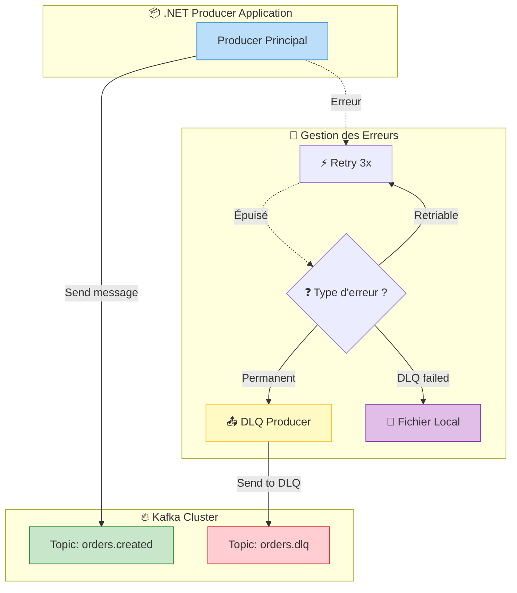
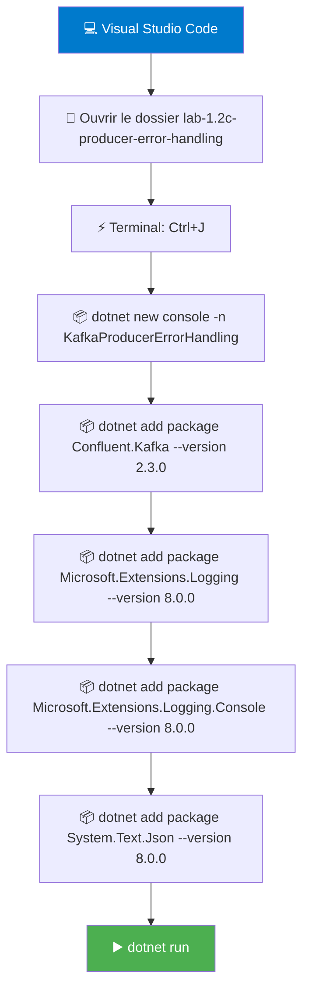
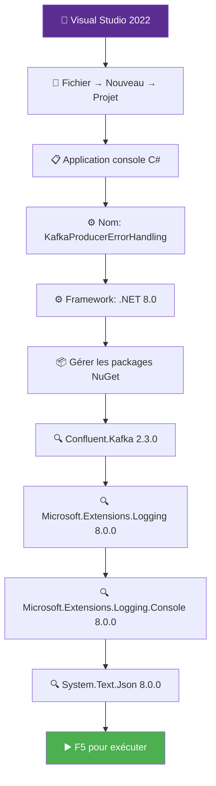

# LAB 1.2C : Producer avec Gestion d'Erreurs et DLQ

## ⏱️ Durée estimée : 45 minutes

## 🎯 Objectif

Implémenter un pattern production-ready avec classification des erreurs, retry automatique, et Dead Letter Queue (DLQ) pour les messages échoués.

### Architecture du Pattern DLQ



**Flux complet** : Le producer envoie un message → En cas d'échec, retry 3 fois → Si échec persistant, analyse du type d'erreur → Erreurs permanentes vers DLQ → Si DLQ échoue aussi, fallback vers fichier local.

## 📚 Ce que vous allez apprendre

- Classification des erreurs Kafka (retriable vs permanent vs configuration)
- Pattern Dead Letter Queue (DLQ) pour messages échoués
- Retry automatique avec exponential backoff
- Métadonnées d'erreur dans headers pour debugging
- Logging structuré et monitoring des échecs
- Fallback vers fichier local si DLQ échoue

---

## �️ Quick Start (5 minutes)

Pour une exécution rapide sans lire tout le lab :

```bash
# 1. Créer et configurer
cd lab-1.2c-producer-error-handling
dotnet new console -n KafkaProducerErrorHandling
cd KafkaProducerErrorHandling
dotnet add package Confluent.Kafka --version 2.3.0
dotnet add package Microsoft.Extensions.Logging --version 8.0.0
dotnet add package Microsoft.Extensions.Logging.Console --version 8.0.0
dotnet add package System.Text.Json --version 8.0.0

# 2. Remplacer Program.cs avec le code fourni
# 3. Exécuter
dotnet run
```

---

## �📋 Prérequis

### Topics Kafka

Créer les topics nécessaires :

**Docker** :

```bash
# Topic principal
docker exec kafka /opt/kafka/bin/kafka-topics.sh \
  --bootstrap-server localhost:9092 \
  --create --if-not-exists \
  --topic orders.created \
  --partitions 6 \
  --replication-factor 1

# Topic DLQ (Dead Letter Queue)
docker exec kafka /opt/kafka/bin/kafka-topics.sh \
  --bootstrap-server localhost:9092 \
  --create --if-not-exists \
  --topic orders.dlq \
  --partitions 3 \
  --replication-factor 1
```

**OKD/K3s** :

```bash
kubectl run kafka-cli -it --rm --image=quay.io/strimzi/kafka:latest-kafka-4.0.0 \
  --restart=Never -n kafka -- \
  bin/kafka-topics.sh --bootstrap-server bhf-kafka-kafka-bootstrap:9092 \
  --create --if-not-exists --topic orders.created --partitions 6 --replication-factor 3

kubectl run kafka-cli -it --rm --image=quay.io/strimzi/kafka:latest-kafka-4.0.0 \
  --restart=Never -n kafka -- \
  bin/kafka-topics.sh --bootstrap-server bhf-kafka-kafka-bootstrap:9092 \
  --create --if-not-exists --topic orders.dlq --partitions 3 --replication-factor 3
```

---

## 🚀 Instructions Pas à Pas

### Étape 1 : Créer le projet

#### 💻 Option A : Visual Studio Code



**Commandes** :

```bash
cd lab-1.2c-producer-error-handling
dotnet new console -n KafkaProducerErrorHandling
cd KafkaProducerErrorHandling
dotnet add package Confluent.Kafka --version 2.3.0
dotnet add package Microsoft.Extensions.Logging --version 8.0.0
dotnet add package Microsoft.Extensions.Logging.Console --version 8.0.0
dotnet add package System.Text.Json --version 8.0.0
```

---

#### 🎨 Option B : Visual Studio 2022



**Instructions** :

1.  **Fichier** → **Nouveau** → **Projet** (`Ctrl+Shift+N`)
2.  Sélectionner **Application console** C#
3.  Nom : `KafkaProducerErrorHandling`
4.  Framework : **.NET 8.0**
5.  Clic droit projet → **Gérer les packages NuGet** :
    - ✅ `Confluent.Kafka` version **2.3.0**
    - ✅ `Microsoft.Extensions.Logging` version **8.0.0**
    - ✅ `Microsoft.Extensions.Logging.Console` version **8.0.0**
    - ✅ `System.Text.Json` version **8.0.0**
6.  **F5** pour exécuter avec débogage

---

### Étape 2 : Comprendre les types d'erreurs

#### Classification des erreurs Kafka

| Type | Retriable ? | ErrorCode | Exemple | Action |
|------|-------------|-----------|---------|--------|
| **Transient** | ✅ Oui | `NotEnoughReplicasException`, `LeaderNotAvailableException`, `NetworkException` | Broker temporairement indisponible | Retry automatique |
| **Permanent** | ❌ Non | `RecordTooLargeException`, `InvalidTopicException`, `UnknownTopicOrPartition` | Message trop grand, topic inexistant | DLQ |
| **Configuration** | ❌ Non | `AuthenticationException`, `AuthorizationException`, `SerializationException` | Credentials invalides | Fix config |

#### Pattern de gestion

```
┌─────────────────┐
│  ProduceAsync   │
└────────┬────────┘
         │
         ▼
    ┌─────────┐
    │ Success?│
    └────┬────┘
         │
    ┌────┴────┐
    │         │
   YES       NO
    │         │
    ▼         ▼
  ✓ OK   ┌──────────┐
         │ Retriable?│
         └─────┬─────┘
               │
          ┌────┴────┐
          │         │
         YES       NO
          │         │
          ▼         ▼
    ┌─────────┐  ┌─────┐
    │  Retry  │  │ DLQ │
    │(auto 3x)│  └─────┘
    └─────────┘
```

---

### Étape 3 : Comprendre le code

Le code fourni implémente un producer robuste avec :

#### 1. Configuration avec retry

```csharp
var config = new ProducerConfig
{
    BootstrapServers = "localhost:9092",
    ClientId = "dotnet-error-handling-producer",
    Acks = Acks.All,
    
    // ===== RETRY AUTOMATIQUE =====
    MessageSendMaxRetries = 3,      // 3 tentatives
    RetryBackoffMs = 1000,          // 1 seconde entre retries
    RequestTimeoutMs = 30000,       // 30 secondes timeout
};
```

#### 2. Error Handler

```csharp
.SetErrorHandler((_, error) =>
{
    if (error.IsFatal)
    {
        logger.LogCritical("Fatal error: {Code} - {Reason}", error.Code, error.Reason);
        Environment.Exit(1);  // Arrêt si erreur fatale
    }
    else
    {
        logger.LogWarning("Non-fatal error: {Code} - {Reason}", error.Code, error.Reason);
    }
})
```

#### 3. Gestion des exceptions

```csharp
catch (ProduceException<string, string> ex)
{
    logger.LogError("Failed after {Retries} retries: {ErrorCode}", 
        config.MessageSendMaxRetries, ex.Error.Code);
    
    // Classification de l'erreur
    if (IsRetriableError(ex.Error.Code))
    {
        logger.LogWarning("Transient error persisted. Consider increasing retry count.");
    }
    else if (IsPermanentError(ex.Error.Code))
    {
        logger.LogError("Permanent error. Sending to DLQ.");
        await SendToDeadLetterQueueAsync(message, ex);
    }
}
```

#### 4. Dead Letter Queue

```csharp
private static async Task SendToDeadLetterQueueAsync(
    Message<string, string> failedMessage, 
    Exception originalException)
{
    var dlqMessage = new Message<string, string>
    {
        Key = failedMessage.Key,
        Value = failedMessage.Value,
        Headers = new Headers
        {
            { "original-topic", Encoding.UTF8.GetBytes("orders.created") },
            { "error-timestamp", Encoding.UTF8.GetBytes(DateTime.UtcNow.ToString("o")) },
            { "error-type", Encoding.UTF8.GetBytes(originalException.GetType().Name) },
            { "error-message", Encoding.UTF8.GetBytes(originalException.Message) },
            { "retry-count", Encoding.UTF8.GetBytes("3") }
        }
    };
    
    await dlqProducer.ProduceAsync("orders.dlq", dlqMessage);
}
```

---

### Étape 4 : Exécuter et observer

```bash
dotnet run
```

#### Logs attendus (succès)

```
info: Sending message 1: {"orderId": "ORD-0001", ...}
info: ✓ Message 1 delivered → Partition: 3, Offset: 0
info: Sending message 2: {"orderId": "ORD-0002", ...}
info: ✓ Message 2 delivered → Partition: 1, Offset: 0
...
info: All 10 messages sent successfully!
```

---

### Étape 5 : Simuler des erreurs

#### Test 1 : Erreur transiente (broker indisponible)

1. Arrêter Kafka pendant l'envoi :
```bash
# Docker
docker stop kafka

# OKD/K3s
kubectl scale kafka bhf-kafka --replicas=0 -n kafka
```

2. Relancer le producer
3. Observer les retries dans les logs :
```
warn: Kafka internal log: [thrd:main]: Broker transport failure
warn: Non-fatal error: Local_Transport - Broker transport failure
warn: Kafka internal log: [thrd:main]: Retrying in 1000ms
```

4. Redémarrer Kafka :
```bash
# Docker
docker start kafka

# OKD/K3s
kubectl scale kafka bhf-kafka --replicas=3 -n kafka
```

#### Test 2 : Erreur permanente (topic inexistant)

1. Modifier le code pour utiliser un topic inexistant :
```csharp
const string topicName = "nonexistent.topic";
```

2. Relancer le producer
3. Observer l'erreur et l'envoi vers DLQ :
```
error: Failed after 3 retries: UnknownTopicOrPartition
error: Permanent error. Sending to DLQ.
warn: Message sent to DLQ: Key=customer-A
```

4. Vérifier le message dans DLQ :
```bash
# Docker
docker exec kafka /opt/kafka/bin/kafka-console-consumer.sh \
  --bootstrap-server localhost:9092 \
  --topic orders.dlq \
  --from-beginning \
  --property print.headers=true

# OKD/K3s
kubectl run kafka-cli -it --rm --image=quay.io/strimzi/kafka:latest-kafka-4.0.0 \
  --restart=Never -n kafka -- \
  bin/kafka-console-consumer.sh --bootstrap-server bhf-kafka-kafka-bootstrap:9092 \
  --topic orders.dlq --from-beginning --property print.headers=true
```

**Résultat attendu** :
```
original-topic:orders.created,error-timestamp:2026-02-05T12:00:00Z,error-type:ProduceException,...
{"orderId": "ORD-0001", ...}
```

---

## 🎯 Error Simulation Scenarios

### Scénarios de test disponibles

| Scénario | Comment déclencher | Comportement attendu | DLQ ? |
|----------|-------------------|----------------------|-------|
| **Broker indisponible** | `docker stop kafka` | Retry 3x → échec → DLQ | ✅ |
| **Topic inexistant** | Envoyer vers `topic.inexistant` | Erreur immédiate → DLQ | ✅ |
| **Message trop grand** | Message > 1MB | Erreur permanente → DLQ | ✅ |
| **Serialization error** | JSON invalide | Erreur permanente → DLQ | ✅ |
| **DLQ pleine** | Simuler DLQ saturée | Fallback fichier local | ❌ |

### Comment tester chaque scénario

```bash
# Scénario 1 : Broker indisponible
docker stop kafka
# Exécuter le producer → Observer les retries
docker start kafka

# Scénario 2 : Topic inexistant
# Modifier le code pour envoyer vers 'orders.nonexistent'

# Scénario 3 : Message trop grand
# Créer un message de 2MB

# Scénario 4 : DLQ échoue
# Modifier la configuration DLQ pour pointer sur un broker inexistant
```

---

## 📊 Production Readiness Checklist

### ✅ Configuration Production-Ready

| Élément | Statut | Pourquoi c'est important |
|---------|--------|---------------------------|
| **Retry automatique** | ✅ Implémenté | Gère les erreurs transientes (réseau, broker temporairement indisponible) |
| **DLQ (Dead Letter Queue)** | ✅ Implémenté | Préserve les messages échoués pour analyse manuelle |
| **Fallback fichier local** | ✅ Implémenté | Dernier recours si DLQ échoue aussi |
| **Logging structuré** | ✅ Implémenté | Facilite le monitoring et debugging |
| **Métriques d'erreur** | ✅ Implémenté | Permet de surveiller la santé du producer |
| **Timeouts configurés** | ✅ Implémenté | Évite les blocages infinis |
| **Circuit breaker** | 🔄 Optionnel | Protège contre les pannes en cascade |

### 🚀 Monitoring en production

```bash
# Surveiller les erreurs dans les logs
docker logs kafka-producer-error-handling | grep "ERROR"

# Vérifier la DLQ
docker exec kafka /opt/kafka/bin/kafka-console-consumer.sh \
  --bootstrap-server localhost:9092 --topic orders.dlq --from-beginning

# Monitorer les métriques Kafka
curl http://localhost:8080/api/clusters/kafka/brokers
```

---

## 🧪 Exercices Pratiques

### Exercice 1 : Ajouter un compteur d'erreurs

**Objectif** : Compter le nombre d'erreurs par type.

**Instructions** :

1. Ajouter un dictionnaire de compteurs :
```csharp
var errorCounts = new Dictionary<ErrorCode, int>();
```

2. Dans le catch, incrémenter le compteur :
```csharp
errorCounts[ex.Error.Code] = errorCounts.GetValueOrDefault(ex.Error.Code, 0) + 1;
```

3. Afficher les statistiques à la fin :
```csharp
Console.WriteLine("\n=== Error Statistics ===");
foreach (var kvp in errorCounts)
{
    Console.WriteLine($"{kvp.Key}: {kvp.Value} errors");
}
```

---

### Exercice 2 : Implémenter exponential backoff

**Objectif** : Augmenter progressivement le délai entre retries.

**Instructions** :

1. Créer une méthode de retry avec backoff :
```csharp
private static async Task<DeliveryResult<string, string>> ProduceWithExponentialBackoffAsync(
    IProducer<string, string> producer,
    string topic,
    Message<string, string> message,
    int maxRetries = 3)
{
    for (int attempt = 0; attempt <= maxRetries; attempt++)
    {
        try
        {
            return await producer.ProduceAsync(topic, message);
        }
        catch (ProduceException<string, string> ex) when (IsRetriableError(ex.Error.Code) && attempt < maxRetries)
        {
            var delayMs = (int)Math.Pow(2, attempt) * 1000;  // 1s, 2s, 4s, 8s
            logger.LogWarning("Retry {Attempt}/{MaxRetries} after {Delay}ms", attempt + 1, maxRetries, delayMs);
            await Task.Delay(delayMs);
        }
    }
    
    throw new Exception("Max retries exceeded");
}
```

2. Utiliser cette méthode au lieu de `ProduceAsync` direct.

---

### Exercice 3 : Monitoring avec métriques

**Objectif** : Exposer des métriques pour monitoring.

**Instructions** :

1. Ajouter des compteurs :
```csharp
private static long messagesProduced = 0;
private static long messagesFailed = 0;
private static long messagesSentToDLQ = 0;
```

2. Incrémenter selon le résultat :
```csharp
// Succès
Interlocked.Increment(ref messagesProduced);

// Échec
Interlocked.Increment(ref messagesFailed);

// DLQ
Interlocked.Increment(ref messagesSentToDLQ);
```

3. Afficher les métriques :
```csharp
Console.WriteLine($"\n=== Metrics ===");
Console.WriteLine($"Messages produced: {messagesProduced}");
Console.WriteLine($"Messages failed: {messagesFailed}");
Console.WriteLine($"Messages sent to DLQ: {messagesSentToDLQ}");
Console.WriteLine($"Success rate: {(double)messagesProduced / (messagesProduced + messagesFailed):P2}");
```

---

## ✅ Validation du Lab

Vous avez réussi ce lab si :

- [ ] Vous comprenez la différence entre erreurs retriable et permanent
- [ ] Le producer gère automatiquement les retries (3 tentatives)
- [ ] Les messages échoués sont envoyés vers DLQ avec métadonnées
- [ ] Les headers DLQ contiennent les informations d'erreur
- [ ] Vous savez simuler et observer différents types d'erreurs
- [ ] Le code est production-ready avec logging structuré

---

## 🎯 Points Clés à Retenir

### 1. Classification des erreurs

**Retriable** (transient) :
- `Local_Transport` : Problème réseau temporaire
- `NotEnoughReplicas` : Pas assez de réplicas synchronisés
- `LeaderNotAvailable` : Leader en cours d'élection
- `RequestTimedOut` : Timeout réseau

**Permanent** (non-retriable) :
- `MsgSizeTooLarge` : Message dépasse `max.message.bytes`
- `UnknownTopicOrPartition` : Topic n'existe pas
- `InvalidTopic` : Nom de topic invalide
- `RecordTooLarge` : Message trop grand

**Configuration** :
- `AuthenticationException` : Credentials invalides
- `AuthorizationException` : Pas de permissions
- `SerializationException` : Erreur de sérialisation

### 2. Pattern DLQ

**Avantages** :
- ✅ Pas de perte de messages
- ✅ Debugging facilité (métadonnées d'erreur)
- ✅ Retraitement possible après fix
- ✅ Monitoring centralisé

**Best Practices** :
- Toujours inclure métadonnées d'erreur dans headers
- Monitorer le topic DLQ (alertes si messages)
- Prévoir un processus de retraitement
- Ne jamais bloquer le producer principal

### 3. Retry Strategy

**Configuration recommandée** :
```csharp
MessageSendMaxRetries = 3           // 3 tentatives
RetryBackoffMs = 1000               // 1 seconde entre retries
RequestTimeoutMs = 30000            // 30 secondes timeout
```

**Exponential backoff** (optionnel) :
- Retry 1 : 1 seconde
- Retry 2 : 2 secondes
- Retry 3 : 4 secondes
- Retry 4 : 8 secondes

### 4. Fallback Strategy

Si DLQ échoue aussi :
1. Logger dans fichier local
2. Écrire dans base de données
3. Envoyer alerte critique
4. Ne jamais perdre le message silencieusement

---

## 📖 Concepts Théoriques

### Circuit Breaker Pattern

Pour éviter de surcharger un système défaillant :

```csharp
private static int consecutiveFailures = 0;
private const int CircuitBreakerThreshold = 10;
private static bool circuitOpen = false;

if (circuitOpen)
{
    logger.LogWarning("Circuit breaker is OPEN. Skipping message.");
    await SendToDeadLetterQueueAsync(message, new Exception("Circuit breaker open"));
    return;
}

try
{
    await producer.ProduceAsync(topic, message);
    consecutiveFailures = 0;  // Reset on success
}
catch (ProduceException ex)
{
    consecutiveFailures++;
    if (consecutiveFailures >= CircuitBreakerThreshold)
    {
        circuitOpen = true;
        logger.LogCritical("Circuit breaker OPENED after {Count} failures", consecutiveFailures);
    }
}
```

### Idempotence

Pour éviter les doublons en cas de retry :

```csharp
var config = new ProducerConfig
{
    EnableIdempotence = true,  // Garantit exactly-once
    MaxInFlight = 5,           // Max 5 requêtes en parallèle
    Acks = Acks.All            // Obligatoire avec idempotence
};
```

**Fonctionnement** :
- Kafka assigne un ID unique à chaque message
- Si retry, Kafka détecte le doublon et l'ignore
- Garantit exactly-once delivery

---

## 🚀 Prochaine Étape

Félicitations ! Vous avez complété le module Producer avec un code production-ready.

**Récapitulatif du module** :
- ✅ LAB 1.2A : Producer basique avec configuration minimale
- ✅ LAB 1.2B : Partitionnement par clé pour ordre garanti
- ✅ LAB 1.2C : Gestion d'erreurs et DLQ pour résilience

👉 **Passez au [Module 03 : Consumer C#](../../module-03-consumer/README.md)**

Dans le prochain module, vous apprendrez :
- Poll loop et gestion des offsets
- Consumer Groups et scaling horizontal
- Rebalancing et gestion d'état
- Auto-commit vs manual-commit
