# LAB 1.2C : API Producer avec Gestion d'Erreurs et DLQ - Transactions Échouées

## ⏱️ Durée estimée : 60 minutes

## 🏦 Contexte E-Banking

Dans un système bancaire en production, les erreurs sont **inévitables** : pannes réseau, brokers surchargés, timeouts. Une transaction de 10 000€ qui échoue silencieusement peut entraîner une **perte financière**, un **litige client**, ou une **non-conformité réglementaire**. Ce lab implémente les patterns de résilience utilisés dans les vraies banques.

Dans ce lab, vous allez créer une API Web **production-ready** qui gère les erreurs de manière robuste. Les transactions bancaires échouées sont envoyées vers une **Dead Letter Queue (DLQ)** pour analyse et retraitement. Un système de **retry avec exponential backoff** et un **circuit breaker** protègent contre les pannes en cascade.

### Pourquoi la Résilience est Critique en E-Banking

```mermaid
sequenceDiagram
    actor Client as 🧑‍💼 Client (Virement 10 000€)
    participant API as 🚀 E-Banking API
    participant Kafka as 🔥 Kafka
    participant DLQ as ☠️ DLQ
    participant Ops as 📟 Équipe Ops
    participant Ledger as 💰 Grand Livre

    Client->>API: POST /api/transactions (10 000€)

    alt Scénario 1: Sans gestion d'erreurs
        API->>Kafka: ProduceAsync()
        Kafka--xAPI: ❌ BrokerTransportFailure
        API-->>Client: 500 Internal Server Error
        Note over Client: 😱 "Mon virement a-t-il été effectué ?"
        Note over Ledger: ⚠️ Transaction perdue!
    end

    alt Scénario 2: Avec gestion d'erreurs (ce lab)
        API->>Kafka: ProduceAsync() - Tentative 1
        Kafka--xAPI: ❌ Timeout
        Note over API: ⏳ Backoff 1s
        API->>Kafka: ProduceAsync() - Tentative 2
        Kafka--xAPI: ❌ Timeout
        Note over API: ⏳ Backoff 2s
        API->>Kafka: ProduceAsync() - Tentative 3
        Kafka-->>API: ✅ ACK (Partition 2, Offset 99)
        API-->>Client: 201 Created
        Note over Client: ✅ "Virement confirmé"
    end

    alt Scénario 3: Erreur permanente
        API->>Kafka: ProduceAsync() x3
        Kafka--xAPI: ❌ RecordTooLarge (permanent)
        API->>DLQ: SendToDlqAsync() avec headers d'erreur
        DLQ-->>API: OK
        API-->>Client: 202 Accepted ("En cours d'analyse")
        DLQ->>Ops: 🚨 Alerte: Transaction en DLQ
        Ops->>Ledger: Retraitement manuel après correction
    end
```



### Scénarios d'Erreur en E-Banking

| Scénario | Erreur Kafka | Impact Bancaire | Stratégie |
| -------- | ------------ | --------------- | --------- |
| **Pic de charge (Black Friday)** | `RequestTimedOut` | Paiements carte en attente | Retry 3x + backoff |
| **Maintenance broker** | `LeaderNotAvailable` | Virements retardés | Retry auto, transparent |
| **Message trop gros** | `MsgSizeTooLarge` | Pièce jointe trop volumineuse | DLQ + alerte |
| **Topic supprimé** | `UnknownTopic` | Toutes les transactions bloquent | DLQ + alerte critique |
| **Panne complète Kafka** | `Local_Transport` | Aucune transaction ne passe | Circuit breaker + fichier local |
| **Réseau instable** | `Local_Timeout` | Transactions intermittentes | Retry avec backoff croissant |

### Architecture de Résilience

```mermaid
flowchart TB
    subgraph API["🚀 ASP.NET Core Web API"]
        TC["TransactionsController"]
        RS["ResilientKafkaProducerService"]
    end

    subgraph ErrorHandling["🔧 Gestion des Erreurs"]
        R["⚡ Retry 3x + Backoff"]
        CB["🔒 Circuit Breaker"]
        C{"??? Type d'erreur ?"}
    end

    subgraph Kafka["🔥 Kafka Cluster"]
        T1["📋 banking.transactions"]
        T2["📋 banking.transactions.dlq"]
    end

    subgraph Fallback["📄 Fallback"]
        F["💾 Fichier Local JSON"]
    end

    subgraph Monitoring["📊 Monitoring"]
        M["📈 Métriques API"]
    end

    TC --> RS
    RS -->|"Succès"| T1
    RS -.->|"Erreur"| R
    R -.->|"Épuisé"| C
    C -->|"Retriable"| R
    C -->|"Permanent"| T2
    C -->|"DLQ failed"| F
    RS -.->|"Trop d'échecs"| CB
    CB -.->|"Circuit ouvert"| T2
    RS -.->|"Stats"| M

    style API fill:#e8f5e8,stroke:#388e3c
    style T1 fill:#c8e6c9,stroke:#388e3c
    style T2 fill:#ffcdd2,stroke:#d32f2f
    style F fill:#e1bee7,stroke:#7b1fa2
    style Monitoring fill:#e3f2fd,stroke:#1976d2
```



---

## 🎯 Objectifs

À la fin de ce lab, vous serez capable de :

1. Classifier les **erreurs Kafka** (retriable vs permanent vs configuration)
2. Implémenter un **pattern DLQ** pour les transactions échouées
3. Ajouter un **retry avec exponential backoff**
4. Implémenter un **circuit breaker** pour protéger le système
5. Exposer des **métriques d'erreur** via l'API
6. Tester tous les scénarios d'erreur via **Swagger/OpenAPI**

---

## 📋 Prérequis

### LAB 1.2A et 1.2B complétés

### Topics Kafka

**Docker** :

```bash
# Topic principal
docker exec kafka /opt/kafka/bin/kafka-topics.sh \
  --bootstrap-server localhost:9092 \
  --create --if-not-exists \
  --topic banking.transactions \
  --partitions 6 \
  --replication-factor 1

# Topic DLQ (Dead Letter Queue)
docker exec kafka /opt/kafka/bin/kafka-topics.sh \
  --bootstrap-server localhost:9092 \
  --create --if-not-exists \
  --topic banking.transactions.dlq \
  --partitions 3 \
  --replication-factor 1
```

**OKD/K3s** :

```bash
kubectl run kafka-cli -it --rm --image=quay.io/strimzi/kafka:latest-kafka-4.0.0 \
  --restart=Never -n kafka -- \
  bin/kafka-topics.sh --bootstrap-server bhf-kafka-kafka-bootstrap:9092 \
  --create --if-not-exists --topic banking.transactions --partitions 6 --replication-factor 3

kubectl run kafka-cli -it --rm --image=quay.io/strimzi/kafka:latest-kafka-4.0.0 \
  --restart=Never -n kafka -- \
  bin/kafka-topics.sh --bootstrap-server bhf-kafka-kafka-bootstrap:9092 \
  --create --if-not-exists --topic banking.transactions.dlq --partitions 3 --replication-factor 3
```

---

## 🚀 Instructions Pas à Pas

### Étape 1 : Créer le projet API Web

#### 💻 Option A : Visual Studio Code

```bash
cd lab-1.2c-producer-error-handling
dotnet new webapi -n EBankingResilientProducerAPI
cd EBankingResilientProducerAPI
dotnet add package Confluent.Kafka --version 2.3.0
dotnet add package Swashbuckle.AspNetCore --version 6.5.0
```

#### 🎨 Option B : Visual Studio 2022

1. **Fichier** → **Nouveau** → **Projet** (`Ctrl+Shift+N`)
2. Sélectionner **API Web ASP.NET Core**
3. Nom : `EBankingResilientProducerAPI`, Framework : **.NET 8.0**
4. Clic droit projet → **Gérer les packages NuGet** :
   - `Confluent.Kafka` version **2.3.0**
   - `Swashbuckle.AspNetCore` version **6.5.0**

---

### Étape 2 : Comprendre les types d'erreurs

#### Classification des erreurs Kafka en e-banking

| Type | Retriable ? | Exemples | Action | Impact bancaire |
| ---- | ----------- | -------- | ------ | --------------- |
| **Transient** | Oui | `BrokerTransportFailure`, `LeaderNotAvailable` | Retry auto | Transaction en attente |
| **Permanent** | Non | `RecordTooLarge`, `UnknownTopic` | DLQ | Transaction rejetée |
| **Configuration** | Non | `AuthenticationException` | Fix config | Service indisponible |

---

### Étape 3 : Créer le modèle Transaction (réutiliser LAB 1.2A)

Copier le fichier `Models/Transaction.cs` du LAB 1.2A.

---

### Étape 4 : Créer le service Kafka Producer résilient

Créer le fichier `Services/ResilientKafkaProducerService.cs` :

```csharp
using Confluent.Kafka;
using System.Text.Json;
using EBankingResilientProducerAPI.Models;

namespace EBankingResilientProducerAPI.Services;

public class ResilientKafkaProducerService : IDisposable
{
    private readonly IProducer<string, string> _producer;
    private readonly IProducer<string, string> _dlqProducer;
    private readonly ILogger<ResilientKafkaProducerService> _logger;
    private readonly string _topic;
    private readonly string _dlqTopic;

    // Circuit Breaker state
    private int _consecutiveFailures = 0;
    private DateTime _lastFailure = DateTime.MinValue;
    private const int CircuitBreakerThreshold = 5;
    private static readonly TimeSpan CircuitBreakerTimeout = TimeSpan.FromMinutes(1);

    // Metrics
    private long _messagesProduced = 0;
    private long _messagesFailed = 0;
    private long _messagesSentToDlq = 0;
    private long _messagesSavedToFile = 0;
    private readonly Dictionary<string, int> _errorCounts = new();

    public ResilientKafkaProducerService(IConfiguration config, ILogger<ResilientKafkaProducerService> logger)
    {
        _logger = logger;
        _topic = config["Kafka:Topic"] ?? "banking.transactions";
        _dlqTopic = config["Kafka:DlqTopic"] ?? "banking.transactions.dlq";

        var producerConfig = new ProducerConfig
        {
            BootstrapServers = config["Kafka:BootstrapServers"] ?? "localhost:9092",
            ClientId = config["Kafka:ClientId"] ?? "ebanking-resilient-producer",
            Acks = Acks.All,
            EnableIdempotence = true,
            MessageSendMaxRetries = 3,
            RetryBackoffMs = 1000,
            RequestTimeoutMs = 30000,
            LingerMs = 10,
            BatchSize = 16384,
            CompressionType = CompressionType.Snappy
        };

        _producer = new ProducerBuilder<string, string>(producerConfig)
            .SetErrorHandler((_, error) =>
            {
                if (error.IsFatal)
                    _logger.LogCritical("FATAL Kafka Error: {Reason}", error.Reason);
                else
                    _logger.LogWarning("Kafka Error: {Reason} (Code: {Code})", error.Reason, error.Code);
            })
            .Build();

        _dlqProducer = new ProducerBuilder<string, string>(producerConfig).Build();
    }

    /// <summary>
    /// Send transaction with full error handling, retry, DLQ, and circuit breaker
    /// </summary>
    public async Task<TransactionResult> SendTransactionAsync(
        Transaction transaction, CancellationToken ct = default)
    {
        // Circuit Breaker check
        if (IsCircuitOpen())
        {
            _logger.LogWarning("Circuit breaker OPEN. Sending {Id} directly to DLQ",
                transaction.TransactionId);
            await SendToDlqAsync(transaction, "Circuit breaker open", "CircuitBreakerException");
            return new TransactionResult
            {
                TransactionId = transaction.TransactionId,
                Status = "SentToDLQ",
                ErrorMessage = "Circuit breaker is open - too many consecutive failures"
            };
        }

        // Retry with exponential backoff
        var maxRetries = 3;
        for (int attempt = 0; attempt <= maxRetries; attempt++)
        {
            try
            {
                var json = JsonSerializer.Serialize(transaction, new JsonSerializerOptions
                {
                    PropertyNamingPolicy = JsonNamingPolicy.CamelCase
                });

                var message = new Message<string, string>
                {
                    Key = transaction.CustomerId,
                    Value = json,
                    Headers = new Headers
                    {
                        { "correlation-id", System.Text.Encoding.UTF8.GetBytes(Guid.NewGuid().ToString()) },
                        { "event-type", System.Text.Encoding.UTF8.GetBytes("transaction.created") },
                        { "source", System.Text.Encoding.UTF8.GetBytes("ebanking-resilient-api") },
                        { "attempt", System.Text.Encoding.UTF8.GetBytes((attempt + 1).ToString()) }
                    },
                    Timestamp = new Timestamp(transaction.Timestamp)
                };

                var result = await _producer.ProduceAsync(_topic, message, ct);

                // Success - reset circuit breaker
                Interlocked.Increment(ref _messagesProduced);
                _consecutiveFailures = 0;

                _logger.LogInformation(
                    "Transaction {Id} sent (attempt {A}) → Partition: {P}, Offset: {O}",
                    transaction.TransactionId, attempt + 1,
                    result.Partition.Value, result.Offset.Value);

                return new TransactionResult
                {
                    TransactionId = transaction.TransactionId,
                    Status = "Processing",
                    KafkaPartition = result.Partition.Value,
                    KafkaOffset = result.Offset.Value,
                    Timestamp = result.Timestamp.UtcDateTime,
                    Attempts = attempt + 1
                };
            }
            catch (ProduceException<string, string> ex)
            {
                _logger.LogWarning("Attempt {A}/{Max} failed for {Id}: {Error}",
                    attempt + 1, maxRetries + 1, transaction.TransactionId, ex.Error.Reason);

                TrackError(ex.Error.Code.ToString());

                if (!IsRetriableError(ex.Error.Code) || attempt == maxRetries)
                {
                    // Permanent error or retries exhausted → DLQ
                    Interlocked.Increment(ref _messagesFailed);
                    _consecutiveFailures++;
                    _lastFailure = DateTime.UtcNow;

                    await SendToDlqAsync(transaction, ex.Error.Reason, ex.Error.Code.ToString());

                    return new TransactionResult
                    {
                        TransactionId = transaction.TransactionId,
                        Status = "SentToDLQ",
                        ErrorMessage = $"Error: {ex.Error.Reason} (Code: {ex.Error.Code})",
                        Attempts = attempt + 1
                    };
                }

                // Exponential backoff: 1s, 2s, 4s
                var delayMs = (int)Math.Pow(2, attempt) * 1000;
                _logger.LogInformation("Retrying in {Delay}ms...", delayMs);
                await Task.Delay(delayMs, ct);
            }
        }

        return new TransactionResult
        {
            TransactionId = transaction.TransactionId,
            Status = "Failed",
            ErrorMessage = "Unexpected: all retries exhausted"
        };
    }

    private async Task SendToDlqAsync(Transaction transaction, string errorMessage, string errorCode)
    {
        try
        {
            var json = JsonSerializer.Serialize(transaction, new JsonSerializerOptions
            {
                PropertyNamingPolicy = JsonNamingPolicy.CamelCase
            });

            var dlqMessage = new Message<string, string>
            {
                Key = transaction.CustomerId,
                Value = json,
                Headers = new Headers
                {
                    { "original-topic", System.Text.Encoding.UTF8.GetBytes(_topic) },
                    { "error-timestamp", System.Text.Encoding.UTF8.GetBytes(DateTime.UtcNow.ToString("o")) },
                    { "error-code", System.Text.Encoding.UTF8.GetBytes(errorCode) },
                    { "error-message", System.Text.Encoding.UTF8.GetBytes(errorMessage) },
                    { "transaction-id", System.Text.Encoding.UTF8.GetBytes(transaction.TransactionId) },
                    { "customer-id", System.Text.Encoding.UTF8.GetBytes(transaction.CustomerId) },
                    { "amount", System.Text.Encoding.UTF8.GetBytes(transaction.Amount.ToString("F2")) }
                }
            };

            await _dlqProducer.ProduceAsync(_dlqTopic, dlqMessage);
            Interlocked.Increment(ref _messagesSentToDlq);

            _logger.LogWarning("Transaction {Id} sent to DLQ: {Error}",
                transaction.TransactionId, errorMessage);
        }
        catch (Exception dlqEx)
        {
            // DLQ failed → fallback to local file
            _logger.LogError(dlqEx, "DLQ failed for {Id}. Saving to local file.",
                transaction.TransactionId);
            await SaveToLocalFileAsync(transaction, errorMessage, dlqEx.Message);
        }
    }

    private async Task SaveToLocalFileAsync(Transaction transaction, string originalError, string dlqError)
    {
        var fallbackDir = Path.Combine(AppContext.BaseDirectory, "fallback");
        Directory.CreateDirectory(fallbackDir);

        var entry = new
        {
            Timestamp = DateTime.UtcNow,
            Transaction = transaction,
            OriginalError = originalError,
            DlqError = dlqError
        };

        var json = JsonSerializer.Serialize(entry, new JsonSerializerOptions { WriteIndented = true });
        var fileName = $"failed-tx-{transaction.TransactionId}-{DateTime.UtcNow:yyyyMMddHHmmss}.json";
        await File.AppendAllTextAsync(Path.Combine(fallbackDir, fileName), json + Environment.NewLine);

        Interlocked.Increment(ref _messagesSavedToFile);
        _logger.LogCritical("Transaction {Id} saved to fallback file: {File}",
            transaction.TransactionId, fileName);
    }

    private bool IsCircuitOpen() =>
        _consecutiveFailures >= CircuitBreakerThreshold &&
        DateTime.UtcNow - _lastFailure < CircuitBreakerTimeout;

    private static bool IsRetriableError(ErrorCode code) => code switch
    {
        ErrorCode.Local_Transport => true,
        ErrorCode.Local_Timeout => true,
        ErrorCode.NotEnoughReplicas => true,
        ErrorCode.LeaderNotAvailable => true,
        ErrorCode.RequestTimedOut => true,
        _ => false
    };

    private void TrackError(string errorCode)
    {
        lock (_errorCounts)
        {
            _errorCounts[errorCode] = _errorCounts.GetValueOrDefault(errorCode, 0) + 1;
        }
    }

    /// <summary>
    /// Get producer metrics
    /// </summary>
    public ProducerMetrics GetMetrics() => new()
    {
        MessagesProduced = _messagesProduced,
        MessagesFailed = _messagesFailed,
        MessagesSentToDlq = _messagesSentToDlq,
        MessagesSavedToFile = _messagesSavedToFile,
        CircuitBreakerOpen = IsCircuitOpen(),
        ConsecutiveFailures = _consecutiveFailures,
        ErrorCounts = new Dictionary<string, int>(_errorCounts),
        SuccessRate = _messagesProduced + _messagesFailed > 0
            ? (double)_messagesProduced / (_messagesProduced + _messagesFailed) * 100
            : 100
    };

    public void Dispose()
    {
        _producer?.Flush(TimeSpan.FromSeconds(10));
        _producer?.Dispose();
        _dlqProducer?.Flush(TimeSpan.FromSeconds(10));
        _dlqProducer?.Dispose();
    }
}

// --- Result and Metrics DTOs ---

public class TransactionResult
{
    public string TransactionId { get; set; } = string.Empty;
    public string Status { get; set; } = string.Empty;
    public int KafkaPartition { get; set; }
    public long KafkaOffset { get; set; }
    public DateTime Timestamp { get; set; }
    public int Attempts { get; set; }
    public string? ErrorMessage { get; set; }
}

public class ProducerMetrics
{
    public long MessagesProduced { get; set; }
    public long MessagesFailed { get; set; }
    public long MessagesSentToDlq { get; set; }
    public long MessagesSavedToFile { get; set; }
    public bool CircuitBreakerOpen { get; set; }
    public int ConsecutiveFailures { get; set; }
    public Dictionary<string, int> ErrorCounts { get; set; } = new();
    public double SuccessRate { get; set; }
}
```

---

### Étape 5 : Créer le contrôleur API

Créer le fichier `Controllers/TransactionsController.cs` :

```csharp
using Microsoft.AspNetCore.Mvc;
using EBankingResilientProducerAPI.Models;
using EBankingResilientProducerAPI.Services;

namespace EBankingResilientProducerAPI.Controllers;

[ApiController]
[Route("api/[controller]")]
[Produces("application/json")]
public class TransactionsController : ControllerBase
{
    private readonly ResilientKafkaProducerService _kafka;
    private readonly ILogger<TransactionsController> _logger;

    public TransactionsController(ResilientKafkaProducerService kafka, ILogger<TransactionsController> logger)
    {
        _kafka = kafka;
        _logger = logger;
    }

    /// <summary>
    /// Créer une transaction avec gestion d'erreurs complète (retry + DLQ + circuit breaker)
    /// </summary>
    /// <remarks>
    /// La transaction sera envoyée à Kafka avec retry automatique.
    /// En cas d'échec persistant, elle sera redirigée vers la DLQ.
    /// Si le circuit breaker est ouvert, elle ira directement en DLQ.
    ///
    ///     POST /api/transactions
    ///     {
    ///         "fromAccount": "FR7630001000123456789",
    ///         "toAccount":   "FR7630001000987654321",
    ///         "amount": 250.00,
    ///         "currency": "EUR",
    ///         "type": 1,
    ///         "description": "Virement mensuel loyer",
    ///         "customerId": "CUST-001"
    ///     }
    ///
    /// </remarks>
    [HttpPost]
    [ProducesResponseType(typeof(TransactionResult), StatusCodes.Status201Created)]
    [ProducesResponseType(typeof(TransactionResult), StatusCodes.Status202Accepted)]
    [ProducesResponseType(typeof(ProblemDetails), StatusCodes.Status400BadRequest)]
    [ProducesResponseType(typeof(ProblemDetails), StatusCodes.Status500InternalServerError)]
    public async Task<ActionResult<TransactionResult>> CreateTransaction(
        [FromBody] Transaction transaction, CancellationToken ct)
    {
        if (string.IsNullOrEmpty(transaction.TransactionId))
            transaction.TransactionId = Guid.NewGuid().ToString();

        var result = await _kafka.SendTransactionAsync(transaction, ct);

        return result.Status switch
        {
            "Processing" => CreatedAtAction(nameof(GetTransaction),
                new { transactionId = result.TransactionId }, result),
            "SentToDLQ" => Accepted(result),
            _ => StatusCode(500, result)
        };
    }

    /// <summary>
    /// Envoyer un lot de transactions avec gestion d'erreurs
    /// </summary>
    [HttpPost("batch")]
    [ProducesResponseType(typeof(BatchResilientResponse), StatusCodes.Status201Created)]
    public async Task<ActionResult<BatchResilientResponse>> CreateBatch(
        [FromBody] List<Transaction> transactions, CancellationToken ct)
    {
        var results = new List<TransactionResult>();

        foreach (var tx in transactions)
        {
            if (string.IsNullOrEmpty(tx.TransactionId))
                tx.TransactionId = Guid.NewGuid().ToString();

            results.Add(await _kafka.SendTransactionAsync(tx, ct));
        }

        var response = new BatchResilientResponse
        {
            TotalCount = results.Count,
            SuccessCount = results.Count(r => r.Status == "Processing"),
            DlqCount = results.Count(r => r.Status == "SentToDLQ"),
            FailedCount = results.Count(r => r.Status == "Failed"),
            Transactions = results
        };

        return Created("", response);
    }

    /// <summary>
    /// Obtenir les métriques du producer (erreurs, DLQ, circuit breaker)
    /// </summary>
    [HttpGet("metrics")]
    [ProducesResponseType(typeof(ProducerMetrics), StatusCodes.Status200OK)]
    public ActionResult<ProducerMetrics> GetMetrics()
    {
        return Ok(_kafka.GetMetrics());
    }

    /// <summary>
    /// Obtenir le statut d'une transaction (placeholder)
    /// </summary>
    [HttpGet("{transactionId}")]
    [ProducesResponseType(typeof(TransactionResult), StatusCodes.Status200OK)]
    public ActionResult<TransactionResult> GetTransaction(string transactionId)
    {
        return Ok(new TransactionResult
        {
            TransactionId = transactionId,
            Status = "Processing",
            Timestamp = DateTime.UtcNow
        });
    }

    /// <summary>
    /// Health check avec état du circuit breaker
    /// </summary>
    [HttpGet("health")]
    [ProducesResponseType(typeof(object), StatusCodes.Status200OK)]
    public ActionResult GetHealth()
    {
        var metrics = _kafka.GetMetrics();
        return Ok(new
        {
            Status = metrics.CircuitBreakerOpen ? "Degraded" : "Healthy",
            Service = "EBanking Resilient Producer API",
            CircuitBreaker = metrics.CircuitBreakerOpen ? "OPEN" : "CLOSED",
            ConsecutiveFailures = metrics.ConsecutiveFailures,
            SuccessRate = $"{metrics.SuccessRate:F1}%",
            Timestamp = DateTime.UtcNow
        });
    }
}

// --- Response DTOs ---

public class BatchResilientResponse
{
    public int TotalCount { get; set; }
    public int SuccessCount { get; set; }
    public int DlqCount { get; set; }
    public int FailedCount { get; set; }
    public List<TransactionResult> Transactions { get; set; } = new();
}
```

---

### Étape 6 : Configurer Program.cs

```csharp
using EBankingResilientProducerAPI.Services;
using Microsoft.OpenApi.Models;
using System.Reflection;

var builder = WebApplication.CreateBuilder(args);

builder.Services.AddControllers();
builder.Services.AddSingleton<ResilientKafkaProducerService>();

builder.Services.AddEndpointsApiExplorer();
builder.Services.AddSwaggerGen(options =>
{
    options.SwaggerDoc("v1", new OpenApiInfo
    {
        Title = "E-Banking Resilient Producer API",
        Version = "v1",
        Description = "API de transactions bancaires avec gestion d'erreurs production-ready.\n\n"
            + "**Fonctionnalités :**\n"
            + "- Retry avec exponential backoff (1s, 2s, 4s)\n"
            + "- Dead Letter Queue (DLQ) pour transactions échouées\n"
            + "- Circuit breaker (seuil: 5 échecs consécutifs)\n"
            + "- Fallback fichier local si DLQ échoue\n"
            + "- Métriques temps réel\n\n"
            + "**Endpoints :**\n"
            + "- `POST /api/transactions` — Transaction avec retry + DLQ\n"
            + "- `POST /api/transactions/batch` — Lot avec rapport d'erreurs\n"
            + "- `GET /api/transactions/metrics` — Métriques du producer\n"
            + "- `GET /api/transactions/health` — Health + circuit breaker"
    });

    var xmlFile = $"{Assembly.GetExecutingAssembly().GetName().Name}.xml";
    var xmlPath = Path.Combine(AppContext.BaseDirectory, xmlFile);
    if (File.Exists(xmlPath))
        options.IncludeXmlComments(xmlPath);
});

var app = builder.Build();

app.UseSwagger();
app.UseSwaggerUI(c =>
{
    c.SwaggerEndpoint("/swagger/v1/swagger.json", "E-Banking Resilient Producer API v1");
    c.RoutePrefix = "swagger";
});

app.MapControllers();

var logger = app.Services.GetRequiredService<ILogger<Program>>();
logger.LogInformation("========================================");
logger.LogInformation("  E-Banking Resilient Producer API");
logger.LogInformation("  Features: Retry, DLQ, Circuit Breaker");
logger.LogInformation("  Swagger UI : https://localhost:5001/swagger");
logger.LogInformation("========================================");

app.Run();
```

---

### Étape 7 : Configurer appsettings.json

```json
{
  "Logging": {
    "LogLevel": {
      "Default": "Information",
      "Microsoft.AspNetCore": "Warning"
    }
  },
  "Kafka": {
    "BootstrapServers": "localhost:9092",
    "Topic": "banking.transactions",
    "DlqTopic": "banking.transactions.dlq",
    "ClientId": "ebanking-resilient-producer"
  }
}
```

---

### Étape 8 : Exécuter et tester

```bash
dotnet run
```

Ouvrir Swagger UI : **<https://localhost:5001/swagger>**

---

## 🧪 Tests OpenAPI (Swagger)

### Test 1 : Transaction normale (succès)

**POST /api/transactions** :

```json
{
  "fromAccount": "FR7630001000123456789",
  "toAccount": "FR7630001000987654321",
  "amount": 250.00,
  "currency": "EUR",
  "type": 1,
  "description": "Virement mensuel loyer",
  "customerId": "CUST-001",
  "riskScore": 5
}
```

**Réponse attendue** (201 Created) :

```json
{
  "transactionId": "a1b2c3d4-...",
  "status": "Processing",
  "kafkaPartition": 2,
  "kafkaOffset": 0,
  "timestamp": "2026-02-06T00:00:00Z",
  "attempts": 1,
  "errorMessage": null
}
```

### Test 2 : Lot de transactions mixtes

**POST /api/transactions/batch** :

```json
[
  {
    "fromAccount": "FR7630001000123456789",
    "toAccount": "FR7630001000111111111",
    "amount": 50.00,
    "currency": "EUR",
    "type": 2,
    "description": "Paiement Netflix",
    "customerId": "CUST-001"
  },
  {
    "fromAccount": "FR7630001000123456789",
    "toAccount": "FR7630001000222222222",
    "amount": 1500.00,
    "currency": "EUR",
    "type": 1,
    "description": "Virement épargne",
    "customerId": "CUST-001"
  },
  {
    "fromAccount": "FR7630001000333333333",
    "toAccount": "GB29NWBK60161331926819",
    "amount": 25000.00,
    "currency": "EUR",
    "type": 6,
    "description": "International transfer",
    "customerId": "CUST-002",
    "riskScore": 85
  }
]
```

**Réponse attendue** :

```json
{
  "totalCount": 3,
  "successCount": 3,
  "dlqCount": 0,
  "failedCount": 0,
  "transactions": [...]
}
```

### Test 3 : Consulter les métriques

**GET /api/transactions/metrics** :

```json
{
  "messagesProduced": 4,
  "messagesFailed": 0,
  "messagesSentToDlq": 0,
  "messagesSavedToFile": 0,
  "circuitBreakerOpen": false,
  "consecutiveFailures": 0,
  "errorCounts": {},
  "successRate": 100.0
}
```

### Test 4 : Health check avec circuit breaker

**GET /api/transactions/health** :

```json
{
  "status": "Healthy",
  "service": "EBanking Resilient Producer API",
  "circuitBreaker": "CLOSED",
  "consecutiveFailures": 0,
  "successRate": "100.0%",
  "timestamp": "2026-02-06T00:00:00Z"
}
```

### Test 5 : Simuler des erreurs (broker indisponible)

1. Arrêter Kafka : `docker stop kafka`
2. Envoyer une transaction via Swagger
3. Observer la réponse 202 Accepted avec `status: "SentToDLQ"`
4. Consulter les métriques → `messagesFailed` et `messagesSentToDlq` incrémentés
5. Redémarrer Kafka : `docker start kafka`

---

## 📊 Vérifier dans Kafka

### Vérifier les transactions réussies

```bash
docker exec kafka /opt/kafka/bin/kafka-console-consumer.sh \
  --bootstrap-server localhost:9092 \
  --topic banking.transactions \
  --from-beginning \
  --max-messages 10
```

### Vérifier la DLQ

```bash
docker exec kafka /opt/kafka/bin/kafka-console-consumer.sh \
  --bootstrap-server localhost:9092 \
  --topic banking.transactions.dlq \
  --from-beginning \
  --property print.headers=true
```

**Headers DLQ attendus** :

```text
original-topic:banking.transactions, error-code:Local_Transport, error-message:Broker transport failure, transaction-id:abc-123, customer-id:CUST-001, amount:250.00
```

---

## 🎯 Concepts Clés Expliqués

### Pattern DLQ en e-banking

```mermaid
sequenceDiagram
    participant C as Client
    participant API as Web API
    participant P as Producer
    participant K as Kafka
    participant DLQ as DLQ Topic
    participant F as Fichier Local

    C->>API: POST /api/transactions
    API->>P: SendTransactionAsync()

    alt Succès
        P->>K: ProduceAsync()
        K-->>P: DeliveryResult
        P-->>API: Status: Processing
        API-->>C: 201 Created
    else Échec après retries
        P->>K: ProduceAsync() x3
        K-->>P: Error
        P->>DLQ: SendToDlqAsync()
        DLQ-->>P: OK
        P-->>API: Status: SentToDLQ
        API-->>C: 202 Accepted
    else DLQ échoue aussi
        P->>DLQ: SendToDlqAsync()
        DLQ-->>P: Error
        P->>F: SaveToLocalFileAsync()
        P-->>API: Status: Failed
        API-->>C: 500 Error
    end
```



### Séquence Détaillée : Retry avec Exponential Backoff (Code Expliqué)

```mermaid
sequenceDiagram
    participant Ctrl as 📋 Controller
    participant Svc as ⚙️ ResilientKafkaProducer
    participant CB as 🔒 Circuit Breaker
    participant K as 🔥 Kafka Broker
    participant DLQ as ☠️ DLQ Producer

    Ctrl->>Svc: SendTransactionAsync(tx)
    Svc->>CB: IsCircuitOpen()?
    CB-->>Svc: false (CLOSED, 2 échecs < seuil 5)

    Note over Svc: Tentative 1/4
    Svc->>K: ProduceAsync(topic, message)
    K--xSvc: ❌ ProduceException (Local_Transport)
    Svc->>Svc: IsRetriableError(Local_Transport) = true
    Svc->>Svc: TrackError("Local_Transport")
    Note over Svc: ⏳ Backoff: 2^0 * 1000 = 1000ms

    Note over Svc: Tentative 2/4
    Svc->>K: ProduceAsync(topic, message)
    K--xSvc: ❌ ProduceException (Local_Timeout)
    Svc->>Svc: IsRetriableError(Local_Timeout) = true
    Note over Svc: ⏳ Backoff: 2^1 * 1000 = 2000ms

    Note over Svc: Tentative 3/4
    Svc->>K: ProduceAsync(topic, message)
    K-->>Svc: ✅ DeliveryResult (Partition: 2, Offset: 99)

    Svc->>Svc: _messagesProduced++
    Svc->>Svc: _consecutiveFailures = 0 (reset)
    Svc-->>Ctrl: TransactionResult {Status: "Processing", Attempts: 3}
```



### Séquence : Erreur Permanente → DLQ → Fallback


### Circuit Breaker : Machine à États

```mermaid
stateDiagram-v2
    [*] --> CLOSED

    CLOSED --> CLOSED : Succès (reset compteur)
    CLOSED --> CLOSED : Échec (compteur < 5)
    CLOSED --> OPEN : 5 échecs consécutifs

    OPEN --> OPEN : Nouvelles requêtes → DLQ direct
    OPEN --> HALF_OPEN : Timeout 1 minute expiré

    HALF_OPEN --> CLOSED : Première requête réussit
    HALF_OPEN --> OPEN : Première requête échoue

    note right of CLOSED
        Fonctionnement normal
        consecutiveFailures < 5
    end note

    note right of OPEN
        Protection active
        Toutes les tx → DLQ
        Attente 1 min avant retry
    end note

    note right of HALF_OPEN
        Test de rétablissement
        1 seule requête testée
    end note
```



### Séquence : Circuit Breaker en Action

```mermaid
sequenceDiagram
    participant C as 🌐 Client
    participant Svc as ⚙️ Producer
    participant CB as 🔒 Circuit Breaker
    participant K as 🔥 Kafka
    participant DLQ as ☠️ DLQ

    Note over CB: État: CLOSED (0 échecs)

    loop 5 échecs consécutifs
        C->>Svc: POST transaction
        Svc->>K: ProduceAsync()
        K--xSvc: ❌ Erreur
        Svc->>Svc: consecutiveFailures++
        Svc->>DLQ: SendToDlqAsync()
    end

    Note over CB: État: OPEN (5 échecs)

    C->>Svc: POST transaction
    Svc->>CB: IsCircuitOpen()? = true
    Note over Svc: Skip Kafka, envoi direct DLQ
    Svc->>DLQ: SendToDlqAsync("Circuit breaker open")
    Svc-->>C: 202 Accepted (SentToDLQ)

    Note over CB: ⏳ Après 1 minute...
    Note over CB: État: HALF-OPEN

    C->>Svc: POST transaction
    Svc->>CB: IsCircuitOpen()? = false (timeout expiré)
    Svc->>K: ProduceAsync()
    K-->>Svc: ✅ ACK
    Svc->>Svc: consecutiveFailures = 0
    Note over CB: État: CLOSED (rétabli)
    Svc-->>C: 201 Created
```



### Classification des erreurs

| Erreur | Type | Retry ? | Action | Exemple E-Banking |
| ------ | ---- | ------- | ------ | ------------------ |
| `Local_Transport` | Transient | Oui | Retry 3x | Panne réseau temporaire |
| `Local_Timeout` | Transient | Oui | Retry 3x | Broker surchargé (pic de charge) |
| `NotEnoughReplicas` | Transient | Oui | Retry 3x | Réplica en maintenance |
| `LeaderNotAvailable` | Transient | Oui | Retry 3x | Élection de leader en cours |
| `RequestTimedOut` | Transient | Oui | Retry 3x | Latence réseau élevée |
| `MsgSizeTooLarge` | Permanent | Non | DLQ | Transaction avec pièce jointe |
| `UnknownTopicOrPartition` | Permanent | Non | DLQ | Topic supprimé par erreur |
| `InvalidTopic` | Permanent | Non | DLQ | Nom de topic invalide |

### Circuit Breaker : Résumé

| État | Condition | Comportement | Réponse API |
| ---- | --------- | ------------ | ----------- |
| **CLOSED** | < 5 échecs consécutifs | Envoi normal vers Kafka | 201 Created |
| **OPEN** | >= 5 échecs consécutifs | Envoi direct en DLQ (skip Kafka) | 202 Accepted |
| **HALF-OPEN** | Après 1 minute de timeout | Tentative de rétablissement | 201 ou 202 |

### Séquence : Monitoring en Production

```mermaid
sequenceDiagram
    participant Ops as 📟 Équipe Ops
    participant API as 🚀 API
    participant Svc as ⚙️ Producer
    participant Grafana as 📊 Dashboard

    loop Toutes les 30 secondes
        Ops->>API: GET /api/transactions/metrics
        API->>Svc: GetMetrics()
        Svc-->>API: ProducerMetrics
        API-->>Ops: JSON métriques
    end

    Note over Ops: Analyse des métriques
    Ops->>Ops: successRate < 95% ?
    Ops->>Ops: circuitBreakerOpen == true ?
    Ops->>Ops: messagesSentToDlq > seuil ?

    alt Alerte déclenchée
        Ops->>Grafana: 🚨 Alerte: Success rate 87%
        Ops->>Ops: Vérifier Kafka, réseau, logs
    end

    Ops->>API: GET /api/transactions/health
    API-->>Ops: {status: "Degraded", circuitBreaker: "OPEN"}
    Note over Ops: Action corrective requise
```



---

## 🔧 Troubleshooting

| Symptôme | Cause probable | Solution |
| -------- | -------------- | -------- |
| Circuit breaker toujours ouvert | Kafka indisponible | Redémarrer Kafka, attendre 1 min |
| Messages dans fichier fallback | DLQ et Kafka indisponibles | Vérifier la connectivité réseau |
| `successRate` en baisse | Erreurs transientes fréquentes | Augmenter `RetryBackoffMs` |
| Métriques à zéro | Aucune transaction envoyée | Envoyer des transactions via Swagger |
| 202 au lieu de 201 | Transaction envoyée en DLQ | Vérifier les logs pour le type d'erreur |

---

## ✅ Validation du Lab

- [ ] L'API démarre et Swagger UI est accessible
- [ ] `POST /api/transactions` retourne 201 (succès) ou 202 (DLQ)
- [ ] `GET /api/transactions/metrics` affiche les compteurs corrects
- [ ] `GET /api/transactions/health` montre l'état du circuit breaker
- [ ] Les transactions échouées apparaissent dans `banking.transactions.dlq`
- [ ] Les headers DLQ contiennent `error-code`, `error-message`, `transaction-id`
- [ ] Vous comprenez la différence entre erreurs retriable et permanent
- [ ] Vous comprenez le fonctionnement du circuit breaker

---

## 🚀 Module Complété

Félicitations ! Vous avez complété le module Producer avec un code production-ready.

**Récapitulatif** :

- **LAB 1.2A** : API Producer basique avec Swagger/OpenAPI
- **LAB 1.2B** : Partitionnement par `CustomerId` pour ordre garanti
- **LAB 1.2C** : Gestion d'erreurs, DLQ, circuit breaker, métriques

👉 **Passez au [Module 03 : Consumer C#](../../module-03-consumer/README.md)**

Dans le prochain module :

- Poll loop et gestion des offsets
- Consumer Groups et scaling horizontal
- Rebalancing et gestion d'état
- Auto-commit vs manual-commit
