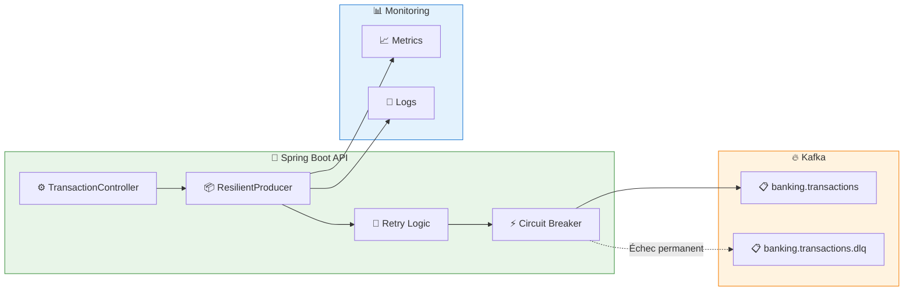

# LAB 1.2C (Java) : Producer Résilient — Retry et Dead Letter Queue

## ⏱️ Durée estimée : 45 minutes

## 🏦 Contexte E-Banking

Dans un environnement de production, les erreurs sont inévitables. Ce lab implémente un **producer résilient** capable de gérer les erreurs de manière élégante : retry pour les erreurs temporaires, et Dead Letter Queue (DLQ) pour les erreurs permanentes. Cela garantit qu'aucune transaction n'est perdue.

## 🎯 Objectifs

À la fin de ce lab, vous serez capable de :

1. Classifier les erreurs (retriable vs permanent)
2. Implémenter un **pattern de retry avec exponential backoff**
3. Configurer une **Dead Letter Queue (DLQ)** pour les messages échoués
4. Ajouter des **métadonnées d'erreur** dans les headers
5. Monitorer les métriques de production
6. Implémenter un **circuit breaker** pour protéger le système

---

## 📊 Architecture

### Producer avec Retry et DLQ



---

## 🏗️ Structure du Projet

```
java/
├── src/main/java/com/data2ai/kafka/producer/resilient/
│   ├── EBankingProducerApplication.java
│   ├── config/
│   │   ├── KafkaConfig.java
│   │   └── CircuitBreakerConfig.java
│   ├── model/
│   │   ├── Transaction.java
│   │   ├── TransactionType.java
│   │   ├── TransactionStatus.java
│   │   └── ErrorMetadata.java
│   ├── producer/
│   │   ├── ResilientTransactionProducer.java
│   │   └── DLQProducer.java
│   ├── controller/
│   │   └── TransactionController.java
│   ├── dto/
│   │   └── CreateTransactionRequest.java
│   ├── exception/
│   │   ├── RetriableException.java
│   │   └── PermanentException.java
│   └── service/
│       └── ProductionMetrics.java
├── src/main/resources/
│   └── application.yml
└── pom.xml
```

---

## 📋 Étapes de Réalisation

### Étape 1 : Configuration Maven (`pom.xml`)

> **⚠️ Important** : Assurez-vous que le plugin Spring Boot Maven est correctement configuré pour créer un JAR exécutable :

```xml
<plugin>
    <groupId>org.springframework.boot</groupId>
    <artifactId>spring-boot-maven-plugin</artifactId>
    <version>${spring-boot.version}</version>
    <executions>
        <execution>
            <goals>
                <goal>repackage</goal>
            </goals>
        </execution>
    </executions>
</plugin>
```

### Étape 2 : Exceptions Spécifiques (`exception/RetriableException.java`)

```java
public class RetriableException extends RuntimeException {
    public RetriableException(String message) {
        super(message);
    }
    
    public RetriableException(String message, Throwable cause) {
        super(message, cause);
    }
}

public class PermanentException extends RuntimeException {
    public PermanentException(String message) {
        super(message);
    }
    
    public PermanentException(String message, Throwable cause) {
        super(message, cause);
    }
}
```

### Étape 3 : Producer Résilient (`producer/ResilientTransactionProducer.java`)

```java
@Service
@Slf4j
public class ResilientTransactionProducer {

    private final KafkaTemplate<String, String> kafkaTemplate;
    private final KafkaTemplate<String, String> dlqKafkaTemplate;
    private final ObjectMapper objectMapper;
    private final ProductionMetrics metrics;

    @Value("${app.kafka.topic:banking.transactions}")
    private String topic;
    
    @Value("${app.kafka.dlq.topic:banking.transactions.dlq}")
    private String dlqTopic;
    
    @Value("${app.retry.max-attempts:3}")
    private int maxRetryAttempts;
    
    @Value("${app.retry.backoff-ms:1000}")
    private long retryBackoffMs;

    public ResilientTransactionProducer(KafkaTemplate<String, String> kafkaTemplate,
                                     KafkaTemplate<String, String> dlqKafkaTemplate,
                                     ObjectMapper objectMapper,
                                     ProductionMetrics metrics) {
        this.kafkaTemplate = kafkaTemplate;
        this.dlqKafkaTemplate = dlqKafkaTemplate;
        this.objectMapper = objectMapper;
        this.metrics = metrics;
    }

    public CompletableFuture<SendResult<String, String>> sendTransaction(Transaction transaction) {
        return sendWithRetry(transaction, 1);
    }

    private CompletableFuture<SendResult<String, String>> sendWithRetry(Transaction transaction, int attempt) {
        try {
            transaction.setTransactionId(UUID.randomUUID().toString());
            transaction.setTimestamp(Instant.now());
            transaction.setStatus(TransactionStatus.PENDING);

            String jsonValue = objectMapper.writeValueAsString(transaction);
            String key = transaction.getCustomerId();
            
            log.info("Attempt {} - Sending transaction: {} | Amount: {} {} | Customer: {}",
                    attempt,
                    transaction.getTransactionId(),
                    transaction.getAmount(),
                    transaction.getCurrency(),
                    transaction.getCustomerId());

            ListenableFuture<SendResult<String, String>> future = kafkaTemplate.send(topic, key, jsonValue);
            
            // Add callback for async handling
            future.addCallback(
                result -> {
                    transaction.setStatus(TransactionStatus.COMPLETED);
                    transaction.setKafkaPartition(result.getRecordMetadata().partition());
                    transaction.setKafkaOffset(result.getRecordMetadata().offset());
                    metrics.incrementSuccess();
                    log.info("Transaction sent successfully: {} | Attempt: {} | Partition: {} | Offset: {}",
                            transaction.getTransactionId(),
                            attempt,
                            result.getRecordMetadata().partition(),
                            result.getRecordMetadata().offset());
                },
                failure -> {
                    handleSendFailure(transaction, failure, attempt);
                }
            );

            return future.toCompletableFuture();
        } catch (Exception e) {
            log.error("Error preparing transaction for Kafka", e);
            throw new RuntimeException("Failed to prepare transaction", e);
        }
    }

    private void handleSendFailure(Transaction transaction, Throwable failure, int attempt) {
        metrics.incrementFailure();
        
        if (isRetriableException(failure) && attempt < maxRetryAttempts) {
            // Retry with exponential backoff
            long backoff = retryBackoffMs * (long) Math.pow(2, attempt - 1);
            log.warn("Attempt {} failed for transaction: {}. Retrying in {}ms. Error: {}",
                    attempt,
                    transaction.getTransactionId(),
                    backoff,
                    failure.getMessage());
            
            CompletableFuture.delayedExecutor(backoff, TimeUnit.MILLISECONDS).execute(() -> {
                sendWithRetry(transaction, attempt + 1);
            });
        } else {
            // Send to DLQ
            transaction.setStatus(TransactionStatus.FAILED);
            sendToDLQ(transaction, failure, attempt);
        }
    }

    private void sendToDLQ(Transaction transaction, Throwable failure, int attempt) {
        try {
            ErrorMetadata errorMetadata = new ErrorMetadata();
            errorMetadata.setOriginalTransactionId(transaction.getTransactionId());
            errorMetadata.setFailureReason(failure.getMessage());
            errorMetadata.setFailureType(failure.getClass().getSimpleName());
            errorMetadata.setRetryAttempts(attempt);
            errorMetadata.setFailedAt(Instant.now());
            errorMetadata.setOriginalTopic(topic);

            // Create DLQ message
            Map<String, Object> dlqMessage = new HashMap<>();
            dlqMessage.put("transaction", transaction);
            dlqMessage.put("error", errorMetadata);

            String dlqJson = objectMapper.writeValueAsString(dlqMessage);
            
            // Send to DLQ
            dlqKafkaTemplate.send(dlqTopic, transaction.getTransactionId(), dlqJson).get(5, TimeUnit.SECONDS);
            
            metrics.incrementDLQ();
            log.error("Transaction sent to DLQ: {} | Attempts: {} | Error: {}",
                    transaction.getTransactionId(),
                    attempt,
                    failure.getMessage());
        } catch (Exception e) {
            log.error("Failed to send transaction to DLQ: {}", transaction.getTransactionId(), e);
            metrics.incrementDLQFailure();
        }
    }

    private boolean isRetriableException(Throwable failure) {
        // Network timeouts, temporary unavailability
        return failure instanceof RetriableException ||
               failure instanceof TimeoutException ||
               failure instanceof org.apache.kafka.common.errors.TimeoutException ||
               failure instanceof org.apache.kafka.common.errors.NetworkException ||
               failure.getMessage().contains("timeout") ||
               failure.getMessage().contains("network");
    }

    public ProductionMetrics getMetrics() {
        return metrics;
    }
}
```

### Étape 4 : Service de Métriques (`service/ProductionMetrics.java`)

```java
@Component
@Slf4j
public class ProductionMetrics {

    private final AtomicLong totalSent = new AtomicLong(0);
    private final AtomicLong successCount = new AtomicLong(0);
    private final AtomicLong failureCount = new AtomicLong(0);
    private final AtomicLong retryCount = new AtomicLong(0);
    private final AtomicLong dlqCount = new AtomicLong(0);
    private final AtomicLong dlqFailureCount = new AtomicLong(0);
    private final AtomicLong circuitBreakerOpenCount = new AtomicLong(0);

    public void incrementSuccess() {
        successCount.incrementAndGet();
        totalSent.incrementAndGet();
    }

    public void incrementFailure() {
        failureCount.incrementAndGet();
        totalSent.incrementAndGet();
    }

    public void incrementRetry() {
        retryCount.incrementAndGet();
    }

    public void incrementDLQ() {
        dlqCount.incrementAndGet();
    }

    public void incrementDLQFailure() {
        dlqFailureCount.incrementAndGet();
    }

    public void incrementCircuitBreakerOpen() {
        circuitBreakerOpenCount.incrementAndGet();
    }

    public Map<String, Object> getMetrics() {
        Map<String, Object> metrics = new HashMap<>();
        metrics.put("totalSent", totalSent.get());
        metrics.put("success", successCount.get());
        metrics.put("failure", failureCount.get());
        metrics.put("retries", retryCount.get());
        metrics.put("dlq", dlqCount.get());
        metrics.put("dlqFailures", dlqFailureCount.get());
        metrics.put("circuitBreakerOpens", circuitBreakerOpenCount.get());
        metrics.put("successRate", calculateSuccessRate());
        metrics.put("failureRate", calculateFailureRate());
        metrics.put("timestamp", Instant.now().toString());
        return metrics;
    }

    private double calculateSuccessRate() {
        long total = totalSent.get();
        return total > 0 ? (double) successCount.get() / total * 100 : 0.0;
    }

    private double calculateFailureRate() {
        long total = totalSent.get();
        return total > 0 ? (double) failureCount.get() / total * 100 : 0.0;
    }
}
```

### Étape 5 : Contrôleur REST (`controller/TransactionController.java`)

```java
@RestController
@RequestMapping("/api/v1")
@Slf4j
public class TransactionController {

    private final ResilientTransactionProducer transactionProducer;

    public TransactionController(ResilientTransactionProducer transactionProducer) {
        this.transactionProducer = transactionProducer;
    }

    @PostMapping("/transactions")
    public ResponseEntity<Map<String, String>> createTransaction(@RequestBody CreateTransactionRequest request) {
        Transaction transaction = new Transaction();
        transaction.setFromAccount(request.getFromAccount());
        transaction.setToAccount(request.getToAccount());
        transaction.setAmount(request.getAmount());
        transaction.setCurrency(request.getCurrency());
        transaction.setType(request.getType());
        transaction.setDescription(request.getDescription());
        transaction.setCustomerId(request.getCustomerId());

        try {
            transactionProducer.sendTransaction(transaction);
            return ResponseEntity.ok(Map.of(
                "message", "Transaction submitted for processing",
                "status", "PENDING",
                "transactionId", transaction.getTransactionId()
            ));
        } catch (Exception e) {
            log.error("Failed to submit transaction", e);
            return ResponseEntity.status(HttpStatus.INTERNAL_SERVER_ERROR)
                    .body(Map.of("error", "Failed to submit transaction"));
        }
    }

    @PostMapping("/transactions/batch")
    public ResponseEntity<Map<String, Object>> createTransactionsBatch(@RequestBody List<CreateTransactionRequest> requests) {
        List<CompletableFuture<SendResult<String, String>>> futures = new ArrayList<>();
        AtomicInteger successCount = new AtomicInteger(0);
        AtomicInteger failureCount = new AtomicInteger(0);

        for (CreateTransactionRequest request : requests) {
            Transaction transaction = new Transaction();
            transaction.setFromAccount(request.getFromAccount());
            transaction.setToAccount(request.getToAccount());
            transaction.setAmount(request.getAmount());
            transaction.setCurrency(request.getCurrency());
            transaction.setType(request.getType());
            transaction.setDescription(request.getDescription());
            transaction.setCustomerId(request.getCustomerId());

            CompletableFuture<SendResult<String, String>> future = transactionProducer.sendTransaction(transaction);
            futures.add(future);
            
            future.thenAccept(result -> successCount.incrementAndGet())
                    .exceptionally(throwable -> {
                        failureCount.incrementAndGet();
                        return null;
                    });
        }

        // Wait for all to complete
        CompletableFuture.allOf(futures.toArray(new CompletableFuture[0])).join();

        return ResponseEntity.ok(Map.of(
            "total", requests.size(),
            "success", successCount.get(),
            "failed", failureCount.get(),
            "message", "Batch processing completed"
        ));
    }

    @GetMapping("/transactions/metrics")
    public ResponseEntity<Map<String, Object>> getMetrics() {
        return ResponseEntity.ok(transactionProducer.getMetrics().getMetrics());
    }

    @GetMapping("/health")
    public ResponseEntity<Map<String, String>> health() {
        return ResponseEntity.ok(Map.of(
            "status", "UP",
            "service", "EBanking Resilient Producer API",
            "timestamp", Instant.now().toString()
        ));
    }
}
```

### Étape 6 : Configuration Application (`application.yml`)

```yaml
server:
  port: 8080

spring:
  application:
    name: ebanking-producer-resilient-java
  
  kafka:
    bootstrap-servers: ${KAFKA_BOOTSTRAP_SERVERS:localhost:9092}
    producer:
      key-serializer: org.apache.kafka.common.serialization.StringSerializer
      value-serializer: org.apache.kafka.common.serialization.StringSerializer
      acks: all
      retries: 3
      linger-ms: 10
      batch-size: 16384
      # Timeout configurations
      request-timeout-ms: 5000
      delivery-timeout-ms: 10000

app:
  kafka:
    topic: ${KAFKA_TOPIC:banking.transactions}
    dlq:
      topic: ${KAFKA_DLQ_TOPIC:banking.transactions.dlq}
  retry:
    max-attempts: ${MAX_RETRIES:3}
    backoff-ms: ${RETRY_BACKOFF_MS:1000}
  circuit-breaker:
    threshold: ${CIRCUIT_BREAKER_THRESHOLD:5}
    open-ms: ${CIRCUIT_BREAKER_OPEN_MS:60000}

logging:
  level:
    com.data2ai.kafka.producer: INFO
    org.apache.kafka: WARN
    org.springframework.kafka: WARN
```

---

## 🚀 Déploiement

### Développement Local

#### 1. Démarrer l'application

```bash
cd java
mvn spring-boot:run
```

#### 2. Tester la résilience

```bash
# Créer une transaction normale
curl -X POST http://localhost:8080/api/v1/transactions \
  -H "Content-Type: application/json" \
  -d '{
    "fromAccount": "FR7630001000123456789",
    "toAccount": "FR7630001000987654321",
    "amount": 1000.00,
    "currency": "EUR",
    "type": "VIREMENT",
    "description": "Test transaction",
    "customerId": "CUST-001"
  }'

# Vérifier les métriques
curl http://localhost:8080/api/v1/transactions/metrics
```

### OpenShift Sandbox — Option A : Build S2I Binaire

> **🎯 Objectif** : Ce déploiement valide les patterns de **résilience** dans un environnement cloud :
> - **Retry avec exponential backoff** pour les erreurs temporaires
> - **Dead Letter Queue** pour les erreurs permanentes
> - **Métriques de production** pour le monitoring
> - **Classification des erreurs** (retriable vs permanent)

#### 1. Créer le topic DLQ

```bash
oc exec kafka-0 -- /opt/kafka/bin/kafka-topics.sh \
  --bootstrap-server localhost:9092 \
  --create --if-not-exists \
  --topic banking.transactions.dlq \
  --partitions 6 \
  --replication-factor 3
```

#### 2. Build et Déploiement

```bash
cd module-02-producer/lab-1.2c-producer-error-handling/java

# Créer le BuildConfig (avec image stream explicite)
oc new-build --image-stream="openshift/java:openjdk-17-ubi8" --binary=true --name=ebanking-producer-resilient-java

# Build depuis le source local
oc start-build ebanking-producer-resilient-java --from-dir=. --follow

# Déployer
oc new-app ebanking-producer-resilient-java
```

#### 3. Configurer les variables d'environnement

```bash
oc set env deployment/ebanking-producer-resilient-java \
  SERVER_PORT=8080 \
  KAFKA_BOOTSTRAP_SERVERS=kafka-svc:9092 \
  KAFKA_TOPIC=banking.transactions \
  KAFKA_DLQ_TOPIC=banking.transactions.dlq \
  MAX_RETRIES=3 \
  RETRY_BACKOFF_MS=1000 \
  CIRCUIT_BREAKER_THRESHOLD=5 \
  CIRCUIT_BREAKER_OPEN_MS=60000
```

#### 4. Créer la route Edge

```bash
oc create route edge ebanking-producer-resilient-java-secure \
  --service=ebanking-producer-resilient-java --port=8080-tcp
```

#### 5. Vérifier le déploiement

```bash
# Obtenir l'URL publique
URL=$(oc get route ebanking-producer-resilient-java-secure -o jsonpath='{.spec.host}')

# Health check
curl -k "https://$URL/api/v1/health"

# Créer une transaction
curl -k -X POST "https://$URL/api/v1/transactions" \
  -H "Content-Type: application/json" \
  -d '{
    "fromAccount": "FR7630001000123456789",
    "toAccount": "FR7630001000987654321",
    "amount": 1000.00,
    "currency": "EUR",
    "type": "VIREMENT",
    "description": "Test résilience",
    "customerId": "CUST-001"
  }'

# Vérifier les métriques
curl -k "https://$URL/api/v1/transactions/metrics"
```

#### 6. ✅ Critères de succès

```bash
# Pod en cours d'exécution ?
oc get pod -l deployment=ebanking-producer-resilient-java
# Attendu : STATUS=Running, READY=1/1

# API accessible ?
curl -k -s "https://$URL/api/v1/health"
# Attendu : {"status":"UP",...}

# Topic DLQ créé ?
oc exec kafka-0 -- /opt/kafka/bin/kafka-topics.sh \
  --bootstrap-server localhost:9092 \
  --describe --topic banking.transactions.dlq
# Attendu : PartitionCount: 6
```

#### 7. Script automatisé

```bash
# Bash
./scripts/bash/deploy-and-test-1.2c-java.sh

# PowerShell
.\scripts\powershell\deploy-and-test-1.2c-java.ps1
```

---

## 🧪 Tests

### Scénarios de test

```bash
URL=$(oc get route ebanking-producer-resilient-java-secure -o jsonpath='{.spec.host}')

# 1. Health check
curl -k -s "https://$URL/api/v1/health"

# 2. Transaction normale
curl -k -X POST "https://$URL/api/v1/transactions" \
  -H "Content-Type: application/json" \
  -d '{"fromAccount":"FR7630001000123456789","toAccount":"FR7630001000987654321","amount":1000.00,"currency":"EUR","type":"VIREMENT","description":"Test normal","customerId":"CUST-001"}'

# 3. Batch de transactions
curl -k -X POST "https://$URL/api/v1/transactions/batch" \
  -H "Content-Type: application/json" \
  -d '[
    {"fromAccount":"FR7630001000123456789","toAccount":"FR7630001000987654321","amount":100.00,"currency":"EUR","type":"VIREMENT","description":"Batch 1","customerId":"CUST-001"},
    {"fromAccount":"FR7630001000222222222","toAccount":"FR7630001000333333333","amount":200.00,"currency":"EUR","type":"PAIEMENT","description":"Batch 2","customerId":"CUST-002"},
    {"fromAccount":"FR7630001000444444444","toAccount":"FR7630001000555555555","amount":300.00,"currency":"EUR","type":"DEPOT","description":"Batch 3","customerId":"CUST-003"}
  ]'

# 4. Vérifier les métriques
curl -k -s "https://$URL/api/v1/transactions/metrics"

# 5. Vérifier les messages dans le topic principal
oc exec kafka-0 -- /opt/kafka/bin/kafka-console-consumer.sh \
  --bootstrap-server localhost:9092 \
  --topic banking.transactions \
  --from-beginning \
  --max-messages 10

# 6. Vérifier les messages dans la DLQ (devrait être vide si tout va bien)
oc exec kafka-0 -- /opt/kafka/bin/kafka-console-consumer.sh \
  --bootstrap-server localhost:9092 \
  --topic banking.transactions.dlq \
  --from-beginning \
  --max-messages 10
```

### Simulation d'erreurs

Pour tester le retry et la DLQ, vous pouvez temporairement arrêter Kafka ou modifier la configuration pour simuler des erreurs.

---

## 📋 Endpoints API

| Méthode | Endpoint | Description |
| ------- | -------- | ----------- |
| `POST` | `/api/v1/transactions` | Créer une transaction (avec retry) |
| `POST` | `/api/v1/transactions/batch` | Créer plusieurs transactions |
| `GET` | `/api/v1/transactions/metrics` | Métriques de production |
| `GET` | `/api/v1/health` | Health check |

---

## 🎯 Concepts Clés Expliqués

### Retry Strategy

| Type | Description | Exemples |
|------|-------------|----------|
| **Retriable** | Erreurs temporaires | Timeout, network issues |
| **Permanent** | Erreurs irrécupérables | Invalid data, auth errors |

### Exponential Backoff

```
Attempt 1: retry immédiatement
Attempt 2: attendre 1000ms (1s)
Attempt 3: attendre 2000ms (2s)
Attempt 4: attendre 4000ms (4s)
...
```

### Dead Letter Queue

- **Purpose** : Stocker les messages qui ne peuvent être traités
- **Structure** : Message original + métadonnées d'erreur
- **Monitoring** : Alertes sur les messages en DLQ

---

## 🔧 Dépannage

### Problèmes courants

1. **Messages en DLQ**
   - Vérifiez les logs pour comprendre l'erreur
   - Corrigez la cause racine
   - Reprocesssez manuellement si nécessaire

2. **Trop de retries**
   - Augmentez le backoff
   - Vérifiez la santé du cluster Kafka
   - Considérez un circuit breaker

3. **Performance**
   - Ajustez le batch size et linger
   - Vérifiez la latence du réseau
   - Monitorer les métriques

---

## ✅ Validation du Lab

À la fin de ce lab, vous devez être capable de :

- [ ] Implémenter un retry avec exponential backoff
- [ ] Configurer une Dead Letter Queue
- [ ] Classifier les erreurs (retriable vs permanent)
- [ ] Monitorer les métriques de production
- [ ] Déployer sur OpenShift avec S2I
- [ ] Vérifier les messages dans la DLQ
- [ ] Tester la résilience du système

---

## 📚 Ressources

- [Spring Kafka Error Handling](https://spring.io/projects/spring-kafka/reference/html/#error-handling)
- [Kafka Producer Best Practices](https://kafka.apache.org/documentation/#producerconfigs)
- [Dead Letter Queue Pattern](https://www.confluent.io/blog/kafka-dead-letter-queues/)
