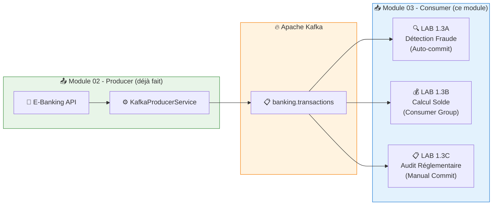
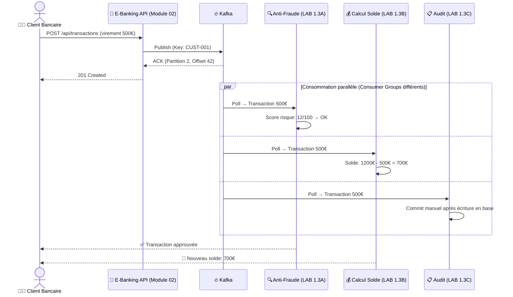
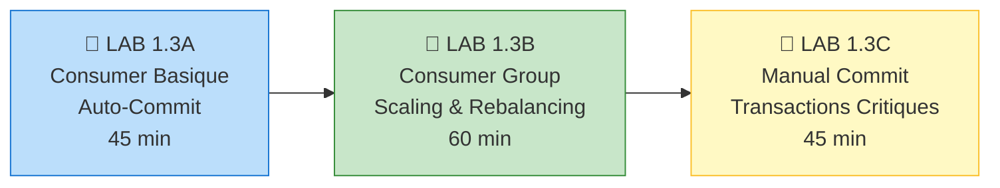
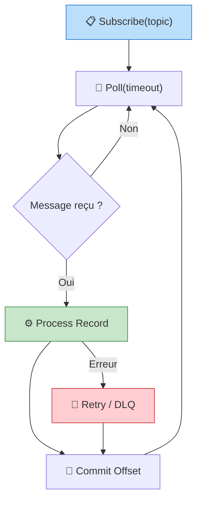
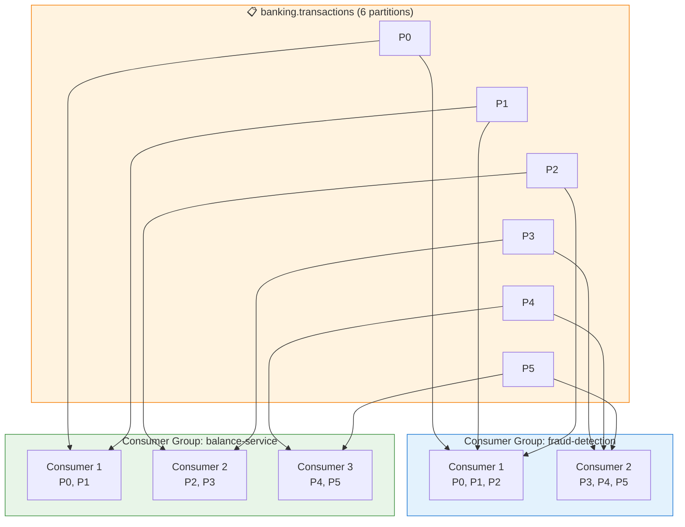

# Module 03 - Premier Consumer C# - Formation Auto-rythmée

## Durée estimée

⏱️ **2 heures 30 minutes**

## 🏦 Contexte E-Banking : Du Producer au Consumer

Dans le **Module 02**, vous avez créé une API Web qui **publie** des transactions bancaires vers Kafka. Maintenant, ces transactions doivent être **consommées** par les systèmes en aval : détection de fraude, calcul de solde, notifications client, et audit réglementaire.



### Cycle Complet : Producer → Kafka → Consumer



---

## Objectifs pédagogiques

À la fin de ce module, vous serez capable de :

1. ✅ Développer un Consumer .NET avec polling loop et gestion d'état
2. ✅ Comprendre **auto-commit vs manual commit** et leurs trade-offs
3. ✅ Implémenter le **scaling horizontal** avec Consumer Groups
4. ✅ Observer le **rebalancing** en action et gérer ses effets
5. ✅ Gérer les erreurs de consommation avec retry et DLQ
6. ✅ Monitorer le **consumer lag** en temps réel

---

## 🗺️ Parcours d'Apprentissage



**Progression** : Basique → Intermédiaire → Avancé

---

## 📖 Structure du Module

Ce module contient 3 labs progressifs qui consomment les messages produits dans le Module 02 :

### LAB 1.3A : Consumer Basique (Auto-Commit) — Détection de Fraude

**Durée** : 45 minutes
**Objectif** : Créer une API Web ASP.NET Core qui consomme les transactions bancaires du topic `banking.transactions` et exécute un scoring de risque en temps réel.

📁 [`lab-1.3a-consumer-basic/`](./lab-1.3a-consumer-basic/)

**Ce que vous allez apprendre** :

- Configuration d'un Consumer avec `ConsumerConfig`
- Le **Poll Loop** et son cycle de vie
- Auto-commit des offsets (comportement et risques)
- Handlers de partitions (assigned, revoked, lost)
- Désérialisation JSON des transactions bancaires
- Exposition des métriques via API (messages consommés, lag)

**Scénario E-Banking** : Service de détection de fraude qui analyse chaque transaction en temps réel et attribue un score de risque.

---

### LAB 1.3B : Consumer Group Scaling & Rebalancing — Calcul de Solde

**Durée** : 60 minutes
**Objectif** : Observer et comprendre le rebalancing en déployant plusieurs consumers dans le même groupe, simuler des pannes, et scaler horizontalement.

📁 [`lab-1.3b-consumer-group/`](./lab-1.3b-consumer-group/)

**Ce que vous allez apprendre** :

- Consumer Groups et partitionnement automatique
- Rebalancing : triggers, phases, durée
- Stratégies d'assignation (RoundRobin, Range, CooperativeSticky)
- Scaling horizontal optimal (N consumers = N partitions)
- Gestion des consumers inactifs (sur-capacité)
- Impact du rebalancing sur la latence

**Scénario E-Banking** : Service de calcul de solde en temps réel, scalé sur plusieurs instances pour traiter le volume de transactions.

---

### LAB 1.3C : Consumer avec Manual Commit — Audit Réglementaire

**Durée** : 45 minutes
**Objectif** : Implémenter un consumer avec commit manuel pour garantir le traitement exact des transactions critiques (aucune perte, aucun doublon).

📁 [`lab-1.3c-consumer-manual-commit/`](./lab-1.3c-consumer-manual-commit/)

**Ce que vous allez apprendre** :

- Manual commit (`Commit()` et `StoreOffset()`)
- Différence entre at-most-once, at-least-once, exactly-once
- Pattern retry + DLQ côté consumer
- Gestion du graceful shutdown (commit final)
- Idempotence côté consumer
- Monitoring avancé (consumer lag, throughput)

**Scénario E-Banking** : Service d'audit réglementaire qui persiste chaque transaction en base de données et ne doit jamais en perdre une.

---

## 🚀 Prérequis

### Module 02 complété

Vous devez avoir complété le **Module 02 (Producer)** car les consumers de ce module consomment les messages produits par les labs du Module 02.

### Environnement Kafka

Vous devez avoir un cluster Kafka en fonctionnement avec le topic `banking.transactions` créé :

#### Option A : Docker (Développement local)

```bash
cd ../module-01-cluster
./scripts/up.sh
```

Vérifiez que Kafka est accessible et le topic existe :

```bash
docker ps
# Vous devez voir : kafka (healthy) et kafka-ui (healthy)

docker exec kafka /opt/kafka/bin/kafka-topics.sh \
  --bootstrap-server localhost:9092 \
  --describe --topic banking.transactions
```

#### Option B : OKD/K3s (Production-like)

```bash
kubectl get kafka -n kafka
# Attendu : bhf-kafka avec status Ready

kubectl run kafka-cli -it --rm --image=quay.io/strimzi/kafka:latest-kafka-4.0.0 \
  --restart=Never -n kafka -- \
  bin/kafka-topics.sh --bootstrap-server bhf-kafka-kafka-bootstrap:9092 \
  --describe --topic banking.transactions
```

### Outils de développement

**Visual Studio Code** :

- Extension C# Dev Kit
- Extension Docker (optionnel)

**Visual Studio 2022** :

- Workload ".NET Desktop Development"
- Workload "ASP.NET and web development"

### SDK .NET

```bash
dotnet --version
# Attendu : 8.0.x ou supérieur
```

---

## 📚 Ordre de Réalisation

Suivez les labs dans l'ordre :

1. **LAB 1.3A** → Consumer basique avec auto-commit (détection fraude)
2. **LAB 1.3B** → Consumer Group scaling & rebalancing (calcul solde)
3. **LAB 1.3C** → Manual commit pour transactions critiques (audit)

Chaque lab contient :

- ✅ Un README détaillé avec instructions pas à pas
- ✅ Le code complet commenté
- ✅ Les fichiers de configuration
- ✅ Les commandes de test et validation
- ✅ Des exercices pratiques
- ✅ Des diagrammes Mermaid expliquant le flux

---

## 🎯 Concepts Théoriques Clés

### Le Poll Loop : Cœur du Consumer



### Auto-Commit vs Manual Commit

| Aspect | Auto-Commit | Manual Commit |
| ------ | ----------- | ------------- |
| **Configuration** | `EnableAutoCommit = true` | `EnableAutoCommit = false` |
| **Quand commit ?** | Toutes les 5s (configurable) | Après traitement réussi |
| **Risque de perte** | ⚠️ Oui (si crash entre commit et fin traitement) | ✅ Non |
| **Risque de doublon** | ✅ Non | ⚠️ Oui (si crash après traitement, avant commit) |
| **Garantie** | At-most-once | At-least-once |
| **Performance** | Meilleure (moins d'appels réseau) | Légèrement plus lent |
| **Cas d'usage** | Logs, métriques, analytics | Paiements, audit, transactions |

### Consumer Group : Partage des Partitions



> **Règle d'or** : Chaque consumer group lit **indépendamment** le topic. Au sein d'un groupe, chaque partition est assignée à **un seul** consumer.

### Configuration Consumer : Paramètres Clés

| Paramètre | Défaut | Description |
| --------- | ------ | ----------- |
| `GroupId` | (requis) | Identifiant du consumer group |
| `AutoOffsetReset` | `Latest` | `Earliest` = depuis le début, `Latest` = nouveaux messages |
| `EnableAutoCommit` | `true` | Auto-commit des offsets |
| `AutoCommitIntervalMs` | `5000` | Intervalle entre les auto-commits |
| `SessionTimeoutMs` | `45000` | Timeout de session (éjection si pas de heartbeat) |
| `HeartbeatIntervalMs` | `3000` | Intervalle d'envoi des heartbeats |
| `MaxPollIntervalMs` | `300000` | Temps max entre 2 polls (5 min) |
| `PartitionAssignmentStrategy` | `Range` | Stratégie de répartition des partitions |

---

## 🛠️ Commandes Utiles

### Vérifier le topic banking.transactions

```bash
# Docker
docker exec kafka /opt/kafka/bin/kafka-topics.sh \
  --bootstrap-server localhost:9092 \
  --describe --topic banking.transactions

# OKD/K3s
kubectl run kafka-cli -it --rm --image=quay.io/strimzi/kafka:latest-kafka-4.0.0 \
  --restart=Never -n kafka -- \
  bin/kafka-topics.sh --bootstrap-server bhf-kafka-kafka-bootstrap:9092 \
  --describe --topic banking.transactions
```

### Vérifier le consumer lag

```bash
# Docker
docker exec kafka /opt/kafka/bin/kafka-consumer-groups.sh \
  --bootstrap-server localhost:9092 \
  --group fraud-detection-service \
  --describe

# OKD/K3s
kubectl run kafka-cli -it --rm --image=quay.io/strimzi/kafka:latest-kafka-4.0.0 \
  --restart=Never -n kafka -- \
  bin/kafka-consumer-groups.sh --bootstrap-server bhf-kafka-kafka-bootstrap:9092 \
  --group fraud-detection-service --describe
```

### Lister les consumer groups

```bash
# Docker
docker exec kafka /opt/kafka/bin/kafka-consumer-groups.sh \
  --bootstrap-server localhost:9092 \
  --list

# OKD/K3s
kubectl run kafka-cli -it --rm --image=quay.io/strimzi/kafka:latest-kafka-4.0.0 \
  --restart=Never -n kafka -- \
  bin/kafka-consumer-groups.sh --bootstrap-server bhf-kafka-kafka-bootstrap:9092 \
  --list
```

### Réinitialiser les offsets d'un consumer group

```bash
# Docker - Reset au début du topic
docker exec kafka /opt/kafka/bin/kafka-consumer-groups.sh \
  --bootstrap-server localhost:9092 \
  --group fraud-detection-service \
  --topic banking.transactions \
  --reset-offsets --to-earliest \
  --execute
```

---

## 💡 Tips & Best Practices

### TIP #1 : Singleton Consumer via BackgroundService

```csharp
// ✅ BON : Consumer dans un BackgroundService (long-running)
public class FraudDetectionWorker : BackgroundService
{
    protected override async Task ExecuteAsync(CancellationToken stoppingToken)
    {
        using var consumer = new ConsumerBuilder<string, string>(config).Build();
        consumer.Subscribe("banking.transactions");
        while (!stoppingToken.IsCancellationRequested)
        {
            var result = consumer.Consume(stoppingToken);
            await ProcessAsync(result);
        }
    }
}

// ❌ MAUVAIS : Consumer dans un Controller (par requête HTTP)
```

### TIP #2 : Graceful Shutdown

```csharp
// TOUJOURS fermer proprement le consumer
consumer.Close(); // Commit final + quitter le groupe + trigger rebalancing rapide
```

### TIP #3 : CooperativeSticky pour minimiser le rebalancing

```csharp
PartitionAssignmentStrategy = PartitionAssignmentStrategy.CooperativeSticky
// 10x plus rapide que RoundRobin/Range pour grands groupes
```

### TIP #4 : Consumer Lag = métrique #1 en production

```bash
# Si LAG > 0 de façon persistante → consumer trop lent ou en panne
# Alerte recommandée : LAG > 1000 pendant > 5 minutes
```

---

## 🎯 Validation du Module

À la fin de ce module, vous devez être capable de :

- [ ] Créer un Consumer .NET avec polling loop
- [ ] Comprendre auto-commit vs manual commit
- [ ] Configurer et observer un Consumer Group
- [ ] Observer le rebalancing (join, leave, crash)
- [ ] Scaler horizontalement un consumer group
- [ ] Gérer les erreurs de consommation (retry + DLQ)
- [ ] Implémenter le manual commit pour transactions critiques
- [ ] Monitorer le consumer lag en temps réel
- [ ] Expliquer les garanties at-most-once vs at-least-once

---

## 📖 Ressources Complémentaires

- [Documentation Confluent.Kafka Consumer](https://docs.confluent.io/kafka-clients/dotnet/current/overview.html#consumer)
- [Kafka Consumer Configuration](https://kafka.apache.org/documentation/#consumerconfigs)
- [Consumer Group Protocol](https://developer.confluent.io/courses/architecture/consumer-group-protocol/)
- [Exactly-Once Semantics](https://www.confluent.io/blog/exactly-once-semantics-are-possible-heres-how-apache-kafka-does-it/)

---

## 🚀 Commencer le Module

Rendez-vous dans le premier lab :

👉 **[LAB 1.3A : Consumer Basique — Détection de Fraude](./lab-1.3a-consumer-basic/README.md)**
