# LAB 1.3A : API Consumer Basique — Détection de Fraude E-Banking

## ⏱️ Durée estimée : 45 minutes

## 🏦 Contexte E-Banking

Dans une banque, chaque transaction publiée par l'API Producer (Module 02) doit être **analysée en temps réel** par un service de détection de fraude. Ce service consomme les messages du topic `banking.transactions`, évalue un **score de risque** pour chaque transaction, et déclenche des alertes si le risque est élevé.

## 🎯 Objectifs

À la fin de ce lab, vous serez capable de :

1. Créer un **Consumer Kafka** dans une API Web ASP.NET Core
2. Implémenter un **BackgroundService** pour le polling loop continu
3. Comprendre l'**auto-commit** des offsets (comportement et risques)
4. Gérer les **handlers de partitions** (assigned, revoked, lost)
5. Désérialiser les **transactions JSON** produites par le Module 02
6. Exposer des **métriques** via des endpoints API (Swagger)

---

## 📊 SEQUENCE DIAGRAMS

### Architecture : Producer → Kafka → Consumer Fraude

```mermaid
flowchart LR
    subgraph Producer["📤 Module 02 (déjà fait)"]
        API["🚀 E-Banking API"]
    end

    subgraph Kafka["🔥 Kafka"]
        T["📋 banking.transactions"]
    end

    subgraph Consumer["📥 Ce LAB"]
        FD["🔍 Fraud Detection API"]
        RS["⚙️ KafkaConsumerService"]
        SC["📊 Risk Scoring Engine"]
    end

    API --> T
    T --> RS
    RS --> SC
    SC --> FD

    style Producer fill:#e8f5e8,stroke:#388e3c
    style Kafka fill:#fff3e0,stroke:#f57c00
    style Consumer fill:#e3f2fd,stroke:#1976d2
```



### Séquence : Partition Assignment et Rebalancing

```mermaid
sequenceDiagram
    participant Main as 🚀 Program.cs
    participant DI as � DI Container
    participant Worker as ⚙️ KafkaConsumerService
    participant Builder as � ConsumerBuilder
    participant Consumer as � IConsumer
    participant Broker as 🔥 Kafka Broker
    participant Coord as 👑 Group Coordinator

    Main->>DI: AddSingleton<KafkaConsumerService>()
    Main->>DI: AddHostedService(provider => ...)
    DI->>Worker: ExecuteAsync(stoppingToken)

    Worker->>Builder: new ConsumerBuilder(config)
    Builder->>Builder: SetErrorHandler, SetPartitionsAssignedHandler...
    Builder->>Consumer: .Build()

    Consumer->>Broker: Subscribe("banking.transactions")
    Consumer->>Coord: JoinGroup(groupId: "fraud-detection-service")
    Coord-->>Consumer: Assignment: [P0, P1, P2, P3, P4, P5]
    Note over Worker: Handler: "✅ Partitions assigned"

    loop while !stoppingToken.IsCancellationRequested
        Consumer->>Broker: Consume(stoppingToken) → FetchRequest
        Broker-->>Consumer: ConsumeResult {Key, Value, Partition, Offset}
        Worker->>Worker: Deserialize JSON → Transaction
        Worker->>Worker: CalculateRiskScore(tx)
        Worker->>Worker: if score >= 40 → créer FraudAlert
        Worker->>Worker: Stocker métriques (thread-safe)
    end

    Note over Consumer: ⏰ Toutes les 5s: Auto-commit offsets
    Consumer->>Coord: CommitOffsets
```



---

## 🏗️ CLASS DIAGRAMS

### Architecture des Composants (Code)

```mermaid
flowchart TB
    subgraph API["🌐 ASP.NET Core API"]
        Controller["📮 FraudDetectionController"]
        Program["⚙️ Program.cs"]
    end

    subgraph Consumer["📥 Consumer Layer"]
        Service["🔧 KafkaConsumerService<br/>BackgroundService"]
        Config["⚙️ ConsumerConfig"]
    end

    subgraph Models["📋 Models"]
        Transaction["� Transaction"]
        Alert["🚨 FraudAlert"]
        Health["💚 HealthResponse"]
        Metrics["📊 MetricsResponse"]
    end

    subgraph Storage["💾 In-Memory"]
        Alerts["📋 ConcurrentBag<FraudAlert>"]
        MetricsStore["📊 ConcurrentDictionary<string, object>"]
    end

    subgraph Kafka["🔥 Kafka"]
        Topic["📋 banking.transactions"]
        Group["👥 fraud-detection-service"]
    end

    Controller --> Service
    Controller --> Health
    Controller --> Metrics
    Program --> Service
    
    Service --> Config
    Service --> Transaction
    Service --> Alert
    Service --> Alerts
    Service --> MetricsStore
    
    Service -.-> Topic
    Service -.-> Group

    style API fill:#e3f2fd,stroke:#1976d2
    style Consumer fill:#fff3e0,stroke:#f57c00
    style Models fill:#e8f5e8,stroke:#388e3c
    style Storage fill:#fce4ec,stroke:#c2185b
    style Kafka fill:#f3e5f5,stroke:#7b1fa2
```



### Class Diagram: KafkaConsumerService


    Consumer->>Broker: Redémarrage → Reprend depuis offset 100
    Note over Consumer: ⚠️ Messages 81-100 PERDUS (déjà commités mais pas traités)
```

> **⚠️ Important** : L'auto-commit est acceptable pour la détection de fraude car rater une transaction n'a pas d'impact financier direct. Pour l'audit réglementaire (LAB 1.3C), nous utiliserons le manual commit.

---

## 🚀 Prérequis

### Topic Kafka

Le topic `banking.transactions` doit exister (créé dans le Module 02) :

```bash
# Docker
docker exec kafka /opt/kafka/bin/kafka-topics.sh \
  --bootstrap-server localhost:9092 \
  --describe --topic banking.transactions

# Si le topic n'existe pas, créez-le :
docker exec kafka /opt/kafka/bin/kafka-topics.sh \
  --bootstrap-server localhost:9092 \
  --create --if-not-exists \
  --topic banking.transactions \
  --partitions 6 \
  --replication-factor 1
```

### Messages dans le topic

Lancez l'API Producer du Module 02 et envoyez quelques transactions via Swagger pour avoir des messages à consommer.

---

## 📝 Instructions Pas à Pas

### Étape 1 : Créer le projet API Web

#### Option VS Code

```bash
mkdir lab-1.3a-consumer-basic
cd lab-1.3a-consumer-basic
mkdir EBankingFraudDetectionAPI
cd EBankingFraudDetectionAPI
dotnet new webapi -n EBankingFraudDetectionAPI --framework net8.0
cd EBankingFraudDetectionAPI
dotnet add package Confluent.Kafka --version 2.3.0
dotnet add package Swashbuckle.AspNetCore --version 6.5.0
```

#### Option Visual Studio 2022

1. **Fichier** → **Nouveau** → **Projet**
2. Sélectionner **API Web ASP.NET Core**
3. Nom : `EBankingFraudDetectionAPI`, Framework : **.NET 8.0**
4. Clic droit projet → **Gérer les packages NuGet** :
   - `Confluent.Kafka` version **2.3.0**
   - `Swashbuckle.AspNetCore` version **6.5.0**

---

### Étape 2 : Créer les modèles

#### `Models/Transaction.cs` (identique au Module 02)

```csharp
using System.Text.Json.Serialization;

namespace EBankingFraudDetectionAPI.Models;

public class Transaction
{
    [JsonPropertyName("transactionId")]
    public string TransactionId { get; set; } = string.Empty;

    [JsonPropertyName("fromAccount")]
    public string FromAccount { get; set; } = string.Empty;

    [JsonPropertyName("toAccount")]
    public string ToAccount { get; set; } = string.Empty;

    [JsonPropertyName("amount")]
    public decimal Amount { get; set; }

    [JsonPropertyName("currency")]
    public string Currency { get; set; } = "EUR";

    [JsonPropertyName("type")]
    public string Type { get; set; } = "Transfer";

    [JsonPropertyName("customerId")]
    public string CustomerId { get; set; } = string.Empty;

    [JsonPropertyName("description")]
    public string Description { get; set; } = string.Empty;

    [JsonPropertyName("timestamp")]
    public DateTime Timestamp { get; set; }

    [JsonPropertyName("riskScore")]
    public int RiskScore { get; set; }
}
```

#### `Models/FraudAlert.cs`

```csharp
namespace EBankingFraudDetectionAPI.Models;

public class FraudAlert
{
    public string TransactionId { get; set; } = string.Empty;
    public string CustomerId { get; set; } = string.Empty;
    public decimal Amount { get; set; }
    public string Currency { get; set; } = "EUR";
    public string Type { get; set; } = string.Empty;
    public int RiskScore { get; set; }
    public string RiskLevel { get; set; } = "Low"; // Low, Medium, High, Critical
    public string Reason { get; set; } = string.Empty;
    public DateTime DetectedAt { get; set; } = DateTime.UtcNow;

    // Métadonnées Kafka
    public int KafkaPartition { get; set; }
    public long KafkaOffset { get; set; }
}

public class ConsumerMetrics
{
    public long MessagesConsumed { get; set; }
    public long FraudAlertsGenerated { get; set; }
    public long ProcessingErrors { get; set; }
    public double AverageRiskScore { get; set; }
    public string ConsumerGroupId { get; set; } = string.Empty;
    public string ConsumerStatus { get; set; } = "Unknown";
    public Dictionary<int, long> PartitionOffsets { get; set; } = new();
    public DateTime StartedAt { get; set; }
    public DateTime LastMessageAt { get; set; }
}
```

### Étape 3 : Créer le service Consumer (BackgroundService)

#### `Services/KafkaConsumerService.cs`

```csharp
using System.Collections.Concurrent;
using System.Text.Json;
using Confluent.Kafka;
using EBankingFraudDetectionAPI.Models;

namespace EBankingFraudDetectionAPI.Services;

public class KafkaConsumerService : BackgroundService
{
    private readonly ILogger<KafkaConsumerService> _logger;
    private readonly IConfiguration _configuration;
    private readonly ConcurrentBag<FraudAlert> _alerts = new();
    private readonly ConcurrentDictionary<int, long> _partitionOffsets = new();
    
    private long _messagesConsumed;
    private long _fraudAlerts;
    private long _processingErrors;
    private double _totalRiskScore;
    private DateTime _startedAt;
    private DateTime _lastMessageAt;
    private string _status = "Starting";

    public KafkaConsumerService(
        ILogger<KafkaConsumerService> logger,
        IConfiguration configuration)
    {
        _logger = logger;
        _configuration = configuration;
    }

    protected override async Task ExecuteAsync(CancellationToken stoppingToken)
    {
        _startedAt = DateTime.UtcNow;
        _status = "Running";

        var config = new ConsumerConfig
        {
            BootstrapServers = _configuration["Kafka:BootstrapServers"] ?? "localhost:9092",
            GroupId = _configuration["Kafka:GroupId"] ?? "fraud-detection-service",
            ClientId = $"fraud-detector-{Environment.MachineName}-{Guid.NewGuid():N}",
            AutoOffsetReset = AutoOffsetReset.Earliest,
            EnableAutoCommit = true,       // offsets are committed automatically every AutoCommitIntervalMs
            EnableAutoOffsetStore = true,  // (default) offset is stored as soon as Consume() returns
            AutoCommitIntervalMs = 5000,
            SessionTimeoutMs = 10000,
            HeartbeatIntervalMs = 3000,
            MaxPollIntervalMs = 300000,
            PartitionAssignmentStrategy = PartitionAssignmentStrategy.CooperativeSticky
        };

        var topic = _configuration["Kafka:Topic"] ?? "banking.transactions";

        _logger.LogInformation(
            "Starting Fraud Detection Consumer. Group: {Group}, Topic: {Topic}, Servers: {Servers}",
            config.GroupId, topic, config.BootstrapServers);

        using var consumer = new ConsumerBuilder<string, string>(config)
            .SetErrorHandler((_, e) =>
            {
                _logger.LogError("Consumer error: Code={Code}, Reason={Reason}, IsFatal={IsFatal}",
                    e.Code, e.Reason, e.IsFatal);
                if (e.IsFatal) _status = "Fatal Error";
            })
            .SetPartitionsAssignedHandler((c, partitions) =>
            {
                _logger.LogInformation("✅ Partitions assigned: {Partitions}",
                    string.Join(", ", partitions.Select(p => $"[{p.Partition.Value}]")));
                _status = "Consuming";
            })
            .SetPartitionsRevokedHandler((c, partitions) =>
            {
                _logger.LogWarning("⚠️ Partitions revoked: {Partitions}",
                    string.Join(", ", partitions.Select(p => $"[{p.Partition.Value}]")));
                _status = "Rebalancing";
            })
            .SetPartitionsLostHandler((c, partitions) =>
            {
                _logger.LogError("❌ Partitions lost: {Partitions}",
                    string.Join(", ", partitions.Select(p => $"[{p.Partition.Value}]")));
                _status = "Partitions Lost";
            })
            .Build();

        consumer.Subscribe(topic);

        try
        {
            while (!stoppingToken.IsCancellationRequested)
            {
                try
                {
                    var consumeResult = consumer.Consume(stoppingToken);
                    if (consumeResult == null) continue;

                    await ProcessMessageAsync(consumeResult);
                }
                catch (ConsumeException ex)
                {
                    _logger.LogError(ex, "Consume error: {Reason}", ex.Error.Reason);
                    Interlocked.Increment(ref _processingErrors);
                }
            }
        }
        catch (OperationCanceledException)
        {
            _logger.LogInformation("Consumer shutdown requested");
        }
        finally
        {
            _status = "Stopped";
            consumer.Close();
            _logger.LogInformation("Consumer closed gracefully");
        }
    }

    private async Task ProcessMessageAsync(ConsumeResult<string, string> result)
    {
        try
        {
            // Désérialiser la transaction
            var transaction = JsonSerializer.Deserialize<Transaction>(result.Message.Value);
            if (transaction == null)
            {
                _logger.LogWarning("Failed to deserialize message at P{Partition}:O{Offset}",
                    result.Partition.Value, result.Offset.Value);
                Interlocked.Increment(ref _processingErrors);
                return;
            }

            // Calculer le score de risque
            var (riskScore, riskLevel, reason) = CalculateRiskScore(transaction);

            // Mettre à jour les métriques
            Interlocked.Increment(ref _messagesConsumed);
            _totalRiskScore += riskScore;
            _lastMessageAt = DateTime.UtcNow;
            _partitionOffsets[result.Partition.Value] = result.Offset.Value;

            _logger.LogInformation(
                "📦 Transaction {TxId} | Customer: {Customer} | {Amount} {Currency} | Risk: {Score}/100 ({Level}) | P{Partition}:O{Offset}",
                transaction.TransactionId, transaction.CustomerId,
                transaction.Amount, transaction.Currency,
                riskScore, riskLevel,
                result.Partition.Value, result.Offset.Value);

            // Créer une alerte si risque élevé
            if (riskScore >= 40)
            {
                var alert = new FraudAlert
                {
                    TransactionId = transaction.TransactionId,
                    CustomerId = transaction.CustomerId,
                    Amount = transaction.Amount,
                    Currency = transaction.Currency,
                    Type = transaction.Type,
                    RiskScore = riskScore,
                    RiskLevel = riskLevel,
                    Reason = reason,
                    KafkaPartition = result.Partition.Value,
                    KafkaOffset = result.Offset.Value
                };

                _alerts.Add(alert);
                Interlocked.Increment(ref _fraudAlerts);

                _logger.LogWarning(
                    "🚨 FRAUD ALERT: {TxId} | {Customer} | {Amount}{Currency} | Score: {Score} | {Reason}",
                    transaction.TransactionId, transaction.CustomerId,
                    transaction.Amount, transaction.Currency,
                    riskScore, reason);
            }

            // Simuler temps de traitement (scoring ML en production)
            await Task.Delay(50);
        }
        catch (Exception ex)
        {
            _logger.LogError(ex, "Error processing message at P{Partition}:O{Offset}",
                result.Partition.Value, result.Offset.Value);
            Interlocked.Increment(ref _processingErrors);
        }
    }

    private (int score, string level, string reason) CalculateRiskScore(Transaction tx)
    {
        int score = 0;
        var reasons = new List<string>();

        // Règle 1 : Montant élevé
        if (tx.Amount > 10000)
        {
            score += 40;
            reasons.Add($"Montant élevé: {tx.Amount}{tx.Currency}");
        }
        else if (tx.Amount > 5000)
        {
            score += 20;
            reasons.Add($"Montant notable: {tx.Amount}{tx.Currency}");
        }

        // Règle 2 : Type de transaction à risque
        if (tx.Type == "InternationalTransfer")
        {
            score += 30;
            reasons.Add("Virement international");
        }
        else if (tx.Type == "Withdrawal" && tx.Amount > 300)
        {
            score += 15;
            reasons.Add("Retrait élevé");
        }

        // Règle 3 : Transaction hors heures
        if (tx.Timestamp.Hour < 6 || tx.Timestamp.Hour > 22)
        {
            score += 15;
            reasons.Add("Hors heures ouvrées");
        }

        // Règle 4 : Score de risque déjà élevé (venant du producer)
        if (tx.RiskScore > 50)
        {
            score += 20;
            reasons.Add($"Risque producer élevé: {tx.RiskScore}");
        }

        score = Math.Min(score, 100);

        var level = score switch
        {
            >= 75 => "Critical",
            >= 50 => "High",
            >= 25 => "Medium",
            _ => "Low"
        };

        return (score, level, string.Join(" | ", reasons.DefaultIfEmpty("Aucun facteur de risque")));
    }

    // Méthodes publiques pour l'API
    public IReadOnlyList<FraudAlert> GetAlerts() => _alerts.ToList().AsReadOnly();

    public IReadOnlyList<FraudAlert> GetHighRiskAlerts() =>
        _alerts.Where(a => a.RiskScore >= 50).OrderByDescending(a => a.RiskScore).ToList().AsReadOnly();

    public ConsumerMetrics GetMetrics() => new()
    {
        MessagesConsumed = Interlocked.Read(ref _messagesConsumed),
        FraudAlertsGenerated = Interlocked.Read(ref _fraudAlerts),
        ProcessingErrors = Interlocked.Read(ref _processingErrors),
        AverageRiskScore = _messagesConsumed > 0 ? _totalRiskScore / _messagesConsumed : 0,
        ConsumerGroupId = _configuration["Kafka:GroupId"] ?? "fraud-detection-service",
        ConsumerStatus = _status,
        PartitionOffsets = new Dictionary<int, long>(_partitionOffsets),
        StartedAt = _startedAt,
        LastMessageAt = _lastMessageAt
    };
}
```

---

### Étape 4 : Créer le contrôleur API

#### `Controllers/FraudDetectionController.cs`

```csharp
using Microsoft.AspNetCore.Mvc;
using EBankingFraudDetectionAPI.Services;

namespace EBankingFraudDetectionAPI.Controllers;

[ApiController]
[Route("api/[controller]")]
public class FraudDetectionController : ControllerBase
{
    private readonly KafkaConsumerService _consumerService;
    private readonly ILogger<FraudDetectionController> _logger;

    public FraudDetectionController(
        KafkaConsumerService consumerService,
        ILogger<FraudDetectionController> logger)
    {
        _consumerService = consumerService;
        _logger = logger;
    }

    /// <summary>
    /// Récupère toutes les alertes fraude détectées
    /// </summary>
    [HttpGet("alerts")]
    [ProducesResponseType(StatusCodes.Status200OK)]
    public IActionResult GetAlerts()
    {
        var alerts = _consumerService.GetAlerts();
        return Ok(new
        {
            count = alerts.Count,
            alerts
        });
    }

    /// <summary>
    /// Récupère les alertes à haut risque (score >= 50)
    /// </summary>
    [HttpGet("alerts/high-risk")]
    [ProducesResponseType(StatusCodes.Status200OK)]
    public IActionResult GetHighRiskAlerts()
    {
        var alerts = _consumerService.GetHighRiskAlerts();
        return Ok(new
        {
            count = alerts.Count,
            alerts
        });
    }

    /// <summary>
    /// Récupère les métriques du consumer Kafka
    /// </summary>
    [HttpGet("metrics")]
    [ProducesResponseType(StatusCodes.Status200OK)]
    public IActionResult GetMetrics()
    {
        var metrics = _consumerService.GetMetrics();
        return Ok(metrics);
    }

    /// <summary>
    /// Health check du service de détection de fraude
    /// </summary>
    [HttpGet("health")]
    [ProducesResponseType(StatusCodes.Status200OK)]
    [ProducesResponseType(StatusCodes.Status503ServiceUnavailable)]
    public IActionResult GetHealth()
    {
        var metrics = _consumerService.GetMetrics();

        var isHealthy = metrics.ConsumerStatus == "Consuming" ||
                        metrics.ConsumerStatus == "Running";

        var health = new
        {
            status = isHealthy ? "Healthy" : "Degraded",
            service = "E-Banking Fraud Detection API",
            consumerStatus = metrics.ConsumerStatus,
            messagesProcessed = metrics.MessagesConsumed,
            lastMessageAt = metrics.LastMessageAt,
            uptime = DateTime.UtcNow - metrics.StartedAt
        };

        return isHealthy ? Ok(health) : StatusCode(503, health);
    }
}
```

---

### Étape 5 : Configurer l'application

#### `appsettings.json`

```json
{
  "Logging": {
    "LogLevel": {
      "Default": "Information",
      "Microsoft.AspNetCore": "Warning",
      "EBankingFraudDetectionAPI": "Information"
    }
  },
  "Kafka": {
    "BootstrapServers": "localhost:9092",
    "GroupId": "fraud-detection-service",
    "Topic": "banking.transactions"
  },
  "AllowedHosts": "*"
}
```

#### `Program.cs`

```csharp
using EBankingFraudDetectionAPI.Services;

var builder = WebApplication.CreateBuilder(args);

// Enregistrer le consumer comme BackgroundService (singleton)
builder.Services.AddSingleton<KafkaConsumerService>();
builder.Services.AddHostedService(sp => sp.GetRequiredService<KafkaConsumerService>());

// Contrôleurs + Swagger
builder.Services.AddControllers();
builder.Services.AddEndpointsApiExplorer();
builder.Services.AddSwaggerGen(c =>
{
    c.SwaggerDoc("v1", new()
    {
        Title = "E-Banking Fraud Detection API",
        Version = "v1",
        Description = "Consumer Kafka pour la détection de fraude en temps réel sur les transactions bancaires"
    });
});

var app = builder.Build();

app.UseSwagger();
app.UseSwaggerUI(c =>
{
    c.SwaggerEndpoint("/swagger/v1/swagger.json", "Fraud Detection API v1");
    c.RoutePrefix = "swagger";
});

app.MapControllers();
app.Run();
```

#### `EBankingFraudDetectionAPI.csproj`

```xml
<Project Sdk="Microsoft.NET.Sdk.Web">
  <PropertyGroup>
    <TargetFramework>net8.0</TargetFramework>
    <Nullable>enable</Nullable>
    <ImplicitUsings>enable</ImplicitUsings>
  </PropertyGroup>

  <ItemGroup>
    <PackageReference Include="Confluent.Kafka" Version="2.5.0" />
    <PackageReference Include="Swashbuckle.AspNetCore" Version="6.5.0" />
  </ItemGroup>
</Project>
```

---

## 🚀 DEPLOYMENT

### Local Development

#### 1. Démarrer Kafka (si pas déjà fait)

```bash
cd ../../module-01-cluster
docker compose up -d
```

#### 2. Produire des messages (Module 02)

Lancez l'API Producer du Module 02 et envoyez des transactions via Swagger (`https://localhost:5001/swagger`).

#### 3. Démarrer le Consumer

```bash
cd EBankingFraudDetectionAPI
dotnet run
```

#### 4. Observer les logs

```text
info: EBankingFraudDetectionAPI.Services.KafkaConsumerService
  ✅ Partitions assigned: [0], [1], [2], [3], [4], [5]
info: EBankingFraudDetectionAPI.Services.KafkaConsumerService
  📦 Transaction TX-001 | Customer: CUST-001 | 250.00 EUR | Risk: 5/100 (Low) | P0:O42
warn: EBankingFraudDetectionAPI.Services.KafkaConsumerService
  🚨 FRAUD ALERT: TX-002 | CUST-002 | 15000.00EUR | Score: 60 | Montant élevé: 15000.00EUR
```

#### 5. Vérifier via l'API (Swagger)

Ouvrez `https://localhost:5001/swagger` (ou `http://localhost:5000/swagger`) :
- `GET /api/FraudDetection/alerts` : Liste toutes les alertes.
- `GET /api/FraudDetection/alerts/high-risk` : Alertes à haut risque uniquement.
- `GET /api/FraudDetection/metrics` : Métriques du consumer.
- `GET /api/FraudDetection/health` : Health check.

---

### OpenShift Sandbox Deployment

> **🎯 Objectif** : Ce déploiement valide les concepts fondamentaux du **Consumer Kafka** dans un environnement cloud :
> - **Poll loop** : le consumer consomme les messages en boucle via `Consume()`
> - **Auto-commit** : les offsets sont commités automatiquement toutes les 5 secondes
> - **Partition assignment** : le consumer reçoit les 6 partitions du topic
> - **Health check** : l'API expose l'état du consumer via un endpoint dédié

Si vous utilisez l'environnement **OpenShift Sandbox**, suivez ces étapes pour déployer et exposer votre Consumer publiquement.

#### 1. Préparer le Build et le Déploiement

```bash
# Se placer dans le dossier du projet
cd EBankingFraudDetectionAPI

# Créer une build binaire pour .NET
oc new-build dotnet:8.0-ubi8 --binary=true --name=ebanking-fraud-detection-api

# Lancer la build en envoyant le dossier courant
oc start-build ebanking-fraud-detection-api --from-dir=. --follow

# Créer l'application
oc new-app ebanking-fraud-detection-api
```

#### 2. Configurer les variables d'environnement

Le Consumer doit savoir où se trouve Kafka (interne au cluster) et quel groupe utiliser.

```bash
oc set env deployment/ebanking-fraud-detection-api \
  Kafka__BootstrapServers=kafka-svc:9092 \
  Kafka__GroupId=fraud-detection-service \
  Kafka__Topic=banking.transactions \
  ASPNETCORE_URLS=http://0.0.0.0:8080 \
  ASPNETCORE_ENVIRONMENT=Development
```

#### 3. Exposer publiquement (Secure Edge Route)

> [!IMPORTANT]
> Standard routes may hang on the Sandbox. Use an **edge route** for reliable public access.

```bash
oc create route edge ebanking-fraud-api-secure --service=ebanking-fraud-detection-api --port=8080-tcp
```

#### 4. Tester l'API déployée

```bash
# Obtenir l'URL publique
URL=$(oc get route ebanking-fraud-api-secure -o jsonpath='{.spec.host}')
echo "https://$URL/swagger"

# Tester le Health Check
curl -k -i "https://$URL/api/FraudDetection/health"

# Voir les métriques de consommation
curl -k -s "https://$URL/api/FraudDetection/metrics"
```

### 5. ✅ Success Criteria — Deployment

```bash
# Pod running?
oc get pod -l deployment=ebanking-fraud-detection-api
# Expected: STATUS=Running, READY=1/1

# Consumer active?
curl -k -s "https://$(oc get route ebanking-fraud-api-secure -o jsonpath='{.spec.host}')/api/FraudDetection/health" | jq .
# Expected: status=Consuming (or Running), messagesConsumed >= 0

# Consumer group registered?
oc exec kafka-0 -- /opt/kafka/bin/kafka-consumer-groups.sh --bootstrap-server localhost:9092 --describe --group fraud-detection-service
# Expected: GROUP listed with assigned partitions
```

---

## 🧪 TESTING

### Scénarios de Test et Validation des Concepts (Sandbox / CRC)

```bash
URL=$(oc get route ebanking-fraud-api-secure -o jsonpath='{.spec.host}')
PRODUCER_URL=$(oc get route ebanking-producer-api-secure -o jsonpath='{.spec.host}')

# 1. Health check - consumer should be Consuming
curl -k -s "https://$URL/api/FraudDetection/health" | jq .

# 2. Send test transactions via Producer API
curl -k -s -X POST "https://$PRODUCER_URL/api/Transactions" \
  -H "Content-Type: application/json" \
  -d '{"fromAccount":"FR7630001000111111","toAccount":"FR7630001000222222","amount":250.00,"currency":"EUR","type":1,"description":"Normal transfer","customerId":"CUST-001"}' | jq .

curl -k -s -X POST "https://$PRODUCER_URL/api/Transactions" \
  -H "Content-Type: application/json" \
  -d '{"fromAccount":"FR7630001000333333","toAccount":"FR7630001000444444","amount":15000.00,"currency":"EUR","type":1,"description":"Large suspicious transfer","customerId":"CUST-002"}' | jq .

curl -k -s -X POST "https://$PRODUCER_URL/api/Transactions" \
  -H "Content-Type: application/json" \
  -d '{"fromAccount":"FR7630001000555555","toAccount":"FR7630001000666666","amount":9500.00,"currency":"USD","type":1,"description":"International wire","customerId":"CUST-003"}' | jq .

# 3. Wait for consumer to process (auto-commit every 5s)
sleep 5

# 4. Check fraud alerts (amount > 10000 triggers alert)
curl -k -s "https://$URL/api/FraudDetection/alerts" | jq .
# Expected: 15000 EUR flagged as Medium/High risk

# 5. Check high-risk alerts
curl -k -s "https://$URL/api/FraudDetection/alerts/high-risk" | jq .

# 6. Check consumer metrics
curl -k -s "https://$URL/api/FraudDetection/metrics" | jq .
# Expected: messagesConsumed > 0, partitionOffsets populated

# 7. Verify consumer group in Kafka
oc exec kafka-0 -- /opt/kafka/bin/kafka-consumer-groups.sh \
  --bootstrap-server localhost:9092 \
  --describe --group fraud-detection-service
```

### Automated Testing Script

```bash
# Run the full deployment and test script (Bash)
cd day-01-foundations/scripts
./bash/deploy-and-test-1.3a.sh
```

```powershell
# Run the full deployment and test script (PowerShell)
cd day-01-foundations/scripts
.\powershell\deploy-and-test-1.3a.ps1
```

---

## 🔧 Troubleshooting

| Symptom | Probable Cause | Solution |
| ------- | -------------- | -------- |
| Consumer status `Starting` indefinitely | Kafka not reachable | Verify `kafka-svc:9092` is accessible: `oc exec kafka-0 -- /opt/kafka/bin/kafka-broker-api-versions.sh --bootstrap-server localhost:9092` |
| `messagesConsumed` stays at 0 | No messages in topic or wrong offset | Send transactions via Producer API. Check `AutoOffsetReset = Earliest` is set |
| Health returns 503 | Consumer is in `Rebalancing` state | Wait 10-15s for Kafka to stabilize partitions. Check Kafka pod health |
| No fraud alerts generated | Transaction amounts below threshold | Send a transaction with `amount > 10000` to trigger fraud scoring |
| `partitionOffsets` empty | Consumer hasn't consumed yet | Wait for auto-commit (every 5s). Send transactions and check again |
| Pod CrashLoopBackOff | Missing env vars or Kafka DNS error | Check: `oc set env deployment/ebanking-fraud-detection-api --list` and verify `Kafka__BootstrapServers=kafka-svc:9092` |
| Swagger not accessible | Wrong `ASPNETCORE_URLS` | Set: `oc set env deployment/ebanking-fraud-detection-api ASPNETCORE_URLS=http://0.0.0.0:8080` |
| Route returns 503/504 | Pod not ready or wrong port | Check: `oc get pods`, verify route targets port `8080-tcp` |

### Tips for Sandbox

- **Resource quota**: The Sandbox limits total replicas. Scale down unused deployments: `oc scale deployment/<name> --replicas=0`
- **Kafka 3-node cluster**: Requires 3 pods. If quota is tight, keep only 1 producer + needed consumers running
- **Edge routes**: Always use `oc create route edge` on Sandbox (standard routes may hang)
- **Pod restart**: If consumer stops consuming after Kafka restart, delete the pod to force reconnect: `oc delete pod -l deployment=ebanking-fraud-detection-api`
- **Consumer group reset**: To re-read all messages: `oc exec kafka-0 -- /opt/kafka/bin/kafka-consumer-groups.sh --bootstrap-server localhost:9092 --group fraud-detection-service --reset-offsets --to-earliest --topic banking.transactions --execute`

---

## ✅ Validation

- [ ] Le BackgroundService démarre automatiquement avec l'application
- [ ] Les partitions sont assignées au consumer (log `✅ Partitions assigned`)
- [ ] Les transactions du Module 02 sont consommées et loguées
- [ ] Le scoring de risque fonctionne (scores variés selon les transactions)
- [ ] Les alertes à haut risque apparaissent dans les logs (`🚨 FRAUD ALERT`)
- [ ] Swagger fonctionne et expose les 4 endpoints
- [ ] Les métriques sont cohérentes (messagesConsumed, fraudAlerts)
- [ ] Le health check retourne `Healthy` quand le consumer est actif

---

## 🔑 Points à Retenir

| Concept | Ce qu'il faut retenir |
| ------- | -------------------- |
| **BackgroundService** | Le consumer tourne en tâche de fond, indépendant des requêtes HTTP |
| **Auto-commit** | Simple mais risque de perte si crash (OK pour fraude, pas pour audit) |
| **Singleton** | Le consumer est un singleton partagé avec l'API pour exposer les métriques |
| **Poll Loop** | `Consume()` est bloquant avec timeout — ne jamais bloquer le thread plus longtemps que `MaxPollIntervalMs` |
| **Partition Handlers** | Essentiels pour observer le rebalancing et initialiser/nettoyer des ressources |

---

## ➡️ Prochaine Étape

👉 **[LAB 1.3B : Consumer Group Scaling & Rebalancing — Calcul de Solde](../lab-1.3b-consumer-group/README.md)**
