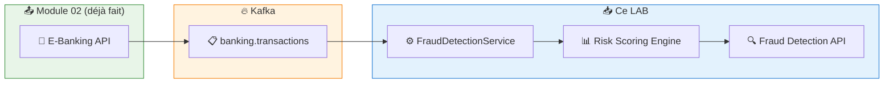
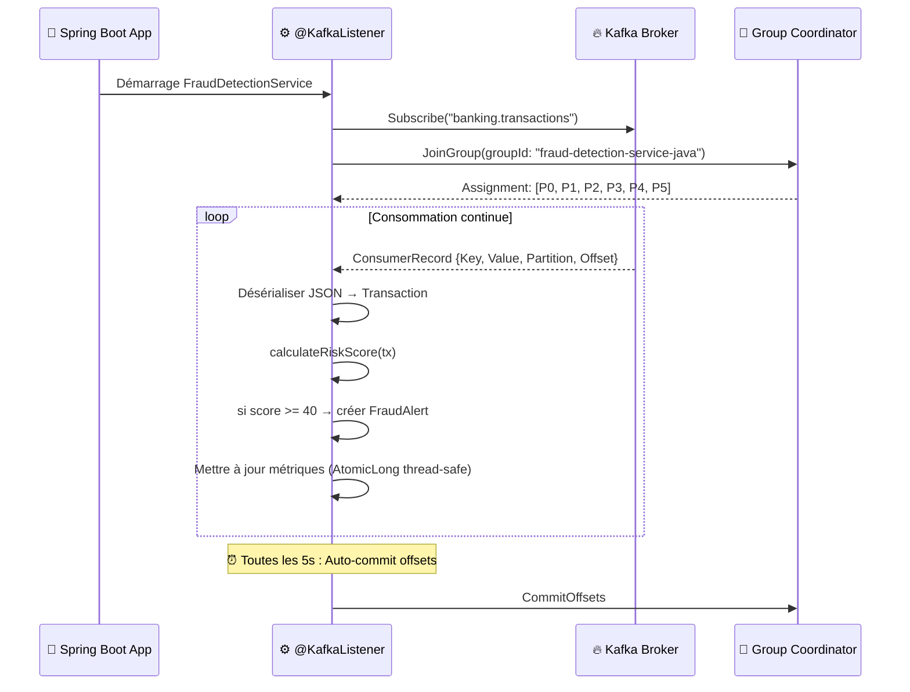
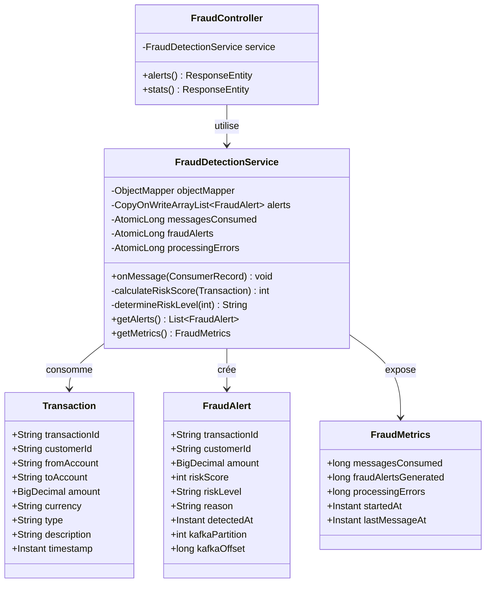
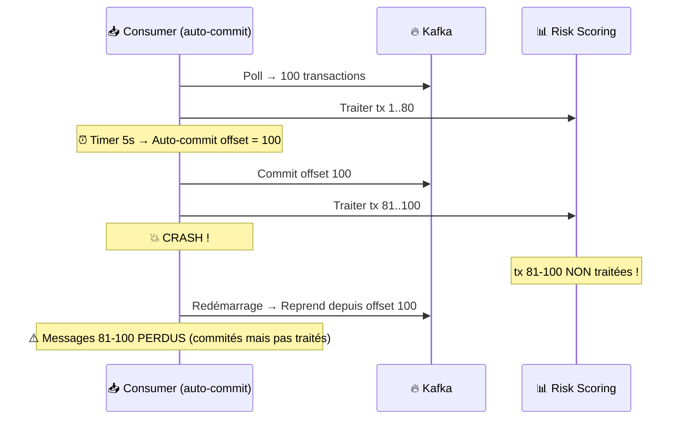

# LAB 1.3A (Java) : Consumer Basique — Détection de Fraude E-Banking

## ⏱️ Durée estimée : 45 minutes

## 🏦 Contexte E-Banking

Dans une banque, chaque transaction publiée par l'API Producer (Module 02) doit être **analysée en temps réel** par un service de détection de fraude. Ce service consomme les messages du topic `banking.transactions`, évalue un **score de risque** pour chaque transaction, et déclenche des alertes si le risque est élevé.

## 🎯 Objectifs

À la fin de ce lab, vous serez capable de :

1. Créer un **Consumer Kafka** dans une API Web Spring Boot
2. Implémenter un **@KafkaListener** pour la consommation continue de messages
3. Comprendre l'**auto-commit** des offsets (comportement et risques)
4. Désérialiser les **transactions JSON** produites par le Module 02
5. Implémenter un **moteur de scoring de risque** pour la détection de fraude
6. Exposer des **métriques et alertes** via des endpoints REST

---

## 📊 Architecture

### Producer → Kafka → Consumer Fraude



### Séquence : Consommation avec Auto-Commit



---

## 🏗️ Diagramme de Classes



---

## Auto-Commit : Fonctionnement et Risques



> **⚠️ Important** : L'auto-commit est acceptable pour la détection de fraude car rater une transaction n'a pas d'impact financier direct. Pour l'audit réglementaire (LAB 1.3C), nous utiliserons le manual commit.

---

## 🚀 Prérequis

### Topic Kafka

Le topic `banking.transactions` doit exister (créé dans le Module 02) :

```bash
# Docker
docker exec kafka /opt/kafka/bin/kafka-topics.sh \
  --bootstrap-server localhost:9092 \
  --describe --topic banking.transactions

# Si le topic n'existe pas, créez-le :
docker exec kafka /opt/kafka/bin/kafka-topics.sh \
  --bootstrap-server localhost:9092 \
  --create --if-not-exists \
  --topic banking.transactions \
  --partitions 6 \
  --replication-factor 1
```

### Messages dans le topic

Lancez l'API Producer du Module 02 et envoyez quelques transactions via Swagger pour avoir des messages à consommer.

### JDK 17+ et Maven 3.9+

```bash
java -version
# Attendu : 17.x ou supérieur

mvn -version
# Attendu : 3.9.x ou supérieur
```

---

## 📝 Instructions Pas à Pas

### Étape 1 : Structure du projet

```text
java/
├── pom.xml
├── Dockerfile
├── .dockerignore
└── src/main/
    ├── resources/
    │   └── application.properties
    └── java/com/data2ai/kafka/consumer/fraud/
        ├── FraudConsumerApplication.java
        ├── model/
        │   ├── Transaction.java
        │   ├── FraudAlert.java
        │   └── FraudMetrics.java       (DTO)
        ├── service/
        │   └── FraudDetectionService.java
        └── controller/
            └── FraudController.java
```

### Étape 2 : Dépendances Maven (`pom.xml`)

```xml
<dependencies>
    <!-- Spring Boot Web -->
    <dependency>
        <groupId>org.springframework.boot</groupId>
        <artifactId>spring-boot-starter-web</artifactId>
    </dependency>

    <!-- Spring Kafka -->
    <dependency>
        <groupId>org.springframework.kafka</groupId>
        <artifactId>spring-kafka</artifactId>
    </dependency>

    <!-- Actuator (health checks) -->
    <dependency>
        <groupId>org.springframework.boot</groupId>
        <artifactId>spring-boot-starter-actuator</artifactId>
    </dependency>

    <!-- Jackson pour la désérialisation JSON -->
    <dependency>
        <groupId>com.fasterxml.jackson.core</groupId>
        <artifactId>jackson-databind</artifactId>
    </dependency>
</dependencies>
```

### Étape 3 : Configuration de l'application (`application.properties`)

```properties
server.port=${SERVER_PORT:8080}

spring.application.name=lab-1-3a-fraud-consumer

# Kafka
spring.kafka.bootstrap-servers=${KAFKA_BOOTSTRAP_SERVERS:localhost:9092}
app.kafka.topic=${KAFKA_TOPIC:banking.transactions}
app.kafka.group-id=${KAFKA_GROUP_ID:fraud-detection-service-java}

# Consumer (auto-commit — fonctionnalité clé de ce lab)
spring.kafka.consumer.group-id=${app.kafka.group-id}
spring.kafka.consumer.auto-offset-reset=earliest
spring.kafka.consumer.enable-auto-commit=true
spring.kafka.consumer.properties.auto.commit.interval.ms=5000

# Actuator
management.endpoints.web.exposure.include=health,info
management.endpoint.health.show-details=always
```

**Points de configuration clés :**

| Propriété | Valeur | Rôle |
| --------- | ------ | ---- |
| `enable-auto-commit` | `true` | Offsets commités automatiquement toutes les 5s |
| `auto-offset-reset` | `earliest` | Commencer depuis le début si aucun offset committé |
| `group-id` | `fraud-detection-service-java` | Identité du consumer group |

### Étape 4 : Modèle Transaction (`model/Transaction.java`)

```java
package com.data2ai.kafka.consumer.fraud.model;

import java.math.BigDecimal;
import java.time.Instant;

public class Transaction {
    private String transactionId;
    private String customerId;
    private String fromAccount;
    private String toAccount;
    private BigDecimal amount;
    private String currency;
    private String type;
    private String description;
    private Instant timestamp;
    private int riskScore;

    // Getters et setters omis pour la lisibilité — voir le code source complet
}
```

### Étape 5 : Modèle Alerte Fraude (`model/FraudAlert.java`)

```java
package com.data2ai.kafka.consumer.fraud.model;

import java.math.BigDecimal;
import java.time.Instant;

public class FraudAlert {
    private String transactionId;
    private String customerId;
    private BigDecimal amount;
    private String currency;
    private int riskScore;
    private String riskLevel;   // Low, Medium, High, Critical
    private String reason;
    private Instant detectedAt;
    private int kafkaPartition;
    private long kafkaOffset;

    // Getters et setters omis pour la lisibilité — voir le code source complet
}
```

### Étape 6 : Service Consumer Kafka (`service/FraudDetectionService.java`)

C'est le **cœur du lab** — la méthode `@KafkaListener` qui traite chaque message :

```java
@Service
public class FraudDetectionService {

    private static final Logger log = LoggerFactory.getLogger(FraudDetectionService.class);
    private final ObjectMapper objectMapper;

    // Stockage en mémoire thread-safe
    private final CopyOnWriteArrayList<FraudAlert> alerts = new CopyOnWriteArrayList<>();
    private final AtomicLong messagesConsumed = new AtomicLong();
    private final AtomicLong fraudAlerts = new AtomicLong();
    private final AtomicLong processingErrors = new AtomicLong();

    @KafkaListener(topics = "${app.kafka.topic}")
    public void onMessage(ConsumerRecord<String, String> record) {
        messagesConsumed.incrementAndGet();

        try {
            Transaction tx = objectMapper.readValue(record.value(), Transaction.class);

            // Calculer le score de risque
            int riskScore = calculateRiskScore(tx);
            String riskLevel = determineRiskLevel(riskScore);

            log.info("Transaction {} | Client: {} | {} {} | Risque: {}/100 ({}) | P{}:O{}",
                    tx.getTransactionId(), tx.getCustomerId(),
                    tx.getAmount(), tx.getCurrency(),
                    riskScore, riskLevel,
                    record.partition(), record.offset());

            // Créer une alerte si risque élevé (score >= 40)
            if (riskScore >= 40) {
                FraudAlert alert = new FraudAlert();
                alert.setTransactionId(tx.getTransactionId());
                alert.setRiskScore(riskScore);
                alert.setRiskLevel(riskLevel);
                // ... autres champs
                alerts.add(alert);
                fraudAlerts.incrementAndGet();

                log.warn("🚨 ALERTE FRAUDE: {} | Score: {} | {}",
                        tx.getTransactionId(), riskScore, alert.getReason());
            }
        } catch (Exception ex) {
            processingErrors.incrementAndGet();
            log.error("Erreur de traitement. partition={} offset={} erreur={}",
                    record.partition(), record.offset(), ex.getMessage());
        }
    }

    private int calculateRiskScore(Transaction tx) {
        int score = 0;
        // Règle 1 : Montant élevé
        if (tx.getAmount() != null && tx.getAmount().doubleValue() > 10000) score += 40;
        else if (tx.getAmount() != null && tx.getAmount().doubleValue() > 5000) score += 20;

        // Règle 2 : Type de transaction à risque
        if ("InternationalTransfer".equalsIgnoreCase(tx.getType())) score += 30;
        else if ("Withdrawal".equalsIgnoreCase(tx.getType())
                 && tx.getAmount() != null && tx.getAmount().doubleValue() > 300) score += 15;

        // Règle 3 : Transaction hors heures
        if (tx.getTimestamp() != null) {
            int hour = tx.getTimestamp().atZone(java.time.ZoneOffset.UTC).getHour();
            if (hour < 6 || hour > 22) score += 15;
        }

        return Math.min(score, 100);
    }
}
```

**Concepts clés démontrés :**

- **`@KafkaListener`** — Annotation Spring Kafka qui remplace le poll loop manuel
- **`ConsumerRecord`** — Fournit l'accès à la clé, valeur, partition, offset
- **Collections thread-safe** — `CopyOnWriteArrayList`, `AtomicLong` pour l'accès concurrent
- **Auto-commit** — Les offsets sont commités automatiquement toutes les 5 secondes par Spring Kafka

### Étape 7 : Contrôleur REST (`controller/FraudController.java`)

```java
@RestController
@RequestMapping("/api/v1")
public class FraudController {

    private final FraudDetectionService service;

    public FraudController(FraudDetectionService service) {
        this.service = service;
    }

    @GetMapping("/alerts")
    public ResponseEntity<List<FraudAlert>> alerts() {
        return ResponseEntity.ok(service.getAlerts());
    }

    @GetMapping("/stats")
    public ResponseEntity<FraudMetrics> stats() {
        return ResponseEntity.ok(service.getMetrics());
    }
}
```

### Étape 8 : Classe principale Spring Boot

```java
@SpringBootApplication
public class FraudConsumerApplication {
    public static void main(String[] args) {
        SpringApplication.run(FraudConsumerApplication.class, args);
    }
}
```

---

## 🚀 Déploiement

### Développement Local

#### 1. Démarrer Kafka (si pas déjà fait)

```bash
cd ../../module-01-cluster
docker compose up -d
```

#### 2. Produire des messages (Module 02)

Lancez l'API Producer du Module 02 et envoyez des transactions via Swagger.

#### 3. Démarrer le Consumer

```bash
cd java
mvn spring-boot:run
```

#### 4. Observer les logs

```text
INFO  FraudDetectionService : Transaction TX-001 | Client: CUST-001 | 250.00 EUR | Risque: 5/100 (Low) | P0:O42
WARN  FraudDetectionService : 🚨 ALERTE FRAUDE: TX-002 | Score: 60 | Montant élevé: 15000.00EUR
```

#### 5. Vérifier via l'API

- `GET http://localhost:8080/api/v1/alerts` — Toutes les alertes fraude
- `GET http://localhost:8080/api/v1/stats` — Métriques du consumer
- `GET http://localhost:8080/actuator/health` — Health check

### Docker

```bash
cd java
docker build -t ebanking-fraud-consumer-java .
docker run -p 8080:8080 \
  -e KAFKA_BOOTSTRAP_SERVERS=host.docker.internal:9092 \
  ebanking-fraud-consumer-java
```

### OpenShift Sandbox — Option A : Build S2I Binaire

> **🎯 Objectif** : Ce déploiement valide les concepts fondamentaux du **Consumer Kafka** dans un environnement cloud :
> - **@KafkaListener** : le consumer reçoit les messages via le listener container de Spring Kafka
> - **Auto-commit** : les offsets sont commités automatiquement toutes les 5 secondes
> - **Partition assignment** : le consumer reçoit les 6 partitions du topic
> - **Health check** : l'API expose l'état du consumer via `/actuator/health`

#### 1. Build et Déploiement

```bash
cd module-03-consumer/lab-1.3a-consumer-basic/java

# Créer le BuildConfig
oc new-build java:17 --binary=true --name=ebanking-fraud-consumer-java

# Build depuis le source local
oc start-build ebanking-fraud-consumer-java --from-dir=. --follow

# Déployer
oc new-app ebanking-fraud-consumer-java
```

#### 2. Configurer les variables d'environnement

```bash
oc set env deployment/ebanking-fraud-consumer-java \
  SERVER_PORT=8080 \
  KAFKA_BOOTSTRAP_SERVERS=kafka-svc:9092 \
  KAFKA_TOPIC=banking.transactions
```

#### 3. Créer la route Edge

```bash
oc create route edge ebanking-fraud-consumer-java-secure \
  --service=ebanking-fraud-consumer-java --port=8080-tcp
```

#### 4. Vérifier le déploiement

```bash
# Obtenir l'URL publique
URL=$(oc get route ebanking-fraud-consumer-java-secure -o jsonpath='{.spec.host}')

# Health check
curl -k "https://$URL/actuator/health"

# Métriques du consumer
curl -k -s "https://$URL/api/v1/stats"

# Alertes fraude
curl -k -s "https://$URL/api/v1/alerts"
```

#### 5. ✅ Critères de succès

```bash
# Pod en cours d'exécution ?
oc get pod -l deployment=ebanking-fraud-consumer-java
# Attendu : STATUS=Running, READY=1/1

# Consumer actif ?
curl -k -s "https://$URL/actuator/health"
# Attendu : {"status":"UP"}
```

#### 6. Script automatisé

```bash
# Bash
./scripts/bash/deploy-and-test-1.3a-java.sh

# PowerShell
.\scripts\powershell\deploy-and-test-1.3a-java.ps1
```

---

## 🧪 Tests

### Scénarios de test

```bash
URL=$(oc get route ebanking-fraud-consumer-java-secure -o jsonpath='{.spec.host}')

# 1. Health check
curl -k -s "https://$URL/actuator/health"

# 2. Vérifier les stats (messagesConsumed doit augmenter)
curl -k -s "https://$URL/api/v1/stats"

# 3. Vérifier les alertes fraude (montants élevés déclenchent des alertes)
curl -k -s "https://$URL/api/v1/alerts"
```

---

## 📋 Endpoints API

| Méthode | Endpoint | Description |
| ------- | -------- | ----------- |
| `GET` | `/api/v1/alerts` | Toutes les alertes fraude détectées |
| `GET` | `/api/v1/stats` | Métriques du consumer (messages consommés, alertes, erreurs) |
| `GET` | `/actuator/health` | Health check |

---

## 🎯 Concepts Clés Expliqués

### Spring Kafka vs Confluent.Kafka (.NET)

| Aspect | Java (Spring Kafka) | .NET (Confluent.Kafka) |
| ------ | ------------------- | ---------------------- |
| **Configuration consumer** | `@KafkaListener` annotation | `BackgroundService` + poll loop |
| **Désérialisation** | Jackson `ObjectMapper` | `System.Text.Json` |
| **Thread safety** | `AtomicLong`, `CopyOnWriteArrayList` | `Interlocked`, `ConcurrentBag` |
| **Configuration** | `application.properties` | `appsettings.json` + `ConsumerConfig` |
| **Health check** | Spring Actuator `/actuator/health` | Custom `/api/FraudDetection/health` |
| **Auto-commit** | `enable-auto-commit=true` (défaut) | `EnableAutoCommit = true` |

### Règles de Scoring de Risque

| Règle | Condition | Score ajouté |
| ----- | --------- | ------------ |
| Montant élevé | `amount > 10 000` | +40 |
| Montant notable | `amount > 5 000` | +20 |
| Virement international | `type = InternationalTransfer` | +30 |
| Retrait élevé | `type = Withdrawal && amount > 300` | +15 |
| Hors heures | `hour < 6 ou hour > 22` | +15 |

### Niveaux de Risque

| Score | Niveau | Action |
| ----- | ------ | ------ |
| 0-24 | Low | Aucune action |
| 25-49 | Medium | Alerte créée |
| 50-74 | High | Alerte + revue requise |
| 75-100 | Critical | Alerte + blocage immédiat |

---

## 🔧 Troubleshooting

| Symptôme | Cause probable | Solution |
| -------- | -------------- | -------- |
| Aucun message consommé | Mauvais bootstrap servers ou topic | Vérifier les variables `KAFKA_BOOTSTRAP_SERVERS` et `KAFKA_TOPIC` |
| Health retourne DOWN | Consumer non connecté à Kafka | Vérifier que Kafka est démarré et accessible |
| `messagesConsumed` reste à 0 | Pas de messages dans le topic | Envoyer des transactions via l'API Producer |
| Erreurs de désérialisation | Format JSON incompatible | Vérifier que le producer envoie le bon schéma JSON |
| Pod CrashLoopBackOff | Variables d'environnement manquantes | Vérifier : `oc set env deployment/ebanking-fraud-consumer-java --list` |

---

## ✅ Validation

- [ ] Le consumer démarre et se connecte à Kafka
- [ ] Les messages sont consommés depuis `banking.transactions`
- [ ] Le score de risque est calculé pour chaque transaction
- [ ] Des alertes sont créées pour les transactions avec score >= 40
- [ ] `/api/v1/alerts` retourne les alertes fraude détectées
- [ ] `/api/v1/stats` montre `messagesConsumed > 0`
- [ ] `/actuator/health` retourne `UP`
- [ ] L'auto-commit est activé (offsets commités toutes les 5s)

---

## 🏁 Étape Suivante

Passez au **[LAB 1.3B (Java) : Consumer Group — Calcul de Solde](../../lab-1.3b-consumer-group/java/README.md)** pour apprendre les consumer groups, l'assignation de partitions et le rebalancing.
