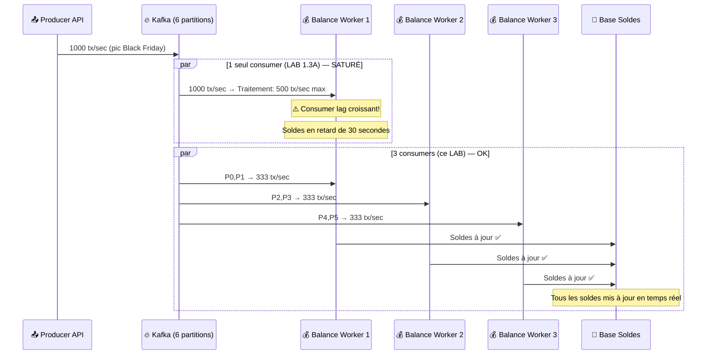
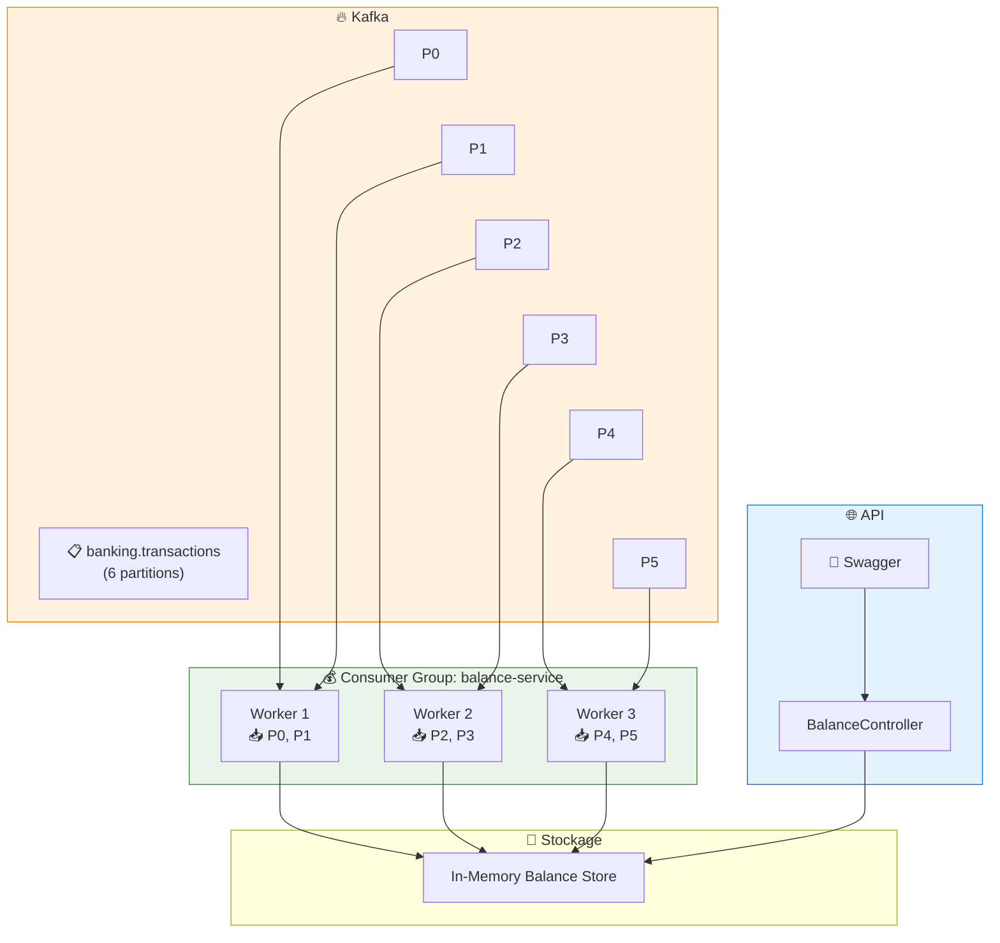
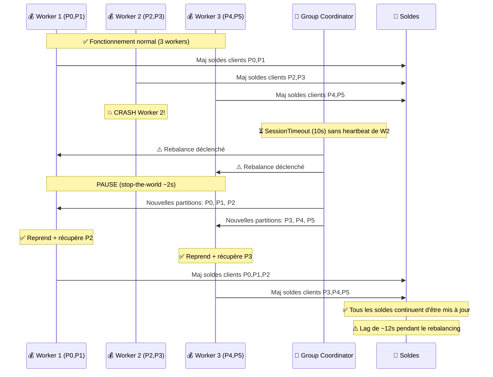
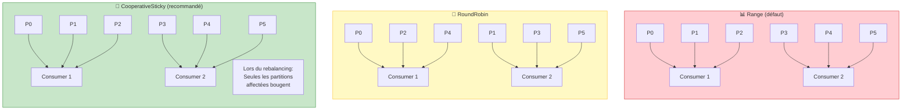
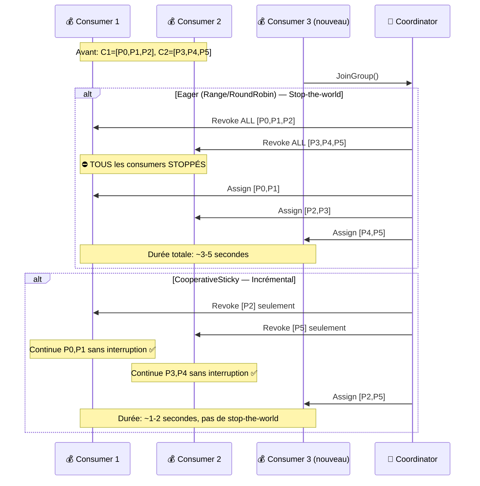
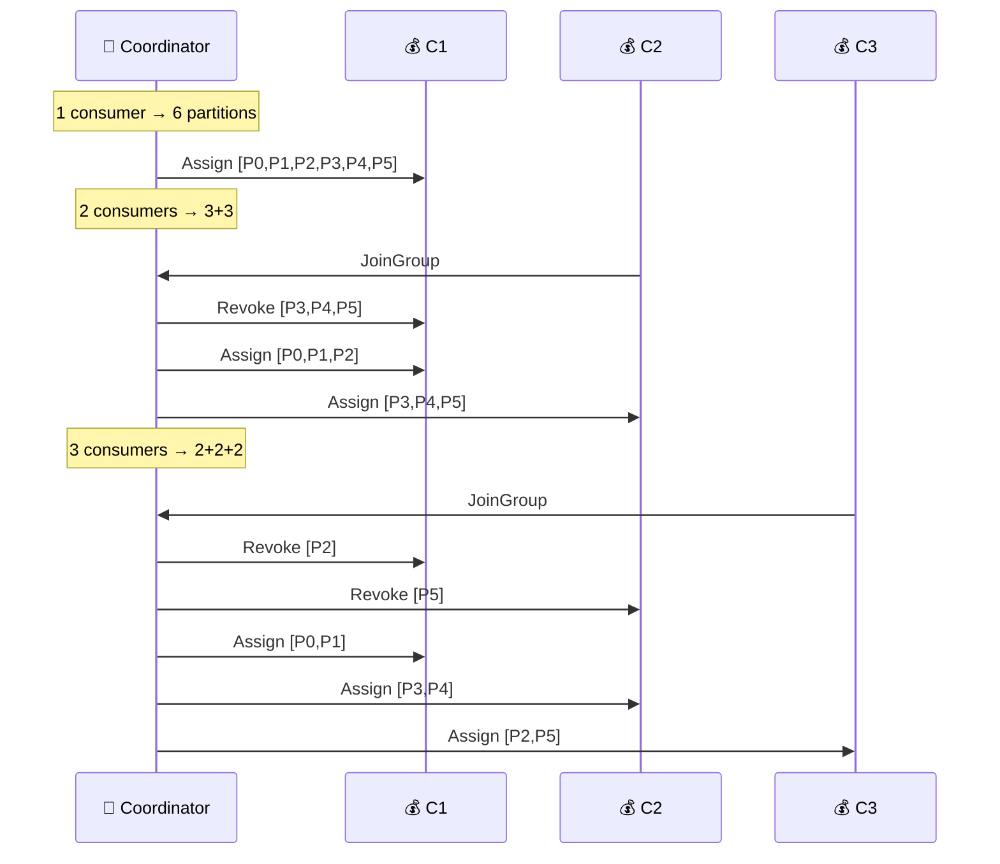
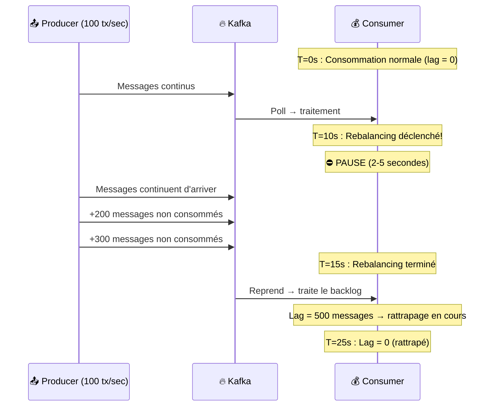

# LAB 1.3B : Consumer Group Scaling & Rebalancing — Calcul de Solde E-Banking

## ⏱️ Durée estimée : 60 minutes

## 🏦 Contexte E-Banking

Dans une banque, le **calcul de solde en temps réel** est l'un des services les plus sollicités. Chaque transaction (virement, paiement carte, retrait DAB) doit **mettre à jour le solde du client immédiatement**. Avec des millions de transactions par jour, un seul consumer ne suffit pas — il faut **scaler horizontalement** avec un Consumer Group.

### Pourquoi Scaler le Calcul de Solde ?



### Architecture : Consumer Group pour Calcul de Solde



### Séquence : Rebalancing lors d'un Crash



### Scénarios de Scaling E-Banking

| Scénario | Workers | Partitions/Worker | Throughput | Latence solde |
| -------- | ------- | ----------------- | ---------- | ------------- |
| **Jour normal** | 1 | 6 | 100 tx/sec | ~500ms |
| **Heure de pointe** | 3 | 2 | 300 tx/sec | ~200ms |
| **Black Friday** | 6 | 1 | 600 tx/sec | ~100ms |
| **Sur-capacité** | 8 | 1 (2 idle) | 600 tx/sec | ~100ms ⚠️ gaspillage |

---

## 🎯 Objectifs

À la fin de ce lab, vous serez capable de :

1. Comprendre le **Consumer Group** et le partage automatique des partitions
2. Observer le **rebalancing** en ajoutant/supprimant des consumers
3. Comparer les stratégies d'assignation (**RoundRobin**, **Range**, **CooperativeSticky**)
4. Identifier la **distribution optimale** (N consumers = N partitions)
5. Détecter les **consumers inactifs** (sur-capacité)
6. Mesurer l'**impact du rebalancing** sur le consumer lag

---

## 📦 Ce que vous allez construire

| Composant | Rôle |
| --------- | ---- |
| `Transaction.cs` | Modèle partagé (identique au Module 02) |
| `CustomerBalance.cs` | Modèle de solde client |
| `BalanceConsumerService.cs` | BackgroundService avec tracking de partitions |
| `BalanceController.cs` | Endpoints API : soldes, partitions, rebalancing history |
| `Program.cs` | Configuration multi-instance |
| `appsettings.json` | Configuration Kafka Consumer Group |

---

## 🔧 Ce que vous allez apprendre

### Stratégies d'Assignation



### Séquence : CooperativeSticky vs Eager Rebalancing



---

## 🚀 Prérequis

### LAB 1.3A complété

Ce lab étend le consumer du LAB 1.3A. Vous devez avoir compris le polling loop et l'auto-commit.

### Topic avec messages

Assurez-vous d'avoir des messages dans `banking.transactions` en utilisant le Producer du Module 02.

---

## 📝 Instructions Pas à Pas

### Étape 1 : Créer le projet API Web

#### Option VS Code

```bash
mkdir lab-1.3b-consumer-group
cd lab-1.3b-consumer-group
mkdir EBankingBalanceAPI
cd EBankingBalanceAPI
dotnet new webapi -n EBankingBalanceAPI --framework net8.0
cd EBankingBalanceAPI
dotnet add package Confluent.Kafka --version 2.3.0
dotnet add package Swashbuckle.AspNetCore --version 6.5.0
```

#### Option Visual Studio 2022

1. **Fichier** → **Nouveau** → **Projet**
2. Sélectionner **API Web ASP.NET Core**
3. Nom : `EBankingBalanceAPI`, Framework : **.NET 8.0**
4. Clic droit projet → **Gérer les packages NuGet** :
   - `Confluent.Kafka` version **2.3.0**
   - `Swashbuckle.AspNetCore` version **6.5.0**

---

### Étape 2 : Créer les modèles

#### `Models/Transaction.cs` (identique au Module 02)

Copiez le fichier `Transaction.cs` du LAB 1.3A.

#### `Models/CustomerBalance.cs`

```csharp
namespace EBankingBalanceAPI.Models;

public class CustomerBalance
{
    public string CustomerId { get; set; } = string.Empty;
    public decimal Balance { get; set; }
    public int TransactionCount { get; set; }
    public DateTime LastUpdated { get; set; }
    public string LastTransactionId { get; set; } = string.Empty;
}

public class RebalancingEvent
{
    public DateTime Timestamp { get; set; } = DateTime.UtcNow;
    public string EventType { get; set; } = string.Empty; // Assigned, Revoked, Lost
    public List<int> Partitions { get; set; } = new();
    public string Details { get; set; } = string.Empty;
}

public class ConsumerGroupMetrics
{
    public string ConsumerId { get; set; } = string.Empty;
    public string GroupId { get; set; } = string.Empty;
    public string Status { get; set; } = "Unknown";
    public List<int> AssignedPartitions { get; set; } = new();
    public long MessagesConsumed { get; set; }
    public long BalanceUpdates { get; set; }
    public long ProcessingErrors { get; set; }
    public Dictionary<int, long> PartitionOffsets { get; set; } = new();
    public List<RebalancingEvent> RebalancingHistory { get; set; } = new();
    public DateTime StartedAt { get; set; }
    public DateTime LastMessageAt { get; set; }
}
```

---

### Étape 3 : Créer le service Consumer avec tracking de rebalancing

#### `Services/BalanceConsumerService.cs`

```csharp
using System.Collections.Concurrent;
using System.Text.Json;
using Confluent.Kafka;
using EBankingBalanceAPI.Models;

namespace EBankingBalanceAPI.Services;

public class BalanceConsumerService : BackgroundService
{
    private readonly ILogger<BalanceConsumerService> _logger;
    private readonly IConfiguration _configuration;

    // Stockage partagé des soldes (thread-safe)
    private readonly ConcurrentDictionary<string, CustomerBalance> _balances = new();
    private readonly ConcurrentDictionary<int, long> _partitionOffsets = new();
    private readonly ConcurrentBag<RebalancingEvent> _rebalancingHistory = new();
    private readonly List<int> _assignedPartitions = new();
    private readonly object _partitionLock = new();

    private long _messagesConsumed;
    private long _balanceUpdates;
    private long _processingErrors;
    private DateTime _startedAt;
    private DateTime _lastMessageAt;
    private string _status = "Starting";
    private string _consumerId = string.Empty;

    public BalanceConsumerService(
        ILogger<BalanceConsumerService> logger,
        IConfiguration configuration)
    {
        _logger = logger;
        _configuration = configuration;
    }

    protected override async Task ExecuteAsync(CancellationToken stoppingToken)
    {
        _startedAt = DateTime.UtcNow;
        _consumerId = $"balance-worker-{Environment.MachineName}-{Guid.NewGuid().ToString()[..8]}";
        _status = "Running";

        var config = new ConsumerConfig
        {
            BootstrapServers = _configuration["Kafka:BootstrapServers"] ?? "localhost:9092",
            GroupId = _configuration["Kafka:GroupId"] ?? "balance-service",
            ClientId = _consumerId,
            AutoOffsetReset = AutoOffsetReset.Earliest,
            EnableAutoCommit = true,
            AutoCommitIntervalMs = 5000,
            SessionTimeoutMs = 10000,
            HeartbeatIntervalMs = 3000,
            MaxPollIntervalMs = 300000,
            // CooperativeSticky : rebalancing incrémental (pas de stop-the-world complet)
            PartitionAssignmentStrategy = PartitionAssignmentStrategy.CooperativeSticky
        };

        var topic = _configuration["Kafka:Topic"] ?? "banking.transactions";

        _logger.LogInformation(
            "🚀 Starting Balance Consumer [{ConsumerId}]. Group: {Group}, Topic: {Topic}",
            _consumerId, config.GroupId, topic);

        using var consumer = new ConsumerBuilder<string, string>(config)
            .SetErrorHandler((_, e) =>
            {
                _logger.LogError("[{Consumer}] Error: {Code} - {Reason}", _consumerId, e.Code, e.Reason);
                if (e.IsFatal) _status = "Fatal Error";
            })
            .SetPartitionsAssignedHandler((c, partitions) =>
            {
                var partitionIds = partitions.Select(p => p.Partition.Value).ToList();
                lock (_partitionLock)
                {
                    _assignedPartitions.Clear();
                    _assignedPartitions.AddRange(partitionIds);
                }

                _rebalancingHistory.Add(new RebalancingEvent
                {
                    EventType = "Assigned",
                    Partitions = partitionIds,
                    Details = $"Consumer {_consumerId} received {partitionIds.Count} partitions"
                });

                _logger.LogInformation(
                    "✅ [{Consumer}] Partitions ASSIGNED: [{Partitions}]",
                    _consumerId, string.Join(", ", partitionIds));
                _status = "Consuming";
            })
            .SetPartitionsRevokedHandler((c, partitions) =>
            {
                var partitionIds = partitions.Select(p => p.Partition.Value).ToList();

                _rebalancingHistory.Add(new RebalancingEvent
                {
                    EventType = "Revoked",
                    Partitions = partitionIds,
                    Details = $"Consumer {_consumerId} lost {partitionIds.Count} partitions (rebalancing)"
                });

                _logger.LogWarning(
                    "⚠️ [{Consumer}] Partitions REVOKED: [{Partitions}] — Rebalancing in progress",
                    _consumerId, string.Join(", ", partitionIds));
                _status = "Rebalancing";
            })
            .SetPartitionsLostHandler((c, partitions) =>
            {
                var partitionIds = partitions.Select(p => p.Partition.Value).ToList();

                _rebalancingHistory.Add(new RebalancingEvent
                {
                    EventType = "Lost",
                    Partitions = partitionIds,
                    Details = $"Consumer {_consumerId} unexpectedly lost {partitionIds.Count} partitions"
                });

                _logger.LogError(
                    "❌ [{Consumer}] Partitions LOST: [{Partitions}]",
                    _consumerId, string.Join(", ", partitionIds));
                _status = "Partitions Lost";
            })
            .Build();

        consumer.Subscribe(topic);

        try
        {
            while (!stoppingToken.IsCancellationRequested)
            {
                try
                {
                    var consumeResult = consumer.Consume(stoppingToken);
                    if (consumeResult == null) continue;

                    await ProcessTransactionAsync(consumeResult);
                }
                catch (ConsumeException ex)
                {
                    _logger.LogError(ex, "[{Consumer}] Consume error: {Reason}", _consumerId, ex.Error.Reason);
                    Interlocked.Increment(ref _processingErrors);
                }
            }
        }
        catch (OperationCanceledException)
        {
            _logger.LogInformation("[{Consumer}] Shutdown requested", _consumerId);
        }
        finally
        {
            _status = "Stopped";
            consumer.Close();
            _logger.LogInformation("[{Consumer}] Consumer closed gracefully", _consumerId);
        }
    }

    private async Task ProcessTransactionAsync(ConsumeResult<string, string> result)
    {
        try
        {
            var transaction = JsonSerializer.Deserialize<Transaction>(result.Message.Value);
            if (transaction == null)
            {
                Interlocked.Increment(ref _processingErrors);
                return;
            }

            // Mettre à jour le solde du client
            _balances.AddOrUpdate(
                transaction.CustomerId,
                // Nouveau client
                new CustomerBalance
                {
                    CustomerId = transaction.CustomerId,
                    Balance = GetBalanceChange(transaction),
                    TransactionCount = 1,
                    LastUpdated = DateTime.UtcNow,
                    LastTransactionId = transaction.TransactionId
                },
                // Client existant
                (key, existing) =>
                {
                    existing.Balance += GetBalanceChange(transaction);
                    existing.TransactionCount++;
                    existing.LastUpdated = DateTime.UtcNow;
                    existing.LastTransactionId = transaction.TransactionId;
                    return existing;
                });

            // Métriques
            Interlocked.Increment(ref _messagesConsumed);
            Interlocked.Increment(ref _balanceUpdates);
            _lastMessageAt = DateTime.UtcNow;
            _partitionOffsets[result.Partition.Value] = result.Offset.Value;

            _logger.LogInformation(
                "💰 [{Consumer}] {Customer}: {Sign}{Amount}{Currency} ({Type}) → Solde: {Balance}{Currency2} | P{Partition}:O{Offset}",
                _consumerId,
                transaction.CustomerId,
                GetBalanceChange(transaction) >= 0 ? "+" : "",
                Math.Abs(GetBalanceChange(transaction)),
                transaction.Currency,
                transaction.Type,
                _balances[transaction.CustomerId].Balance,
                transaction.Currency,
                result.Partition.Value,
                result.Offset.Value);

            // Simuler traitement (écriture en base en production)
            await Task.Delay(20);
        }
        catch (Exception ex)
        {
            _logger.LogError(ex, "[{Consumer}] Error processing P{Partition}:O{Offset}",
                _consumerId, result.Partition.Value, result.Offset.Value);
            Interlocked.Increment(ref _processingErrors);
        }
    }

    private static decimal GetBalanceChange(Transaction tx)
    {
        return tx.Type switch
        {
            "Deposit" or "Transfer" when tx.Amount > 0 => tx.Amount,
            "Withdrawal" or "CardPayment" or "BillPayment" => -tx.Amount,
            _ => tx.Amount
        };
    }

    // Méthodes publiques pour l'API
    public IReadOnlyDictionary<string, CustomerBalance> GetAllBalances() =>
        new Dictionary<string, CustomerBalance>(_balances);

    public CustomerBalance? GetBalance(string customerId) =>
        _balances.GetValueOrDefault(customerId);

    public ConsumerGroupMetrics GetMetrics()
    {
        List<int> partitions;
        lock (_partitionLock)
        {
            partitions = new List<int>(_assignedPartitions);
        }

        return new ConsumerGroupMetrics
        {
            ConsumerId = _consumerId,
            GroupId = _configuration["Kafka:GroupId"] ?? "balance-service",
            Status = _status,
            AssignedPartitions = partitions,
            MessagesConsumed = Interlocked.Read(ref _messagesConsumed),
            BalanceUpdates = Interlocked.Read(ref _balanceUpdates),
            ProcessingErrors = Interlocked.Read(ref _processingErrors),
            PartitionOffsets = new Dictionary<int, long>(_partitionOffsets),
            RebalancingHistory = _rebalancingHistory.ToList(),
            StartedAt = _startedAt,
            LastMessageAt = _lastMessageAt
        };
    }
}
```

---

### Étape 4 : Créer le contrôleur API

#### `Controllers/BalanceController.cs`

```csharp
using Microsoft.AspNetCore.Mvc;
using EBankingBalanceAPI.Services;

namespace EBankingBalanceAPI.Controllers;

[ApiController]
[Route("api/[controller]")]
public class BalanceController : ControllerBase
{
    private readonly BalanceConsumerService _consumerService;
    private readonly ILogger<BalanceController> _logger;

    public BalanceController(
        BalanceConsumerService consumerService,
        ILogger<BalanceController> logger)
    {
        _consumerService = consumerService;
        _logger = logger;
    }

    /// <summary>
    /// Récupère les soldes de tous les clients
    /// </summary>
    [HttpGet("balances")]
    [ProducesResponseType(StatusCodes.Status200OK)]
    public IActionResult GetAllBalances()
    {
        var balances = _consumerService.GetAllBalances();
        return Ok(new
        {
            count = balances.Count,
            balances = balances.Values.OrderBy(b => b.CustomerId)
        });
    }

    /// <summary>
    /// Récupère le solde d'un client spécifique
    /// </summary>
    [HttpGet("balances/{customerId}")]
    [ProducesResponseType(StatusCodes.Status200OK)]
    [ProducesResponseType(StatusCodes.Status404NotFound)]
    public IActionResult GetBalance(string customerId)
    {
        var balance = _consumerService.GetBalance(customerId);
        if (balance == null)
            return NotFound(new { error = $"Customer {customerId} not found" });

        return Ok(balance);
    }

    /// <summary>
    /// Métriques du consumer : partitions, offsets, rebalancing history
    /// </summary>
    [HttpGet("metrics")]
    [ProducesResponseType(StatusCodes.Status200OK)]
    public IActionResult GetMetrics()
    {
        return Ok(_consumerService.GetMetrics());
    }

    /// <summary>
    /// Historique des rebalancing (assignations, révocations)
    /// </summary>
    [HttpGet("rebalancing-history")]
    [ProducesResponseType(StatusCodes.Status200OK)]
    public IActionResult GetRebalancingHistory()
    {
        var metrics = _consumerService.GetMetrics();
        return Ok(new
        {
            consumerId = metrics.ConsumerId,
            currentPartitions = metrics.AssignedPartitions,
            totalRebalancingEvents = metrics.RebalancingHistory.Count,
            history = metrics.RebalancingHistory.OrderByDescending(e => e.Timestamp)
        });
    }

    /// <summary>
    /// Health check incluant le statut du consumer group
    /// </summary>
    [HttpGet("health")]
    [ProducesResponseType(StatusCodes.Status200OK)]
    [ProducesResponseType(StatusCodes.Status503ServiceUnavailable)]
    public IActionResult GetHealth()
    {
        var metrics = _consumerService.GetMetrics();
        var isHealthy = metrics.Status == "Consuming" || metrics.Status == "Running";

        var health = new
        {
            status = isHealthy ? "Healthy" : "Degraded",
            consumerId = metrics.ConsumerId,
            consumerStatus = metrics.Status,
            assignedPartitions = metrics.AssignedPartitions,
            messagesConsumed = metrics.MessagesConsumed,
            lastMessageAt = metrics.LastMessageAt,
            uptime = DateTime.UtcNow - metrics.StartedAt
        };

        return isHealthy ? Ok(health) : StatusCode(503, health);
    }
}
```

---

### Étape 5 : Configurer l'application

#### `appsettings.json`

```json
{
  "Logging": {
    "LogLevel": {
      "Default": "Information",
      "Microsoft.AspNetCore": "Warning",
      "EBankingBalanceAPI": "Information"
    }
  },
  "Kafka": {
    "BootstrapServers": "localhost:9092",
    "GroupId": "balance-service",
    "Topic": "banking.transactions"
  },
  "AllowedHosts": "*"
}
```

#### `Program.cs`

```csharp
using EBankingBalanceAPI.Services;

var builder = WebApplication.CreateBuilder(args);

builder.Services.AddSingleton<BalanceConsumerService>();
builder.Services.AddHostedService(sp => sp.GetRequiredService<BalanceConsumerService>());

builder.Services.AddControllers();
builder.Services.AddEndpointsApiExplorer();
builder.Services.AddSwaggerGen(c =>
{
    c.SwaggerDoc("v1", new()
    {
        Title = "E-Banking Balance API",
        Version = "v1",
        Description = "Consumer Group Kafka pour le calcul de solde en temps réel"
    });
});

var app = builder.Build();

app.UseSwagger();
app.UseSwaggerUI(c =>
{
    c.SwaggerEndpoint("/swagger/v1/swagger.json", "Balance API v1");
    c.RoutePrefix = "swagger";
});

app.MapControllers();

app.Run();
```

#### `EBankingBalanceAPI.csproj`

```xml
<Project Sdk="Microsoft.NET.Sdk.Web">
  <PropertyGroup>
    <TargetFramework>net8.0</TargetFramework>
    <Nullable>enable</Nullable>
    <ImplicitUsings>enable</ImplicitUsings>
  </PropertyGroup>
  <ItemGroup>
    <PackageReference Include="Confluent.Kafka" Version="2.3.0" />
    <PackageReference Include="Swashbuckle.AspNetCore" Version="6.5.0" />
  </ItemGroup>
</Project>
```

---

### Étape 6 : Observer le Rebalancing

#### Scénario 1 : Démarrer 1 instance

```bash
cd EBankingBalanceAPI
dotnet run --urls "https://localhost:5010"
```

**Logs attendus** :

```text
✅ [balance-worker-xxx] Partitions ASSIGNED: [0, 1, 2, 3, 4, 5]
💰 [balance-worker-xxx] CUST-001: +500EUR (Deposit) → Solde: 500EUR | P2:O0
```

→ Le consumer unique reçoit les **6 partitions**.

#### Scénario 2 : Démarrer une 2e instance (même GroupId)

Dans un **second terminal** :

```bash
cd EBankingBalanceAPI
dotnet run --urls "https://localhost:5011"
```

**Logs instance 1** :

```text
⚠️ [balance-worker-xxx] Partitions REVOKED: [0, 1, 2, 3, 4, 5]
✅ [balance-worker-xxx] Partitions ASSIGNED: [0, 1, 2]
```

**Logs instance 2** :

```text
✅ [balance-worker-yyy] Partitions ASSIGNED: [3, 4, 5]
```

→ Les 6 partitions sont **partagées équitablement** entre les 2 consumers.

#### Scénario 3 : Arrêter l'instance 2 (Ctrl+C)

**Logs instance 1** (après ~10 secondes) :

```text
⚠️ [balance-worker-xxx] Partitions REVOKED: [0, 1, 2]
✅ [balance-worker-xxx] Partitions ASSIGNED: [0, 1, 2, 3, 4, 5]
```

→ L'instance 1 **récupère automatiquement** les partitions de l'instance arrêtée.

#### Scénario 4 : Vérifier via Swagger

- Instance 1 : `https://localhost:5010/swagger`
- Instance 2 : `https://localhost:5011/swagger`

Comparez les **métriques** et **partitions assignées** de chaque instance :

- **GET /api/balance/metrics** → `assignedPartitions: [0, 1, 2]`
- **GET /api/balance/rebalancing-history** → Historique complet des rebalancings

---

## 🎯 Concepts Clés Expliqués

### Séquence : Scaling de 1 à 6 Consumers



### Impact du Rebalancing sur le Consumer Lag



### Tableau Comparatif des Stratégies

| Critère | Range | RoundRobin | CooperativeSticky |
| ------- | ----- | ---------- | ----------------- |
| **Distribution** | Partitions consécutives | Circulaire équitable | Équitable + stable |
| **Rebalancing** | Stop-the-world | Stop-the-world | Incrémental |
| **Durée rebalance** | 3-5 sec | 3-5 sec | 1-2 sec |
| **Interruption** | Tous les consumers | Tous les consumers | Seulement les partitions affectées |
| **E-Banking** | ⚠️ Lag pendant rebalance | ⚠️ Lag pendant rebalance | ✅ Continuité maximale |
| **Recommandé** | Non | Pour tests | **Production** |

---

## ☁️ Alternative : Déploiement sur OpenShift Sandbox

> **🎯 Objectif** : Ce déploiement valide les concepts de **Consumer Group et Rebalancing** dans un environnement cloud :
> - **Consumer Group** : plusieurs instances partagent la charge de consommation d'un topic
> - **Partition Assignment** : chaque consumer reçoit un sous-ensemble de partitions
> - **Rebalancing** : quand un consumer rejoint ou quitte le groupe, les partitions sont redistribuées
> - **Calcul de solde** : chaque transaction est agrégée pour calculer le solde par client
> - **Scaling** : scaler le déploiement pour observer le rebalancing en temps réel

Si vous utilisez l'environnement **OpenShift Sandbox**, suivez ces étapes pour déployer et exposer votre Consumer publiquement.

### 1. Préparer le Build et le Déploiement

```bash
# Se placer dans le dossier du projet
cd EBankingBalanceAPI

# Créer une build binaire pour .NET
oc new-build dotnet:8.0-ubi8 --binary=true --name=ebanking-balance-api

# Lancer la build en envoyant le dossier courant
oc start-build ebanking-balance-api --from-dir=. --follow

# Créer l'application
oc new-app ebanking-balance-api
```

### 2. Configurer les variables d'environnement

```bash
oc set env deployment/ebanking-balance-api \
  Kafka__BootstrapServers=kafka-svc:9092 \
  Kafka__GroupId=balance-service \
  Kafka__Topic=banking.transactions \
  ASPNETCORE_URLS=http://0.0.0.0:8080 \
  ASPNETCORE_ENVIRONMENT=Development
```

### 3. Exposer publiquement (Secure Edge Route)

> [!IMPORTANT]
> Standard routes may hang on the Sandbox. Use an **edge route** for reliable public access.

```bash
oc create route edge ebanking-balance-api-secure --service=ebanking-balance-api --port=8080-tcp
```

### Stability Warning

For Sandbox environments, use `Acks = Acks.Leader` and `EnableIdempotence = false` in any `ProducerConfig` to avoid `Coordinator load in progress` hangs.

### 4. Tester l'API déployée

```bash
# Obtenir l'URL publique
URL=$(oc get route ebanking-balance-api-secure -o jsonpath='{.spec.host}')
echo "https://$URL/swagger"

# Tester le Health Check
curl -k -i "https://$URL/api/Balance/health"

# Voir les métriques et partitions
curl -k -s "https://$URL/api/Balance/metrics"
```

### 5. 🧪 Scénarios de Test et Validation des Concepts (Sandbox)

#### Scénario 1 : Produire des transactions et vérifier les soldes

```bash
URL=$(oc get route ebanking-balance-api-secure -o jsonpath='{.spec.host}')

# Produire des transactions via Kafka CLI
oc exec kafka-0 -- /opt/kafka/bin/kafka-console-producer.sh \
  --broker-list localhost:9092 \
  --topic banking.transactions <<< \
  '{"transactionId":"BAL-001","fromAccount":"BANK","toAccount":"FR7630001000123456789","amount":5000.00,"currency":"EUR","type":3,"description":"Depot initial","customerId":"CUST-001","timestamp":"2026-02-08T22:00:00Z","riskScore":0,"status":1}'

oc exec kafka-0 -- /opt/kafka/bin/kafka-console-producer.sh \
  --broker-list localhost:9092 \
  --topic banking.transactions <<< \
  '{"transactionId":"BAL-002","fromAccount":"FR7630001000123456789","toAccount":"FR7630001000987654321","amount":1200.00,"currency":"EUR","type":1,"description":"Virement loyer","customerId":"CUST-001","timestamp":"2026-02-08T22:01:00Z","riskScore":0,"status":1}'

# Vérifier les soldes (attendre 2-3s)
sleep 3
curl -k -s "https://$URL/api/Balance/balances" | jq .
curl -k -s "https://$URL/api/Balance/balances/CUST-001" | jq .
```

**📖 Concept** : Le consumer agrège les transactions pour calculer le solde. CUST-001 devrait avoir un solde de 5000 - 1200 = 3800€.

#### Scénario 2 : Scaling et Rebalancing

```bash
# Scaler à 2 instances
oc scale deployment/ebanking-balance-api --replicas=2

# Vérifier les partitions assignées sur chaque pod
oc get pods -l deployment=ebanking-balance-api
POD1=$(oc get pods -l deployment=ebanking-balance-api -o jsonpath='{.items[0].metadata.name}')
POD2=$(oc get pods -l deployment=ebanking-balance-api -o jsonpath='{.items[1].metadata.name}')
oc logs $POD1 | grep "Partitions ASSIGNED"
oc logs $POD2 | grep "Partitions ASSIGNED"

# Vérifier l'historique de rebalancing via l'API
curl -k -s "https://$URL/api/Balance/rebalancing-history" | jq .

# Vérifier le consumer group via Kafka CLI
oc exec kafka-0 -- /opt/kafka/bin/kafka-consumer-groups.sh \
  --bootstrap-server localhost:9092 \
  --describe --group balance-service

# Revenir à 1 instance
oc scale deployment/ebanking-balance-api --replicas=1
```

**📖 Concept** : Avec 6 partitions et 2 consumers, chaque consumer reçoit 3 partitions. Le rebalancing est visible dans les logs et l'API `/rebalancing-history`.

#### Scénario 3 : Vérifier les métriques du consumer group

```bash
curl -k -s "https://$URL/api/Balance/metrics" | jq .
```

#### 📖 Concepts validés

| Concept | Comment le vérifier |
| ------- | ------------------- |
| Consumer Group | `kafka-consumer-groups.sh --describe` montre les members du groupe |
| Partition Assignment | Chaque pod log `Partitions ASSIGNED [P0,P1,P2]` |
| Rebalancing | `GET /rebalancing-history` montre les événements d'assignation/révocation |
| Calcul de solde | `GET /balances/CUST-001` montre le solde agrégé |
| Scaling | Scaler à 2 replicas → les 6 partitions sont réparties 3+3 |

#### Récapitulatif des Endpoints

| Méthode | Endpoint | Objectif pédagogique |
| ------- | -------- | -------------------- |
| `GET` | `/api/Balance/balances` | Tous les soldes agrégés par client |
| `GET` | `/api/Balance/balances/{customerId}` | Solde d'un client spécifique |
| `GET` | `/api/Balance/metrics` | Métriques du consumer group (partitions, offsets) |
| `GET` | `/api/Balance/rebalancing-history` | Historique des rebalancing |
| `GET` | `/api/Balance/health` | Health check avec état du consumer group |

---

## 🖥️ Déploiement Local OpenShift (CRC / OpenShift Local)

Si vous disposez d'un cluster **OpenShift Local** (anciennement CRC — CodeReady Containers), vous pouvez déployer l'API directement depuis votre machine.

### 1. Prérequis

```bash
# Vérifier que le cluster est démarré
crc status

# Se connecter au cluster
oc login -u developer https://api.crc.testing:6443
oc project ebanking-labs
```

### 2. Build et Déploiement (Binary Build)

```bash
cd EBankingBalanceAPI

# Créer la build config et lancer le build
oc new-build dotnet:8.0-ubi8 --binary=true --name=ebanking-balance-api
oc start-build ebanking-balance-api --from-dir=. --follow

# Créer l'application
oc new-app ebanking-balance-api
```

### 3. Configurer les variables d'environnement

```bash
oc set env deployment/ebanking-balance-api \
  Kafka__BootstrapServers=kafka-svc:9092 \
  Kafka__GroupId=balance-service \
  Kafka__Topic=banking.transactions \
  ASPNETCORE_URLS=http://0.0.0.0:8080 \
  ASPNETCORE_ENVIRONMENT=Development
```

### 4. Exposer et tester

```bash
# Créer une route edge
oc create route edge ebanking-balance-api-secure --service=ebanking-balance-api --port=8080-tcp

# Obtenir l'URL
URL=$(oc get route ebanking-balance-api-secure -o jsonpath='{.spec.host}')
echo "https://$URL/swagger"

# Tester
curl -k -i "https://$URL/api/Balance/health"
```

### 5. 🧪 Validation des concepts (Sandbox / CRC)

```bash
URL=$(oc get route ebanking-balance-api-secure -o jsonpath='{.spec.host}')
PRODUCER_URL=$(oc get route ebanking-producer-api-secure -o jsonpath='{.spec.host}')

# 1. Health check - consumer should be Consuming with partitions assigned
curl -k -s "https://$URL/api/Balance/health" | jq .
# Expected: assignedPartitions: [0,1,2], consumerStatus: "Consuming"

# 2. Send test transactions via Producer API
curl -k -s -X POST "https://$PRODUCER_URL/api/Transactions" \
  -H "Content-Type: application/json" \
  -d '{"fromAccount":"FR7630001000111111","toAccount":"FR7630001000222222","amount":250.00,"currency":"EUR","type":1,"description":"Transfer out","customerId":"CUST-001"}' | jq .

curl -k -s -X POST "https://$PRODUCER_URL/api/Transactions" \
  -H "Content-Type: application/json" \
  -d '{"fromAccount":"FR7630001000333333","toAccount":"FR7630001000111111","amount":100.00,"currency":"EUR","type":1,"description":"Transfer in","customerId":"CUST-001"}' | jq .

curl -k -s -X POST "https://$PRODUCER_URL/api/Transactions" \
  -H "Content-Type: application/json" \
  -d '{"fromAccount":"FR7630001000444444","toAccount":"FR7630001000555555","amount":15000.00,"currency":"EUR","type":1,"description":"Large transfer","customerId":"CUST-002"}' | jq .

# 3. Wait for consumer to process
sleep 5

# 4. Check customer balances
curl -k -s "https://$URL/api/Balance/balances" | jq .
# Expected: CUST-001 balance=350, CUST-002 balance=15000

# 5. Lookup individual customer balance
curl -k -s "https://$URL/api/Balance/balances/CUST-001" | jq .

# 6. Check consumer group metrics (partitions, offsets)
curl -k -s "https://$URL/api/Balance/metrics" | jq .

# 7. Check rebalancing history
curl -k -s "https://$URL/api/Balance/rebalancing-history" | jq .

# 8. Verify consumer group in Kafka
oc exec kafka-0 -- /opt/kafka/bin/kafka-consumer-groups.sh \
  --bootstrap-server localhost:9092 --describe --group balance-service
```

### 5.1 Automated Testing Script

```powershell
# Run the full deployment and test script
cd day-01-foundations/scripts
./deploy-and-test-1.3b.ps1
```

### 6. Alternative : Déploiement par manifeste YAML

```bash
sed "s/\${NAMESPACE}/ebanking-labs/g" deployment/openshift-deployment.yaml | oc apply -f -
```

---

## ☸️ Déploiement Kubernetes / OKD (K3s, K8s, OKD)

Pour un cluster **Kubernetes standard** (K3s, K8s, Minikube) ou **OKD**, utilisez les manifestes YAML fournis dans le dossier `deployment/`.

### 1. Construire l'image Docker

```bash
cd EBankingBalanceAPI

# Build de l'image
docker build -t ebanking-balance-api:latest .

# Pour un registry distant (adapter l'URL du registry)
docker tag ebanking-balance-api:latest <registry>/ebanking-balance-api:latest
docker push <registry>/ebanking-balance-api:latest
```

> **K3s / Minikube** : Si vous utilisez un cluster local, l'image locale suffit avec `imagePullPolicy: IfNotPresent`.

### 2. Déployer les manifestes

```bash
# Appliquer le Deployment + Service + Ingress
kubectl apply -f deployment/k8s-deployment.yaml

# Vérifier le déploiement
kubectl get pods -l app=ebanking-balance-api
kubectl get svc ebanking-balance-api
```

### 3. Configurer le Kafka Bootstrap (si différent)

```bash
# Adapter l'adresse Kafka selon votre cluster (Strimzi, Confluent, etc.)
kubectl set env deployment/ebanking-balance-api \
  Kafka__BootstrapServers=<kafka-bootstrap>:9092
```

### 4. Tester le Consumer Group Scaling

```bash
# Scaler à 2 replicas pour tester le rebalancing
kubectl scale deployment/ebanking-balance-api --replicas=2

# Vérifier la distribution des partitions
kubectl logs -l app=ebanking-balance-api | grep "Partitions ASSIGNED"
```

### 5. Accéder à l'API

```bash
# Port-forward pour accès local
kubectl port-forward svc/ebanking-balance-api 8080:8080

# Tester
curl http://localhost:8080/api/Balance/health
curl http://localhost:8080/api/Balance/metrics
```

> **Ingress** : Si vous avez un Ingress Controller (nginx, traefik), ajoutez `ebanking-balance-api.local` à votre fichier `/etc/hosts` pointant vers l'IP du cluster.

### 6. 🧪 Validation des concepts (K8s)

```bash
# Produire une transaction via Kafka CLI
kubectl exec kafka-0 -- /opt/kafka/bin/kafka-console-producer.sh \
  --broker-list localhost:9092 \
  --topic banking.transactions <<< \
  '{"transactionId":"K8S-BAL-001","fromAccount":"BANK","toAccount":"FR7630001000123456789","amount":3000.00,"currency":"EUR","type":3,"description":"Depot K8s","customerId":"CUST-001","timestamp":"2026-02-08T22:00:00Z","riskScore":0,"status":1}'

# Vérifier le solde (port-forward actif sur 8080)
sleep 3
curl -s "http://localhost:8080/api/Balance/balances/CUST-001" | jq .

# Scaler et observer le rebalancing
kubectl scale deployment/ebanking-balance-api --replicas=2
sleep 10
curl -s "http://localhost:8080/api/Balance/rebalancing-history" | jq .

# Vérifier le consumer group
kubectl exec kafka-0 -- /opt/kafka/bin/kafka-consumer-groups.sh \
  --bootstrap-server localhost:9092 --describe --group balance-service

kubectl scale deployment/ebanking-balance-api --replicas=1
```

> **Docker Compose** : Si Kafka tourne via Docker Compose, utilisez `docker exec kafka ...` au lieu de `kubectl exec kafka-0 ...`.

### 7. OKD : Utiliser les manifestes OpenShift

```bash
sed "s/\${NAMESPACE}/$(oc project -q)/g" deployment/openshift-deployment.yaml | oc apply -f -
```

---

## 🏋️ Exercices Pratiques

### Exercice 1 : Comparer les stratégies

Modifiez `PartitionAssignmentStrategy` pour tester `Range` puis `RoundRobin`, et observez les différences de comportement lors du rebalancing. Notez la durée d'interruption.

### Exercice 2 : Simuler un crash

Pendant que 2 instances tournent, **tuez brutalement** une instance (Task Manager ou `kill -9`). Observez le délai de détection (`SessionTimeoutMs`) et le rebalancing automatique.

### Exercice 3 : Mesurer le consumer lag

Pendant un rebalancing, utilisez la commande suivante pour observer le lag en temps réel :

```bash
watch -n 1 'docker exec kafka /opt/kafka/bin/kafka-consumer-groups.sh \
  --bootstrap-server localhost:9092 \
  --group balance-service \
  --describe 2>/dev/null | tail -10'
```

### Exercice 4 : Sur-capacité

Démarrez 8 instances (plus que les 6 partitions). Vérifiez que 2 instances n'ont **aucune partition assignée** via `GET /api/balance/metrics`.

---

## ✅ Validation

- [ ] 1 instance reçoit les 6 partitions (consumer unique)
- [ ] 2 instances partagent les partitions (3+3)
- [ ] Le rebalancing est visible dans les logs (REVOKED → ASSIGNED)
- [ ] L'historique de rebalancing est accessible via Swagger
- [ ] Les soldes sont cohérents entre les instances (même résultat final)
- [ ] L'arrêt d'un consumer déclenche le rebalancing (~10s de délai)
- [ ] Les métriques montrent les partitions assignées par instance
- [ ] CooperativeSticky minimise l'interruption

---

## 🔑 Points à Retenir

| Concept | Ce qu'il faut retenir |
| ------- | -------------------- |
| **Consumer Group** | Même `GroupId` = partitions partagées automatiquement |
| **Rebalancing** | Déclenché par join/leave/crash — cause un lag temporaire |
| **CooperativeSticky** | Recommandé en production — rebalancing incrémental |
| **N consumers ≤ N partitions** | Au-delà → consumers inactifs (gaspillage) |
| **SessionTimeoutMs** | Trade-off : faible = détection rapide, élevé = tolérance réseau |
| **Consumer Lag** | Métrique #1 en production — alerter si > seuil pendant > 5 minutes |

---

## ➡️ Prochaine Étape

👉 **[LAB 1.3C : Consumer avec Manual Commit — Audit Réglementaire](../lab-1.3c-consumer-manual-commit/README.md)**
