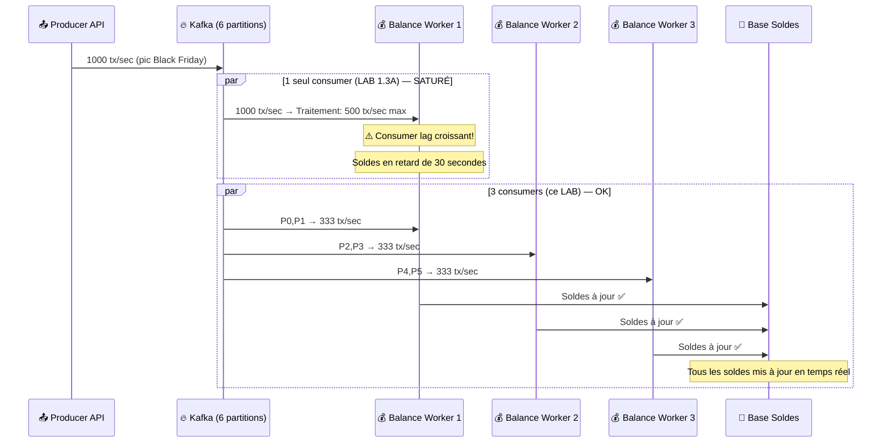
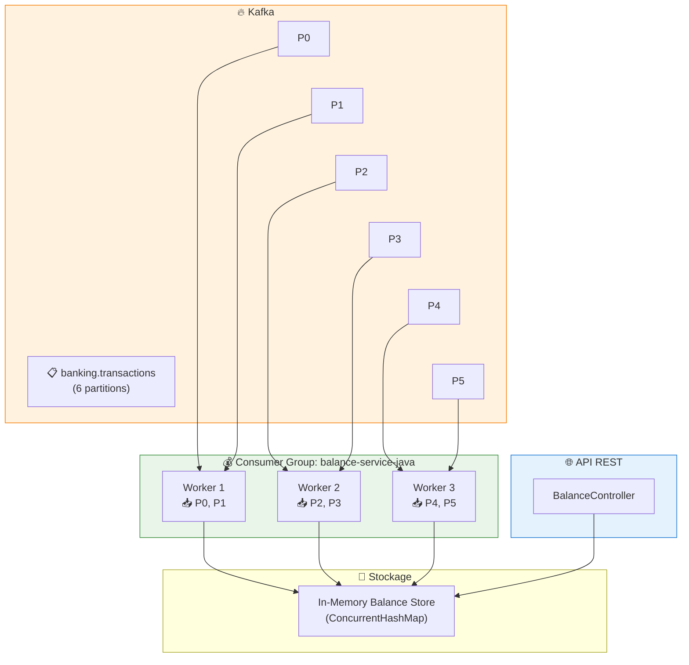
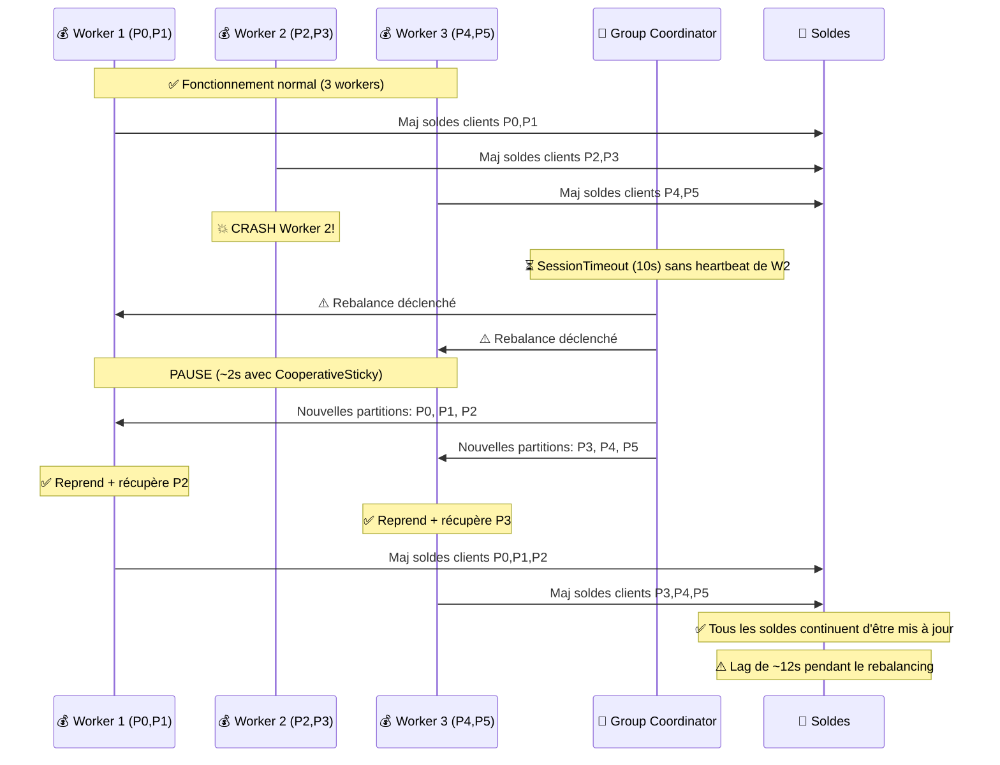
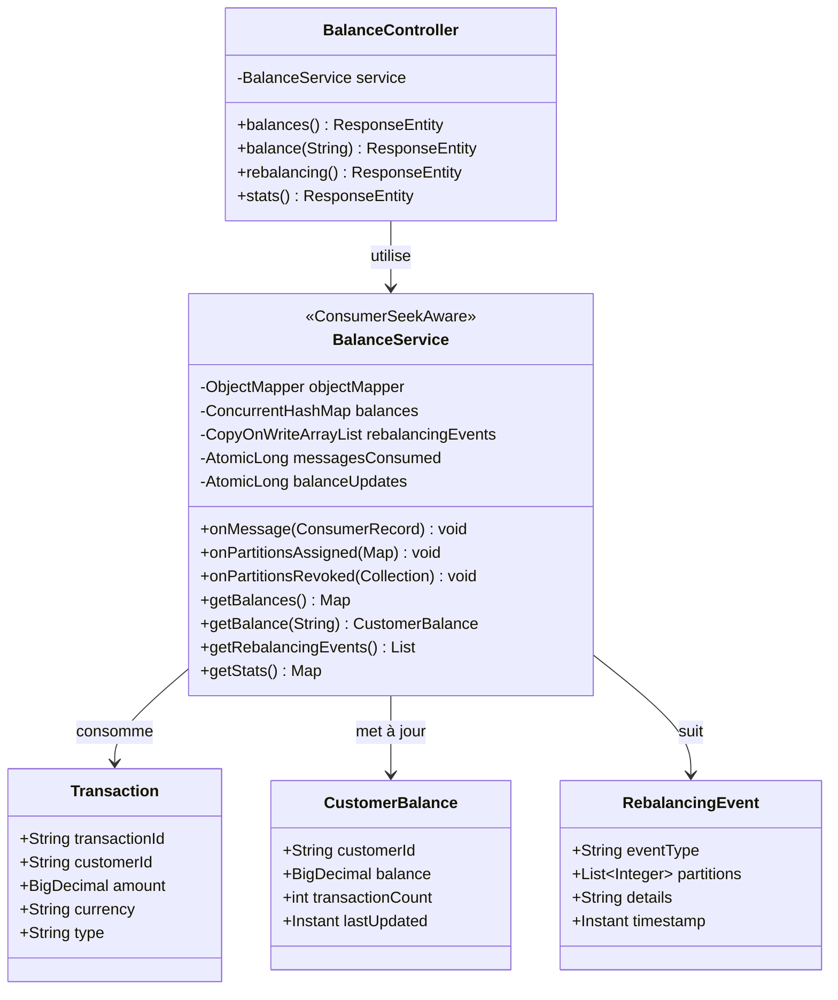
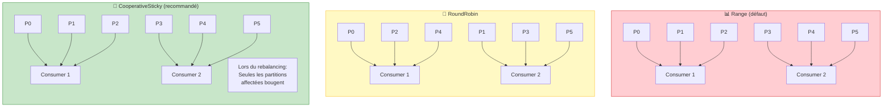
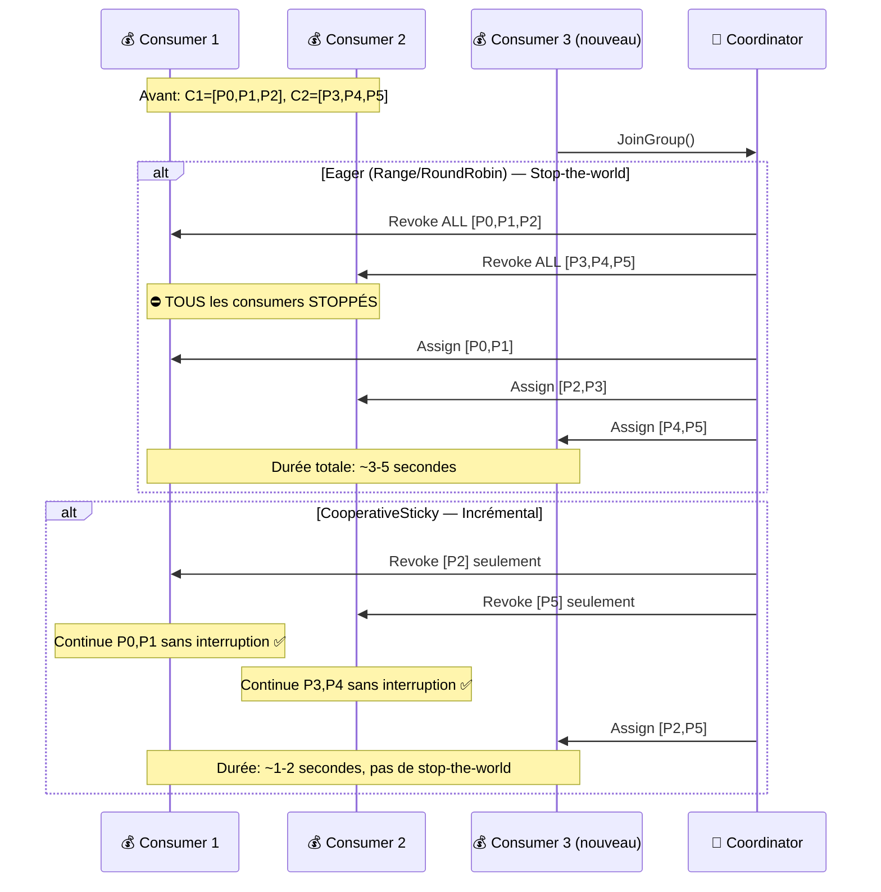
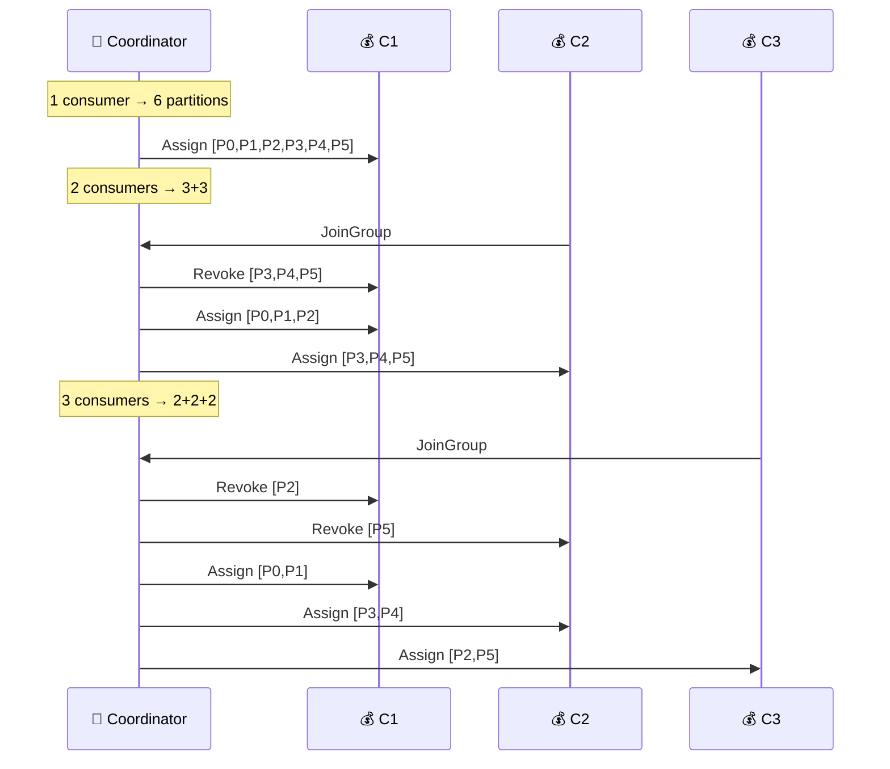

# LAB 1.3B (Java) : Consumer Group Scaling & Rebalancing — Calcul de Solde E-Banking

## ⏱️ Durée estimée : 60 minutes

## 🏦 Contexte E-Banking

Dans une banque, le **calcul de solde en temps réel** est l'un des services les plus sollicités. Chaque transaction (virement, paiement carte, retrait DAB) doit **mettre à jour le solde du client immédiatement**. Avec des millions de transactions par jour, un seul consumer ne suffit pas — il faut **scaler horizontalement** avec un Consumer Group.

### Pourquoi Scaler le Calcul de Solde ?



### Architecture : Consumer Group pour Calcul de Solde



### Séquence : Rebalancing lors d'un Crash



### Scénarios de Scaling E-Banking

| Scénario | Workers | Partitions/Worker | Throughput | Latence solde |
| -------- | ------- | ----------------- | ---------- | ------------- |
| **Jour normal** | 1 | 6 | 100 tx/sec | ~500ms |
| **Heure de pointe** | 3 | 2 | 300 tx/sec | ~200ms |
| **Black Friday** | 6 | 1 | 600 tx/sec | ~100ms |
| **Sur-capacité** | 8 | 1 (2 idle) | 600 tx/sec | ~100ms ⚠️ gaspillage |

---

## 🎯 Objectifs

À la fin de ce lab, vous serez capable de :

1. Comprendre le **Consumer Group** et le partage automatique des partitions
2. Observer le **rebalancing** en ajoutant/supprimant des consumers
3. Comparer les stratégies d'assignation (**RoundRobin**, **Range**, **CooperativeSticky**)
4. Identifier la **distribution optimale** (N consumers = N partitions)
5. Détecter les **consumers inactifs** (sur-capacité)
6. Mesurer l'**impact du rebalancing** sur le consumer lag

---

## 📦 Ce que vous allez construire

| Composant | Rôle |
| --------- | ---- |
| `Transaction.java` | Modèle partagé (identique au Module 02) |
| `CustomerBalance.java` | Modèle de solde client |
| `RebalancingEvent.java` | Modèle de suivi des événements de rebalancing |
| `BalanceService.java` | @KafkaListener avec ConsumerSeekAware pour le rebalancing |
| `BalanceController.java` | Endpoints REST : soldes, historique rebalancing, stats |
| `application.properties` | Configuration Kafka Consumer Group |

---

## 🏗️ Diagramme de Classes



---

## 🔧 Stratégies d'Assignation



### CooperativeSticky vs Eager Rebalancing



### Tableau Comparatif des Stratégies

| Critère | Range | RoundRobin | CooperativeSticky |
| ------- | ----- | ---------- | ----------------- |
| **Distribution** | Partitions consécutives | Circulaire équitable | Équitable + stable |
| **Rebalancing** | Stop-the-world | Stop-the-world | Incrémental |
| **Durée rebalance** | 3-5 sec | 3-5 sec | 1-2 sec |
| **Interruption** | Tous les consumers | Tous les consumers | Seulement les partitions affectées |
| **E-Banking** | ⚠️ Lag pendant rebalance | ⚠️ Lag pendant rebalance | ✅ Continuité maximale |
| **Recommandé** | Non | Pour tests | **Production** |

---

## 🚀 Prérequis

### LAB 1.3A complété

Ce lab étend le consumer du LAB 1.3A. Vous devez avoir compris le polling loop et l'auto-commit.

### Topic avec messages

Assurez-vous d'avoir des messages dans `banking.transactions` en utilisant le Producer du Module 02.

### JDK 17+ et Maven 3.9+

```bash
java -version   # Attendu : 17.x+
mvn -version    # Attendu : 3.9.x+
```

---

## 📝 Instructions Pas à Pas

### Étape 1 : Structure du projet

```text
java/
├── pom.xml
├── Dockerfile
├── .dockerignore
└── src/main/
    ├── resources/
    │   └── application.properties
    └── java/com/data2ai/kafka/consumer/balance/
        ├── BalanceConsumerApplication.java
        ├── model/
        │   ├── Transaction.java
        │   ├── CustomerBalance.java
        │   └── RebalancingEvent.java
        ├── service/
        │   └── BalanceService.java
        └── controller/
            └── BalanceController.java
```

### Étape 2 : Configuration de l'application (`application.properties`)

```properties
server.port=${SERVER_PORT:8080}

spring.application.name=lab-1-3b-balance-consumer

# Kafka
spring.kafka.bootstrap-servers=${KAFKA_BOOTSTRAP_SERVERS:localhost:9092}
app.kafka.topic=${KAFKA_TOPIC:banking.transactions}
app.kafka.group-id=${KAFKA_GROUP_ID:balance-service-java}

# Configuration Consumer Group (fonctionnalité clé de ce lab)
spring.kafka.consumer.group-id=${app.kafka.group-id}
spring.kafka.consumer.auto-offset-reset=earliest
spring.kafka.consumer.enable-auto-commit=true
spring.kafka.consumer.properties.auto.commit.interval.ms=5000

# Stratégie CooperativeSticky (rebalancing incrémental)
spring.kafka.consumer.properties.partition.assignment.strategy=\
  org.apache.kafka.clients.consumer.CooperativeStickyAssignor

# Concurrence : nombre de threads listener (simule plusieurs consumers)
spring.kafka.listener.concurrency=3

# Actuator
management.endpoints.web.exposure.include=health,info
management.endpoint.health.show-details=always
```

**Points de configuration clés :**

| Propriété | Valeur | Rôle |
| --------- | ------ | ---- |
| `partition.assignment.strategy` | `CooperativeStickyAssignor` | Rebalancing incrémental (pas de stop-the-world) |
| `listener.concurrency` | `3` | 3 threads listener = simule 3 consumers dans le groupe |
| `group-id` | `balance-service-java` | Toutes les instances partagent ce group ID |

### Étape 3 : Modèle Solde Client (`model/CustomerBalance.java`)

```java
package com.data2ai.kafka.consumer.balance.model;

import java.math.BigDecimal;
import java.time.Instant;

public class CustomerBalance {
    private String customerId;
    private BigDecimal balance = BigDecimal.ZERO;
    private int transactionCount;
    private Instant lastUpdated;

    // Constructeur, getters, setters
    // Mises à jour thread-safe via méthodes synchronisées dans le service
}
```

### Étape 4 : Modèle Événement de Rebalancing (`model/RebalancingEvent.java`)

```java
package com.data2ai.kafka.consumer.balance.model;

import java.time.Instant;
import java.util.List;

public class RebalancingEvent {
    private String eventType;       // "ASSIGNED" ou "REVOKED"
    private List<Integer> partitions;
    private String details;
    private Instant timestamp = Instant.now();

    // Constructeur, getters, setters
}
```

### Étape 5 : Service Balance avec Suivi du Rebalancing (`service/BalanceService.java`)

C'est le **cœur du lab** — implémente `ConsumerSeekAware` pour suivre l'assignation/révocation des partitions :

```java
@Service
public class BalanceService implements ConsumerSeekAware {

    private static final Logger log = LoggerFactory.getLogger(BalanceService.class);
    private final ObjectMapper objectMapper;

    // Stockage thread-safe
    private final ConcurrentHashMap<String, CustomerBalance> balances = new ConcurrentHashMap<>();
    private final CopyOnWriteArrayList<RebalancingEvent> rebalancingEvents = new CopyOnWriteArrayList<>();
    private final AtomicLong messagesConsumed = new AtomicLong();
    private final AtomicLong balanceUpdates = new AtomicLong();
    private final AtomicLong processingErrors = new AtomicLong();

    @KafkaListener(topics = "${app.kafka.topic}")
    public void onMessage(ConsumerRecord<String, String> record) {
        messagesConsumed.incrementAndGet();

        try {
            Transaction tx = objectMapper.readValue(record.value(), Transaction.class);

            // Mettre à jour le solde client (thread-safe via ConcurrentHashMap.compute)
            balances.compute(tx.getCustomerId(), (key, existing) -> {
                CustomerBalance bal = (existing != null) ? existing : new CustomerBalance();
                bal.setCustomerId(tx.getCustomerId());
                bal.setBalance(bal.getBalance().add(tx.getAmount()));
                bal.setTransactionCount(bal.getTransactionCount() + 1);
                bal.setLastUpdated(Instant.now());
                return bal;
            });

            balanceUpdates.incrementAndGet();

            log.info("💰 [P{}:O{}] {} | {} {} | Solde: {} | Nb tx: {}",
                    record.partition(), record.offset(),
                    tx.getCustomerId(), tx.getAmount(), tx.getCurrency(),
                    balances.get(tx.getCustomerId()).getBalance(),
                    balances.get(tx.getCustomerId()).getTransactionCount());

        } catch (Exception ex) {
            processingErrors.incrementAndGet();
            log.error("Erreur traitement P{}:O{}: {}", record.partition(), record.offset(), ex.getMessage());
        }
    }

    // --- ConsumerSeekAware : Callbacks de rebalancing ---

    @Override
    public void onPartitionsAssigned(Map<TopicPartition, Long> assignments,
                                     ConsumerSeekCallback callback) {
        List<Integer> partitions = assignments.keySet().stream()
                .map(TopicPartition::partition).sorted().toList();

        rebalancingEvents.add(new RebalancingEvent(
                "ASSIGNED", partitions,
                "Partitions assignées: " + partitions));

        log.info("✅ Partitions ASSIGNÉES: {}", partitions);
    }

    @Override
    public void onPartitionsRevoked(Collection<TopicPartition> partitions) {
        List<Integer> partitionIds = partitions.stream()
                .map(TopicPartition::partition).sorted().toList();

        rebalancingEvents.add(new RebalancingEvent(
                "REVOKED", partitionIds,
                "Partitions révoquées (rebalancing): " + partitionIds));

        log.warn("⚠️ Partitions RÉVOQUÉES: {} — Rebalancing en cours", partitionIds);
    }

    // --- Méthodes publiques pour l'API ---
    public Map<String, CustomerBalance> getBalances() { return new HashMap<>(balances); }
    public CustomerBalance getBalance(String customerId) { return balances.get(customerId); }
    public List<RebalancingEvent> getRebalancingEvents() { return List.copyOf(rebalancingEvents); }
    // getStats() retourne messagesConsumed, balanceUpdates, processingErrors, etc.
}
```

**Concepts clés démontrés :**

- **`ConsumerSeekAware`** — Interface Spring Kafka pour les callbacks de rebalancing (remplace `.NET SetPartitionsAssignedHandler`)
- **`ConcurrentHashMap.compute()`** — lecture-modification-écriture atomique pour les mises à jour thread-safe des soldes
- **`listener.concurrency=3`** — crée 3 threads consumer dans le même groupe, déclenchant la distribution des partitions
- **`CooperativeStickyAssignor`** — rebalancing incrémental sans pause stop-the-world

### Étape 6 : Contrôleur REST (`controller/BalanceController.java`)

```java
@RestController
@RequestMapping("/api/v1")
public class BalanceController {

    private final BalanceService service;

    public BalanceController(BalanceService service) {
        this.service = service;
    }

    @GetMapping("/balances")
    public ResponseEntity<Map<String, CustomerBalance>> balances() {
        return ResponseEntity.ok(service.getBalances());
    }

    @GetMapping("/balances/{customerId}")
    public ResponseEntity<?> balance(@PathVariable String customerId) {
        CustomerBalance bal = service.getBalance(customerId);
        if (bal == null) return ResponseEntity.notFound().build();
        return ResponseEntity.ok(bal);
    }

    @GetMapping("/rebalancing")
    public ResponseEntity<List<RebalancingEvent>> rebalancing() {
        return ResponseEntity.ok(service.getRebalancingEvents());
    }

    @GetMapping("/stats")
    public ResponseEntity<Map<String, Object>> stats() {
        return ResponseEntity.ok(service.getStats());
    }
}
```

---

## 🚀 Déploiement

### Développement Local

#### 1. Démarrer le Consumer

```bash
cd java
mvn spring-boot:run
```

#### 2. Observer les logs

```text
INFO  BalanceService : ✅ Partitions ASSIGNÉES: [0, 1]
INFO  BalanceService : ✅ Partitions ASSIGNÉES: [2, 3]
INFO  BalanceService : ✅ Partitions ASSIGNÉES: [4, 5]
INFO  BalanceService : 💰 [P2:O0] CUST-001 | 500.00 EUR | Solde: 500.00 | Nb tx: 1
INFO  BalanceService : 💰 [P5:O0] CUST-002 | 1200.00 EUR | Solde: 1200.00 | Nb tx: 1
```

> Avec `concurrency=3`, vous voyez 3 assignations de partitions séparées — chaque thread reçoit 2 partitions.

#### 3. Vérifier via l'API

- `GET http://localhost:8080/api/v1/balances` — Tous les soldes clients
- `GET http://localhost:8080/api/v1/balances/CUST-001` — Solde d'un client
- `GET http://localhost:8080/api/v1/rebalancing` — Historique des événements de rebalancing
- `GET http://localhost:8080/api/v1/stats` — Métriques du consumer
- `GET http://localhost:8080/actuator/health` — Health check

### Docker

```bash
cd java
docker build -t ebanking-balance-consumer-java .
docker run -p 8080:8080 \
  -e KAFKA_BOOTSTRAP_SERVERS=host.docker.internal:9092 \
  ebanking-balance-consumer-java
```

### OpenShift Sandbox — Option A : Build S2I Binaire

> **🎯 Objectif** : Ce déploiement valide les concepts de **Consumer Group et Rebalancing** dans un environnement cloud :
> - **Consumer Group** : plusieurs threads listener partagent la charge de consommation
> - **Partition Assignment** : chaque thread reçoit un sous-ensemble de partitions
> - **Rebalancing** : quand un consumer rejoint ou quitte le groupe, les partitions sont redistribuées
> - **Calcul de solde** : chaque transaction est agrégée pour calculer le solde par client
> - **CooperativeSticky** : rebalancing incrémental sans stop-the-world

#### 1. Build et Déploiement

```bash
cd module-03-consumer/lab-1.3b-consumer-group/java

# Créer le BuildConfig
oc new-build java:17 --binary=true --name=ebanking-balance-consumer-java

# Build depuis le source local
oc start-build ebanking-balance-consumer-java --from-dir=. --follow

# Déployer
oc new-app ebanking-balance-consumer-java
```

#### 2. Configurer les variables d'environnement

```bash
oc set env deployment/ebanking-balance-consumer-java \
  SERVER_PORT=8080 \
  KAFKA_BOOTSTRAP_SERVERS=kafka-svc:9092 \
  KAFKA_TOPIC=banking.transactions
```

#### 3. Créer la route Edge

```bash
oc create route edge ebanking-balance-consumer-java-secure \
  --service=ebanking-balance-consumer-java --port=8080-tcp
```

#### 4. Vérifier le déploiement

```bash
URL=$(oc get route ebanking-balance-consumer-java-secure -o jsonpath='{.spec.host}')

# Health check
curl -k "https://$URL/actuator/health"

# Soldes
curl -k -s "https://$URL/api/v1/balances"

# Historique rebalancing
curl -k -s "https://$URL/api/v1/rebalancing"

# Stats consumer
curl -k -s "https://$URL/api/v1/stats"
```

#### 5. ✅ Critères de succès

```bash
# Pod en cours d'exécution ?
oc get pod -l deployment=ebanking-balance-consumer-java
# Attendu : STATUS=Running, READY=1/1

# Consumer actif ?
curl -k -s "https://$URL/actuator/health"
# Attendu : {"status":"UP"}

# Événements de rebalancing enregistrés ?
curl -k -s "https://$URL/api/v1/rebalancing"
# Attendu : au moins un événement ASSIGNED avec la liste des partitions
```

#### 6. Test de Scaling (observer le rebalancing)

```bash
# Scaler à 2 réplicas
oc scale deployment/ebanking-balance-consumer-java --replicas=2

# Attendre le démarrage des pods
oc get pods -l deployment=ebanking-balance-consumer-java -w

# Vérifier les événements de rebalancing
curl -k -s "https://$URL/api/v1/rebalancing"
# Attendu : événements REVOKED + ASSIGNED montrant la redistribution des partitions

# Revenir à 1 réplica
oc scale deployment/ebanking-balance-consumer-java --replicas=1
```

#### 7. Script automatisé

```bash
# Bash
./scripts/bash/deploy-and-test-1.3b-java.sh

# PowerShell
.\scripts\powershell\deploy-and-test-1.3b-java.ps1
```

---

## 🧪 Tests

### Scénarios de test

```bash
URL=$(oc get route ebanking-balance-consumer-java-secure -o jsonpath='{.spec.host}')

# 1. Health check
curl -k -s "https://$URL/actuator/health"

# 2. Vérifier les soldes (soldes agrégés par client)
curl -k -s "https://$URL/api/v1/balances"

# 3. Vérifier le solde d'un client
curl -k -s "https://$URL/api/v1/balances/CUST-001"

# 4. Vérifier l'historique de rebalancing (événements ASSIGNED/REVOKED)
curl -k -s "https://$URL/api/v1/rebalancing"

# 5. Vérifier les stats du consumer
curl -k -s "https://$URL/api/v1/stats"
```

---

## 📋 Endpoints API

| Méthode | Endpoint | Description |
| ------- | -------- | ----------- |
| `GET` | `/api/v1/balances` | Tous les soldes clients |
| `GET` | `/api/v1/balances/{customerId}` | Solde d'un client spécifique |
| `GET` | `/api/v1/rebalancing` | Historique des événements de rebalancing |
| `GET` | `/api/v1/stats` | Métriques du consumer |
| `GET` | `/actuator/health` | Health check |

---

## 🎯 Concepts Clés Expliqués

### Spring Kafka vs Confluent.Kafka (.NET) — Consumer Groups

| Aspect | Java (Spring Kafka) | .NET (Confluent.Kafka) |
| ------ | ------------------- | ---------------------- |
| **Callbacks rebalancing** | Interface `ConsumerSeekAware` | `SetPartitionsAssignedHandler` / `SetPartitionsRevokedHandler` |
| **Concurrence** | `spring.kafka.listener.concurrency=3` | Exécuter plusieurs instances manuellement |
| **Stratégie d'assignation** | Propriété `partition.assignment.strategy` | Enum `PartitionAssignmentStrategy` |
| **Stockage soldes** | `ConcurrentHashMap.compute()` | `ConcurrentDictionary.AddOrUpdate()` |
| **Consumer ID** | Auto-généré par Spring Kafka | `ClientId` manuel dans `ConsumerConfig` |

### Scaling de 1 à 6 Consumers



---

## 🔧 Troubleshooting

| Symptôme | Cause probable | Solution |
| -------- | -------------- | -------- |
| Aucun événement de rebalancing | Un seul thread consumer | Augmenter `spring.kafka.listener.concurrency` ou scaler les réplicas |
| Soldes non mis à jour | Pas de messages dans le topic | Envoyer des transactions via l'API Producer |
| `messagesConsumed` reste à 0 | Mauvais bootstrap servers | Vérifier la variable `KAFKA_BOOTSTRAP_SERVERS` |
| Rebalancing trop long | Utilisation de Range/RoundRobin | Passer à `CooperativeStickyAssignor` |
| Certains clients manquants | Partition non assignée à cette instance | Vérifier `/api/v1/rebalancing` pour les assignations courantes |
| Pod CrashLoopBackOff | Variables d'env manquantes ou Kafka inaccessible | Vérifier : `oc set env deployment/ebanking-balance-consumer-java --list` |

---

## ✅ Validation

- [ ] Le consumer démarre et rejoint le consumer group
- [ ] Les partitions sont distribuées entre les threads listener
- [ ] Les événements de rebalancing sont suivis (ASSIGNED/REVOKED)
- [ ] Les soldes clients sont calculés correctement
- [ ] `/api/v1/balances` retourne les soldes agrégés par client
- [ ] `/api/v1/rebalancing` montre l'historique d'assignation des partitions
- [ ] `/api/v1/stats` montre `messagesConsumed > 0`
- [ ] La stratégie CooperativeSticky est active (rebalancing incrémental)
- [ ] Scaler les réplicas déclenche un rebalancing

---

## 🏁 Étape Suivante

Passez au **[LAB 1.3C (Java) : Consumer Audit — Manual Commit + DLQ](../../lab-1.3c-consumer-manual-commit/java/README.md)** pour apprendre le commit manuel des offsets, les garanties at-least-once et la Dead Letter Queue.
