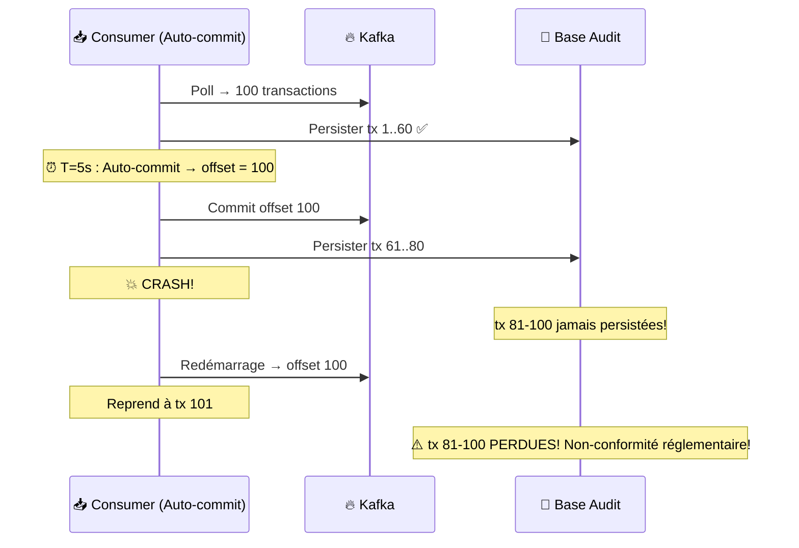
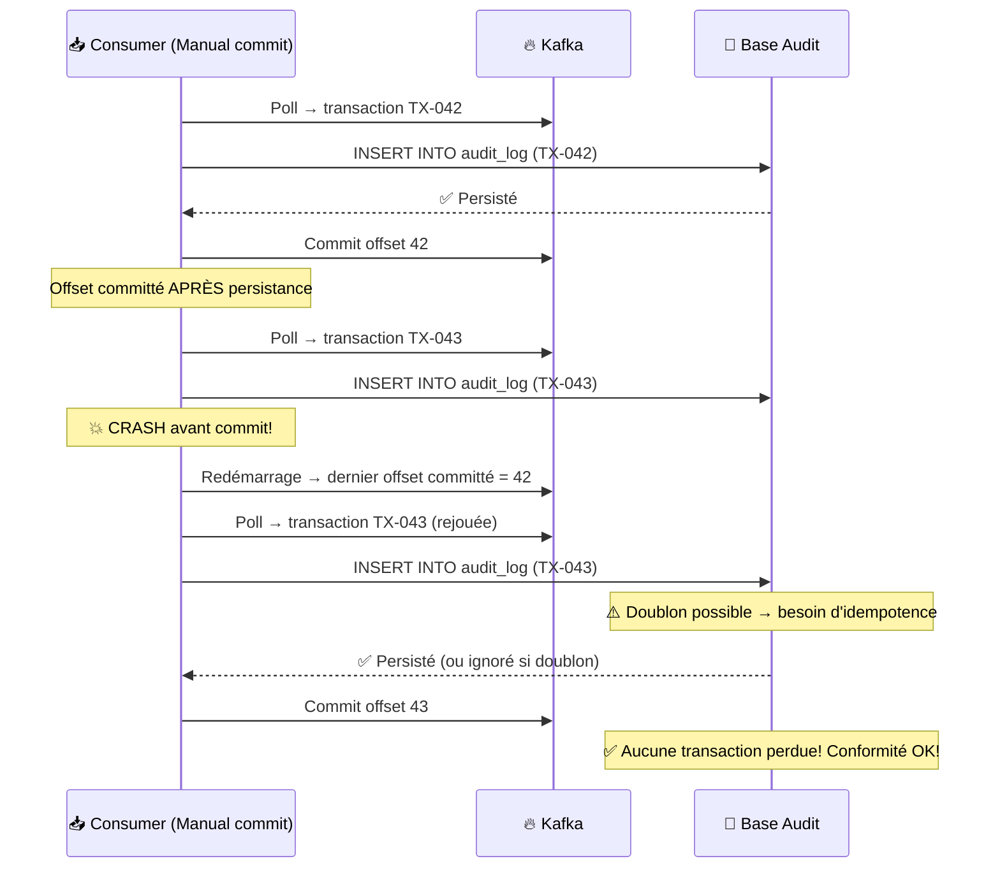
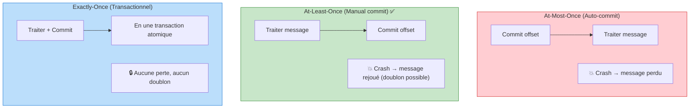
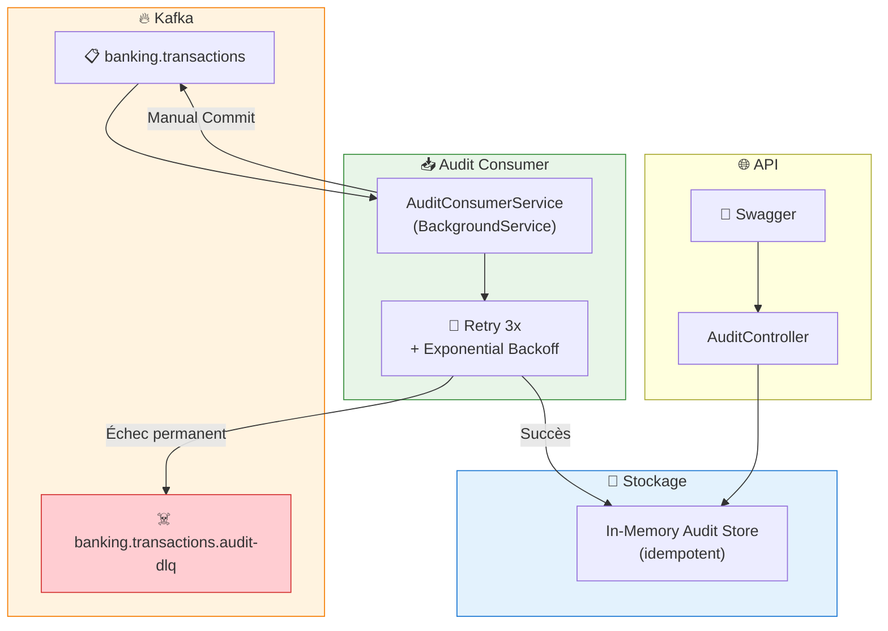
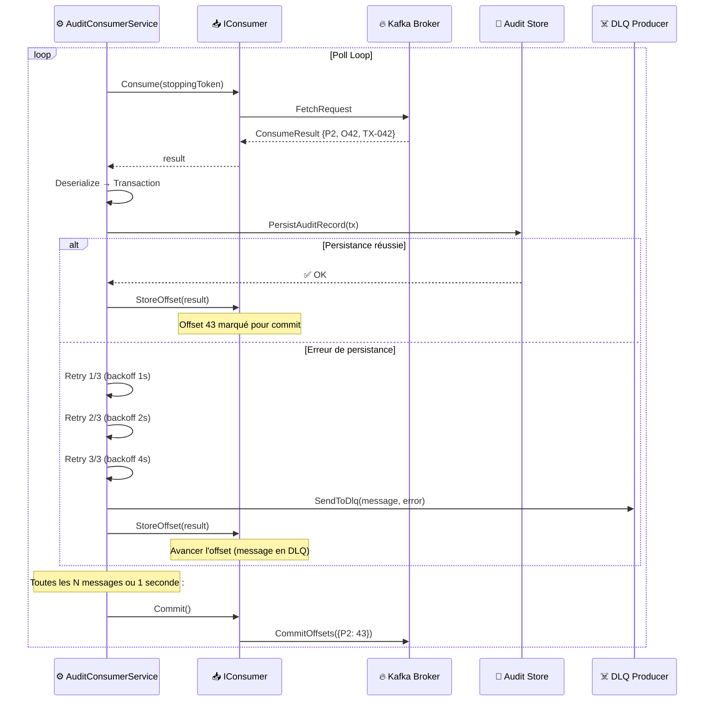
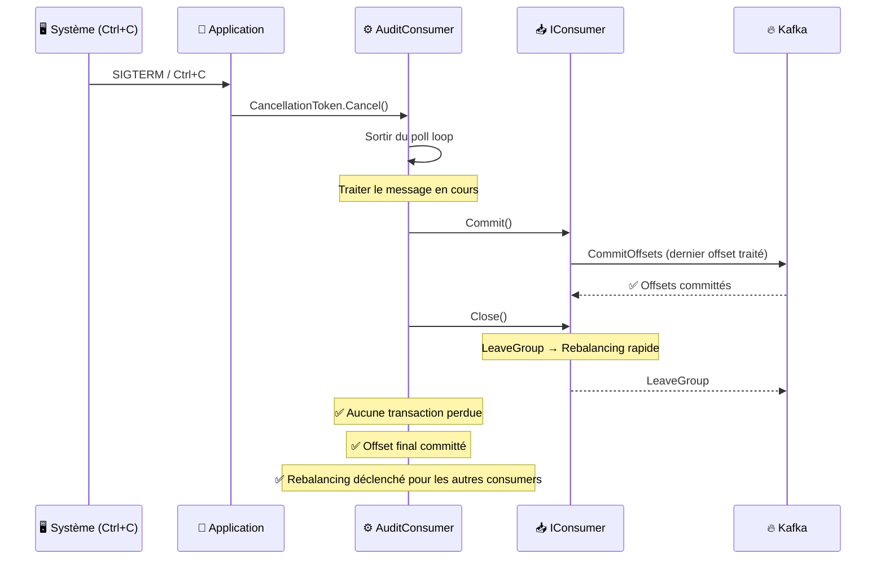
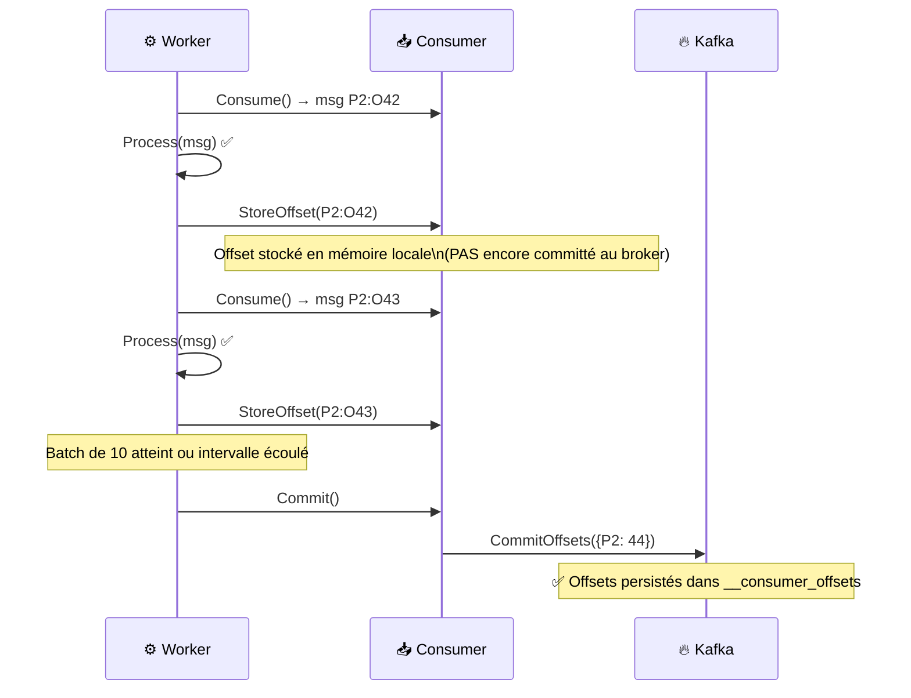
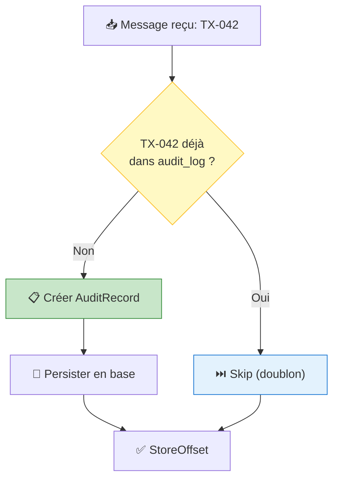

# LAB 1.3C : Consumer avec Manual Commit — Audit Réglementaire E-Banking

## ⏱️ Durée estimée : 45 minutes

## 🏦 Contexte E-Banking

Dans le secteur bancaire, la **conformité réglementaire** (Bâle III, RGPD, PSD2, AML) exige que **chaque transaction soit enregistrée** dans un journal d'audit. **Perdre une seule transaction** peut entraîner des sanctions de plusieurs millions d'euros. L'auto-commit du LAB 1.3A n'offre pas cette garantie — il faut un **commit manuel** qui ne valide l'offset qu'**après** la persistance réussie en base de données.

### Le Problème : Auto-Commit et Perte de Données



### La Solution : Manual Commit



### Garanties de Livraison : Comparaison



| Garantie | Perte possible ? | Doublon possible ? | Complexité | Cas d'usage E-Banking |
| -------- | ---------------- | ------------------ | ---------- | -------------------- |
| **At-most-once** | ✅ Oui | ❌ Non | Faible | Logs, analytics non-critiques |
| **At-least-once** | ❌ Non | ✅ Oui | Moyenne | **Audit, conformité** (ce lab) |
| **Exactly-once** | ❌ Non | ❌ Non | Élevée | Paiements, virements |

### Scénarios d'Audit Réglementaire

| Réglementation | Exigence | Impact d'une perte |
| -------------- | -------- | ------------------ |
| **Bâle III** | Traçabilité complète des transactions | Sanction financière |
| **PSD2** | Journalisation des paiements électroniques | Révocation de licence |
| **AML/KYC** | Suivi des transactions suspectes | Amende jusqu'à 10% du CA |
| **RGPD** | Droit d'accès aux données de paiement | Amende jusqu'à 4% du CA |
| **MiFID II** | Enregistrement des ordres financiers | Interdiction d'exercer |

---

## 🎯 Objectifs

À la fin de ce lab, vous serez capable de :

1. Implémenter le **manual commit** (`EnableAutoCommit = false`)
2. Comprendre la différence entre **at-most-once** et **at-least-once**
3. Utiliser `Commit()` et `StoreOffset()` pour un contrôle fin
4. Implémenter l'**idempotence côté consumer** (gérer les doublons)
5. Gérer le **graceful shutdown** avec commit final
6. Implémenter un **retry + DLQ** côté consumer pour les erreurs de traitement

---

## 📦 Ce que vous allez construire

| Composant | Rôle |
| --------- | ---- |
| `Transaction.cs` | Modèle partagé (identique au Module 02) |
| `AuditRecord.cs` | Modèle d'enregistrement d'audit |
| `AuditConsumerService.cs` | BackgroundService avec manual commit |
| `AuditController.cs` | Endpoints API : journal d'audit, métriques, DLQ |
| `Program.cs` | Configuration ASP.NET Core |
| `appsettings.json` | Configuration Kafka |

### Architecture des Composants



---

## 🔧 Ce que vous allez apprendre

### Séquence : Manual Commit (Code Expliqué)



### Séquence : Graceful Shutdown



---

## 🚀 Prérequis

### LABs 1.3A et 1.3B complétés

Ce lab étend les concepts des LABs précédents avec le manual commit.

### Topics Kafka

```bash
# Créer le topic DLQ pour l'audit
docker exec kafka /opt/kafka/bin/kafka-topics.sh \
  --bootstrap-server localhost:9092 \
  --create --if-not-exists \
  --topic banking.transactions.audit-dlq \
  --partitions 3 \
  --replication-factor 1
```

---

## 📝 Instructions Pas à Pas

### Étape 1 : Créer le projet API Web

#### Option VS Code

```bash
mkdir lab-1.3c-consumer-manual-commit
cd lab-1.3c-consumer-manual-commit
mkdir EBankingAuditAPI
cd EBankingAuditAPI
dotnet new webapi -n EBankingAuditAPI --framework net8.0
cd EBankingAuditAPI
dotnet add package Confluent.Kafka --version 2.3.0
dotnet add package Swashbuckle.AspNetCore --version 6.5.0
```

#### Option Visual Studio 2022

1. **Fichier** → **Nouveau** → **Projet**
2. Sélectionner **API Web ASP.NET Core**
3. Nom : `EBankingAuditAPI`, Framework : **.NET 8.0**
4. Clic droit projet → **Gérer les packages NuGet** :
   - `Confluent.Kafka` version **2.3.0**
   - `Swashbuckle.AspNetCore` version **6.5.0**

---

### Étape 2 : Créer les modèles

#### `Models/Transaction.cs`

Copiez le fichier `Transaction.cs` du LAB 1.3A.

#### `Models/AuditRecord.cs`

```csharp
namespace EBankingAuditAPI.Models;

public class AuditRecord
{
    public string AuditId { get; set; } = Guid.NewGuid().ToString();
    public string TransactionId { get; set; } = string.Empty;
    public string CustomerId { get; set; } = string.Empty;
    public decimal Amount { get; set; }
    public string Currency { get; set; } = "EUR";
    public string Type { get; set; } = string.Empty;
    public string FromAccount { get; set; } = string.Empty;
    public string ToAccount { get; set; } = string.Empty;
    public DateTime TransactionTimestamp { get; set; }
    public DateTime AuditTimestamp { get; set; } = DateTime.UtcNow;
    public string Status { get; set; } = "Recorded"; // Recorded, Failed, DLQ

    // Métadonnées Kafka
    public int KafkaPartition { get; set; }
    public long KafkaOffset { get; set; }
    public string ConsumerGroupId { get; set; } = string.Empty;

    // Traçabilité
    public int ProcessingAttempts { get; set; } = 1;
    public string? ErrorDetails { get; set; }
}

public class DlqMessage
{
    public string TransactionId { get; set; } = string.Empty;
    public string OriginalMessage { get; set; } = string.Empty;
    public string ErrorReason { get; set; } = string.Empty;
    public int Attempts { get; set; }
    public DateTime FailedAt { get; set; } = DateTime.UtcNow;
    public int OriginalPartition { get; set; }
    public long OriginalOffset { get; set; }
}

public class AuditMetrics
{
    public long MessagesConsumed { get; set; }
    public long AuditRecordsCreated { get; set; }
    public long DuplicatesSkipped { get; set; }
    public long ProcessingErrors { get; set; }
    public long MessagesSentToDlq { get; set; }
    public long ManualCommits { get; set; }
    public string ConsumerStatus { get; set; } = "Unknown";
    public string GroupId { get; set; } = string.Empty;
    public Dictionary<int, long> CommittedOffsets { get; set; } = new();
    public DateTime StartedAt { get; set; }
    public DateTime LastCommitAt { get; set; }
    public DateTime LastMessageAt { get; set; }
}
```

---

### Étape 3 : Créer le service Consumer avec Manual Commit

#### `Services/AuditConsumerService.cs`

```csharp
using System.Collections.Concurrent;
using System.Text;
using System.Text.Json;
using Confluent.Kafka;
using EBankingAuditAPI.Models;

namespace EBankingAuditAPI.Services;

public class AuditConsumerService : BackgroundService
{
    private readonly ILogger<AuditConsumerService> _logger;
    private readonly IConfiguration _configuration;

    // Audit store (in-memory, idempotent par TransactionId)
    private readonly ConcurrentDictionary<string, AuditRecord> _auditLog = new();
    private readonly ConcurrentBag<DlqMessage> _dlqMessages = new();
    private readonly ConcurrentDictionary<int, long> _committedOffsets = new();

    // Métriques
    private long _messagesConsumed;
    private long _auditRecords;
    private long _duplicatesSkipped;
    private long _processingErrors;
    private long _dlqCount;
    private long _manualCommits;
    private DateTime _startedAt;
    private DateTime _lastCommitAt;
    private DateTime _lastMessageAt;
    private string _status = "Starting";

    // DLQ Producer
    private IProducer<string, string>? _dlqProducer;

    // Commit batching
    private const int CommitBatchSize = 10;
    private int _uncommittedCount;

    public AuditConsumerService(
        ILogger<AuditConsumerService> logger,
        IConfiguration configuration)
    {
        _logger = logger;
        _configuration = configuration;
    }

    protected override async Task ExecuteAsync(CancellationToken stoppingToken)
    {
        _startedAt = DateTime.UtcNow;
        _status = "Running";

        var bootstrapServers = _configuration["Kafka:BootstrapServers"] ?? "localhost:9092";

        var config = new ConsumerConfig
        {
            BootstrapServers = bootstrapServers,
            GroupId = _configuration["Kafka:GroupId"] ?? "audit-compliance-service",
            ClientId = $"audit-worker-{Environment.MachineName}-{Guid.NewGuid().ToString()[..8]}",
            AutoOffsetReset = AutoOffsetReset.Earliest,

            // *** MANUAL COMMIT : clé de ce lab ***
            EnableAutoCommit = false,

            SessionTimeoutMs = 10000,
            HeartbeatIntervalMs = 3000,
            MaxPollIntervalMs = 300000,
            PartitionAssignmentStrategy = PartitionAssignmentStrategy.CooperativeSticky
        };

        var topic = _configuration["Kafka:Topic"] ?? "banking.transactions";
        var dlqTopic = _configuration["Kafka:DlqTopic"] ?? "banking.transactions.audit-dlq";

        // Créer le DLQ producer
        _dlqProducer = new ProducerBuilder<string, string>(new ProducerConfig
        {
            BootstrapServers = bootstrapServers,
            ClientId = "audit-dlq-producer",
            Acks = Acks.All
        }).Build();

        _logger.LogInformation(
            "🚀 Starting Audit Consumer. Group: {Group}, Topic: {Topic}, ManualCommit: ENABLED",
            config.GroupId, topic);

        using var consumer = new ConsumerBuilder<string, string>(config)
            .SetErrorHandler((_, e) =>
            {
                _logger.LogError("Consumer error: {Code} - {Reason}", e.Code, e.Reason);
                if (e.IsFatal) _status = "Fatal Error";
            })
            .SetPartitionsAssignedHandler((c, partitions) =>
            {
                _logger.LogInformation("✅ Partitions assigned: [{Partitions}]",
                    string.Join(", ", partitions.Select(p => p.Partition.Value)));
                _status = "Consuming";
            })
            .SetPartitionsRevokedHandler((c, partitions) =>
            {
                // IMPORTANT : Commit avant que les partitions soient révoquées
                _logger.LogWarning("⚠️ Partitions revoked: [{Partitions}] — Committing offsets before revocation",
                    string.Join(", ", partitions.Select(p => p.Partition.Value)));
                try
                {
                    c.Commit();
                    Interlocked.Increment(ref _manualCommits);
                    _lastCommitAt = DateTime.UtcNow;
                    _logger.LogInformation("✅ Offsets committed before revocation");
                }
                catch (Exception ex)
                {
                    _logger.LogError(ex, "Failed to commit offsets during revocation");
                }
                _status = "Rebalancing";
            })
            .SetPartitionsLostHandler((c, partitions) =>
            {
                _logger.LogError("❌ Partitions lost: [{Partitions}] — Offsets may not be committed",
                    string.Join(", ", partitions.Select(p => p.Partition.Value)));
                _status = "Partitions Lost";
            })
            .Build();

        consumer.Subscribe(topic);

        try
        {
            while (!stoppingToken.IsCancellationRequested)
            {
                try
                {
                    var consumeResult = consumer.Consume(stoppingToken);
                    if (consumeResult == null) continue;

                    var success = await ProcessWithRetryAsync(consumeResult, dlqTopic);

                    // Stocker l'offset pour commit (que le traitement ait réussi ou envoyé en DLQ)
                    consumer.StoreOffset(consumeResult);
                    _uncommittedCount++;

                    // Commit par batch ou par intervalle
                    if (_uncommittedCount >= CommitBatchSize)
                    {
                        consumer.Commit();
                        Interlocked.Increment(ref _manualCommits);
                        _lastCommitAt = DateTime.UtcNow;
                        _committedOffsets[consumeResult.Partition.Value] = consumeResult.Offset.Value;
                        _uncommittedCount = 0;

                        _logger.LogDebug("💾 Manual commit: P{Partition}:O{Offset} ({Batch} messages)",
                            consumeResult.Partition.Value, consumeResult.Offset.Value, CommitBatchSize);
                    }
                }
                catch (ConsumeException ex)
                {
                    _logger.LogError(ex, "Consume error: {Reason}", ex.Error.Reason);
                    Interlocked.Increment(ref _processingErrors);
                }
            }
        }
        catch (OperationCanceledException)
        {
            _logger.LogInformation("Consumer shutdown requested");
        }
        finally
        {
            // GRACEFUL SHUTDOWN : commit final avant fermeture
            _logger.LogInformation("🛑 Graceful shutdown: committing final offsets...");
            try
            {
                consumer.Commit();
                Interlocked.Increment(ref _manualCommits);
                _lastCommitAt = DateTime.UtcNow;
                _logger.LogInformation("✅ Final offsets committed successfully");
            }
            catch (Exception ex)
            {
                _logger.LogError(ex, "Failed to commit final offsets");
            }

            _status = "Stopped";
            consumer.Close();
            _dlqProducer?.Dispose();
            _logger.LogInformation("Consumer closed gracefully. Total commits: {Commits}", _manualCommits);
        }
    }

    private async Task<bool> ProcessWithRetryAsync(
        ConsumeResult<string, string> result,
        string dlqTopic,
        int maxRetries = 3)
    {
        Interlocked.Increment(ref _messagesConsumed);
        _lastMessageAt = DateTime.UtcNow;

        for (int attempt = 1; attempt <= maxRetries; attempt++)
        {
            try
            {
                var transaction = JsonSerializer.Deserialize<Transaction>(result.Message.Value);
                if (transaction == null)
                {
                    _logger.LogWarning("Failed to deserialize message at P{Partition}:O{Offset}",
                        result.Partition.Value, result.Offset.Value);
                    await SendToDlqAsync(result, dlqTopic, "Deserialization failed", attempt);
                    return false;
                }

                // IDEMPOTENCE : vérifier si déjà traité
                if (_auditLog.ContainsKey(transaction.TransactionId))
                {
                    Interlocked.Increment(ref _duplicatesSkipped);
                    _logger.LogInformation(
                        "⏭️ Duplicate skipped: {TxId} (already in audit log) | P{Partition}:O{Offset}",
                        transaction.TransactionId, result.Partition.Value, result.Offset.Value);
                    return true;
                }

                // Créer l'enregistrement d'audit
                var auditRecord = new AuditRecord
                {
                    TransactionId = transaction.TransactionId,
                    CustomerId = transaction.CustomerId,
                    Amount = transaction.Amount,
                    Currency = transaction.Currency,
                    Type = transaction.Type,
                    FromAccount = transaction.FromAccount,
                    ToAccount = transaction.ToAccount,
                    TransactionTimestamp = transaction.Timestamp,
                    KafkaPartition = result.Partition.Value,
                    KafkaOffset = result.Offset.Value,
                    ConsumerGroupId = _configuration["Kafka:GroupId"] ?? "audit-compliance-service",
                    ProcessingAttempts = attempt
                };

                // Persister (in-memory, simule une écriture en base)
                _auditLog[transaction.TransactionId] = auditRecord;
                Interlocked.Increment(ref _auditRecords);

                _logger.LogInformation(
                    "📋 Audit recorded: {TxId} | {Customer} | {Amount}{Currency} | {Type} | P{Partition}:O{Offset} | Attempt {Attempt}",
                    transaction.TransactionId, transaction.CustomerId,
                    transaction.Amount, transaction.Currency, transaction.Type,
                    result.Partition.Value, result.Offset.Value, attempt);

                // Simuler persistance en base (peut échouer)
                await Task.Delay(30);
                return true;
            }
            catch (Exception ex)
            {
                _logger.LogWarning(ex,
                    "Processing attempt {Attempt}/{Max} failed for P{Partition}:O{Offset}",
                    attempt, maxRetries, result.Partition.Value, result.Offset.Value);

                if (attempt < maxRetries)
                {
                    var delay = TimeSpan.FromSeconds(Math.Pow(2, attempt - 1));
                    _logger.LogInformation("⏳ Retrying in {Delay}s...", delay.TotalSeconds);
                    await Task.Delay(delay);
                }
                else
                {
                    Interlocked.Increment(ref _processingErrors);
                    await SendToDlqAsync(result, dlqTopic, ex.Message, attempt);
                    return false;
                }
            }
        }
        return false;
    }

    private async Task SendToDlqAsync(
        ConsumeResult<string, string> failedMessage,
        string dlqTopic,
        string errorReason,
        int attempts)
    {
        if (_dlqProducer == null) return;

        try
        {
            var dlqMessage = new Message<string, string>
            {
                Key = failedMessage.Message.Key,
                Value = failedMessage.Message.Value,
                Headers = new Headers
                {
                    { "original-topic", Encoding.UTF8.GetBytes("banking.transactions") },
                    { "original-partition", Encoding.UTF8.GetBytes(failedMessage.Partition.Value.ToString()) },
                    { "original-offset", Encoding.UTF8.GetBytes(failedMessage.Offset.Value.ToString()) },
                    { "error-reason", Encoding.UTF8.GetBytes(errorReason) },
                    { "attempts", Encoding.UTF8.GetBytes(attempts.ToString()) },
                    { "consumer-group", Encoding.UTF8.GetBytes(_configuration["Kafka:GroupId"] ?? "") },
                    { "failed-at", Encoding.UTF8.GetBytes(DateTime.UtcNow.ToString("o")) }
                }
            };

            await _dlqProducer.ProduceAsync(dlqTopic, dlqMessage);
            Interlocked.Increment(ref _dlqCount);

            _dlqMessages.Add(new DlqMessage
            {
                TransactionId = failedMessage.Message.Key ?? "unknown",
                OriginalMessage = failedMessage.Message.Value,
                ErrorReason = errorReason,
                Attempts = attempts,
                OriginalPartition = failedMessage.Partition.Value,
                OriginalOffset = failedMessage.Offset.Value
            });

            _logger.LogWarning(
                "☠️ Sent to DLQ: Key={Key} | P{Partition}:O{Offset} | Reason: {Reason}",
                failedMessage.Message.Key, failedMessage.Partition.Value,
                failedMessage.Offset.Value, errorReason);
        }
        catch (Exception ex)
        {
            _logger.LogError(ex, "Failed to send message to DLQ");
        }
    }

    // Méthodes publiques pour l'API
    public IReadOnlyList<AuditRecord> GetAuditLog() =>
        _auditLog.Values.OrderByDescending(a => a.AuditTimestamp).ToList().AsReadOnly();

    public AuditRecord? GetAuditRecord(string transactionId) =>
        _auditLog.GetValueOrDefault(transactionId);

    public IReadOnlyList<DlqMessage> GetDlqMessages() =>
        _dlqMessages.ToList().AsReadOnly();

    public AuditMetrics GetMetrics() => new()
    {
        MessagesConsumed = Interlocked.Read(ref _messagesConsumed),
        AuditRecordsCreated = Interlocked.Read(ref _auditRecords),
        DuplicatesSkipped = Interlocked.Read(ref _duplicatesSkipped),
        ProcessingErrors = Interlocked.Read(ref _processingErrors),
        MessagesSentToDlq = Interlocked.Read(ref _dlqCount),
        ManualCommits = Interlocked.Read(ref _manualCommits),
        ConsumerStatus = _status,
        GroupId = _configuration["Kafka:GroupId"] ?? "audit-compliance-service",
        CommittedOffsets = new Dictionary<int, long>(_committedOffsets),
        StartedAt = _startedAt,
        LastCommitAt = _lastCommitAt,
        LastMessageAt = _lastMessageAt
    };
}
```

---

### Étape 4 : Créer le contrôleur API

#### `Controllers/AuditController.cs`

```csharp
using Microsoft.AspNetCore.Mvc;
using EBankingAuditAPI.Services;

namespace EBankingAuditAPI.Controllers;

[ApiController]
[Route("api/[controller]")]
public class AuditController : ControllerBase
{
    private readonly AuditConsumerService _consumerService;
    private readonly ILogger<AuditController> _logger;

    public AuditController(
        AuditConsumerService consumerService,
        ILogger<AuditController> logger)
    {
        _consumerService = consumerService;
        _logger = logger;
    }

    /// <summary>
    /// Journal d'audit complet (toutes les transactions enregistrées)
    /// </summary>
    [HttpGet("log")]
    [ProducesResponseType(StatusCodes.Status200OK)]
    public IActionResult GetAuditLog()
    {
        var records = _consumerService.GetAuditLog();
        return Ok(new
        {
            count = records.Count,
            records
        });
    }

    /// <summary>
    /// Rechercher un enregistrement d'audit par TransactionId
    /// </summary>
    [HttpGet("log/{transactionId}")]
    [ProducesResponseType(StatusCodes.Status200OK)]
    [ProducesResponseType(StatusCodes.Status404NotFound)]
    public IActionResult GetAuditRecord(string transactionId)
    {
        var record = _consumerService.GetAuditRecord(transactionId);
        if (record == null)
            return NotFound(new { error = $"Transaction {transactionId} not found in audit log" });

        return Ok(record);
    }

    /// <summary>
    /// Messages envoyés en Dead Letter Queue (transactions échouées)
    /// </summary>
    [HttpGet("dlq")]
    [ProducesResponseType(StatusCodes.Status200OK)]
    public IActionResult GetDlqMessages()
    {
        var messages = _consumerService.GetDlqMessages();
        return Ok(new
        {
            count = messages.Count,
            messages
        });
    }

    /// <summary>
    /// Métriques du consumer : commits, doublons, DLQ, offsets
    /// </summary>
    [HttpGet("metrics")]
    [ProducesResponseType(StatusCodes.Status200OK)]
    public IActionResult GetMetrics()
    {
        return Ok(_consumerService.GetMetrics());
    }

    /// <summary>
    /// Health check incluant le nombre de commits manuels
    /// </summary>
    [HttpGet("health")]
    [ProducesResponseType(StatusCodes.Status200OK)]
    [ProducesResponseType(StatusCodes.Status503ServiceUnavailable)]
    public IActionResult GetHealth()
    {
        var metrics = _consumerService.GetMetrics();
        var isHealthy = metrics.ConsumerStatus == "Consuming" ||
                        metrics.ConsumerStatus == "Running";

        var health = new
        {
            status = isHealthy ? "Healthy" : "Degraded",
            consumerStatus = metrics.ConsumerStatus,
            messagesConsumed = metrics.MessagesConsumed,
            auditRecords = metrics.AuditRecordsCreated,
            manualCommits = metrics.ManualCommits,
            duplicatesSkipped = metrics.DuplicatesSkipped,
            dlqMessages = metrics.MessagesSentToDlq,
            lastCommitAt = metrics.LastCommitAt,
            uptime = DateTime.UtcNow - metrics.StartedAt
        };

        return isHealthy ? Ok(health) : StatusCode(503, health);
    }
}
```

---

### Étape 5 : Configurer l'application

#### `appsettings.json`

```json
{
  "Logging": {
    "LogLevel": {
      "Default": "Information",
      "Microsoft.AspNetCore": "Warning",
      "EBankingAuditAPI": "Information"
    }
  },
  "Kafka": {
    "BootstrapServers": "localhost:9092",
    "GroupId": "audit-compliance-service",
    "Topic": "banking.transactions",
    "DlqTopic": "banking.transactions.audit-dlq"
  },
  "AllowedHosts": "*"
}
```

#### `Program.cs`

```csharp
using EBankingAuditAPI.Services;

var builder = WebApplication.CreateBuilder(args);

builder.Services.AddSingleton<AuditConsumerService>();
builder.Services.AddHostedService(sp => sp.GetRequiredService<AuditConsumerService>());

builder.Services.AddControllers();
builder.Services.AddEndpointsApiExplorer();
builder.Services.AddSwaggerGen(c =>
{
    c.SwaggerDoc("v1", new()
    {
        Title = "E-Banking Audit & Compliance API",
        Version = "v1",
        Description = "Consumer Kafka avec manual commit pour l'audit réglementaire des transactions bancaires (at-least-once)"
    });
});

var app = builder.Build();

app.UseSwagger();
app.UseSwaggerUI(c =>
{
    c.SwaggerEndpoint("/swagger/v1/swagger.json", "Audit API v1");
    c.RoutePrefix = "swagger";
});

app.MapControllers();

app.Run();
```

#### `EBankingAuditAPI.csproj`

```xml
<Project Sdk="Microsoft.NET.Sdk.Web">
  <PropertyGroup>
    <TargetFramework>net8.0</TargetFramework>
    <Nullable>enable</Nullable>
    <ImplicitUsings>enable</ImplicitUsings>
  </PropertyGroup>
  <ItemGroup>
    <PackageReference Include="Confluent.Kafka" Version="2.3.0" />
    <PackageReference Include="Swashbuckle.AspNetCore" Version="6.5.0" />
  </ItemGroup>
</Project>
```

---

### Étape 6 : Exécuter et tester

#### 1. Créer le topic DLQ

```bash
docker exec kafka /opt/kafka/bin/kafka-topics.sh \
  --bootstrap-server localhost:9092 \
  --create --if-not-exists \
  --topic banking.transactions.audit-dlq \
  --partitions 3 \
  --replication-factor 1
```

#### 2. Démarrer le Consumer

```bash
cd EBankingAuditAPI
dotnet run
```

#### 3. Observer les logs

```text
🚀 Starting Audit Consumer. Group: audit-compliance-service, Topic: banking.transactions, ManualCommit: ENABLED
✅ Partitions assigned: [0, 1, 2, 3, 4, 5]
📋 Audit recorded: TX-001 | CUST-001 | 500EUR | Transfer | P2:O0 | Attempt 1
📋 Audit recorded: TX-002 | CUST-002 | 15000EUR | InternationalTransfer | P5:O0 | Attempt 1
💾 Manual commit: P5:O1 (10 messages)
```

#### 4. Tester l'idempotence

Réinitialisez les offsets du consumer group pour retraiter les messages :

```bash
# Arrêter le consumer d'abord, puis :
docker exec kafka /opt/kafka/bin/kafka-consumer-groups.sh \
  --bootstrap-server localhost:9092 \
  --group audit-compliance-service \
  --topic banking.transactions \
  --reset-offsets --to-earliest \
  --execute
```

Redémarrez le consumer et observez :

```text
⏭️ Duplicate skipped: TX-001 (already in audit log) | P2:O0
⏭️ Duplicate skipped: TX-002 (already in audit log) | P5:O0
```

#### 5. Tester via Swagger

Ouvrez `https://localhost:5020/swagger` :

- **GET /api/audit/log** → Journal d'audit complet
- **GET /api/audit/log/{transactionId}** → Recherche par ID
- **GET /api/audit/dlq** → Messages en Dead Letter Queue
- **GET /api/audit/metrics** → Métriques (commits, doublons, DLQ)
- **GET /api/audit/health** → État de santé

---

## 🎯 Concepts Clés Expliqués

### Manual Commit : `StoreOffset()` vs `Commit()`



| Méthode | Quand l'utiliser | Impact réseau |
| ------- | ---------------- | ------------- |
| `StoreOffset()` | Après chaque message traité | Aucun (mémoire locale) |
| `Commit()` | Périodiquement (batch ou timer) | 1 requête réseau au broker |
| `Commit(offsets)` | Commit d'offsets spécifiques | 1 requête réseau ciblée |

### Idempotence : Gérer les Doublons



> **En production** : utilisez une contrainte `UNIQUE` sur `TransactionId` en base de données, ou un cache distribué (Redis) pour la déduplication.

### Comparaison des 3 LABs

| Aspect | LAB 1.3A (Fraude) | LAB 1.3B (Solde) | LAB 1.3C (Audit) |
| ------ | ----------------- | ----------------- | ----------------- |
| **Commit** | Auto | Auto | **Manual** |
| **Garantie** | At-most-once | At-most-once | **At-least-once** |
| **Perte possible** | ⚠️ Oui | ⚠️ Oui | ✅ Non |
| **Doublon possible** | ❌ Non | ❌ Non | ⚠️ Oui (géré par idempotence) |
| **DLQ** | Non | Non | **Oui** |
| **Idempotence** | Non nécessaire | Non nécessaire | **Oui (par TransactionId)** |
| **Graceful shutdown** | consumer.Close() | consumer.Close() | **Commit() + Close()** |
| **Cas d'usage** | Détection fraude | Calcul solde | **Audit réglementaire** |

---

## ☁️ Alternative : Déploiement sur OpenShift Sandbox

> **🎯 Objectif** : Ce déploiement valide les patterns avancés du **Consumer Kafka** dans un environnement cloud :
> - **Manual Commit** : les offsets sont commités explicitement après traitement réussi (at-least-once)
> - **Déduplication** : les messages déjà traités sont détectés et ignorés (exactly-once sémantique)
> - **Dead Letter Queue (DLQ)** : les messages impossibles à traiter sont redirigés vers un topic DLQ
> - **Retry avec backoff** : les erreurs transitoires sont retentées avant envoi en DLQ
> - **Vérification via Kafka CLI** : inspecter les offsets commités et le contenu de la DLQ

Si vous utilisez l'environnement **OpenShift Sandbox**, suivez ces étapes pour déployer et exposer votre Consumer publiquement.

### 1. Créer les Topics

```bash
oc exec kafka-0 -- /opt/kafka/bin/kafka-topics.sh --bootstrap-server localhost:9092 --create --if-not-exists --topic banking.transactions.audit-dlq --partitions 3 --replication-factor 3
```

### 2. Préparer le Build et le Déploiement

```bash
# Se placer dans le dossier du projet
cd EBankingAuditAPI

# Créer une build binaire pour .NET
oc new-build dotnet:8.0-ubi8 --binary=true --name=ebanking-audit-api

# Lancer la build en envoyant le dossier courant
oc start-build ebanking-audit-api --from-dir=. --follow

# Créer l'application
oc new-app ebanking-audit-api
```

### 3. Configurer les variables d'environnement

```bash
oc set env deployment/ebanking-audit-api \
  Kafka__BootstrapServers=kafka-svc:9092 \
  Kafka__GroupId=audit-compliance-service \
  Kafka__Topic=banking.transactions \
  Kafka__DlqTopic=banking.transactions.audit-dlq \
  ASPNETCORE_URLS=http://0.0.0.0:8080 \
  ASPNETCORE_ENVIRONMENT=Development
```

### 4. Exposer publiquement (Secure Edge Route)

> [!IMPORTANT]
> Standard routes may hang on the Sandbox. Use an **edge route** for reliable public access.

```bash
oc create route edge ebanking-audit-api-secure --service=ebanking-audit-api --port=8080-tcp
```

### Stability Warning

For Sandbox environments, use `Acks = Acks.Leader` and `EnableIdempotence = false` in any `ProducerConfig` (including the DLQ producer) to avoid `Coordinator load in progress` hangs.

### 5. Tester l'API déployée

```bash
# Obtenir l'URL publique
URL=$(oc get route ebanking-audit-api-secure -o jsonpath='{.spec.host}')
echo "https://$URL/swagger"

# Tester le Health Check
curl -k -i "https://$URL/api/Audit/health"

# Voir les métriques (commits manuels, doublons, DLQ)
curl -k -s "https://$URL/api/Audit/metrics"

# Voir le journal d'audit
curl -k -s "https://$URL/api/Audit/log"

# Voir les messages en DLQ
curl -k -s "https://$URL/api/Audit/dlq"
```

### 6. 🧪 Validation complète (Sandbox / CRC)

```bash
URL=$(oc get route ebanking-audit-api-secure -o jsonpath='{.spec.host}')
PRODUCER_URL=$(oc get route ebanking-producer-api-secure -o jsonpath='{.spec.host}')

# 1. Health check
curl -k -s "https://$URL/api/Audit/health" | jq .

# 2. Send test transactions via Producer API
curl -k -s -X POST "https://$PRODUCER_URL/api/Transactions" \
  -H "Content-Type: application/json" \
  -d '{"fromAccount":"FR7630001000111111","toAccount":"FR7630001000222222","amount":250.00,"currency":"EUR","type":1,"description":"Audit test transfer 1","customerId":"CUST-AUDIT-001"}' | jq .

curl -k -s -X POST "https://$PRODUCER_URL/api/Transactions" \
  -H "Content-Type: application/json" \
  -d '{"fromAccount":"FR7630001000333333","toAccount":"FR7630001000444444","amount":1500.00,"currency":"EUR","type":1,"description":"Audit test transfer 2","customerId":"CUST-AUDIT-002"}' | jq .

# 3. Wait for consumer to process and manual commit
sleep 8

# 4. Check audit log (each transaction recorded with full traceability)
curl -k -s "https://$URL/api/Audit/log" | jq .
# Expected: records with auditId, transactionId, status="Recorded", processingAttempts=1

# 5. Lookup individual audit record by transactionId
TX_ID=$(curl -k -s "https://$URL/api/Audit/log" | jq -r '.records[0].transactionId')
curl -k -s "https://$URL/api/Audit/log/$TX_ID" | jq .

# 6. Check metrics (manual commits, duplicates, DLQ)
curl -k -s "https://$URL/api/Audit/metrics" | jq .
# Expected: manualCommits > 0, EnableAutoCommit=false confirmed

# 7. Check DLQ messages
curl -k -s "https://$URL/api/Audit/dlq" | jq .

# 8. Verify committed offsets via Kafka CLI
oc exec kafka-0 -- /opt/kafka/bin/kafka-consumer-groups.sh \
  --bootstrap-server localhost:9092 \
  --describe --group audit-compliance-service
```

**📖 Key Concepts**:
- Manual commit: offset committed only AFTER successful persistence (at-least-once)
- Duplicate detection: same transactionId → `duplicatesSkipped` increments
- DLQ: failed processing → message sent to `banking.transactions.audit-dlq`

### 6.1 Automated Testing Script

```powershell
# Run the full deployment and test script
cd day-01-foundations/scripts
./deploy-and-test-1.3c.ps1
```

#### Scénario avancé : Vérifier les offsets commités et la DLQ

```bash
# Vérifier les offsets commités pour le groupe audit-compliance-service
oc exec kafka-0 -- /opt/kafka/bin/kafka-consumer-groups.sh \
  --bootstrap-server localhost:9092 \
  --describe --group audit-compliance-service

# Vérifier les messages dans la DLQ
oc exec kafka-0 -- /opt/kafka/bin/kafka-console-consumer.sh \
  --bootstrap-server localhost:9092 \
  --topic banking.transactions.audit-dlq \
  --from-beginning --property print.headers=true --max-messages 5

# Voir les messages DLQ via l'API
curl -k -s "https://$URL/api/Audit/dlq" | jq .
```

#### Scénario 4 : Vérifier les métriques complètes

```bash
curl -k -s "https://$URL/api/Audit/metrics" | jq .
```

**Réponse attendue** :

```json
{
  "consumerStatus": "Consuming",
  "messagesConsumed": 3,
  "auditRecordsCreated": 1,
  "manualCommits": 2,
  "duplicatesSkipped": 1,
  "messagesSentToDlq": 0,
  "lastCommitAt": "2026-02-08T22:05:00Z"
}
```

#### 📖 Concepts validés

| Concept | Comment le vérifier |
| ------- | ------------------- |
| Manual Commit | `manualCommits` augmente après chaque batch traité |
| At-least-once | `kafka-consumer-groups.sh --describe` montre les offsets commités |
| Déduplication | `duplicatesSkipped` augmente quand on renvoie le même `transactionId` |
| DLQ | `GET /dlq` montre les messages impossibles à traiter |
| Audit log | `GET /log/{transactionId}` retrouve l'enregistrement par ID |

#### Récapitulatif des Endpoints

| Méthode | Endpoint | Objectif pédagogique |
| ------- | -------- | -------------------- |
| `GET` | `/api/Audit/log` | Journal d'audit complet |
| `GET` | `/api/Audit/log/{transactionId}` | Rechercher un enregistrement par ID |
| `GET` | `/api/Audit/dlq` | Messages envoyés en Dead Letter Queue |
| `GET` | `/api/Audit/metrics` | Commits manuels, doublons, DLQ |
| `GET` | `/api/Audit/health` | Health check avec compteur de commits |

---

## 🖥️ Déploiement Local OpenShift (CRC / OpenShift Local)

Si vous disposez d'un cluster **OpenShift Local** (anciennement CRC — CodeReady Containers), vous pouvez déployer l'API directement depuis votre machine.

### 1. Prérequis

```bash
# Vérifier que le cluster est démarré
crc status

# Se connecter au cluster
oc login -u developer https://api.crc.testing:6443
oc project ebanking-labs
```

### 2. Créer le topic DLQ

```bash
oc exec kafka-0 -- /opt/kafka/bin/kafka-topics.sh \
  --bootstrap-server localhost:9092 \
  --create --if-not-exists \
  --topic banking.transactions.audit-dlq \
  --partitions 3 --replication-factor 3
```

### 3. Build et Déploiement (Binary Build)

```bash
cd EBankingAuditAPI

# Créer la build config et lancer le build
oc new-build dotnet:8.0-ubi8 --binary=true --name=ebanking-audit-api
oc start-build ebanking-audit-api --from-dir=. --follow

# Créer l'application
oc new-app ebanking-audit-api
```

### 4. Configurer les variables d'environnement

```bash
oc set env deployment/ebanking-audit-api \
  Kafka__BootstrapServers=kafka-svc:9092 \
  Kafka__GroupId=audit-compliance-service \
  Kafka__Topic=banking.transactions \
  Kafka__DlqTopic=banking.transactions.audit-dlq \
  ASPNETCORE_URLS=http://0.0.0.0:8080 \
  ASPNETCORE_ENVIRONMENT=Development
```

### 5. Exposer et tester

```bash
# Créer une route edge
oc create route edge ebanking-audit-api-secure --service=ebanking-audit-api --port=8080-tcp

# Obtenir l'URL
URL=$(oc get route ebanking-audit-api-secure -o jsonpath='{.spec.host}')
echo "https://$URL/swagger"

# Tester
curl -k -i "https://$URL/api/Audit/health"
curl -k -s "https://$URL/api/Audit/metrics"
curl -k -s "https://$URL/api/Audit/log"
```

### 6. 🧪 Validation des concepts (CRC)

```bash
URL=$(oc get route ebanking-audit-api-secure -o jsonpath='{.spec.host}')

# Produire une transaction via Kafka CLI
oc exec kafka-0 -- /opt/kafka/bin/kafka-console-producer.sh \
  --broker-list localhost:9092 \
  --topic banking.transactions <<< \
  '{"transactionId":"CRC-AUDIT-001","fromAccount":"FR7630001000123456789","toAccount":"FR7630001000987654321","amount":2500.00,"currency":"EUR","type":1,"description":"Test CRC audit","customerId":"CUST-001","timestamp":"2026-02-08T22:00:00Z","riskScore":0,"status":1}'

# Vérifier le journal d'audit
sleep 3
curl -k -s "https://$URL/api/Audit/log/CRC-AUDIT-001" | jq .
curl -k -s "https://$URL/api/Audit/metrics" | jq '{manualCommits, duplicatesSkipped, messagesSentToDlq}'

# Vérifier les offsets commitiés
oc exec kafka-0 -- /opt/kafka/bin/kafka-consumer-groups.sh \
  --bootstrap-server localhost:9092 --describe --group audit-compliance-service

# Vérifier la DLQ
oc exec kafka-0 -- /opt/kafka/bin/kafka-console-consumer.sh \
  --bootstrap-server localhost:9092 --topic banking.transactions.audit-dlq \
  --from-beginning --property print.headers=true --max-messages 5
```

### 7. Alternative : Déploiement par manifeste YAML

```bash
sed "s/\${NAMESPACE}/ebanking-labs/g" deployment/openshift-deployment.yaml | oc apply -f -
```

---

## ☸️ Déploiement Kubernetes / OKD (K3s, K8s, OKD)

Pour un cluster **Kubernetes standard** (K3s, K8s, Minikube) ou **OKD**, utilisez les manifestes YAML fournis dans le dossier `deployment/`.

### 1. Construire l'image Docker

```bash
cd EBankingAuditAPI

# Build de l'image
docker build -t ebanking-audit-api:latest .

# Pour un registry distant (adapter l'URL du registry)
docker tag ebanking-audit-api:latest <registry>/ebanking-audit-api:latest
docker push <registry>/ebanking-audit-api:latest
```

> **K3s / Minikube** : Si vous utilisez un cluster local, l'image locale suffit avec `imagePullPolicy: IfNotPresent`.

### 2. Créer le topic DLQ

```bash
# Si Kafka est déployé via Strimzi
kubectl run kafka-cli -it --rm --image=quay.io/strimzi/kafka:latest-kafka-4.0.0 \
  --command -- /opt/kafka/bin/kafka-topics.sh \
  --bootstrap-server kafka-svc:9092 \
  --create --if-not-exists \
  --topic banking.transactions.audit-dlq \
  --partitions 3 --replication-factor 3
```

### 3. Déployer les manifestes

```bash
# Appliquer le Deployment + Service + Ingress
kubectl apply -f deployment/k8s-deployment.yaml

# Vérifier le déploiement
kubectl get pods -l app=ebanking-audit-api
kubectl get svc ebanking-audit-api
```

### 4. Configurer le Kafka Bootstrap (si différent)

```bash
# Adapter l'adresse Kafka selon votre cluster (Strimzi, Confluent, etc.)
kubectl set env deployment/ebanking-audit-api \
  Kafka__BootstrapServers=<kafka-bootstrap>:9092
```

### 5. Accéder à l'API

```bash
# Port-forward pour accès local
kubectl port-forward svc/ebanking-audit-api 8080:8080

# Tester
curl http://localhost:8080/api/Audit/health
curl http://localhost:8080/api/Audit/metrics
curl http://localhost:8080/api/Audit/log
curl http://localhost:8080/api/Audit/dlq
```

> **Ingress** : Si vous avez un Ingress Controller (nginx, traefik), ajoutez `ebanking-audit-api.local` à votre fichier `/etc/hosts` pointant vers l'IP du cluster.

### 6. 🧪 Validation des concepts (K8s)

```bash
# Produire une transaction via Kafka CLI
kubectl exec kafka-0 -- /opt/kafka/bin/kafka-console-producer.sh \
  --broker-list localhost:9092 \
  --topic banking.transactions <<< \
  '{"transactionId":"K8S-AUDIT-001","fromAccount":"FR7630001000123456789","toAccount":"FR7630001000987654321","amount":2500.00,"currency":"EUR","type":1,"description":"Test K8s audit","customerId":"CUST-001","timestamp":"2026-02-08T22:00:00Z","riskScore":0,"status":1}'

# Vérifier le journal d'audit (port-forward actif sur 8080)
sleep 3
curl -s "http://localhost:8080/api/Audit/log/K8S-AUDIT-001" | jq .
curl -s "http://localhost:8080/api/Audit/metrics" | jq '{manualCommits, duplicatesSkipped, messagesSentToDlq}'

# Tester la déduplication — renvoyer le même message
kubectl exec kafka-0 -- /opt/kafka/bin/kafka-console-producer.sh \
  --broker-list localhost:9092 \
  --topic banking.transactions <<< \
  '{"transactionId":"K8S-AUDIT-001","fromAccount":"FR7630001000123456789","toAccount":"FR7630001000987654321","amount":2500.00,"currency":"EUR","type":1,"description":"Test K8s audit","customerId":"CUST-001","timestamp":"2026-02-08T22:00:00Z","riskScore":0,"status":1}'

sleep 3
curl -s "http://localhost:8080/api/Audit/metrics" | jq '{duplicatesSkipped}'

# Vérifier les offsets commitiés
kubectl exec kafka-0 -- /opt/kafka/bin/kafka-consumer-groups.sh \
  --bootstrap-server localhost:9092 --describe --group audit-compliance-service

# Vérifier la DLQ
kubectl exec kafka-0 -- /opt/kafka/bin/kafka-console-consumer.sh \
  --bootstrap-server localhost:9092 --topic banking.transactions.audit-dlq \
  --from-beginning --property print.headers=true --max-messages 5
```

> **Docker Compose** : Si Kafka tourne via Docker Compose, utilisez `docker exec kafka ...` au lieu de `kubectl exec kafka-0 ...`.

### 7. OKD : Utiliser les manifestes OpenShift

```bash
sed "s/\${NAMESPACE}/$(oc project -q)/g" deployment/openshift-deployment.yaml | oc apply -f -
```

---

## 🏋️ Exercices Pratiques

### Exercice 1 : Commit par intervalle de temps

Modifiez le service pour committer toutes les **2 secondes** au lieu de tous les 10 messages. Utilisez un `Stopwatch` pour mesurer le temps écoulé.

### Exercice 2 : Commit par partition

Implémentez `Commit(IEnumerable<TopicPartitionOffset>)` pour committer des offsets spécifiques par partition, au lieu de committer tous les offsets d'un coup.

### Exercice 3 : Simuler une erreur de persistance

Ajoutez une logique qui fait échouer aléatoirement 10% des persistances (simuler une panne de base de données). Vérifiez que le retry fonctionne et que les messages non traitables arrivent en DLQ.

### Exercice 4 : Vérifier la non-perte

1. Envoyez 100 transactions via le Producer (Module 02)
2. Démarrez le consumer, attendez qu'il traite ~50 messages
3. Tuez brutalement le consumer (kill -9 ou Task Manager)
4. Redémarrez le consumer
5. Vérifiez que le journal d'audit contient **exactement 100** enregistrements (avec doublons possibles gérés par idempotence)

---

## 🔧 Troubleshooting

| Symptom | Probable Cause | Solution |
| ------- | -------------- | -------- |
| Consumer status `Rebalancing` permanently | Kafka coordinator unstable or `Coordinator load in progress` | Wait 30s. If persists, delete the pod: `oc delete pod -l deployment=ebanking-audit-api`. Use `Acks = Acks.Leader` for DLQ producer on Sandbox |
| Health returns 503 | Consumer not yet assigned partitions | Wait 10-15s for partition assignment. Check Kafka pods health |
| `manualCommits` stays at 0 | No messages consumed or commit failed | Send transactions via Producer API. Check consumer logs: `oc logs -l deployment=ebanking-audit-api` |
| `messagesConsumed` > `auditRecordsCreated` | Duplicates detected and skipped | This is expected behavior — check `duplicatesSkipped` counter in metrics |
| DLQ messages appearing | Processing failures after 3 retries | Check `dlq` endpoint for error details. Verify transaction JSON format |
| Audit log empty | Consumer on wrong partition or no data | Verify topic has messages. Check consumer group offset: `oc exec kafka-0 -- /opt/kafka/bin/kafka-consumer-groups.sh --bootstrap-server localhost:9092 --describe --group audit-compliance-service` |
| `committedOffsets` empty in metrics | Consumer hasn't committed yet | Send transactions, wait 8-10s for processing + manual commit cycle |
| Pod CrashLoopBackOff | Missing env vars or Kafka DNS error | Check: `oc set env deployment/ebanking-audit-api --list` and verify `Kafka__BootstrapServers=kafka-svc:9092` |
| Swagger not accessible | Wrong `ASPNETCORE_URLS` | Set: `oc set env deployment/ebanking-audit-api ASPNETCORE_URLS=http://0.0.0.0:8080` |
| `Coordinator load in progress` in logs | Sandbox Kafka idempotent producer issue | Set DLQ producer to `Acks = Acks.Leader` and `EnableIdempotence = false` |

### Tips for Sandbox

- **Resource quota**: The Sandbox limits total replicas. Scale down unused deployments: `oc scale deployment/<name> --replicas=0`
- **Edge routes**: Always use `oc create route edge` on Sandbox (standard routes may hang)
- **Manual commit timing**: Unlike auto-commit (Lab 1.3a), manual commit happens only after successful processing. Allow 8-10s for the full cycle
- **Idempotence testing**: Send the same transaction twice (same `transactionId`) — `duplicatesSkipped` should increment while `auditRecordsCreated` stays the same
- **DLQ producer on Sandbox**: Use `Acks.Leader` instead of `Acks.All` to avoid `Coordinator load in progress` hangs
- **Pod restart**: If consumer stops consuming after Kafka restart, delete the pod: `oc delete pod -l deployment=ebanking-audit-api`
- **Consumer group reset**: To re-read all messages: `oc exec kafka-0 -- /opt/kafka/bin/kafka-consumer-groups.sh --bootstrap-server localhost:9092 --group audit-compliance-service --reset-offsets --to-earliest --topic banking.transactions --execute`
- **DLQ inspection**: `oc exec kafka-0 -- /opt/kafka/bin/kafka-console-consumer.sh --bootstrap-server localhost:9092 --topic banking.transactions.audit-dlq --from-beginning --property print.headers=true --max-messages 5`

---

## ✅ Validation

- [ ] `EnableAutoCommit = false` dans la config
- [ ] Les offsets sont committés **après** le traitement réussi
- [ ] Le graceful shutdown (Ctrl+C) commit les offsets finaux
- [ ] Le rebalancing commit les offsets avant la révocation des partitions
- [ ] Les doublons sont détectés et ignorés (idempotence par TransactionId)
- [ ] Les messages en erreur sont envoyés en DLQ après 3 retries
- [ ] Les métriques montrent le nombre de commits manuels
- [ ] Un reset des offsets + redémarrage ne crée pas de doublons dans l'audit

---

## 🔑 Points à Retenir

| Concept | Ce qu'il faut retenir |
| ------- | -------------------- |
| **Manual commit** | `EnableAutoCommit = false` + `Commit()` explicite après traitement |
| **StoreOffset + Commit** | `StoreOffset()` = mémoire locale, `Commit()` = envoi au broker |
| **At-least-once** | Aucune perte, mais doublons possibles → idempotence obligatoire |
| **Idempotence** | Vérifier par `TransactionId` avant d'écrire (UNIQUE constraint en prod) |
| **Graceful shutdown** | Toujours `Commit()` dans le `finally` avant `Close()` |
| **Revocation handler** | Committer les offsets dans `SetPartitionsRevokedHandler` |
| **DLQ consumer** | Messages non traitables → DLQ avec headers d'erreur pour retraitement |
| **Commit batching** | Committer tous les N messages (pas à chaque message = trop de réseau) |

---

## 🏁 Récapitulatif du Module 03

Vous avez maintenant maîtrisé les 3 patterns fondamentaux de consommation Kafka en contexte e-banking :

1. **LAB 1.3A** : Consumer basique avec auto-commit → Détection de fraude en temps réel
2. **LAB 1.3B** : Consumer Group avec scaling horizontal → Calcul de solde distribué
3. **LAB 1.3C** : Manual commit avec idempotence → Audit réglementaire (aucune perte)

Ces 3 consumers consomment les **mêmes messages** produits par le Module 02, chacun dans son propre **Consumer Group**, démontrant le pattern multi-consumer de Kafka.

👉 Retour au **[Module 03 — Overview](../README.md)**
