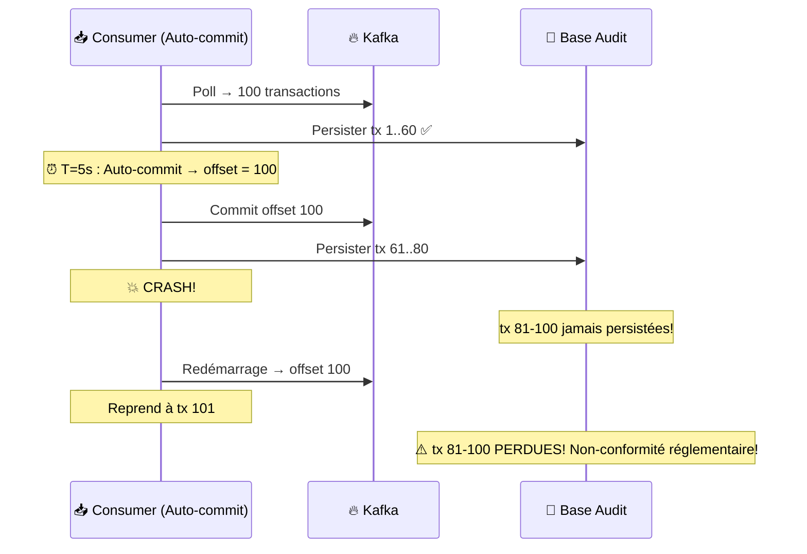
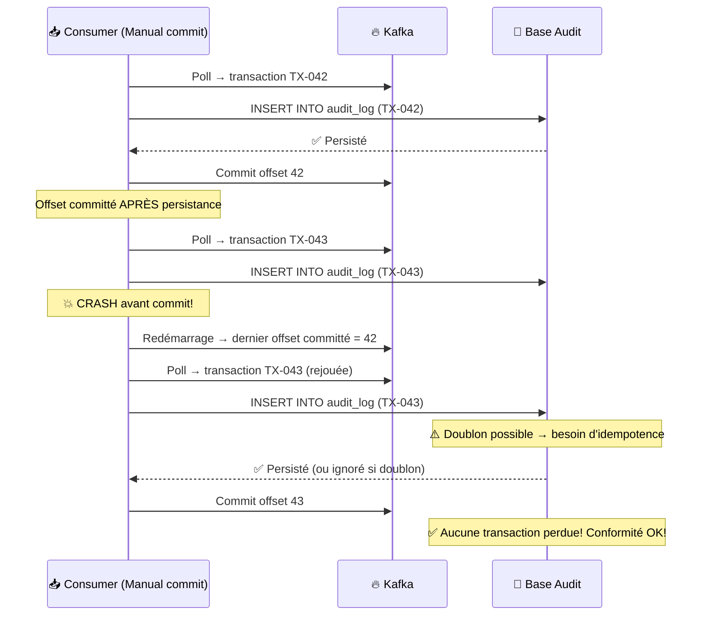
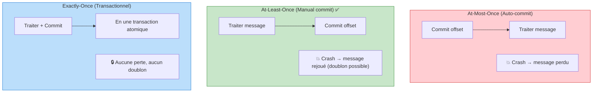
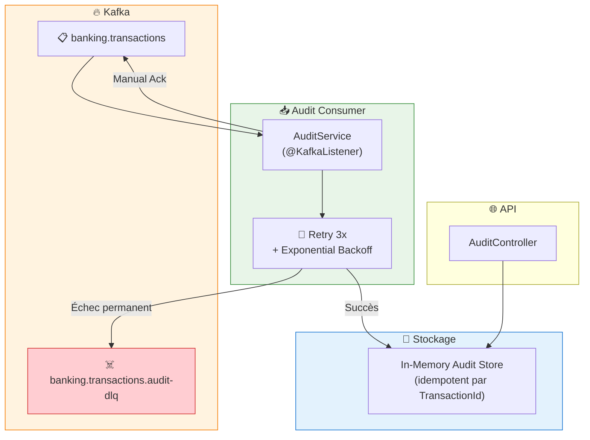
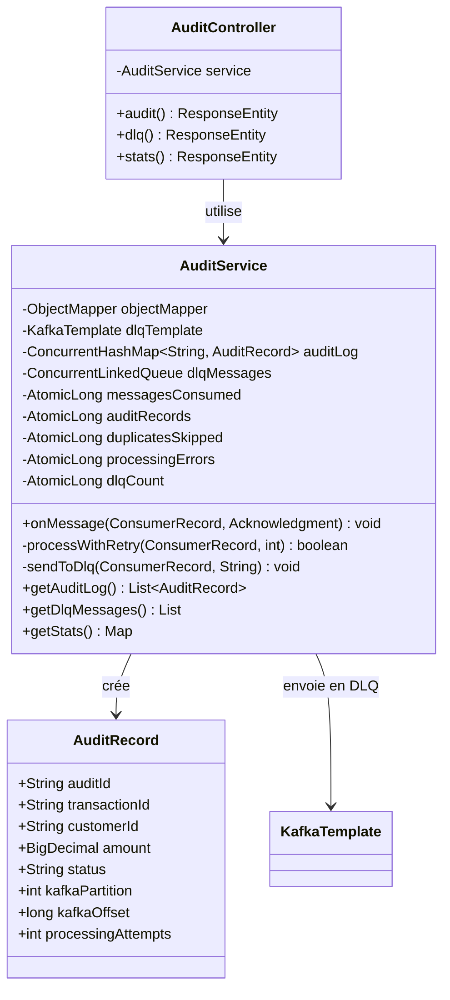
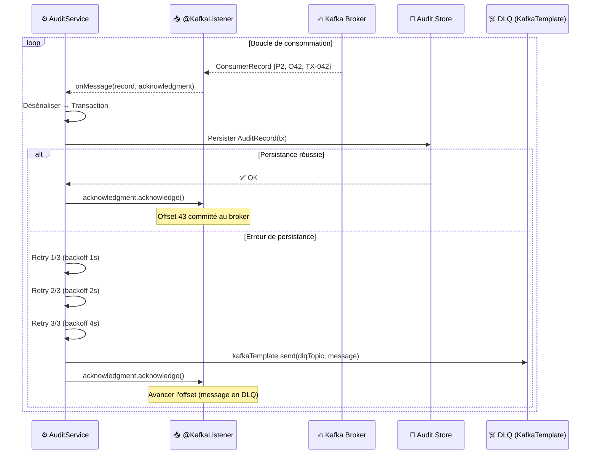
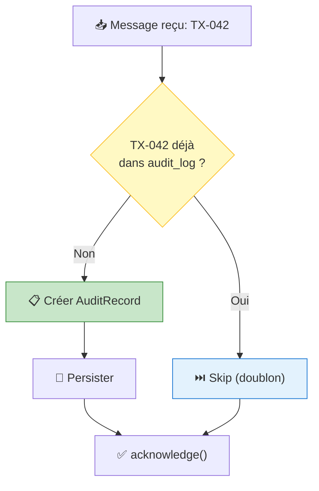

# LAB 1.3C (Java) : Consumer avec Manual Commit — Audit Réglementaire E-Banking

## ⏱️ Durée estimée : 45 minutes

## 🏦 Contexte E-Banking

Dans le secteur bancaire, la **conformité réglementaire** (Bâle III, RGPD, PSD2, AML) exige que **chaque transaction soit enregistrée** dans un journal d'audit. **Perdre une seule transaction** peut entraîner des sanctions de plusieurs millions d'euros. L'auto-commit du LAB 1.3A n'offre pas cette garantie — il faut un **commit manuel** qui ne valide l'offset qu'**après** la persistance réussie en base de données.

### Le Problème : Auto-Commit et Perte de Données



### La Solution : Manual Commit



### Garanties de Livraison : Comparaison



| Garantie | Perte possible ? | Doublon possible ? | Complexité | Cas d'usage E-Banking |
| -------- | ---------------- | ------------------ | ---------- | -------------------- |
| **At-most-once** | ✅ Oui | ❌ Non | Faible | Logs, analytics non-critiques |
| **At-least-once** | ❌ Non | ✅ Oui | Moyenne | **Audit, conformité** (ce lab) |
| **Exactly-once** | ❌ Non | ❌ Non | Élevée | Paiements, virements |

> **⚠️ Note pédagogique** : La garantie *exactly-once* native de Kafka repose sur l'API Transactions. Ce lab implémente **at-least-once + idempotence applicative** (déduplication par `TransactionId`), ce qui produit un *effet* équivalent à exactly-once sans recourir aux transactions Kafka.

### Scénarios d'Audit Réglementaire

| Réglementation | Exigence | Impact d'une perte |
| -------------- | -------- | ------------------ |
| **Bâle III** | Traçabilité complète des transactions | Sanction financière |
| **PSD2** | Journalisation des paiements électroniques | Révocation de licence |
| **AML/KYC** | Suivi des transactions suspectes | Amende jusqu'à 10% du CA |
| **RGPD** | Droit d'accès aux données de paiement | Amende jusqu'à 4% du CA |
| **MiFID II** | Enregistrement des ordres financiers | Interdiction d'exercer |

---

## 🎯 Objectifs

À la fin de ce lab, vous serez capable de :

1. Implémenter le **manual commit** (`ack-mode=manual`) avec Spring Kafka
2. Comprendre la différence entre **at-most-once** et **at-least-once**
3. Utiliser `Acknowledgment.acknowledge()` pour un contrôle fin des offsets
4. Implémenter l'**idempotence côté consumer** (gérer les doublons)
5. Implémenter un **retry + DLQ** côté consumer pour les erreurs de traitement
6. Gérer le **graceful shutdown** avec commit final

---

## 📦 Ce que vous allez construire

| Composant | Rôle |
| --------- | ---- |
| `Transaction.java` | Modèle partagé (identique au Module 02) |
| `AuditRecord.java` | Modèle d'enregistrement d'audit |
| `AuditService.java` | @KafkaListener avec manual ack, retry et DLQ |
| `AuditController.java` | Endpoints API : journal d'audit, métriques, DLQ |
| `application.properties` | Configuration Kafka manual commit |

### Architecture des Composants



---

## 🏗️ Diagramme de Classes



---

## 🔧 Séquence : Manual Commit (Code Expliqué)



### Séquence : Idempotence



---

## 🚀 Prérequis

### LABs 1.3A et 1.3B complétés

Ce lab étend les concepts des LABs précédents avec le manual commit.

### Topics Kafka

```bash
# Créer le topic DLQ pour l'audit
docker exec kafka /opt/kafka/bin/kafka-topics.sh \
  --bootstrap-server localhost:9092 \
  --create --if-not-exists \
  --topic banking.transactions.audit-dlq \
  --partitions 6 \
  --replication-factor 1
```

### JDK 17+ et Maven 3.9+

```bash
java -version   # Attendu : 17.x+
mvn -version    # Attendu : 3.9.x+
```

---

## 📝 Instructions Pas à Pas

### Étape 1 : Structure du projet

```text
java/
├── pom.xml
├── Dockerfile
├── .dockerignore
└── src/main/
    ├── resources/
    │   └── application.properties
    └── java/com/data2ai/kafka/consumer/audit/
        ├── AuditConsumerApplication.java
        ├── model/
        │   ├── Transaction.java
        │   └── AuditRecord.java
        ├── service/
        │   └── AuditService.java
        └── controller/
            └── AuditController.java
```

### Étape 2 : Configuration de l'application (`application.properties`)

```properties
server.port=${SERVER_PORT:8080}

spring.application.name=lab-1-3c-audit-consumer

# Kafka
spring.kafka.bootstrap-servers=${KAFKA_BOOTSTRAP_SERVERS:localhost:9092}
app.kafka.topic=${KAFKA_TOPIC:banking.transactions}
app.kafka.group-id=${KAFKA_GROUP_ID:audit-compliance-service-java}
app.kafka.dlq-topic=${KAFKA_DLQ_TOPIC:banking.transactions.audit-dlq}

# *** MANUAL COMMIT : clé de ce lab ***
spring.kafka.consumer.group-id=${app.kafka.group-id}
spring.kafka.consumer.auto-offset-reset=earliest
spring.kafka.consumer.enable-auto-commit=false
spring.kafka.listener.ack-mode=manual

# Retry configuration
app.retry.max-attempts=${MAX_RETRY_ATTEMPTS:3}
app.retry.backoff-ms=${RETRY_BACKOFF_MS:1000}

# Producer pour DLQ
spring.kafka.producer.key-serializer=org.apache.kafka.common.serialization.StringSerializer
spring.kafka.producer.value-serializer=org.apache.kafka.common.serialization.StringSerializer

# Actuator
management.endpoints.web.exposure.include=health,info
management.endpoint.health.show-details=always
```

**Points de configuration clés :**

| Propriété | Valeur | Rôle |
| --------- | ------ | ---- |
| `enable-auto-commit` | `false` | **Désactive** l'auto-commit — clé du lab |
| `ack-mode` | `manual` | L'offset n'est committé que quand `acknowledge()` est appelé |
| `dlq-topic` | `banking.transactions.audit-dlq` | Topic DLQ pour les messages en échec |
| `max-attempts` | `3` | Nombre max de tentatives avant envoi en DLQ |

### Étape 3 : Modèle AuditRecord (`model/AuditRecord.java`)

```java
package com.data2ai.kafka.consumer.audit.model;

import java.math.BigDecimal;
import java.time.Instant;

public class AuditRecord {
    private String auditId;
    private String transactionId;
    private String customerId;
    private BigDecimal amount;
    private String currency;
    private String type;
    private String fromAccount;
    private String toAccount;
    private Instant transactionTimestamp;
    private Instant auditTimestamp = Instant.now();
    private String status = "Recorded";  // Recorded, Failed, DLQ

    // Métadonnées Kafka
    private int kafkaPartition;
    private long kafkaOffset;
    private String consumerGroupId;

    // Traçabilité
    private int processingAttempts = 1;
    private String errorDetails;

    // Getters et setters omis — voir le code source complet
}
```

### Étape 4 : Service Consumer avec Manual Commit (`service/AuditService.java`)

C'est le **cœur du lab** — `Acknowledgment.acknowledge()` pour le commit manuel :

```java
@Service
public class AuditService {

    private static final Logger log = LoggerFactory.getLogger(AuditService.class);
    private final ObjectMapper objectMapper;
    private final KafkaTemplate<String, String> kafkaTemplate;

    @Value("${app.kafka.dlq-topic}")
    private String dlqTopic;

    @Value("${app.retry.max-attempts}")
    private int maxRetryAttempts;

    @Value("${app.retry.backoff-ms}")
    private long retryBackoffMs;

    // Audit store idempotent (in-memory, par TransactionId)
    private final ConcurrentHashMap<String, AuditRecord> auditLog = new ConcurrentHashMap<>();
    private final ConcurrentLinkedQueue<Map<String, Object>> dlqMessages = new ConcurrentLinkedQueue<>();

    // Métriques
    private final AtomicLong messagesConsumed = new AtomicLong();
    private final AtomicLong auditRecords = new AtomicLong();
    private final AtomicLong duplicatesSkipped = new AtomicLong();
    private final AtomicLong processingErrors = new AtomicLong();
    private final AtomicLong dlqCount = new AtomicLong();

    @KafkaListener(topics = "${app.kafka.topic}")
    public void onMessage(ConsumerRecord<String, String> record,
                          Acknowledgment acknowledgment) {
        messagesConsumed.incrementAndGet();

        try {
            Transaction tx = objectMapper.readValue(record.value(), Transaction.class);

            // IDEMPOTENCE : vérifier si déjà traité
            if (auditLog.containsKey(tx.getTransactionId())) {
                duplicatesSkipped.incrementAndGet();
                log.info("⏭️ Doublon ignoré: {} (déjà dans le journal) | P{}:O{}",
                        tx.getTransactionId(), record.partition(), record.offset());
                acknowledgment.acknowledge();  // Avancer l'offset
                return;
            }

            // Traiter avec retry
            boolean success = processWithRetry(record, tx);

            if (!success) {
                // Envoyer en DLQ après échec de tous les retries
                sendToDlq(record, "Échec après " + maxRetryAttempts + " tentatives");
            }

        } catch (Exception ex) {
            processingErrors.incrementAndGet();
            log.error("Erreur fatale P{}:O{}: {}", record.partition(), record.offset(), ex.getMessage());
            sendToDlq(record, ex.getMessage());
        }

        // MANUAL COMMIT : committé APRÈS traitement (ou envoi en DLQ)
        acknowledgment.acknowledge();
    }

    private boolean processWithRetry(ConsumerRecord<String, String> record,
                                     Transaction tx) {
        for (int attempt = 1; attempt <= maxRetryAttempts; attempt++) {
            try {
                // Créer l'enregistrement d'audit
                AuditRecord audit = new AuditRecord();
                audit.setTransactionId(tx.getTransactionId());
                audit.setCustomerId(tx.getCustomerId());
                audit.setAmount(tx.getAmount());
                audit.setCurrency(tx.getCurrency());
                audit.setType(tx.getType());
                audit.setKafkaPartition(record.partition());
                audit.setKafkaOffset(record.offset());
                audit.setProcessingAttempts(attempt);

                // Persister (idempotent par TransactionId)
                auditLog.put(tx.getTransactionId(), audit);
                auditRecords.incrementAndGet();

                log.info("📋 Audit enregistré: {} | {} | {}{} | {} | P{}:O{} | Tentative {}",
                        tx.getTransactionId(), tx.getCustomerId(),
                        tx.getAmount(), tx.getCurrency(), tx.getType(),
                        record.partition(), record.offset(), attempt);

                return true;

            } catch (Exception ex) {
                log.warn("Tentative {}/{} échouée pour P{}:O{}: {}",
                        attempt, maxRetryAttempts, record.partition(), record.offset(), ex.getMessage());

                if (attempt < maxRetryAttempts) {
                    long delay = retryBackoffMs * (long) Math.pow(2, attempt - 1);
                    log.info("⏳ Nouvelle tentative dans {}ms...", delay);
                    try { Thread.sleep(delay); } catch (InterruptedException ie) {
                        Thread.currentThread().interrupt();
                        return false;
                    }
                }
            }
        }
        processingErrors.incrementAndGet();
        return false;
    }

    private void sendToDlq(ConsumerRecord<String, String> failedRecord, String errorReason) {
        try {
            kafkaTemplate.send(dlqTopic, failedRecord.key(), failedRecord.value());
            dlqCount.incrementAndGet();

            dlqMessages.add(Map.of(
                    "transactionKey", String.valueOf(failedRecord.key()),
                    "errorReason", errorReason,
                    "originalPartition", failedRecord.partition(),
                    "originalOffset", failedRecord.offset(),
                    "failedAt", Instant.now().toString()
            ));

            log.warn("☠️ Envoyé en DLQ: Key={} | P{}:O{} | Raison: {}",
                    failedRecord.key(), failedRecord.partition(),
                    failedRecord.offset(), errorReason);
        } catch (Exception ex) {
            log.error("Échec envoi en DLQ: {}", ex.getMessage());
        }
    }

    // --- Méthodes publiques pour l'API ---
    public List<AuditRecord> getAuditLog() {
        return auditLog.values().stream()
                .sorted(Comparator.comparing(AuditRecord::getAuditTimestamp).reversed())
                .toList();
    }

    public List<Map<String, Object>> getDlqMessages() { return List.copyOf(dlqMessages); }

    public Map<String, Object> getStats() {
        return Map.of(
                "messagesConsumed", messagesConsumed.get(),
                "auditRecordsCreated", auditRecords.get(),
                "duplicatesSkipped", duplicatesSkipped.get(),
                "processingErrors", processingErrors.get(),
                "messagesSentToDlq", dlqCount.get(),
                "enableAutoCommit", false,
                "ackMode", "manual"
        );
    }
}
```

**Concepts clés démontrés :**

- **`Acknowledgment.acknowledge()`** — Commit manuel de l'offset (remplace `.NET consumer.Commit()`)
- **`ack-mode=manual`** — Spring Kafka ne commite l'offset que quand `acknowledge()` est appelé
- **Idempotence** — Vérification par `TransactionId` avant écriture (évite les doublons)
- **Retry avec backoff exponentiel** — 3 tentatives avec délai croissant (1s, 2s, 4s)
- **DLQ via `KafkaTemplate`** — Les messages en échec sont redirigés vers `banking.transactions.audit-dlq`

### Étape 5 : Contrôleur REST (`controller/AuditController.java`)

```java
@RestController
@RequestMapping("/api/v1")
public class AuditController {

    private final AuditService service;

    public AuditController(AuditService service) {
        this.service = service;
    }

    @GetMapping("/audit")
    public ResponseEntity<List<AuditRecord>> audit() {
        return ResponseEntity.ok(service.getAuditLog());
    }

    @GetMapping("/dlq")
    public ResponseEntity<List<Map<String, Object>>> dlq() {
        return ResponseEntity.ok(service.getDlqMessages());
    }

    @GetMapping("/stats")
    public ResponseEntity<Map<String, Object>> stats() {
        return ResponseEntity.ok(service.getStats());
    }
}
```

---

## 🚀 Déploiement

### Développement Local

#### 1. Créer le topic DLQ

```bash
docker exec kafka /opt/kafka/bin/kafka-topics.sh \
  --bootstrap-server localhost:9092 \
  --create --if-not-exists \
  --topic banking.transactions.audit-dlq \
  --partitions 6 \
  --replication-factor 1
```

#### 2. Démarrer le Consumer

```bash
cd java
mvn spring-boot:run
```

#### 3. Observer les logs

```text
INFO  AuditService : 📋 Audit enregistré: TX-001 | CUST-001 | 500EUR | Transfer | P2:O0 | Tentative 1
INFO  AuditService : 📋 Audit enregistré: TX-002 | CUST-002 | 15000EUR | InternationalTransfer | P5:O0 | Tentative 1
```

#### 4. Tester l'idempotence

Réinitialisez les offsets du consumer group pour retraiter les messages :

```bash
# Arrêter le consumer d'abord, puis :
docker exec kafka /opt/kafka/bin/kafka-consumer-groups.sh \
  --bootstrap-server localhost:9092 \
  --group audit-compliance-service-java \
  --topic banking.transactions \
  --reset-offsets --to-earliest \
  --execute
```

Redémarrez le consumer et observez :

```text
INFO  AuditService : ⏭️ Doublon ignoré: TX-001 (déjà dans le journal) | P2:O0
INFO  AuditService : ⏭️ Doublon ignoré: TX-002 (déjà dans le journal) | P5:O0
```

#### 5. Vérifier via l'API

- `GET http://localhost:8080/api/v1/audit` — Journal d'audit complet
- `GET http://localhost:8080/api/v1/dlq` — Messages en Dead Letter Queue
- `GET http://localhost:8080/api/v1/stats` — Métriques (commits, doublons, DLQ)
- `GET http://localhost:8080/actuator/health` — Health check

### Docker

```bash
cd java
docker build -t ebanking-audit-consumer-java .
docker run -p 8080:8080 \
  -e KAFKA_BOOTSTRAP_SERVERS=host.docker.internal:9092 \
  ebanking-audit-consumer-java
```

### OpenShift Sandbox — Option A : Build S2I Binaire

> **🎯 Objectif** : Ce déploiement valide les patterns avancés du **Consumer Kafka** dans un environnement cloud :
> - **Manual Commit** : les offsets sont commités explicitement après traitement réussi (at-least-once)
> - **Déduplication** : les messages déjà traités sont détectés et ignorés (idempotence applicative)
> - **Dead Letter Queue (DLQ)** : les messages impossibles à traiter sont redirigés vers un topic DLQ
> - **Retry avec backoff** : les erreurs transitoires sont retentées avant envoi en DLQ

#### 1. Créer le topic DLQ

```bash
oc exec kafka-0 -- /opt/kafka/bin/kafka-topics.sh \
  --bootstrap-server localhost:9092 \
  --create --if-not-exists \
  --topic banking.transactions.audit-dlq \
  --partitions 6 --replication-factor 3
```

#### 2. Build et Déploiement

```bash
cd module-03-consumer/lab-1.3c-consumer-manual-commit/java

# Créer le BuildConfig (avec image stream explicite)
oc new-build --image-stream="openshift/java:openjdk-17-ubi8" --binary=true --name=ebanking-audit-consumer-java

# Build depuis le source local
oc start-build ebanking-audit-consumer-java --from-dir=. --follow

# Déployer
oc new-app ebanking-audit-consumer-java
```

#### 3. Configurer les variables d'environnement

```bash
oc set env deployment/ebanking-audit-consumer-java \
  SERVER_PORT=8080 \
  KAFKA_BOOTSTRAP_SERVERS=kafka-svc:9092 \
  KAFKA_TOPIC=banking.transactions \
  KAFKA_DLQ_TOPIC=banking.transactions.audit-dlq \
  MAX_RETRY_ATTEMPTS=3 \
  RETRY_BACKOFF_MS=1000
```

#### 4. Créer la route Edge

```bash
oc create route edge ebanking-audit-consumer-java-secure \
  --service=ebanking-audit-consumer-java --port=8080-tcp
```

#### 5. Vérifier le déploiement

```bash
URL=$(oc get route ebanking-audit-consumer-java-secure -o jsonpath='{.spec.host}')

# Health check
curl -k "https://$URL/actuator/health"

# Journal d'audit
curl -k -s "https://$URL/api/v1/audit"

# Messages DLQ
curl -k -s "https://$URL/api/v1/dlq"

# Métriques
curl -k -s "https://$URL/api/v1/stats"
```

> **📝 Note** : Sur PowerShell, utilisez :
> ```powershell
> $URL = oc get route ebanking-audit-consumer-java-secure -o jsonpath='{.spec.host}'
> [System.Net.ServicePointManager]::SecurityProtocol = [System.Net.SecurityProtocolType]::Tls12
> (New-Object System.Net.WebClient).DownloadString("https://$URL/api/v1/audit")
> ```

#### 6. ✅ Critères de succès

```bash
# Pod en cours d'exécution ?
oc get pod -l deployment=ebanking-audit-consumer-java
# Attendu : STATUS=Running, READY=1/1

# Consumer actif ?
curl -k -s "https://$URL/actuator/health"
# Attendu : {"status":"UP"}

# Manual commit actif ?
curl -k -s "https://$URL/api/v1/stats"
# Attendu : enableAutoCommit=false, ackMode=manual

# Topic DLQ existe ?
oc exec kafka-0 -- /opt/kafka/bin/kafka-topics.sh \
  --bootstrap-server localhost:9092 \
  --describe --topic banking.transactions.audit-dlq
# Attendu : PartitionCount: 6
```

#### 7. Script automatisé

```bash
# Bash
./scripts/bash/deploy-and-test-1.3c-java.sh

# PowerShell
.\scripts\powershell\deploy-and-test-1.3c-java.ps1
```

---

## 🧪 Tests

### Scénarios de test

```bash
URL=$(oc get route ebanking-audit-consumer-java-secure -o jsonpath='{.spec.host}')

# 1. Health check
curl -k -s "https://$URL/actuator/health"

# 2. Journal d'audit (chaque transaction enregistrée avec traçabilité complète)
curl -k -s "https://$URL/api/v1/audit"
# Attendu : records avec auditId, transactionId, status="Recorded", processingAttempts=1

# 3. Métriques (manual commit, doublons, DLQ)
curl -k -s "https://$URL/api/v1/stats"
# Attendu : enableAutoCommit=false, ackMode=manual

# 4. Messages DLQ
curl -k -s "https://$URL/api/v1/dlq"

# 5. Vérifier les offsets commités via Kafka CLI
oc exec kafka-0 -- /opt/kafka/bin/kafka-consumer-groups.sh \
  --bootstrap-server localhost:9092 \
  --describe --group audit-compliance-service-java
```

---

## 📋 Endpoints API

| Méthode | Endpoint | Description |
| ------- | -------- | ----------- |
| `GET` | `/api/v1/audit` | Journal d'audit complet |
| `GET` | `/api/v1/dlq` | Messages envoyés en Dead Letter Queue |
| `GET` | `/api/v1/stats` | Métriques (commits, doublons, DLQ, mode ack) |
| `GET` | `/actuator/health` | Health check |

---

## 🎯 Concepts Clés Expliqués

### Spring Kafka vs Confluent.Kafka (.NET) — Manual Commit

| Aspect | Java (Spring Kafka) | .NET (Confluent.Kafka) |
| ------ | ------------------- | ---------------------- |
| **Désactiver auto-commit** | `enable-auto-commit=false` + `ack-mode=manual` | `EnableAutoCommit = false` + `EnableAutoOffsetStore = false` |
| **Commit manuel** | `Acknowledgment.acknowledge()` | `consumer.StoreOffset()` + `consumer.Commit()` |
| **DLQ producer** | `KafkaTemplate.send()` | `IProducer.ProduceAsync()` |
| **Retry** | Boucle manuelle ou `@RetryableTopic` | Boucle manuelle avec `Task.Delay` |
| **Idempotence** | `ConcurrentHashMap.containsKey()` | `ConcurrentDictionary.ContainsKey()` |
| **Graceful shutdown** | Géré par Spring Kafka lifecycle | `Commit()` dans le `finally` |

### Comparaison des 3 LABs

| Aspect | LAB 1.3A (Fraude) | LAB 1.3B (Solde) | LAB 1.3C (Audit) |
| ------ | ----------------- | ----------------- | ----------------- |
| **Commit** | Auto | Auto | **Manual** |
| **Garantie** | At-most-once | At-most-once | **At-least-once** |
| **Perte possible** | ⚠️ Oui | ⚠️ Oui | ✅ Non |
| **Doublon possible** | ❌ Non | ❌ Non | ⚠️ Oui (géré par idempotence) |
| **DLQ** | Non | Non | **Oui** |
| **Idempotence** | Non nécessaire | Non nécessaire | **Oui (par TransactionId)** |
| **Cas d'usage** | Détection fraude | Calcul solde | **Audit réglementaire** |

### Concepts validés

| Concept | Comment le vérifier |
| ------- | ------------------- |
| Manual Commit | `enableAutoCommit=false` et `ackMode=manual` dans `/api/v1/stats` |
| At-least-once | `kafka-consumer-groups.sh --describe` montre les offsets commités |
| Déduplication | `duplicatesSkipped` augmente quand on renvoie le même `transactionId` |
| DLQ | `GET /api/v1/dlq` montre les messages impossibles à traiter |
| Audit log | `GET /api/v1/audit` retrouve chaque transaction enregistrée |

---

## 🔧 Troubleshooting

| Symptôme | Cause probable | Solution |
| -------- | -------------- | -------- |
| Consumer status `Rebalancing` permanent | Kafka coordinator instable | Attendre 30s. Si persiste, supprimer le pod : `oc delete pod -l deployment=ebanking-audit-consumer-java` |
| Health retourne 503 | Consumer pas encore assigné aux partitions | Attendre 10-15s pour l'assignation. Vérifier les pods Kafka |
| `messagesConsumed` reste à 0 | Pas de messages ou commit échoué | Envoyer des transactions via l'API Producer. Vérifier les logs |
| `duplicatesSkipped` augmente | Messages rejoués après redémarrage | Comportement attendu — l'idempotence fonctionne correctement |
| Messages DLQ apparaissent | Échecs de traitement après 3 retries | Vérifier `/api/v1/dlq` pour les détails d'erreur |
| Journal d'audit vide | Consumer sur mauvaise partition ou pas de données | Vérifier que le topic a des messages |
| Pod CrashLoopBackOff | Variables d'env manquantes | Vérifier : `oc set env deployment/ebanking-audit-consumer-java --list` |

---

## ✅ Validation

- [ ] `enable-auto-commit=false` et `ack-mode=manual` dans la config
- [ ] Les offsets sont commités **après** le traitement réussi
- [ ] Les doublons sont détectés et ignorés (idempotence par TransactionId)
- [ ] Les messages en erreur sont envoyés en DLQ après 3 retries
- [ ] Les métriques montrent `enableAutoCommit=false`
- [ ] Un reset des offsets + redémarrage ne crée pas de doublons dans l'audit
- [ ] `/api/v1/audit` retourne le journal d'audit complet
- [ ] `/api/v1/dlq` retourne les messages en Dead Letter Queue

---

## 🔑 Points à Retenir

| Concept | Ce qu'il faut retenir |
| ------- | -------------------- |
| **Manual commit** | `enable-auto-commit=false` + `ack-mode=manual` + `acknowledge()` explicite |
| **At-least-once** | Aucune perte, mais doublons possibles → idempotence obligatoire |
| **Idempotence** | Vérifier par `TransactionId` avant d'écrire (UNIQUE constraint en prod) |
| **DLQ** | Messages non traitables → DLQ via `KafkaTemplate` pour retraitement |
| **Retry + backoff** | Exponential backoff (1s, 2s, 4s) avant envoi en DLQ |
| **Spring Kafka** | `Acknowledgment.acknowledge()` remplace `.NET consumer.Commit()` |

---

## 🏁 Récapitulatif du Module 03

Vous avez maintenant maîtrisé les 3 patterns fondamentaux de consommation Kafka en contexte e-banking :

1. **LAB 1.3A** : Consumer basique avec auto-commit → Détection de fraude en temps réel
2. **LAB 1.3B** : Consumer Group avec scaling horizontal → Calcul de solde distribué
3. **LAB 1.3C** : Manual commit avec idempotence → Audit réglementaire (aucune perte)

Ces 3 consumers consomment les **mêmes messages** produits par le Module 02, chacun dans son propre **Consumer Group**, démontrant le pattern multi-consumer de Kafka.

👉 Retour au **[Module 03 — Overview](../../README.md)**
