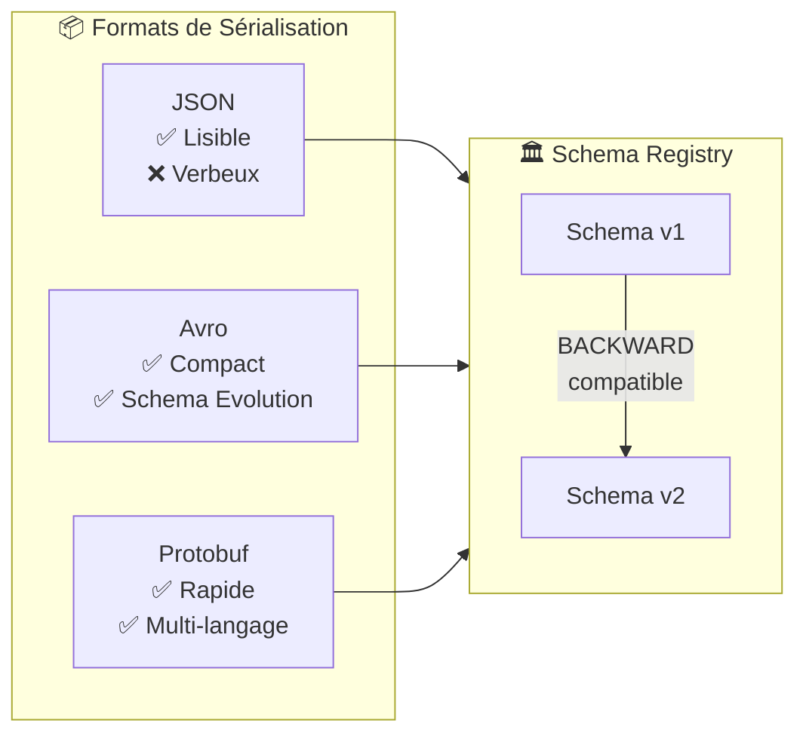
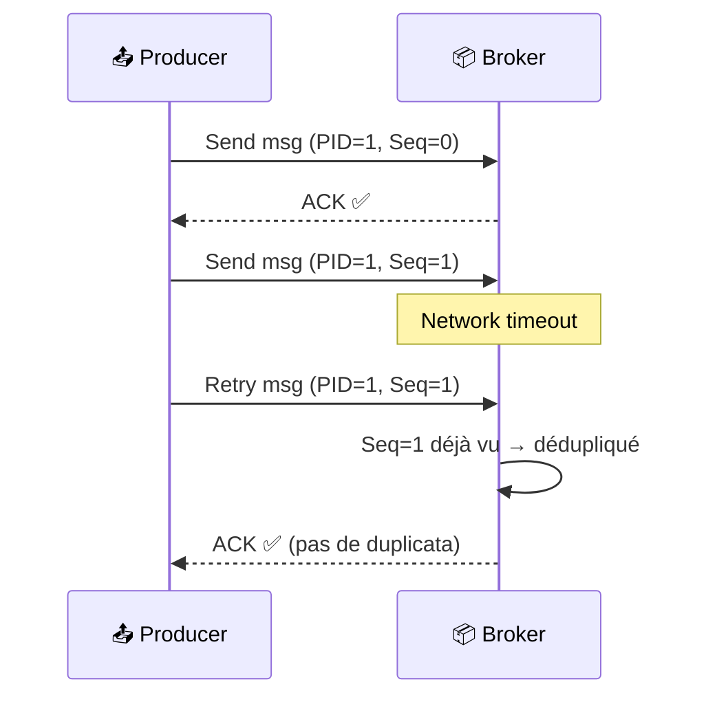
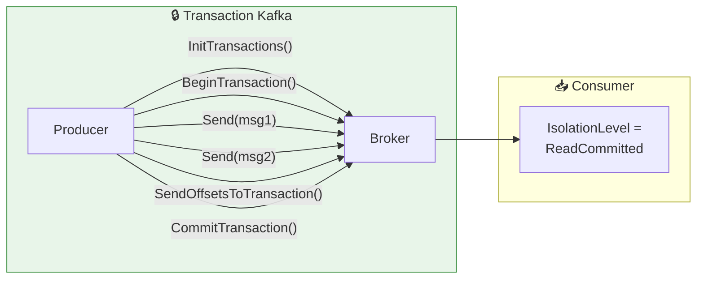
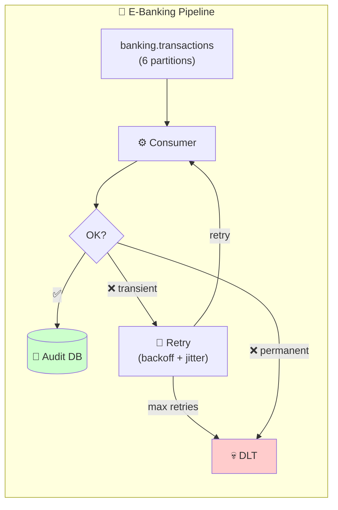
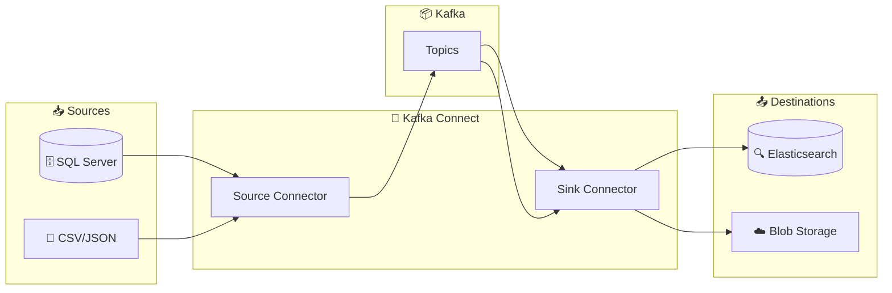
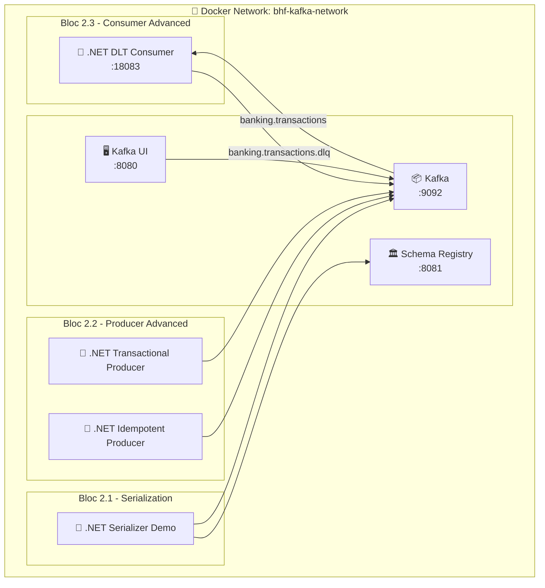

# 📅 Day 02 — Patterns de Production & Sérialisation

> **Mercredi 11 février 2026** | 6h (9h–12h / 13h30–16h30) | **Niveau** : Intermédiaire → Avancé

---

## 🎯 Objectifs pédagogiques

À la fin de cette journée, vous serez capable de :

| # | Objectif | Bloc |
| --- | -------- | ---- |
| 1 | Choisir la bonne stratégie de **sérialisation** (JSON, Avro, Protobuf) | 2.1 |
| 2 | Configurer **Schema Registry** et gérer l'**évolution de schéma** | 2.1 |
| 3 | Activer l'**idempotence** producer (`EnableIdempotence = true`) | 2.2 |
| 4 | Comprendre les **transactions Kafka** et l'exactly-once semantics | 2.2 |
| 5 | Implémenter un **Dead Letter Topic** (DLT) pour messages en erreur | 2.3 |
| 6 | Configurer des **retries avec backoff exponentiel + jitter** | 2.3 |
| 7 | Gérer le **rebalancing** avec CooperativeSticky | 2.3 |
| 8 | Comprendre **Kafka Connect** et ses cas d'usage (preview Day 03) | 2.4 |

> **Ratio théorie/pratique** : 30% / 70% — Chaque bloc commence par 15-20 min de théorie puis enchaîne sur un lab hands-on.

---

## 📋 Prérequis

- ✅ **Day 01 complété** (M01-M03, Labs 1.2a–1.3c)
- ✅ Infrastructure Kafka fonctionnelle (Docker ou OpenShift Sandbox)
- ✅ Topic `banking.transactions` existant (6 partitions)
- ✅ .NET 8 SDK + Confluent.Kafka 2.3.0+

---

## 🗓️ Planning de la journée

| Créneau | Bloc | Durée | Contenu |
| ------- | ---- | ----- | ------- |
| 09h00–09h30 | Recap | 30 min | Quiz Day 01 + correction, questions ouvertes |
| 09h30–10h30 | **2.1** | 1h | Sérialisation : JSON patterns → Avro → Schema Registry |
| 10h30–10h45 | | 15 min | ☕ Pause |
| 10h45–12h00 | **2.2** | 1h15 | Producer Avancé : Idempotence, Transactions, Exactly-once |
| 12h00–13h30 | | 1h30 | 🍽️ Déjeuner |
| 13h30–15h00 | **2.3** | 1h30 | Consumer Avancé : DLT, Retry, Rebalancing (Lab M04) |
| 15h00–15h15 | | 15 min | ☕ Pause |
| 15h15–16h00 | **2.4** | 45 min | Kafka Connect Introduction (preview Day 03) |
| 16h00–16h30 | Recap | 30 min | Bilan Day 02, Q&A, preview Day 03 |

---

## 📚 Bloc 2.1 — Sérialisation Avancée (1h)

> **Théorie** : 20 min | **Lab** : 40 min

### Concepts clés



| Format | Taille (msg 1KB JSON) | Schema Evolution | Lisibilité | Cas d'usage |
| ------ | --------------------- | ---------------- | ---------- | ----------- |
| **JSON** | 1000 bytes | ❌ Manuelle | ✅ Lisible | Prototypage, debug |
| **Avro** | ~400 bytes | ✅ Registry | ❌ Binaire | Production (recommandé) |
| **Protobuf** | ~350 bytes | ✅ Registry | ❌ Binaire | gRPC, multi-langage |

### Évolution de schéma

| Stratégie | Règle | Exemple |
| --------- | ----- | ------- |
| **BACKWARD** | Nouveau consumer lit ancien format | Ajouter champ optionnel |
| **FORWARD** | Ancien consumer lit nouveau format | Supprimer champ optionnel |
| **FULL** | Les deux | Ajouter/supprimer champs optionnels uniquement |
| **NONE** | Pas de vérification | Développement uniquement |

### Lab 2.1 — Sérialisation JSON structurée & intro Avro

> 📂 **[lab-2.1a — Serialization](./module-04-advanced-patterns/lab-2.1a-serialization/README.md)**

**Objectifs du lab** :

1. Implémenter un serializer/deserializer JSON typé pour `Transaction`
2. Ajouter la validation de schéma côté producer et consumer
3. Démontrer le problème d'évolution de schéma avec JSON brut
4. (Bonus) Configurer Avro avec Schema Registry

**Concepts .NET** :

```csharp
// Custom JSON serializer with schema validation
var producerConfig = new ProducerConfig { /* ... */ };

using var producer = new ProducerBuilder<string, Transaction>(producerConfig)
    .SetValueSerializer(new TransactionJsonSerializer())  // Custom serializer
    .Build();
```

---

## 📚 Bloc 2.2 — Producer Patterns Avancés (1h15)

> **Théorie** : 20 min | **Lab** : 55 min

### Concepts clés

#### Idempotence : Éviter les duplicatas



| Config | Sans Idempotence | Avec Idempotence |
| ------ | ---------------- | ---------------- |
| `EnableIdempotence` | `false` | `true` |
| `Acks` | `Leader` ou `All` | **`All`** (forcé) |
| `MaxInFlight` | 5 (défaut) | **≤ 5** (forcé) |
| `MessageSendMaxRetries` | 2 (défaut) | **`int.MaxValue`** (forcé) |
| Risque duplicata | ⚠️ Oui (retry) | ✅ Non |
| Performance | Rapide | ~identique |

#### Transactions Kafka (Exactly-Once)



| Garantie | Configuration Producer | Configuration Consumer |
| -------- | --------------------- | --------------------- |
| **At-most-once** | `Acks = 0` | Auto-commit |
| **At-least-once** | `Acks = All` + Idempotence | Manual commit après traitement |
| **Exactly-once** | `Acks = All` + Transactions | `IsolationLevel = ReadCommitted` |

### Lab 2.2a — Producer Idempotent

> 📂 **[lab-2.2a — Producer Idempotent](./module-04-advanced-patterns/lab-2.2-producer-advanced/README.md)**

**Objectifs du lab** :

1. Activer `EnableIdempotence = true` et observer le Producer ID (PID)
2. Simuler des retries réseau et vérifier l'absence de duplicatas
3. Comparer throughput avec/sans idempotence
4. Observer les sequence numbers dans les métriques

### Lab 2.2b — Transactions Kafka (Exactly-Once)

> 📂 **[lab-2.2b — Kafka Transactions](./module-04-advanced-patterns/lab-2.2b-transactions/README.md)**

**Objectifs du lab** :

1. Configurer un `TransactionalId` persistant
2. Implémenter `BeginTransaction()` → `CommitTransaction()` / `AbortTransaction()`
3. Envoyer un lot de messages atomique (all-or-nothing)
4. Configurer un consumer avec `IsolationLevel.ReadCommitted`

**Code clé** :

```csharp
var config = new ProducerConfig
{
    BootstrapServers = "localhost:9092",
    EnableIdempotence = true,       // Activates PID + sequence numbers
    Acks = Acks.All,                // Required for idempotence
    MaxInFlight = 5,                // Max with idempotence
    MessageSendMaxRetries = int.MaxValue,
    LingerMs = 10,
    CompressionType = CompressionType.Snappy
};
```

---

## 📥 Bloc 2.3 — Consumer Patterns Avancés (1h30)

> **Théorie** : 20 min | **Lab** : 1h10

### Concepts clés



| Pattern | Quand | Implémentation |
| ------- | ----- | -------------- |
| **DLT (Dead Letter Topic)** | Message non traitable après N retries | Producer vers `banking.transactions.dlq` avec headers de traçabilité |
| **Retry + Backoff** | Erreur transitoire (timeout, DB lock) | `Math.Pow(2, attempt) * baseDelay + jitter` |
| **Error Classification** | Distinguer transient vs permanent | `IsTransient(ex)` → retry, sinon DLT immédiat |
| **Rebalancing Handlers** | Scaling up/down des consumers | `SetPartitionsRevokedHandler` → commit avant révocation |

### Lab 2.3 — DLT, Retry & Rebalancing

> 📂 **[lab-2.3a — Consumer DLT & Retry](./module-04-advanced-patterns/lab-2.3a-consumer-dlt-retry/README.md)**

**Objectifs du lab** :

1. Envoyer des messages valides et invalides, observer le routage vers DLT
2. Observer les retries avec backoff exponentiel dans les logs
3. Scaler le consumer à 2 replicas et observer le rebalancing CooperativeSticky
4. Consulter les métriques via `/api/v1/stats` et `/api/v1/dlt/messages`

**Concepts couverts** :

- `EnableAutoCommit = false` + `Commit()` explicite
- `EnableAutoOffsetStore = false` + `StoreOffset()` pour contrôle fin
- `PartitionAssignmentStrategy = CooperativeSticky`
- Classification transient vs permanent avec pattern matching C#
- DLT avec headers : `original-topic`, `error-reason`, `retry-count`, `failed-at`

---

## 🔌 Bloc 2.4 — Kafka Connect Introduction (45 min)

> **Théorie** : 30 min | **Démo** : 15 min

### Concepts clés



| Concept | Description |
| ------- | ----------- |
| **Source Connector** | Lit des données externes → Kafka topics |
| **Sink Connector** | Lit Kafka topics → écrit vers systèmes externes |
| **Worker** | Process JVM qui exécute les connecteurs |
| **Task** | Unité de parallélisme au sein d'un connecteur |
| **Converter** | Transforme les données (JsonConverter, AvroConverter) |

> 🔗 **Lab complet Kafka Connect** : voir **[Day 03 — Module 06](../day-03-integration/module-06-kafka-connect/README.md)**

**Preview** : Demain (Day 03) vous déploierez un connecteur **SQL Server CDC → Kafka** et un **Kafka → Elasticsearch** pour indexer les transactions bancaires en temps réel.

---

## 🏗️ Architecture Day 02



---

## 📦 Modules & Labs

| Bloc | Module | Lab | Durée | Description |
| ---- | ------ | --- | ----- | ----------- |
| 2.1 | [Serialization](./module-04-advanced-patterns/lab-2.1a-serialization/README.md) | Lab 2.1a | 40 min | JSON typé, validation, intro Avro |
| 2.2 | [Producer Advanced](./module-04-advanced-patterns/lab-2.2-producer-advanced/README.md) | Lab 2.2a | 30 min | Idempotence, PID, sequence numbers |
| 2.2 | [Transactions](./module-04-advanced-patterns/lab-2.2b-transactions/README.md) | Lab 2.2b | 25 min | Kafka Transactions, Exactly-Once Semantics |
| 2.3 | [Consumer Advanced](./module-04-advanced-patterns/lab-2.3a-consumer-dlt-retry/README.md) | Lab 2.3a | 1h10 | DLT, Retry, Rebalancing |
| 2.4 | Kafka Connect | (Day 03 preview) | 15 min | Démo Source/Sink connectors |

---

## 🚀 Quick Start

### Démarrer l'infrastructure

<details>
<summary>🐳 Docker</summary>

```bash
# Depuis la racine du projet
cd day-01-foundations/module-01-cluster
./scripts/up.sh

# Vérifier que Kafka est healthy
docker ps | grep kafka
```

</details>

<details>
<summary>☁️ OpenShift Sandbox</summary>

```bash
oc login --token=<TOKEN> --server=<SERVER>
oc get pods -l app=kafka
```

</details>

### Lancer les labs

<details>
<summary>🖥️ Local (dotnet run)</summary>

```bash
# Lab 2.1a — Serialization (port 5170)
cd day-02-development/module-04-advanced-patterns/lab-2.1a-serialization/dotnet
dotnet run

# Lab 2.2a — Idempotent Producer (port 5171)
cd ../../lab-2.2-producer-advanced/dotnet
dotnet run

# Lab 2.2b — Transactional Producer (port 5172)
cd ../../lab-2.2b-transactions/dotnet
dotnet run

# Lab 2.3a — DLT & Retry Consumer (port 18083)
cd ../../lab-2.3a-consumer-dlt-retry/dotnet
dotnet run
```

</details>

<details>
<summary>🐳 Docker Compose (tous les labs)</summary>

```bash
# Démarrer les 3 labs Day 02 via Docker Compose
cd day-02-development/module-04-advanced-patterns
docker compose -f docker-compose.module.yml up -d --build

# Vérifier
docker ps | grep m04

# Swagger UIs :
#   Lab 2.1a : http://localhost:5170/swagger
#   Lab 2.2a : http://localhost:5171/swagger
#   Lab 2.3a : http://localhost:18083/swagger

# Arrêter
docker compose -f docker-compose.module.yml down
```

</details>

---

## 🚢 Déploiement — 3 Environnements

Chaque lab Day 02 peut être déployé dans **3 environnements**, comme les labs Day 01 :

| Environnement | Outil | Kafka Bootstrap | Accès API |
| ------------- | ----- | --------------- | --------- |
| **🐳 Docker / Local** | `dotnet run` | `localhost:9092` | `http://localhost:{port}/swagger` |
| **☁️ OpenShift Sandbox** | `oc new-build` + Binary Build | `kafka-svc:9092` | `https://{route}/swagger` |
| **🖥️ OpenShift Local (CRC)** | `oc new-build` + Binary Build | `kafka-svc:9092` | `https://{route}/swagger` |
| **☸️ K8s / OKD** | `docker build` + `kubectl apply` | `kafka-svc:9092` | `http://localhost:8080/swagger` (port-forward) |

### Ports locaux Day 02

| Lab | API Name | Local Port | Swagger URL |
| --- | -------- | ---------- | ----------- |
| 2.1a | Serialization API | `:5170` | `http://localhost:5170/swagger` |
| 2.2a | Idempotent Producer API | `:5171` | `http://localhost:5171/swagger` |
| 2.2b | Transactional Producer API | `:5172` | `http://localhost:5172/swagger` |
| 2.3a | DLT Consumer API | `:18083` | `http://localhost:18083/swagger` |

### Déploiement sur OpenShift (Sandbox ou CRC)

```bash
# Pattern commun : Binary Build S2I pour chaque lab
cd day-02-development/module-04-advanced-patterns/<lab-folder>/dotnet

oc new-build dotnet:8.0-ubi8 --binary=true --name=<app-name>
oc start-build <app-name> --from-dir=. --follow
oc new-app <app-name>
oc set env deployment/<app-name> Kafka__BootstrapServers=kafka-svc:9092 ASPNETCORE_URLS=http://0.0.0.0:8080
oc create route edge <app-name>-secure --service=<app-name> --port=8080-tcp
```

### Déploiement Kubernetes / OKD

Chaque lab fournit des manifestes YAML dans `dotnet/deployment/` :

```bash
cd day-02-development/module-04-advanced-patterns/<lab-folder>/dotnet

# Build Docker
docker build -t <app-name>:latest .

# Deploy
kubectl apply -f deployment/k8s-deployment.yaml
kubectl port-forward svc/<app-name> 8080:8080
```

### Récapitulatif des noms d'applications

| Lab | App Name (oc/kubectl) | Image Docker | DLL |
| --- | --------------------- | ------------ | --- |
| 2.1a | `ebanking-serialization-api` | `ebanking-serialization-api:latest` | `SerializationLab.dll` |
| 2.2a | `ebanking-idempotent-api` | `ebanking-idempotent-api:latest` | `EBankingIdempotentProducerAPI.dll` |
| 2.2b | `ebanking-transactional-api` | `ebanking-transactional-api:latest` | `EBankingTransactionsAPI.dll` |
| 2.3a | `ebanking-dlt-consumer` | `ebanking-dlt-consumer:latest` | `EBankingDltConsumer.dll` |

> **Note** : Lab 2.3a utilise `KAFKA_*` (env vars directes) au lieu de `Kafka__*` (ASP.NET config). Voir le README du lab pour les variables exactes.

Pour les instructions détaillées par lab, consultez chaque README individuel.

---

## ⚠️ Troubleshooting

| Erreur | Cause | Solution |
| ------ | ----- | -------- |
| `ClusterAuthorizationException` | Idempotence non autorisée | Vérifier les ACLs broker ou désactiver `EnableIdempotence` |
| `InvalidPidMappingException` | PID expiré (transaction timeout) | Augmenter `TransactionalId` timeout ou recréer le producer |
| `SerializationException` | Schema incompatible | Vérifier compatibilité dans Schema Registry |
| Message dans DLT | Erreur de traitement | Analyser headers `error-reason` dans le message DLT |
| `Rebalancing in progress` | Consumer group instable | Vérifier `SessionTimeoutMs` et `HeartbeatIntervalMs` |

---

## ✅ Validation Day 02

- [ ] Lab 2.1 : Serializer JSON typé fonctionne, validation détecte les schémas invalides
- [ ] Lab 2.2a : Producer idempotent activé, PID visible dans les logs, pas de duplicatas après retry
- [ ] Lab 2.2b : Transactions Kafka fonctionnelles, lot atomique commité, consumer ReadCommitted
- [ ] Lab 2.3 : Messages invalides routés vers DLT, retries visibles dans les logs, rebalancing observé
- [ ] Comprendre la différence entre at-least-once et exactly-once
- [ ] Savoir quand utiliser `EnableIdempotence` vs Transactions complètes

---

## ➡️ Navigation

⬅️ **[Day 01 — Fondamentaux](../day-01-foundations/module-01-cluster/README.md)** | ➡️ **[Day 03 — Intégration, Tests & Observabilité](../day-03-integration/README.md)**
