# 📅 Day 02 — Patterns de Production & Sérialisation

> **Mercredi 11 février 2026** | 6h (9h–12h / 13h30–16h30) | **Niveau** : Intermédiaire → Avancé

---

## 🎯 Objectifs pédagogiques

À la fin de cette journée, vous serez capable de :

| # | Objectif | Bloc |
| --- | -------- | ---- |
| 1 | Choisir la bonne stratégie de **sérialisation** (JSON, Avro, Protobuf) | 2.1 |
| 2 | Configurer **Schema Registry** et gérer l'**évolution de schéma** | 2.1 |
| 3 | Activer l'**idempotence** producer (`EnableIdempotence = true`) | 2.2 |
| 4 | Comprendre les **transactions Kafka** et l'exactly-once semantics | 2.2 |
| 5 | Implémenter un **Dead Letter Topic** (DLT) pour messages en erreur | 2.3 |
| 6 | Configurer des **retries avec backoff exponentiel + jitter** | 2.3 |
| 7 | Gérer le **rebalancing** avec CooperativeSticky | 2.3 |
| 8 | Comprendre **Kafka Connect** et ses cas d'usage (preview Day 03) | 2.4 |

> **Ratio théorie/pratique** : 30% / 70% — Chaque bloc commence par 15-20 min de théorie puis enchaîne sur un lab hands-on.

---

## 📋 Prérequis

- ✅ **Day 01 complété** (M01-M03, Labs 1.2a–1.3c)
- ✅ Infrastructure Kafka fonctionnelle (Docker ou OpenShift Sandbox)
- ✅ Topic `banking.transactions` existant (6 partitions)
- ✅ .NET 8 SDK + Confluent.Kafka 2.3.0+

---

## 🗓️ Planning de la journée

| Créneau | Bloc | Durée | Contenu |
| ------- | ---- | ----- | ------- |
| 09h00–09h30 | Recap | 30 min | Quiz Day 01 + correction, questions ouvertes |
| 09h30–10h30 | **2.1** | 1h | Sérialisation : JSON patterns → Avro → Schema Registry |
| 10h30–10h45 | | 15 min | ☕ Pause |
| 10h45–12h00 | **2.2** | 1h15 | Producer Avancé : Idempotence, Transactions, Exactly-once |
| 12h00–13h30 | | 1h30 | 🍽️ Déjeuner |
| 13h30–15h00 | **2.3** | 1h30 | Consumer Avancé : DLT, Retry, Rebalancing (Lab M04) |
| 15h00–15h15 | | 15 min | ☕ Pause |
| 15h15–16h00 | **2.4** | 45 min | Kafka Connect Introduction (preview Day 03) |
| 16h00–16h30 | Recap | 30 min | Bilan Day 02, Q&A, preview Day 03 |

---

## 📚 Bloc 2.1 — Sérialisation Avancée (1h)

> **Théorie** : 20 min | **Lab** : 40 min

### Concepts clés



```mermaid
flowchart LR
    subgraph Formats["📦 Formats de Sérialisation"]
        JSON["JSON<br/>✅ Lisible<br/>❌ Verbeux"]
        AVRO["Avro<br/>✅ Compact<br/>✅ Schema Evolution"]
        PROTO["Protobuf<br/>✅ Rapide<br/>✅ Multi-langage"]
    end

    subgraph SR["🏛️ Schema Registry"]
        S1["Schema v1"]
        S2["Schema v2"]
        S1 -->|"BACKWARD<br/>compatible"| S2
    end

    JSON --> SR
    AVRO --> SR
    PROTO --> SR
```

| Format | Taille (msg 1KB JSON) | Schema Evolution | Lisibilité | Cas d'usage |
| ------ | --------------------- | ---------------- | ---------- | ----------- |
| **JSON** | 1000 bytes | ❌ Manuelle | ✅ Lisible | Prototypage, debug |
| **Avro** | ~400 bytes | ✅ Registry | ❌ Binaire | Production (recommandé) |
| **Protobuf** | ~350 bytes | ✅ Registry | ❌ Binaire | gRPC, multi-langage |

### Évolution de schéma

| Stratégie | Règle | Exemple |
| --------- | ----- | ------- |
| **BACKWARD** | Nouveau consumer lit ancien format | Ajouter champ optionnel |
| **FORWARD** | Ancien consumer lit nouveau format | Supprimer champ optionnel |
| **FULL** | Les deux | Ajouter/supprimer champs optionnels uniquement |
| **NONE** | Pas de vérification | Développement uniquement |

### Lab 2.1 — Sérialisation JSON structurée & intro Avro

> 📂 **[lab-2.1a — Serialization](./module-04-advanced-patterns/lab-2.1a-serialization/README.md)**

**Objectifs du lab** :

1. Implémenter un serializer/deserializer JSON typé pour `Transaction`
2. Ajouter la validation de schéma côté producer et consumer
3. Démontrer le problème d'évolution de schéma avec JSON brut
4. (Bonus) Configurer Avro avec Schema Registry

**Concepts .NET** :

```csharp
// Custom JSON serializer with schema validation
var producerConfig = new ProducerConfig { /* ... */ };

using var producer = new ProducerBuilder<string, Transaction>(producerConfig)
    .SetValueSerializer(new TransactionJsonSerializer())  // Custom serializer
    .Build();
```

---

## 📚 Bloc 2.2 — Producer Patterns Avancés (1h15)

> **Théorie** : 20 min | **Lab** : 55 min

### Concepts clés

#### Idempotence : Éviter les duplicatas

```mermaid
sequenceDiagram
    participant P as 📤 Producer
    participant B as 📦 Broker

    P->>B: Send msg (PID=1, Seq=0)
    B-->>P: ACK ✅
    P->>B: Send msg (PID=1, Seq=1)
    Note over B: Network timeout
    P->>B: Retry msg (PID=1, Seq=1)
    B->>B: Seq=1 déjà vu → dédupliqué
    B-->>P: ACK ✅ (pas de duplicata)
```



| Config | Sans Idempotence | Avec Idempotence |
| ------ | ---------------- | ---------------- |
| `EnableIdempotence` | `false` | `true` |
| `Acks` | `Leader` ou `All` | **`All`** (forcé) |
| `MaxInFlight` | 5 (défaut) | **≤ 5** (forcé) |
| `MessageSendMaxRetries` | 2 (défaut) | **`int.MaxValue`** (forcé) |
| Risque duplicata | ⚠️ Oui (retry) | ✅ Non |
| Performance | Rapide | ~identique |

#### Transactions Kafka (Exactly-Once)


| Garantie | Configuration Producer | Configuration Consumer |
| -------- | --------------------- | --------------------- |
| **At-most-once** | `Acks = 0` | Auto-commit |
| **At-least-once** | `Acks = All` + Idempotence | Manual commit après traitement |
| **Exactly-once** | `Acks = All` + Transactions | `IsolationLevel = ReadCommitted` |

### Lab 2.2 — Producer Idempotent & Transactions

> 📂 **[lab-2.2a — Producer Idempotent](./module-04-advanced-patterns/lab-2.2-producer-advanced/README.md)**

**Objectifs du lab** :

1. Activer `EnableIdempotence = true` et observer le Producer ID (PID)
2. Simuler des retries réseau et vérifier l'absence de duplicatas
3. Comparer throughput avec/sans idempotence
4. (Bonus) Implémenter une transaction Kafka read-process-write

**Code clé** :

```csharp
var config = new ProducerConfig
{
    BootstrapServers = "localhost:9092",
    EnableIdempotence = true,       // Activates PID + sequence numbers
    Acks = Acks.All,                // Required for idempotence
    MaxInFlight = 5,                // Max with idempotence
    MessageSendMaxRetries = int.MaxValue,
    LingerMs = 10,
    CompressionType = CompressionType.Snappy
};
```

---

## 📥 Bloc 2.3 — Consumer Patterns Avancés (1h30)

> **Théorie** : 20 min | **Lab** : 1h10

### Concepts clés



```mermaid
flowchart LR
    subgraph Pipeline["🏦 E-Banking Pipeline"]
        T["banking.transactions<br/>(6 partitions)"]
        C["⚙️ Consumer"]
        D{OK?}
        R["🔄 Retry<br/>(backoff + jitter)"]
        DLT["💀 DLT"]
        DB[("💾 Audit DB")]
    end

    T --> C --> D
    D -->|"✅"| DB
    D -->|"❌ transient"| R
    R -->|"max retries"| DLT
    R -->|"retry"| C
    D -->|"❌ permanent"| DLT

    style DLT fill:#ffcccc
    style DB fill:#ccffcc
```

| Pattern | Quand | Implémentation |
| ------- | ----- | -------------- |
| **DLT (Dead Letter Topic)** | Message non traitable après N retries | Producer vers `banking.transactions.dlq` avec headers de traçabilité |
| **Retry + Backoff** | Erreur transitoire (timeout, DB lock) | `Math.Pow(2, attempt) * baseDelay + jitter` |
| **Error Classification** | Distinguer transient vs permanent | `IsTransient(ex)` → retry, sinon DLT immédiat |
| **Rebalancing Handlers** | Scaling up/down des consumers | `SetPartitionsRevokedHandler` → commit avant révocation |

### Lab 2.3 — DLT, Retry & Rebalancing

> 📂 **[lab-2.3a — Consumer DLT & Retry](./module-04-advanced-patterns/lab-2.3a-consumer-dlt-retry/README.md)**

**Objectifs du lab** :

1. Envoyer des messages valides et invalides, observer le routage vers DLT
2. Observer les retries avec backoff exponentiel dans les logs
3. Scaler le consumer à 2 replicas et observer le rebalancing CooperativeSticky
4. Consulter les métriques via `/api/v1/stats` et `/api/v1/dlt/messages`

**Concepts couverts** :

- `EnableAutoCommit = false` + `Commit()` explicite
- `EnableAutoOffsetStore = false` + `StoreOffset()` pour contrôle fin
- `PartitionAssignmentStrategy = CooperativeSticky`
- Classification transient vs permanent avec pattern matching C#
- DLT avec headers : `original-topic`, `error-reason`, `retry-count`, `failed-at`

---

## 🔌 Bloc 2.4 — Kafka Connect Introduction (45 min)

> **Théorie** : 30 min | **Démo** : 15 min

### Concepts clés



```mermaid
flowchart LR
    subgraph Sources["📥 Sources"]
        DB[("🗄️ SQL Server")]
        FILE["📄 CSV/JSON"]
    end

    subgraph Connect["🔌 Kafka Connect"]
        SC["Source Connector"]
        SK["Sink Connector"]
    end

    subgraph Kafka["📦 Kafka"]
        T["Topics"]
    end

    subgraph Sinks["📤 Destinations"]
        ES[("🔍 Elasticsearch")]
        S3["☁️ Blob Storage"]
    end

    DB --> SC --> T
    FILE --> SC
    T --> SK --> ES
    T --> SK --> S3
```

| Concept | Description |
| ------- | ----------- |
| **Source Connector** | Lit des données externes → Kafka topics |
| **Sink Connector** | Lit Kafka topics → écrit vers systèmes externes |
| **Worker** | Process JVM qui exécute les connecteurs |
| **Task** | Unité de parallélisme au sein d'un connecteur |
| **Converter** | Transforme les données (JsonConverter, AvroConverter) |

> 🔗 **Lab complet Kafka Connect** : voir **[Day 03 — Module 06](../day-03-integration/module-06-kafka-connect/README.md)**

**Preview** : Demain (Day 03) vous déploierez un connecteur **SQL Server CDC → Kafka** et un **Kafka → Elasticsearch** pour indexer les transactions bancaires en temps réel.

---

## 🏗️ Architecture Day 02

```mermaid
flowchart TB
    subgraph Docker["🐳 Docker Network: bhf-kafka-network"]
        subgraph Infra["Infrastructure"]
            K["📦 Kafka<br/>:9092"]
            UI["🖥️ Kafka UI<br/>:8080"]
            SR["🏛️ Schema Registry<br/>:8081"]
        end

        subgraph Bloc21["Bloc 2.1 - Serialization"]
            SER["🔷 .NET Serializer Demo"]
        end

        subgraph Bloc22["Bloc 2.2 - Idempotent Producer"]
            IDEM["🔷 .NET Idempotent Producer"]
        end

        subgraph Bloc23["Bloc 2.3 - Consumer Advanced"]
            NET04["🔷 .NET DLT Consumer<br/>:18083"]
        end
    end

    SER --> K
    IDEM --> K
    K -->|"banking.transactions"| NET04
    NET04 -->|"banking.transactions.dlq"| K
    UI --> K
    SER --> SR
```



---

## 📦 Modules & Labs

| Bloc | Module | Lab | Durée | Description |
| ---- | ------ | --- | ----- | ----------- |
| 2.1 | [Serialization](./module-04-advanced-patterns/lab-2.1a-serialization/README.md) | Lab 2.1a | 40 min | JSON typé, validation, intro Avro |
| 2.2 | [Producer Advanced](./module-04-advanced-patterns/lab-2.2-producer-advanced/README.md) | Lab 2.2a | 55 min | Idempotence, PID, transactions |
| 2.3 | [Consumer Advanced](./module-04-advanced-patterns/lab-2.3a-consumer-dlt-retry/README.md) | Lab 2.3a | 1h10 | DLT, Retry, Rebalancing |
| 2.4 | Kafka Connect | (Day 03 preview) | 15 min | Démo Source/Sink connectors |

---

## 🚀 Quick Start

### Démarrer l'infrastructure

<details>
<summary>🐳 Docker</summary>

```bash
# Depuis la racine du projet
cd day-01-foundations/module-01-cluster
./scripts/up.sh

# Vérifier que Kafka est healthy
docker ps | grep kafka
```

</details>

<details>
<summary>☁️ OpenShift Sandbox</summary>

```bash
oc login --token=<TOKEN> --server=<SERVER>
oc get pods -l app=kafka
```

</details>

### Lancer les labs

```bash
# Lab 2.1a — Serialization
cd day-02-development/module-04-advanced-patterns/lab-2.1a-serialization/dotnet
dotnet run

# Lab 2.2a — Idempotent Producer
cd ../../lab-2.2-producer-advanced/dotnet
dotnet run

# Lab 2.3a — DLT & Retry Consumer
cd ../../lab-2.3a-consumer-dlt-retry/dotnet
dotnet run
```

---

## ⚠️ Troubleshooting

| Erreur | Cause | Solution |
| ------ | ----- | -------- |
| `ClusterAuthorizationException` | Idempotence non autorisée | Vérifier les ACLs broker ou désactiver `EnableIdempotence` |
| `InvalidPidMappingException` | PID expiré (transaction timeout) | Augmenter `TransactionalId` timeout ou recréer le producer |
| `SerializationException` | Schema incompatible | Vérifier compatibilité dans Schema Registry |
| Message dans DLT | Erreur de traitement | Analyser headers `error-reason` dans le message DLT |
| `Rebalancing in progress` | Consumer group instable | Vérifier `SessionTimeoutMs` et `HeartbeatIntervalMs` |

---

## ✅ Validation Day 02

- [ ] Lab 2.1 : Serializer JSON typé fonctionne, validation détecte les schémas invalides
- [ ] Lab 2.2 : Producer idempotent activé, PID visible dans les logs, pas de duplicatas après retry
- [ ] Lab 2.3 : Messages invalides routés vers DLT, retries visibles dans les logs, rebalancing observé
- [ ] Comprendre la différence entre at-least-once et exactly-once
- [ ] Savoir quand utiliser `EnableIdempotence` vs Transactions complètes

---

## ➡️ Navigation

⬅️ **[Day 01 — Fondamentaux](../day-01-foundations/module-01-cluster/README.md)** | ➡️ **[Day 03 — Intégration, Tests & Observabilité](../day-03-integration/README.md)**
