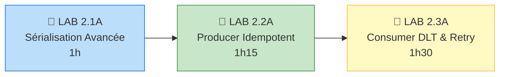
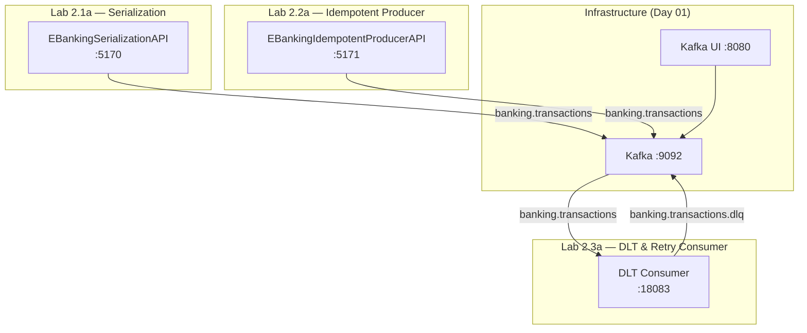

# Module 04 - Advanced Patterns - Formation Auto-rythmée

## Durée estimée

⏱️ **6 heures (journée complète)**

## Objectifs pédagogiques

À la fin de ce module, vous serez capable de :

1. ✅ Implémenter des **serializers typés** avec validation pré-envoi
2. ✅ Comprendre et gérer l'**évolution de schéma** (BACKWARD/FORWARD)
3. ✅ Activer l'**idempotence producer** et comprendre les transactions Kafka
4. ✅ Implémenter un **Dead Letter Topic** avec retries exponentiels
5. ✅ Gérer le **rebalancing** avec handlers granulaires

---

## 🧭 Parcours d'Apprentissage



**Progression** : Sérialisation → Idempotence → Consumer Production-Ready

---

## 📖 Structure du Module

Ce module contient 3 labs progressifs :

### LAB 2.1A : Sérialisation JSON Structurée & Intro Avro
**Durée** : 1 heure  
**Objectif** : Implémenter des serializers typés avec validation et démontrer l'évolution de schéma.

📁 [`lab-2.1a-serialization/`](./lab-2.1a-serialization/)

**Ce que vous allez apprendre** :
- `ISerializer<T>` et `IDeserializer<T>` Confluent.Kafka
- Validation de schéma côté producer avant envoi
- Évolution de schéma : BACKWARD et FORWARD compatibility
- Différence entre JSON string et serializer typé
- (Bonus) Introduction à Avro et Schema Registry

---

### LAB 2.2A : Producer Idempotent & Transactions
**Durée** : 1h15  
**Objectif** : Comprendre l'idempotence, les PIDs, et les transactions Kafka pour l'exactly-once semantics.

📁 [`lab-2.2-producer-advanced/`](./lab-2.2-producer-advanced/)

**Ce que vous allez apprendre** :
- `EnableIdempotence = true` et ses implications
- PID (Producer ID) et sequence numbers
- `Acks = All` forcé automatiquement
- Transactions Kafka et `IsolationLevel.ReadCommitted`
- Différence entre at-most-once, at-least-once, exactly-once

---

### LAB 2.3A : Consumer avec DLT, Retry & Rebalancing
**Durée** : 1h30  
**Objectif** : Implémenter un pattern consumer production-ready avec DLT, retries exponentiels, et rebalancing.

📁 [`lab-2.3a-consumer-dlt-retry/`](./lab-2.3a-consumer-dlt-retry/)

**Ce que vous allez apprendre** :
- `EnableAutoOffsetStore = false` + `StoreOffset()` + `Commit()`
- Dead Letter Topic (DLT) avec 7 headers de traçabilité
- Exponential backoff + jitter pour éviter thundering herd
- Rebalancing handlers : `Assigned`, `Revoked`, `Lost`
- `CooperativeSticky` vs `Eager` assignor

---

## 🚀 Prérequis

### Environnement

Vous devez avoir un cluster Kafka en fonctionnement. Deux options :

#### Option A : Docker (Développement local)
```bash
cd ../day-01-foundations/module-01-cluster
./scripts/up.sh
```

Vérifiez que Kafka est accessible :
```bash
docker ps | grep kafka
# Vous devez voir : kafka (healthy) et kafka-ui (healthy)
```

#### Option B : OKD/K3s/OpenShift (Production-like)

> ℹ️ Sur OpenShift/OKD, remplacez `kubectl` par `oc`.
```bash
kubectl get kafka -n kafka
# Attendu : bhf-kafka avec status Ready
```

#### Option C : OpenShift Developer Sandbox

Pour ce module, vous pouvez utiliser `kafka-svc:9092` directement depuis les pods.

### Outils de développement

**Visual Studio Code** :
- Extension C# Dev Kit
- Extension Docker (optionnel)

**Visual Studio 2022** :
- Workload ".NET Desktop Development"
- Workload "ASP.NET and web development"

### SDK .NET
```bash
dotnet --version
# Attendu : 8.0.x ou supérieur
```

---

## 📚 Ordre de Réalisation

Suivez les labs dans l'ordre :

1. **LAB 2.1A** → Sérialisation avancée
2. **LAB 2.2A** → Producer idempotent
3. **LAB 2.3A** → Consumer production-ready

Chaque lab contient :
- ✅ Un README détaillé avec instructions pas à pas
- ✅ Le code complet commenté
- ✅ Les fichiers de configuration
- ✅ Les commandes de test et validation
- ✅ Des exercices pratiques
- ✅ Déploiement sur 4 environnements (Local, Docker Compose, OpenShift, K8s)

---

## Architecture Day 02



---

## Quick Start

```bash
# Prérequis : infrastructure Kafka démarrée (Day 01)

# Lab 2.1a — Serialization
cd day-02-development/module-04-advanced-patterns/lab-2.1a-serialization/dotnet
dotnet run

# Lab 2.2a — Idempotent Producer
cd ../../lab-2.2-producer-advanced/dotnet
dotnet run

# Lab 2.3a — DLT & Retry Consumer
cd ../../lab-2.3a-consumer-dlt-retry/dotnet
dotnet run
```

---

## Ports

| Lab | Service | Port |
| --- | ------- | ---- |
| 2.1a | EBankingSerializationAPI | 5170 |
| 2.2a | EBankingIdempotentProducerAPI | 5171 |
| 2.3a | DLT Consumer | 18083 |

---

## Navigation

| Précédent | Suivant |
| --------- | ------- |
| [Day 01 — M03 Consumer](../../day-01-foundations/module-03-consumer/README.md) | [Day 03 — Intégration](../../day-03-integration/README.md) |