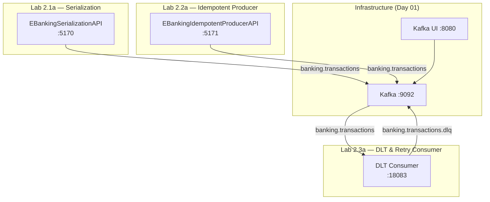

# Module 04 — Advanced Patterns

| Durée | Niveau | Prérequis |
| ----- | ------ | --------- |
| 6h (journée complète) | Intermédiaire → Avancé | Day 01 complété (M01-M03, Labs 1.2a–1.3c) |

---

## Objectifs pédagogiques

Ce module couvre les **3 blocs** du Day 02. Chaque bloc a son propre lab hands-on.

| Bloc | Lab | Titre | Nouveaux concepts (vs Day 01) |
| ---- | --- | ----- | ----------------------------- |
| 2.1 | [lab-2.1a](./lab-2.1a-serialization/README.md) | Sérialisation Avancée | `ISerializer<T>`, `IDeserializer<T>`, validation avant envoi, schema evolution (BACKWARD/FORWARD), intro Avro |
| 2.2 | [lab-2.2a](./lab-2.2-producer-advanced/README.md) | Producer Idempotent | `EnableIdempotence=true`, PID, sequence numbers, transactions Kafka, exactly-once semantics |
| 2.3 | [lab-2.3a](./lab-2.3a-consumer-dlt-retry/README.md) | Consumer DLT & Retry | DLT avec headers de traçabilité, backoff exponentiel + jitter, rebalancing handlers (Assigned/Revoked/Lost) |

> **Ce qui change par rapport au Day 01** :
> - Day 01 utilisait `string` pour la sérialisation → Day 02 introduit les **serializers typés**
> - Day 01 avait `EnableIdempotence = false` → Day 02 l'active et explique **pourquoi**
> - Day 01 lab 1.3c avait un DLQ basique → Day 02 ajoute **exponential backoff + jitter** et **rebalancing handlers**

---

## Architecture Day 02



---

## Quick Start

```bash
# Prérequis : infrastructure Kafka démarrée (Day 01)

# Lab 2.1a — Serialization
cd day-02-development/module-04-advanced-patterns/lab-2.1a-serialization/dotnet
dotnet run

# Lab 2.2a — Idempotent Producer
cd ../../lab-2.2-producer-advanced/dotnet
dotnet run

# Lab 2.3a — DLT & Retry Consumer
cd ../../lab-2.3a-consumer-dlt-retry/dotnet
dotnet run
```

---

## Ports

| Lab | Service | Port |
| --- | ------- | ---- |
| 2.1a | EBankingSerializationAPI | 5170 |
| 2.2a | EBankingIdempotentProducerAPI | 5171 |
| 2.3a | DLT Consumer | 18083 |

---

## Navigation

| Précédent | Suivant |
| --------- | ------- |
| [Day 01 — M03 Consumer](../../day-01-foundations/module-03-consumer/README.md) | [Day 03 — Intégration](../../day-03-integration/README.md) |