# 🔄 Module 04 - Patterns Avancés : DLT, Retries & Rebalancing

| Durée | Niveau | Prérequis |
|-------|--------|-----------|
| 3 heures | Intermédiaire | Modules 01-03 complétés |

## 🏦 Scénario E-Banking (suite)

Dans les modules précédents, vous avez construit un Producer et un Consumer pour traiter les transactions bancaires (`banking.transactions`). Dans ce module, vous allez renforcer la **résilience** de ce pipeline en ajoutant :

- Un **Dead Letter Topic** pour isoler les transactions qui échouent au traitement (montant invalide, client inconnu, etc.)
- Des **retries avec backoff exponentiel** pour les erreurs transitoires (timeout base de données, service de scoring indisponible)
- Le **rebalancing CooperativeSticky** pour scaler horizontalement le service de détection de fraude

> **Note** : Les labs pratiques utilisent un topic `orders` générique configurable via la variable d'environnement `KAFKA_TOPIC`. Les patterns appris s'appliquent directement à votre pipeline `banking.transactions`.

## � Objectifs d'apprentissage

À la fin de ce module, vous serez capable de :

- ✅ Implémenter un Dead Letter Topic (DLT) pour gérer les messages en erreur
- ✅ Configurer des stratégies de retry robustes avec Polly (.NET) ou Spring Retry (Java)
- ✅ Comprendre et gérer le rebalancing des consumer groups
- ✅ Implémenter des patterns de gestion d'erreurs professionnels
- ✅ Appliquer ces patterns à un pipeline de transactions bancaires

---

## 📚 Partie Théorique (30%)

### 1. Dead Letter Topics (DLT)

#### Concept

Un **Dead Letter Topic** est un topic spécial où sont envoyés les messages qui ne peuvent pas être traités après plusieurs tentatives. C'est un pattern essentiel pour la résilience des applications.

```mermaid
flowchart LR
    subgraph flow[" "]
        direction LR
        P["📤 Producer"] --> T["📦 Topic"]
        T --> C["⚙️ Consumer"]
        C --> D{OK?}
        D -->|✅| CO["Commit"]
        D -->|❌| R["Retry"]
        R -->|max| DLT["💀 DLT"]
        R -->|retry| C
    end
    style DLT fill:#ffcccc
    style CO fill:#ccffcc
```



#### Quand utiliser un DLT ?

| Situation | Avec DLT | Sans DLT |
|-----------|----------|----------|
| Message malformé | ✅ Isolé pour analyse | ❌ Bloque le consumer |
| Service externe down | ✅ Retry puis DLT | ❌ Perte ou blocage |
| Erreur de validation | ✅ Traçabilité | ❌ Message perdu |
| Bug applicatif | ✅ Replay possible | ❌ Données perdues |

#### Structure d'un message DLT

```json
{
  "originalTopic": "orders",
  "originalPartition": 2,
  "originalOffset": 12345,
  "originalKey": "order-123",
  "originalValue": "{...}",
  "errorMessage": "ValidationException: Invalid amount",
  "errorTimestamp": "2024-01-15T10:30:00Z",
  "retryCount": 3,
  "stackTrace": "..."
}
```

---

### 2. Stratégies de Retry

#### Types de Retry

```mermaid
flowchart TB
    subgraph strategies["STRATÉGIES DE RETRY"]
        direction TB
        subgraph s1["1️⃣ Immédiat"]
            A1["T1→T2→T3→DLT"]
        end
        subgraph s2["2️⃣ Fixe (1s)"]
            A2["T1─1s─T2─1s─T3"]
        end
        subgraph s3["3️⃣ Exponentiel ✅"]
            A3["T1─1s─T2─2s─T3─4s"]
        end
        subgraph s4["4️⃣ Expo+Jitter"]
            A4["T1─1s±─T2─2s±─T3"]
        end
    end
    style s3 fill:#e8f5e9
```



#### Configuration recommandée

```csharp
// Backoff exponentiel avec jitter (utilisant Polly)
var retryPolicy = Policy
    .Handle<KafkaException>(ex => ex.Error.IsFatal == false) // Erreurs transient uniquement
    .WaitAndRetryAsync(
        retryCount: 5,
        sleepDurationProvider: attempt =>
        {
            var baseDelay = TimeSpan.FromSeconds(Math.Pow(2, attempt - 1)); // 1s, 2s, 4s, 8s, 16s
            var maxDelay = TimeSpan.FromMinutes(5);
            var delay = baseDelay < maxDelay ? baseDelay : maxDelay;
            var jitter = TimeSpan.FromMilliseconds(Random.Shared.Next(0, (int)(delay.TotalMilliseconds * 0.2)));
            return delay + jitter;
        },
        onRetry: (exception, timespan, attempt, context) =>
        {
            logger.LogWarning("Retry {Attempt}/5 dans {Delay}ms : {Error}",
                attempt, timespan.TotalMilliseconds, exception.Message);
        });
```

#### Erreurs Retryables vs Non-Retryables

| Type | Exemples | Action |
|------|----------|--------|
| **Retryable** | Timeout réseau, Service indisponible, Rate limit | Retry avec backoff |
| **Non-Retryable** | Validation échouée, Message malformé, Auth failure | DLT immédiat |

---

### 3. Consumer Rebalancing

#### Qu'est-ce que le Rebalancing ?

Le **rebalancing** est le processus par lequel Kafka redistribue les partitions entre les consumers d'un même group lorsque :
- Un consumer rejoint le group
- Un consumer quitte le group (crash ou shutdown)
- Le nombre de partitions change

```mermaid
flowchart LR
    subgraph avant["AVANT"]
        C1["C1: P0,P1,P2"]
        C2["C2: P3,P4,P5"]
    end
    
    avant -->|"🔄"| apres
    
    subgraph apres["APRÈS"]
        C1B["C1: P0,P1"]
        C2B["C2: P2,P3"]
        C3B["C3: P4,P5"]
    end
    
    style C3B fill:#e8f5e9
```



> ⚠️ **PENDANT LE REBALANCING** : Aucun consumer ne traite de messages!

#### Stratégies d'assignation

| Stratégie | Description | Cas d'usage |
|-----------|-------------|-------------|
| **RangeAssignor** | Assignation par plage contiguë | Par défaut, simple |
| **RoundRobinAssignor** | Distribution équitable | Charge uniforme |
| **StickyAssignor** | Minimise les mouvements | Réduire le rebalancing |
| **CooperativeStickyAssignor** | Rebalancing incrémental | Production (recommandé) |

#### Callbacks de Rebalancing

```csharp
using var consumer = new ConsumerBuilder<string, string>(config)
    .SetPartitionsRevokedHandler((c, partitions) =>
    {
        // Appelé AVANT que les partitions soient retirées
        // → Commit les offsets, flush les buffers
        logger.LogInformation("Partitions révoquées: {Partitions}",
            string.Join(", ", partitions));
        c.Commit();
    })
    .SetPartitionsAssignedHandler((c, partitions) =>
    {
        // Appelé APRÈS que les nouvelles partitions sont assignées
        // → Initialiser l'état, seek si nécessaire
        logger.LogInformation("Partitions assignées: {Partitions}",
            string.Join(", ", partitions));
    })
    .Build();

consumer.Subscribe(topics);
```

---

### 4. Gestion d'erreurs professionnelle

#### Hiérarchie des erreurs Kafka

```mermaid
flowchart LR
    KE["KafkaException"] --> RP["🔄 Retriable"]
    KE --> FE["💀 Fatal"]
    
    RP --> R1["Timeout"]
    RP --> R2["Leader N/A"]
    RP --> R3["Rebalance"]
    
    FE --> F1["Auth fail"]
    FE --> F2["Bad config"]
    FE --> F3["Serialize err"]
    
    style RP fill:#fff3cd
    style FE fill:#ffcccc
```



| Type | Action |
|------|--------|
| **Retriable** | Retry avec backoff |
| **Fatal** | Fail fast → DLT |

#### Pattern de gestion d'erreurs complet

```csharp
async Task ProcessWithErrorHandlingAsync(
    ConsumeResult<string, string> result, 
    ILogger logger,
    int maxRetries = 3)
{
    int retryCount = 0;
    bool processed = false;

    while (!processed && retryCount < maxRetries)
    {
        try
        {
            // Traitement métier
            await ProcessRecordAsync(result);
            processed = true;
        }
        catch (Exception ex) when (IsTransient(ex))
        {
            // Erreur temporaire → retry
            retryCount++;
            logger.LogWarning("Retry {RetryCount}/{MaxRetries} pour offset {Offset}: {Error}",
                retryCount, maxRetries, result.Offset.Value, ex.Message);
            var delay = TimeSpan.FromSeconds(Math.Pow(2, retryCount - 1)
                        + Random.Shared.NextDouble());
            await Task.Delay(delay);
        }
        catch (Exception ex)
        {
            // Erreur permanente → DLT immédiat
            await SendToDltAsync(result, ex);
            processed = true;
        }
    }

    if (!processed)
    {
        // Max retries atteint → DLT
        await SendToDltAsync(result, new InvalidOperationException("Max retries exceeded"));
    }
}

bool IsTransient(Exception ex) => ex is TimeoutException
    or OperationCanceledException
    or KafkaException { Error.IsFatal: false };
```

---

## 🔌 Ports et Services

| Service | Port | Description |
|---------|------|-------------|
| Java API (Producer/Consumer) | 18082 | API avec DLT et retries |
| .NET API (Consumer) | 18083 | Consumer avec DLT, retries et rebalancing |
| Kafka UI | 8080 | Visualisation des topics |
| Kafka | 9092 | Broker externe |

### 🔷 Code .NET disponible

Le consumer .NET avec DLT, retry et rebalancing est disponible dans [`dotnet/Program.cs`](./dotnet/Program.cs). Il implémente :

- **Dead Letter Topic** : envoi des messages en erreur permanente vers `orders.DLT` avec headers de traçabilité
- **Retry avec backoff exponentiel + jitter** : erreurs transitoires retentées N fois avant DLT
- **Classification des erreurs** : transient (timeout, réseau) → retry, permanent (validation, JSON invalide) → DLT immédiat
- **Validation métier** : rejet des montants négatifs, JSON malformé
- `CooperativeSticky` partition assignment
- `SetPartitionsAssignedHandler` / `SetPartitionsRevokedHandler` / `SetPartitionsLostHandler`
- Manual commit après chaque message
- API REST : `/api/v1/stats`, `/api/v1/partitions`, `/api/v1/dlt/count`, `/api/v1/dlt/messages`

---

## 🛠️ Partie Pratique (70%)

### Prérequis

<details>
<summary>🐳 <b>Mode Docker</b></summary>

```bash
cd formation-v2/
./scripts/up.sh
```

</details>

<details>
<summary>☸️ <b>Mode OKD/K3s</b></summary>

```bash
# Vérifier que le cluster Kafka est prêt
kubectl get kafka -n kafka
kubectl get pods -n kafka -l strimzi.io/cluster=bhf-kafka
```

</details>

---

### Étape 1 - Démarrer le module

**Objectif** : Lancer les services du module.

<details>
<summary>🐳 <b>Mode Docker</b></summary>

```bash
docker compose -f day-02-development/module-04-advanced-patterns/docker-compose.module.yml up -d --build
```

**Vérification** :

```bash
docker ps --format 'table {{.Names}}\t{{.Status}}\t{{.Ports}}' | grep m04
```

</details>

<details>
<summary>☸️ <b>Mode OKD/K3s</b></summary>

```bash
# Builder et pousser les images vers le registry local
cd formation-v2/day-02-development/module-04-advanced-patterns

docker build -t localhost:5000/m04-java-api:latest -f java/Dockerfile java/
docker push localhost:5000/m04-java-api:latest

# Déployer sur K8s
cat <<EOF | kubectl apply -f -
apiVersion: apps/v1
kind: Deployment
metadata:
  name: m04-java-api
  namespace: kafka
spec:
  replicas: 1
  selector:
    matchLabels:
      app: m04-java-api
  template:
    metadata:
      labels:
        app: m04-java-api
    spec:
      containers:
      - name: java-api
        image: localhost:5000/m04-java-api:latest
        ports:
        - containerPort: 8080
        env:
        - name: KAFKA_BOOTSTRAP_SERVERS
          value: "bhf-kafka-kafka-bootstrap.kafka.svc:9092"
---
apiVersion: v1
kind: Service
metadata:
  name: m04-java-api
  namespace: kafka
spec:
  type: NodePort
  ports:
  - port: 8080
    targetPort: 8080
    nodePort: 31082
  selector:
    app: m04-java-api
EOF
```

**Vérification** :

```bash
kubectl get pods -n kafka -l app=m04-java-api
```

</details>

---

### Étape 2 - Créer les topics

**Objectif** : Créer le topic principal et le DLT.

<details>
<summary>🐳 <b>Mode Docker</b></summary>

```bash
# Topic principal
docker exec kafka kafka-topics --create \
  --topic orders \
  --partitions 6 \
  --replication-factor 1 \
  --bootstrap-server localhost:9092

# Dead Letter Topic
docker exec kafka kafka-topics --create \
  --topic orders.DLT \
  --partitions 3 \
  --replication-factor 1 \
  --bootstrap-server localhost:9092

# Topic de retry
docker exec kafka kafka-topics --create \
  --topic orders.retry \
  --partitions 3 \
  --replication-factor 1 \
  --bootstrap-server localhost:9092
```

**Vérification** :

```bash
docker exec kafka kafka-topics --list --bootstrap-server localhost:9092 | grep orders
```

</details>

<details>
<summary>☸️ <b>Mode OKD/K3s</b></summary>

```bash
# Créer les topics via KafkaTopic CRs
cat <<EOF | kubectl apply -f -
apiVersion: kafka.strimzi.io/v1beta2
kind: KafkaTopic
metadata:
  name: orders
  namespace: kafka
  labels:
    strimzi.io/cluster: bhf-kafka
spec:
  partitions: 6
  replicas: 3
---
apiVersion: kafka.strimzi.io/v1beta2
kind: KafkaTopic
metadata:
  name: orders.dlt
  namespace: kafka
  labels:
    strimzi.io/cluster: bhf-kafka
spec:
  partitions: 3
  replicas: 3
---
apiVersion: kafka.strimzi.io/v1beta2
kind: KafkaTopic
metadata:
  name: orders.retry
  namespace: kafka
  labels:
    strimzi.io/cluster: bhf-kafka
spec:
  partitions: 3
  replicas: 3
EOF
```

**Vérification** :

```bash
kubectl get kafkatopics -n kafka | grep orders
```

</details>

**Résultat attendu** :

```text
orders
orders.DLT
orders.retry
```

---

### Étape 3 - Lab 1 : Envoi de messages valides

**Objectif** : Vérifier le flux normal sans erreur.

<details>
<summary>🐳 <b>Mode Docker</b></summary>

```bash
# Envoyer 5 messages valides
for i in {1..5}; do
  curl -X POST "http://localhost:18082/api/v1/orders" \
    -H "Content-Type: application/json" \
    -d "{\"orderId\": \"ORD-$i\", \"amount\": $((i * 100)), \"status\": \"PENDING\"}"
  echo ""
done
```

**Vérification dans Kafka UI** :

1. Ouvrez http://localhost:8080
2. Cliquez sur **Topics** → **orders**
3. Vérifiez que 5 messages sont présents

</details>

<details>
<summary>☸️ <b>Mode OKD/K3s</b></summary>

```bash
# Envoyer 5 messages valides (NodePort 31082)
for i in {1..5}; do
  curl -X POST "http://localhost:31082/api/v1/orders" \
    -H "Content-Type: application/json" \
    -d "{\"orderId\": \"ORD-$i\", \"amount\": $((i * 100)), \"status\": \"PENDING\"}"
  echo ""
done
```

**Vérification via kubectl** :

```bash
kubectl run kafka-consumer --rm -it --restart=Never \
  --image=quay.io/strimzi/kafka:latest-kafka-4.0.0 \
  -n kafka -- bin/kafka-console-consumer.sh \
  --bootstrap-server bhf-kafka-kafka-bootstrap:9092 \
  --topic orders --from-beginning --max-messages 5
```

</details>

---

### Étape 4 - Lab 2 : Simulation d'erreurs et DLT

**Objectif** : Observer le comportement avec des messages invalides.

#### 4.1 Envoyer un message invalide (montant négatif)

<details>
<summary>🐳 <b>Mode Docker</b></summary>

```bash
curl -X POST "http://localhost:18082/api/v1/orders" \
  -H "Content-Type: application/json" \
  -d '{"orderId": "ORD-INVALID", "amount": -50, "status": "PENDING"}'
```

</details>

<details>
<summary>☸️ <b>Mode OKD/K3s</b></summary>

```bash
curl -X POST "http://localhost:31082/api/v1/orders" \
  -H "Content-Type: application/json" \
  -d '{"orderId": "ORD-INVALID", "amount": -50, "status": "PENDING"}'
```

</details>

**Résultat attendu** : Le message est rejeté et envoyé au DLT.

#### 4.2 Vérifier le DLT

<details>
<summary>🐳 <b>Mode Docker</b></summary>

```bash
docker exec kafka kafka-console-consumer \
  --topic orders.DLT \
  --from-beginning \
  --max-messages 1 \
  --bootstrap-server localhost:9092
```

</details>

<details>
<summary>☸️ <b>Mode OKD/K3s</b></summary>

```bash
kubectl run kafka-consumer --rm -it --restart=Never \
  --image=quay.io/strimzi/kafka:latest-kafka-4.0.0 \
  -n kafka -- bin/kafka-console-consumer.sh \
  --bootstrap-server bhf-kafka-kafka-bootstrap:9092 \
  --topic orders.dlt --from-beginning --max-messages 1
```

</details>

**Résultat attendu** : Message avec métadonnées d'erreur.

---

### Étape 5 - Lab 3 : Test des retries avec erreur transitoire

**Objectif** : Observer le mécanisme de retry.

#### 5.1 Activer le mode "erreur transitoire"

<details>
<summary>🐳 <b>Mode Docker</b></summary>

```bash
curl -X POST "http://localhost:18082/api/v1/config/simulate-transient-error?enabled=true"
```

</details>

<details>
<summary>☸️ <b>Mode OKD/K3s</b></summary>

```bash
curl -X POST "http://localhost:31082/api/v1/config/simulate-transient-error?enabled=true"
```

</details>

#### 5.2 Envoyer un message

<details>
<summary>🐳 <b>Mode Docker</b></summary>

```bash
curl -X POST "http://localhost:18082/api/v1/orders" \
  -H "Content-Type: application/json" \
  -d '{"orderId": "ORD-RETRY", "amount": 200, "status": "PENDING"}'
```

</details>

<details>
<summary>☸️ <b>Mode OKD/K3s</b></summary>

```bash
curl -X POST "http://localhost:31082/api/v1/orders" \
  -H "Content-Type: application/json" \
  -d '{"orderId": "ORD-RETRY", "amount": 200, "status": "PENDING"}'
```

</details>

#### 5.3 Observer les logs

<details>
<summary>🐳 <b>Mode Docker</b></summary>

```bash
docker logs m04-java-api --tail 50 | grep -E "(Retry|attempt|DLT)"
```

</details>

<details>
<summary>☸️ <b>Mode OKD/K3s</b></summary>

```bash
kubectl logs -n kafka -l app=m04-java-api --tail 50 | grep -E "(Retry|attempt|DLT)"
```

</details>

**Résultat attendu** : Plusieurs tentatives avant succès ou DLT.

#### 5.4 Désactiver le mode erreur

<details>
<summary>🐳 <b>Mode Docker</b></summary>

```bash
curl -X POST "http://localhost:18082/api/v1/config/simulate-transient-error?enabled=false"
```

</details>

<details>
<summary>☸️ <b>Mode OKD/K3s</b></summary>

```bash
curl -X POST "http://localhost:31082/api/v1/config/simulate-transient-error?enabled=false"
```

</details>

---

### Étape 6 - Lab 4 : Observer le Rebalancing

**Objectif** : Voir le rebalancing en action.

#### 6.1 Démarrer un second consumer

<details>
<summary>🐳 <b>Mode Docker</b></summary>

```bash
docker compose -f day-02-development/module-04-advanced-patterns/docker-compose.module.yml \
  up -d --scale dotnet-consumer=2
```

</details>

<details>
<summary>☸️ <b>Mode OKD/K3s</b></summary>

```bash
kubectl scale deployment m04-java-api -n kafka --replicas=2
```

</details>

#### 6.2 Observer les logs de rebalancing

<details>
<summary>🐳 <b>Mode Docker</b></summary>

```bash
docker logs m04-dotnet-consumer-1 --tail 20 | grep -i rebalance
docker logs m04-dotnet-consumer-2 --tail 20 | grep -i rebalance
```

</details>

<details>
<summary>☸️ <b>Mode OKD/K3s</b></summary>

```bash
kubectl logs -n kafka -l app=m04-java-api --tail 20 | grep -i rebalance
```

</details>

#### 6.3 Envoyer des messages pendant le rebalancing

<details>
<summary>🐳 <b>Mode Docker</b></summary>

```bash
for i in {1..10}; do
  curl -X POST "http://localhost:18082/api/v1/orders" \
    -H "Content-Type: application/json" \
    -d "{\"orderId\": \"ORD-REBAL-$i\", \"amount\": 100, \"status\": \"PENDING\"}"
done
```

</details>

<details>
<summary>☸️ <b>Mode OKD/K3s</b></summary>

```bash
for i in {1..10}; do
  curl -X POST "http://localhost:31082/api/v1/orders" \
    -H "Content-Type: application/json" \
    -d "{\"orderId\": \"ORD-REBAL-$i\", \"amount\": 100, \"status\": \"PENDING\"}"
done
```

</details>

#### 6.4 Arrêter un consumer pour déclencher un rebalancing

<details>
<summary>🐳 <b>Mode Docker</b></summary>

```bash
docker stop m04-dotnet-consumer-2
```

</details>

<details>
<summary>☸️ <b>Mode OKD/K3s</b></summary>

```bash
kubectl scale deployment m04-java-api -n kafka --replicas=1
```

</details>

**Observer** : Les logs du consumer 1 montrent la réassignation des partitions.

---

### Étape 7 - Lab 5 : Monitoring des erreurs

**Objectif** : Utiliser les endpoints de monitoring.

<details>
<summary>🐳 <b>Mode Docker</b></summary>

```bash
# Statistiques des erreurs
curl -s http://localhost:18082/api/v1/stats | jq

# Messages dans le DLT
curl -s http://localhost:18082/api/v1/dlt/count

# Health check
curl -s http://localhost:18082/health
```

</details>

<details>
<summary>☸️ <b>Mode OKD/K3s</b></summary>

```bash
# Statistiques des erreurs (NodePort 31082)
curl -s http://localhost:31082/api/v1/stats | jq

# Messages dans le DLT
curl -s http://localhost:31082/api/v1/dlt/count

# Health check
curl -s http://localhost:31082/health
```

</details>

---

## ✅ Checkpoint de validation

Cochez chaque élément complété :

- [ ] Topic `orders` créé avec 6 partitions
- [ ] Topic `orders.DLT` créé
- [ ] Messages valides traités correctement
- [ ] Message invalide routé vers DLT
- [ ] Retries observés dans les logs
- [ ] Rebalancing déclenché et observé
- [ ] Statistiques d'erreurs consultées

---

## ☁️ Déploiement sur OpenShift Sandbox

Si vous utilisez le **Red Hat Developer Sandbox** au lieu de Docker local ou K3s, suivez ces étapes pour déployer les deux services du module.

### 1. Créer les topics sur le Sandbox

```bash
oc exec kafka-0 -- /opt/kafka/bin/kafka-topics.sh \
  --bootstrap-server localhost:9092 \
  --create --if-not-exists --topic orders --partitions 6 --replication-factor 3

oc exec kafka-0 -- /opt/kafka/bin/kafka-topics.sh \
  --bootstrap-server localhost:9092 \
  --create --if-not-exists --topic orders.DLT --partitions 3 --replication-factor 3

oc exec kafka-0 -- /opt/kafka/bin/kafka-topics.sh \
  --bootstrap-server localhost:9092 \
  --create --if-not-exists --topic orders.retry --partitions 3 --replication-factor 3
```

### 2. Déployer l'API Java (Producer + DLT)

```bash
cd day-02-development/module-04-advanced-patterns/java

oc new-build java:17 --binary=true --name=m04-java-api
oc start-build m04-java-api --from-dir=. --follow
oc new-app m04-java-api

oc set env deployment/m04-java-api \
  KAFKA_BOOTSTRAP_SERVERS="kafka-svc:9092" \
  KAFKA_TOPIC="orders" \
  KAFKA_DLT_TOPIC="orders.DLT" \
  KAFKA_RETRY_TOPIC="orders.retry" \
  MAX_RETRIES="3" \
  RETRY_BACKOFF_MS="1000" \
  SERVER_PORT="8080"

oc expose svc/m04-java-api
```

### 3. Déployer le Consumer .NET (Rebalancing)

```bash
cd ../dotnet

oc new-build dotnet:8.0-ubi8 --binary=true --name=m04-dotnet-consumer
oc start-build m04-dotnet-consumer --from-dir=. --follow
oc new-app m04-dotnet-consumer

oc set env deployment/m04-dotnet-consumer \
  KAFKA_BOOTSTRAP_SERVERS="kafka-svc:9092" \
  KAFKA_TOPIC="orders" \
  KAFKA_GROUP_ID="orders-consumer-group" \
  KAFKA_AUTO_OFFSET_RESET="earliest" \
  ASPNETCORE_URLS="http://0.0.0.0:8080"

oc expose svc/m04-dotnet-consumer
```

### 4. Tester sur le Sandbox

```bash
# URLs publiques
JAVA_HOST=$(oc get route m04-java-api -o jsonpath='{.spec.host}')
DOTNET_HOST=$(oc get route m04-dotnet-consumer -o jsonpath='{.spec.host}')

# Envoyer un message valide
curl -s -X POST "https://$JAVA_HOST/api/v1/orders" \
  -H "Content-Type: application/json" \
  -d '{"orderId": "ORD-1", "amount": 100, "status": "PENDING"}' | jq .

# Envoyer un message invalide (→ DLT)
curl -s -X POST "https://$JAVA_HOST/api/v1/orders" \
  -H "Content-Type: application/json" \
  -d '{"orderId": "ORD-INVALID", "amount": -50, "status": "PENDING"}' | jq .

# Statistiques du consumer .NET
curl -s "https://$DOTNET_HOST/api/v1/stats" | jq .

# Vérifier le DLT
oc exec kafka-0 -- /opt/kafka/bin/kafka-console-consumer.sh \
  --bootstrap-server localhost:9092 \
  --topic orders.DLT --from-beginning --max-messages 5
```

### 5. Observer le Rebalancing sur le Sandbox

```bash
# Scaler à 2 replicas
oc scale deployment/m04-dotnet-consumer --replicas=2

# Observer les logs de rebalancing
oc logs -l deployment=m04-dotnet-consumer --tail=20 | grep -i rebalance

# Revenir à 1 replica
oc scale deployment/m04-dotnet-consumer --replicas=1
```

---

## 🔧 Troubleshooting

### Consumer bloqué

**Symptôme** : Pas de traitement des messages.

```bash
# Vérifier le lag
docker exec kafka kafka-consumer-groups \
  --describe --group orders-consumer-group \
  --bootstrap-server localhost:9092
```

### DLT vide alors qu'il devrait y avoir des erreurs

**Symptôme** : Pas de messages dans le DLT.

```bash
# Vérifier les logs
docker logs m04-java-api --tail 100 | grep -i error
```

### Rebalancing trop fréquent

**Symptôme** : Logs montrant des rebalancing constants.

**Cause possible** : `session.timeout.ms` trop court.

---

## 🧹 Nettoyage

```bash
docker compose -f day-02-development/module-04-advanced-patterns/docker-compose.module.yml down

# Supprimer les topics (optionnel)
docker exec kafka kafka-topics --delete --topic orders --bootstrap-server localhost:9092
docker exec kafka kafka-topics --delete --topic orders.DLT --bootstrap-server localhost:9092
docker exec kafka kafka-topics --delete --topic orders.retry --bootstrap-server localhost:9092
```

---

## 📖 Pour aller plus loin

### Exercices supplémentaires

1. **Configurez un backoff exponentiel** avec un maximum de 5 minutes
2. **Ajoutez un circuit breaker** pour les erreurs répétées
3. **Implémentez un DLT processor** qui retraite automatiquement les erreurs corrigibles

### Ressources

- [Error Handling in Kafka](https://docs.confluent.io/platform/current/clients/consumer.html#error-handling)
- [Consumer Rebalance Protocol](https://cwiki.apache.org/confluence/display/KAFKA/KIP-429%3A+Kafka+Consumer+Incremental+Rebalance+Protocol)
- [Dead Letter Queue Pattern](https://www.enterpriseintegrationpatterns.com/patterns/messaging/DeadLetterChannel.html)

---

## 🛠️ Tutorials pas-à-pas

| IDE | Tutorial | Description |
|-----|----------|-------------|
| **VS Code** | [TUTORIAL-DOTNET.md](./TUTORIAL-DOTNET.md) | DLT, Retry avec Polly, Batch |
| **Visual Studio 2022** | [TUTORIAL-VS2022.md](./TUTORIAL-VS2022.md) | Projet complet avec Circuit Breaker, debugging |
| **IntelliJ / VS Code** | [TUTORIAL-JAVA.md](./TUTORIAL-JAVA.md) | Spring Kafka avec RetryTemplate |
