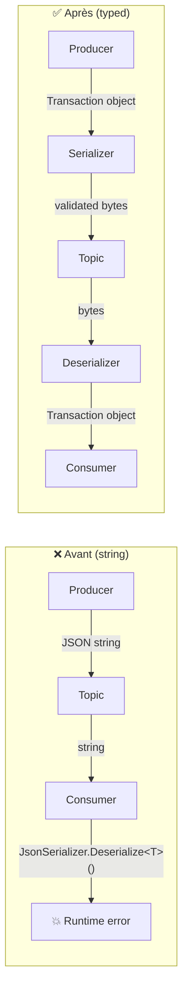
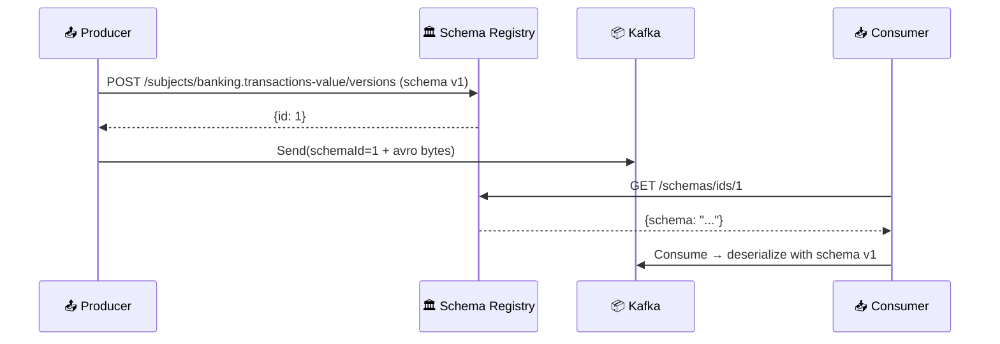

# 🔄 Bloc 2.1 — Sérialisation Avancée

| Durée | Théorie | Lab | Prérequis |
| ----- | ------- | --- | --------- |
| 1h | 20 min | 40 min | Day 01 complété, topic `banking.transactions` existant |

---

## 🏦 Scénario E-Banking (suite)

Dans le Day 01, vos producers et consumers utilisaient `string` pour sérialiser les transactions bancaires en JSON brut. Cela fonctionne mais pose des problèmes en production :

- ❌ **Pas de validation** : un producer peut envoyer n'importe quel JSON
- ❌ **Évolution fragile** : ajouter un champ casse les consumers existants
- ❌ **Performance** : JSON est verbeux (~2x plus gros qu'Avro)
- ❌ **Pas de contrat** : aucune garantie de compatibilité entre producer et consumer

Dans ce lab, vous allez **typer** la sérialisation et découvrir comment résoudre ces problèmes.

---

## 🎯 Objectifs d'apprentissage

- ✅ Implémenter un **serializer/deserializer JSON typé** pour `Transaction`
- ✅ Ajouter une **validation de schéma** côté producer
- ✅ Démontrer le **problème d'évolution de schéma** avec JSON brut
- ✅ Comprendre les **stratégies de compatibilité** (BACKWARD, FORWARD, FULL)
- ✅ (Bonus) Configurer **Avro avec Schema Registry**

---

## 📚 Partie Théorique (20 min)

### 1. Pourquoi typer la sérialisation ?



### 2. Custom Serializer en Confluent.Kafka

L'interface `ISerializer<T>` / `IDeserializer<T>` de Confluent.Kafka permet d'injecter votre propre logique :

```csharp
public class TransactionJsonSerializer : ISerializer<Transaction>
{
    public byte[] Serialize(Transaction data, SerializationContext context)
    {
        // Validate before serializing
        ValidateTransaction(data);
        return JsonSerializer.SerializeToUtf8Bytes(data, _jsonOptions);
    }
}

public class TransactionJsonDeserializer : IDeserializer<Transaction>
{
    public Transaction Deserialize(ReadOnlySpan<byte> data, bool isNull, SerializationContext context)
    {
        if (isNull) throw new ArgumentNullException("Null message value");
        return JsonSerializer.Deserialize<Transaction>(data, _jsonOptions)
            ?? throw new InvalidOperationException("Deserialization returned null");
    }
}
```

### 3. Évolution de schéma — Le problème

```text
Version 1 (Day 01):
{
  "transactionId": "TX-001",
  "customerId": "CUST-001",
  "amount": 1500.00,
  "currency": "EUR"
}

Version 2 (Day 02 — nouveau champ):
{
  "transactionId": "TX-001",
  "customerId": "CUST-001",
  "amount": 1500.00,
  "currency": "EUR",
  "riskScore": 0.85          ← NOUVEAU
}

Question : un Consumer v1 peut-il lire un message v2 ?
→ Avec JSON + JsonSerializerOptions.DefaultIgnoreCondition : OUI ✅
→ Avec un deserializer strict qui rejette les champs inconnus : NON ❌
```

### 4. Schema Registry — La solution production

| Composant | Rôle |
| --------- | ---- |
| **Schema Registry** | Service HTTP qui stocke et versionne les schémas |
| **Avro** | Format binaire compact avec schéma intégré |
| **Compatibility check** | Vérifie BACKWARD/FORWARD/FULL avant d'accepter un nouveau schéma |



---

## 🛠️ Partie Pratique — Lab 2.1 (40 min)

### Étape 1 : Explorer le projet

```bash
cd day-02-development/module-04-advanced-patterns/lab-2.1a-serialization/dotnet
```

Le projet est une **ASP.NET Web API** avec Swagger :

```text
EBankingSerializationAPI/
├── SerializationLab.csproj
├── Program.cs                          # ASP.NET setup + Swagger + health check
├── Controllers/
│   └── TransactionsController.cs        # REST endpoints (v1, v2, schema-info, consumed, metrics)
├── Services/
│   ├── SerializationProducerService.cs  # Typed producer with ISerializer<Transaction>
│   └── SchemaEvolutionConsumerService.cs # Background consumer (v1 deserializer)
├── Models/
│   └── Transaction.cs                   # Transaction v1 + TransactionV2 models
├── Serializers/
│   ├── TransactionJsonSerializer.cs     # ISerializer<Transaction> with validation
│   └── TransactionJsonDeserializer.cs   # IDeserializer<Transaction> (BACKWARD compat)
├── Dockerfile
├── appsettings.json
└── requests.http                       # VS Code REST Client test requests
```

### Étape 2 : Lancer l'API

```bash
dotnet run
# Swagger UI : http://localhost:5170/swagger
```

### Endpoints

| Méthode | Endpoint | Description |
| ------- | -------- | ----------- |
| `POST` | `/api/transactions` | Send v1 transaction (typed `ISerializer<Transaction>` + validation) |
| `POST` | `/api/transactions/v2` | Send v2 transaction (with `riskScore`, `sourceChannel`) |
| `GET` | `/api/transactions/schema-info` | Show schema v1/v2 structure and compatibility info |
| `GET` | `/api/transactions/consumed` | List messages consumed by the background v1 consumer |
| `GET` | `/api/transactions/metrics` | Producer + consumer serialization metrics |
| `GET` | `/health` | Health check |

### Étape 3 : Envoyer une transaction v1 (validée)

```bash
# Valid transaction — serializer validates then sends to Kafka
curl -X POST http://localhost:5170/api/transactions \
  -H "Content-Type: application/json" \
  -d '{
    "customerId": "CUST-001",
    "fromAccount": "FR7630001000123456789",
    "toAccount": "FR7630001000987654321",
    "amount": 1500.00,
    "currency": "EUR",
    "type": 1
  }'
```

**Réponse attendue** :

```json
{
  "status": "Produced",
  "transactionId": "TX-a1b2c3d4",
  "partition": 3,
  "offset": 42,
  "schemaVersion": 1
}
```

```bash
# Invalid transaction (amount < 0) — REJECTED by serializer BEFORE Kafka
curl -X POST http://localhost:5170/api/transactions \
  -H "Content-Type: application/json" \
  -d '{"customerId":"CUST-002","fromAccount":"FR76300","toAccount":"FR76301","amount":-50,"currency":"EUR","type":1}'
```

**Réponse attendue** : `400 Bad Request` with `"status": "RejectedByValidation"`

**Point clé** : la transaction invalide est rejetée **avant** l'envoi à Kafka grâce au serializer typé.

### Étape 4 : Démontrer l'évolution de schéma (v1 → v2)

```bash
# Send a v2 transaction with riskScore (new field)
curl -X POST http://localhost:5170/api/transactions/v2 \
  -H "Content-Type: application/json" \
  -d '{
    "customerId": "CUST-003",
    "fromAccount": "FR7630001000123456789",
    "toAccount": "FR7630001000987654321",
    "amount": 2500.00,
    "currency": "EUR",
    "type": 1,
    "riskScore": 0.85,
    "sourceChannel": "mobile-app"
  }'
```

Maintenant, vérifiez que le **consumer v1** (background service) a lu le message v2 :

```bash
curl -s http://localhost:5170/api/transactions/consumed | jq .
```

**Résultat attendu** : le consumer v1 lit le message v2 et **ignore `riskScore`** → BACKWARD compatible ✅

### Étape 5 : Inspecter les schémas et métriques

```bash
# Schema info — shows v1/v2 field differences and compatibility rules
curl -s http://localhost:5170/api/transactions/schema-info | jq .

# Metrics — serialization counts, errors, schema versions seen
curl -s http://localhost:5170/api/transactions/metrics | jq .
```

### Étape 6 : Exercices

1. **Modifier le serializer** : ouvrez `TransactionJsonSerializer.cs` et ajoutez une validation rejetant les transactions > 1 000 000 EUR
2. **Vérifier les headers** : dans Kafka UI (`http://localhost:8080`), ouvrez le topic `banking.transactions` et inspectez les headers `schema-version` et `serializer`
3. **Tester la compatibilité FORWARD** : envoyez un message v1, puis vérifiez dans `/api/transactions/consumed` que le consumer v1 l'a lu correctement
4. **Comparer avec Day 01** : envoyez un JSON brut mal formé (champ manquant) et observez la différence de comportement vs Day 01 (pas de validation)

### Étape 7 (Bonus) : Schema Registry avec Avro

> ⚠️ Ce bonus nécessite un Schema Registry en cours d'exécution (Docker).

```bash
# Ajouter Schema Registry au docker-compose
docker compose -f docker-compose.schema-registry.yml up -d
```

```csharp
// NuGet: Confluent.SchemaRegistry.Serdes.Avro
using var producer = new ProducerBuilder<string, Transaction>(producerConfig)
    .SetValueSerializer(new AvroSerializer<Transaction>(schemaRegistry))
    .Build();
```

---

## � Déploiement Automatisé (Scripts)

> **Recommandé pour OpenShift Sandbox** : Utilisez les scripts de déploiement automatisés pour un déploiement rapide et testé.

### Bash (Linux/macOS/WSL)

```bash
# Déploiement complet avec validation
cd day-02-development/scripts
./bash/deploy-and-test-2.1a.sh --token=<TOKEN> --server=<SERVER>

# Déploiement sans tests (plus rapide)
./bash/deploy-and-test-2.1a.sh --token=<TOKEN> --server=<SERVER> --skip-tests
```

### PowerShell (Windows)

```powershell
# Déploiement complet avec validation
cd day-02-development\scripts
.\powershell\deploy-and-test-2.1a.ps1 -Token <TOKEN> -Server <SERVER>

# Déploiement sans tests (plus rapide)
.\powershell\deploy-and-test-2.1a.ps1 -Token <TOKEN> -Server <SERVER> -SkipTests
```

### Ce que fait le script

1. ✅ **Login OpenShift** avec votre token et serveur
2. ✅ **Build S2I** : `oc new-build` + `oc start-build`
3. ✅ **Déploiement** : `oc new-app` avec variables d'environnement
4. ✅ **Route sécurisée** : `oc create route edge`
5. ✅ **Validation** : Tests automatiques des objectifs du lab
6. ✅ **Rapport** : URLs d'accès et commandes de vérification

> **Note** : Les scripts utilisent les mêmes commandes manuelles que dans les sections ci-dessous, mais de manière automatisée avec validation.

---

## �🐳 Déploiement Docker Compose

```bash
# Depuis la racine du module M04
cd day-02-development/module-04-advanced-patterns

# Démarrer uniquement le lab 2.1a
docker compose -f docker-compose.module.yml up -d --build serialization-api

# Vérifier
docker logs m04-serialization-api --tail 10
```

**Accès** : `http://localhost:5170/swagger`

```bash
# Tester
curl -s http://localhost:5170/health
curl -s -X POST http://localhost:5170/api/transactions \
  -H "Content-Type: application/json" \
  -d '{"customerId":"CUST-001","fromAccount":"FR7630001000123456789","toAccount":"FR7630001000987654321","amount":1500.00,"currency":"EUR","type":1}' | jq .
```

```bash
# Arrêter
docker compose -f docker-compose.module.yml down serialization-api
```

---

## ☁️ Déploiement sur OpenShift Sandbox

> **🎯 Objectif** : Ce déploiement valide les concepts de **sérialisation avancée** dans un environnement cloud :
> - **`ISerializer<T>`** : le serializer typé valide et sérialise les transactions avant envoi
> - **`IDeserializer<T>`** : le deserializer reconstruit un objet `Transaction` depuis les bytes Kafka
> - **Schema evolution** : un consumer v1 lit des messages v2 (BACKWARD compatible)
> - **Validation pré-envoi** : les transactions invalides sont rejetées AVANT Kafka

### 1. Préparer le Build et le Déploiement

```bash
cd day-02-development/module-04-advanced-patterns/lab-2.1a-serialization/dotnet

# Créer une build binaire pour .NET 8
oc new-build dotnet:8.0-ubi8 --binary=true --name=ebanking-serialization-api

# Lancer la build en envoyant le dossier courant
oc start-build ebanking-serialization-api --from-dir=. --follow

# Créer l'application
oc new-app ebanking-serialization-api
```

### 2. Configurer les variables d'environnement

```bash
oc set env deployment/ebanking-serialization-api \
  Kafka__BootstrapServers=kafka-svc:9092 \
  Kafka__Topic=banking.transactions \
  Kafka__GroupId=serialization-lab-consumer \
  ASPNETCORE_URLS=http://0.0.0.0:8080 \
  ASPNETCORE_ENVIRONMENT=Development
```

### 3. Exposer publiquement (Secure Edge Route)

> [!IMPORTANT]
> Standard routes may hang on the Sandbox. Use an **edge route** for reliable public access.

```bash
oc create route edge ebanking-serialization-api-secure --service=ebanking-serialization-api --port=8080-tcp
```

### 4. Tester l'API déployée

```bash
# Obtenir l'URL publique
URL=$(oc get route ebanking-serialization-api-secure -o jsonpath='{.spec.host}')
echo "https://$URL/swagger"

# Health check
curl -k -i "https://$URL/health"

# Send a v1 transaction (typed serializer + validation)
curl -k -s -X POST "https://$URL/api/transactions" \
  -H "Content-Type: application/json" \
  -d '{"customerId":"CUST-001","fromAccount":"FR7630001000123456789","toAccount":"FR7630001000987654321","amount":1500.00,"currency":"EUR","type":1}' | jq .

# Send a v2 transaction (schema evolution)
curl -k -s -X POST "https://$URL/api/transactions/v2" \
  -H "Content-Type: application/json" \
  -d '{"customerId":"CUST-002","fromAccount":"FR7630001000123456789","toAccount":"FR7630001000987654321","amount":2500.00,"currency":"EUR","type":1,"riskScore":0.85,"sourceChannel":"mobile-app"}' | jq .

# Verify consumer v1 reads v2 messages (BACKWARD compatible)
curl -k -s "https://$URL/api/transactions/consumed" | jq .

# Check schema info
curl -k -s "https://$URL/api/transactions/schema-info" | jq .

# Metrics
curl -k -s "https://$URL/api/transactions/metrics" | jq .
```

### 5. ✅ Success Criteria — Deployment

```bash
# Pod running?
oc get pod -l deployment=ebanking-serialization-api
# Expected: STATUS=Running, READY=1/1

# API reachable?
curl -k -s "https://$(oc get route ebanking-serialization-api-secure -o jsonpath='{.spec.host}')/health" | jq .
# Expected: Healthy

# Serializer validates? (invalid amount → 400)
curl -k -s -X POST "https://$(oc get route ebanking-serialization-api-secure -o jsonpath='{.spec.host}')/api/transactions" \
  -H "Content-Type: application/json" \
  -d '{"customerId":"CUST-X","fromAccount":"FR76","toAccount":"FR76","amount":-50,"currency":"EUR","type":1}'
# Expected: 400 Bad Request, status=RejectedByValidation
```

---

## 🖥️ Déploiement Local OpenShift (CRC / OpenShift Local)

Si vous disposez d'un cluster **OpenShift Local** (anciennement CRC — CodeReady Containers), vous pouvez déployer l'API directement depuis votre machine.

### 1. Prérequis

```bash
# Vérifier que le cluster est démarré
crc status

# Se connecter au cluster
oc login -u developer https://api.crc.testing:6443
oc project ebanking-labs
```

### 2. Build et Déploiement (Binary Build)

```bash
cd day-02-development/module-04-advanced-patterns/lab-2.1a-serialization/dotnet

oc new-build dotnet:8.0-ubi8 --binary=true --name=ebanking-serialization-api
oc start-build ebanking-serialization-api --from-dir=. --follow
oc new-app ebanking-serialization-api
```

### 3. Configurer les variables d'environnement

```bash
oc set env deployment/ebanking-serialization-api \
  Kafka__BootstrapServers=kafka-svc:9092 \
  Kafka__Topic=banking.transactions \
  Kafka__GroupId=serialization-lab-consumer \
  ASPNETCORE_URLS=http://0.0.0.0:8080 \
  ASPNETCORE_ENVIRONMENT=Development
```

### 4. Exposer et tester

```bash
# Créer une route edge
oc create route edge ebanking-serialization-api-secure --service=ebanking-serialization-api --port=8080-tcp

# Obtenir l'URL
URL=$(oc get route ebanking-serialization-api-secure -o jsonpath='{.spec.host}')
echo "https://$URL/swagger"

# Tester
curl -k -i "https://$URL/health"
```

### 5. Alternative : Déploiement par manifeste YAML

```bash
sed "s/\${NAMESPACE}/ebanking-labs/g" deployment/openshift-deployment.yaml | oc apply -f -
```

---

## ☸️ Déploiement Kubernetes / OKD (K3s, K8s, OKD)

Pour un cluster **Kubernetes standard** (K3s, K8s, Minikube) ou **OKD**, utilisez les manifestes YAML fournis dans le dossier `deployment/`.

### 1. Construire l'image Docker

```bash
cd day-02-development/module-04-advanced-patterns/lab-2.1a-serialization/dotnet

# Build de l'image
docker build -t ebanking-serialization-api:latest .

# Pour un registry distant (adapter l'URL du registry)
docker tag ebanking-serialization-api:latest <registry>/ebanking-serialization-api:latest
docker push <registry>/ebanking-serialization-api:latest
```

> **K3s / Minikube** : Si vous utilisez un cluster local, l'image locale suffit avec `imagePullPolicy: IfNotPresent`.

### 2. Déployer les manifestes

```bash
# Appliquer le Deployment + Service + Ingress
kubectl apply -f deployment/k8s-deployment.yaml

# Vérifier le déploiement
kubectl get pods -l app=ebanking-serialization-api
kubectl get svc ebanking-serialization-api
```

### 3. Configurer le Kafka Bootstrap (si différent)

```bash
kubectl set env deployment/ebanking-serialization-api \
  Kafka__BootstrapServers=<kafka-bootstrap>:9092
```

### 4. Accéder à l'API

```bash
# Port-forward pour accès local
kubectl port-forward svc/ebanking-serialization-api 8080:8080

# Tester
curl http://localhost:8080/health
curl http://localhost:8080/swagger/index.html
```

> **Ingress** : Si vous avez un Ingress Controller (nginx, traefik), ajoutez `ebanking-serialization-api.local` à votre fichier `/etc/hosts` pointant vers l'IP du cluster.

### 5. 🧪 Validation des concepts (K8s)

```bash
# Send v1 transaction (port-forward actif sur 8080)
curl -s -X POST "http://localhost:8080/api/transactions" \
  -H "Content-Type: application/json" \
  -d '{"customerId":"CUST-001","fromAccount":"FR7630001000123456789","toAccount":"FR7630001000987654321","amount":1500.00,"currency":"EUR","type":1}' | jq .

# Send v2 transaction (schema evolution)
curl -s -X POST "http://localhost:8080/api/transactions/v2" \
  -H "Content-Type: application/json" \
  -d '{"customerId":"CUST-002","fromAccount":"FR7630001000123456789","toAccount":"FR7630001000987654321","amount":2500.00,"currency":"EUR","type":1,"riskScore":0.85,"sourceChannel":"mobile-app"}' | jq .

# Verify BACKWARD compatibility — consumer v1 reads v2
curl -s "http://localhost:8080/api/transactions/consumed" | jq .

# Schema info
curl -s "http://localhost:8080/api/transactions/schema-info" | jq .

# Metrics
curl -s "http://localhost:8080/api/transactions/metrics" | jq .
```

> **Docker Compose** : Si Kafka tourne via Docker Compose, utilisez `docker exec kafka ...` au lieu de `kubectl exec kafka-0 ...`.

### 6. OKD : Utiliser les manifestes OpenShift

```bash
sed "s/\${NAMESPACE}/$(oc project -q)/g" deployment/openshift-deployment.yaml | oc apply -f -
```

---

## 🔧 Troubleshooting

| Symptom | Probable Cause | Solution |
| ------- | -------------- | -------- |
| Pod CrashLoopBackOff | Missing env vars or Kafka DNS error | Check: `oc set env deployment/ebanking-serialization-api --list` |
| `400 Bad Request` on valid tx | Serializer validation too strict | Check `TransactionJsonSerializer.cs` validation rules |
| Consumer shows 0 messages | Consumer not started or wrong offset | Verify `AutoOffsetReset = Earliest` in consumer config |
| Swagger not accessible | Wrong `ASPNETCORE_URLS` | Set: `ASPNETCORE_URLS=http://0.0.0.0:8080` |
| Route returns 503/504 | Pod not ready or wrong port | Check: `oc get pods`, verify route targets port `8080-tcp` |

---

## ✅ Checkpoint de validation

- [ ] Le serializer typé valide les transactions avant envoi
- [ ] Le deserializer typé reconstruit un objet `Transaction` à partir des bytes
- [ ] L'ajout d'un champ optionnel (v2) est compatible BACKWARD avec un consumer v1
- [ ] Vous comprenez la différence entre JSON string et serializer typé
- [ ] (Bonus) Schema Registry accepte votre schéma Avro

---

## 📖 Points à retenir

| Concept | Détail |
| ------- | ------ |
| **`ISerializer<T>`** | Interface Confluent.Kafka pour sérialisation custom |
| **`IDeserializer<T>`** | Interface Confluent.Kafka pour désérialisation custom |
| **Validation côté producer** | Rejeter les messages invalides AVANT envoi à Kafka |
| **BACKWARD compatible** | Nouveau consumer lit ancien format (ajouter champ optionnel) |
| **FORWARD compatible** | Ancien consumer lit nouveau format (ignorer champs inconnus) |
| **Schema Registry** | Service centralisé de gestion des schémas (production) |

---

## ➡️ Suite

👉 **[Bloc 2.2 — Producer Patterns Avancés](../lab-2.2-producer-advanced/README.md)**
