# LAB 2.1A : API Sérialisation Avancée - E-Banking Transactions

## ⏱️ Durée estimée : 45 minutes

## 🏦 Contexte E-Banking

Dans une banque moderne, chaque transaction doit être **sérialisée de manière fiable** pour garantir l'intégrité des données entre les systèmes. Le Day 01 utilisait JSON brut, mais en production cela pose des problèmes critiques :

- ❌ **Pas de validation** : un producer peut envoyer n'importe quel JSON
- ❌ **Évolution fragile** : ajouter un champ casse les consumers existants
- ❌ **Performance** : JSON est verbeux (~2x plus gros qu'Avro)
- ❌ **Pas de contrat** : aucune garantie de compatibilité entre producer et consumer

Dans ce lab, vous allez implémenter une **sérialisation typée robuste** avec validation et gestion d'évolution de schéma.

### Architecture Globale

```mermaid
flowchart LR
    subgraph Clients["🏦 Clients Bancaires"]
        Web["🌐 Web Banking"]
        Mobile["📱 Mobile App"]
        Swagger["🧪 Swagger/OpenAPI"]
    end

    subgraph API["🚀 ASP.NET Core Web API"]
        TC["TransactionsController"]
        SER["Typed Serializer"]
        DES["Typed Deserializer"]
        KPS["KafkaProducerService"]
        KCS["KafkaConsumerService"]
    end

    subgraph Kafka["🔥 Kafka"]
        T["📋 banking.transactions"]
        V1["📋 Schema V1"]
        V2["📋 Schema V2"]
    end

    subgraph Consumers["📥 Consumers en aval"]
        FR["🔍 Détection Fraude"]
        BAL["💰 Calcul Solde"]
        AUD["📋 Audit / Conformité"]
    end

    Web --> TC
    Mobile --> TC
    Swagger --> TC
    TC --> SER
    TC --> DES
    SER --> KPS
    KPS --> T
    T --> V1
    T --> V2
    V1 --> FR
    V2 --> BAL
    T --> AUD

    style Clients fill:#e3f2fd,stroke:#1976d2
    style API fill:#e8f5e8,stroke:#388e3c
    style Kafka fill:#fff3e0,stroke:#f57c00
    style Consumers fill:#fce4ec,stroke:#c62828
```



### Cycle de Vie d'une Transaction Sérialisée

```mermaid
sequenceDiagram
    actor Client as 🧑‍💼 Client Bancaire
    participant App as 📱 App Mobile / Web
    participant API as 🚀 E-Banking API
    participant Valid as ✅ Validation
    participant Ser as 🔄 Serializer
    participant Kafka as 🔥 Kafka Broker
    participant Des as 🔄 Deserializer
    participant Fraud as 🔍 Anti-Fraude

    Client->>App: Initier un virement de 250€
    App->>API: POST /api/transactions
    API->>Valid: Valider IBAN, montant, devise
    Valid-->>API: ✅ Transaction valide
    API->>Ser: Serializer.Serialize(transaction)
    Ser-->>API: ✅ Bytes validés
    API->>Kafka: Publier message (TransactionId comme clé)
    Kafka-->>API: ACK (partition 3, offset 42)
    API-->>App: 201 Created + métadonnées Kafka
    App-->>Client: "Virement en cours de traitement"

    Note over Kafka,Fraud: Traitement asynchrone en aval
    Kafka->>Des: Deserializer.Deserialize(bytes)
    Des-->>Fraud: Transaction object typé
    Fraud-->>Kafka: ✅ Transaction approuvée
```



### Scénarios E-Banking Couverts

| Scénario | Type de Sérialisation | Validation | Évolution | Description |
| -------- | --------------------- | ----------- | --------- | ----------- |
| **Virement standard** | JSON typé | ✅ Schema validation | BACKWARD | Virement classique avec validation |
| **Évolution de schéma** | V1 → V2 | ✅ Compatible | BACKWARD | Ajout de champs sans casser les consumers |
| **Transaction invalide** | JSON brut | ❌ Rejet | N/A | Validation pré-envoi empêche les erreurs |
| **Schema Registry** | Avro | ✅ Centralisé | FULL | Gestion centralisée des schémas |

---

## 🎯 Objectifs

À la fin de ce lab, vous serez capable de :

1. Créer un **serializer/deserializer typé** pour les transactions
2. Implémenter une **validation de schéma** côté producer
3. Gérer l'**évolution de schéma** avec compatibilité BACKWARD
4. Comprendre les **stratégies de compatibilité** (BACKWARD, FORWARD, FULL)
5. Utiliser **Avro avec Schema Registry** (bonus)
6. Tester la **sérialisation avancée** via Swagger/OpenAPI
7. Gérer les **erreurs de validation** et les cas d'évolution

---

## � Prérequis

### Cluster Kafka en fonctionnement

<details>
<summary>🐳 Docker</summary>

```bash
cd ../../module-01-cluster
./scripts/up.sh
# Vérifier : docker ps (kafka et kafka-ui doivent être healthy)
```

</details>

<details>
<summary>☸️ OKD / K3s</summary>

```bash
kubectl get kafka -n kafka
# Attendu : bhf-kafka avec status Ready
```

</details>

<details>
<summary>☁️ OpenShift Sandbox</summary>

> ⚠️ Assurez-vous d'avoir configuré l'accès externe (port-forward) comme décrit dans le README du module.

```bash
# Vérifiez les pods
oc get pods -l app=kafka
# Configurez les tunnels (dans 3 terminaux) :
# oc port-forward kafka-0 9094:9094
# oc port-forward kafka-1 9095:9094
# oc port-forward kafka-2 9096:9094
```

</details>

### Créer le topic

<details>
<summary>🐳 Docker</summary>

```bash
docker exec kafka /opt/kafka/bin/kafka-topics.sh \
  --bootstrap-server localhost:9092 \
  --create --if-not-exists \
  --topic banking.transactions \
  --partitions 6 \
  --replication-factor 1
```

</details>

<details>
<summary>☸️ OKD / K3s</summary>

```bash
kubectl run kafka-cli -it --rm --image=quay.io/strimzi/kafka:latest-kafka-4.0.0 \
  --restart=Never -n kafka -- \
  bin/kafka-topics.sh --bootstrap-server bhf-kafka-kafka-bootstrap:9092 \
  --create --if-not-exists --topic banking.transactions --partitions 6 --replication-factor 3
```

</details>

<details>
<summary>☁️ OpenShift Sandbox</summary>

```bash
oc exec kafka-0 -- /opt/kafka/bin/kafka-topics.sh \
  --bootstrap-server localhost:9092 \
  --create --if-not-exists \
  --topic banking.transactions \
  --partitions 6 \
  --replication-factor 3
```

</details>

---

## 🚀 Instructions Pas à Pas

## 🎯 Concepts Clés Expliqués

### Architecture de la Sérialisation Typée

```mermaid
flowchart TB
    subgraph Producer["📤 Producer avec Sérialisation Typée"]
        subgraph Config["Configuration"]
            BS["bootstrap.servers"]
            VAL["validation = true"]
            SER["serializer = JsonSerializer"]
        end

        subgraph Pipeline["Pipeline de Sérialisation"]
            OBJ["🔄 Transaction Object"]
            VAL2["✅ Schema Validation"]
            BYT["📦 Serialized Bytes"]
        end

        OBJ --> VAL2 --> BYT
    end

    BYT -->|"ProduceRequest"| K["📦 Kafka Broker"]
    K -->|"ACK"| Producer

    subgraph Consumer["📥 Consumer avec Désérialisation Typée"]
        subgraph Pipeline2["Pipeline de Désérialisation"]
            BYT2["📦 Serialized Bytes"]
            VAL3["✅ Schema Validation"]
            OBJ2["🔄 Transaction Object"]
        end

        BYT2 --> VAL3 --> OBJ2
    end

    K --> BYT2

    style Config fill:#e3f2fd
    style Pipeline fill:#f3e5f5
    style Pipeline2 fill:#e8f5e8
```



### Stratégies de Compatibilité

| Stratégie | Garantie | Évolution | Cas d'usage E-Banking |
| --------- | -------- | --------- | --------------------- |
| `BACKWARD` | V1 lit V2 | Ajout de champs | **Ajout de nouveaux champs de risque** |
| `FORWARD` | V2 lit V1 | Suppression de champs | Migration progressive |
| `FULL` | Les deux | Ajout/suppression | **Systèmes critiques avec évolution continue** |
| `NONE` | Aucune | N'importe quoi | Prototypes uniquement |

### Séquence Détaillée : API → Sérialisation → Kafka

```mermaid
sequenceDiagram
    participant C as 🌐 Client (Swagger)
    participant Ctrl as 📋 TransactionsController
    participant Ser as 🔄 TypedSerializer
    participant Valid as ✅ SchemaValidation
    participant KPS as ⚙️ KafkaProducerService
    participant B as 🔥 Kafka Broker
    participant Des as 🔄 TypedDeserializer
    participant Cons as 📥 Consumer

    C->>Ctrl: POST /api/transactions {fromAccount, toAccount, amount...}
    Ctrl->>Ctrl: ModelState.IsValid? (DataAnnotations)
    Ctrl->>Ser: SerializeAsync(transaction)

    Note over Ser,Valid: Étape 1 - Validation du schéma
    Ser->>Valid: ValidateSchema(transaction)
    Valid-->>Ser: ✅ Schema valide

    Note over Ser: Étape 2 - Sérialisation typée
    Ser->>Ser: JsonSerializer.Serialize(transaction)
    Ser-->>Ctrl: Serialized bytes

    Note over Ctrl,B: Étape 3 - Envoi vers Kafka
    Ctrl->>KPS: SendTransactionAsync(serializedBytes)
    KPS->>B: ProduceRequest (bytes)
    B->>B: Écriture log + réplication ISR
    B-->>KPS: ACK (Acks.All = tous les ISR)
    KPS-->>Ctrl: DeliveryResult {Partition, Offset, Timestamp}

    Note over Ctrl: Étape 4 - Réponse API
    Ctrl->>Ctrl: Construire TransactionResponse
    Ctrl-->>C: 201 Created {transactionId, kafkaPartition, kafkaOffset}

    Note over B,Cons: Étape 5 - Consommation typée
    B->>Des: Deliver serialized bytes
    Des->>Des: Deserialize(bytes)
    Des-->>Cons: Transaction object typé
    Cons->>Cons: Traiter transaction validée
```



### Séquence Évolution de Schéma : V1 → V2

```mermaid
sequenceDiagram
    participant P1 as 🔄 Producer V1
    participant P2 as 🔄 Producer V2
    participant C1 as 📥 Consumer V1
    participant K as 🔥 Kafka
    participant V1 as 📋 Schema V1
    participant V2 as 📋 Schema V2

    Note over P1,V1: Phase 1 - Système existant
    P1->>K: Serialize(TransactionV1) → bytes
    K->>V1: Stocker bytes avec metadata Schema V1
    V1->>C1: Deliver bytes
    C1->>C1: Deserialize(bytes) → TransactionV1

    Note over P2,V2: Phase 2 - Évolution du schéma
    P2->>K: Serialize(TransactionV2) → bytes
    K->>V2: Stocker bytes avec metadata Schema V2
    V2->>C1: Deliver bytes
    C1->>C1: Deserialize(bytes) → TransactionV1 (BACKWARD compatible)

    Note over C1: ✅ Consumer V1 lit V2 sans erreur
    Note over C1: Nouveaux champs ignorés, champs obligatoires présents
```



---

### Étape 1 : Créer le projet API Web

#### 💻 Option A : Visual Studio Code

```bash
cd lab-2.1a-serialization
dotnet new webapi -n EBankingSerializationAPI
cd EBankingSerializationAPI
dotnet add package Confluent.Kafka --version 2.3.0
dotnet add package Swashbuckle.AspNetCore --version 6.5.0
```

#### 🎨 Option B : Visual Studio 2022

1. **Fichier** → **Nouveau** → **Projet** (`Ctrl+Shift+N`)
2. Sélectionner **API Web ASP.NET Core**
3. Nom : `EBankingSerializationAPI`, Framework : **.NET 8.0**
4. Clic droit projet → **Gérer les packages NuGet** :
   - `Confluent.Kafka` version **2.3.0**
   - `Swashbuckle.AspNetCore` version **6.5.0**

---

### Étape 2 : Créer les modèles Transaction V1 et V2

Créer le fichier `Models/TransactionV1.cs` :

```csharp
using System.ComponentModel.DataAnnotations;

namespace EBankingSerializationAPI.Models;

public class TransactionV1
{
    [Required]
    public string TransactionId { get; set; } = Guid.NewGuid().ToString();

    [Required]
    [StringLength(20, MinimumLength = 10)]
    public string FromAccount { get; set; } = string.Empty;

    [Required]
    [StringLength(20, MinimumLength = 10)]
    public string ToAccount { get; set; } = string.Empty;

    [Required]
    [Range(0.01, 1_000_000.00)]
    public decimal Amount { get; set; }

    [Required]
    [StringLength(3, MinimumLength = 3)]
    public string Currency { get; set; } = "EUR";

    [Required]
    public TransactionType Type { get; set; }

    [StringLength(500)]
    public string? Description { get; set; }

    [Required]
    public string CustomerId { get; set; } = string.Empty;

    public DateTime Timestamp { get; set; } = DateTime.UtcNow;
}
```

Créer le fichier `Models/TransactionV2.cs` :

```csharp
using System.ComponentModel.DataAnnotations;

namespace EBankingSerializationAPI.Models;

public class TransactionV2
{
    [Required]
    public string TransactionId { get; set; } = Guid.NewGuid().ToString();

    [Required]
    [StringLength(20, MinimumLength = 10)]
    public string FromAccount { get; set; } = string.Empty;

    [Required]
    [StringLength(20, MinimumLength = 10)]
    public string ToAccount { get; set; } = string.Empty;

    [Required]
    [Range(0.01, 1_000_000.00)]
    public decimal Amount { get; set; }

    [Required]
    [StringLength(3, MinimumLength = 3)]
    public string Currency { get; set; } = "EUR";

    [Required]
    public TransactionType Type { get; set; }

    [StringLength(500)]
    public string? Description { get; set; }

    [Required]
    public string CustomerId { get; set; } = string.Empty;

    public DateTime Timestamp { get; set; } = DateTime.UtcNow;

    // NOUVEAUX CHAMPS - Évolution de schéma
    [Range(0.0, 1.0)]
    public double RiskScore { get; set; } = 0.0;

    [StringLength(50)]
    public string? SourceChannel { get; set; }

    public string? DeviceFingerprint { get; set; }
}
```

---

### Étape 3 : Créer les serializers typés

Créer le fichier `Serialization/TransactionJsonSerializer.cs` :

```csharp
using Confluent.Kafka;
using System.Text.Json;
using EBankingSerializationAPI.Models;

namespace EBankingSerializationAPI.Serialization;

public class TransactionV1Serializer : ISerializer<TransactionV1>
{
    private readonly JsonSerializerOptions _options = new()
    {
        PropertyNamingPolicy = JsonNamingPolicy.CamelCase
    };

    public byte[] Serialize(TransactionV1 data, SerializationContext context)
    {
        // Validation avant sérialisation
        ValidateTransaction(data);
        return JsonSerializer.SerializeToUtf8Bytes(data, _options);
    }

    private void ValidateTransaction(TransactionV1 transaction)
    {
        if (string.IsNullOrWhiteSpace(transaction.TransactionId))
            throw new ArgumentException("TransactionId is required");
        
        if (transaction.Amount <= 0)
            throw new ArgumentException("Amount must be positive");
        
        if (string.IsNullOrWhiteSpace(transaction.FromAccount) || 
            string.IsNullOrWhiteSpace(transaction.ToAccount))
            throw new ArgumentException("FromAccount and ToAccount are required");
    }
}

public class TransactionV1Deserializer : IDeserializer<TransactionV1>
{
    private readonly JsonSerializerOptions _options = new()
    {
        PropertyNamingPolicy = JsonNamingPolicy.CamelCase
    };

    public TransactionV1 Deserialize(ReadOnlySpan<byte> data, bool isNull, SerializationContext context)
    {
        if (isNull) 
            throw new ArgumentNullException("Null message value");
        
        return JsonSerializer.Deserialize<TransactionV1>(data, _options)
            ?? throw new InvalidOperationException("Deserialization returned null");
    }
}

public class TransactionV2Serializer : ISerializer<TransactionV2>
{
    private readonly JsonSerializerOptions _options = new()
    {
        PropertyNamingPolicy = JsonNamingPolicy.CamelCase
    };

    public byte[] Serialize(TransactionV2 data, SerializationContext context)
    {
        ValidateTransaction(data);
        return JsonSerializer.SerializeToUtf8Bytes(data, _options);
    }

    private void ValidateTransaction(TransactionV2 transaction)
    {
        if (string.IsNullOrWhiteSpace(transaction.TransactionId))
            throw new ArgumentException("TransactionId is required");
        
        if (transaction.Amount <= 0)
            throw new ArgumentException("Amount must be positive");
        
        if (transaction.RiskScore < 0 || transaction.RiskScore > 1)
            throw new ArgumentException("RiskScore must be between 0 and 1");
    }
}

public class TransactionV2Deserializer : IDeserializer<TransactionV2>
{
    private readonly JsonSerializerOptions _options = new()
    {
        PropertyNamingPolicy = JsonNamingPolicy.CamelCase
    };

    public TransactionV2 Deserialize(ReadOnlySpan<byte> data, bool isNull, SerializationContext context)
    {
        if (isNull) 
            throw new ArgumentNullException("Null message value");
        
        return JsonSerializer.Deserialize<TransactionV2>(data, _options)
            ?? throw new InvalidOperationException("Deserialization returned null");
    }
}
```

---

### Étape 4 : Créer le service Kafka Producer avec serializers

Créer le fichier `Services/KafkaProducerService.cs` :

```csharp
using Confluent.Kafka;
using EBankingSerializationAPI.Models;
using EBankingSerializationAPI.Serialization;

namespace EBankingSerializationAPI.Services;

public class KafkaProducerService : IDisposable
{
    private readonly IProducer<string, TransactionV1> _producerV1;
    private readonly IProducer<string, TransactionV2> _producerV2;
    private readonly ILogger<KafkaProducerService> _logger;
    private readonly string _topic;

    public KafkaProducerService(IConfiguration config, ILogger<KafkaProducerService> logger)
    {
        _logger = logger;
        _topic = config["Kafka:Topic"] ?? "banking.transactions";

        var producerConfig = new ProducerConfig
        {
            BootstrapServers = config["Kafka:BootstrapServers"] ?? "localhost:9092",
            ClientId = config["Kafka:ClientId"] ?? "ebanking-serialization-api",
            Acks = Acks.All,
            EnableIdempotence = true,
            MessageSendMaxRetries = 3,
            RetryBackoffMs = 1000,
            LingerMs = 10,
            BatchSize = 16384,
            CompressionType = CompressionType.Snappy
        };

        // Producer V1 avec serializer typé
        _producerV1 = new ProducerBuilder<string, TransactionV1>(producerConfig)
            .SetValueSerializer(new TransactionV1Serializer())
            .SetErrorHandler((_, error) =>
                _logger.LogError("Kafka Error: {Reason} (Code: {Code})", error.Reason, error.Code))
            .Build();

        // Producer V2 avec serializer typé
        _producerV2 = new ProducerBuilder<string, TransactionV2>(producerConfig)
            .SetValueSerializer(new TransactionV2Serializer())
            .SetErrorHandler((_, error) =>
                _logger.LogError("Kafka Error: {Reason} (Code: {Code})", error.Reason, error.Code))
            .Build();

        _logger.LogInformation("Kafka Producer initialized → {Servers}, Topic: {Topic}",
            producerConfig.BootstrapServers, _topic);
    }

    public async Task<DeliveryResult<string, TransactionV1>> SendTransactionV1Async(
        TransactionV1 transaction, CancellationToken ct = default)
    {
        var result = await _producerV1.ProduceAsync(_topic, 
            new Message<string, TransactionV1>
            {
                Key = transaction.TransactionId,
                Value = transaction,
                Headers = new Headers
                {
                    { "schema-version", System.Text.Encoding.UTF8.GetBytes("v1") },
                    { "event-type", System.Text.Encoding.UTF8.GetBytes("transaction.created") },
                    { "source", System.Text.Encoding.UTF8.GetBytes("ebanking-serialization-api") }
                },
                Timestamp = new Timestamp(transaction.Timestamp)
            }, ct);

        _logger.LogInformation(
            "✅ Transaction V1 {Id} → Partition: {P}, Offset: {O}, Amount: {Amt} {Cur}",
            transaction.TransactionId, result.Partition.Value, result.Offset.Value,
            transaction.Amount, transaction.Currency);

        return result;
    }

    public async Task<DeliveryResult<string, TransactionV2>> SendTransactionV2Async(
        TransactionV2 transaction, CancellationToken ct = default)
    {
        var result = await _producerV2.ProduceAsync(_topic, 
            new Message<string, TransactionV2>
            {
                Key = transaction.TransactionId,
                Value = transaction,
                Headers = new Headers
                {
                    { "schema-version", System.Text.Encoding.UTF8.GetBytes("v2") },
                    { "event-type", System.Text.Encoding.UTF8.GetBytes("transaction.created") },
                    { "source", System.Text.Encoding.UTF8.GetBytes("ebanking-serialization-api") }
                },
                Timestamp = new Timestamp(transaction.Timestamp)
            }, ct);

        _logger.LogInformation(
            "✅ Transaction V2 {Id} → Partition: {P}, Offset: {O}, Amount: {Amt} {Cur}, Risk: {Risk}",
            transaction.TransactionId, result.Partition.Value, result.Offset.Value,
            transaction.Amount, transaction.Currency, transaction.RiskScore);

        return result;
    }

    public void Dispose()
    {
        _producerV1?.Flush(TimeSpan.FromSeconds(10));
        _producerV1?.Dispose();
        _producerV2?.Flush(TimeSpan.FromSeconds(10));
        _producerV2?.Dispose();
        _logger.LogInformation("Kafka Producer disposed");
    }
}
```

---

### Étape 5 : Créer le service Consumer avec deserializers

Créer le fichier `Services/KafkaConsumerService.cs` :

```csharp
using Confluent.Kafka;
using EBankingSerializationAPI.Models;
using EBankingSerializationAPI.Serialization;

namespace EBankingSerializationAPI.Services;

public class KafkaConsumerService : BackgroundService
{
    private readonly ILogger<KafkaConsumerService> _logger;
    private readonly string _topic;
    private readonly string _groupId;
    private List<TransactionV1> _consumedV1 = new();
    private List<TransactionV2> _consumedV2 = new();

    public KafkaConsumerService(IConfiguration config, ILogger<KafkaConsumerService> logger)
    {
        _logger = logger;
        _topic = config["Kafka:Topic"] ?? "banking.transactions";
        _groupId = config["Kafka:GroupId"] ?? "serialization-lab-consumer";
    }

    protected override async Task ExecuteAsync(CancellationToken stoppingToken)
    {
        var consumerConfig = new ConsumerConfig
        {
            BootstrapServers = "localhost:9092",
            GroupId = _groupId,
            AutoOffsetReset = AutoOffsetReset.Earliest,
            EnableAutoCommit = false
        };

        // Consumer V1 - BACKWARD compatible (peut lire V2)
        using var consumerV1 = new ConsumerBuilder<string, TransactionV1>(consumerConfig)
            .SetValueDeserializer(new BackwardCompatibleDeserializer())
            .Build();

        consumerV1.Subscribe(_topic);

        while (!stoppingToken.IsCancellationRequested)
        {
            try
            {
                var result = consumerV1.Consume(stoppingToken);
                
                if (result.Message.Value != null)
                {
                    _consumedV1.Add(result.Message.Value);
                    _logger.LogInformation("📥 Consumed V1: {TransactionId}, Schema: {Schema}", 
                        result.Message.Value.TransactionId, 
                        result.Message.Headers.FirstOrDefault(h => h.Key == "schema-version")?.GetValueAsString());
                }

                consumerV1.Commit(result);
            }
            catch (ConsumeException ex)
            {
                _logger.LogError("Consume error: {Error}", ex.Error.Reason);
            }
            catch (Exception ex)
            {
                _logger.LogError("Unexpected error: {Error}", ex.Message);
            }
        }
    }

    public IReadOnlyList<TransactionV1> GetConsumedV1() => _consumedV1.AsReadOnly();
    public IReadOnlyList<TransactionV2> GetConsumedV2() => _consumedV2.AsReadOnly();
}

public class BackwardCompatibleDeserializer : IDeserializer<TransactionV1>
{
    private readonly JsonSerializerOptions _options = new()
    {
        PropertyNamingPolicy = JsonNamingPolicy.CamelCase
    };

    public TransactionV1 Deserialize(ReadOnlySpan<byte> data, bool isNull, SerializationContext context)
    {
        if (isNull) 
            throw new ArgumentNullException("Null message value");

        // Tenter de désérialiser en V2, puis convertir en V1 (BACKWARD compatibility)
        try
        {
            var json = System.Text.Encoding.UTF8.GetString(data);
            var v2 = JsonSerializer.Deserialize<TransactionV2>(json, _options);
            
            if (v2 != null)
            {
                // Convertir V2 → V1 (ignorer les nouveaux champs)
                return new TransactionV1
                {
                    TransactionId = v2.TransactionId,
                    FromAccount = v2.FromAccount,
                    ToAccount = v2.ToAccount,
                    Amount = v2.Amount,
                    Currency = v2.Currency,
                    Type = v2.Type,
                    Description = v2.Description,
                    CustomerId = v2.CustomerId,
                    Timestamp = v2.Timestamp
                };
            }
        }
        catch
        {
            // Si échec, essayer V1 directement
        }

        // Fallback : désérialiser en V1
        return JsonSerializer.Deserialize<TransactionV1>(data, _options)
            ?? throw new InvalidOperationException("Deserialization returned null");
    }
}
```

---

### Étape 6 : Créer le contrôleur API

Créer le fichier `Controllers/TransactionsController.cs` :

```csharp
using Microsoft.AspNetCore.Mvc;
using EBankingSerializationAPI.Models;
using EBankingSerializationAPI.Services;

namespace EBankingSerializationAPI.Controllers;

[ApiController]
[Route("api/[controller]")]
[Produces("application/json")]
public class TransactionsController : ControllerBase
{
    private readonly KafkaProducerService _kafka;
    private readonly KafkaConsumerService _consumer;
    private readonly ILogger<TransactionsController> _logger;

    public TransactionsController(
        KafkaProducerService kafka, 
        KafkaConsumerService consumer,
        ILogger<TransactionsController> logger)
    {
        _kafka = kafka;
        _consumer = consumer;
        _logger = logger;
    }

    /// <summary>
    /// Créer une transaction V1 (schéma original)
    /// </summary>
    [HttpPost]
    [ProducesResponseType(typeof(TransactionResponse), StatusCodes.Status201Created)]
    [ProducesResponseType(typeof(ProblemDetails), StatusCodes.Status400BadRequest)]
    public async Task<ActionResult<TransactionResponse>> CreateTransactionV1(
        [FromBody] TransactionV1 transaction, CancellationToken ct)
    {
        var result = await _kafka.SendTransactionV1Async(transaction, ct);

        var response = new TransactionResponse
        {
            TransactionId = transaction.TransactionId,
            Status = "Processing",
            KafkaPartition = result.Partition.Value,
            KafkaOffset = result.Offset.Value,
            Timestamp = result.Timestamp.UtcDateTime,
            SchemaVersion = "v1"
        };

        return CreatedAtAction(nameof(GetTransaction),
            new { transactionId = transaction.TransactionId }, response);
    }

    /// <summary>
    /// Créer une transaction V2 (schéma évolutif)
    /// </summary>
    [HttpPost("v2")]
    [ProducesResponseType(typeof(TransactionResponse), StatusCodes.Status201Created)]
    [ProducesResponseType(typeof(ProblemDetails), StatusCodes.Status400BadRequest)]
    public async Task<ActionResult<TransactionResponse>> CreateTransactionV2(
        [FromBody] TransactionV2 transaction, CancellationToken ct)
    {
        var result = await _kafka.SendTransactionV2Async(transaction, ct);

        var response = new TransactionResponse
        {
            TransactionId = transaction.TransactionId,
            Status = "Processing",
            KafkaPartition = result.Partition.Value,
            KafkaOffset = result.Offset.Value,
            Timestamp = result.Timestamp.UtcDateTime,
            SchemaVersion = "v2",
            RiskScore = transaction.RiskScore
        };

        return CreatedAtAction(nameof(GetTransaction),
            new { transactionId = transaction.TransactionId }, response);
    }

    /// <summary>
    /// Obtenir les messages consommés (BACKWARD compatibility test)
    /// </summary>
    [HttpGet("consumed")]
    [ProducesResponseType(typeof(List<TransactionV1>), StatusCodes.Status200OK)]
    public ActionResult<List<TransactionV1>> GetConsumedMessages()
    {
        return Ok(_consumer.GetConsumedV1().ToList());
    }

    /// <summary>
    /// Obtenir les informations de schéma
    /// </summary>
    [HttpGet("schema-info")]
    [ProducesResponseType(typeof(object), StatusCodes.Status200OK)]
    public ActionResult GetSchemaInfo()
    {
        return Ok(new
        {
            CurrentVersion = "v2",
            SupportedVersions = new[] { "v1", "v2" },
            Compatibility = "BACKWARD",
            Description = "V1 can read V2 messages (new fields ignored)"
        });
    }

    /// <summary>
    /// Obtenir le statut d'une transaction
    /// </summary>
    [HttpGet("{transactionId}")]
    [ProducesResponseType(typeof(TransactionResponse), StatusCodes.Status200OK)]
    public ActionResult<TransactionResponse> GetTransaction(string transactionId)
    {
        return Ok(new TransactionResponse
        {
            TransactionId = transactionId,
            Status = "Processing",
            Timestamp = DateTime.UtcNow
        });
    }

    /// <summary>
    /// Health check du service
    /// </summary>
    [HttpGet("health")]
    [ProducesResponseType(typeof(object), StatusCodes.Status200OK)]
    public ActionResult GetHealth()
    {
        return Ok(new { 
            Status = "Healthy", 
            Service = "EBanking Serialization API", 
            Timestamp = DateTime.UtcNow 
        });
    }
}

// Response DTOs
public class TransactionResponse
{
    public string TransactionId { get; set; } = string.Empty;
    public string Status { get; set; } = string.Empty;
    public int KafkaPartition { get; set; }
    public long KafkaOffset { get; set; }
    public DateTime Timestamp { get; set; }
    public string SchemaVersion { get; set; } = "v1";
    public double? RiskScore { get; set; }
}

public enum TransactionType
{
    Transfer = 1,
    Payment = 2,
    Deposit = 3,
    Withdrawal = 4,
    CardPayment = 5,
    InternationalTransfer = 6,
    BillPayment = 7
}
```

---

### Étape 7 : Configurer Program.cs

Remplacer le contenu de `Program.cs` :

```csharp
using EBankingSerializationAPI.Services;
using Microsoft.OpenApi.Models;
using System.Reflection;

var builder = WebApplication.CreateBuilder(args);

builder.Services.AddControllers();
builder.Services.AddSingleton<KafkaProducerService>();
builder.Services.AddHostedService<KafkaConsumerService>();

builder.Services.AddEndpointsApiExplorer();
builder.Services.AddSwaggerGen(options =>
{
    options.SwaggerDoc("v1", new OpenApiInfo
    {
        Title = "E-Banking Serialization API",
        Version = "v1",
        Description = "API de sérialisation avancée avec Apache Kafka.\n\n"
            + "**Endpoints disponibles :**\n"
            + "- `POST /api/transactions` — Créer une transaction V1\n"
            + "- `POST /api/transactions/v2` — Créer une transaction V2\n"
            + "- `GET /api/transactions/consumed` — Messages consommés (BACKWARD test)\n"
            + "- `GET /api/transactions/schema-info` — Informations de schéma\n"
            + "- `GET /api/transactions/{id}` — Statut d'une transaction\n"
            + "- `GET /api/transactions/health` — Health check",
        Contact = new OpenApiContact { Name = "E-Banking Team" }
    });

    var xmlFile = $"{Assembly.GetExecutingAssembly().GetName().Name}.xml";
    var xmlPath = Path.Combine(AppContext.BaseDirectory, xmlFile);
    if (File.Exists(xmlPath))
        options.IncludeXmlComments(xmlPath);
});

var app = builder.Build();

app.UseSwagger();
app.UseSwaggerUI(c =>
{
    c.SwaggerEndpoint("/swagger/v1/swagger.json", "E-Banking Serialization API v1");
    c.RoutePrefix = "swagger";
});

app.MapControllers();

var logger = app.Services.GetRequiredService<ILogger<Program>>();
logger.LogInformation("========================================");
logger.LogInformation("  E-Banking Serialization API");
logger.LogInformation("  Swagger UI : https://localhost:5170/swagger");
logger.LogInformation("  Kafka      : {Servers}", builder.Configuration["Kafka:BootstrapServers"] ?? "localhost:9092");
logger.LogInformation("  Topic      : {Topic}", builder.Configuration["Kafka:Topic"] ?? "banking.transactions");
logger.LogInformation("========================================");

app.Run();
```

---

### Étape 8 : Configurer appsettings.json

```json
{
  "Logging": {
    "LogLevel": {
      "Default": "Information",
      "Microsoft.AspNetCore": "Warning"
    }
  },
  "Kafka": {
    "BootstrapServers": "localhost:9092",
    "Topic": "banking.transactions",
    "ClientId": "ebanking-serialization-api",
    "GroupId": "serialization-lab-consumer"
  },
  "AllowedHosts": "*"
}
```

---

### Étape 9 : Exécuter et tester

#### Lancer l'API

```bash
cd EBankingSerializationAPI
dotnet run
```

L'API démarre sur `https://localhost:5170` (port 5170 pour éviter les conflits).

#### Ouvrir Swagger UI

Naviguer vers : **<https://localhost:5170/swagger>**

---

## 🧪 Tests OpenAPI (Swagger)

### Test 1 : Créer une transaction V1 (schéma original)

Dans Swagger UI, cliquer sur **POST /api/transactions** → **Try it out** :

```json
{
  "fromAccount": "FR7630001000123456789",
  "toAccount": "FR7630001000987654321",
  "amount": 1500.00,
  "currency": "EUR",
  "type": 1,
  "description": "Virement mensuel loyer",
  "customerId": "CUST-001"
}
```

**Réponse attendue** (201 Created) :

```json
{
  "transactionId": "a1b2c3d4-...",
  "status": "Processing",
  "kafkaPartition": 3,
  "kafkaOffset": 0,
  "timestamp": "2026-02-06T00:00:00Z",
  "schemaVersion": "v1"
}
```

### Test 2 : Créer une transaction V2 (schéma évolutif)

Cliquer sur **POST /api/transactions/v2** → **Try it out** :

```json
{
  "fromAccount": "FR7630001000123456789",
  "toAccount": "FR7630001000987654321",
  "amount": 2500.00,
  "currency": "EUR",
  "type": 1,
  "description": "Virement avec risque élevé",
  "customerId": "CUST-002",
  "riskScore": 0.85,
  "sourceChannel": "mobile-app",
  "deviceFingerprint": "FP-12345"
}
```

**Réponse attendue** (201 Created) :

```json
{
  "transactionId": "b2c3d4e5-...",
  "status": "Processing",
  "kafkaPartition": 4,
  "kafkaOffset": 1,
  "timestamp": "2026-02-06T00:01:00Z",
  "schemaVersion": "v2",
  "riskScore": 0.85
}
```

### Test 3 : Validation (transaction invalide)

```json
{
  "fromAccount": "FR76",
  "toAccount": "FR76",
  "amount": -50,
  "currency": "EUR",
  "type": 1,
  "description": "Test validation",
  "customerId": "CUST-INVALID"
}
```

**Réponse attendue** (400 Bad Request) avec erreur de validation.

### Test 4 : Vérifier la compatibilité BACKWARD

Cliquer sur **GET /api/transactions/consumed** → **Try it out** → **Execute**

**Résultat attendu** : Liste des transactions consommées, y compris les V2 converties en V1.

### Test 5 : Informations de schéma

Cliquer sur **GET /api/transactions/schema-info** → **Try it out** → **Execute**

**Réponse attendue** :

```json
{
  "currentVersion": "v2",
  "supportedVersions": ["v1", "v2"],
  "compatibility": "BACKWARD",
  "description": "V1 can read V2 messages (new fields ignored)"
}
```

---

## 📊 Vérifier dans Kafka

### Avec Kafka UI

**Docker** : <http://localhost:8080>

1. Aller dans **Topics** → **banking.transactions**
2. Cliquer sur **Messages**
3. Vérifier les headers `schema-version` (v1 ou v2)

### Avec CLI Kafka

<details>
<summary>🐳 Docker</summary>

```bash
docker exec kafka /opt/kafka/bin/kafka-console-consumer.sh \
  --bootstrap-server localhost:9092 \
  --topic banking.transactions \
  --from-beginning \
  --max-messages 10
```

</details>

<details>
<summary>☁️ OpenShift Sandbox</summary>

```bash
oc exec kafka-0 -- /opt/kafka/bin/kafka-console-consumer.sh \
  --bootstrap-server localhost:9092 \
  --topic banking.transactions \
  --from-beginning \
  --max-messages 10
```

</details>

**Résultat attendu** : Messages JSON avec schémas V1 et V2, le consumer V1 peut lire les deux.

---

## ☁️ Déploiement sur OpenShift Sandbox

<details>
<summary>☁️ Déployer sur OpenShift Sandbox (cliquer pour déplier)</summary>

> **🎯 Objectif** : Ce déploiement valide les concepts de **sérialisation avancée** dans un environnement cloud :
> - **`ISerializer<T>`** : le serializer typé valide et sérialise les transactions avant envoi
> - **`IDeserializer<T>`** : le deserializer reconstruit un objet `Transaction` depuis les bytes Kafka
> - **Schema evolution** : un consumer v1 lit des messages v2 (BACKWARD compatible)
> - **Validation pré-envoi** : les transactions invalides sont rejetées AVANT Kafka

### Déploiement Manuel (Étape par Étape)

### 1. Préparer le Build et le Déploiement

```bash
cd day-02-development/module-04-advanced-patterns/lab-2.1a-serialization/dotnet

# Créer une build binaire pour .NET 8
oc new-build dotnet:8.0-ubi8 --binary=true --name=ebanking-serialization-api

# Lancer la build en envoyant le dossier courant
oc start-build ebanking-serialization-api --from-dir=. --follow

# Créer l'application
oc new-app ebanking-serialization-api
```

### 2. Configurer les variables d'environnement

```bash
oc set env deployment/ebanking-serialization-api \
  Kafka__BootstrapServers=kafka-svc:9092 \
  Kafka__Topic=banking.transactions \
  Kafka__GroupId=serialization-lab-consumer \
  ASPNETCORE_URLS=http://0.0.0.0:8080 \
  ASPNETCORE_ENVIRONMENT=Development
```

### 3. Exposer publiquement (Secure Edge Route)

```bash
oc create route edge ebanking-serialization-api-secure --service=ebanking-serialization-api --port=8080-tcp
```

### 4. Obtenir l'URL publique

```bash
HOST=$(oc get route ebanking-serialization-api-secure -o jsonpath='{.spec.host}')
echo "Swagger UI : https://$HOST/swagger"
```

### 5. ✅ Vérification du Déploiement

#### Étape 1 : Vérifier le build
```bash
oc start-build ebanking-serialization-api --from-dir=. --follow
```
**Résultat attendu** : `Build successful! Now deploying the application:`

#### Étape 2 : Vérifier le déploiement
```bash
oc get pod -l app=ebanking-serialization-api
```
**Résultat attendu** : Pod avec status `Running` et `1/1`

#### Étape 3 : Vérifier le health endpoint
```bash
curl -k -s "https://$HOST/api/Transactions/health"
```
**Résultat attendue** :
```json
{
  "status": "Healthy",
  "service": "EBanking Serialization API",
  "timestamp": "2026-02-08T23:38:25.2965637Z"
}
```

#### Étape 4 : Envoyer une transaction V1
```bash
curl -k -s -X POST "https://$HOST/api/Transactions" \
  -H "Content-Type: application/json" \
  -d '{
    "fromAccount": "FR7630001000123456789",
    "toAccount": "FR7630001000987654321",
    "amount": 1500.00,
    "currency": "EUR",
    "type": 1,
    "description": "Test V1",
    "customerId": "CUST-001"
  }'
```
**Résultat attendu** :
```json
{
  "transactionId": "b4692c60-873c-4c43-83d1-586dbeda75b9",
  "status": "Processing",
  "kafkaPartition": 1,
  "kafkaOffset": 1,
  "timestamp": "2026-02-08T23:39:11.109Z",
  "schemaVersion": "v1"
}
```

#### Étape 5 : Envoyer une transaction V2
```bash
curl -k -s -X POST "https://$HOST/api/Transactions/v2" \
  -H "Content-Type: application/json" \
  -d '{
    "fromAccount": "FR7630001000123456789",
    "toAccount": "FR7630001000987654321",
    "amount": 2500.00,
    "currency": "EUR",
    "type": 1,
    "description": "Test V2",
    "customerId": "CUST-002",
    "riskScore": 0.85,
    "sourceChannel": "mobile-app"
  }'
```
**Résultat attendu** :
```json
{
  "transactionId": "c5703d71-984d-4d54-94e2-697fdbeda8ca",
  "status": "Processing",
  "kafkaPartition": 2,
  "kafkaOffset": 2,
  "timestamp": "2026-02-08T23:40:15.223Z",
  "schemaVersion": "v2",
  "riskScore": 0.85
}
```

#### Étape 6 : Vérifier la compatibilité BACKWARD
```bash
curl -k -s "https://$HOST/api/Transactions/consumed"
```
**Résultat attendu** : Liste contenant les deux transactions (V1 et V2 converties en V1)

#### Étape 7 : Vérifier dans Kafka
```bash
oc exec kafka-0 -- /opt/kafka/bin/kafka-console-consumer.sh \
  --bootstrap-server localhost:9092 \
  --topic banking.transactions \
  --from-beginning \
  --max-messages 2
```
**Résultat attendu** : Messages JSON avec headers `schema-version: v1` et `schema-version: v2`

### 📊 Résumé du Déploiement Réussi

✅ **Build completed** - .NET 8 application built successfully  
✅ **Deployment created** - Pod is running on OpenShift  
✅ **Environment configured** - Kafka connection set to `kafka-svc:9092`  
✅ **Route created** - API accessible at: `https://ebanking-serialization-api-secure-xxx.apps.xxx.com`  
✅ **Health check passed** - API responding correctly  
✅ **V1 transaction sent** - Successfully sent with schema V1  
✅ **V2 transaction sent** - Successfully sent with schema V2  
✅ **BACKWARD compatibility verified** - Consumer V1 reads V2 messages  

### 🧪 Scénarios de Test et Validation des Concepts

#### Scénario 1 : Validation pré-envoi

```bash
curl -k -s -X POST "https://$HOST/api/Transactions" \
  -H "Content-Type: application/json" \
  -d '{
    "fromAccount": "INVALID",
    "toAccount": "INVALID",
    "amount": -50,
    "currency": "EUR",
    "type": 1,
    "description": "Invalid test",
    "customerId": "CUST-INVALID"
  }'
```
**Résultat attendu** : 400 Bad Request avec erreur de validation

#### Scénario 2 : Évolution de schéma

Envoyer V2 puis vérifier que le consumer V1 peut lire :
```bash
curl -k -s "https://$HOST/api/Transactions/consumed" | jq '.[] | select(.customerId == "CUST-002")'
```
**📖 Concepts observés** : Le consumer V1 ignore les nouveaux champs `riskScore` et `sourceChannel`

#### Récapitulatif des Endpoints

| Méthode | Endpoint | Objectif pédagogique |
| ------- | -------- | -------------------- |
| `POST` | `/api/Transactions` | Produire un message V1 avec validation |
| `POST` | `/api/Transactions/v2` | Produire un message V2 avec évolution |
| `GET` | `/api/Transactions/consumed` | Vérifier la compatibilité BACKWARD |
| `GET` | `/api/Transactions/schema-info` | Informations sur les schémas |
| `GET` | `/api/Transactions/health` | Vérifier la disponibilité du service |

</details>

---

## 🖥️ Déploiement Local OpenShift (CRC / OpenShift Local)

<details>
<summary>🖥️ Déployer sur OpenShift Local / CRC (cliquer pour déplier)</summary>

```bash
# Vérifier que le cluster est démarré
crc status

# Se connecter au cluster
oc login -u developer https://api.crc.testing:6443
oc project ebanking-labs

# Build et déploiement
cd day-02-development/module-04-advanced-patterns/lab-2.1a-serialization/dotnet
oc new-build dotnet:8.0-ubi8 --binary=true --name=ebanking-serialization-api
oc start-build ebanking-serialization-api --from-dir=. --follow
oc new-app ebanking-serialization-api

# Configuration
oc set env deployment/ebanking-serialization-api \
  Kafka__BootstrapServers=kafka-svc:9092 \
  Kafka__Topic=banking.transactions \
  Kafka__GroupId=serialization-lab-consumer \
  ASPNETCORE_URLS=http://0.0.0.0:8080

# Route
oc create route edge ebanking-serialization-api-secure --service=ebanking-serialization-api --port=8080-tcp

# Test
URL=$(oc get route ebanking-serialization-api-secure -o jsonpath='{.spec.host}')
curl -k -i "https://$URL/api/Transactions/health"
```

</details>

---

## ☸️ Déploiement Kubernetes / OKD (K3s, K8s, OKD)

<details>
<summary>☸️ Déployer sur Kubernetes / OKD (cliquer pour déplier)</summary>

```bash
# Construire l'image Docker
cd day-02-development/module-04-advanced-patterns/lab-2.1a-serialization/dotnet
docker build -t ebanking-serialization-api:latest .

# Déployer les manifestes
kubectl apply -f deployment/k8s-deployment.yaml

# Vérifier
kubectl get pods -l app=ebanking-serialization-api
kubectl get svc ebanking-serialization-api

# Accès local
kubectl port-forward svc/ebanking-serialization-api 8080:8080
curl http://localhost:8080/api/Transactions/health
```

</details>

---

## 🚀 Déploiement Automatisé (Scripts)

> **Recommandé pour OpenShift Sandbox** : Utilisez les scripts de déploiement automatisés pour un déploiement rapide et testé.

### Bash (Linux/macOS/WSL)

```bash
# Déploiement complet avec validation
cd day-02-development/scripts
./bash/deploy-and-test-2.1a.sh --token=<TOKEN> --server=<SERVER>

# Déploiement sans tests (plus rapide)
./bash/deploy-and-test-2.1a.sh --token=<TOKEN> --server=<SERVER> --skip-tests
```

### PowerShell (Windows)

```powershell
# Déploiement complet avec validation
cd day-02-development\scripts
.\powershell\deploy-and-test-2.1a.ps1 -Token <TOKEN> -Server <SERVER>

# Déploiement sans tests (plus rapide)
.\powershell\deploy-and-test-2.1a.ps1 -Token <TOKEN> -Server <SERVER> -SkipTests
```

### Ce que fait le script

1. ✅ **Login OpenShift** avec votre token et serveur
2. ✅ **Build S2I** : `oc new-build` + `oc start-build`
3. ✅ **Déploiement** : `oc new-app` avec variables d'environnement
4. ✅ **Route sécurisée** : `oc create route edge`
5. ✅ **Validation** : Tests automatiques des objectifs du lab
6. ✅ **Rapport** : URLs d'accès et commandes de vérification

> **Note** : Les scripts utilisent les mêmes commandes manuelles que dans les sections ci-dessous, mais de manière automatisée avec validation.

---

## 🐳 Déploiement Docker Compose

```bash
# Depuis la racine du module M04
cd day-02-development/module-04-advanced-patterns

# Démarrer uniquement le lab 2.1a
docker compose -f docker-compose.module.yml up -d --build serialization-api

# Vérifier
docker logs m04-serialization-api --tail 10
```

**Accès** : `http://localhost:5170/swagger`

---

## 🔧 Troubleshooting

| Symptôme | Cause probable | Solution |
| -------- | -------------- | -------- |
| `SerializationException` | Serializer/deserializer incompatible | Vérifier les implémentations `ISerializer<T>` et `IDeserializer<T>` |
| `ValidationException` | Transaction invalide | Vérifier les champs requis et les contraintes de validation |
| `Schema version mismatch` | Évolution de schéma non gérée | Implémenter la compatibilité BACKWARD dans le deserializer |
| `Consumer can't read V2` | Deserializer trop strict | Utiliser `JsonSerializerOptions.DefaultIgnoreCondition` |
| `Broker transport failure` | Kafka non démarré | `cd ../../module-01-cluster && ./scripts/up.sh` |
| `UnknownTopicOrPartition` | Topic non créé | Créer `banking.transactions` (voir Prérequis) |
| Swagger ne s'affiche pas | Mauvais URL | Vérifier le port dans la console de démarrage |
| 400 Bad Request | Validation échouée | Vérifier les champs requis dans le body JSON |
| Timeout 30s | Mauvais bootstrap servers | Vérifier `appsettings.json` |

---

## ✅ Validation du Lab

- [ ] L'API démarre sans erreur et Swagger UI est accessible
- [ ] `POST /api/transactions` (V1) retourne 201 avec `schemaVersion: "v1"`
- [ ] `POST /api/transactions/v2` (V2) retourne 201 avec `schemaVersion: "v2"`
- [ ] `GET /api/transactions/consumed` montre la compatibilité BACKWARD
- [ ] `GET /api/transactions/schema-info` retourne les informations de schéma
- [ ] Les transactions invalides sont rejetées (400 Bad Request)
- [ ] Les messages sont visibles dans Kafka UI / CLI avec headers `schema-version`
- [ ] Vous comprenez le rôle de `ISerializer<T>`, `IDeserializer<T>`, et la compatibilité BACKWARD

---

## 🚀 Prochaine Étape

👉 **[LAB 2.2A : API Producer Idempotent - Transactions Fiables](../lab-2.2-producer-advanced/README.md)**

Dans le prochain lab :

- Producteur **idempotent** avec `EnableIdempotence = true`
- **PID tracking** pour éviter les duplicatas
- **Transactions** avec `Acks = All` pour garantie exactly-once
- **Métriques** pour monitoring du producer
| **Compatibility check** | Vérifie BACKWARD/FORWARD/FULL avant d'accepter un nouveau schéma |

```mermaid
sequenceDiagram
    participant P as 📤 Producer
    participant SR as 🏛️ Schema Registry
    participant K as 📦 Kafka
    participant C as 📥 Consumer

    P->>SR: POST /subjects/banking.transactions-value/versions (schema v1)
    SR-->>P: {id: 1}
    P->>K: Send(schemaId=1 + avro bytes)
    C->>SR: GET /schemas/ids/1
    SR-->>C: {schema: "..."}
    C->>K: Consume → deserialize with schema v1
```



---

## 🛠️ Partie Pratique — Lab 2.1 (40 min)

### Étape 1 : Explorer le projet

```bash
cd day-02-development/module-04-advanced-patterns/lab-2.1a-serialization/dotnet
```

Le projet est une **ASP.NET Web API** avec Swagger :

```text
EBankingSerializationAPI/
├── SerializationLab.csproj
├── Program.cs                          # ASP.NET setup + Swagger + health check
├── Controllers/
│   └── TransactionsController.cs        # REST endpoints (v1, v2, schema-info, consumed, metrics)
├── Services/
│   ├── SerializationProducerService.cs  # Typed producer with ISerializer<Transaction>
│   └── SchemaEvolutionConsumerService.cs # Background consumer (v1 deserializer)
├── Models/
│   └── Transaction.cs                   # Transaction v1 + TransactionV2 models
├── Serializers/
│   ├── TransactionJsonSerializer.cs     # ISerializer<Transaction> with validation
│   └── TransactionJsonDeserializer.cs   # IDeserializer<Transaction> (BACKWARD compat)
├── Dockerfile
├── appsettings.json
└── requests.http                       # VS Code REST Client test requests
```

### Étape 2 : Lancer l'API

```bash
dotnet run
# Swagger UI : http://localhost:5170/swagger
```

### Endpoints

| Méthode | Endpoint | Description |
| ------- | -------- | ----------- |
| `POST` | `/api/transactions` | Send v1 transaction (typed `ISerializer<Transaction>` + validation) |
| `POST` | `/api/transactions/v2` | Send v2 transaction (with `riskScore`, `sourceChannel`) |
| `GET` | `/api/transactions/schema-info` | Show schema v1/v2 structure and compatibility info |
| `GET` | `/api/transactions/consumed` | List messages consumed by the background v1 consumer |
| `GET` | `/api/transactions/metrics` | Producer + consumer serialization metrics |
| `GET` | `/health` | Health check |

### Étape 3 : Envoyer une transaction v1 (validée)

```bash
# Valid transaction — serializer validates then sends to Kafka
curl -X POST http://localhost:5170/api/transactions \
  -H "Content-Type: application/json" \
  -d '{
    "customerId": "CUST-001",
    "fromAccount": "FR7630001000123456789",
    "toAccount": "FR7630001000987654321",
    "amount": 1500.00,
    "currency": "EUR",
    "type": 1
  }'
```

**Réponse attendue** :

```json
{
  "status": "Produced",
  "transactionId": "TX-a1b2c3d4",
  "partition": 3,
  "offset": 42,
  "schemaVersion": 1
}
```

```bash
# Invalid transaction (amount < 0) — REJECTED by serializer BEFORE Kafka
curl -X POST http://localhost:5170/api/transactions \
  -H "Content-Type: application/json" \
  -d '{"customerId":"CUST-002","fromAccount":"FR76300","toAccount":"FR76301","amount":-50,"currency":"EUR","type":1}'
```

**Réponse attendue** : `400 Bad Request` with `"status": "RejectedByValidation"`

**Point clé** : la transaction invalide est rejetée **avant** l'envoi à Kafka grâce au serializer typé.

### Étape 4 : Démontrer l'évolution de schéma (v1 → v2)

```bash
# Send a v2 transaction with riskScore (new field)
curl -X POST http://localhost:5170/api/transactions/v2 \
  -H "Content-Type: application/json" \
  -d '{
    "customerId": "CUST-003",
    "fromAccount": "FR7630001000123456789",
    "toAccount": "FR7630001000987654321",
    "amount": 2500.00,
    "currency": "EUR",
    "type": 1,
    "riskScore": 0.85,
    "sourceChannel": "mobile-app"
  }'
```

Maintenant, vérifiez que le **consumer v1** (background service) a lu le message v2 :

```bash
curl -s http://localhost:5170/api/transactions/consumed | jq .
```

**Résultat attendu** : le consumer v1 lit le message v2 et **ignore `riskScore`** → BACKWARD compatible ✅

### Étape 5 : Inspecter les schémas et métriques

```bash
# Schema info — shows v1/v2 field differences and compatibility rules
curl -s http://localhost:5170/api/transactions/schema-info | jq .

# Metrics — serialization counts, errors, schema versions seen
curl -s http://localhost:5170/api/transactions/metrics | jq .
```

### Étape 6 : Exercices

1. **Modifier le serializer** : ouvrez `TransactionJsonSerializer.cs` et ajoutez une validation rejetant les transactions > 1 000 000 EUR
2. **Vérifier les headers** : dans Kafka UI (`http://localhost:8080`), ouvrez le topic `banking.transactions` et inspectez les headers `schema-version` et `serializer`
3. **Tester la compatibilité FORWARD** : envoyez un message v1, puis vérifiez dans `/api/transactions/consumed` que le consumer v1 l'a lu correctement
4. **Comparer avec Day 01** : envoyez un JSON brut mal formé (champ manquant) et observez la différence de comportement vs Day 01 (pas de validation)

### Étape 7 (Bonus) : Schema Registry avec Avro

> ⚠️ Ce bonus nécessite un Schema Registry en cours d'exécution (Docker).

```bash
# Ajouter Schema Registry au docker-compose
docker compose -f docker-compose.schema-registry.yml up -d
```

```csharp
// NuGet: Confluent.SchemaRegistry.Serdes.Avro
using var producer = new ProducerBuilder<string, Transaction>(producerConfig)
    .SetValueSerializer(new AvroSerializer<Transaction>(schemaRegistry))
    .Build();
```

---

## � Déploiement Automatisé (Scripts)

> **Recommandé pour OpenShift Sandbox** : Utilisez les scripts de déploiement automatisés pour un déploiement rapide et testé.

### Bash (Linux/macOS/WSL)

```bash
# Déploiement complet avec validation
cd day-02-development/scripts
./bash/deploy-and-test-2.1a.sh --token=<TOKEN> --server=<SERVER>

# Déploiement sans tests (plus rapide)
./bash/deploy-and-test-2.1a.sh --token=<TOKEN> --server=<SERVER> --skip-tests
```

### PowerShell (Windows)

```powershell
# Déploiement complet avec validation
cd day-02-development\scripts
.\powershell\deploy-and-test-2.1a.ps1 -Token <TOKEN> -Server <SERVER>

# Déploiement sans tests (plus rapide)
.\powershell\deploy-and-test-2.1a.ps1 -Token <TOKEN> -Server <SERVER> -SkipTests
```

### Ce que fait le script

1. ✅ **Login OpenShift** avec votre token et serveur
2. ✅ **Build S2I** : `oc new-build` + `oc start-build`
3. ✅ **Déploiement** : `oc new-app` avec variables d'environnement
4. ✅ **Route sécurisée** : `oc create route edge`
5. ✅ **Validation** : Tests automatiques des objectifs du lab
6. ✅ **Rapport** : URLs d'accès et commandes de vérification

> **Note** : Les scripts utilisent les mêmes commandes manuelles que dans les sections ci-dessous, mais de manière automatisée avec validation.

---

## �� Déploiement Docker Compose

```bash
# Depuis la racine du module M04
cd day-02-development/module-04-advanced-patterns

# Démarrer uniquement le lab 2.1a
docker compose -f docker-compose.module.yml up -d --build serialization-api

# Vérifier
docker logs m04-serialization-api --tail 10
```

**Accès** : `http://localhost:5170/swagger`

```bash
# Tester
curl -s http://localhost:5170/health
curl -s -X POST http://localhost:5170/api/transactions \
  -H "Content-Type: application/json" \
  -d '{"customerId":"CUST-001","fromAccount":"FR7630001000123456789","toAccount":"FR7630001000987654321","amount":1500.00,"currency":"EUR","type":1}' | jq .
```

```bash
# Arrêter
docker compose -f docker-compose.module.yml down serialization-api
```

---

## ☁️ Déploiement sur OpenShift Sandbox

> **🎯 Objectif** : Ce déploiement valide les concepts de **sérialisation avancée** dans un environnement cloud :
> - **`ISerializer<T>`** : le serializer typé valide et sérialise les transactions avant envoi
> - **`IDeserializer<T>`** : le deserializer reconstruit un objet `Transaction` depuis les bytes Kafka
> - **Schema evolution** : un consumer v1 lit des messages v2 (BACKWARD compatible)
> - **Validation pré-envoi** : les transactions invalides sont rejetées AVANT Kafka

### 1. Préparer le Build et le Déploiement

```bash
cd day-02-development/module-04-advanced-patterns/lab-2.1a-serialization/dotnet

# Créer une build binaire pour .NET 8
oc new-build dotnet:8.0-ubi8 --binary=true --name=ebanking-serialization-api

# Lancer la build en envoyant le dossier courant
oc start-build ebanking-serialization-api --from-dir=. --follow

# Créer l'application
oc new-app ebanking-serialization-api
```

### 2. Configurer les variables d'environnement

```bash
oc set env deployment/ebanking-serialization-api \
  Kafka__BootstrapServers=kafka-svc:9092 \
  Kafka__Topic=banking.transactions \
  Kafka__GroupId=serialization-lab-consumer \
  ASPNETCORE_URLS=http://0.0.0.0:8080 \
  ASPNETCORE_ENVIRONMENT=Development
```

### 3. Exposer publiquement (Secure Edge Route)

> [!IMPORTANT]
> Standard routes may hang on the Sandbox. Use an **edge route** for reliable public access.

```bash
oc create route edge ebanking-serialization-api-secure --service=ebanking-serialization-api --port=8080-tcp
```

### 4. Tester l'API déployée

```bash
# Obtenir l'URL publique
URL=$(oc get route ebanking-serialization-api-secure -o jsonpath='{.spec.host}')
echo "https://$URL/swagger"

# Health check
curl -k -i "https://$URL/health"

# Send a v1 transaction (typed serializer + validation)
curl -k -s -X POST "https://$URL/api/transactions" \
  -H "Content-Type: application/json" \
  -d '{"customerId":"CUST-001","fromAccount":"FR7630001000123456789","toAccount":"FR7630001000987654321","amount":1500.00,"currency":"EUR","type":1}' | jq .

# Send a v2 transaction (schema evolution)
curl -k -s -X POST "https://$URL/api/transactions/v2" \
  -H "Content-Type: application/json" \
  -d '{"customerId":"CUST-002","fromAccount":"FR7630001000123456789","toAccount":"FR7630001000987654321","amount":2500.00,"currency":"EUR","type":1,"riskScore":0.85,"sourceChannel":"mobile-app"}' | jq .

# Verify consumer v1 reads v2 messages (BACKWARD compatible)
curl -k -s "https://$URL/api/transactions/consumed" | jq .

# Check schema info
curl -k -s "https://$URL/api/transactions/schema-info" | jq .

# Metrics
curl -k -s "https://$URL/api/transactions/metrics" | jq .
```

### 5. ✅ Success Criteria — Deployment

```bash
# Pod running?
oc get pod -l deployment=ebanking-serialization-api
# Expected: STATUS=Running, READY=1/1

# API reachable?
curl -k -s "https://$(oc get route ebanking-serialization-api-secure -o jsonpath='{.spec.host}')/health" | jq .
# Expected: Healthy

# Serializer validates? (invalid amount → 400)
curl -k -s -X POST "https://$(oc get route ebanking-serialization-api-secure -o jsonpath='{.spec.host}')/api/transactions" \
  -H "Content-Type: application/json" \
  -d '{"customerId":"CUST-X","fromAccount":"FR76","toAccount":"FR76","amount":-50,"currency":"EUR","type":1}'
# Expected: 400 Bad Request, status=RejectedByValidation
```

---

## 🖥️ Déploiement Local OpenShift (CRC / OpenShift Local)

Si vous disposez d'un cluster **OpenShift Local** (anciennement CRC — CodeReady Containers), vous pouvez déployer l'API directement depuis votre machine.

### 1. Prérequis

```bash
# Vérifier que le cluster est démarré
crc status

# Se connecter au cluster
oc login -u developer https://api.crc.testing:6443
oc project ebanking-labs
```

### 2. Build et Déploiement (Binary Build)

```bash
cd day-02-development/module-04-advanced-patterns/lab-2.1a-serialization/dotnet

oc new-build dotnet:8.0-ubi8 --binary=true --name=ebanking-serialization-api
oc start-build ebanking-serialization-api --from-dir=. --follow
oc new-app ebanking-serialization-api
```

### 3. Configurer les variables d'environnement

```bash
oc set env deployment/ebanking-serialization-api \
  Kafka__BootstrapServers=kafka-svc:9092 \
  Kafka__Topic=banking.transactions \
  Kafka__GroupId=serialization-lab-consumer \
  ASPNETCORE_URLS=http://0.0.0.0:8080 \
  ASPNETCORE_ENVIRONMENT=Development
```

### 4. Exposer et tester

```bash
# Créer une route edge
oc create route edge ebanking-serialization-api-secure --service=ebanking-serialization-api --port=8080-tcp

# Obtenir l'URL
URL=$(oc get route ebanking-serialization-api-secure -o jsonpath='{.spec.host}')
echo "https://$URL/swagger"

# Tester
curl -k -i "https://$URL/health"
```

### 5. Alternative : Déploiement par manifeste YAML

```bash
sed "s/\${NAMESPACE}/ebanking-labs/g" deployment/openshift-deployment.yaml | oc apply -f -
```

---

## ☸️ Déploiement Kubernetes / OKD (K3s, K8s, OKD)

Pour un cluster **Kubernetes standard** (K3s, K8s, Minikube) ou **OKD**, utilisez les manifestes YAML fournis dans le dossier `deployment/`.

### 1. Construire l'image Docker

```bash
cd day-02-development/module-04-advanced-patterns/lab-2.1a-serialization/dotnet

# Build de l'image
docker build -t ebanking-serialization-api:latest .

# Pour un registry distant (adapter l'URL du registry)
docker tag ebanking-serialization-api:latest <registry>/ebanking-serialization-api:latest
docker push <registry>/ebanking-serialization-api:latest
```

> **K3s / Minikube** : Si vous utilisez un cluster local, l'image locale suffit avec `imagePullPolicy: IfNotPresent`.

### 2. Déployer les manifestes

```bash
# Appliquer le Deployment + Service + Ingress
kubectl apply -f deployment/k8s-deployment.yaml

# Vérifier le déploiement
kubectl get pods -l app=ebanking-serialization-api
kubectl get svc ebanking-serialization-api
```

### 3. Configurer le Kafka Bootstrap (si différent)

```bash
kubectl set env deployment/ebanking-serialization-api \
  Kafka__BootstrapServers=<kafka-bootstrap>:9092
```

### 4. Accéder à l'API

```bash
# Port-forward pour accès local
kubectl port-forward svc/ebanking-serialization-api 8080:8080

# Tester
curl http://localhost:8080/health
curl http://localhost:8080/swagger/index.html
```

> **Ingress** : Si vous avez un Ingress Controller (nginx, traefik), ajoutez `ebanking-serialization-api.local` à votre fichier `/etc/hosts` pointant vers l'IP du cluster.

### 5. 🧪 Validation des concepts (K8s)

```bash
# Send v1 transaction (port-forward actif sur 8080)
curl -s -X POST "http://localhost:8080/api/transactions" \
  -H "Content-Type: application/json" \
  -d '{"customerId":"CUST-001","fromAccount":"FR7630001000123456789","toAccount":"FR7630001000987654321","amount":1500.00,"currency":"EUR","type":1}' | jq .

# Send v2 transaction (schema evolution)
curl -s -X POST "http://localhost:8080/api/transactions/v2" \
  -H "Content-Type: application/json" \
  -d '{"customerId":"CUST-002","fromAccount":"FR7630001000123456789","toAccount":"FR7630001000987654321","amount":2500.00,"currency":"EUR","type":1,"riskScore":0.85,"sourceChannel":"mobile-app"}' | jq .

# Verify BACKWARD compatibility — consumer v1 reads v2
curl -s "http://localhost:8080/api/transactions/consumed" | jq .

# Schema info
curl -s "http://localhost:8080/api/transactions/schema-info" | jq .

# Metrics
curl -s "http://localhost:8080/api/transactions/metrics" | jq .
```

> **Docker Compose** : Si Kafka tourne via Docker Compose, utilisez `docker exec kafka ...` au lieu de `kubectl exec kafka-0 ...`.

### 6. OKD : Utiliser les manifestes OpenShift

```bash
sed "s/\${NAMESPACE}/$(oc project -q)/g" deployment/openshift-deployment.yaml | oc apply -f -
```

---

## 🔧 Troubleshooting

| Symptom | Probable Cause | Solution |
| ------- | -------------- | -------- |
| Pod CrashLoopBackOff | Missing env vars or Kafka DNS error | Check: `oc set env deployment/ebanking-serialization-api --list` |
| `400 Bad Request` on valid tx | Serializer validation too strict | Check `TransactionJsonSerializer.cs` validation rules |
| Consumer shows 0 messages | Consumer not started or wrong offset | Verify `AutoOffsetReset = Earliest` in consumer config |
| Swagger not accessible | Wrong `ASPNETCORE_URLS` | Set: `ASPNETCORE_URLS=http://0.0.0.0:8080` |
| Route returns 503/504 | Pod not ready or wrong port | Check: `oc get pods`, verify route targets port `8080-tcp` |

---

## ✅ Checkpoint de validation

- [ ] Le serializer typé valide les transactions avant envoi
- [ ] Le deserializer typé reconstruit un objet `Transaction` à partir des bytes
- [ ] L'ajout d'un champ optionnel (v2) est compatible BACKWARD avec un consumer v1
- [ ] Vous comprenez la différence entre JSON string et serializer typé
- [ ] (Bonus) Schema Registry accepte votre schéma Avro

---

## 📖 Points à retenir

| Concept | Détail |
| ------- | ------ |
| **`ISerializer<T>`** | Interface Confluent.Kafka pour sérialisation custom |
| **`IDeserializer<T>`** | Interface Confluent.Kafka pour désérialisation custom |
| **Validation côté producer** | Rejeter les messages invalides AVANT envoi à Kafka |
| **BACKWARD compatible** | Nouveau consumer lit ancien format (ajouter champ optionnel) |
| **FORWARD compatible** | Ancien consumer lit nouveau format (ignorer champs inconnus) |
| **Schema Registry** | Service centralisé de gestion des schémas (production) |

---

## ➡️ Suite

👉 **[Bloc 2.2 — Producer Patterns Avancés](../lab-2.2-producer-advanced/README.md)**
