# 🔄 Bloc 2.1 — Sérialisation Avancée

| Durée | Théorie | Lab | Prérequis |
| ----- | ------- | --- | --------- |
| 1h | 20 min | 40 min | Day 01 complété, topic `banking.transactions` existant |

---

## 🏦 Scénario E-Banking (suite)

Dans le Day 01, vos producers et consumers utilisaient `string` pour sérialiser les transactions bancaires en JSON brut. Cela fonctionne mais pose des problèmes en production :

- ❌ **Pas de validation** : un producer peut envoyer n'importe quel JSON
- ❌ **Évolution fragile** : ajouter un champ casse les consumers existants
- ❌ **Performance** : JSON est verbeux (~2x plus gros qu'Avro)
- ❌ **Pas de contrat** : aucune garantie de compatibilité entre producer et consumer

Dans ce lab, vous allez **typer** la sérialisation et découvrir comment résoudre ces problèmes.

---

## 🎯 Objectifs d'apprentissage

- ✅ Implémenter un **serializer/deserializer JSON typé** pour `Transaction`
- ✅ Ajouter une **validation de schéma** côté producer
- ✅ Démontrer le **problème d'évolution de schéma** avec JSON brut
- ✅ Comprendre les **stratégies de compatibilité** (BACKWARD, FORWARD, FULL)
- ✅ (Bonus) Configurer **Avro avec Schema Registry**

---

## 📚 Partie Théorique (20 min)

### 1. Pourquoi typer la sérialisation ?

```mermaid
flowchart LR
    subgraph Avant["❌ Avant (string)"]
        P1["Producer"] -->|"JSON string"| T1["Topic"]
        T1 -->|"string"| C1["Consumer"]
        C1 -->|"JsonSerializer.Deserialize&lt;T&gt;()"| X1["💥 Runtime error"]
    end

    subgraph Apres["✅ Après (typed)"]
        P2["Producer"] -->|"Transaction object"| SER["Serializer"]
        SER -->|"validated bytes"| T2["Topic"]
        T2 -->|"bytes"| DES["Deserializer"]
        DES -->|"Transaction object"| C2["Consumer"]
    end
```



### 2. Custom Serializer en Confluent.Kafka

L'interface `ISerializer<T>` / `IDeserializer<T>` de Confluent.Kafka permet d'injecter votre propre logique :

```csharp
public class TransactionJsonSerializer : ISerializer<Transaction>
{
    public byte[] Serialize(Transaction data, SerializationContext context)
    {
        // Validate before serializing
        ValidateTransaction(data);
        return JsonSerializer.SerializeToUtf8Bytes(data, _jsonOptions);
    }
}

public class TransactionJsonDeserializer : IDeserializer<Transaction>
{
    public Transaction Deserialize(ReadOnlySpan<byte> data, bool isNull, SerializationContext context)
    {
        if (isNull) throw new ArgumentNullException("Null message value");
        return JsonSerializer.Deserialize<Transaction>(data, _jsonOptions)
            ?? throw new InvalidOperationException("Deserialization returned null");
    }
}
```

### 3. Évolution de schéma — Le problème

```text
Version 1 (Day 01):
{
  "transactionId": "TX-001",
  "customerId": "CUST-001",
  "amount": 1500.00,
  "currency": "EUR"
}

Version 2 (Day 02 — nouveau champ):
{
  "transactionId": "TX-001",
  "customerId": "CUST-001",
  "amount": 1500.00,
  "currency": "EUR",
  "riskScore": 0.85          ← NOUVEAU
}

Question : un Consumer v1 peut-il lire un message v2 ?
→ Avec JSON + JsonSerializerOptions.DefaultIgnoreCondition : OUI ✅
→ Avec un deserializer strict qui rejette les champs inconnus : NON ❌
```

### 4. Schema Registry — La solution production

| Composant | Rôle |
| --------- | ---- |
| **Schema Registry** | Service HTTP qui stocke et versionne les schémas |
| **Avro** | Format binaire compact avec schéma intégré |
| **Compatibility check** | Vérifie BACKWARD/FORWARD/FULL avant d'accepter un nouveau schéma |

```mermaid
sequenceDiagram
    participant P as 📤 Producer
    participant SR as 🏛️ Schema Registry
    participant K as 📦 Kafka
    participant C as 📥 Consumer

    P->>SR: POST /subjects/banking.transactions-value/versions (schema v1)
    SR-->>P: {id: 1}
    P->>K: Send(schemaId=1 + avro bytes)
    C->>SR: GET /schemas/ids/1
    SR-->>C: {schema: "..."}
    C->>K: Consume → deserialize with schema v1
```



---

## 🛠️ Partie Pratique — Lab 2.1 (40 min)

### Étape 1 : Explorer le projet

```bash
cd day-02-development/module-04-advanced-patterns/lab-2.1a-serialization/dotnet
```

Le projet est une **ASP.NET Web API** avec Swagger :

```text
EBankingSerializationAPI/
├── SerializationLab.csproj
├── Program.cs                          # ASP.NET setup + Swagger + health check
├── Controllers/
│   └── TransactionsController.cs        # REST endpoints (v1, v2, schema-info, consumed, metrics)
├── Services/
│   ├── SerializationProducerService.cs  # Typed producer with ISerializer<Transaction>
│   └── SchemaEvolutionConsumerService.cs # Background consumer (v1 deserializer)
├── Models/
│   └── Transaction.cs                   # Transaction v1 + TransactionV2 models
├── Serializers/
│   ├── TransactionJsonSerializer.cs     # ISerializer<Transaction> with validation
│   └── TransactionJsonDeserializer.cs   # IDeserializer<Transaction> (BACKWARD compat)
├── Dockerfile
├── appsettings.json
└── requests.http                       # VS Code REST Client test requests
```

### Étape 2 : Lancer l'API

```bash
dotnet run
# Swagger UI : http://localhost:5170/swagger
```

### Endpoints

| Méthode | Endpoint | Description |
| ------- | -------- | ----------- |
| `POST` | `/api/transactions` | Send v1 transaction (typed `ISerializer<Transaction>` + validation) |
| `POST` | `/api/transactions/v2` | Send v2 transaction (with `riskScore`, `sourceChannel`) |
| `GET` | `/api/transactions/schema-info` | Show schema v1/v2 structure and compatibility info |
| `GET` | `/api/transactions/consumed` | List messages consumed by the background v1 consumer |
| `GET` | `/api/transactions/metrics` | Producer + consumer serialization metrics |
| `GET` | `/health` | Health check |

### Étape 3 : Envoyer une transaction v1 (validée)

```bash
# Valid transaction — serializer validates then sends to Kafka
curl -X POST http://localhost:5170/api/transactions \
  -H "Content-Type: application/json" \
  -d '{
    "customerId": "CUST-001",
    "fromAccount": "FR7630001000123456789",
    "toAccount": "FR7630001000987654321",
    "amount": 1500.00,
    "currency": "EUR",
    "type": 1
  }'
```

**Réponse attendue** :

```json
{
  "status": "Produced",
  "transactionId": "TX-a1b2c3d4",
  "partition": 3,
  "offset": 42,
  "schemaVersion": 1
}
```

```bash
# Invalid transaction (amount < 0) — REJECTED by serializer BEFORE Kafka
curl -X POST http://localhost:5170/api/transactions \
  -H "Content-Type: application/json" \
  -d '{"customerId":"CUST-002","fromAccount":"FR76300","toAccount":"FR76301","amount":-50,"currency":"EUR","type":1}'
```

**Réponse attendue** : `400 Bad Request` with `"status": "RejectedByValidation"`

**Point clé** : la transaction invalide est rejetée **avant** l'envoi à Kafka grâce au serializer typé.

### Étape 4 : Démontrer l'évolution de schéma (v1 → v2)

```bash
# Send a v2 transaction with riskScore (new field)
curl -X POST http://localhost:5170/api/transactions/v2 \
  -H "Content-Type: application/json" \
  -d '{
    "customerId": "CUST-003",
    "fromAccount": "FR7630001000123456789",
    "toAccount": "FR7630001000987654321",
    "amount": 2500.00,
    "currency": "EUR",
    "type": 1,
    "riskScore": 0.85,
    "sourceChannel": "mobile-app"
  }'
```

Maintenant, vérifiez que le **consumer v1** (background service) a lu le message v2 :

```bash
curl -s http://localhost:5170/api/transactions/consumed | jq .
```

**Résultat attendu** : le consumer v1 lit le message v2 et **ignore `riskScore`** → BACKWARD compatible ✅

### Étape 5 : Inspecter les schémas et métriques

```bash
# Schema info — shows v1/v2 field differences and compatibility rules
curl -s http://localhost:5170/api/transactions/schema-info | jq .

# Metrics — serialization counts, errors, schema versions seen
curl -s http://localhost:5170/api/transactions/metrics | jq .
```

### Étape 6 : Exercices

1. **Modifier le serializer** : ouvrez `TransactionJsonSerializer.cs` et ajoutez une validation rejetant les transactions > 1 000 000 EUR
2. **Vérifier les headers** : dans Kafka UI (`http://localhost:8080`), ouvrez le topic `banking.transactions` et inspectez les headers `schema-version` et `serializer`
3. **Tester la compatibilité FORWARD** : envoyez un message v1, puis vérifiez dans `/api/transactions/consumed` que le consumer v1 l'a lu correctement
4. **Comparer avec Day 01** : envoyez un JSON brut mal formé (champ manquant) et observez la différence de comportement vs Day 01 (pas de validation)

### Étape 7 (Bonus) : Schema Registry avec Avro

> ⚠️ Ce bonus nécessite un Schema Registry en cours d'exécution (Docker).

```bash
# Ajouter Schema Registry au docker-compose
docker compose -f docker-compose.schema-registry.yml up -d
```

```csharp
// NuGet: Confluent.SchemaRegistry.Serdes.Avro
using var producer = new ProducerBuilder<string, Transaction>(producerConfig)
    .SetValueSerializer(new AvroSerializer<Transaction>(schemaRegistry))
    .Build();
```

---

## ✅ Checkpoint de validation

- [ ] Le serializer typé valide les transactions avant envoi
- [ ] Le deserializer typé reconstruit un objet `Transaction` à partir des bytes
- [ ] L'ajout d'un champ optionnel (v2) est compatible BACKWARD avec un consumer v1
- [ ] Vous comprenez la différence entre JSON string et serializer typé
- [ ] (Bonus) Schema Registry accepte votre schéma Avro

---

## 📖 Points à retenir

| Concept | Détail |
| ------- | ------ |
| **`ISerializer<T>`** | Interface Confluent.Kafka pour sérialisation custom |
| **`IDeserializer<T>`** | Interface Confluent.Kafka pour désérialisation custom |
| **Validation côté producer** | Rejeter les messages invalides AVANT envoi à Kafka |
| **BACKWARD compatible** | Nouveau consumer lit ancien format (ajouter champ optionnel) |
| **FORWARD compatible** | Ancien consumer lit nouveau format (ignorer champs inconnus) |
| **Schema Registry** | Service centralisé de gestion des schémas (production) |

---

## ➡️ Suite

👉 **[Bloc 2.2 — Producer Patterns Avancés](../lab-2.2-producer-advanced/README.md)**
