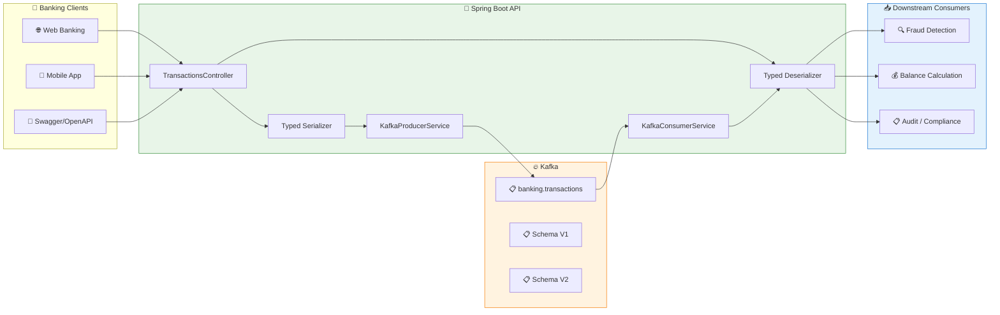

# LAB 2.1A (Java) : Advanced Serialization - E-Banking Transactions

## ⏱️ Estimated Duration: 45 minutes

## 🏦 E-Banking Context

In a modern bank, every transaction must be **reliably serialized** to ensure data integrity between systems. Day 01 used raw JSON, but in production this poses critical problems:

- ❌ **No validation**: producers can send any JSON
- ❌ **Fragile evolution**: adding fields breaks existing consumers  
- ❌ **Performance**: JSON is verbose (~2x larger than Avro)
- ❌ **No contract**: no compatibility guarantee between producer and consumer

In this lab, you'll implement **robust typed serialization** with validation and schema evolution management.

---

## 📊 Architecture

### Advanced Serialization Pipeline



---

## 🏗️ Project Structure

```
java/
├── src/main/java/com/data2ai/kafka/serialization/
│   ├── EBankingSerializationApplication.java
│   ├── config/
│   │   ├── KafkaConfig.java
│   │   └── AvroConfig.java
│   ├── model/
│   │   ├── Transaction.java
│   │   ├── TransactionType.java
│   │   ├── TransactionStatus.java
│   │   └── TransactionV2.java
│   ├── serializer/
│   │   ├── TransactionSerializer.java
│   │   ├── TransactionDeserializer.java
│   │   ├── AvroTransactionSerializer.java
│   │   └── AvroTransactionDeserializer.java
│   ├── producer/
│   │   └── SerializationProducerService.java
│   ├── consumer/
│   │   └── SerializationConsumerService.java
│   ├── controller/
│   │   └── TransactionController.java
│   ├── dto/
│   │   └── CreateTransactionRequest.java
│   └── service/
│       └── SchemaEvolutionService.java
├── src/main/resources/
│   └── application.yml
└── pom.xml
```

---

## 📋 Implementation Steps

### Step 1: Maven Configuration (`pom.xml`)

> **⚠️ Important**: Ensure the Spring Boot Maven plugin is properly configured to create an executable JAR:

```xml
<plugin>
    <groupId>org.springframework.boot</groupId>
    <artifactId>spring-boot-maven-plugin</artifactId>
    <version>${spring-boot.version}</version>
    <executions>
        <execution>
            <goals>
                <goal>repackage</goal>
            </goals>
        </execution>
    </executions>
</plugin>
```

### Step 2: Transaction Model (`model/Transaction.java`)

```java
@Data
@NoArgsConstructor
@AllArgsConstructor
@JsonInclude(JsonInclude.Include.NON_NULL)
public class Transaction {
    private String transactionId;
    private String customerId;
    private String fromAccount;
    private String toAccount;
    private BigDecimal amount;
    private String currency;
    private TransactionType type;
    private TransactionStatus status;
    private Instant timestamp;
    private String description;
    
    // Schema evolution - new field in V2
    private String category;
    private Map<String, Object> metadata;
    
    @PrePersist
    public void prePersist() {
        if (transactionId == null) {
            transactionId = UUID.randomUUID().toString();
        }
        if (timestamp == null) {
            timestamp = Instant.now();
        }
        if (status == null) {
            status = TransactionStatus.PENDING;
        }
    }
}

public enum TransactionType {
    WITHDRAWAL, PAYMENT, CARD_PAYMENT, TRANSFER, 
    INTERNATIONAL_TRANSFER, BILL_PAYMENT, DEPOSIT
}

public enum TransactionStatus {
    PENDING, COMPLETED, FAILED, CANCELLED
}
```

### Step 3: Custom JSON Serializer (`serializer/TransactionSerializer.java`)

```java
@Component
@Slf4j
public class TransactionSerializer implements Serializer<Transaction> {
    
    private final ObjectMapper objectMapper;
    
    public TransactionSerializer() {
        this.objectMapper = new ObjectMapper();
        this.objectMapper.registerModule(new JavaTimeModule());
        this.objectMapper.configure(SerializationFeature.WRITE_DATES_AS_TIMESTAMPS, false);
        this.objectMapper.configure(DeserializationFeature.FAIL_ON_UNKNOWN_PROPERTIES, false);
    }
    
    @Override
    public void configure(Map<String, ?> configs, boolean isKey) {
        // Configuration if needed
    }
    
    @Override
    public byte[] serialize(String topic, Transaction data) {
        if (data == null) {
            return null;
        }
        
        try {
            // Validate before serialization
            validateTransaction(data);
            
            // Add schema version header
            Headers headers = new RecordHeaders();
            headers.add("schema-version", "1.0".getBytes());
            headers.add("content-type", "application/json".getBytes());
            
            String json = objectMapper.writeValueAsString(data);
            log.debug("Serialized transaction: {} | Size: {} bytes", 
                     data.getTransactionId(), json.getBytes().length);
            
            return json.getBytes();
        } catch (Exception e) {
            log.error("Failed to serialize transaction: {}", data.getTransactionId(), e);
            throw new SerializationException("Failed to serialize transaction", e);
        }
    }
    
    private void validateTransaction(Transaction transaction) {
        if (transaction.getTransactionId() == null || transaction.getTransactionId().isEmpty()) {
            throw new IllegalArgumentException("Transaction ID is required");
        }
        if (transaction.getCustomerId() == null || transaction.getCustomerId().isEmpty()) {
            throw new IllegalArgumentException("Customer ID is required");
        }
        if (transaction.getAmount() == null || transaction.getAmount().compareTo(BigDecimal.ZERO) <= 0) {
            throw new IllegalArgumentException("Amount must be positive");
        }
        if (transaction.getCurrency() == null || transaction.getCurrency().isEmpty()) {
            throw new IllegalArgumentException("Currency is required");
        }
        if (transaction.getType() == null) {
            throw new IllegalArgumentException("Transaction type is required");
        }
    }
    
    @Override
    public void close() {
        // Cleanup if needed
    }
}
```

### Step 4: Custom JSON Deserializer (`serializer/TransactionDeserializer.java`)

```java
@Component
@Slf4j
public class TransactionDeserializer implements Deserializer<Transaction> {
    
    private final ObjectMapper objectMapper;
    
    public TransactionDeserializer() {
        this.objectMapper = new ObjectMapper();
        this.objectMapper.registerModule(new JavaTimeModule());
        this.objectMapper.configure(SerializationFeature.WRITE_DATES_AS_TIMESTAMPS, false);
        this.objectMapper.configure(DeserializationFeature.FAIL_ON_UNKNOWN_PROPERTIES, false);
    }
    
    @Override
    public void configure(Map<String, ?> configs, boolean isKey) {
        // Configuration if needed
    }
    
    @Override
    public Transaction deserialize(String topic, byte[] data) {
        if (data == null) {
            return null;
        }
        
        try {
            String json = new String(data);
            Transaction transaction = objectMapper.readValue(json, Transaction.class);
            
            // Schema evolution handling
            handleSchemaEvolution(transaction);
            
            log.debug("Deserialized transaction: {} | Schema version: {}", 
                     transaction.getTransactionId(), getSchemaVersion(data));
            
            return transaction;
        } catch (JsonProcessingException e) {
            log.error("Failed to deserialize JSON: {}", new String(data), e);
            throw new SerializationException("Failed to deserialize transaction", e);
        } catch (Exception e) {
            log.error("Unexpected error during deserialization", e);
            throw new SerializationException("Unexpected error during deserialization", e);
        }
    }
    
    private void handleSchemaEvolution(Transaction transaction) {
        // Handle backward compatibility
        if (transaction.getCategory() == null) {
            // Default category for old schema versions
            transaction.setCategory("GENERAL");
        }
        
        if (transaction.getMetadata() == null) {
            transaction.setMetadata(new HashMap<>());
        }
    }
    
    private String getSchemaVersion(byte[] data) {
        // In a real implementation, this would read from headers
        return "1.0";
    }
    
    @Override
    public void close() {
        // Cleanup if needed
    }
}
```

### Step 5: Producer Service (`producer/SerializationProducerService.java`)

```java
@Service
@Slf4j
public class SerializationProducerService {
    
    private final KafkaTemplate<String, Transaction> kafkaTemplate;
    private final ObjectMapper objectMapper;
    
    @Value("${app.kafka.topic:banking.transactions}")
    private String topic;
    
    public SerializationProducerService(KafkaTemplate<String, Transaction> kafkaTemplate,
                                     ObjectMapper objectMapper) {
        this.kafkaTemplate = kafkaTemplate;
        this.objectMapper = objectMapper;
    }
    
    public CompletableFuture<SendResult<String, Transaction>> sendTransaction(Transaction transaction) {
        try {
            // Set transaction metadata
            transaction.setTransactionId(UUID.randomUUID().toString());
            transaction.setTimestamp(Instant.now());
            transaction.setStatus(TransactionStatus.PENDING);
            
            // Use customer ID as key for partitioning
            String key = transaction.getCustomerId();
            
            log.info("Sending transaction: {} | Amount: {} {} | Customer: {} | Type: {}",
                    transaction.getTransactionId(),
                    transaction.getAmount(),
                    transaction.getCurrency(),
                    transaction.getCustomerId(),
                    transaction.getType());

            ListenableFuture<SendResult<String, Transaction>> future = kafkaTemplate.send(topic, key, transaction);
            
            // Add callback for async handling
            future.addCallback(
                result -> {
                    transaction.setStatus(TransactionStatus.COMPLETED);
                    log.info("Transaction sent successfully: {} | Partition: {} | Offset: {}",
                            transaction.getTransactionId(),
                            result.getRecordMetadata().partition(),
                            result.getRecordMetadata().offset());
                },
                failure -> {
                    transaction.setStatus(TransactionStatus.FAILED);
                    log.error("Failed to send transaction: {} | Error: {}",
                            transaction.getTransactionId(),
                            failure.getMessage());
                }
            );

            return future.toCompletableFuture();
        } catch (Exception e) {
            log.error("Error preparing transaction for Kafka", e);
            throw new RuntimeException("Failed to prepare transaction", e);
        }
    }
    
    public void sendTransactionWithSchemaV2(TransactionV2 transactionV2) {
        try {
            // Convert V2 to V1 for backward compatibility
            Transaction transaction = convertV2ToV1(transactionV2);
            sendTransaction(transaction);
        } catch (Exception e) {
            log.error("Failed to send V2 transaction", e);
            throw new RuntimeException("Failed to send V2 transaction", e);
        }
    }
    
    private Transaction convertV2ToV1(TransactionV2 v2) {
        Transaction v1 = new Transaction();
        v1.setTransactionId(v2.getTransactionId());
        v1.setCustomerId(v2.getCustomerId());
        v1.setFromAccount(v2.getFromAccount());
        v1.setToAccount(v2.getToAccount());
        v1.setAmount(v2.getAmount());
        v1.setCurrency(v2.getCurrency());
        v1.setType(v2.getType());
        v1.setStatus(v2.getStatus());
        v1.setTimestamp(v2.getTimestamp());
        v1.setDescription(v2.getDescription());
        
        // Map new V2 fields to metadata
        if (v1.getMetadata() == null) {
            v1.setMetadata(new HashMap<>());
        }
        v1.getMetadata().put("priority", v2.getPriority());
        v1.getMetadata().put("riskScore", v2.getRiskScore());
        v1.setCategory(v2.getCategory());
        
        return v1;
    }
}
```

### Step 6: Consumer Service (`consumer/SerializationConsumerService.java`)

```java
@Service
@Slf4j
public class SerializationConsumerService {
    
    private final AtomicInteger processedCount = new AtomicInteger(0);
    private final AtomicInteger errorCount = new AtomicInteger(0);
    private final Map<String, AtomicInteger> schemaVersionCounts = new ConcurrentHashMap<>();
    
    @KafkaListener(
        topics = "${app.kafka.topic:banking.transactions}",
        groupId = "serialization-consumer-group",
        containerFactory = "kafkaListenerContainerFactory"
    )
    public void consumeTransaction(
            @Payload Transaction transaction,
            @Header Map<String, Object> headers) {
        
        try {
            log.info("Processing transaction: {} | Amount: {} {} | Customer: {}",
                    transaction.getTransactionId(),
                    transaction.getAmount(),
                    transaction.getCurrency(),
                    transaction.getCustomerId());
            
            // Process transaction
            processTransaction(transaction);
            
            // Track schema version
            String schemaVersion = (String) headers.getOrDefault("schema-version", "unknown");
            schemaVersionCounts.computeIfAbsent(schemaVersion, k -> new AtomicInteger(0))
                              .incrementAndGet();
            
            processedCount.incrementAndGet();
            
            log.info("Transaction processed successfully: {} | Total processed: {}",
                    transaction.getTransactionId(), processedCount.get());
            
        } catch (Exception e) {
            errorCount.incrementAndGet();
            log.error("Failed to process transaction: {} | Error: {}",
                    transaction.getTransactionId(), e.getMessage(), e);
            throw e; // Re-throw to trigger Kafka retry mechanism
        }
    }
    
    private void processTransaction(Transaction transaction) {
        // Simulate business logic
        log.debug("Validating transaction: {}", transaction.getTransactionId());
        
        // Business validation
        if (transaction.getAmount().compareTo(new BigDecimal("10000")) > 0) {
            log.warn("Large transaction detected: {} | Amount: {}",
                    transaction.getTransactionId(), transaction.getAmount());
        }
        
        // Simulate processing time
        try {
            Thread.sleep(100);
        } catch (InterruptedException e) {
            Thread.currentThread().interrupt();
        }
        
        log.debug("Transaction validation completed: {}", transaction.getTransactionId());
    }
    
    public Map<String, Object> getStatistics() {
        Map<String, Object> stats = new HashMap<>();
        stats.put("processed", processedCount.get());
        stats.put("errors", errorCount.get());
        stats.put("successRate", calculateSuccessRate());
        stats.put("schemaVersions", schemaVersionCounts.entrySet().stream()
                .collect(Collectors.toMap(
                    Map.Entry::getKey,
                    e -> e.getValue().get()
                )));
        stats.put("timestamp", Instant.now().toString());
        return stats;
    }
    
    private double calculateSuccessRate() {
        int total = processedCount.get() + errorCount.get();
        return total > 0 ? (double) processedCount.get() / total * 100 : 0.0;
    }
}
```

### Step 7: REST Controller (`controller/TransactionController.java`)

```java
@RestController
@RequestMapping("/api/v1")
@Slf4j
public class TransactionController {
    
    private final SerializationProducerService producerService;
    private final SerializationConsumerService consumerService;
    
    public TransactionController(SerializationProducerService producerService,
                               SerializationConsumerService consumerService) {
        this.producerService = producerService;
        this.consumerService = consumerService;
    }
    
    @PostMapping("/transactions")
    public ResponseEntity<Map<String, String>> createTransaction(@RequestBody CreateTransactionRequest request) {
        Transaction transaction = new Transaction();
        transaction.setFromAccount(request.getFromAccount());
        transaction.setToAccount(request.getToAccount());
        transaction.setAmount(request.getAmount());
        transaction.setCurrency(request.getCurrency());
        transaction.setType(request.getType());
        transaction.setDescription(request.getDescription());
        transaction.setCustomerId(request.getCustomerId());
        transaction.setCategory(request.getCategory());
        
        try {
            producerService.sendTransaction(transaction);
            return ResponseEntity.ok(Map.of(
                "message", "Transaction submitted for processing",
                "status", "PENDING",
                "transactionId", transaction.getTransactionId()
            ));
        } catch (Exception e) {
            log.error("Failed to submit transaction", e);
            return ResponseEntity.status(HttpStatus.INTERNAL_SERVER_ERROR)
                    .body(Map.of("error", "Failed to submit transaction"));
        }
    }
    
    @PostMapping("/transactions/v2")
    public ResponseEntity<Map<String, String>> createTransactionV2(@RequestBody TransactionV2 transactionV2) {
        try {
            producerService.sendTransactionWithSchemaV2(transactionV2);
            return ResponseEntity.ok(Map.of(
                "message", "V2 Transaction submitted for processing",
                "status", "PENDING",
                "transactionId", transactionV2.getTransactionId()
            ));
        } catch (Exception e) {
            log.error("Failed to submit V2 transaction", e);
            return ResponseEntity.status(HttpStatus.INTERNAL_SERVER_ERROR)
                    .body(Map.of("error", "Failed to submit V2 transaction"));
        }
    }
    
    @PostMapping("/transactions/batch")
    public ResponseEntity<Map<String, Object>> createTransactionsBatch(@RequestBody List<CreateTransactionRequest> requests) {
        List<CompletableFuture<SendResult<String, Transaction>>> futures = new ArrayList<>();
        AtomicInteger successCount = new AtomicInteger(0);
        AtomicInteger failureCount = new AtomicInteger(0);

        for (CreateTransactionRequest request : requests) {
            Transaction transaction = new Transaction();
            transaction.setFromAccount(request.getFromAccount());
            transaction.setToAccount(request.getToAccount());
            transaction.setAmount(request.getAmount());
            transaction.setCurrency(request.getCurrency());
            transaction.setType(request.getType());
            transaction.setDescription(request.getDescription());
            transaction.setCustomerId(request.getCustomerId());
            transaction.setCategory(request.getCategory());

            CompletableFuture<SendResult<String, Transaction>> future = producerService.sendTransaction(transaction);
            futures.add(future);
            
            future.thenAccept(result -> successCount.incrementAndGet())
                    .exceptionally(throwable -> {
                        failureCount.incrementAndGet();
                        return null;
                    });
        }

        // Wait for all to complete
        CompletableFuture.allOf(futures.toArray(new CompletableFuture[0])).join();

        return ResponseEntity.ok(Map.of(
            "total", requests.size(),
            "success", successCount.get(),
            "failed", failureCount.get(),
            "message", "Batch processing completed"
        ));
    }
    
    @GetMapping("/transactions/statistics")
    public ResponseEntity<Map<String, Object>> getStatistics() {
        return ResponseEntity.ok(consumerService.getStatistics());
    }
    
    @GetMapping("/health")
    public ResponseEntity<Map<String, String>> health() {
        return ResponseEntity.ok(Map.of(
            "status", "UP",
            "service", "EBanking Serialization API",
            "timestamp", Instant.now().toString()
        ));
    }
}
```

### Step 8: Kafka Configuration (`config/KafkaConfig.java`)

```java
@Configuration
@EnableKafka
@Slf4j
public class KafkaConfig {
    
    @Value("${spring.kafka.bootstrap-servers}")
    private String bootstrapServers;
    
    @Bean
    public ProducerFactory<String, Transaction> producerFactory() {
        Map<String, Object> configProps = new HashMap<>();
        configProps.put(ProducerConfig.BOOTSTRAP_SERVERS_CONFIG, bootstrapServers);
        configProps.put(ProducerConfig.KEY_SERIALIZER_CLASS_CONFIG, StringSerializer.class);
        configProps.put(ProducerConfig.VALUE_SERIALIZER_CLASS_CONFIG, TransactionSerializer.class);
        configProps.put(ProducerConfig.ACKS_CONFIG, "all");
        configProps.put(ProducerConfig.RETRIES_CONFIG, 3);
        configProps.put(ProducerConfig.LINGER_MS_CONFIG, 10);
        configProps.put(ProducerConfig.BATCH_SIZE_CONFIG, 16384);
        configProps.put(ProducerConfig.COMPRESSION_TYPE_CONFIG, "snappy");
        
        return new DefaultKafkaProducerFactory<>(configProps);
    }
    
    @Bean
    public KafkaTemplate<String, Transaction> kafkaTemplate() {
        return new KafkaTemplate<>(producerFactory());
    }
    
    @Bean
    public ConsumerFactory<String, Transaction> consumerFactory() {
        Map<String, Object> configProps = new HashMap<>();
        configProps.put(ConsumerConfig.BOOTSTRAP_SERVERS_CONFIG, bootstrapServers);
        configProps.put(ConsumerConfig.GROUP_ID_CONFIG, "serialization-consumer-group");
        configProps.put(ConsumerConfig.KEY_DESERIALIZER_CLASS_CONFIG, StringDeserializer.class);
        configProps.put(ConsumerConfig.VALUE_DESERIALIZER_CLASS_CONFIG, TransactionDeserializer.class);
        configProps.put(ConsumerConfig.AUTO_OFFSET_RESET_CONFIG, "earliest");
        configProps.put(ConsumerConfig.ENABLE_AUTO_COMMIT_CONFIG, false);
        configProps.put(ConsumerConfig.MAX_POLL_RECORDS_CONFIG, 100);
        configProps.put(ConsumerConfig.SESSION_TIMEOUT_MS_CONFIG, 30000);
        configProps.put(ConsumerConfig.HEARTBEAT_INTERVAL_MS_CONFIG, 10000);
        
        return new DefaultKafkaConsumerFactory<>(configProps);
    }
    
    @Bean
    public ConcurrentKafkaListenerContainerFactory<String, Transaction> kafkaListenerContainerFactory() {
        ConcurrentKafkaListenerContainerFactory<String, Transaction> factory = 
            new ConcurrentKafkaListenerContainerFactory<>();
        factory.setConsumerFactory(consumerFactory());
        factory.getContainerProperties().setAckMode(AckMode.MANUAL_IMMEDIATE);
        factory.setConcurrency(3);
        
        return factory;
    }
}
```

### Step 9: Application Configuration (`application.yml`)

```yaml
server:
  port: 8080

spring:
  application:
    name: ebanking-serialization-java
  
  kafka:
    bootstrap-servers: ${KAFKA_BOOTSTRAP_SERVERS:localhost:9092}
    producer:
      key-serializer: org.apache.kafka.common.serialization.StringSerializer
      value-serializer: com.data2ai.kafka.serialization.serializer.TransactionSerializer
      acks: all
      retries: 3
      linger-ms: 10
      batch-size: 16384
      compression-type: snappy
    consumer:
      group-id: serialization-consumer-group
      key-deserializer: org.apache.kafka.common.serialization.StringDeserializer
      value-deserializer: com.data2ai.kafka.serialization.serializer.TransactionDeserializer
      auto-offset-reset: earliest
      enable-auto-commit: false
      max-poll-records: 100
      session-timeout-ms: 30000
      heartbeat-interval-ms: 10000

app:
  kafka:
    topic: ${KAFKA_TOPIC:banking.transactions}

logging:
  level:
    com.data2ai.kafka.serialization: INFO
    org.apache.kafka: WARN
    org.springframework.kafka: WARN
```

---

## 🚀 Deployment

### Local Development

#### 1. Start the application

```bash
cd java
mvn spring-boot:run
```

#### 2. Test serialization

```bash
# Create a transaction with V1 schema
curl -X POST http://localhost:8080/api/v1/transactions \
  -H "Content-Type: application/json" \
  -d '{
    "fromAccount": "FR7630001000123456789",
    "toAccount": "FR7630001000987654321",
    "amount": 1000.00,
    "currency": "EUR",
    "type": "TRANSFER",
    "description": "Test serialization",
    "customerId": "CUST-001",
    "category": "BANK_TRANSFER"
  }'

# Create a transaction with V2 schema (new fields)
curl -X POST http://localhost:8080/api/v1/transactions/v2 \
  -H "Content-Type: application/json" \
  -d '{
    "transactionId": "TX-V2-001",
    "customerId": "CUST-002",
    "fromAccount": "FR7630001000222222222",
    "toAccount": "FR7630001000333333333",
    "amount": 2000.00,
    "currency": "EUR",
    "type": "INTERNATIONAL_TRANSFER",
    "description": "V2 transaction with new fields",
    "status": "PENDING",
    "category": "INTERNATIONAL",
    "priority": "HIGH",
    "riskScore": 85
  }'

# View statistics
curl http://localhost:8080/api/v1/transactions/statistics
```

### OpenShift Sandbox — Option A: S2I Binary Build

> **🎯 Objective**: This deployment validates **advanced serialization patterns** in a cloud environment:
> - **Custom serializers/deserializers** with validation
> - **Schema evolution** handling (V1 → V2 compatibility)
> - **Performance comparison** between JSON and typed serialization
> - **Schema version tracking** and monitoring

#### 1. Build and Deployment

```bash
cd day-02-development/module-04-advanced-patterns/lab-2.1a-serialization/java

# Create BuildConfig (with explicit image stream)
oc new-build --image-stream="openshift/java:openjdk-17-ubi8" --binary=true --name=ebanking-serialization-java

# Build from local source
oc start-build ebanking-serialization-java --from-dir=. --follow

# Deploy
oc new-app ebanking-serialization-java
```

#### 2. Configure Environment Variables

```bash
oc set env deployment/ebanking-serialization-java \
  SERVER_PORT=8080 \
  KAFKA_BOOTSTRAP_SERVERS=kafka-svc:9092 \
  KAFKA_TOPIC=banking.transactions
```

#### 3. Create Edge Route

```bash
oc create route edge ebanking-serialization-java-secure \
  --service=ebanking-serialization-java --port=8080-tcp
```

#### 4. Verify Deployment

```bash
# Get public URL
URL=$(oc get route ebanking-serialization-java-secure -o jsonpath='{.spec.host}')

# Health check
curl -k "https://$URL/api/v1/health"

# Test V1 serialization
curl -k -X POST "https://$URL/api/v1/transactions" \
  -H "Content-Type: application/json" \
  -d '{
    "fromAccount":"FR7630001000123456789",
    "toAccount":"FR7630001000987654321",
    "amount":1000.00,
    "currency":"EUR",
    "type":"TRANSFER",
    "description":"Test serialization",
    "customerId":"CUST-001",
    "category":"BANK_TRANSFER"
  }'

# Test V2 serialization
curl -k -X POST "https://$URL/api/v1/transactions/v2" \
  -H "Content-Type: application/json" \
  -d '{
    "transactionId":"TX-V2-001",
    "customerId":"CUST-002",
    "fromAccount":"FR7630001000222222222",
    "toAccount":"FR7630001000333333333",
    "amount":2000.00,
    "currency":"EUR",
    "type":"INTERNATIONAL_TRANSFER",
    "description":"V2 transaction",
    "status":"PENDING",
    "category":"INTERNATIONAL",
    "priority":"HIGH",
    "riskScore":85
  }'
```

#### 5. ✅ Success Criteria

```bash
# Pod running?
oc get pod -l deployment=ebanking-serialization-java
# Expected: STATUS=Running, READY=1/1

# API accessible?
curl -k -s "https://$URL/api/v1/health"
# Expected: {"status":"UP",...}

# Messages in Kafka?
oc exec kafka-0 -- /opt/kafka/bin/kafka-console-consumer.sh \
  --bootstrap-server localhost:9092 \
  --topic banking.transactions \
  --from-beginning \
  --max-messages 5
```

#### 6. Automated Script

```bash
# Bash
./scripts/bash/deploy-and-test-2.1a-java.sh

# PowerShell
.\scripts\powershell\deploy-and-test-2.1a-java.ps1
```

---

## 🧪 Tests

### Test Scenarios

```bash
URL=$(oc get route ebanking-serialization-java-secure -o jsonpath='{.spec.host}')

# 1. Health check
curl -k -s "https://$URL/api/v1/health"

# 2. V1 Schema Transaction
curl -k -X POST "https://$URL/api/v1/transactions" \
  -H "Content-Type: application/json" \
  -d '{"fromAccount":"FR7630001000123456789","toAccount":"FR7630001000987654321","amount":1000.00,"currency":"EUR","type":"TRANSFER","description":"V1 test","customerId":"CUST-001","category":"BANK_TRANSFER"}'

# 3. V2 Schema Transaction
curl -k -X POST "https://$URL/api/v1/transactions/v2" \
  -H "Content-Type: application/json" \
  -d '{"transactionId":"TX-V2-001","customerId":"CUST-002","fromAccount":"FR7630001000222222222","toAccount":"FR7630001000333333333","amount":2000.00,"currency":"EUR","type":"INTERNATIONAL_TRANSFER","description":"V2 test","status":"PENDING","category":"INTERNATIONAL","priority":"HIGH","riskScore":85}'

# 4. Batch Transactions
curl -k -X POST "https://$URL/api/v1/transactions/batch" \
  -H "Content-Type: application/json" \
  -d '[
    {"fromAccount":"FR7630001000123456789","toAccount":"FR7630001000987654321","amount":100.00,"currency":"EUR","type":"PAYMENT","description":"Batch 1","customerId":"CUST-001","category":"PAYMENT"},
    {"fromAccount":"FR7630001000222222222","toAccount":"FR7630001000333333333","amount":200.00,"currency":"EUR","type":"DEPOSIT","description":"Batch 2","customerId":"CUST-002","category":"DEPOSIT"}
  ]'

# 5. Statistics
curl -k -s "https://$URL/api/v1/transactions/statistics"
```

### Schema Evolution Validation

```bash
# Verify messages in Kafka with schema information
oc exec kafka-0 -- /opt/kafka/bin/kafka-console-consumer.sh \
  --bootstrap-server localhost:9092 \
  --topic banking.transactions \
  --from-beginning \
  --max-messages 10 \
  --property print.headers=true
```

---

## 📋 API Endpoints

| Method | Endpoint | Description |
| ------- | -------- | ----------- |
| `POST` | `/api/v1/transactions` | Create V1 transaction |
| `POST` | `/api/v1/transactions/v2` | Create V2 transaction (schema evolution) |
| `POST` | `/api/v1/transactions/batch` | Create multiple transactions |
| `GET` | `/api/v1/transactions/statistics` | Serialization statistics |
| `GET` | `/api/v1/health` | Health check |

---

## 🎯 Key Concepts Explained

### Custom Serializers

**Benefits**:
- **Type safety**: Compile-time validation
- **Performance**: Optimized for your domain objects
- **Validation**: Business rules before serialization
- **Headers**: Add metadata (schema version, content type)

### Schema Evolution Strategies

| Strategy | Compatibility | Use Case |
|----------|----------------|----------|
| **BACKWARD** | New consumers read old data | Add optional fields |
| **FORWARD** | Old consumers read new data | Remove optional fields |
| **FULL** | Both directions | Add/remove optional fields only |

### Performance Comparison

| Format | Size (1KB JSON) | Serialization Speed | Schema Evolution |
| ------ | --------------- | ------------------- | ---------------- |
| **Raw JSON** | 1000 bytes | Fast | Manual |
| **Typed JSON** | ~1000 bytes | Medium | Built-in |
| **Avro** | ~400 bytes | Fast | Registry |

---

## 🔧 Troubleshooting

### Common Issues

1. **Serialization Errors**
   - Check field validation in serializer
   - Verify JSON structure matches Java model
   - Check for null values in required fields

2. **Schema Evolution Issues**
   - Ensure backward compatibility
   - Handle missing fields with defaults
   - Track schema versions in headers

3. **Performance Issues**
   - Monitor message sizes
   - Check serialization overhead
   - Consider Avro for large volumes

---

## ✅ Lab Validation

At the end of this lab, you should be able to:

- [ ] Implement custom serializers/deserializers
- [ ] Add validation before serialization
- [ ] Handle schema evolution (V1 → V2)
- [ ] Deploy on OpenShift with S2I
- [ ] Monitor schema version usage
- [ ] Compare performance of different serialization approaches

---

## 📚 Resources

- [Spring Kafka Serializers](https://spring.io/projects/spring-kafka/reference/html/#serdes)
- [Kafka Custom Serializers](https://kafka.apache.org/documentation/#serialization)
- [Schema Evolution Best Practices](https://www.confluent.io/blog/schema-registry-avro-best-practices/)
