# 🔒 Bloc 2.2 — Producer Patterns Avancés

| Durée | Théorie | Lab | Prérequis |
| ----- | ------- | --- | --------- |
| 1h15 | 20 min | 55 min | Bloc 2.1 complété, topic `banking.transactions` existant |

---

## 🏦 Scénario E-Banking (suite)

Dans le Day 01 (lab 1.2c), votre producer résilient envoyait des transactions avec `Acks = Acks.Leader` et `EnableIdempotence = false` (config Sandbox). Le commentaire disait : **"On verra ça plus tard"**.

C'est maintenant. Dans ce lab, vous allez :

1. **Activer l'idempotence** pour garantir que les retries ne créent pas de duplicatas
2. **Observer le Producer ID (PID)** et les sequence numbers dans les logs
3. **Comparer** les comportements avec/sans idempotence lors de retries réseau
4. **Découvrir** les transactions Kafka pour l'exactly-once semantics

---

## 🎯 Objectifs d'apprentissage

- ✅ Comprendre **pourquoi** l'idempotence est nécessaire (duplicatas lors de retries)
- ✅ Activer `EnableIdempotence = true` et observer le **Producer ID (PID)**
- ✅ Comprendre les **sequence numbers** et la déduplication côté broker
- ✅ Connaître les **contraintes** imposées par l'idempotence (`Acks=All`, `MaxInFlight≤5`)
- ✅ Distinguer **at-least-once**, **at-most-once** et **exactly-once**
- ✅ (Bonus) Comprendre les **transactions Kafka** (read-process-write)

---

## 📚 Partie Théorique (20 min)

### 1. Le problème des duplicatas

```mermaid
sequenceDiagram
    participant P as 📤 Producer
    participant B as 📦 Broker

    Note over P,B: SANS idempotence
    P->>B: Send msg "TX-001" (Seq=?)
    B->>B: Write to partition ✅
    B--xP: ACK perdu (network timeout)
    P->>B: Retry "TX-001" (même message)
    B->>B: Write to partition AGAIN ❌
    Note over B: TX-001 existe 2 fois!
```



**Conséquence** : le consumer traite TX-001 **deux fois** → double débit bancaire!

### 2. L'idempotence résout le problème

```mermaid
sequenceDiagram
    participant P as 📤 Producer (PID=42)
    participant B as 📦 Broker

    Note over P,B: AVEC idempotence (PID + Seq)
    P->>B: Send msg "TX-001" (PID=42, Seq=0)
    B->>B: Write to partition ✅ (PID=42, Seq=0 recorded)
    B--xP: ACK perdu (network timeout)
    P->>B: Retry "TX-001" (PID=42, Seq=0)
    B->>B: PID=42, Seq=0 already seen → SKIP
    B-->>P: ACK ✅ (no duplicate)
    Note over B: TX-001 exists once only ✅
```



**Comment ça marche** :

1. Le broker attribue un **Producer ID (PID)** unique au producer
2. Chaque message reçoit un **sequence number** incrémental par partition
3. Le broker maintient une table `(PID, Partition) → last Seq`
4. Si un message arrive avec un Seq déjà vu → **dédupliqué silencieusement**

### 3. Configuration comparée

| Config | Sans Idempotence | Avec Idempotence |
| ------ | ---------------- | ---------------- |
| `EnableIdempotence` | `false` | `true` |
| `Acks` | `Leader` ou `All` | **`All`** (forcé automatiquement) |
| `MaxInFlight` | 5 (défaut) | **≤ 5** (forcé) |
| `MessageSendMaxRetries` | 2 (défaut) | **`int.MaxValue`** (forcé) |
| Garantie | At-least-once (avec duplicatas possibles) | At-least-once (sans duplicatas) |
| Performance | ~baseline | ~identique (overhead négligeable) |

> 💡 **Recommandation production** : activez TOUJOURS `EnableIdempotence = true`. Il n'y a pratiquement aucun inconvénient.

> ⚠️ **Attention** : le PID est **éphémère** — il est réattribué à chaque redémarrage du producer. Seul le `TransactionalId` (transactions Kafka) survit aux redémarrages. Le PID seul ne fournit PAS de déduplication cross-restart.

### 4. Transactions Kafka — Exactly-Once

Les transactions permettent d'écrire **atomiquement** dans plusieurs topics/partitions :

```mermaid
flowchart LR
    subgraph TX["🔒 Transaction"]
        direction TB
        BEGIN["BeginTransaction()"]
        W1["Write msg to topic A"]
        W2["Write msg to topic B"]
        OFFSET["SendOffsetsToTransaction()"]
        COMMIT["CommitTransaction()"]
        BEGIN --> W1 --> W2 --> OFFSET --> COMMIT
    end

    subgraph Consumer["📥 Consumer"]
        C["IsolationLevel = ReadCommitted"]
        C -->|"Sees only committed msgs"| OK["✅"]
    end

    TX --> Consumer
    style TX fill:#e8f5e9,stroke:#388e3c
```



| Cas d'usage | Pattern | Garantie |
| ----------- | ------- | -------- |
| **Logs, métriques** | `Acks=1`, auto-commit | At-most-once |
| **Paiements, commandes** | `Acks=All`, idempotence, manual commit | At-least-once (sans duplicatas) |
| **Transferts bancaires** | Transactions Kafka | Exactly-once |

---

## 🛠️ Partie Pratique — Lab 2.2 (55 min)

### Structure du projet

```text
EBankingIdempotentProducerAPI/
├── Controllers/
│   └── TransactionsController.cs     # REST API endpoints
├── Services/
│   ├── IdempotentProducerService.cs   # Producer with EnableIdempotence=true
│   └── NonIdempotentProducerService.cs # Producer without idempotence (comparison)
├── Models/
│   └── Transaction.cs                # Transaction model
├── Program.cs                        # ASP.NET setup with Swagger
├── Dockerfile                        # For OpenShift/Docker deployment
├── appsettings.json                  # Kafka config
└── requests.http                     # VS Code REST Client test requests
```

### Étape 1 : Explorer les endpoints

| Méthode | Endpoint | Description |
| ------- | -------- | ----------- |
| `POST` | `/api/transactions/idempotent` | Send with `EnableIdempotence=true` |
| `POST` | `/api/transactions/non-idempotent` | Send with `EnableIdempotence=false` (comparison) |
| `POST` | `/api/transactions/batch` | Send batch with both producers, compare results |
| `GET` | `/api/transactions/metrics` | PID info, sequence numbers, duplicate count |
| `GET` | `/api/transactions/compare` | Side-by-side comparison of both producers |
| `GET` | `/health` | Health check |

### Étape 2 : Envoyer des transactions

<details>
<summary>🐳 Docker</summary>

```bash
# Send idempotent transaction
curl -X POST http://localhost:5171/api/transactions/idempotent \
  -H "Content-Type: application/json" \
  -d '{
    "customerId": "CUST-001",
    "fromAccount": "FR7630001000123456789",
    "toAccount": "FR7630001000987654321",
    "amount": 1500.00,
    "currency": "EUR",
    "type": 1
  }'

# Send non-idempotent transaction (comparison)
curl -X POST http://localhost:5171/api/transactions/non-idempotent \
  -H "Content-Type: application/json" \
  -d '{
    "customerId": "CUST-001",
    "fromAccount": "FR7630001000123456789",
    "toAccount": "FR7630001000987654321",
    "amount": 1500.00,
    "currency": "EUR",
    "type": 1
  }'
```

</details>

<details>
<summary>☁️ OpenShift Sandbox</summary>

```bash
HOST=$(oc get route ebanking-idempotent-api-secure -o jsonpath='{.spec.host}')

curl -X POST "https://$HOST/api/transactions/idempotent" \
  -H "Content-Type: application/json" \
  -d '{
    "customerId": "CUST-001",
    "fromAccount": "FR7630001000123456789",
    "toAccount": "FR7630001000987654321",
    "amount": 1500.00,
    "currency": "EUR",
    "type": 1
  }'
```

</details>

### Étape 3 : Observer le PID et les metrics

```bash
# Check metrics — observe PID and sequence numbers
curl -s http://localhost:5171/api/transactions/metrics | jq .

# Expected output:
# {
#   "idempotentProducer": {
#     "producerId": "Generated by broker",
#     "enableIdempotence": true,
#     "messagesProduced": 5,
#     "configForced": {
#       "acks": "All",
#       "maxInFlight": 5,
#       "maxRetries": 2147483647
#     }
#   },
#   "nonIdempotentProducer": {
#     "enableIdempotence": false,
#     ...
#   }
# }
```

### Étape 4 : Batch comparison

```bash
# Send 10 transactions through both producers and compare
curl -X POST http://localhost:5171/api/transactions/batch \
  -H "Content-Type: application/json" \
  -d '{"count": 10, "customerId": "CUST-BATCH-001"}' | jq .
```

### Étape 5 : Exercices

1. **Observe the logs** : find the PID assignment message when the idempotent producer starts
2. **Kill and restart** the API while sending messages — verify no duplicates with idempotent producer
3. **Check the consumer side** : read `banking.transactions` and verify message count

---

## ☁️ Déploiement sur OpenShift Sandbox

> **🎯 Objectif** : Ce déploiement valide les concepts du **Producer Idempotent** dans un environnement cloud :
> - **`EnableIdempotence = true`** : le broker attribue un PID et détecte les duplicatas via sequence numbers
> - **`Acks = All`** : forcé automatiquement — le message est répliqué avant ACK
> - **PID (Producer ID)** : ID éphémère visible dans les métriques — change à chaque restart
> - **Transactions Kafka** : écriture atomique multi-partition (exactly-once semantics)

### Stability Warning

> [!WARNING]
> Sur le Sandbox, `EnableIdempotence = true` avec `Acks = All` peut causer des timeouts (`Coordinator load in progress`). Si cela arrive, attendez 2-3 min ou redémarrez le pod.

### 1. Préparer le Build et le Déploiement

```bash
cd day-02-development/module-04-advanced-patterns/lab-2.2-producer-advanced/dotnet

# Créer une build binaire pour .NET 8
oc new-build dotnet:8.0-ubi8 --binary=true --name=ebanking-idempotent-api

# Lancer la build en envoyant le dossier courant
oc start-build ebanking-idempotent-api --from-dir=. --follow

# Créer l'application
oc new-app ebanking-idempotent-api
```

### 2. Configurer les variables d'environnement

```bash
oc set env deployment/ebanking-idempotent-api \
  Kafka__BootstrapServers=kafka-svc:9092 \
  Kafka__Topic=banking.transactions \
  ASPNETCORE_URLS=http://0.0.0.0:8080 \
  ASPNETCORE_ENVIRONMENT=Development
```

### 3. Exposer publiquement (Secure Edge Route)

> [!IMPORTANT]
> Standard routes may hang on the Sandbox. Use an **edge route** for reliable public access.

```bash
oc create route edge ebanking-idempotent-api-secure --service=ebanking-idempotent-api --port=8080-tcp
```

### 4. Tester l'API déployée

```bash
# Obtenir l'URL publique
URL=$(oc get route ebanking-idempotent-api-secure -o jsonpath='{.spec.host}')
echo "https://$URL/swagger"

# Health check
curl -k -i "https://$URL/health"

# Send idempotent transaction
curl -k -s -X POST "https://$URL/api/transactions/idempotent" \
  -H "Content-Type: application/json" \
  -d '{"customerId":"CUST-001","fromAccount":"FR7630001000123456789","toAccount":"FR7630001000987654321","amount":1500.00,"currency":"EUR","type":1,"description":"Idempotent test"}' | jq .

# Check metrics — should show PID assigned by broker
curl -k -s "https://$URL/api/transactions/metrics" | jq .
```

### 5. ✅ Success Criteria — Deployment

```bash
# Pod running?
oc get pod -l deployment=ebanking-idempotent-api
# Expected: STATUS=Running, READY=1/1

# API reachable?
curl -k -s "https://$(oc get route ebanking-idempotent-api-secure -o jsonpath='{.spec.host}')/health" | jq .
# Expected: Healthy

# PID visible in metrics?
curl -k -s "https://$(oc get route ebanking-idempotent-api-secure -o jsonpath='{.spec.host}')/api/transactions/metrics" | jq .
# Expected: producerId (PID) > 0, enableIdempotence=true

# Verify message in Kafka
oc exec kafka-0 -- /opt/kafka/bin/kafka-console-consumer.sh \
  --bootstrap-server localhost:9092 \
  --topic banking.transactions \
  --from-beginning --max-messages 5
```

#### 📖 Concepts validés

| Concept | Comment le vérifier |
| ------- | ------------------- |
| Idempotence | `GET /metrics` montre `enableIdempotence: true` et un PID |
| PID éphémère | Redémarrer le pod → PID change dans les métriques |
| Acks=All forcé | `GET /metrics` montre `acks: "All"` |
| Exactly-once | Envoyer 2x la même tx → vérifier dans Kafka UI qu'il n'y a pas de doublon |

---

## 🖥️ Déploiement Local OpenShift (CRC / OpenShift Local)

Si vous disposez d'un cluster **OpenShift Local** (anciennement CRC — CodeReady Containers), vous pouvez déployer l'API directement depuis votre machine.

### 1. Prérequis

```bash
# Vérifier que le cluster est démarré
crc status

# Se connecter au cluster
oc login -u developer https://api.crc.testing:6443
oc project ebanking-labs
```

### 2. Build et Déploiement (Binary Build)

```bash
cd day-02-development/module-04-advanced-patterns/lab-2.2-producer-advanced/dotnet

oc new-build dotnet:8.0-ubi8 --binary=true --name=ebanking-idempotent-api
oc start-build ebanking-idempotent-api --from-dir=. --follow
oc new-app ebanking-idempotent-api
```

### 3. Configurer les variables d'environnement

```bash
oc set env deployment/ebanking-idempotent-api \
  Kafka__BootstrapServers=kafka-svc:9092 \
  Kafka__Topic=banking.transactions \
  ASPNETCORE_URLS=http://0.0.0.0:8080 \
  ASPNETCORE_ENVIRONMENT=Development
```

### 4. Exposer et tester

```bash
# Créer une route edge
oc create route edge ebanking-idempotent-api-secure --service=ebanking-idempotent-api --port=8080-tcp

# Obtenir l'URL
URL=$(oc get route ebanking-idempotent-api-secure -o jsonpath='{.spec.host}')
echo "https://$URL/swagger"

# Tester
curl -k -i "https://$URL/health"
curl -k -s "https://$URL/api/transactions/metrics" | jq .
```

### 5. Alternative : Déploiement par manifeste YAML

```bash
sed "s/\${NAMESPACE}/ebanking-labs/g" deployment/openshift-deployment.yaml | oc apply -f -
```

---

## ☸️ Déploiement Kubernetes / OKD (K3s, K8s, OKD)

Pour un cluster **Kubernetes standard** (K3s, K8s, Minikube) ou **OKD**, utilisez les manifestes YAML fournis dans le dossier `deployment/`.

### 1. Construire l'image Docker

```bash
cd day-02-development/module-04-advanced-patterns/lab-2.2-producer-advanced/dotnet

# Build de l'image
docker build -t ebanking-idempotent-api:latest .

# Pour un registry distant (adapter l'URL du registry)
docker tag ebanking-idempotent-api:latest <registry>/ebanking-idempotent-api:latest
docker push <registry>/ebanking-idempotent-api:latest
```

> **K3s / Minikube** : Si vous utilisez un cluster local, l'image locale suffit avec `imagePullPolicy: IfNotPresent`.

### 2. Déployer les manifestes

```bash
# Appliquer le Deployment + Service + Ingress
kubectl apply -f deployment/k8s-deployment.yaml

# Vérifier le déploiement
kubectl get pods -l app=ebanking-idempotent-api
kubectl get svc ebanking-idempotent-api
```

### 3. Configurer le Kafka Bootstrap (si différent)

```bash
kubectl set env deployment/ebanking-idempotent-api \
  Kafka__BootstrapServers=<kafka-bootstrap>:9092
```

### 4. Accéder à l'API

```bash
# Port-forward pour accès local
kubectl port-forward svc/ebanking-idempotent-api 8080:8080

# Tester
curl http://localhost:8080/health
curl http://localhost:8080/swagger/index.html
```

> **Ingress** : Si vous avez un Ingress Controller (nginx, traefik), ajoutez `ebanking-idempotent-api.local` à votre fichier `/etc/hosts` pointant vers l'IP du cluster.

### 5. 🧪 Validation des concepts (K8s)

```bash
# Send idempotent transaction (port-forward actif sur 8080)
curl -s -X POST "http://localhost:8080/api/transactions/idempotent" \
  -H "Content-Type: application/json" \
  -d '{"customerId":"CUST-001","fromAccount":"FR7630001000123456789","toAccount":"FR7630001000987654321","amount":1500.00,"currency":"EUR","type":1,"description":"K8s idempotent test"}' | jq .

# Check PID and idempotence metrics
curl -s "http://localhost:8080/api/transactions/metrics" | jq .

# Batch comparison — idempotent vs standard
curl -s -X POST "http://localhost:8080/api/transactions/batch" \
  -H "Content-Type: application/json" \
  -d '{"count": 5, "customerId": "CUST-BATCH-001"}' | jq .

# Verify messages in Kafka
kubectl exec kafka-0 -- /opt/kafka/bin/kafka-console-consumer.sh \
  --bootstrap-server localhost:9092 \
  --topic banking.transactions \
  --from-beginning --max-messages 10
```

> **Docker Compose** : Si Kafka tourne via Docker Compose, utilisez `docker exec kafka ...` au lieu de `kubectl exec kafka-0 ...`.

### 6. OKD : Utiliser les manifestes OpenShift

```bash
sed "s/\${NAMESPACE}/$(oc project -q)/g" deployment/openshift-deployment.yaml | oc apply -f -
```

---

## 🔧 Troubleshooting

| Symptom | Probable Cause | Solution |
| ------- | -------------- | -------- |
| `Coordinator load in progress` | Kafka Sandbox cold start with idempotence | Wait 2-3 min or `oc delete pods -l app=kafka` |
| PID = 0 in metrics | Idempotence not enabled or producer not started | Check `EnableIdempotence = true` in producer config |
| Pod CrashLoopBackOff | Missing env vars or Kafka DNS error | Check: `oc set env deployment/ebanking-idempotent-api --list` |
| Swagger not accessible | Wrong `ASPNETCORE_URLS` | Set: `ASPNETCORE_URLS=http://0.0.0.0:8080` |
| Route returns 503/504 | Pod not ready or wrong port | Check: `oc get pods`, verify route targets port `8080-tcp` |

---

## ✅ Checkpoint de validation

- [ ] L'API démarre avec Swagger accessible sur `/swagger`
- [ ] `POST /api/transactions/idempotent` produit des messages avec idempotence
- [ ] `GET /api/transactions/metrics` montre le PID attribué par le broker
- [ ] `Acks=All` est forcé automatiquement quand `EnableIdempotence=true`
- [ ] Vous comprenez pourquoi l'idempotence élimine les duplicatas lors de retries
- [ ] Vous savez distinguer at-most-once, at-least-once et exactly-once

---

## 📖 Points à retenir

| Concept | Détail |
| ------- | ------ |
| **`EnableIdempotence = true`** | Active PID + sequence numbers → pas de duplicatas |
| **PID (Producer ID)** | ID unique attribué par le broker au démarrage du producer |
| **Sequence number** | Compteur incrémental par partition, détecte les retries |
| **Acks forcé à All** | Garantit que le message est répliqué avant ACK |
| **MaxInFlight ≤ 5** | Limite les requêtes en vol pour maintenir l'ordre |
| **Transactions** | Écriture atomique multi-topic/partition (exactly-once) |
| **IsolationLevel.ReadCommitted** | Consumer ne voit que les messages commités |

---

## ➡️ Suite

👉 **[Bloc 2.3 — Consumer Patterns Avancés](../lab-2.3a-consumer-dlt-retry/README.md)**
