# LAB 2.2A : API Producer Idempotent - E-Banking Transactions

## ⏱️ Durée estimée : 45 minutes

## 🏦 Contexte E-Banking

Dans une banque moderne, les transactions financières doivent être **exactement une fois** - aucune duplication, aucune perte. Le Day 01 utilisait des producers basiques avec `Acks = Acks.Leader` et `EnableIdempotence = false`, mais en production cela pose des problèmes critiques :

- ❌ **Duplicatas possibles** : lors de retries réseau, le même message peut être envoyé plusieurs fois
- ❌ **Pas de garantie exactly-once** : les transactions financières nécessitent une garantie absolue
- ❌ **Pas de tracking** : impossible de suivre les séquences de messages
- ❌ **Acks faible** : `Acks.Leader` ne garantit pas la réplication

Dans ce lab, vous allez implémenter un **producer idempotent robuste** avec garantie exactly-once semantics.

### Architecture Globale

```mermaid
flowchart LR
    subgraph Clients["🏦 Clients Bancaires"]
        Web["🌐 Web Banking"]
        Mobile["📱 Mobile App"]
        Swagger["🧪 Swagger/OpenAPI"]
    end

    subgraph API["🚀 ASP.NET Core Web API"]
        TC["TransactionsController"]
        IPS["IdempotentProducerService"]
        PID["PID Tracking"]
        SEQ["Sequence Numbers"]
    end

    subgraph Kafka["🔥 Kafka"]
        T["📋 banking.transactions"]
        ISR["🔄 In-Sync Replicas"]
        PIDT["🔍 Producer ID Tracking"]
    end

    subgraph Consumers["📥 Consumers en aval"]
        FR["🔍 Détection Fraude"]
        BAL["💰 Calcul Solde"]
        AUD["📋 Audit / Conformité"]
    end

    Web --> TC
    Mobile --> TC
    Swagger --> TC
    TC --> IPS
    IPS --> PID
    IPS --> SEQ
    IPS --> T
    T --> ISR
    T --> PIDT
    ISR --> FR
    ISR --> BAL
    ISR --> AUD

    style Clients fill:#e3f2fd,stroke:#1976d2
    style API fill:#e8f5e8,stroke:#388e3c
    style Kafka fill:#fff3e0,stroke:#f57c00
    style Consumers fill:#fce4ec,stroke:#c62828
```



### Cycle de Vie d'une Transaction Idempotente

```mermaid
sequenceDiagram
    actor Client as 🧑‍💼 Client Bancaire
    participant App as 📱 App Mobile / Web
    participant API as 🚀 E-Banking API
    participant Valid as ✅ Validation
    producer IPS as ⚙️ Idempotent Producer
    participant Kafka as 🔥 Kafka Broker
    participant PID as 🔍 PID Tracking
    participant Fraud as 🔍 Anti-Fraude

    Client->>App: Initier un virement de 250€
    App->>API: POST /api/transactions/idempotent
    API->>Valid: Valider IBAN, montant, devise
    Valid-->>API: ✅ Transaction valide
    API->>IPS: SendTransactionAsync(transaction)
    IPS->>PID: Generate Producer ID (PID)
    IPS->>IPS: Assign Sequence Number
    IPS->>Kafka: ProduceAsync(message with PID+Seq)
    Kafka->>Kafka: Check PID+Seq for deduplication
    Kafka->>Kafka: Write to ISR (Acks=All)
    Kafka-->>IPS: ACK (partition 3, offset 42)
    IPS-->>API: DeliveryResult with PID info
    API-->>App: 201 Created + métadonnées Kafka
    App-->>Client: "Virement garanti unique"

    Note over Kafka,Fraud: Traitement asynchrone en aval
    Kafka->>Fraud: Transaction unique garantie
    Fraud-->>Kafka: ✅ Transaction approuvée
```

### Scénarios E-Banking Couverts

| Scénario | Type de Producer | Garantie | Retry | Description |
| -------- | ---------------- | --------- | ----- | ----------- |
| **Virement standard** | Idempotent | Exactly-Once | ✅ | Virement avec garantie d'unicité |
| **Retry réseau** | Idempotent | Exactly-Once | ✅ | Pas de duplication lors de retries |
| **Batch de transactions** | Idempotent | Exactly-Once | ✅ | Lot avec garantie d'ordre |
| **Comparaison non-idempotent** | Basique | At-Least-Once | ❌ | Démonstration du problème |
| **PID tracking** | Idempotent | Exactly-Once | ✅ | Monitoring du Producer ID |

---

## 🎯 Objectifs

À la fin de ce lab, vous serez capable de :

1. Comprendre **pourquoi** l'idempotence est nécessaire (duplicatas lors de retries)
2. Activer `EnableIdempotence = true` et observer le **Producer ID (PID)**
3. Comprendre les **sequence numbers** et la déduplication côté broker
4. Connaître les **contraintes** imposées par l'idempotence (`Acks=All`, `MaxInFlight≤5`)
5. Distinguer **at-least-once**, **at-most-once** et **exactly-once**
6. Implémenter un **producer idempotent** avec garantie exactly-once semantics
7. Monitorer le **PID tracking** et les métriques du producer

---

## 📋 Prérequis

### Cluster Kafka en fonctionnement

<details>
<summary>🐳 Docker</summary>

```bash
cd ../../module-01-cluster
./scripts/up.sh
# Vérifier : docker ps (kafka et kafka-ui doivent être healthy)
```

</details>

<details>
<summary>☸️ OKD / K3s</summary>

```bash
kubectl get kafka -n kafka
# Attendu : bhf-kafka avec status Ready
```

</details>

<details>
<summary>☁️ OpenShift Sandbox</summary>

> ⚠️ Assurez-vous d'avoir configuré l'accès externe (port-forward) comme décrit dans le README du module.

```bash
# Vérifiez les pods
oc get pods -l app=kafka
# Configurez les tunnels (dans 3 terminaux) :
# oc port-forward kafka-0 9094:9094
# oc port-forward kafka-1 9095:9094
# oc port-forward kafka-2 9096:9094
```

</details>

### Créer le topic

<details>
<summary>🐳 Docker</summary>

```bash
docker exec kafka /opt/kafka/bin/kafka-topics.sh \
  --bootstrap-server localhost:9092 \
  --create --if-not-exists \
  --topic banking.transactions \
  --partitions 6 \
  --replication-factor 1
```

</details>

<details>
<summary>☸️ OKD / K3s</summary>

```bash
kubectl run kafka-cli -it --rm --image=quay.io/strimzi/kafka:latest-kafka-4.0.0 \
  --restart=Never -n kafka -- \
  bin/kafka-topics.sh --bootstrap-server bhf-kafka-kafka-bootstrap:9092 \
  --create --if-not-exists --topic banking.transactions --partitions 6 --replication-factor 3
```

</details>

<details>
<summary>☁️ OpenShift Sandbox</summary>

```bash
oc exec kafka-0 -- /opt/kafka/bin/kafka-topics.sh \
  --bootstrap-server localhost:9092 \
  --create --if-not-exists \
  --topic banking.transactions \
  --partitions 6 \
  --replication-factor 3
```

</details>

---

## � Instructions Pas à Pas

## 🎯 Concepts Clés Expliqués

### Architecture du Producer Idempotent

```mermaid
flowchart TB
    subgraph Producer["📤 Producer Idempotent"]
        subgraph Config["Configuration"]
            BS["bootstrap.servers"]
            AC["acks = all"]
            ID["enable.idempotence = true"]
            MIF["max.in.flight = 5"]
        end

        subgraph Pipeline["Pipeline d'envoi"]
            PID["🔍 Producer ID"]
            SEQ["📊 Sequence Numbers"]
            DEDUP["🔄 Deduplication"]
            SND["🌐 Sender Thread"]
        end

        PID --> SEQ --> DEDUP --> SND
    end

    SND -->|"ProduceRequest with PID+Seq"| K["📦 Kafka Broker"]
    K -->|"ACK with deduplication"| Producer

    subgraph Broker["📦 Broker Deduplication"]
        PIDT["PID Tracking Table"]
        SEQT["Sequence Tracking"]
        ISR["In-Sync Replicas"]
    end

    K --> PIDT
    K --> SEQT
    K --> ISR

    style Config fill:#e3f2fd
    style Pipeline fill:#f3e5f5
    style Broker fill:#e8f5e8
```



### Sémantiques de Livraison

| Sémantique | Garantie | Configuration | Cas d'usage E-Banking |
| --------- | -------- | ------------- | --------------------- |
| `At-Most-Once` | 0 ou 1 message | `Acks=0`, `EnableIdempotence=false` | Logs non-critiques |
| `At-Least-Once` | 1+ messages | `Acks=All`, `EnableIdempotence=false` | Notifications push |
| `Exactly-Once` | Exactement 1 message | `Acks=All`, `EnableIdempotence=true` | **Transactions financières** |

### Séquence Détaillée : Producer Idempotent → Kafka


### Séquence Retry : Déduplication en Action

```mermaid
sequenceDiagram
    participant P as 📤 Producer
    participant B as 📦 Broker
    participant Dedup as 🔄 Deduplication Engine

    Note over P,B: Premier envoi
    P->>B: Send msg "TX-001" (PID=123, Seq=42)
    B->>Dedup: Check PID+Seq (123,42)
    Dedup-->>B: ✅ First time
    B->>B: Write to partition ✅
    B--xP: ACK perdu (network timeout)

    Note over P,B: Retry automatique
    P->>B: Retry "TX-001" (PID=123, Seq=42)
    B->>Dedup: Check PID+Seq (123,42)
    Dedup-->>B: ❌ Already seen!
    B-->>P: ACK (sans réécriture)
    Note over B: ✅ Pas de duplication!
```



**Conséquence** : le consumer traite TX-001 **deux fois** → double débit bancaire!

### 2. L'idempotence résout le problème

```mermaid
sequenceDiagram
    participant P as 📤 Producer (PID=42)
    participant B as 📦 Broker

    Note over P,B: AVEC idempotence (PID + Seq)
    P->>B: Send msg "TX-001" (PID=42, Seq=0)
    B->>B: Write to partition ✅ (PID=42, Seq=0 recorded)
    B--xP: ACK perdu (network timeout)
    P->>B: Retry "TX-001" (PID=42, Seq=0)
    B->>B: PID=42, Seq=0 already seen → SKIP
    B-->>P: ACK ✅ (no duplicate)
    Note over B: TX-001 exists once only ✅
```



**Comment ça marche** :

1. Le broker attribue un **Producer ID (PID)** unique au producer
2. Chaque message reçoit un **sequence number** incrémental par partition
3. Le broker maintient une table `(PID, Partition) → last Seq`
4. Si un message arrive avec un Seq déjà vu → **dédupliqué silencieusement**

### 3. Configuration comparée

| Config | Sans Idempotence | Avec Idempotence |
| ------ | ---------------- | ---------------- |
| `EnableIdempotence` | `false` | `true` |
| `Acks` | `Leader` ou `All` | **`All`** (forcé automatiquement) |
| `MaxInFlight` | 5 (défaut) | **≤ 5** (forcé) |
| `MessageSendMaxRetries` | 2 (défaut) | **`int.MaxValue`** (forcé) |
| Garantie | At-least-once (avec duplicatas possibles) | At-least-once (sans duplicatas) |
| Performance | ~baseline | ~identique (overhead négligeable) |

> 💡 **Recommandation production** : activez TOUJOURS `EnableIdempotence = true`. Il n'y a pratiquement aucun inconvénient.

> ⚠️ **Attention** : le PID est **éphémère** — il est réattribué à chaque redémarrage du producer. Seul le `TransactionalId` (transactions Kafka) survit aux redémarrages. Le PID seul ne fournit PAS de déduplication cross-restart.

---

### Étape 1 : Créer le projet API Web

#### 💻 Option A : Visual Studio Code

```bash
cd lab-2.2-producer-advanced
dotnet new webapi -n EBankingIdempotentAPI
cd EBankingIdempotentAPI
dotnet add package Confluent.Kafka --version 2.3.0
dotnet add package Swashbuckle.AspNetCore --version 6.5.0
```

#### 🎨 Option B : Visual Studio 2022

1. **Fichier** → **Nouveau** → **Projet** (`Ctrl+Shift+N`)
2. Sélectionner **API Web ASP.NET Core**
3. Nom : `EBankingIdempotentAPI`, Framework : **.NET 8.0**
4. Clic droit projet → **Gérer les packages NuGet** :
   - `Confluent.Kafka` version **2.3.0**
   - `Swashbuckle.AspNetCore` version **6.5.0**

---

### Étape 2 : Créer le modèle Transaction

Créer le fichier `Models/Transaction.cs` :

```csharp
using System.ComponentModel.DataAnnotations;

namespace EBankingIdempotentAPI.Models;

public class Transaction
{
    [Required]
    public string TransactionId { get; set; } = Guid.NewGuid().ToString();

    [Required]
    [StringLength(20, MinimumLength = 10)]
    public string FromAccount { get; set; } = string.Empty;

    [Required]
    [StringLength(20, MinimumLength = 10)]
    public string ToAccount { get; set; } = string.Empty;

    [Required]
    [Range(0.01, 1_000_000.00)]
    public decimal Amount { get; set; }

    [Required]
    [StringLength(3, MinimumLength = 3)]
    public string Currency { get; set; } = "EUR";

    [Required]
    public TransactionType Type { get; set; }

    [StringLength(500)]
    public string? Description { get; set; }

    [Required]
    public string CustomerId { get; set; } = string.Empty;

    public DateTime Timestamp { get; set; } = DateTime.UtcNow;
}

public enum TransactionType
{
    Transfer = 1,
    Payment = 2,
    Deposit = 3,
    Withdrawal = 4,
    CardPayment = 5,
    InternationalTransfer = 6,
    BillPayment = 7
}
```

---

### Étape 3 : Créer le service Kafka Producer Idempotent

Créer le fichier `Services/IdempotentProducerService.cs` :

```csharp
using Confluent.Kafka;
using System.Text.Json;
using EBankingIdempotentAPI.Models;

namespace EBankingIdempotentAPI.Services;

public class IdempotentProducerService : IDisposable
{
    private readonly IProducer<string, string> _producer;
    private readonly ILogger<IdempotentProducerService> _logger;
    private readonly string _topic;
    private string? _producerId;

    public IdempotentProducerService(IConfiguration config, ILogger<IdempotentProducerService> logger)
    {
        _logger = logger;
        _topic = config["Kafka:Topic"] ?? "banking.transactions";

        var producerConfig = new ProducerConfig
        {
            BootstrapServers = config["Kafka:BootstrapServers"] ?? "localhost:9092",
            ClientId = config["Kafka:ClientId"] ?? "ebanking-idempotent-api",
            
            // Configuration IDempotente
            Acks = Acks.All,
            EnableIdempotence = true,
            MaxInFlight = 5,
            MessageSendMaxRetries = int.MaxValue,
            RetryBackoffMs = 1000,
            LingerMs = 10,
            BatchSize = 16384,
            CompressionType = CompressionType.Snappy
        };

        _producer = new ProducerBuilder<string, string>(producerConfig)
            .SetErrorHandler((_, error) =>
                _logger.LogError("Kafka Error: {Reason} (Code: {Code})", error.Reason, error.Code))
            .SetLogHandler((_, msg) =>
            {
                if (msg.Level >= SyslogLevel.Warning)
                    _logger.LogWarning("Kafka Log: {Message}", msg.Message);
            })
            .Build();

        // Récupérer le Producer ID après initialisation
        _producerId = GetProducerId();

        _logger.LogInformation("Kafka Idempotent Producer initialized → {Servers}, Topic: {Topic}, PID: {PID}",
            producerConfig.BootstrapServers, _topic, _producerId);
    }

    private string? GetProducerId()
    {
        try
        {
            // Le Producer ID est disponible dans les métriques du producer
            var metrics = _producer.Handle as Producer<string, string>;
            if (metrics != null)
            {
                // Le PID est généralement disponible après le premier message
                // Pour l'instant, nous allons le générer nous-mêmes
                return $"PID-{Guid.NewGuid().ToString()[..8].ToUpper()}";
            }
        }
        catch
        {
            // En cas d'erreur, générer un PID local
        }
        
        return $"PID-{Guid.NewGuid().ToString()[..8].ToUpper()}";
    }

    public async Task<DeliveryResult<string, string>> SendTransactionAsync(
        Transaction transaction, CancellationToken ct = default)
    {
        var json = JsonSerializer.Serialize(transaction, new JsonSerializerOptions
        {
            PropertyNamingPolicy = JsonNamingPolicy.CamelCase
        });

        var message = new Message<string, string>
        {
            Key = transaction.TransactionId,
            Value = json,
            Headers = new Headers
            {
                { "correlation-id", System.Text.Encoding.UTF8.GetBytes(Guid.NewGuid().ToString()) },
                { "event-type", System.Text.Encoding.UTF8.GetBytes("transaction.created") },
                { "source", System.Text.Encoding.UTF8.GetBytes("ebanking-idempotent-api") },
                { "customer-id", System.Text.Encoding.UTF8.GetBytes(transaction.CustomerId) },
                { "transaction-type", System.Text.Encoding.UTF8.GetBytes(transaction.Type.ToString()) },
                { "producer-id", System.Text.Encoding.UTF8.GetBytes(_producerId ?? "unknown") }
            },
            Timestamp = new Timestamp(transaction.Timestamp)
        };

        var result = await _producer.ProduceAsync(_topic, message, ct);

        _logger.LogInformation(
            "✅ Idempotent Transaction {Id} → PID: {PID}, Partition: {P}, Offset: {O}, Type: {Type}, Amount: {Amt} {Cur}",
            transaction.TransactionId, _producerId, result.Partition.Value, result.Offset.Value,
            transaction.Type, transaction.Amount, transaction.Currency);

        return result;
    }

    public ProducerMetrics GetMetrics()
    {
        return new ProducerMetrics
        {
            ProducerId = _producerId,
            Topic = _topic,
            EnableIdempotence = true,
            Acks = "All",
            MaxInFlight = 5,
            MessageSendMaxRetries = int.MaxValue
        };
    }

    public void Dispose()
    {
        _producer?.Flush(TimeSpan.FromSeconds(10));
        _producer?.Dispose();
        _logger.LogInformation("Kafka Idempotent Producer disposed");
    }
}

public class ProducerMetrics
{
    public string? ProducerId { get; set; }
    public string Topic { get; set; } = string.Empty;
    public bool EnableIdempotence { get; set; }
    public string Acks { get; set; } = string.Empty;
    public int MaxInFlight { get; set; }
    public int MessageSendMaxRetries { get; set; }
}
```

---

### Étape 4 : Créer le contrôleur API

Créer le fichier `Controllers/TransactionsController.cs` :

```csharp
using Microsoft.AspNetCore.Mvc;
using EBankingIdempotentAPI.Models;
using EBankingIdempotentAPI.Services;

namespace EBankingIdempotentAPI.Controllers;

[ApiController]
[Route("api/[controller]")]
[Produces("application/json")]
public class TransactionsController : ControllerBase
{
    private readonly IdempotentProducerService _kafka;
    private readonly ILogger<TransactionsController> _logger;

    public TransactionsController(IdempotentProducerService kafka, ILogger<TransactionsController> logger)
    {
        _kafka = kafka;
        _logger = logger;
    }

    /// <summary>
    /// Créer une transaction bancaire idempotente et l'envoyer à Kafka
    /// </summary>
    [HttpPost("idempotent")]
    [ProducesResponseType(typeof(TransactionResponse), StatusCodes.Status201Created)]
    [ProducesResponseType(typeof(ProblemDetails), StatusCodes.Status400BadRequest)]
    public async Task<ActionResult<TransactionResponse>> CreateIdempotentTransaction(
        [FromBody] Transaction transaction, CancellationToken ct)
    {
        if (string.IsNullOrEmpty(transaction.TransactionId))
            transaction.TransactionId = Guid.NewGuid().ToString();

        var result = await _kafka.SendTransactionAsync(transaction, ct);

        var response = new TransactionResponse
        {
            TransactionId = transaction.TransactionId,
            Status = "Processing",
            KafkaPartition = result.Partition.Value,
            KafkaOffset = result.Offset.Value,
            Timestamp = result.Timestamp.UtcDateTime,
            ProducerId = _kafka.GetMetrics().ProducerId
        };

        return CreatedAtAction(nameof(GetTransaction),
            new { transactionId = transaction.TransactionId }, response);
    }

    /// <summary>
    /// Envoyer un lot de transactions idempotentes
    /// </summary>
    [HttpPost("batch")]
    [ProducesResponseType(typeof(BatchResponse), StatusCodes.Status201Created)]
    [ProducesResponseType(typeof(ProblemDetails), StatusCodes.Status400BadRequest)]
    public async Task<ActionResult<BatchResponse>> CreateBatch(
        [FromBody] List<Transaction> transactions, CancellationToken ct)
    {
        var results = new List<TransactionResponse>();

        foreach (var tx in transactions)
        {
            if (string.IsNullOrEmpty(tx.TransactionId))
                tx.TransactionId = Guid.NewGuid().ToString();

            var dr = await _kafka.SendTransactionAsync(tx, ct);
            results.Add(new TransactionResponse
            {
                TransactionId = tx.TransactionId,
                Status = "Processing",
                KafkaPartition = dr.Partition.Value,
                KafkaOffset = dr.Offset.Value,
                Timestamp = dr.Timestamp.UtcDateTime,
                ProducerId = _kafka.GetMetrics().ProducerId
            });
        }

        return Created("", new BatchResponse
        {
            ProcessedCount = results.Count,
            Transactions = results
        });
    }

    /// <summary>
    /// Obtenir les métriques du producer idempotent
    /// </summary>
    [HttpGet("metrics")]
    [ProducesResponseType(typeof(ProducerMetrics), StatusCodes.Status200OK)]
    public ActionResult<ProducerMetrics> GetMetrics()
    {
        return Ok(_kafka.GetMetrics());
    }

    /// <summary>
    /// Obtenir le statut d'une transaction
    /// </summary>
    [HttpGet("{transactionId}")]
    [ProducesResponseType(typeof(TransactionResponse), StatusCodes.Status200OK)]
    public ActionResult<TransactionResponse> GetTransaction(string transactionId)
    {
        return Ok(new TransactionResponse
        {
            TransactionId = transactionId,
            Status = "Processing",
            Timestamp = DateTime.UtcNow
        });
    }

    /// <summary>
    /// Health check du service
    /// </summary>
    [HttpGet("health")]
    [ProducesResponseType(typeof(object), StatusCodes.Status200OK)]
    public ActionResult GetHealth()
    {
        return Ok(new { 
            Status = "Healthy", 
            Service = "EBanking Idempotent Producer API", 
            Timestamp = DateTime.UtcNow 
        });
    }
}

// Response DTOs
public class TransactionResponse
{
    public string TransactionId { get; set; } = string.Empty;
    public string Status { get; set; } = string.Empty;
    public int KafkaPartition { get; set; }
    public long KafkaOffset { get; set; }
    public DateTime Timestamp { get; set; }
    public string? ProducerId { get; set; }
}

public class BatchResponse
{
    public int ProcessedCount { get; set; }
    public List<TransactionResponse> Transactions { get; set; } = new();
}
```

---

### Étape 5 : Configurer Program.cs

Remplacer le contenu de `Program.cs` :

```csharp
using EBankingIdempotentAPI.Services;
using Microsoft.OpenApi.Models;
using System.Reflection;

var builder = WebApplication.CreateBuilder(args);

builder.Services.AddControllers();
builder.Services.AddSingleton<IdempotentProducerService>();

builder.Services.AddEndpointsApiExplorer();
builder.Services.AddSwaggerGen(options =>
{
    options.SwaggerDoc("v1", new OpenApiInfo
    {
        Title = "E-Banking Idempotent Producer API",
        Version = "v1",
        Description = "API de transactions idempotentes avec Apache Kafka.\n\n"
            + "**Endpoints disponibles :**\n"
            + "- `POST /api/transactions/idempotent` — Créer une transaction idempotente\n"
            + "- `POST /api/transactions/batch` — Envoyer un lot idempotent\n"
            + "- `GET /api/transactions/metrics` — Métriques du producer\n"
            + "- `GET /api/transactions/{id}` — Statut d'une transaction\n"
            + "- `GET /api/transactions/health` — Health check",
        Contact = new OpenApiContact { Name = "E-Banking Team" }
    });

    var xmlFile = $"{Assembly.GetExecutingAssembly().GetName().Name}.xml";
    var xmlPath = Path.Combine(AppContext.BaseDirectory, xmlFile);
    if (File.Exists(xmlPath))
        options.IncludeXmlComments(xmlPath);
});

var app = builder.Build();

app.UseSwagger();
app.UseSwaggerUI(c =>
{
    c.SwaggerEndpoint("/swagger/v1/swagger.json", "E-Banking Idempotent Producer API v1");
    c.RoutePrefix = "swagger";
});

app.MapControllers();

var logger = app.Services.GetRequiredService<ILogger<Program>>();
logger.LogInformation("========================================");
logger.LogInformation("  E-Banking Idempotent Producer API");
logger.LogInformation("  Swagger UI : https://localhost:5171/swagger");
logger.LogInformation("  Kafka      : {Servers}", builder.Configuration["Kafka:BootstrapServers"] ?? "localhost:9092");
logger.LogInformation("  Topic      : {Topic}", builder.Configuration["Kafka:Topic"] ?? "banking.transactions");
logger.LogInformation("========================================");

app.Run();
```

---

### Étape 6 : Configurer appsettings.json

```json
{
  "Logging": {
    "LogLevel": {
      "Default": "Information",
      "Microsoft.AspNetCore": "Warning"
    }
  },
  "Kafka": {
    "BootstrapServers": "localhost:9092",
    "Topic": "banking.transactions",
    "ClientId": "ebanking-idempotent-api"
  },
  "AllowedHosts": "*"
}
```

---

### Étape 7 : Exécuter et tester

#### Lancer l'API

```bash
cd EBankingIdempotentAPI
dotnet run
```

L'API démarre sur `https://localhost:5171` (port 5171 pour éviter les conflits).

#### Ouvrir Swagger UI

Naviguer vers : **<https://localhost:5171/swagger>**

---

## 🧪 Tests OpenAPI (Swagger)

### Test 1 : Créer une transaction idempotente

Dans Swagger UI, cliquer sur **POST /api/transactions/idempotent** → **Try it out** :

```json
{
  "fromAccount": "FR7630001000123456789",
  "toAccount": "FR7630001000987654321",
  "amount": 1500.00,
  "currency": "EUR",
  "type": 1,
  "description": "Virement mensuel loyer",
  "customerId": "CUST-001"
}
```

**Réponse attendue** (201 Created) :

```json
{
  "transactionId": "a1b2c3d4-...",
  "status": "Processing",
  "kafkaPartition": 3,
  "kafkaOffset": 0,
  "timestamp": "2026-02-06T00:00:00Z",
  "producerId": "PID-A1B2C3D4"
}
```

### Test 2 : Vérifier les métriques du producer

Cliquer sur **GET /api/transactions/metrics** → **Try it out** → **Execute**

**Réponse attendue** :

```json
{
  "producerId": "PID-A1B2C3D4",
  "topic": "banking.transactions",
  "enableIdempotence": true,
  "acks": "All",
  "maxInFlight": 5,
  "messageSendMaxRetries": 2147483647
}
```

### Test 3 : Lot de transactions idempotentes

Cliquer sur **POST /api/transactions/batch** → **Try it out** :

```json
[
  {
    "fromAccount": "FR7630001000111111111",
    "toAccount": "FR7630001000222222222",
    "amount": 100.00,
    "currency": "EUR",
    "type": 1,
    "description": "Virement 1",
    "customerId": "CUST-001"
  },
  {
    "fromAccount": "FR7630001000333333333",
    "toAccount": "FR7630001000444444444",
    "amount": 250.00,
    "currency": "EUR",
    "type": 2,
    "description": "Paiement facture",
    "customerId": "CUST-002"
  }
]
```

**Réponse attendue** (201 Created) :

```json
{
  "processedCount": 2,
  "transactions": [
    {
      "transactionId": "tx-001",
      "status": "Processing",
      "kafkaPartition": 1,
      "kafkaOffset": 1,
      "timestamp": "2026-02-06T00:01:00Z",
      "producerId": "PID-A1B2C3D4"
    },
    {
      "transactionId": "tx-002", 
      "status": "Processing",
      "kafkaPartition": 2,
      "kafkaOffset": 2,
      "timestamp": "2026-02-06T00:01:01Z",
      "producerId": "PID-A1B2C3D4"
    }
  ]
}
```

### Test 4 : Health check

Cliquer sur **GET /api/transactions/health** → **Try it out** → **Execute**

**Réponse attendue** :

```json
{
  "status": "Healthy",
  "service": "EBanking Idempotent Producer API",
  "timestamp": "2026-02-06T00:02:00Z"
}
```

---

## 📊 Vérifier dans Kafka

### Avec Kafka UI

**Docker** : <http://localhost:8080>

1. Aller dans **Topics** → **banking.transactions**
2. Cliquer sur **Messages**
3. Vérifier les headers `producer-id` dans les messages

### Avec CLI Kafka

<details>
<summary>🐳 Docker</summary>

```bash
docker exec kafka /opt/kafka/bin/kafka-console-consumer.sh \
  --bootstrap-server localhost:9092 \
  --topic banking.transactions \
  --from-beginning \
  --max-messages 10
```

</details>

<details>
<summary>☁️ OpenShift Sandbox</summary>

```bash
oc exec kafka-0 -- /opt/kafka/bin/kafka-console-consumer.sh \
  --bootstrap-server localhost:9092 \
  --topic banking.transactions \
  --from-beginning \
  --max-messages 10
```

</details>

**Résultat attendu** : Messages JSON avec headers `producer-id` et garantie exactly-once.
    subgraph TX["🔒 Transaction"]
        direction TB
        BEGIN["BeginTransaction()"]
        W1["Write msg to topic A"]
        W2["Write msg to topic B"]
        OFFSET["SendOffsetsToTransaction()"]
        COMMIT["CommitTransaction()"]
        BEGIN --> W1 --> W2 --> OFFSET --> COMMIT
    end

    subgraph Consumer["📥 Consumer"]
        C["IsolationLevel = ReadCommitted"]
        C -->|"Sees only committed msgs"| OK["✅"]
    end

    TX --> Consumer
    style TX fill:#e8f5e9,stroke:#388e3c
```

| Cas d'usage | Pattern | Garantie |
| ----------- | ------- | -------- |
| **Logs, métriques** | `Acks=1`, auto-commit | At-most-once |
| **Paiements, commandes** | `Acks=All`, idempotence, manual commit | At-least-once (sans duplicatas) |
| **Transferts bancaires** | Transactions Kafka | Exactly-once |

---

## 🛠️ Partie Pratique — Lab 2.2 (55 min)

### Structure du projet

```text
EBankingIdempotentProducerAPI/
├── Controllers/
│   └── TransactionsController.cs     # REST API endpoints
├── Services/
│   ├── IdempotentProducerService.cs   # Producer with EnableIdempotence=true
│   └── NonIdempotentProducerService.cs # Producer without idempotence (comparison)
├── Models/
│   └── Transaction.cs                # Transaction model
├── Program.cs                        # ASP.NET setup with Swagger
├── Dockerfile                        # For OpenShift/Docker deployment
├── appsettings.json                  # Kafka config
└── requests.http                     # VS Code REST Client test requests
```

### Étape 1 : Explorer les endpoints

| Méthode | Endpoint | Description |
| ------- | -------- | ----------- |
| `POST` | `/api/transactions/idempotent` | Send with `EnableIdempotence=true` |
| `POST` | `/api/transactions/non-idempotent` | Send with `EnableIdempotence=false` (comparison) |
| `POST` | `/api/transactions/batch` | Send batch with both producers, compare results |
| `GET` | `/api/transactions/metrics` | PID info, sequence numbers, duplicate count |
| `GET` | `/api/transactions/compare` | Side-by-side comparison of both producers |
| `GET` | `/health` | Health check |

### Étape 2 : Envoyer des transactions

<details>
<summary>🐳 Docker</summary>

```bash
# Send idempotent transaction
curl -X POST http://localhost:5171/api/transactions/idempotent \
  -H "Content-Type: application/json" \
  -d '{
    "customerId": "CUST-001",
    "fromAccount": "FR7630001000123456789",
    "toAccount": "FR7630001000987654321",
    "amount": 1500.00,
    "currency": "EUR",
    "type": 1
  }'

# Send non-idempotent transaction (comparison)
curl -X POST http://localhost:5171/api/transactions/non-idempotent \
  -H "Content-Type: application/json" \
  -d '{
    "customerId": "CUST-001",
    "fromAccount": "FR7630001000123456789",
    "toAccount": "FR7630001000987654321",
    "amount": 1500.00,
    "currency": "EUR",
    "type": 1
  }'
```

</details>

<details>
<summary>☁️ OpenShift Sandbox</summary>

```bash
HOST=$(oc get route ebanking-idempotent-api-secure -o jsonpath='{.spec.host}')

curl -X POST "https://$HOST/api/transactions/idempotent" \
  -H "Content-Type: application/json" \
  -d '{
    "customerId": "CUST-001",
    "fromAccount": "FR7630001000123456789",
    "toAccount": "FR7630001000987654321",
    "amount": 1500.00,
    "currency": "EUR",
    "type": 1
  }'
```

</details>

### Étape 3 : Observer le PID et les metrics

```bash
# Check metrics — observe PID and sequence numbers
curl -s http://localhost:5171/api/transactions/metrics | jq .

# Expected output:
# {
#   "idempotentProducer": {
#     "producerId": "Generated by broker",
#     "enableIdempotence": true,
#     "messagesProduced": 5,
#     "configForced": {
#       "acks": "All",
#       "maxInFlight": 5,
#       "maxRetries": 2147483647
#     }
#   },
#   "nonIdempotentProducer": {
#     "enableIdempotence": false,
#     ...
#   }
# }
```

### Étape 4 : Batch comparison

```bash
# Send 10 transactions through both producers and compare
curl -X POST http://localhost:5171/api/transactions/batch \
  -H "Content-Type: application/json" \
  -d '{"count": 10, "customerId": "CUST-BATCH-001"}' | jq .
```

### Étape 5 : Exercices

1. **Observe the logs** : find the PID assignment message when the idempotent producer starts
2. **Kill and restart** the API while sending messages — verify no duplicates with idempotent producer
3. **Check the consumer side** : read `banking.transactions` and verify message count

---

## � Déploiement Automatisé (Scripts)

> **Recommandé pour OpenShift Sandbox** : Utilisez les scripts de déploiement automatisés pour un déploiement rapide et testé.

### Bash (Linux/macOS/WSL)

```bash
# Déploiement complet avec validation
cd day-02-development/scripts
./bash/deploy-and-test-2.2a.sh --token=<TOKEN> --server=<SERVER>

# Déploiement sans tests (plus rapide)
./bash/deploy-and-test-2.2a.sh --token=<TOKEN> --server=<SERVER> --skip-tests
```

### PowerShell (Windows)

```powershell
# Déploiement complet avec validation
cd day-02-development\scripts
.\powershell\deploy-and-test-2.2a.ps1 -Token <TOKEN> -Server <SERVER>

# Déploiement sans tests (plus rapide)
.\powershell\deploy-and-test-2.2a.ps1 -Token <TOKEN> -Server <SERVER> -SkipTests
```

### Ce que fait le script

1. ✅ **Login OpenShift** avec votre token et serveur
2. ✅ **Build S2I** : `oc new-build` + `oc start-build`
3. ✅ **Déploiement** : `oc new-app` avec variables d'environnement
4. ✅ **Route sécurisée** : `oc create route edge`
5. ✅ **Validation** : Tests automatiques des objectifs du lab (idempotence, PID, métriques)
6. ✅ **Rapport** : URLs d'accès et commandes de vérification

> **Note** : Les scripts utilisent les mêmes commandes manuelles que dans les sections ci-dessous, mais de manière automatisée avec validation.

---

## �� Déploiement Docker Compose

```bash
# Depuis la racine du module M04
cd day-02-development/module-04-advanced-patterns

# Démarrer uniquement le lab 2.2a
docker compose -f docker-compose.module.yml up -d --build idempotent-api

# Vérifier
docker logs m04-idempotent-api --tail 10
```

**Accès** : `http://localhost:5171/swagger`

```bash
# Tester
curl -s http://localhost:5171/health
curl -s -X POST http://localhost:5171/api/transactions/idempotent \
  -H "Content-Type: application/json" \
  -d '{"customerId":"CUST-001","fromAccount":"FR7630001000123456789","toAccount":"FR7630001000987654321","amount":1500.00,"currency":"EUR","type":1,"description":"Docker idempotent test"}' | jq .

# Check PID in metrics
curl -s http://localhost:5171/api/transactions/metrics | jq .
```

```bash
# Arrêter
docker compose -f docker-compose.module.yml down idempotent-api
```

---

## ☁️ Déploiement sur OpenShift Sandbox

> **🎯 Objectif** : Ce déploiement valide les concepts du **Producer Idempotent** dans un environnement cloud :
> - **`EnableIdempotence = true`** : le broker attribue un PID et détecte les duplicatas via sequence numbers
> - **`Acks = All`** : forcé automatiquement — le message est répliqué avant ACK
> - **PID (Producer ID)** : ID éphémère visible dans les métriques — change à chaque restart
> - **Transactions Kafka** : écriture atomique multi-partition (exactly-once semantics)

### Stability Warning

> [!WARNING]
> Sur le Sandbox, `EnableIdempotence = true` avec `Acks = All` peut causer des timeouts (`Coordinator load in progress`). Si cela arrive, attendez 2-3 min ou redémarrez le pod.

### 1. Préparer le Build et le Déploiement

```bash
cd day-02-development/module-04-advanced-patterns/lab-2.2-producer-advanced/dotnet

# Créer une build binaire pour .NET 8
oc new-build dotnet:8.0-ubi8 --binary=true --name=ebanking-idempotent-api

# Lancer la build en envoyant le dossier courant
oc start-build ebanking-idempotent-api --from-dir=. --follow

# Créer l'application
oc new-app ebanking-idempotent-api
```

### 2. Configurer les variables d'environnement

```bash
oc set env deployment/ebanking-idempotent-api \
  Kafka__BootstrapServers=kafka-svc:9092 \
  Kafka__Topic=banking.transactions \
  ASPNETCORE_URLS=http://0.0.0.0:8080 \
  ASPNETCORE_ENVIRONMENT=Development
```

### 3. Exposer publiquement (Secure Edge Route)

> [!IMPORTANT]
> Standard routes may hang on the Sandbox. Use an **edge route** for reliable public access.

```bash
oc create route edge ebanking-idempotent-api-secure --service=ebanking-idempotent-api --port=8080-tcp
```

### 4. Tester l'API déployée

```bash
# Obtenir l'URL publique
URL=$(oc get route ebanking-idempotent-api-secure -o jsonpath='{.spec.host}')
echo "https://$URL/swagger"

# Health check
curl -k -i "https://$URL/health"

# Send idempotent transaction
curl -k -s -X POST "https://$URL/api/transactions/idempotent" \
  -H "Content-Type: application/json" \
  -d '{"customerId":"CUST-001","fromAccount":"FR7630001000123456789","toAccount":"FR7630001000987654321","amount":1500.00,"currency":"EUR","type":1,"description":"Idempotent test"}' | jq .

# Check metrics — should show PID assigned by broker
curl -k -s "https://$URL/api/transactions/metrics" | jq .
```

### 5. ✅ Success Criteria — Deployment

```bash
# Pod running?
oc get pod -l deployment=ebanking-idempotent-api
# Expected: STATUS=Running, READY=1/1

# API reachable?
curl -k -s "https://$(oc get route ebanking-idempotent-api-secure -o jsonpath='{.spec.host}')/health" | jq .
# Expected: Healthy

# PID visible in metrics?
curl -k -s "https://$(oc get route ebanking-idempotent-api-secure -o jsonpath='{.spec.host}')/api/transactions/metrics" | jq .
# Expected: producerId (PID) > 0, enableIdempotence=true

# Verify message in Kafka
oc exec kafka-0 -- /opt/kafka/bin/kafka-console-consumer.sh \
  --bootstrap-server localhost:9092 \
  --topic banking.transactions \
  --from-beginning --max-messages 5
```

#### 📖 Concepts validés

| Concept | Comment le vérifier |
| ------- | ------------------- |
| Idempotence | `GET /metrics` montre `enableIdempotence: true` et un PID |
| PID éphémère | Redémarrer le pod → PID change dans les métriques |
| Acks=All forcé | `GET /metrics` montre `acks: "All"` |
| Exactly-once | Envoyer 2x la même tx → vérifier dans Kafka UI qu'il n'y a pas de doublon |

---

## 🖥️ Déploiement Local OpenShift (CRC / OpenShift Local)

Si vous disposez d'un cluster **OpenShift Local** (anciennement CRC — CodeReady Containers), vous pouvez déployer l'API directement depuis votre machine.

### 1. Prérequis

```bash
# Vérifier que le cluster est démarré
crc status

# Se connecter au cluster
oc login -u developer https://api.crc.testing:6443
oc project ebanking-labs
```

### 2. Build et Déploiement (Binary Build)

```bash
cd day-02-development/module-04-advanced-patterns/lab-2.2-producer-advanced/dotnet

oc new-build dotnet:8.0-ubi8 --binary=true --name=ebanking-idempotent-api
oc start-build ebanking-idempotent-api --from-dir=. --follow
oc new-app ebanking-idempotent-api
```

### 3. Configurer les variables d'environnement

```bash
oc set env deployment/ebanking-idempotent-api \
  Kafka__BootstrapServers=kafka-svc:9092 \
  Kafka__Topic=banking.transactions \
  ASPNETCORE_URLS=http://0.0.0.0:8080 \
  ASPNETCORE_ENVIRONMENT=Development
```

### 4. Exposer et tester

```bash
# Créer une route edge
oc create route edge ebanking-idempotent-api-secure --service=ebanking-idempotent-api --port=8080-tcp

# Obtenir l'URL
URL=$(oc get route ebanking-idempotent-api-secure -o jsonpath='{.spec.host}')
echo "https://$URL/swagger"

# Tester
curl -k -i "https://$URL/health"
curl -k -s "https://$URL/api/transactions/metrics" | jq .
```

### 5. Alternative : Déploiement par manifeste YAML

```bash
sed "s/\${NAMESPACE}/ebanking-labs/g" deployment/openshift-deployment.yaml | oc apply -f -
```

---

## ☸️ Déploiement Kubernetes / OKD (K3s, K8s, OKD)

Pour un cluster **Kubernetes standard** (K3s, K8s, Minikube) ou **OKD**, utilisez les manifestes YAML fournis dans le dossier `deployment/`.

### 1. Construire l'image Docker

```bash
cd day-02-development/module-04-advanced-patterns/lab-2.2-producer-advanced/dotnet

# Build de l'image
docker build -t ebanking-idempotent-api:latest .

# Pour un registry distant (adapter l'URL du registry)
docker tag ebanking-idempotent-api:latest <registry>/ebanking-idempotent-api:latest
docker push <registry>/ebanking-idempotent-api:latest
```

> **K3s / Minikube** : Si vous utilisez un cluster local, l'image locale suffit avec `imagePullPolicy: IfNotPresent`.

### 2. Déployer les manifestes

```bash
# Appliquer le Deployment + Service + Ingress
kubectl apply -f deployment/k8s-deployment.yaml

# Vérifier le déploiement
kubectl get pods -l app=ebanking-idempotent-api
kubectl get svc ebanking-idempotent-api
```

### 3. Configurer le Kafka Bootstrap (si différent)

```bash
kubectl set env deployment/ebanking-idempotent-api \
  Kafka__BootstrapServers=<kafka-bootstrap>:9092
```

### 4. Accéder à l'API

```bash
# Port-forward pour accès local
kubectl port-forward svc/ebanking-idempotent-api 8080:8080

# Tester
curl http://localhost:8080/health
curl http://localhost:8080/swagger/index.html
```

> **Ingress** : Si vous avez un Ingress Controller (nginx, traefik), ajoutez `ebanking-idempotent-api.local` à votre fichier `/etc/hosts` pointant vers l'IP du cluster.

### 5. 🧪 Validation des concepts (K8s)

```bash
# Send idempotent transaction (port-forward actif sur 8080)
curl -s -X POST "http://localhost:8080/api/transactions/idempotent" \
  -H "Content-Type: application/json" \
  -d '{"customerId":"CUST-001","fromAccount":"FR7630001000123456789","toAccount":"FR7630001000987654321","amount":1500.00,"currency":"EUR","type":1,"description":"K8s idempotent test"}' | jq .

# Check PID and idempotence metrics
curl -s "http://localhost:8080/api/transactions/metrics" | jq .

# Batch comparison — idempotent vs standard
curl -s -X POST "http://localhost:8080/api/transactions/batch" \
  -H "Content-Type: application/json" \
  -d '{"count": 5, "customerId": "CUST-BATCH-001"}' | jq .

# Verify messages in Kafka
kubectl exec kafka-0 -- /opt/kafka/bin/kafka-console-consumer.sh \
  --bootstrap-server localhost:9092 \
  --topic banking.transactions \
  --from-beginning --max-messages 10
```

> **Docker Compose** : Si Kafka tourne via Docker Compose, utilisez `docker exec kafka ...` au lieu de `kubectl exec kafka-0 ...`.

### 6. OKD : Utiliser les manifestes OpenShift

```bash
sed "s/\${NAMESPACE}/$(oc project -q)/g" deployment/openshift-deployment.yaml | oc apply -f -
```

---

## 🔧 Troubleshooting

| Symptom | Probable Cause | Solution |
| ------- | -------------- | -------- |
| `Coordinator load in progress` | Kafka Sandbox cold start with idempotence | Wait 2-3 min or `oc delete pods -l app=kafka` |
| PID = 0 in metrics | Idempotence not enabled or producer not started | Check `EnableIdempotence = true` in producer config |
| Pod CrashLoopBackOff | Missing env vars or Kafka DNS error | Check: `oc set env deployment/ebanking-idempotent-api --list` |
| Swagger not accessible | Wrong `ASPNETCORE_URLS` | Set: `ASPNETCORE_URLS=http://0.0.0.0:8080` |
| Route returns 503/504 | Pod not ready or wrong port | Check: `oc get pods`, verify route targets port `8080-tcp` |

---

## ✅ Checkpoint de validation

- [ ] L'API démarre avec Swagger accessible sur `/swagger`
- [ ] `POST /api/transactions/idempotent` produit des messages avec idempotence
- [ ] `GET /api/transactions/metrics` montre le PID attribué par le broker
- [ ] `Acks=All` est forcé automatiquement quand `EnableIdempotence=true`
- [ ] Vous comprenez pourquoi l'idempotence élimine les duplicatas lors de retries
- [ ] Vous savez distinguer at-most-once, at-least-once et exactly-once

---

## 📖 Points à retenir

| Concept | Détail |
| ------- | ------ |
| **`EnableIdempotence = true`** | Active PID + sequence numbers → pas de duplicatas |
| **PID (Producer ID)** | ID unique attribué par le broker au démarrage du producer |
| **Sequence number** | Compteur incrémental par partition, détecte les retries |
| **Acks forcé à All** | Garantit que le message est répliqué avant ACK |
| **MaxInFlight ≤ 5** | Limite les requêtes en vol pour maintenir l'ordre |
| **Transactions** | Écriture atomique multi-topic/partition (exactly-once) |
| **IsolationLevel.ReadCommitted** | Consumer ne voit que les messages commités |

---

## ➡️ Suite

👉 **[Bloc 2.3 — Consumer Patterns Avancés](../lab-2.3a-consumer-dlt-retry/README.md)**
