# LAB 2.2A (Java) : Idempotent Producer - E-Banking Transactions

## ⏱️ Estimated Duration: 45 minutes

## 🏦 E-Banking Context

In a modern bank, financial transactions must be **exactly once** - no duplicates, no losses. Day 01 used basic producers with `acks = 1` and `enable.idempotence = false`, but in production this poses critical problems:

- ❌ **Possible duplicates**: during network retries, the same message can be sent multiple times
- ❌ **No exactly-once guarantee**: financial transactions require absolute guarantees
- ❌ **No tracking**: impossible to track message sequences
- ❌ **Weak acks**: `acks = 1` doesn't guarantee replication

In this lab, you'll implement a **robust idempotent producer** with exactly-once semantics guarantees.

---

## 📊 Architecture

### Idempotent Producer Pipeline

```mermaid
flowchart LR
    subgraph Clients["🏦 Banking Clients"]
        Web["🌐 Web Banking"]
        Mobile["📱 Mobile App"]
        Swagger["🧪 Swagger/OpenAPI"]
    end

    subgraph API["🚀 Spring Boot API"]
        TC["TransactionsController"]
        IPS["IdempotentProducerService"]
        PID["PID Tracking"]
        SEQ["Sequence Numbers"]
        MET["Metrics Service"]
    end

    subgraph Kafka["🔥 Kafka"]
        T["📋 banking.transactions"]
        ISR["🔄 In-Sync Replicas"]
        PIDT["🔍 Producer ID Tracking"]
        SEQN["📈 Sequence Numbers"]
    end

    subgraph Consumers["📥 Downstream Consumers"]
        FR["🔍 Fraud Detection"]
        BAL["💰 Balance Calculation"]
        AUD["📋 Audit / Compliance"]
    end

    Web --> TC
    Mobile --> TC
    Swagger --> TC
    TC --> IPS
    IPS --> PID
    IPS --> SEQ
    IPS --> MET
    IPS --> T
    T --> PIDT
    T --> SEQN
    T --> FR
    T --> BAL
    T --> AUD

    style API fill:#e8f5e8,stroke:#388e3c
    style Kafka fill:#fff3e0,stroke:#f57c00
    style Consumers fill:#e3f2fd,stroke:#1976d2
```



---

## 🏗️ Project Structure

```
java/
├── src/main/java/com/data2ai/kafka/producer/idempotent/
│   ├── EBankingIdempotentProducerApplication.java
│   ├── config/
│   │   ├── KafkaConfig.java
│   │   └── IdempotentConfig.java
│   ├── model/
│   │   ├── Transaction.java
│   │   ├── TransactionType.java
│   │   ├── TransactionStatus.java
│   │   └── ProducerMetrics.java
│   ├── producer/
│   │   ├── IdempotentProducerService.java
│   │   └── TransactionProducerCallback.java
│   ├── controller/
│   │   └── TransactionController.java
│   ├── dto/
│   │   └── CreateTransactionRequest.java
│   └── service/
│       ├── MetricsService.java
│       └── SequenceTrackingService.java
├── src/main/resources/
│   └── application.yml
└── pom.xml
```

---

## 📋 Implementation Steps

### Step 1: Maven Configuration (`pom.xml`)

> **⚠️ Important**: Ensure the Spring Boot Maven plugin is properly configured to create an executable JAR:

```xml
<plugin>
    <groupId>org.springframework.boot</groupId>
    <artifactId>spring-boot-maven-plugin</artifactId>
    <version>${spring-boot.version}</version>
    <executions>
        <execution>
            <goals>
                <goal>repackage</goal>
            </goals>
        </execution>
    </executions>
</plugin>
```

### Step 2: Transaction Model (`model/Transaction.java`)

```java
@Data
@NoArgsConstructor
@AllArgsConstructor
@JsonInclude(JsonInclude.Include.NON_NULL)
public class Transaction {
    private String transactionId;
    private String customerId;
    private String fromAccount;
    private String toAccount;
    private BigDecimal amount;
    private String currency;
    private TransactionType type;
    private TransactionStatus status;
    private Instant timestamp;
    private String description;
    
    // Idempotence tracking
    private String producerId;
    private Long sequenceNumber;
    private Integer partition;
    private Long offset;
    
    @PrePersist
    public void prePersist() {
        if (transactionId == null) {
            transactionId = UUID.randomUUID().toString();
        }
        if (timestamp == null) {
            timestamp = Instant.now();
        }
        if (status == null) {
            status = TransactionStatus.PENDING;
        }
    }
}

public enum TransactionType {
    WITHDRAWAL, PAYMENT, CARD_PAYMENT, TRANSFER, 
    INTERNATIONAL_TRANSFER, BILL_PAYMENT, DEPOSIT
}

public enum TransactionStatus {
    PENDING, COMPLETED, FAILED, CANCELLED, DUPLICATE_DETECTED
}
```

### Step 3: Idempotent Producer Configuration (`config/IdempotentConfig.java`)

```java
@Configuration
@Slf4j
public class IdempotentConfig {
    
    @Value("${spring.kafka.bootstrap-servers}")
    private String bootstrapServers;
    
    @Bean
    public ProducerFactory<String, Transaction> idempotentProducerFactory() {
        Map<String, Object> configProps = new HashMap<>();
        
        // Standard configuration
        configProps.put(ProducerConfig.BOOTSTRAP_SERVERS_CONFIG, bootstrapServers);
        configProps.put(ProducerConfig.KEY_SERIALIZER_CLASS_CONFIG, StringSerializer.class);
        configProps.put(ProducerConfig.VALUE_SERIALIZER_CLASS_CONFIG, JsonSerializer.class);
        
        // IDEMPOTENCE CONFIGURATION
        configProps.put(ProducerConfig.ENABLE_IDEMPOTENCE_CONFIG, true);
        configProps.put(ProducerConfig.ACKS_CONFIG, "all");  // Required for idempotence
        configProps.put(ProducerConfig.MAX_IN_FLIGHT_REQUESTS_PER_CONNECTION, 5);  // Required for idempotence
        configProps.put(ProducerConfig.MESSAGE_SEND_MAX_RETRIES_CONFIG, Integer.MAX_VALUE);  // Required for idempotence
        
        // Performance tuning
        configProps.put(ProducerConfig.LINGER_MS_CONFIG, 10);
        configProps.put(ProducerConfig.BATCH_SIZE_CONFIG, 16384);
        configProps.put(ProducerConfig.COMPRESSION_TYPE_CONFIG, "snappy");
        
        // Transactional ID for exactly-once (optional, for Lab 2.2b)
        configProps.put(ProducerConfig.TRANSACTIONAL_ID_CONFIG, "ebanking-producer-" + UUID.randomUUID());
        
        log.info("Idempotent producer configuration:");
        log.info("- Enable Idempotence: {}", configProps.get(ProducerConfig.ENABLE_IDEMPOTENCE_CONFIG));
        log.info("- Acks: {}", configProps.get(ProducerConfig.ACKS_CONFIG));
        log.info("- Max In Flight: {}", configProps.get(ProducerConfig.MAX_IN_FLIGHT_REQUESTS_PER_CONNECTION));
        log.info("- Max Retries: {}", configProps.get(ProducerConfig.MESSAGE_SEND_MAX_RETRIES_CONFIG));
        
        return new DefaultKafkaProducerFactory<>(configProps);
    }
    
    @Bean
    public KafkaTemplate<String, Transaction> idempotentKafkaTemplate() {
        KafkaTemplate<String, Transaction> template = new KafkaTemplate<>(idempotentProducerFactory());
        template.setDefaultTopic("banking.transactions");
        return template;
    }
    
    @Bean
    public ProducerListener<String, Transaction> producerListener() {
        return new ProducerListener<String, Transaction>() {
            @Override
            public void onSuccess(ProducerRecord<String, Transaction> producerRecord, 
                                RecordMetadata recordMetadata) {
                log.info("Message sent successfully: {} | Partition: {} | Offset: {} | Timestamp: {}",
                        producerRecord.value().getTransactionId(),
                        recordMetadata.partition(),
                        recordMetadata.offset(),
                        recordMetadata.timestamp());
            }
            
            @Override
            public void onError(ProducerRecord<String, Transaction> producerRecord, 
                               RecordMetadata recordMetadata, 
                               Exception exception) {
                log.error("Failed to send message: {} | Error: {}",
                        producerRecord.value().getTransactionId(),
                        exception.getMessage());
            }
        };
    }
}
```

### Step 4: Idempotent Producer Service (`producer/IdempotentProducerService.java`)

```java
@Service
@Slf4j
public class IdempotentProducerService {
    
    private final KafkaTemplate<String, Transaction> kafkaTemplate;
    private final MetricsService metricsService;
    private final SequenceTrackingService sequenceTracking;
    
    @Value("${app.kafka.topic:banking.transactions}")
    private String topic;
    
    public IdempotentProducerService(KafkaTemplate<String, Transaction> kafkaTemplate,
                                   MetricsService metricsService,
                                   SequenceTrackingService sequenceTracking) {
        this.kafkaTemplate = kafkaTemplate;
        this.metricsService = metricsService;
        this.sequenceTracking = sequenceTracking;
    }
    
    public CompletableFuture<SendResult<String, Transaction>> sendTransaction(Transaction transaction) {
        try {
            // Set transaction metadata
            transaction.setTransactionId(UUID.randomUUID().toString());
            transaction.setTimestamp(Instant.now());
            transaction.setStatus(TransactionStatus.PENDING);
            
            // Get producer ID and sequence number
            String producerId = getProducerId();
            long sequenceNumber = sequenceTracking.getNextSequenceNumber(producerId);
            
            transaction.setProducerId(producerId);
            transaction.setSequenceNumber(sequenceNumber);
            
            // Use customer ID as key for partitioning
            String key = transaction.getCustomerId();
            
            log.info("Sending idempotent transaction: {} | Amount: {} {} | Customer: {} | PID: {} | Seq: {}",
                    transaction.getTransactionId(),
                    transaction.getAmount(),
                    transaction.getCurrency(),
                    transaction.getCustomerId(),
                    producerId,
                    sequenceNumber);

            ListenableFuture<SendResult<String, Transaction>> future = kafkaTemplate.send(topic, key, transaction);
            
            // Add callback for async handling
            future.addCallback(new TransactionProducerCallback(transaction, metricsService));

            return future.toCompletableFuture();
        } catch (Exception e) {
            log.error("Error preparing transaction for Kafka", e);
            metricsService.incrementError();
            throw new RuntimeException("Failed to prepare transaction", e);
        }
    }
    
    public CompletableFuture<SendResult<String, Transaction>> sendTransactionWithDuplicateCheck(Transaction transaction) {
        // Simulate duplicate detection scenario
        String transactionKey = transaction.getCustomerId() + "-" + transaction.getAmount() + "-" + transaction.getCurrency();
        
        if (sequenceTracking.isDuplicate(transactionKey)) {
            log.warn("Duplicate transaction detected: {} | Key: {}", 
                    transaction.getTransactionId(), transactionKey);
            transaction.setStatus(TransactionStatus.DUPLICATE_DETECTED);
            metricsService.incrementDuplicate();
            return CompletableFuture.completedFuture(null);
        }
        
        sequenceTracking.recordTransaction(transactionKey);
        return sendTransaction(transaction);
    }
    
    public void sendBatchTransactions(List<Transaction> transactions) {
        List<CompletableFuture<SendResult<String, Transaction>>> futures = new ArrayList<>();
        
        for (Transaction transaction : transactions) {
            CompletableFuture<SendResult<String, Transaction>> future = sendTransaction(transaction);
            futures.add(future);
        }
        
        // Wait for all to complete
        CompletableFuture.allOf(futures.toArray(new CompletableFuture[0]))
                .thenRun(() -> {
                    log.info("Batch of {} transactions sent successfully", transactions.size());
                    metricsService.incrementBatch(transactions.size());
                })
                .exceptionally(throwable -> {
                    log.error("Batch transaction failed", throwable);
                    metricsService.incrementError();
                    return null;
                });
    }
    
    private String getProducerId() {
        // In a real implementation, this would be persistent
        // For demo purposes, we use a fixed ID
        return "ebanking-producer-" + InetAddress.getLoopbackAddress().getHostName();
    }
    
    public ProducerMetrics getMetrics() {
        return metricsService.getMetrics();
    }
}
```

### Step 5: Producer Callback (`producer/TransactionProducerCallback.java`)

```java
@Component
@Slf4j
public class TransactionProducerCallback implements ListenableFutureCallback<SendResult<String, Transaction>> {
    
    private final Transaction transaction;
    private final MetricsService metricsService;
    
    public TransactionProducerCallback(Transaction transaction, MetricsService metricsService) {
        this.transaction = transaction;
        this.metricsService = metricsService;
    }
    
    @Override
    public void onSuccess(SendResult<String, Transaction> result) {
        transaction.setStatus(TransactionStatus.COMPLETED);
        transaction.setPartition(result.getRecordMetadata().partition());
        transaction.setOffset(result.getRecordMetadata().offset());
        
        metricsService.incrementSuccess();
        
        log.info("Idempotent transaction sent successfully: {} | PID: {} | Seq: {} | Partition: {} | Offset: {} | Timestamp: {}",
                transaction.getTransactionId(),
                transaction.getProducerId(),
                transaction.getSequenceNumber(),
                result.getRecordMetadata().partition(),
                result.getRecordMetadata().offset(),
                result.getRecordMetadata().timestamp());
    }
    
    @Override
    public void onFailure(Throwable throwable) {
        transaction.setStatus(TransactionStatus.FAILED);
        metricsService.incrementError();
        
        log.error("Failed to send idempotent transaction: {} | PID: {} | Seq: {} | Error: {}",
                transaction.getTransactionId(),
                transaction.getProducerId(),
                transaction.getSequenceNumber(),
                throwable.getMessage());
    }
}
```

### Step 6: Metrics Service (`service/MetricsService.java`)

```java
@Service
@Slf4j
public class MetricsService {
    
    private final AtomicLong totalTransactions = new AtomicLong(0);
    private final AtomicLong successfulTransactions = new AtomicLong(0);
    private final AtomicLong failedTransactions = new AtomicLong(0);
    private final AtomicLong duplicateTransactions = new AtomicLong(0);
    private final AtomicLong batchTransactions = new AtomicLong(0);
    private final AtomicLong retriedTransactions = new AtomicLong(0);
    
    // Track producer IDs and sequence numbers
    private final Map<String, AtomicLong> producerCounts = new ConcurrentHashMap<>();
    private final Map<String, Long> lastSequenceNumbers = new ConcurrentHashMap<>();
    
    public void incrementSuccess() {
        successfulTransactions.incrementAndGet();
        totalTransactions.incrementAndGet();
    }
    
    public void incrementError() {
        failedTransactions.incrementAndGet();
        totalTransactions.incrementAndGet();
    }
    
    public void incrementDuplicate() {
        duplicateTransactions.incrementAndGet();
        totalTransactions.incrementAndGet();
    }
    
    public void incrementBatch(int count) {
        batchTransactions.addAndGet(count);
        totalTransactions.addAndGet(count);
    }
    
    public void incrementRetry() {
        retriedTransactions.incrementAndGet();
    }
    
    public void recordProducerActivity(String producerId, long sequenceNumber) {
        producerCounts.computeIfAbsent(producerId, k -> new AtomicLong(0)).incrementAndGet();
        lastSequenceNumbers.put(producerId, sequenceNumber);
    }
    
    public ProducerMetrics getMetrics() {
        ProducerMetrics metrics = new ProducerMetrics();
        metrics.setTotalTransactions(totalTransactions.get());
        metrics.setSuccessfulTransactions(successfulTransactions.get());
        metrics.setFailedTransactions(failedTransactions.get());
        metrics.setDuplicateTransactions(duplicateTransactions.get());
        metrics.setBatchTransactions(batchTransactions.get());
        metrics.setRetriedTransactions(retriedTransactions.get());
        metrics.setSuccessRate(calculateSuccessRate());
        metrics.setErrorRate(calculateErrorRate());
        metrics.setDuplicateRate(calculateDuplicateRate());
        metrics.setActiveProducers(producerCounts.size());
        metrics.setProducerCounts(producerCounts.entrySet().stream()
                .collect(Collectors.toMap(
                    Map.Entry::getKey,
                    e -> e.getValue().get()
                )));
        metrics.setLastSequenceNumbers(new HashMap<>(lastSequenceNumbers));
        metrics.setTimestamp(Instant.now().toString());
        
        return metrics;
    }
    
    private double calculateSuccessRate() {
        long total = totalTransactions.get();
        return total > 0 ? (double) successfulTransactions.get() / total * 100 : 0.0;
    }
    
    private double calculateErrorRate() {
        long total = totalTransactions.get();
        return total > 0 ? (double) failedTransactions.get() / total * 100 : 0.0;
    }
    
    private double calculateDuplicateRate() {
        long total = totalTransactions.get();
        return total > 0 ? (double) duplicateTransactions.get() / total * 100 : 0.0;
    }
    
    @Scheduled(fixedRate = 30000) // Every 30 seconds
    public void logMetrics() {
        ProducerMetrics metrics = getMetrics();
        log.info("Producer Metrics - Total: {}, Success: {}%, Error: {}%, Duplicates: {}%, Active Producers: {}",
                metrics.getTotalTransactions(),
                String.format("%.2f", metrics.getSuccessRate()),
                String.format("%.2f", metrics.getErrorRate()),
                String.format("%.2f", metrics.getDuplicateRate()),
                metrics.getActiveProducers());
    }
}
```

### Step 7: REST Controller (`controller/TransactionController.java`)

```java
@RestController
@RequestMapping("/api/v1")
@Slf4j
public class TransactionController {
    
    private final IdempotentProducerService producerService;
    
    public TransactionController(IdempotentProducerService producerService) {
        this.producerService = producerService;
    }
    
    @PostMapping("/transactions")
    public ResponseEntity<Map<String, String>> createTransaction(@RequestBody CreateTransactionRequest request) {
        Transaction transaction = new Transaction();
        transaction.setFromAccount(request.getFromAccount());
        transaction.setToAccount(request.getToAccount());
        transaction.setAmount(request.getAmount());
        transaction.setCurrency(request.getCurrency());
        transaction.setType(request.getType());
        transaction.setDescription(request.getDescription());
        transaction.setCustomerId(request.getCustomerId());
        
        try {
            producerService.sendTransaction(transaction);
            return ResponseEntity.ok(Map.of(
                "message", "Idempotent transaction submitted for processing",
                "status", "PENDING",
                "transactionId", transaction.getTransactionId(),
                "producerId", transaction.getProducerId(),
                "sequenceNumber", transaction.getSequenceNumber().toString()
            ));
        } catch (Exception e) {
            log.error("Failed to submit transaction", e);
            return ResponseEntity.status(HttpStatus.INTERNAL_SERVER_ERROR)
                    .body(Map.of("error", "Failed to submit transaction"));
        }
    }
    
    @PostMapping("/transactions/with-duplicate-check")
    public ResponseEntity<Map<String, String>> createTransactionWithDuplicateCheck(@RequestBody CreateTransactionRequest request) {
        Transaction transaction = new Transaction();
        transaction.setFromAccount(request.getFromAccount());
        transaction.setToAccount(request.getToAccount());
        transaction.setAmount(request.getAmount());
        transaction.setCurrency(request.getCurrency());
        transaction.setType(request.getType());
        transaction.setDescription(request.getDescription());
        transaction.setCustomerId(request.getCustomerId());
        
        try {
            CompletableFuture<SendResult<String, Transaction>> future = 
                producerService.sendTransactionWithDuplicateCheck(transaction);
            
            if (transaction.getStatus() == TransactionStatus.DUPLICATE_DETECTED) {
                return ResponseEntity.status(HttpStatus.CONFLICT)
                        .body(Map.of(
                            "message", "Duplicate transaction detected",
                            "status", "DUPLICATE",
                            "transactionId", transaction.getTransactionId()
                        ));
            }
            
            return ResponseEntity.ok(Map.of(
                "message", "Transaction submitted with duplicate check",
                "status", "PENDING",
                "transactionId", transaction.getTransactionId()
            ));
        } catch (Exception e) {
            log.error("Failed to submit transaction with duplicate check", e);
            return ResponseEntity.status(HttpStatus.INTERNAL_SERVER_ERROR)
                    .body(Map.of("error", "Failed to submit transaction"));
        }
    }
    
    @PostMapping("/transactions/batch")
    public ResponseEntity<Map<String, Object>> createTransactionsBatch(@RequestBody List<CreateTransactionRequest> requests) {
        List<Transaction> transactions = new ArrayList<>();
        
        for (CreateTransactionRequest request : requests) {
            Transaction transaction = new Transaction();
            transaction.setFromAccount(request.getFromAccount());
            transaction.setToAccount(request.getToAccount());
            transaction.setAmount(request.getAmount());
            transaction.setCurrency(request.getCurrency());
            transaction.setType(request.getType());
            transaction.setDescription(request.getDescription());
            transaction.setCustomerId(request.getCustomerId());
            transactions.add(transaction);
        }
        
        try {
            producerService.sendBatchTransactions(transactions);
            return ResponseEntity.ok(Map.of(
                "total", requests.size(),
                "message", "Batch transactions submitted for processing",
                "status", "PENDING"
            ));
        } catch (Exception e) {
            log.error("Failed to submit batch transactions", e);
            return ResponseEntity.status(HttpStatus.INTERNAL_SERVER_ERROR)
                    .body(Map.of("error", "Failed to submit batch transactions"));
        }
    }
    
    @GetMapping("/transactions/metrics")
    public ResponseEntity<ProducerMetrics> getMetrics() {
        return ResponseEntity.ok(producerService.getMetrics());
    }
    
    @GetMapping("/health")
    public ResponseEntity<Map<String, String>> health() {
        ProducerMetrics metrics = producerService.getMetrics();
        return ResponseEntity.ok(Map.of(
            "status", "UP",
            "service", "EBanking Idempotent Producer API",
            "timestamp", Instant.now().toString(),
            "totalTransactions", String.valueOf(metrics.getTotalTransactions()),
            "successRate", String.format("%.2f%%", metrics.getSuccessRate())
        ));
    }
}
```

### Step 8: Application Configuration (`application.yml`)

```yaml
server:
  port: 8080

spring:
  application:
    name: ebanking-idempotent-producer-java
  
  kafka:
    bootstrap-servers: ${KAFKA_BOOTSTRAP_SERVERS:localhost:9092}
    producer:
      key-serializer: org.apache.kafka.common.serialization.StringSerializer
      value-serializer: org.springframework.kafka.support.serializer.JsonSerializer
      # IDEMPOTENCE CONFIGURATION
      enable.idempotence: true
      acks: all
      max-in-flight-requests-per-connection: 5
      message-send-max-retries: 2147483647  # Integer.MAX_VALUE
      # Performance tuning
      linger-ms: 10
      batch-size: 16384
      compression-type: snappy
      # Transactional ID (for Lab 2.2b)
      transactional-id-prefix: ebanking-producer

app:
  kafka:
    topic: ${KAFKA_TOPIC:banking.transactions}

logging:
  level:
    com.data2ai.kafka.producer: INFO
    org.apache.kafka: WARN
    org.springframework.kafka: WARN

# Metrics endpoint
management:
  endpoints:
    web:
      exposure:
        include: health,info,metrics
  endpoint:
    health:
      show-details: always
```

---

## 🚀 Deployment

### Local Development

#### 1. Start the application

```bash
cd java
mvn spring-boot:run
```

#### 2. Test idempotence

```bash
# Create an idempotent transaction
curl -X POST http://localhost:8080/api/v1/transactions \
  -H "Content-Type: application/json" \
  -d '{
    "fromAccount": "FR7630001000123456789",
    "toAccount": "FR7630001000987654321",
    "amount": 1000.00,
    "currency": "EUR",
    "type": "TRANSFER",
    "description": "Test idempotence",
    "customerId": "CUST-001"
  }'

# Create transaction with duplicate check
curl -X POST http://localhost:8080/api/v1/transactions/with-duplicate-check \
  -H "Content-Type: application/json" \
  -d '{
    "fromAccount": "FR7630001000123456789",
    "toAccount": "FR7630001000987654321",
    "amount": 1000.00,
    "currency": "EUR",
    "type": "TRANSFER",
    "description": "Duplicate test",
    "customerId": "CUST-001"
  }'

# Send the same request again (should detect duplicate)
curl -X POST http://localhost:8080/api/v1/transactions/with-duplicate-check \
  -H "Content-Type: application/json" \
  -d '{
    "fromAccount": "FR7630001000123456789",
    "toAccount": "FR7630001000987654321",
    "amount": 1000.00,
    "currency": "EUR",
    "type": "TRANSFER",
    "description": "Duplicate test",
    "customerId": "CUST-001"
  }'

# View metrics
curl http://localhost:8080/api/v1/transactions/metrics
```

### OpenShift Sandbox — Option A: S2I Binary Build

> **🎯 Objective**: This deployment validates **idempotent producer patterns** in a cloud environment:
> - **Enable idempotence** with proper configuration
> - **Track Producer IDs** and sequence numbers
> - **Handle duplicates** gracefully
> - **Monitor idempotence metrics**

#### 1. Build and Deployment

```bash
cd day-02-development/module-04-advanced-patterns/lab-2.2-producer-advanced/java

# Create BuildConfig (with explicit image stream)
oc new-build --image-stream="openshift/java:openjdk-17-ubi8" --binary=true --name=ebanking-idempotent-producer-java

# Build from local source
oc start-build ebanking-idempotent-producer-java --from-dir=. --follow

# Deploy
oc new-app ebanking-idempotent-producer-java
```

#### 2. Configure Environment Variables

```bash
oc set env deployment/ebanking-idempotent-producer-java \
  SERVER_PORT=8080 \
  KAFKA_BOOTSTRAP_SERVERS=kafka-svc:9092 \
  KAFKA_TOPIC=banking.transactions
```

#### 3. Create Edge Route

```bash
oc create route edge ebanking-idempotent-producer-java-secure \
  --service=ebanking-idempotent-producer-java --port=8080-tcp
```

#### 4. Verify Deployment

```bash
# Get public URL
URL=$(oc get route ebanking-idempotent-producer-java-secure -o jsonpath='{.spec.host}')

# Health check
curl -k "https://$URL/api/v1/health"

# Test idempotent transaction
curl -k -X POST "https://$URL/api/v1/transactions" \
  -H "Content-Type: application/json" \
  -d '{
    "fromAccount":"FR7630001000123456789",
    "toAccount":"FR7630001000987654321",
    "amount":1000.00,
    "currency":"EUR",
    "type":"TRANSFER",
    "description":"Test idempotence",
    "customerId":"CUST-001"
  }'

# Test duplicate detection
curl -k -X POST "https://$URL/api/v1/transactions/with-duplicate-check" \
  -H "Content-Type: application/json" \
  -d '{
    "fromAccount":"FR7630001000123456789",
    "toAccount":"FR7630001000987654321",
    "amount":1000.00,
    "currency":"EUR",
    "type":"TRANSFER",
    "description":"Duplicate test",
    "customerId":"CUST-001"
  }'
```

#### 5. ✅ Success Criteria

```bash
# Pod running?
oc get pod -l deployment=ebanking-idempotent-producer-java
# Expected: STATUS=Running, READY=1/1

# API accessible?
curl -k -s "https://$URL/api/v1/health"
# Expected: {"status":"UP",...}

# Check idempotence in logs
oc logs deployment/ebanking-idempotent-producer-java | grep "Enable Idempotence"
# Expected: Enable Idempotence: true
```

#### 6. Automated Script

```bash
# Bash
./scripts/bash/deploy-and-test-2.2a-java.sh

# PowerShell
.\scripts\powershell\deploy-and-test-2.2a-java.ps1
```

---

## 🧪 Tests

### Test Scenarios

```bash
URL=$(oc get route ebanking-idempotent-producer-java-secure -o jsonpath='{.spec.host}')

# 1. Health check
curl -k -s "https://$URL/api/v1/health"

# 2. Idempotent transaction
curl -k -X POST "https://$URL/api/v1/transactions" \
  -H "Content-Type: application/json" \
  -d '{"fromAccount":"FR7630001000123456789","toAccount":"FR7630001000987654321","amount":1000.00,"currency":"EUR","type":"TRANSFER","description":"Idempotent test","customerId":"CUST-001"}'

# 3. Duplicate detection (first time)
curl -k -X POST "https://$URL/api/v1/transactions/with-duplicate-check" \
  -H "Content-Type: application/json" \
  -d '{"fromAccount":"FR7630001000123456789","toAccount":"FR7630001000987654321","amount":1000.00,"currency":"EUR","type":"TRANSFER","description":"Duplicate test","customerId":"CUST-001"}'

# 4. Duplicate detection (second time - should be rejected)
curl -k -X POST "https://$URL/api/v1/transactions/with-duplicate-check" \
  -H "Content-Type: application/json" \
  -d '{"fromAccount":"FR7630001000123456789","toAccount":"FR7630001000987654321","amount":1000.00,"currency":"EUR","type":"TRANSFER","description":"Duplicate test","customerId":"CUST-001"}'

# 5. Batch transactions
curl -k -X POST "https://$URL/api/v1/transactions/batch" \
  -H "Content-Type: application/json" \
  -d '[
    {"fromAccount":"FR7630001000123456789","toAccount":"FR7630001000987654321","amount":100.00,"currency":"EUR","type":"PAYMENT","description":"Batch 1","customerId":"CUST-001"},
    {"fromAccount":"FR7630001000222222222","toAccount":"FR7630001000333333333","amount":200.00,"currency":"EUR","type":"DEPOSIT","description":"Batch 2","customerId":"CUST-002"}
  ]'

# 6. Metrics
curl -k -s "https://$URL/api/v1/transactions/metrics"
```

### Idempotence Validation

```bash
# Check messages in Kafka for sequence numbers
oc exec kafka-0 -- /opt/kafka/bin/kafka-console-consumer.sh \
  --bootstrap-server localhost:9092 \
  --topic banking.transactions \
  --from-beginning \
  --max-messages 10 \
  --property print.key=true
```

---

## 📋 API Endpoints

| Method | Endpoint | Description |
| ------- | -------- | ----------- |
| `POST` | `/api/v1/transactions` | Create idempotent transaction |
| `POST` | `/api/v1/transactions/with-duplicate-check` | Create with duplicate detection |
| `POST` | `/api/v1/transactions/batch` | Create multiple transactions |
| `GET` | `/api/v1/transactions/metrics` | Producer metrics |
| `GET` | `/api/v1/health` | Health check |

---

## 🎯 Key Concepts Explained

### Idempotence Configuration

| Property | Value | Reason |
|----------|-------|--------|
| `enable.idempotence` | `true` | Enables PID + sequence numbers |
| `acks` | `all` | Required for idempotence |
| `max.in-flight.requests.per.connection` | `5` | Required for idempotence |
| `message.send.max.retries` | `Integer.MAX_VALUE` | Required for idempotence |

### Producer ID (PID) and Sequence Numbers

- **PID**: Unique identifier for each producer instance
- **Sequence Numbers**: Monotonically increasing per partition
- **Deduplication**: Broker tracks (PID, sequence, partition) tuples

### Exactly-Once vs At-Least-Once

| Guarantee | Configuration | Use Case |
|-----------|---------------|----------|
| **At-Most-Once** | `acks = 0` | Fire-and-forget |
| **At-Least-Once** | `acks = all` + Idempotence | Default for critical data |
| **Exactly-Once** | `acks = all` + Transactions | Financial transactions |

---

## 🔧 Troubleshooting

### Common Issues

1. **Idempotence not enabled**
   - Check logs for "Enable Idempotence: true"
   - Verify all required properties are set

2. **Configuration conflicts**
   - `max.in-flight.requests.per.connection` must be ≤ 5
   - `acks` must be "all"

3. **Performance impact**
   - Monitor throughput with/without idempotence
   - Check broker logs for deduplication activity

---

## ✅ Lab Validation

At the end of this lab, you should be able to:

- [ ] Configure producer with idempotence enabled
- [ ] Track Producer IDs and sequence numbers
- [ ] Implement duplicate detection
- [ ] Monitor idempotence metrics
- [ ] Deploy on OpenShift with S2I
- [ ] Verify exactly-once behavior

---

## 📚 Resources

- [Kafka Producer Idempotence](https://kafka.apache.org/documentation/#producerconfigs_enable.idempotence)
- [Spring Kafka Producer Configuration](https://spring.io/projects/spring-kafka/reference/html/#producer-properties)
- [Exactly-Once Semantics](https://kafka.apache.org/documentation/#exactly_once_semantics)

---

## 🚀 OpenShift Deployment

### Quick Deploy (S2I Binary Build)

```bash
# Build
oc new-build --name=ebanking-idempotent-producer-java --binary=true \
  --image-stream=openshift/java:openjdk-17-ubi8 --strategy=source
oc start-build ebanking-idempotent-producer-java --from-dir=. --follow

# Deploy
oc new-app ebanking-idempotent-producer-java --name=ebanking-idempotent-producer-java
oc set env deployment/ebanking-idempotent-producer-java KAFKA_BOOTSTRAP_SERVERS=kafka-svc:9092
oc create route edge ebanking-idempotent-producer-java-secure \
  --service=ebanking-idempotent-producer-java --port=8080
```

### Automated Scripts

```bash
# Bash
./scripts/bash/deploy-and-test-2.2a-java.sh --token=YOUR_TOKEN --server=YOUR_SERVER

# PowerShell
.\scripts\powershell\deploy-and-test-2.2a-java.ps1 -Token YOUR_TOKEN -Server YOUR_SERVER
```

### API Endpoints

| Method | Endpoint | Description |
|--------|----------|-------------|
| POST | `/api/v1/transactions/idempotent` | Send idempotent transaction |
| POST | `/api/v1/transactions/batch` | Send batch with idempotent guarantee |
| GET | `/api/v1/stats` | Producer statistics |
| GET | `/api/v1/health` | Health check |

### Environment Variables

| Variable | Default | Description |
|----------|---------|-------------|
| `KAFKA_BOOTSTRAP_SERVERS` | `kafka-svc:9092` | Kafka broker address |
| `APP_KAFKA_TOPIC` | `banking.transactions` | Target topic |
