# LAB 2.2B : Kafka Transactions - Exactly-Once Semantics

## ⏱️ Durée estimée : 45 minutes

## 🏦 Contexte E-Banking

Pour les transactions financières critiques (virements, paiements), **aucune perte et aucun duplicata** sont acceptables. Le Lab 2.2a a introduit l'idempotence qui élimine les duplicatas, mais ne garantit pas l'atomicité entre lire-traiter-écrire. Les **transactions Kafka** offrent la garantie **exactly-once semantics (EOS)** : un ensemble d'opérations est traité comme une seule unité atomique.

### Le Problème : At-Least-Once n'est pas suffisant

```mermaid
sequenceDiagram
    participant P as 📤 Producer
    participant K as 🔥 Kafka
    participant C as 📥 Consumer
    participant DB as 💾 Database

    Note over P: Producer avec idempotence (Lab 2.2a)
    P->>K: Send TX-001 (idempotent)
    K-->>P: ACK ✅
    
    Note over C: Consumer traite TX-001
    C->>DB: INSERT INTO transactions (TX-001)
    DB-->>C: ✅ OK
    C->>K: Commit offset
    
    Note over DB: 💥 CRASH avant commit!
    Note over C: Au redémarrage, TX-001 rejouée
    C->>DB: INSERT INTO transactions (TX-001)
    Note over DB: ❌ Double débit si pas d'idempotence DB!
```



### La Solution : Transactions Kafka

```mermaid
sequenceDiagram
    participant P as 📤 Transactional Producer
    participant K as 🔥 Kafka
    participant C as 📥 Transactional Consumer
    participant DB as 💾 Database

    Note over P: Producer avec transactions
    P->>K: InitTransactions()
    K-->>P: PID + Transactional ID
    
    loop Transaction Atomique
        P->>K: BeginTransaction()
        P->>K: Send TX-001 (dans transaction)
        P->>K: Send TX-002 (dans transaction)
        P->>K: SendOffsetsToTransaction(offsets)
        P->>K: CommitTransaction()
        K-->>P: ✅ Tout commité ou rien
    end
    
    Note over C: Consumer avec isolation
    C->>K: Poll (IsolationLevel.ReadCommitted)
    K-->>C: TX-001, TX-002 (seulement les commités)
    
    C->>DB: INSERT TX-001, TX-002
    DB-->>C: ✅ OK
    C->>K: Commit offset
    
    Note over DB: ✅ Exactly-once garanti!
```



## 🎯 Objectifs

À la fin de ce lab, vous serez capable de :

1. Comprendre la différence entre **idempotence** et **transactions**
2. Implémenter un **producer transactionnel** avec `InitTransactions()`
3. Utiliser `BeginTransaction()` et `CommitTransaction()`
4. Configurer un **consumer avec `IsolationLevel.ReadCommitted`**
5. Comprendre le **Transactional ID** et sa persistance
6. Observer le **read-process-write pattern** transactionnel
7. Comparer les garanties : at-least-once vs exactly-once

---

## 📦 Architecture des Transactions Kafka


---

## 🔧 Concepts Clés

### 1. Transactional ID vs Producer ID

| Concept | Description | Durée de vie | Usage |
| ------- | ----------- | ------------ | ----- |
| **Producer ID (PID)** | ID unique éphémère par producer | Session producer | Idempotence |
| **Transactional ID** | ID persistant par application | Cross-restart | Transactions |

```csharp
// Producer ID (éphémère)
EnableIdempotence = true;  // PID généré automatiquement

// Transactional ID (persistant)
TransactionalId = "ebanking-payment-producer";  // Survit aux redémarrages
```

### 2. Cycle de Vie d'une Transaction


### 3. Isolation Levels

| IsolationLevel | Comportement | Cas d'usage |
| -------------- | ------------- | ----------- |
| `ReadUncommitted` (défaut) | Lit tous les messages (commités ou non) | Analytics, logs |
| `ReadCommitted` | Lit seulement les messages commités | **Transactions financières** |

---

## 🚀 Prérequis

### Kafka Cluster avec Transactions activées

```bash
# Vérifier que transactions.enable=true (défaut dans Kafka 0.11+)
docker exec kafka /opt/kafka/bin/kafka-configs.sh \
  --bootstrap-server localhost:9092 \
  --entity-type brokers \
  --entity-name 1 \
  --describe | grep transaction
```

### Topics requis

```bash
# Topic principal (existe déjà)
docker exec kafka /opt/kafka/bin/kafka-topics.sh \
  --bootstrap-server localhost:9092 \
  --create --if-not-exists \
  --topic banking.transactions \
  --partitions 6 \
  --replication-factor 1

# Topic pour les résultats de transactions (optionnel)
docker exec kafka /opt/kafka/bin/kafka-topics.sh \
  --bootstrap-server localhost:9092 \
  --create --if-not-exists \
  --topic banking.transaction-results \
  --partitions 3 \
  --replication-factor 1
```

---

## 📝 Instructions Pas à Pas

### Étape 1 : Créer le projet API Web

```bash
cd lab-2.2b-transactions
mkdir EBankingTransactionsAPI
cd EBankingTransactionsAPI
dotnet new webapi -n EBankingTransactionsAPI --framework net8.0
cd EBankingTransactionsAPI
dotnet add package Confluent.Kafka --version 2.3.0
dotnet add package Swashbuckle.AspNetCore --version 6.5.0
```

### Étape 2 : Créer les modèles

#### `Models/Transaction.cs`

```csharp
using System.Text.Json.Serialization;

namespace EBankingTransactionsAPI.Models;

public class Transaction
{
    [JsonPropertyName("transactionId")]
    public string TransactionId { get; set; } = string.Empty;

    [JsonPropertyName("customerId")]
    public string CustomerId { get; set; } = string.Empty;

    [JsonPropertyName("fromAccount")]
    public string FromAccount { get; set; } = string.Empty;

    [JsonPropertyName("toAccount")]
    public string ToAccount { get; set; } = string.Empty;

    [JsonPropertyName("amount")]
    public decimal Amount { get; set; }

    [JsonPropertyName("currency")]
    public string Currency { get; set; } = "EUR";

    [JsonPropertyName("type")]
    public int Type { get; set; }

    [JsonPropertyName("description")]
    public string? Description { get; set; }

    [JsonPropertyName("timestamp")]
    public DateTime Timestamp { get; set; } = DateTime.UtcNow;
}

public class TransactionRequest
{
    [JsonPropertyName("transactions")]
    public List<Transaction> Transactions { get; set; } = new();
}

public class TransactionResult
{
    public string TransactionId { get; set; } = string.Empty;
    public string Status { get; set; } = string.Empty;
    public string TransactionalId { get; set; } = string.Empty;
    public int Partition { get; set; }
    public long Offset { get; set; }
    public DateTime Timestamp { get; set; }
    public string? ErrorMessage { get; set; }
}

public class TransactionalMetrics
{
    public string TransactionalId { get; set; } = string.Empty;
    public long TransactionsProduced { get; set; }
    public long TransactionsCommitted { get; set; }
    public long TransactionsAborted { get; set; }
    public long ActiveTransactions { get; set; }
    public string ProducerState { get; set; } = string.Empty;
    public DateTime LastTransactionAt { get; set; }
}
```

### Étape 3 : Créer le service Producer Transactionnel

#### `Services/TransactionalProducerService.cs`

```csharp
using System.Collections.Concurrent;
using System.Text;
using System.Text.Json;
using Confluent.Kafka;
using EBankingTransactionsAPI.Models;

namespace EBankingTransactionsAPI.Services;

/// <summary>
/// Kafka Producer with Exactly-Once Semantics using Transactions
/// </summary>
public class TransactionalProducerService : IDisposable
{
    private readonly IProducer<string, string> _producer;
    private readonly ILogger<TransactionalProducerService> _logger;
    private readonly string _topic;
    private readonly string _transactionalId;
    private readonly JsonSerializerOptions _jsonOptions = new()
    {
        PropertyNamingPolicy = JsonNamingPolicy.CamelCase
    };

    // Metrics
    private long _transactionsProduced;
    private long _transactionsCommitted;
    private long _transactionsAborted;
    private long _activeTransactions;
    private DateTime _lastTransactionAt;
    private readonly ConcurrentBag<TransactionResult> _recentTransactions = new();

    public TransactionalProducerService(IConfiguration config, ILogger<TransactionalProducerService> logger)
    {
        _logger = logger;
        _topic = config["Kafka:Topic"] ?? "banking.transactions";
        _transactionalId = config["Kafka:TransactionalId"] ?? "ebanking-payment-producer";

        var producerConfig = new ProducerConfig
        {
            BootstrapServers = config["Kafka:BootstrapServers"] ?? "localhost:9092",
            ClientId = "ebanking-transactional-producer",

            // ═══ TRANSACTIONAL CONFIGURATION ═══
            // This is the KEY for exactly-once semantics
            TransactionalId = _transactionalId,
            
            // These are FORCED by TransactionalId:
            EnableIdempotence = true,           // Required for transactions
            Acks = Acks.All,                     // Required for transactions
            MaxInFlight = 5,                     // Required for transactions
            
            // Performance tuning
            LingerMs = 10,
            BatchSize = 16384,
            CompressionType = CompressionType.Snappy,
            RetryBackoffMs = 100,
            
            // Transaction timeout (important!)
            TransactionTimeoutMs = 60000,        // 60 seconds
            TransactionalTimeoutMs = 60000      // 60 seconds
        };

        _producer = new ProducerBuilder<string, string>(producerConfig)
            .SetErrorHandler((_, e) =>
            {
                _logger.LogError("Transactional producer error: {Code} - {Reason} (Fatal={Fatal})",
                    e.Code, e.Reason, e.IsFatal);
            })
            .SetLogHandler((_, log) =>
            {
                if (log.Message.Contains("transaction") || log.Message.Contains("Transaction"))
                {
                    _logger.LogInformation("TRANSACTION: {Message}", log.Message);
                }
            })
            .Build();

        // Initialize transactions
        try
        {
            _producer.InitTransactions(TimeSpan.FromSeconds(30));
            _logger.LogInformation("✅ Transactions initialized. TransactionalId: {TransactionalId}", _transactionalId);
        }
        catch (Exception ex)
        {
            _logger.LogError(ex, "Failed to initialize transactions");
            throw;
        }
    }

    /// <summary>
    /// Send multiple transactions in a single atomic transaction
    /// </summary>
    public async Task<List<TransactionResult>> SendTransactionBatchAsync(
        List<Transaction> transactions, CancellationToken ct = default)
    {
        var results = new List<TransactionResult>();
        
        try
        {
            Interlocked.Increment(ref _activeTransactions);
            _lastTransactionAt = DateTime.UtcNow;

            // Begin transaction
            _producer.BeginTransaction();
            _logger.LogInformation("🔒 Transaction begun for {Count} transactions", transactions.Count);

            // Send all messages within the transaction
            foreach (var tx in transactions)
            {
                var json = JsonSerializer.Serialize(tx, _jsonOptions);
                
                var message = new Message<string, string>
                {
                    Key = tx.CustomerId,
                    Value = json,
                    Headers = new Headers
                    {
                        { "transaction-type", Encoding.UTF8.GetBytes("atomic-batch") },
                        { "batch-id", Encoding.UTF8.GetBytes(Guid.NewGuid().ToString()) },
                        { "source", Encoding.UTF8.GetBytes("ebanking-transactional-api") },
                        { "transactional-id", Encoding.UTF8.GetBytes(_transactionalId) }
                    },
                    Timestamp = new Timestamp(tx.Timestamp)
                };

                var result = await _producer.ProduceAsync(_topic, message, ct);
                
                var txResult = new TransactionResult
                {
                    TransactionId = tx.TransactionId,
                    Status = "Produced",
                    TransactionalId = _transactionalId,
                    Partition = result.Partition.Value,
                    Offset = result.Offset.Value,
                    Timestamp = result.Timestamp.UtcDateTime
                };
                
                results.Add(txResult);
                Interlocked.Increment(ref _transactionsProduced);
                
                _logger.LogInformation("📤 Produced in transaction: {TxId} → P{Partition}:O{Offset}",
                    tx.TransactionId, result.Partition.Value, result.Offset.Value);
            }

            // Send offsets to transaction (optional - for consume-process-produce pattern)
            // _producer.SendOffsetsToTransaction(GetConsumerOffsets(), _consumer.ConsumerGroupMetadata);

            // Commit transaction
            _producer.CommitTransaction();
            Interlocked.Increment(ref _transactionsCommitted);
            Interlocked.Decrement(ref _activeTransactions);
            
            _logger.LogInformation("✅ Transaction committed: {Count} transactions", transactions.Count);

            // Store results for metrics
            foreach (var result in results)
            {
                _recentTransactions.Add(result);
            }

            return results;
        }
        catch (Exception ex)
        {
            // Abort transaction on error
            try
            {
                _producer.AbortTransaction();
                Interlocked.Increment(ref _transactionsAborted);
                Interlocked.Decrement(ref _activeTransactions);
                _logger.LogError(ex, "❌ Transaction aborted: {Error}", ex.Message);
            }
            catch (Exception abortEx)
            {
                _logger.LogError(abortEx, "Failed to abort transaction");
            }

            // Return error results
            return transactions.Select(tx => new TransactionResult
            {
                TransactionId = tx.TransactionId,
                Status = "Failed",
                TransactionalId = _transactionalId,
                ErrorMessage = ex.Message
            }).ToList();
        }
    }

    /// <summary>
    /// Send a single transaction atomically
    /// </summary>
    public async Task<TransactionResult> SendTransactionAsync(
        Transaction transaction, CancellationToken ct = default)
    {
        var batchResult = await SendTransactionBatchAsync(new List<Transaction> { transaction }, ct);
        return batchResult.FirstOrDefault() ?? new TransactionResult
        {
            TransactionId = transaction.TransactionId,
            Status = "Failed",
            TransactionalId = _transactionalId,
            ErrorMessage = "No result returned"
        };
    }

    public TransactionalMetrics GetMetrics() => new()
    {
        TransactionalId = _transactionalId,
        TransactionsProduced = Interlocked.Read(ref _transactionsProduced),
        TransactionsCommitted = Interlocked.Read(ref _transactionsCommitted),
        TransactionsAborted = Interlocked.Read(ref _transactionsAborted),
        ActiveTransactions = Interlocked.Read(ref _activeTransactions),
        ProducerState = _activeTransactions > 0 ? "In Transaction" : "Ready",
        LastTransactionAt = _lastTransactionAt
    };

    public void Dispose()
    {
        try
        {
            // Ensure no active transactions before disposing
            if (Interlocked.Read(ref _activeTransactions) > 0)
            {
                _logger.LogWarning("Disposing producer with {Count} active transactions", 
                    Interlocked.Read(ref _activeTransactions));
            }
            
            _producer?.Flush(TimeSpan.FromSeconds(10));
            _producer?.Dispose();
            _logger.LogInformation("Transactional producer disposed");
        }
        catch (Exception ex)
        {
            _logger.LogError(ex, "Error disposing transactional producer");
        }
    }
}
```

### Étape 4 : Créer le contrôleur API

#### `Controllers/TransactionsController.cs`

```csharp
using Microsoft.AspNetCore.Mvc;
using EBankingTransactionsAPI.Models;
using EBankingTransactionsAPI.Services;

namespace EBankingTransactionsAPI.Controllers;

[ApiController]
[Route("api/[controller]")]
public class TransactionsController : ControllerBase
{
    private readonly TransactionalProducerService _producer;
    private readonly ILogger<TransactionsController> _logger;

    public TransactionsController(
        TransactionalProducerService producer,
        ILogger<TransactionsController> logger)
    {
        _producer = producer;
        _logger = logger;
    }

    /// <summary>
    /// Send a single transaction with exactly-once semantics
    /// </summary>
    [HttpPost("single")]
    public async Task<IActionResult> SendSingle([FromBody] Transaction transaction)
    {
        if (string.IsNullOrWhiteSpace(transaction.TransactionId))
            transaction.TransactionId = $"TX-EOS-{Guid.NewGuid().ToString()[..8]}";
        
        transaction.Timestamp = DateTime.UtcNow;

        var result = await _producer.SendTransactionAsync(transaction);
        
        return result.Status == "Produced" 
            ? Ok(result) 
            : StatusCode(500, result);
    }

    /// <summary>
    /// Send multiple transactions in a single atomic transaction
    /// </summary>
    [HttpPost("batch")]
    public async Task<IActionResult> SendBatch([FromBody] TransactionRequest request)
    {
        if (request.Transactions == null || !request.Transactions.Any())
            return BadRequest(new { error = "No transactions provided" });

        // Generate IDs and timestamps
        foreach (var tx in request.Transactions)
        {
            if (string.IsNullOrWhiteSpace(tx.TransactionId))
                tx.TransactionId = $"TX-EOS-{Guid.NewGuid().ToString()[..8]}";
            tx.Timestamp = DateTime.UtcNow;
        }

        var results = await _producer.SendTransactionBatchAsync(request.Transactions);
        
        var successCount = results.Count(r => r.Status == "Produced");
        var failureCount = results.Count(r => r.Status == "Failed");

        return Ok(new
        {
            totalCount = results.Count,
            successCount = successCount,
            failureCount = failureCount,
            transactionalId = results.FirstOrDefault()?.TransactionalId,
            results = results
        });
    }

    /// <summary>
    /// Get transactional producer metrics
    /// </summary>
    [HttpGet("metrics")]
    public IActionResult GetMetrics()
    {
        return Ok(_producer.GetMetrics());
    }

    /// <summary>
    /// Health check
    /// </summary>
    [HttpGet("health")]
    public IActionResult GetHealth()
    {
        var metrics = _producer.GetMetrics();
        var isHealthy = metrics.ProducerState != "Error";

        return Ok(new
        {
            status = isHealthy ? "Healthy" : "Unhealthy",
            service = "EBanking Transactional Producer API",
            transactionalId = metrics.TransactionalId,
            producerState = metrics.ProducerState,
            activeTransactions = metrics.ActiveTransactions,
            timestamp = DateTime.UtcNow
        });
    }
}
```

### Étape 5 : Configurer l'application

#### `appsettings.json`

```json
{
  "Logging": {
    "LogLevel": {
      "Default": "Information",
      "Microsoft.AspNetCore": "Warning",
      "EBankingTransactionsAPI": "Information"
    }
  },
  "Kafka": {
    "BootstrapServers": "localhost:9092",
    "Topic": "banking.transactions",
    "TransactionalId": "ebanking-payment-producer"
  },
  "AllowedHosts": "*"
}
```

#### `Program.cs`

```csharp
using EBankingTransactionsAPI.Services;
using Microsoft.OpenApi.Models;

var builder = WebApplication.CreateBuilder(args);

builder.Services.AddSingleton<TransactionalProducerService>();
builder.Services.AddControllers();
builder.Services.AddEndpointsApiExplorer();
builder.Services.AddSwaggerGen(c =>
{
    c.SwaggerDoc("v1", new OpenApiInfo
    {
        Title = "E-Banking Transactional Producer API",
        Version = "v1",
        Description = "API de transactions avec Exactly-Once Semantics (EOS) utilisant les transactions Kafka.\n\n"
            + "**Garantie : Exactly-Once Semantics**\n"
            + "- Aucune perte de messages\n"
            + "- Aucun duplicata\n"
            + "- Atomicité multi-messages\n\n"
            + "**Endpoints :**\n"
            + "- `POST /api/transactions/single` - Transaction unique atomique\n"
            + "- `POST /api/transactions/batch` - Lot de transactions atomiques\n"
            + "- `GET /api/transactions/metrics` - Métriques transactionnelles\n"
            + "- `GET /api/transactions/health` - Health check",
        Contact = new OpenApiContact { Name = "E-Banking Team" }
    });
});

var app = builder.Build();

app.UseSwagger();
app.UseSwaggerUI(c =>
{
    c.SwaggerEndpoint("/swagger/v1/swagger.json", "Transactional Producer API v1");
    c.RoutePrefix = "swagger";
});

app.MapControllers();

var logger = app.Services.GetRequiredService<ILogger<Program>>();
logger.LogInformation("========================================");
logger.LogInformation("  E-Banking Transactional Producer API (Lab 2.2b)");
logger.LogInformation("  Bootstrap  : {Servers}", builder.Configuration["Kafka:BootstrapServers"] ?? "localhost:9092");
logger.LogInformation("  Topic      : {Topic}", builder.Configuration["Kafka:Topic"] ?? "banking.transactions");
logger.LogInformation("  TxID       : {TxId}", builder.Configuration["Kafka:TransactionalId"] ?? "ebanking-payment-producer");
logger.LogInformation("========================================");

app.Run();
```

---

## 🧪 Tests OpenAPI (Swagger)

### Test 1 : Transaction unique atomique

```bash
# Démarrer l'API
cd EBankingTransactionsAPI
dotnet run
```

Ouvrir `http://localhost:5172/swagger` :

```json
POST /api/transactions/single
{
  "customerId": "CUST-EOS-001",
  "fromAccount": "FR7630001000123456789",
  "toAccount": "FR7630001000987654321",
  "amount": 2500.00,
  "currency": "EUR",
  "type": 1,
  "description": "Test exactly-once transaction"
}
```

**Réponse attendue** :
```json
{
  "transactionId": "TX-EOS-A1B2C3D4",
  "status": "Produced",
  "transactionalId": "ebanking-payment-producer",
  "partition": 2,
  "offset": 42,
  "timestamp": "2026-02-10T00:30:00Z"
}
```

### Test 2 : Lot de transactions atomiques

```json
POST /api/transactions/batch
{
  "transactions": [
    {
      "customerId": "CUST-EOS-001",
      "fromAccount": "FR7630001000111111111",
      "toAccount": "FR7630001000222222222",
      "amount": 100.00,
      "currency": "EUR",
      "type": 1,
      "description": "Batch transaction 1"
    },
    {
      "customerId": "CUST-EOS-002",
      "fromAccount": "FR7630001000333333333",
      "toAccount": "FR7630001000444444444",
      "amount": 250.00,
      "currency": "EUR",
      "type": 2,
      "description": "Batch transaction 2"
    }
  ]
}
```

**Réponse attendue** :
```json
{
  "totalCount": 2,
  "successCount": 2,
  "failureCount": 0,
  "transactionalId": "ebanking-payment-producer",
  "results": [
    {
      "transactionId": "TX-EOS-B1C2D3E4",
      "status": "Produced",
      "transactionalId": "ebanking-payment-producer",
      "partition": 1,
      "offset": 43
    },
    {
      "transactionId": "TX-EOS-C2D3E4F5",
      "status": "Produced",
      "transactionalId": "ebanking-payment-producer",
      "partition": 3,
      "offset": 44
    }
  ]
}
```

### Test 3 : Vérifier les métriques

```bash
GET /api/transactions/metrics
```

**Réponse attendue** :
```json
{
  "transactionalId": "ebanking-payment-producer",
  "transactionsProduced": 3,
  "transactionsCommitted": 3,
  "transactionsAborted": 0,
  "activeTransactions": 0,
  "producerState": "Ready",
  "lastTransactionAt": "2026-02-10T00:32:00Z"
}
```

---

## 📊 Vérification côté Consumer

### Consumer avec IsolationLevel.ReadCommitted

```csharp
var consumerConfig = new ConsumerConfig
{
    BootstrapServers = "localhost:9092",
    GroupId = "transactional-consumer",
    EnableAutoCommit = false,
    
    // ═══ KEY FOR EXACTLY-ONCE CONSUMPTION ═══
    IsolationLevel = IsolationLevel.ReadCommitted,
    
    AutoOffsetReset = AutoOffsetReset.Earliest
};
```

### Vérifier les messages

```bash
# Consumer standard (voit tous les messages)
docker exec kafka /opt/kafka/bin/kafka-console-consumer.sh \
  --bootstrap-server localhost:9092 \
  --topic banking.transactions \
  --from-beginning \
  --max-messages 5

# Consumer transactionnel (voit seulement les messages commités)
docker exec kafka /opt/kafka/bin/kafka-console-consumer.sh \
  --bootstrap-server localhost:9092 \
  --topic banking.transactions \
  --from-beginning \
  --isolation-level read_committed \
  --max-messages 5
```

---

## ☁️ Déploiement sur OpenShift Sandbox

### 1. Build et Déploiement

```bash
cd lab-2.2b-transactions/EBankingTransactionsAPI

# Build
oc new-build dotnet:8.0-ubi8 --binary=true --name=ebanking-transactional-api
oc start-build ebanking-transactional-api --from-dir=. --follow
oc new-app ebanking-transactional-api

# Configuration
oc set env deployment/ebanking-transactional-api \
  Kafka__BootstrapServers=kafka-svc:9092 \
  Kafka__Topic=banking.transactions \
  Kafka__TransactionalId=ebanking-payment-producer \
  ASPNETCORE_URLS=http://0.0.0.0:8080

# Route
oc create route edge ebanking-transactional-api-secure --service=ebanking-transactional-api --port=8080-tcp
```

### 2. Tests de validation

```bash
URL=$(oc get route ebanking-transactional-api-secure -o jsonpath='{.spec.host}')

# Health check
curl -k -s "https://$URL/api/transactions/health"

# Envoyer une transaction atomique
curl -k -s -X POST "https://$URL/api/transactions/single" \
  -H "Content-Type: application/json" \
  -d '{
    "customerId": "CUST-EOS-SANDBOX",
    "fromAccount": "FR7630001000123456789",
    "toAccount": "FR7630001000987654321",
    "amount": 1000.00,
    "currency": "EUR",
    "type": 1,
    "description": "Sandbox EOS test"
  }'

# Vérifier les métriques
curl -k -s "https://$URL/api/transactions/metrics"
```

---

## 🔧 Troubleshooting

| Symptôme | Cause | Solution |
| -------- | ----- | -------- |
| `InitTransactions failed` | Transactional ID déjà utilisé par un autre producer | Changer de TransactionalId ou attendre timeout |
| `CommitTransaction failed` | Timeout transaction (60s) | Augmenter `TransactionTimeoutMs` |
| `Producer state = Error` | Trop d'échecs de transaction | Vérifier logs broker, redémarrer producer |
| `ConcurrentTransactions` | Multiple threads avec même TransactionalId | Un seul producer par TransactionalId |
| Messages non visibles | Consumer sans `IsolationLevel.ReadCommitted` | Configurer le consumer correctement |

---

## ✅ Validation

- [ ] L'API démarre et Swagger est accessible
- [ ] `POST /api/transactions/single` produit une transaction atomique
- [ ] `POST /api/transactions/batch` produit un lot atomique
- [ ] Les métriques montrent des transactions commitées
- [ ] Le Transactional ID est persistant dans les logs
- [ ] Un consumer avec `ReadCommitted` ne voit que les messages commités
- [ ] Vous comprenez la différence entre idempotence et transactions

---

## 🔑 Points à Retenir

| Concept | Clé |
| ------- | --- |
| **Transactional ID** | Persiste across restarts, unique par application |
| **Exactly-Once** | Combinaison de idempotence + transactions + isolation |
| **Atomicité** | Tout ou rien - pas de commit partiel |
| **IsolationLevel** | `ReadCommitted` pour ne voir que les messages commités |
| **Read-Process-Write** | Pattern complet avec `SendOffsetsToTransaction()` |
| **Timeout** | `TransactionTimeoutMs` critique pour les transactions longues |

---

## ➡️ Suite

👉 **[Bloc 2.3 — Consumer Patterns Avancés](../lab-2.3a-consumer-patterns/README.md)**

Dans le prochain lab, vous explorerez les patterns avancés de consommation : batch processing, backpressure, et monitoring.
