# LAB 2.2B (Java) : Kafka Transactions - Exactly-Once Semantics

## ⏱️ Estimated Duration: 45 minutes

## 🏦 E-Banking Context

For critical financial transactions (wire transfers, payments), **no loss and no duplicates** are acceptable. Lab 2.2a introduced idempotence which eliminates duplicates, but doesn't guarantee atomicity between read-process-write operations. **Kafka Transactions** provide **exactly-once semantics (EOS)**: a set of operations is treated as a single atomic unit.

### The Problem: At-Least-Once is Not Sufficient

```mermaid
sequenceDiagram
    participant P as 📤 Producer
    participant K as 🔥 Kafka
    participant C as 📥 Consumer
    participant DB as 💾 Database

    Note over P: Producer with idempotence (Lab 2.2a)
    P->>K: Send TX-001 (idempotent)
    K-->>P: ACK ✅
    
    Note over C: Consumer processes TX-001
    C->>DB: INSERT INTO transactions (TX-001)
    DB-->>C: ✅ OK
    C->>K: Commit offset
    
    Note over DB: 💥 CRASH before commit!
    Note over C: On restart, TX-001 replayed
    C->>DB: INSERT INTO transactions (TX-001)
    Note over DB: ❌ Double debit if no DB idempotence!
```



### The Solution: Kafka Transactions

```mermaid
sequenceDiagram
    participant P as 📤 Transactional Producer
    participant K as 🔥 Kafka
    participant C as 📥 Transactional Consumer
    participant DB as 💾 Database

    Note over P: Producer with transactions
    P->>K: InitTransactions()
    K-->>P: PID + Transactional ID
    
    loop Atomic Transaction
        P->>K: BeginTransaction()
        P->>K: Send TX-001 (in transaction)
        P->>K: Send TX-002 (in transaction)
        P->>K: SendOffsetsToTransaction(offsets)
        P->>K: CommitTransaction()
    end
    
    Note over C: Consumer with read_committed
    K->>C: TX-001, TX-002 (only after commit)
    C->>DB: INSERT transactions (TX-001, TX-002)
    DB-->>C: ✅ OK
    C->>K: Commit offsets
```



---

## 📊 Architecture

### Transactional Pipeline

```mermaid
flowchart LR
    subgraph Clients["🏦 Banking Clients"]
        Web["🌐 Web Banking"]
        Mobile["📱 Mobile App"]
        Swagger["🧪 Swagger/OpenAPI"]
    end

    subgraph API["🚀 Spring Boot API"]
        TC["TransactionsController"]
        TPS["TransactionalProducerService"]
        TXM["Transaction Manager"]
        TXS["Transaction State"]
    end

    subgraph Kafka["🔥 Kafka"]
        T["📋 banking.transactions"]
        TXC["🔄 Transaction Coordinator"]
        TXS2["📊 Transaction State"]
        ISR["🔄 In-Sync Replicas"]
    end

    subgraph Consumers["📥 Transactional Consumers"]
        FR["🔍 Fraud Detection"]
        BAL["💰 Balance Calculation"]
        AUD["📋 Audit / Compliance"]
    end

    Web --> TC
    Mobile --> TC
    Swagger --> TC
    TC --> TPS
    TPS --> TXM
    TXM --> TXS
    TPS --> T
    T --> TXC
    T --> TXS2
    T --> FR
    T --> BAL
    T --> AUD

    style API fill:#e8f5e8,stroke:#388e3c
    style Kafka fill:#fff3e0,stroke:#f57c00
    style Consumers fill:#e3f2fd,stroke:#1976d2
```



---

## 🏗️ Project Structure

```
java/
├── src/main/java/com/data2ai/kafka/producer/transactional/
│   ├── EBankingTransactionalProducerApplication.java
│   ├── config/
│   │   ├── KafkaConfig.java
│   │   └── TransactionalConfig.java
│   ├── model/
│   │   ├── Transaction.java
│   │   ├── TransactionType.java
│   │   ├── TransactionStatus.java
│   │   ├── TransactionBatch.java
│   │   └── TransactionMetrics.java
│   ├── producer/
│   │   ├── TransactionalProducerService.java
│   │   └── TransactionalCallback.java
│   ├── consumer/
│   │   ├── TransactionalConsumerService.java
│   │   └── ExactlyOnceConsumerService.java
│   ├── controller/
│   │   └── TransactionController.java
│   ├── dto/
│   │   ├── CreateTransactionRequest.java
│   │   └── TransactionBatchRequest.java
│   └── service/
│       ├── TransactionManagerService.java
│       └── ExactlyOnceMetricsService.java
├── src/main/resources/
│   └── application.yml
└── pom.xml
```

---

## 📋 Implementation Steps

### Step 1: Maven Configuration (`pom.xml`)

> **⚠️ Important**: Ensure the Spring Boot Maven plugin is properly configured to create an executable JAR:

```xml
<plugin>
    <groupId>org.springframework.boot</groupId>
    <artifactId>spring-boot-maven-plugin</artifactId>
    <version>${spring-boot.version}</version>
    <executions>
        <execution>
            <goals>
                <goal>repackage</goal>
            </goals>
        </execution>
    </executions>
</plugin>
```

### Step 2: Transactional Configuration (`config/TransactionalConfig.java`)

```java
@Configuration
@EnableKafka
@Slf4j
public class TransactionalConfig {
    
    @Value("${spring.kafka.bootstrap-servers}")
    private String bootstrapServers;
    
    @Bean
    public ProducerFactory<String, Transaction> transactionalProducerFactory() {
        Map<String, Object> configProps = new HashMap<>();
        
        // Standard configuration
        configProps.put(ProducerConfig.BOOTSTRAP_SERVERS_CONFIG, bootstrapServers);
        configProps.put(ProducerConfig.KEY_SERIALIZER_CLASS_CONFIG, StringSerializer.class);
        configProps.put(ProducerConfig.VALUE_SERIALIZER_CLASS_CONFIG, JsonSerializer.class);
        
        // TRANSACTIONAL CONFIGURATION
        configProps.put(ProducerConfig.ENABLE_IDEMPOTENCE_CONFIG, true);
        configProps.put(ProducerConfig.TRANSACTIONAL_ID_CONFIG, "ebanking-transactional-producer-" + UUID.randomUUID());
        configProps.put(ProducerConfig.ACKS_CONFIG, "all");
        configProps.put(ProducerConfig.MAX_IN_FLIGHT_REQUESTS_PER_CONNECTION, 5);
        configProps.put(ProducerConfig.MESSAGE_SEND_MAX_RETRIES_CONFIG, Integer.MAX_VALUE);
        
        // Performance tuning
        configProps.put(ProducerConfig.LINGER_MS_CONFIG, 10);
        configProps.put(ProducerConfig.BATCH_SIZE_CONFIG, 16384);
        configProps.put(ProducerConfig.COMPRESSION_TYPE_CONFIG, "snappy");
        
        // Transaction timeout
        configProps.put(ProducerConfig.TRANSACTION_TIMEOUT_MS_CONFIG, 60000); // 1 minute
        
        log.info("Transactional producer configuration:");
        log.info("- Transactional ID: {}", configProps.get(ProducerConfig.TRANSACTIONAL_ID_CONFIG));
        log.info("- Enable Idempotence: {}", configProps.get(ProducerConfig.ENABLE_IDEMPOTENCE_CONFIG));
        log.info("- Transaction Timeout: {} ms", configProps.get(ProducerConfig.TRANSACTION_TIMEOUT_MS_CONFIG));
        
        return new DefaultKafkaProducerFactory<>(configProps);
    }
    
    @Bean
    public KafkaTransactionManager<String, Transaction> kafkaTransactionManager() {
        KafkaTransactionManager<String, Transaction> manager = 
            new KafkaTransactionManager<>(transactionalProducerFactory());
        manager.setTransactionSynchronization(AbstractPlatformTransactionManager.SYNCHRONIZATION_ON_ACTUAL_TRANSACTION);
        return manager;
    }
    
    @Bean
    public KafkaTemplate<String, Transaction> transactionalKafkaTemplate() {
        KafkaTemplate<String, Transaction> template = new KafkaTemplate<>(transactionalProducerFactory());
        template.setDefaultTopic("banking.transactions");
        return template;
    }
    
    @Bean
    public ConsumerFactory<String, Transaction> transactionalConsumerFactory() {
        Map<String, Object> configProps = new HashMap<>();
        configProps.put(ConsumerConfig.BOOTSTRAP_SERVERS_CONFIG, bootstrapServers);
        configProps.put(ConsumerConfig.GROUP_ID_CONFIG, "transactional-consumer-group");
        configProps.put(ConsumerConfig.KEY_DESERIALIZER_CLASS_CONFIG, StringDeserializer.class);
        configProps.put(ConsumerConfig.VALUE_DESERIALIZER_CLASS_CONFIG, JsonDeserializer.class);
        configProps.put(ConsumerConfig.AUTO_OFFSET_RESET_CONFIG, "earliest");
        configProps.put(ConsumerConfig.ENABLE_AUTO_COMMIT_CONFIG, false);
        
        // EXACTLY-ONCE CONFIGURATION
        configProps.put(ConsumerConfig.ISOLATION_LEVEL_CONFIG, "read_committed");
        configProps.put(ConsumerConfig.ENABLE_AUTO_COMMIT_CONFIG, false);
        
        return new DefaultKafkaConsumerFactory<>(configProps, new StringDeserializer(), new JsonDeserializer<>(Transaction.class));
    }
    
    @Bean
    public ConcurrentKafkaListenerContainerFactory<String, Transaction> kafkaListenerContainerFactory() {
        ConcurrentKafkaListenerContainerFactory<String, Transaction> factory = 
            new ConcurrentKafkaListenerContainerFactory<>();
        factory.setConsumerFactory(transactionalConsumerFactory());
        factory.getContainerProperties().setAckMode(AckMode.MANUAL_IMMEDIATE);
        factory.setConcurrency(3);
        
        return factory;
    }
}
```

### Step 3: Transactional Producer Service (`producer/TransactionalProducerService.java`)

```java
@Service
@Transactional
@Slf4j
public class TransactionalProducerService {
    
    private final KafkaTemplate<String, Transaction> kafkaTemplate;
    private final TransactionManagerService transactionManager;
    private final ExactlyOnceMetricsService metricsService;
    
    @Value("${app.kafka.topic:banking.transactions}")
    private String topic;
    
    public TransactionalProducerService(KafkaTemplate<String, Transaction> kafkaTemplate,
                                     TransactionManagerService transactionManager,
                                     ExactlyOnceMetricsService metricsService) {
        this.kafkaTemplate = kafkaTemplate;
        this.transactionManager = transactionManager;
        this.metricsService = metricsService;
    }
    
    @Transactional
    public CompletableFuture<SendResult<String, Transaction>> sendTransaction(Transaction transaction) {
        try {
            // Set transaction metadata
            transaction.setTransactionId(UUID.randomUUID().toString());
            transaction.setTimestamp(Instant.now());
            transaction.setStatus(TransactionStatus.PENDING);
            
            // Use customer ID as key for partitioning
            String key = transaction.getCustomerId();
            
            log.info("Sending transactional: {} | Amount: {} {} | Customer: {}",
                    transaction.getTransactionId(),
                    transaction.getAmount(),
                    transaction.getCurrency(),
                    transaction.getCustomerId());

            // Send within transaction
            ListenableFuture<SendResult<String, Transaction>> future = kafkaTemplate.send(topic, key, transaction);
            
            // Add callback
            future.addCallback(new TransactionalCallback(transaction, metricsService));

            return future.toCompletableFuture();
        } catch (Exception e) {
            log.error("Error in transactional send", e);
            metricsService.incrementTransactionError();
            throw new RuntimeException("Failed to send transaction", e);
        }
    }
    
    @Transactional
    public void sendTransactionBatch(List<Transaction> transactions) {
        log.info("Starting transactional batch send for {} transactions", transactions.size());
        
        try {
            List<CompletableFuture<SendResult<String, Transaction>>> futures = new ArrayList<>();
            
            for (Transaction transaction : transactions) {
                transaction.setTransactionId(UUID.randomUUID().toString());
                transaction.setTimestamp(Instant.now());
                transaction.setStatus(TransactionStatus.PENDING);
                
                String key = transaction.getCustomerId();
                ListenableFuture<SendResult<String, Transaction>> future = kafkaTemplate.send(topic, key, transaction);
                futures.add(future.toCompletableFuture());
                
                future.thenAccept(result -> {
                    transaction.setStatus(TransactionStatus.COMPLETED);
                    transaction.setPartition(result.getRecordMetadata().partition());
                    transaction.setOffset(result.getRecordMetadata().offset());
                });
            }
            
            // Wait for all to complete within the transaction
            CompletableFuture.allOf(futures.toArray(new CompletableFuture[0])).get(30, TimeUnit.SECONDS);
            
            metricsService.incrementBatchTransaction(transactions.size());
            log.info("Transactional batch of {} transactions committed successfully", transactions.size());
            
        } catch (Exception e) {
            log.error("Transactional batch failed", e);
            metricsService.incrementTransactionError();
            throw new RuntimeException("Failed to send transactional batch", e);
        }
    }
    
    @Transactional
    public void sendTransactionWithOffsets(List<Transaction> transactions, Map<TopicPartition, OffsetAndMetadata> offsets) {
        log.info("Sending transactional batch with offset commit for {} transactions", transactions.size());
        
        try {
            // Send all transactions
            for (Transaction transaction : transactions) {
                transaction.setTransactionId(UUID.randomUUID().toString());
                transaction.setTimestamp(Instant.now());
                transaction.setStatus(TransactionStatus.PENDING);
                
                String key = transaction.getCustomerId();
                kafkaTemplate.send(topic, key, transaction);
            }
            
            // Send offsets to transaction
            kafkaTemplate.sendOffsetsToTransaction(offsets, "transactional-consumer-group");
            
            metricsService.incrementTransactionWithOffsets();
            log.info("Transactional batch with offsets committed successfully");
            
        } catch (Exception e) {
            log.error("Transactional batch with offsets failed", e);
            metricsService.incrementTransactionError();
            throw new RuntimeException("Failed to send transactional batch with offsets", e);
        }
    }
    
    public void demonstrateTransactionAbort() {
        log.info("Demonstrating transaction abort");
        
        try {
            Transaction transaction = new Transaction();
            transaction.setTransactionId(UUID.randomUUID().toString());
            transaction.setCustomerId("DEMO-ABORT");
            transaction.setAmount(new BigDecimal("1000.00"));
            transaction.setCurrency("EUR");
            transaction.setType(TransactionType.TRANSFER);
            transaction.setDescription("This transaction will be aborted");
            
            kafkaTemplate.send(topic, transaction.getCustomerId(), transaction);
            
            // Simulate an error to abort the transaction
            throw new RuntimeException("Simulated error to abort transaction");
            
        } catch (Exception e) {
            log.info("Transaction aborted as expected: {}", e.getMessage());
            metricsService.incrementTransactionAbort();
        }
    }
    
    public TransactionMetrics getMetrics() {
        return metricsService.getMetrics();
    }
}
```

### Step 4: Transactional Consumer Service (`consumer/TransactionalConsumerService.java`)

```java
@Service
@Slf4j
public class TransactionalConsumerService {
    
    private final ExactlyOnceMetricsService metricsService;
    private final AtomicLong processedCount = new AtomicLong(0);
    
    public TransactionalConsumerService(ExactlyOnceMetricsService metricsService) {
        this.metricsService = metricsService;
    }
    
    @KafkaListener(
        topics = "${app.kafka.topic:banking.transactions}",
        groupId = "transactional-consumer-group",
        containerFactory = "kafkaListenerContainerFactory"
    )
    public void consumeTransaction(
            @Payload Transaction transaction,
            @Header Map<String, Object> headers,
            Acknowledgment acknowledgment) {
        
        try {
            log.info("Processing transactional: {} | Amount: {} {} | Customer: {}",
                    transaction.getTransactionId(),
                    transaction.getAmount(),
                    transaction.getCurrency(),
                    transaction.getCustomerId());
            
            // Process transaction
            processTransaction(transaction);
            
            // Manual acknowledgment
            acknowledgment.acknowledge();
            
            processedCount.incrementAndGet();
            metricsService.incrementExactlyOnceProcessed();
            
            log.info("Transactional transaction processed successfully: {} | Total processed: {}",
                    transaction.getTransactionId(), processedCount.get());
            
        } catch (Exception e) {
            log.error("Failed to process transactional transaction: {} | Error: {}",
                    transaction.getTransactionId(), e.getMessage(), e);
            metricsService.incrementExactlyOnceError();
            
            // Don't acknowledge - let Kafka retry
            throw e;
        }
    }
    
    private void processTransaction(Transaction transaction) {
        // Simulate business logic with exactly-once guarantee
        log.debug("Processing transactional: {}", transaction.getTransactionId());
        
        // Business validation
        if (transaction.getAmount().compareTo(new BigDecimal("50000")) > 0) {
            log.warn("Large transactional detected: {} | Amount: {}",
                    transaction.getTransactionId(), transaction.getAmount());
        }
        
        // Simulate processing time
        try {
            Thread.sleep(50);
        } catch (InterruptedException e) {
            Thread.currentThread().interrupt();
        }
        
        log.debug("Transactional processing completed: {}", transaction.getTransactionId());
    }
    
    public Map<String, Object> getStatistics() {
        Map<String, Object> stats = new HashMap<>();
        stats.put("processed", processedCount.get());
        stats.put("timestamp", Instant.now().toString());
        return stats;
    }
}
```

### Step 5: Transaction Manager Service (`service/TransactionManagerService.java`)

```java
@Service
@Slf4j
public class TransactionManagerService {
    
    private final KafkaTemplate<String, Transaction> kafkaTemplate;
    private final AtomicLong transactionCount = new AtomicLong(0);
    private final Map<String, TransactionState> activeTransactions = new ConcurrentHashMap<>();
    
    public TransactionManagerService(KafkaTemplate<String, Transaction> kafkaTemplate) {
        this.kafkaTemplate = kafkaTemplate;
    }
    
    @EventListener
    public void handleTransactionStarted(ProducerStartedEvent event) {
        log.info("Transaction started: {}", event.getProducerId());
        transactionCount.incrementAndGet();
    }
    
    @EventListener
    public void handleTransactionCommitted(ProducerCommitEvent event) {
        log.info("Transaction committed: {} | Offsets: {}", 
                event.getProducerId(), event.getOffsets());
        
        String transactionId = event.getProducerId();
        activeTransactions.computeIfPresent(transactionId, (k, v) -> {
            v.setStatus(TransactionStatus.COMPLETED);
            v.setCompletedAt(Instant.now());
            return v;
        });
    }
    
    @EventListener
    public void handleTransactionAborted(ProducerAbortEvent event) {
        log.warn("Transaction aborted: {} | Error: {}", 
                event.getProducerId(), event.getCause().getMessage());
        
        String transactionId = event.getProducerId();
        activeTransactions.computeIfPresent(transactionId, (k, v) -> {
            v.setStatus(TransactionStatus.FAILED);
            v.setCompletedAt(Instant.now());
            v.setFailureReason(event.getCause().getMessage());
            return v;
        });
    }
    
    public void beginTransaction(String transactionId) {
        TransactionState state = new TransactionState();
        state.setTransactionId(transactionId);
        state.setStatus(TransactionStatus.PENDING);
        state.setStartedAt(Instant.now());
        
        activeTransactions.put(transactionId, state);
        
        log.info("Transaction begun: {}", transactionId);
    }
    
    public void commitTransaction(String transactionId) {
        activeTransactions.computeIfPresent(transactionId, (k, v) -> {
            v.setStatus(TransactionStatus.COMPLETED);
            v.setCompletedAt(Instant.now());
            return v;
        });
        
        log.info("Transaction committed: {}", transactionId);
    }
    
    public void abortTransaction(String transactionId, String reason) {
        activeTransactions.computeIfPresent(transactionId, (k, v) -> {
            v.setStatus(TransactionStatus.FAILED);
            v.setCompletedAt(Instant.now());
            v.setFailureReason(reason);
            return v;
        });
        
        log.warn("Transaction aborted: {} | Reason: {}", transactionId, reason);
    }
    
    public Map<String, Object> getTransactionStatistics() {
        Map<String, Object> stats = new HashMap<>();
        stats.put("totalTransactions", transactionCount.get());
        stats.put("activeTransactions", activeTransactions.size());
        
        Map<String, Long> statusCounts = activeTransactions.values().stream()
                .collect(Collectors.groupingBy(
                    state -> state.getStatus().toString(),
                    Collectors.counting()
                ));
        stats.put("transactionStatuses", statusCounts);
        stats.put("timestamp", Instant.now().toString());
        
        return stats;
    }
    
    @Data
    @NoArgsConstructor
    @AllArgsConstructor
    public static class TransactionState {
        private String transactionId;
        private TransactionStatus status;
        private Instant startedAt;
        private Instant completedAt;
        private String failureReason;
    }
}
```

### Step 6: REST Controller (`controller/TransactionController.java`)

```java
@RestController
@RequestMapping("/api/v1")
@Slf4j
public class TransactionController {
    
    private final TransactionalProducerService producerService;
    private final TransactionalConsumerService consumerService;
    
    public TransactionController(TransactionalProducerService producerService,
                               TransactionalConsumerService consumerService) {
        this.producerService = producerService;
        this.consumerService = consumerService;
    }
    
    @PostMapping("/transactions")
    public ResponseEntity<Map<String, String>> createTransaction(@RequestBody CreateTransactionRequest request) {
        Transaction transaction = new Transaction();
        transaction.setFromAccount(request.getFromAccount());
        transaction.setToAccount(request.getToAccount());
        transaction.setAmount(request.getAmount());
        transaction.setCurrency(request.getCurrency());
        transaction.setType(request.getType());
        transaction.setDescription(request.getDescription());
        transaction.setCustomerId(request.getCustomerId());
        
        try {
            producerService.sendTransaction(transaction);
            return ResponseEntity.ok(Map.of(
                "message", "Transactional transaction submitted",
                "status", "PENDING",
                "transactionId", transaction.getTransactionId(),
                "guarantee", "EXACTLY_ONCE"
            ));
        } catch (Exception e) {
            log.error("Failed to submit transactional transaction", e);
            return ResponseEntity.status(HttpStatus.INTERNAL_SERVER_ERROR)
                    .body(Map.of("error", "Failed to submit transaction"));
        }
    }
    
    @PostMapping("/transactions/batch")
    public ResponseEntity<Map<String, Object>> createTransactionBatch(@RequestBody List<CreateTransactionRequest> requests) {
        List<Transaction> transactions = new ArrayList<>();
        
        for (CreateTransactionRequest request : requests) {
            Transaction transaction = new Transaction();
            transaction.setFromAccount(request.getFromAccount());
            transaction.setToAccount(request.getToAccount());
            transaction.setAmount(request.getAmount());
            transaction.setCurrency(request.getCurrency());
            transaction.setType(request.getType());
            transaction.setDescription(request.getDescription());
            transaction.setCustomerId(request.getCustomerId());
            transactions.add(transaction);
        }
        
        try {
            producerService.sendTransactionBatch(transactions);
            return ResponseEntity.ok(Map.of(
                "total", requests.size(),
                "message", "Transactional batch submitted",
                "status", "PENDING",
                "guarantee", "EXACTLY_ONCE"
            ));
        } catch (Exception e) {
            log.error("Failed to submit transactional batch", e);
            return ResponseEntity.status(HttpStatus.INTERNAL_SERVER_ERROR)
                    .body(Map.of("error", "Failed to submit transactional batch"));
        }
    }
    
    @PostMapping("/transactions/demonstrate-abort")
    public ResponseEntity<Map<String, String>> demonstrateAbort() {
        try {
            producerService.demonstrateTransactionAbort();
            return ResponseEntity.ok(Map.of(
                "message", "Transaction abort demonstrated",
                "status", "ABORTED"
            ));
        } catch (Exception e) {
            log.error("Failed to demonstrate abort", e);
            return ResponseEntity.status(HttpStatus.INTERNAL_SERVER_ERROR)
                    .body(Map.of("error", "Failed to demonstrate abort"));
        }
    }
    
    @GetMapping("/transactions/metrics")
    public ResponseEntity<TransactionMetrics> getMetrics() {
        return ResponseEntity.ok(producerService.getMetrics());
    }
    
    @GetMapping("/transactions/consumer-stats")
    public ResponseEntity<Map<String, Object>> getConsumerStats() {
        return ResponseEntity.ok(consumerService.getStatistics());
    }
    
    @GetMapping("/health")
    public ResponseEntity<Map<String, String>> health() {
        TransactionMetrics metrics = producerService.getMetrics();
        return ResponseEntity.ok(Map.of(
            "status", "UP",
            "service", "EBanking Transactional Producer API",
            "timestamp", Instant.now().toString(),
            "totalTransactions", String.valueOf(metrics.getTotalTransactions()),
            "exactlyOnceRate", String.format("%.2f%%", metrics.getExactlyOnceRate()),
            "guarantee", "EXACTLY_ONCE_SEMANTICS"
        ));
    }
}
```

### Step 7: Application Configuration (`application.yml`)

```yaml
server:
  port: 8080

spring:
  application:
    name: ebanking-transactional-producer-java
  
  kafka:
    bootstrap-servers: ${KAFKA_BOOTSTRAP_SERVERS:localhost:9092}
    producer:
      key-serializer: org.apache.kafka.common.serialization.StringSerializer
      value-serializer: org.springframework.kafka.support.serializer.JsonSerializer
      # TRANSACTIONAL CONFIGURATION
      enable.idempotence: true
      transactional-id-prefix: ebanking-transactional-producer
      acks: all
      max-in-flight-requests-per-connection: 5
      message-send-max-retries: 2147483647  # Integer.MAX_VALUE
      transaction-timeout-ms: 60000
      # Performance tuning
      linger-ms: 10
      batch-size: 16384
      compression-type: snappy
    consumer:
      group-id: transactional-consumer-group
      key-deserializer: org.apache.kafka.common.serialization.StringDeserializer
      value-deserializer: org.springframework.kafka.support.serializer.JsonDeserializer
      # EXACTLY-ONCE CONFIGURATION
      isolation.level: read_committed
      enable-auto-commit: false
      auto-offset-reset: earliest
      properties:
        spring.json.trusted.packages: com.data2ai.kafka.producer.transactional.model

app:
  kafka:
    topic: ${KAFKA_TOPIC:banking.transactions}

logging:
  level:
    com.data2ai.kafka.producer: INFO
    org.apache.kafka: WARN
    org.springframework.kafka: WARN
    org.springframework.transaction: DEBUG

# Metrics endpoint
management:
  endpoints:
    web:
      exposure:
        include: health,info,metrics
  endpoint:
    health:
      show-details: always
```

---

## 🚀 Deployment

### Local Development

#### 1. Start the application

```bash
cd java
mvn spring-boot:run
```

#### 2. Test exactly-once semantics

```bash
# Create a transactional transaction
curl -X POST http://localhost:8080/api/v1/transactions \
  -H "Content-Type: application/json" \
  -d '{
    "fromAccount": "FR7630001000123456789",
    "toAccount": "FR7630001000987654321",
    "amount": 1000.00,
    "currency": "EUR",
    "type": "TRANSFER",
    "description": "Test exactly-once",
    "customerId": "CUST-001"
  }'

# Create transactional batch
curl -X POST http://localhost:8080/api/v1/transactions/batch \
  -H "Content-Type: application/json" \
  -d '[
    {"fromAccount":"FR7630001000123456789","toAccount":"FR7630001000987654321","amount":100.00,"currency":"EUR","type":"PAYMENT","description":"Batch 1","customerId":"CUST-001"},
    {"fromAccount":"FR7630001000222222222","toAccount":"FR7630001000333333333","amount":200.00,"currency":"EUR","type":"DEPOSIT","description":"Batch 2","customerId":"CUST-002"}
  ]'

# Demonstrate transaction abort
curl -X POST http://localhost:8080/api/v1/transactions/demonstrate-abort

# View metrics
curl http://localhost:8080/api/v1/transactions/metrics
```

### OpenShift Sandbox — Option A: S2I Binary Build

> **🎯 Objective**: This deployment validates **Kafka transactions** in a cloud environment:
> - **Transactional producer** with exactly-once semantics
> - **Read_committed consumer** for atomic consumption
> - **Transaction state tracking** and monitoring
> - **Batch transactions** with atomic commit

#### 1. Build and Deployment

```bash
cd day-02-development/module-04-advanced-patterns/lab-2.2b-transactions/java

# Create BuildConfig (with explicit image stream)
oc new-build --image-stream="openshift/java:openjdk-17-ubi8" --binary=true --name=ebanking-transactional-producer-java

# Build from local source
oc start-build ebanking-transactional-producer-java --from-dir=. --follow

# Deploy
oc new-app ebanking-transactional-producer-java
```

#### 2. Configure Environment Variables

```bash
oc set env deployment/ebanking-transactional-producer-java \
  SERVER_PORT=8080 \
  KAFKA_BOOTSTRAP_SERVERS=kafka-svc:9092 \
  KAFKA_TOPIC=banking.transactions
```

#### 3. Create Edge Route

```bash
oc create route edge ebanking-transactional-producer-java-secure \
  --service=ebanking-transactional-producer-java --port=8080-tcp
```

#### 4. Verify Deployment

```bash
# Get public URL
URL=$(oc get route ebanking-transactional-producer-java-secure -o jsonpath='{.spec.host}')

# Health check
curl -k "https://$URL/api/v1/health"

# Test transactional transaction
curl -k -X POST "https://$URL/api/v1/transactions" \
  -H "Content-Type: application/json" \
  -d '{
    "fromAccount":"FR7630001000123456789",
    "toAccount":"FR7630001000987654321",
    "amount":1000.00,
    "currency":"EUR",
    "type":"TRANSFER",
    "description":"Exactly-once test",
    "customerId":"CUST-001"
  }'

# Test transactional batch
curl -k -X POST "https://$URL/api/v1/transactions/batch" \
  -H "Content-Type: application/json" \
  -d '[
    {"fromAccount":"FR7630001000123456789","toAccount":"FR7630001000987654321","amount":100.00,"currency":"EUR","type":"PAYMENT","description":"Batch 1","customerId":"CUST-001"},
    {"fromAccount":"FR7630001000222222222","toAccount":"FR7630001000333333333","amount":200.00,"currency":"EUR","type":"DEPOSIT","description":"Batch 2","customerId":"CUST-002"}
  ]'
```

#### 5. ✅ Success Criteria

```bash
# Pod running?
oc get pod -l deployment=ebanking-transactional-producer-java
# Expected: STATUS=Running, READY=1/1

# API accessible?
curl -k -s "https://$URL/api/v1/health"
# Expected: {"status":"UP","guarantee":"EXACTLY_ONCE_SEMANTICS"}

# Check transactional configuration in logs
oc logs deployment/ebanking-transactional-producer-java | grep "Transactional producer configuration"
# Expected: Transactional ID, Enable Idempotence: true
```

#### 6. Automated Script

```bash
# Bash
./scripts/bash/deploy-and-test-2.2b-java.sh

# PowerShell
.\scripts\powershell\deploy-and-test-2.2b-java.ps1
```

---

## 🧪 Tests

### Test Scenarios

```bash
URL=$(oc get route ebanking-transactional-producer-java-secure -o jsonpath='{.spec.host}')

# 1. Health check
curl -k -s "https://$URL/api/v1/health"

# 2. Single transactional transaction
curl -k -X POST "https://$URL/api/v1/transactions" \
  -H "Content-Type: application/json" \
  -d '{"fromAccount":"FR7630001000123456789","toAccount":"FR7630001000987654321","amount":1000.00,"currency":"EUR","type":"TRANSFER","description":"Exactly-once test","customerId":"CUST-001"}'

# 3. Transactional batch
curl -k -X POST "https://$URL/api/v1/transactions/batch" \
  -H "Content-Type: application/json" \
  -d '[
    {"fromAccount":"FR7630001000123456789","toAccount":"FR7630001000987654321","amount":100.00,"currency":"EUR","type":"PAYMENT","description":"Batch 1","customerId":"CUST-001"},
    {"fromAccount":"FR7630001000222222222","toAccount":"FR7630001000333333333","amount":200.00,"currency":"EUR","type":"DEPOSIT","description":"Batch 2","customerId":"CUST-002"}
  ]'

# 4. Demonstrate transaction abort
curl -k -X POST "https://$URL/api/v1/transactions/demonstrate-abort"

# 5. Metrics
curl -k -s "https://$URL/api/v1/transactions/metrics"

# 6. Consumer statistics
curl -k -s "https://$URL/api/v1/transactions/consumer-stats"
```

### Exactly-Once Validation

```bash
# Verify messages are only visible after transaction commit
oc exec kafka-0 -- /opt/kafka/bin/kafka-console-consumer.sh \
  --bootstrap-server localhost:9092 \
  --topic banking.transactions \
  --from-beginning \
  --max-messages 10 \
  --property print.key=true \
  --consumer-property isolation.level=read_committed
```

---

## 📋 API Endpoints

| Method | Endpoint | Description |
| ------- | -------- | ----------- |
| `POST` | `/api/v1/transactions` | Create transactional transaction |
| `POST` | `/api/v1/transactions/batch` | Create transactional batch |
| `POST` | `/api/v1/transactions/demonstrate-abort` | Demonstrate transaction abort |
| `GET` | `/api/v1/transactions/metrics` | Transactional metrics |
| `GET` | `/api/v1/transactions/consumer-stats` | Consumer statistics |
| `GET` | `/api/v1/health` | Health check |

---

## 🎯 Key Concepts Explained

### Kafka Transaction Guarantees

| Guarantee | Producer Config | Consumer Config | Result |
|-----------|-----------------|------------------|--------|
| **At-Most-Once** | `acks = 0` | Auto-commit | Possible loss |
| **At-Least-Once** | `acks = all` + Idempotence | Manual commit | Possible duplicates |
| **Exactly-Once** | `acks = all` + Transactions | `read_committed` | No loss, no duplicates |

### Transaction Lifecycle


### Transactional ID Management

- **Uniqueness**: Must be unique across all producer instances
- **Persistence**: Survives producer restarts
- **Partitioning**: One transactional ID per partition
- **Timeout**: Configurable transaction timeout

---

## 🔧 Troubleshooting

### Common Issues

1. **Transaction timeout**
   - Check `transaction.timeout.ms` configuration
   - Monitor long-running transactions
   - Adjust timeout based on batch size

2. **Producer fencing**
   - Multiple producers with same transactional ID
   - Previous producer instances are fenced
   - Monitor for fencing events

3. **Consumer lag**
   - Read_committed consumers may see messages later
   - Monitor consumer lag metrics
   - Adjust consumer poll timeout

---

## ✅ Lab Validation

At the end of this lab, you should be able to:

- [ ] Configure transactional producer with exactly-once semantics
- [ ] Implement read_committed consumer
- [ ] Handle transaction batches atomically
- [ ] Monitor transaction state and metrics
- [ ] Deploy on OpenShift with S2I
- [ ] Verify exactly-once behavior

---

## 📚 Resources

- [Kafka Transactions](https://kafka.apache.org/documentation/#transactions)
- [Spring Kafka Transactions](https://spring.io/projects/spring-kafka/reference/html/#transactions)
- [Exactly-Once Semantics](https://kafka.apache.org/documentation/#exactly_once_semantics)

---

## 🚀 OpenShift Deployment

### Quick Deploy (S2I Binary Build)

```bash
# Build
oc new-build --name=ebanking-transactions-java --binary=true \
  --image-stream=openshift/java:openjdk-17-ubi8 --strategy=source
oc start-build ebanking-transactions-java --from-dir=. --follow

# Deploy
oc new-app ebanking-transactions-java --name=ebanking-transactions-java
oc set env deployment/ebanking-transactions-java KAFKA_BOOTSTRAP_SERVERS=kafka-svc:9092
oc create route edge ebanking-transactions-java-secure \
  --service=ebanking-transactions-java --port=8080
```

### Automated Scripts

```bash
# Bash
./scripts/bash/deploy-and-test-2.2b-java.sh --token=YOUR_TOKEN --server=YOUR_SERVER

# PowerShell
.\scripts\powershell\deploy-and-test-2.2b-java.ps1 -Token YOUR_TOKEN -Server YOUR_SERVER
```

### API Endpoints

| Method | Endpoint | Description |
|--------|----------|-------------|
| POST | `/api/v1/transactions/transactional` | Send transactional (exactly-once) |
| POST | `/api/v1/transactions/batch` | Atomic batch send |
| GET | `/api/v1/consumed` | Consumed transactions (read_committed) |
| GET | `/api/v1/stats` | Transaction statistics |
| GET | `/api/v1/health` | Health check |

### Environment Variables

| Variable | Default | Description |
|----------|---------|-------------|
| `KAFKA_BOOTSTRAP_SERVERS` | `kafka-svc:9092` | Kafka broker address |
| `APP_KAFKA_TOPIC` | `banking.transactions` | Target topic |
| `APP_KAFKA_TRANSACTIONAL_ID` | `ebanking-tx` | Transactional ID prefix |
