# LAB 2.3A : Consumer DLT & Retry - E-Banking Transactions

## ⏱️ Durée estimée : 45 minutes

## 🏦 Contexte E-Banking

Dans une banque moderne, les transactions peuvent échouer pour diverses raisons : pannes réseau, maintenance des systèmes, données invalides, etc. Un consumer robuste doit gérer ces échecs de manière intelligente :

- ❌ **Perte de messages** : les transactions en erreur sont simplement ignorées
- ❌ **Retry infini** : les erreurs permanentes bloquent le traitement
- ❌ **Pas de monitoring** : impossible de savoir combien de messages ont échoué
- ❌ **Rebalancing non géré** : les partitions peuvent être perdues pendant le traitement

Dans ce lab, vous allez implémenter un **consumer résilient** avec Dead Letter Topics, retry intelligent, et gestion du rebalancing.

### Architecture Globale

```mermaid
flowchart LR
    subgraph Kafka["🔥 Kafka"]
        T["📋 banking.transactions"]
        DLT["📋 banking.transactions.dlq"]
        RETRY["📋 banking.transactions.retry"]
    end

    subgraph API["🚀 ASP.NET Core Web API"]
        CC["ConsumerController"]
        DCS["DLTConsumerService"]
        RET["RetryEngine"]
        RB["RebalancingHandler"]
        STATS["StatisticsService"]
    end

    subgraph Processing["🔄 Pipeline de Traitement"]
        CONS["📥 Consumer"]
        VAL["✅ Validation"]
        PROC["⚙️ Processing"]
        CLASS["🔍 Error Classification"]
        DLTP["📤 DLT Producer"]
    end

    subgraph Monitoring["📊 Monitoring"]
        MET["📈 Metrics"]
        HEALTH["💚 Health"]
        STATS2["📊 Statistics"]
    end

    T --> CONS
    CONS --> VAL
    VAL --> PROC
    PROC --> CLASS
    CLASS -->|"Transient Error"| RET
    CLASS -->|"Permanent Error"| DLTP
    RET -->|"Retry"| RETRY
    RETRY -->|"Max Retries"| DLTP
    DLTP --> DLT

    CC --> DCS
    DCS --> RB
    DCS --> STATS
    STATS --> MET
    STATS --> HEALTH
    STATS --> STATS2

    style Kafka fill:#fff3e0,stroke:#f57c00
    style API fill:#e8f5e8,stroke:#388e3c
    style Processing fill:#f3e5f5,stroke:#9c27b0
    style Monitoring fill:#e3f2fd,stroke:#1976d2
```



### Cycle de Vie d'une Transaction avec DLT & Retry

```mermaid
sequenceDiagram
    actor Client as 🧑‍💼 Client Bancaire
    participant API as 🚀 E-Banking API
    participant Cons as 📥 Consumer Service
    participant Valid as ✅ Validation
    participant Proc as ⚙️ Processing
    participant Class as 🔍 Error Classification
    participant Retry as 🔄 Retry Engine
    participant DLT as 📤 DLT Producer
    participant Kafka as 🔥 Kafka

    Note over Kafka,Cons: Transaction depuis Kafka
    Kafka->>Cons: Message transaction
    Cons->>Valid: Valider transaction
    Valid-->>Cons: ✅ Transaction valide
    Cons->>Proc: Traiter transaction
    Proc--xCons: ❌ Erreur de traitement
    
    Note over Cons,Class: Classification de l'erreur
    Cons->>Class: ClassifyError(exception)
    Class-->>Cons: TransientError (retryable)
    
    Note over Cons,Retry: Tentative de retry
    Cons->>Retry: ScheduleRetry(message, attempt=1)
    Retry-->>Cons: Wait 2^1 * 100ms + jitter
    Cons->>Proc: Retraiter transaction
    Proc--xCons: ❌ Erreur persistante
    
    Note over Cons,Class: Nouvelle classification
    Cons->>Class: ClassifyError(exception)
    Class-->>Cons: PermanentError (non-retryable)
    
    Note over Cons,DLT: Envoi vers DLT
    Cons->>DLT: SendToDLT(message, error)
    DLT->>Kafka: banking.transactions.dlq
    DLT-->>Cons: ✅ Message en DLT
    
    Note over Cons,API: Monitoring
    Cons->>API: UpdateStats(retryCount=1, dltCount=1)
    API-->>Client: "Transaction en erreur, consultez DLT"
```



### Scénarios E-Banking Couverts

| Scénario | Type d'Erreur | Retry | DLT | Description |
| -------- | ------------- | ----- | --- | ----------- |
| **Timeout réseau** | Transient | ✅ | ❌ | Retry avec exponential backoff |
| **Validation échouée** | Permanent | ❌ | ✅ | Direct vers DLT |
| **Service indisponible** | Transient | ✅ | ❌ | Retry avec jitter |
| **Données corrompues** | Permanent | ❌ | ✅ | Direct vers DLT |
| **Rebalancing** | System | N/A | N/A | Gestion des partitions |

---

## 🎯 Objectifs

À la fin de ce lab, vous serez capable de :

1. Implémenter un **consumer résilient** avec gestion d'erreurs avancée
2. Configurer **Dead Letter Topics (DLT)** pour les messages en erreur
3. Implémenter **retry avec exponential backoff + jitter**
4. **Classifier les erreurs** (transient vs permanent)
5. Gérer le **rebalancing** des partitions de manière élégante
6. Monitorer les **statistiques** de traitement et d'erreurs
7. Comprendre les **stratégies de commit** manuel et offset store

---

## 📋 Prérequis

### Cluster Kafka en fonctionnement

<details>
<summary>🐳 Docker</summary>

```bash
cd ../../module-01-cluster
./scripts/up.sh
# Vérifier : docker ps (kafka et kafka-ui doivent être healthy)
```

</details>

<details>
<summary>☸️ OKD / K3s</summary>

```bash
kubectl get kafka -n kafka
# Attendu : bhf-kafka avec status Ready
```

</details>

<details>
<summary>☁️ OpenShift Sandbox</summary>

> ⚠️ Assurez-vous d'avoir configuré l'accès externe (port-forward) comme décrit dans le README du module.

```bash
# Vérifiez les pods
oc get pods -l app=kafka
# Configurez les tunnels (dans 3 terminaux) :
# oc port-forward kafka-0 9094:9094
# oc port-forward kafka-1 9095:9094
# oc port-forward kafka-2 9096:9094
```

</details>

### Créer les topics

<details>
<summary>🐳 Docker</summary>

```bash
# Topic principal
docker exec kafka /opt/kafka/bin/kafka-topics.sh \
  --bootstrap-server localhost:9092 \
  --create --if-not-exists \
  --topic banking.transactions \
  --partitions 6 \
  --replication-factor 1

# Topic DLT
docker exec kafka /opt/kafka/bin/kafka-topics.sh \
  --bootstrap-server localhost:9092 \
  --create --if-not-exists \
  --topic banking.transactions.dlq \
  --partitions 6 \
  --replication-factor 1
```

</details>

<details>
<summary>☸️ OKD / K3s</summary>

```bash
kubectl run kafka-cli -it --rm --image=quay.io/strimzi/kafka:latest-kafka-4.0.0 \
  --restart=Never -n kafka -- \
  bin/kafka-topics.sh --bootstrap-server bhf-kafka-kafka-bootstrap:9092 \
  --create --if-not-exists --topic banking.transactions --partitions 6 --replication-factor 3

kubectl run kafka-cli -it --rm --image=quay.io/strimzi/kafka:latest-kafka-4.0.0 \
  --restart=Never -n kafka -- \
  bin/kafka-topics.sh --bootstrap-server bhf-kafka-kafka-bootstrap:9092 \
  --create --if-not-exists --topic banking.transactions.dlq --partitions 6 --replication-factor 3
```

</details>

<details>
<summary>☁️ OpenShift Sandbox</summary>

```bash
# Topic principal
oc exec kafka-0 -- /opt/kafka/bin/kafka-topics.sh \
  --bootstrap-server localhost:9092 \
  --create --if-not-exists \
  --topic banking.transactions \
  --partitions 6 \
  --replication-factor 3

# Topic DLT
oc exec kafka-0 -- /opt/kafka/bin/kafka-topics.sh \
  --bootstrap-server localhost:9092 \
  --create --if-not-exists \
  --topic banking.transactions.dlq \
  --partitions 6 \
  --replication-factor 3
```

</details>

---

## 🚀 Instructions Pas à Pas

## 🎯 Concepts Clés Expliqués

### Architecture du Consumer Résilient

```mermaid
flowchart TB
    subgraph Consumer["📥 Consumer Résilient"]
        subgraph Config["Configuration"]
            BS["bootstrap.servers"]
            AC["enable.auto.commit = false"]
            AOS["enable.auto.offset.store = false"]
            AS["auto.offset.reset = earliest"]
        end

        subgraph Pipeline["Pipeline de Traitement"]
            CONS["📥 Consume Message"]
            VAL["✅ Validation"]
            PROC["⚙️ Processing"]
            CLASS["🔍 Error Classification"]
            RET["🔄 Retry Logic"]
            DLT["📤 DLT Producer"]
        end

        CONS --> VAL --> PROC --> CLASS --> RET --> DLT
    end

    subgraph Rebalancing["🔄 Rebalancing Handlers"]
        ASS["Partitions Assigned"]
        REV["Partitions Revoked"]
        LOST["Partitions Lost"]
    end

    subgraph Monitoring["📊 Monitoring"]
        STATS["📈 Statistics"]
        HEALTH["💚 Health Check"]
        METRICS["📊 Metrics"]
    end

    Consumer --> Rebalancing
    Consumer --> Monitoring

    style Config fill:#e3f2fd
    style Pipeline fill:#f3e5f5
    style Rebalancing fill:#e8f5e8
    style Monitoring fill:#fff3e0
```



### Stratégies de Retry

| Stratégie | Backoff | Jitter | Cas d'usage E-Banking |
| --------- | ------- | ------ | --------------------- |
| **Exponential** | `2^attempt * base` | Random ±25% | **Timeouts réseau** |
| **Linear** | `attempt * base` | Fixed | **Rate limiting** |
| **Fixed** | `base` | Random | **Services intermittents** |
| **No Retry** | N/A | N/A | **Erreurs permanentes** |

### Séquence Détaillée : Consumer → Classification → Retry/DLT


### Séquence Rebalancing : Gestion des Partitions

```mermaid
sequenceDiagram
    participant CG as 📥 Consumer Group
    participant C as 📥 Consumer Instance
    participant K as 🔥 Kafka Broker
    participant RB as 🔄 Rebalancing Handler

    Note over CG,K: Rebalancing déclenché
    K->>CG: Rebalance required (new consumer)
    CG->>C: Revoke partitions [0,1,2]
    C->>RB: OnPartitionsRevoked([0,1,2])
    RB->>C: Finish processing current messages
    C->>C: Commit offsets
    C->>CG: Acknowledge revocation

    Note over CG,K: Nouvelle assignment
    CG->>C: Assign partitions [3,4,5]
    C->>RB: OnPartitionsAssigned([3,4,5])
    RB->>C: Seek to committed offsets
    C->>K: Resume consumption

    Note over C: Processing continue
    C->>C: Consume from new partitions
```


dotnet run
```

The consumer subscribes to `banking.transactions` and starts processing automatically.

Use a Day 01 producer (lab 1.2a or 1.2c) to send messages:

```bash
# Valid message
curl -X POST http://localhost:5170/api/transactions \
  -H "Content-Type: application/json" \
  -d '{"customerId":"CUST-001","fromAccount":"FR76300","toAccount":"FR76301","amount":500,"currency":"EUR","type":1}'

# Invalid message (negative amount → DLT)
curl -X POST http://localhost:5170/api/transactions \
  -H "Content-Type: application/json" \
  -d '{"customerId":"CUST-002","fromAccount":"FR76300","toAccount":"FR76301","amount":-50,"currency":"EUR","type":1}'

# Check DLT
curl -s http://localhost:18083/api/v1/dlt/messages | jq .
curl -s http://localhost:18083/api/v1/stats | jq .
```

</details>

<details>
<summary>OpenShift Sandbox</summary>

```bash
cd day-02-development/module-04-advanced-patterns/lab-2.3a-consumer-dlt-retry/dotnet

oc new-build dotnet:8.0-ubi8 --binary=true --name=ebanking-dlt-consumer
oc start-build ebanking-dlt-consumer --from-dir=. --follow
oc new-app ebanking-dlt-consumer

oc set env deployment/ebanking-dlt-consumer \
  KAFKA_BOOTSTRAP_SERVERS="kafka-svc:9092" \
  KAFKA_TOPIC="banking.transactions" \
  KAFKA_GROUP_ID="dlt-retry-consumer-group" \
  KAFKA_DLT_TOPIC="banking.transactions.dlq" \
  ASPNETCORE_URLS="http://0.0.0.0:8080"

oc create route edge ebanking-dlt-consumer-secure \
  --service=ebanking-dlt-consumer --port=8080-tcp

HOST=$(oc get route ebanking-dlt-consumer-secure -o jsonpath='{.spec.host}')
curl -s "https://$HOST/api/v1/stats" | jq .
```

</details>

---

## Exercices

### 1. Send valid + invalid messages

Use lab 2.1a or 2.2a to produce messages, then observe the consumer logs:

```text
[MESSAGE] Key: CUST-001, Partition: 2, Offset: 15
[MESSAGE] Key: CUST-002, Partition: 4, Offset: 8
[ERROR] Non-retryable error for P4:O8: Validation failed: negative amount (-50)
[DLT] Sent to banking.transactions.dlq: Key=CUST-002 | P4:O8 | Reason: Validation failed: negative amount (-50)
```

### 2. Observe exponential backoff timing

Send a message that triggers a transient error (e.g., simulate a timeout). Expected log output:

```text
[RETRY] Attempt 1/3 for P2:O16 — retrying in 1023ms: Timeout waiting for response
[RETRY] Attempt 2/3 for P2:O16 — retrying in 2187ms: Timeout waiting for response
[DLT] Max retries (3) exhausted for P2:O16
[DLT] Sent to banking.transactions.dlq: Key=CUST-003 | P2:O16 | Reason: Max retries exceeded
```

Notice the **doubling pattern**: ~1s → ~2s → ~4s (with jitter).

### 3. Scale and observe rebalancing

```bash
oc scale deployment/ebanking-dlt-consumer --replicas=2
```

Expected log output on **existing** pod:

```text
[REBALANCE] Partitions revoked: banking.transactions-3, banking.transactions-4, banking.transactions-5
[REBALANCE] Offsets committed before revocation
[REBALANCE] Partitions assigned: banking.transactions-0, banking.transactions-1, banking.transactions-2
```

Expected log output on **new** pod:

```text
[REBALANCE] Partitions assigned: banking.transactions-3, banking.transactions-4, banking.transactions-5
```

> With **CooperativeSticky**, only the reassigned partitions are revoked — the other partitions continue processing without interruption.

### 4. Inspect DLT headers

```bash
curl -s http://localhost:18083/api/v1/dlt/messages | jq '.messages[0]'
```

Verify all 7 headers are present: `original-topic`, `original-partition`, `original-offset`, `error-reason`, `retry-count`, `consumer-group`, `failed-at`.

### 5. Compare with Day 01 lab 1.3c

Key difference: Day 01 uses `Commit()` only. Day 02 adds `EnableAutoOffsetStore=false` + `StoreOffset()` before `Commit()`. This ensures no offset is stored until **after** the message is either processed or sent to DLT.

---

## � Déploiement Automatisé (Scripts)

> **Recommandé pour OpenShift Sandbox** : Utilisez les scripts de déploiement automatisés pour un déploiement rapide et testé.

### Bash (Linux/macOS/WSL)

```bash
# Déploiement complet avec validation
cd day-02-development/scripts
./bash/deploy-and-test-2.3a.sh --token=<TOKEN> --server=<SERVER>

# Déploiement sans tests (plus rapide)
./bash/deploy-and-test-2.3a.sh --token=<TOKEN> --server=<SERVER> --skip-tests
```

### PowerShell (Windows)

```powershell
# Déploiement complet avec validation
cd day-02-development\scripts
.\powershell\deploy-and-test-2.3a.ps1 -Token <TOKEN> -Server <SERVER>

# Déploiement sans tests (plus rapide)
.\powershell\deploy-and-test-2.3a.ps1 -Token <TOKEN> -Server <SERVER> -SkipTests
```

### Ce que fait le script

1. ✅ **Login OpenShift** avec votre token et serveur
2. ✅ **Création topic DLT** : `banking.transactions.dlq` (6 partitions)
3. ✅ **Build S2I** : `oc new-build` + `oc start-build`
4. ✅ **Déploiement** : `oc new-app` avec variables d'environnement
5. ✅ **Route sécurisée** : `oc create route edge`
6. ✅ **Validation** : Tests automatiques des objectifs du lab (DLT, retries, rebalancing)
7. ✅ **Rapport** : URLs d'accès et commandes de vérification

> **Note** : Les scripts utilisent les mêmes commandes manuelles que dans les sections ci-dessous, mais de manière automatisée avec validation.

---

## �🐳 Déploiement Docker Compose

```bash
# Depuis la racine du module M04
cd day-02-development/module-04-advanced-patterns

# Démarrer uniquement le lab 2.3a
docker compose -f docker-compose.module.yml up -d --build dlt-consumer

# Vérifier
docker logs m04-dlt-consumer --tail 10
```

**Accès** : `http://localhost:18083/swagger`

```bash
# Tester
curl -s http://localhost:18083/health
curl -s http://localhost:18083/api/v1/stats | jq .

# Produire un message via Kafka CLI (Docker)
docker exec kafka /opt/kafka/bin/kafka-console-producer.sh \
  --broker-list localhost:9092 \
  --topic banking.transactions <<< \
  '{"transactionId":"DOCKER-DLT-001","fromAccount":"FR7630001000123456789","toAccount":"FR7630001000987654321","amount":500.00,"currency":"EUR","type":1,"description":"Docker DLT test","customerId":"CUST-001","timestamp":"2026-02-10T10:00:00Z","riskScore":0,"status":1}'

sleep 3
curl -s http://localhost:18083/api/v1/stats | jq .
```

```bash
# Démarrer les 3 labs Day 02 ensemble
docker compose -f docker-compose.module.yml up -d --build

# Arrêter tout
docker compose -f docker-compose.module.yml down
```

---

## ☁️ Déploiement sur OpenShift Sandbox

> **🎯 Objectif** : Ce déploiement valide les patterns avancés du **Consumer DLT & Retry** dans un environnement cloud :
> - **Manual commit** : `EnableAutoOffsetStore = false` + `StoreOffset()` + `Commit()` — at-least-once garanti
> - **Exponential backoff + jitter** : retry progressif pour erreurs transitoires
> - **Dead Letter Topic (DLT)** : messages non-traitables redirigés avec 7 headers de traçabilité
> - **CooperativeSticky rebalancing** : rebalancing incrémental observable lors du scaling

### 1. Créer le topic DLT

```bash
oc exec kafka-0 -- /opt/kafka/bin/kafka-topics.sh \
  --bootstrap-server localhost:9092 \
  --create --if-not-exists \
  --topic banking.transactions.dlq \
  --partitions 6 --replication-factor 3
```

### 2. Préparer le Build et le Déploiement

```bash
cd day-02-development/module-04-advanced-patterns/lab-2.3a-consumer-dlt-retry/dotnet

# Créer une build binaire pour .NET 8
oc new-build dotnet:8.0-ubi8 --binary=true --name=ebanking-dlt-consumer

# Lancer la build en envoyant le dossier courant
oc start-build ebanking-dlt-consumer --from-dir=. --follow

# Créer l'application
oc new-app ebanking-dlt-consumer
```

### 3. Configurer les variables d'environnement

```bash
oc set env deployment/ebanking-dlt-consumer \
  KAFKA_BOOTSTRAP_SERVERS=kafka-svc:9092 \
  KAFKA_TOPIC=banking.transactions \
  KAFKA_GROUP_ID=dlt-retry-consumer-group \
  KAFKA_DLT_TOPIC=banking.transactions.dlq \
  MAX_RETRIES=3 \
  RETRY_BACKOFF_MS=1000 \
  ASPNETCORE_URLS=http://0.0.0.0:8080 \
  ASPNETCORE_ENVIRONMENT=Development
```

### 4. Exposer publiquement (Secure Edge Route)

> [!IMPORTANT]
> Standard routes may hang on the Sandbox. Use an **edge route** for reliable public access.

```bash
oc create route edge ebanking-dlt-consumer-secure --service=ebanking-dlt-consumer --port=8080-tcp
```

### 5. Tester l'API déployée

```bash
# Obtenir l'URL publique
URL=$(oc get route ebanking-dlt-consumer-secure -o jsonpath='{.spec.host}')
echo "https://$URL/swagger"

# Health check
curl -k -i "https://$URL/health"

# Check stats (processed, retried, DLT counts)
curl -k -s "https://$URL/api/v1/stats" | jq .

# Check DLT messages
curl -k -s "https://$URL/api/v1/dlt/messages" | jq .

# Send test transactions via Producer API (Lab 2.2 or Day 01 producer)
PRODUCER_URL=$(oc get route ebanking-producer-api-secure -o jsonpath='{.spec.host}')
curl -k -s -X POST "https://$PRODUCER_URL/api/Transactions" \
  -H "Content-Type: application/json" \
  -d '{"fromAccount":"FR7630001000111111","toAccount":"FR7630001000222222","amount":250.00,"currency":"EUR","type":1,"description":"DLT test normal","customerId":"CUST-001"}' | jq .

# Wait for consumer to process
sleep 5

# Check stats again — messagesProcessed should increment
curl -k -s "https://$URL/api/v1/stats" | jq .
```

### 6. ✅ Success Criteria — Deployment

```bash
# Pod running?
oc get pod -l deployment=ebanking-dlt-consumer
# Expected: STATUS=Running, READY=1/1

# Consumer active?
curl -k -s "https://$(oc get route ebanking-dlt-consumer-secure -o jsonpath='{.spec.host}')/health" | jq .
# Expected: Healthy

# Consumer group registered?
oc exec kafka-0 -- /opt/kafka/bin/kafka-consumer-groups.sh \
  --bootstrap-server localhost:9092 \
  --describe --group dlt-retry-consumer-group
# Expected: GROUP listed with assigned partitions

# DLT topic exists?
oc exec kafka-0 -- /opt/kafka/bin/kafka-topics.sh \
  --bootstrap-server localhost:9092 \
  --describe --topic banking.transactions.dlq
# Expected: PartitionCount: 6
```

### 7. 🧪 Valider le DLT et le Rebalancing (Sandbox)

```bash
URL=$(oc get route ebanking-dlt-consumer-secure -o jsonpath='{.spec.host}')

# Check rebalancing — scale to 2 replicas
oc scale deployment/ebanking-dlt-consumer --replicas=2
sleep 10

# Check partition assignment on each pod
POD1=$(oc get pods -l deployment=ebanking-dlt-consumer -o jsonpath='{.items[0].metadata.name}')
POD2=$(oc get pods -l deployment=ebanking-dlt-consumer -o jsonpath='{.items[1].metadata.name}')
oc logs $POD1 | grep "REBALANCE"
oc logs $POD2 | grep "REBALANCE"

# Scale back
oc scale deployment/ebanking-dlt-consumer --replicas=1

# Inspect DLT messages with headers
oc exec kafka-0 -- /opt/kafka/bin/kafka-console-consumer.sh \
  --bootstrap-server localhost:9092 \
  --topic banking.transactions.dlq \
  --from-beginning --property print.headers=true --max-messages 5
```

#### 📖 Concepts validés

| Concept | Comment le vérifier |
| ------- | ------------------- |
| Manual commit | `GET /stats` montre `commitsPerformed > 0` |
| DLT with headers | `kafka-console-consumer --print.headers=true` shows 7 traceability headers |
| Exponential backoff | Pod logs show increasing retry delays: ~1s, ~2s, ~4s |
| CooperativeSticky | Scale to 2 replicas → logs show incremental partition reassignment |
| Rebalancing handlers | Logs show `[REBALANCE] Partitions assigned/revoked` |

---

## 🖥️ Déploiement Local OpenShift (CRC / OpenShift Local)

Si vous disposez d'un cluster **OpenShift Local** (anciennement CRC — CodeReady Containers), vous pouvez déployer l'API directement depuis votre machine.

### 1. Prérequis

```bash
# Vérifier que le cluster est démarré
crc status

# Se connecter au cluster
oc login -u developer https://api.crc.testing:6443
oc project ebanking-labs
```

### 2. Créer le topic DLT

```bash
oc exec kafka-0 -- /opt/kafka/bin/kafka-topics.sh \
  --bootstrap-server localhost:9092 \
  --create --if-not-exists \
  --topic banking.transactions.dlq \
  --partitions 6 --replication-factor 3
```

### 3. Build et Déploiement (Binary Build)

```bash
cd day-02-development/module-04-advanced-patterns/lab-2.3a-consumer-dlt-retry/dotnet

oc new-build dotnet:8.0-ubi8 --binary=true --name=ebanking-dlt-consumer
oc start-build ebanking-dlt-consumer --from-dir=. --follow
oc new-app ebanking-dlt-consumer
```

### 4. Configurer les variables d'environnement

```bash
oc set env deployment/ebanking-dlt-consumer \
  KAFKA_BOOTSTRAP_SERVERS=kafka-svc:9092 \
  KAFKA_TOPIC=banking.transactions \
  KAFKA_GROUP_ID=dlt-retry-consumer-group \
  KAFKA_DLT_TOPIC=banking.transactions.dlq \
  MAX_RETRIES=3 \
  RETRY_BACKOFF_MS=1000 \
  ASPNETCORE_URLS=http://0.0.0.0:8080 \
  ASPNETCORE_ENVIRONMENT=Development
```

### 5. Exposer et tester

```bash
# Créer une route edge
oc create route edge ebanking-dlt-consumer-secure --service=ebanking-dlt-consumer --port=8080-tcp

# Obtenir l'URL
URL=$(oc get route ebanking-dlt-consumer-secure -o jsonpath='{.spec.host}')
echo "https://$URL/swagger"

# Tester
curl -k -i "https://$URL/health"
curl -k -s "https://$URL/api/v1/stats" | jq .
```

### 6. Alternative : Déploiement par manifeste YAML

```bash
sed "s/\${NAMESPACE}/ebanking-labs/g" deployment/openshift-deployment.yaml | oc apply -f -
```

---

## ☸️ Déploiement Kubernetes / OKD (K3s, K8s, OKD)

Pour un cluster **Kubernetes standard** (K3s, K8s, Minikube) ou **OKD**, utilisez les manifestes YAML fournis dans le dossier `deployment/`.

### 1. Construire l'image Docker

```bash
cd day-02-development/module-04-advanced-patterns/lab-2.3a-consumer-dlt-retry/dotnet

# Build de l'image
docker build -t ebanking-dlt-consumer:latest .

# Pour un registry distant (adapter l'URL du registry)
docker tag ebanking-dlt-consumer:latest <registry>/ebanking-dlt-consumer:latest
docker push <registry>/ebanking-dlt-consumer:latest
```

> **K3s / Minikube** : Si vous utilisez un cluster local, l'image locale suffit avec `imagePullPolicy: IfNotPresent`.

### 2. Créer le topic DLT

```bash
# Si Kafka est déployé via Strimzi
kubectl exec kafka-0 -- /opt/kafka/bin/kafka-topics.sh \
  --bootstrap-server localhost:9092 \
  --create --if-not-exists \
  --topic banking.transactions.dlq \
  --partitions 6 --replication-factor 1
```

### 3. Déployer les manifestes

```bash
# Appliquer le Deployment + Service + Ingress
kubectl apply -f deployment/k8s-deployment.yaml

# Vérifier le déploiement
kubectl get pods -l app=ebanking-dlt-consumer
kubectl get svc ebanking-dlt-consumer
```

### 4. Configurer le Kafka Bootstrap (si différent)

```bash
kubectl set env deployment/ebanking-dlt-consumer \
  KAFKA_BOOTSTRAP_SERVERS=<kafka-bootstrap>:9092
```

### 5. Accéder à l'API

```bash
# Port-forward pour accès local
kubectl port-forward svc/ebanking-dlt-consumer 8080:8080

# Tester
curl http://localhost:8080/health
curl http://localhost:8080/api/v1/stats
```

> **Ingress** : Si vous avez un Ingress Controller (nginx, traefik), ajoutez `ebanking-dlt-consumer.local` à votre fichier `/etc/hosts` pointant vers l'IP du cluster.

### 6. 🧪 Validation des concepts (K8s)

```bash
# Check stats (port-forward actif sur 8080)
curl -s "http://localhost:8080/api/v1/stats" | jq .

# Produce a test message via Kafka CLI
kubectl exec kafka-0 -- /opt/kafka/bin/kafka-console-producer.sh \
  --broker-list localhost:9092 \
  --topic banking.transactions <<< \
  '{"transactionId":"K8S-DLT-001","fromAccount":"FR7630001000123456789","toAccount":"FR7630001000987654321","amount":500.00,"currency":"EUR","type":1,"description":"K8s DLT test","customerId":"CUST-001","timestamp":"2026-02-10T10:00:00Z","riskScore":0,"status":1}'

sleep 5
curl -s "http://localhost:8080/api/v1/stats" | jq .

# Scale and observe rebalancing
kubectl scale deployment/ebanking-dlt-consumer --replicas=2
sleep 10
kubectl logs -l app=ebanking-dlt-consumer | grep "REBALANCE"
kubectl scale deployment/ebanking-dlt-consumer --replicas=1

# Check consumer group
kubectl exec kafka-0 -- /opt/kafka/bin/kafka-consumer-groups.sh \
  --bootstrap-server localhost:9092 \
  --describe --group dlt-retry-consumer-group

# Check DLT messages
kubectl exec kafka-0 -- /opt/kafka/bin/kafka-console-consumer.sh \
  --bootstrap-server localhost:9092 \
  --topic banking.transactions.dlq \
  --from-beginning --property print.headers=true --max-messages 5
```

> **Docker Compose** : Si Kafka tourne via Docker Compose, utilisez `docker exec kafka ...` au lieu de `kubectl exec kafka-0 ...`.

### 7. OKD : Utiliser les manifestes OpenShift

```bash
sed "s/\${NAMESPACE}/$(oc project -q)/g" deployment/openshift-deployment.yaml | oc apply -f -
```

---

## 🔧 Troubleshooting

| Symptom | Probable Cause | Solution |
| ------- | -------------- | -------- |
| Consumer status `Starting` indefinitely | Kafka not reachable | Verify `kafka-svc:9092` accessible: `oc exec kafka-0 -- /opt/kafka/bin/kafka-broker-api-versions.sh --bootstrap-server localhost:9092` |
| `messagesProcessed` stays at 0 | No messages in topic or wrong offset | Send transactions via Producer API. Check `KAFKA_AUTO_OFFSET_RESET=earliest` |
| No DLT messages | No processing errors triggered | Send invalid JSON or negative amount to trigger DLT path |
| Pod CrashLoopBackOff | Missing env vars or Kafka DNS error | Check: `oc set env deployment/ebanking-dlt-consumer --list` |
| Swagger not accessible | Wrong `ASPNETCORE_URLS` | Set: `ASPNETCORE_URLS=http://0.0.0.0:8080` |
| Route returns 503/504 | Pod not ready or wrong port | Check: `oc get pods`, verify route targets port `8080-tcp` |

### Tips for Sandbox

- **Resource quota**: Scale down unused deployments: `oc scale deployment/<name> --replicas=0`
- **Edge routes**: Always use `oc create route edge` on Sandbox
- **Pod restart**: If consumer stops consuming after Kafka restart, delete the pod: `oc delete pod -l deployment=ebanking-dlt-consumer`
- **Consumer group reset**: To re-read all messages: `oc exec kafka-0 -- /opt/kafka/bin/kafka-consumer-groups.sh --bootstrap-server localhost:9092 --group dlt-retry-consumer-group --reset-offsets --to-earliest --topic banking.transactions --execute`

---

## Checkpoint de validation

- [ ] Consumer subscribes and processes messages from `banking.transactions`
- [ ] Invalid messages (negative amount) are sent to DLT after retry exhaustion
- [ ] Logs show exponential backoff timing: ~1s, ~2s, ~4s
- [ ] `/api/v1/stats` shows correct counts for processed, retried, DLT
- [ ] Rebalancing handlers fire when scaling replicas
- [ ] DLT messages contain all 7 traceability headers

---

## Points à retenir

| Concept | Détail |
| ------- | ------ |
| **`EnableAutoOffsetStore = false`** | Empêche le client de stocker l'offset au moment du `Consume()`. Vous contrôlez quand appeler `StoreOffset()`. |
| **`StoreOffset()` + `Commit()`** | Pattern 2-step : store après traitement réussi, puis commit. Aucun message perdu en cas de crash. |
| **Exponential backoff + jitter** | `2^attempt × baseDelay + random(0..20%)` — évite le "thundering herd" lors de récupération |
| **Error classification** | `IsTransient(ex)` → retry (TimeoutException, KafkaException non-fatal). Non-transient → DLT immédiat. |
| **DLT headers** | 7 headers de traçabilité pour debug et monitoring : origin, raison, tentatives, timestamp |
| **CooperativeSticky** | Rebalancing incrémental : seules les partitions nécessaires sont révoquées, le reste continue |
| **SetPartitionsRevokedHandler** | `Commit()` avant révocation pour éviter le retraitement des messages déjà traités |

---

## Navigation

| Précédent | Suivant |
| --------- | ------- |
| [Lab 2.2a — Producer Idempotent](../lab-2.2-producer-advanced/README.md) | [Day 02 Recap](../../README.md) |
