# LAB 2.3A (Java) : Consumer DLT & Retry - E-Banking Transactions

## ⏱️ Estimated Duration: 45 minutes

## 🏦 E-Banking Context

In a modern bank, transactions can fail for various reasons: network outages, system maintenance, invalid data, etc. A robust consumer must handle these failures intelligently:

- ❌ **Message loss**: failed transactions are simply ignored
- ❌ **Infinite retries**: permanent errors block processing
- ❌ **No monitoring**: impossible to know how many messages failed
- ❌ **Unmanaged rebalancing**: partitions can be lost during processing

In this lab, you'll implement a **resilient consumer** with Dead Letter Topics, intelligent retry, and rebalancing management.

---

## 📊 Architecture

### DLT & Retry Pipeline

```mermaid
flowchart LR
    subgraph Kafka["🔥 Kafka"]
        T["📋 banking.transactions"]
        DLT["📋 banking.transactions.dlq"]
        RETRY["📋 banking.transactions.retry"]
    end

    subgraph API["🚀 Spring Boot API"]
        CC["ConsumerController"]
        DCS["DLTConsumerService"]
        RET["RetryEngine"]
        RB["RebalancingHandler"]
        STATS["StatisticsService"]
    end

    subgraph Processing["🔄 Processing Pipeline"]
        CONS["📥 Consumer"]
        VAL["✅ Validation"]
        PROC["⚙️ Processing"]
        CLASS["🔍 Error Classification"]
        DLTP["📤 DLT Producer"]
    end

    subgraph Monitoring["📊 Monitoring"]
        MET["📈 Metrics"]
        HEALTH["💚 Health"]
        STATS2["📊 Statistics"]
    end

    T --> CONS
    CONS --> VAL
    VAL --> PROC
    PROC --> CLASS
    CLASS -->|"✅ Success"| MET
    CLASS -->|"🔄 Retry"| RET
    CLASS -->|"💀 Permanent"| DLTP
    RET -->|"max retries"| DLT
    RET -->|"retry"| CONS
    DLTP --> DLT
    DLT --> DCS

    style API fill:#e8f5e8,stroke:#388e3c
    style Kafka fill:#fff3e0,stroke:#f57c00
    style Processing fill:#e3f2fd,stroke:#1976d2
    style Monitoring fill:#f3e5f5,stroke:#9e9e9e
```



---

## 🏗️ Project Structure

```
java/
├── src/main/java/com/data2ai/kafka/consumer/dlt/
│   ├── EBankingDLTConsumerApplication.java
│   ├── config/
│   │   ├── KafkaConfig.java
│   │   ├── RetryConfig.java
│   │   └── DLTConfig.java
│   ├── model/
│   │   ├── Transaction.java
│   │   ├── TransactionType.java
│   │   ├── TransactionStatus.java
│   │   ├── DLQMessage.java
│   │   └── ConsumerMetrics.java
│   ├── consumer/
│   │   ├── DLTConsumerService.java
│   │   ├── RetryConsumerService.java
│   │   └── RebalancingHandler.java
│   ├── producer/
│   │   └── DLTProducerService.java
│   ├── controller/
│   │   └── ConsumerController.java
│   ├── service/
│   │   ├── RetryEngine.java
│   │   ├── ErrorClassifier.java
│   │   └── StatisticsService.java
│   └── exception/
│       ├── TransientException.java
│       └── PermanentException.java
├── src/main/resources/
│   └── application.yml
└── pom.xml
```

---

## 📋 Implementation Steps

### Step 1: Maven Configuration (`pom.xml`)

> **⚠️ Important**: Ensure the Spring Boot Maven plugin is properly configured to create an executable JAR:

```xml
<plugin>
    <groupId>org.springframework.boot</groupId>
    <artifactId>spring-boot-maven-plugin</artifactId>
    <version>${spring-boot.version}</version>
    <executions>
        <execution>
            <goals>
                <goal>repackage</goal>
            </goals>
        </execution>
    </executions>
</plugin>
```

### Step 2: Exception Classes (`exception/TransientException.java`)

```java
public class TransientException extends RuntimeException {
    public TransientException(String message) {
        super(message);
    }
    
    public TransientException(String message, Throwable cause) {
        super(message, cause);
    }
}

public class PermanentException extends RuntimeException {
    public PermanentException(String message) {
        super(message);
    }
    
    public PermanentException(String message, Throwable cause) {
        super(message, cause);
    }
}
```

### Step 3: DLT Message Model (`model/DLQMessage.java`)

```java
@Data
@NoArgsConstructor
@AllArgsConstructor
@JsonInclude(JsonInclude.Include.NON_NULL)
public class DLQMessage {
    private String originalTransactionId;
    private Transaction originalTransaction;
    private String errorReason;
    private String errorType;
    private int retryCount;
    private Instant failedAt;
    private String originalTopic;
    private String originalPartition;
    private long originalOffset;
    private Map<String, Object> headers;
    private String consumerGroup;
    
    public DLQMessage(Transaction transaction, Throwable error, int retryCount) {
        this.originalTransaction = transaction;
        this.originalTransactionId = transaction.getTransactionId();
        this.errorReason = error.getMessage();
        this.errorType = error.getClass().getSimpleName();
        this.retryCount = retryCount;
        this.failedAt = Instant.now();
        this.originalTopic = "banking.transactions";
        this.consumerGroup = "dlt-consumer-group";
    }
}
```

### Step 4: Error Classifier (`service/ErrorClassifier.java`)

```java
@Component
@Slf4j
public class ErrorClassifier {
    
    public boolean isTransient(Throwable throwable) {
        if (throwable == null) {
            return false;
        }
        
        // Network-related errors (transient)
        if (throwable instanceof SocketTimeoutException ||
            throwable instanceof ConnectException ||
            throwable instanceof UnknownHostException) {
            return true;
        }
        
        // Database connection issues (transient)
        if (throwable instanceof SQLException) {
            SQLException sqlEx = (SQLException) throwable;
            // Common transient SQL error codes
            return isTransientSqlCode(sqlEx.getSQLState());
        }
        
        // Custom transient exceptions
        if (throwable instanceof TransientException) {
            return true;
        }
        
        // Message contains transient keywords
        String message = throwable.getMessage();
        if (message != null) {
            String lowerMessage = message.toLowerCase();
            return lowerMessage.contains("timeout") ||
                   lowerMessage.contains("connection") ||
                   lowerMessage.contains("network") ||
                   lowerMessage.contains("temporary") ||
                   lowerMessage.contains("retry");
        }
        
        return false;
    }
    
    public boolean isPermanent(Throwable throwable) {
        return !isTransient(throwable);
    }
    
    private boolean isTransientSqlCode(String sqlState) {
        // Common transient SQL states
        return "08001".equals(sqlState) || // SQL client unable to establish SQL connection
               "08004".equals(sqlState) || // SQL server rejected establishment of SQL connection
               "08007".equals(sqlState) || // transaction resolution unknown
               "08S01".equals(sqlState);    // communication link failure
    }
}
```

### Step 5: Retry Engine (`service/RetryEngine.java`)

```java
@Component
@Slf4j
public class RetryEngine {
    
    @Value("${app.retry.max-attempts:3}")
    private int maxRetryAttempts;
    
    @Value("${app.retry.base-delay-ms:1000}")
    private long baseDelayMs;
    
    @Value("${app.retry.max-delay-ms:30000}")
    private long maxDelayMs;
    
    @Value("${app.retry.jitter-factor:0.1}")
    private double jitterFactor;
    
    private final Random random = new Random();
    
    public long calculateRetryDelay(int attempt) {
        if (attempt <= 0) {
            return 0;
        }
        
        // Exponential backoff: delay = baseDelay * 2^(attempt-1)
        long delay = baseDelayMs * (long) Math.pow(2, attempt - 1);
        
        // Cap at max delay
        delay = Math.min(delay, maxDelayMs);
        
        // Add jitter to avoid thundering herd
        long jitter = (long) (delay * jitterFactor * (random.nextDouble() * 2 - 1));
        delay = Math.max(0, delay + jitter);
        
        log.debug("Calculated retry delay: {}ms for attempt {}", delay, attempt);
        return delay;
    }
    
    public boolean shouldRetry(int attempt, Throwable error) {
        if (attempt >= maxRetryAttempts) {
            log.debug("Max retry attempts ({}) reached", maxRetryAttempts);
            return false;
        }
        
        // Check if error is transient
        if (error instanceof TransientException) {
            return true;
        }
        
        // Additional classification logic could go here
        return true; // Default to retry for demo purposes
    }
    
    public void retryWithBackoff(Runnable operation, int attempt, Throwable error) 
            throws InterruptedException {
        
        if (!shouldRetry(attempt, error)) {
            throw new RuntimeException("Max retry attempts exceeded", error);
        }
        
        long delay = calculateRetryDelay(attempt);
        log.info("Retrying operation after {}ms (attempt {})", delay, attempt);
        
        Thread.sleep(delay);
        operation.run();
    }
    
    public CompletableFuture<Void> retryAsync(Supplier<CompletableFuture<Void>> operation, 
                                           int attempt, Throwable error) {
        
        if (!shouldRetry(attempt, error)) {
            return CompletableFuture.failedFuture(
                new RuntimeException("Max retry attempts exceeded", error));
        }
        
        long delay = calculateRetryDelay(attempt);
        log.info("Retrying operation asynchronously after {}ms (attempt {})", delay, attempt);
        
        return CompletableFuture
                .delayedExecutor(delay, TimeUnit.MILLISECONDS)
                .execute(() -> operation.get())
                .exceptionally(throwable -> {
                    log.error("Async retry failed on attempt {}", attempt, throwable);
                    return retryAsync(operation, attempt + 1, throwable);
                });
    }
}
```

### Step 6: DLT Producer Service (`producer/DLTProducerService.java`)

```java
@Service
@Slf4j
public class DLTProducerService {
    
    private final KafkaTemplate<String, DLQMessage> dltKafkaTemplate;
    private final ObjectMapper objectMapper;
    
    @Value("${app.kafka.dlq.topic:banking.transactions.dlq}")
    private String dlqTopic;
    
    public DLTProducerService(KafkaTemplate<String, DLQMessage> dltKafkaTemplate,
                           ObjectMapper objectMapper) {
        this.dltKafkaTemplate = dltKafkaTemplate;
        this.objectMapper = objectMapper;
    }
    
    public CompletableFuture<SendResult<String, DLQMessage>> sendToDLQ(
            Transaction transaction, 
            Throwable error, 
            int retryCount,
            Map<String, Object> headers) {
        
        try {
            DLQMessage dlqMessage = new DLQMessage(transaction, error, retryCount);
            dlqMessage.setHeaders(headers);
            
            if (headers != null) {
                Object partition = headers.get("kafka_receivedPartition");
                Object offset = headers.get("kafka_receivedOffset");
                
                if (partition != null) {
                    dlqMessage.setOriginalPartition(partition.toString());
                }
                if (offset != null) {
                    dlqMessage.setOriginalOffset(((Number) offset).longValue());
                }
            }
            
            String key = transaction.getTransactionId();
            
            log.warn("Sending transaction to DLQ: {} | Retry count: {} | Error: {}",
                    transaction.getTransactionId(), retryCount, error.getMessage());
            
            ListenableFuture<SendResult<String, DLQMessage>> future = 
                dltKafkaTemplate.send(dlqTopic, key, dlqMessage);
            
            future.addCallback(
                result -> log.info("DLQ message sent successfully: {} | Partition: {} | Offset: {}",
                        dlqMessage.getOriginalTransactionId(),
                        result.getRecordMetadata().partition(),
                        result.getRecordMetadata().offset()),
                failure -> log.error("Failed to send DLT message: {} | Error: {}",
                        dlqMessage.getOriginalTransactionId(), failure.getMessage())
            );
            
            return future.toCompletableFuture();
            
        } catch (Exception e) {
            log.error("Error preparing DLT message for transaction: {}", 
                    transaction.getTransactionId(), e);
            return CompletableFuture.failedFuture(e);
        }
    }
    
    public void sendToDLQSync(Transaction transaction, Throwable error, int retryCount) {
        try {
            CompletableFuture<SendResult<String, DLQMessage>> future = 
                sendToDLQ(transaction, error, retryCount, null);
            future.get(5, TimeUnit.SECONDS);
        } catch (Exception e) {
            log.error("Failed to send transaction to DLQ synchronously: {}", 
                    transaction.getTransactionId(), e);
            throw new RuntimeException("Failed to send to DLQ", e);
        }
    }
}
```

### Step 7: Main Consumer Service (`consumer/DLTConsumerService.java`)

```java
@Service
@Slf4j
public class DLTConsumerService {
    
    private final RetryEngine retryEngine;
    private final DLTProducerService dltProducerService;
    private final ErrorClassifier errorClassifier;
    private final StatisticsService statisticsService;
    
    private final AtomicInteger processedCount = new AtomicInteger(0);
    private final AtomicInteger retryCount = new AtomicInteger(0);
    private final AtomicInteger dlqCount = new AtomicInteger(0);
    
    public DLTConsumerService(RetryEngine retryEngine,
                             DLTProducerService dltProducerService,
                             ErrorClassifier errorClassifier,
                             StatisticsService statisticsService) {
        this.retryEngine = retryEngine;
        this.dltProducerService = dltProducerService;
        this.errorClassifier = errorClassifier;
        this.statisticsService = statisticsService;
    }
    
    @KafkaListener(
        topics = "${app.kafka.topic:banking.transactions}",
        groupId = "dlt-consumer-group",
        containerFactory = "kafkaListenerContainerFactory"
    )
    public void consumeTransaction(
            @Payload Transaction transaction,
            @Header Map<String, Object> headers,
            Acknowledgment acknowledgment) {
        
        String transactionId = transaction.getTransactionId();
        log.info("Processing transaction: {} | Amount: {} {} | Customer: {}",
                transactionId, transaction.getAmount(), transaction.getCurrency(), transaction.getCustomerId());
        
        processWithRetry(transaction, headers, 0, acknowledgment);
    }
    
    private void processWithRetry(Transaction transaction, 
                                 Map<String, Object> headers, 
                                 int attempt, 
                                 Acknowledgment acknowledgment) {
        
        try {
            // Process the transaction
            processTransaction(transaction);
            
            // Success - acknowledge and update metrics
            acknowledgment.acknowledge();
            processedCount.incrementAndGet();
            statisticsService.incrementProcessed();
            
            log.info("Transaction processed successfully: {} | Attempt: {} | Total processed: {}",
                    transaction.getTransactionId(), attempt, processedCount.get());
            
        } catch (Exception e) {
            log.error("Failed to process transaction: {} | Attempt: {} | Error: {}",
                    transaction.getTransactionId(), attempt, e.getMessage(), e);
            
            handleProcessingError(transaction, headers, attempt, e, acknowledgment);
        }
    }
    
    private void handleProcessingError(Transaction transaction,
                                      Map<String, Object> headers,
                                      int attempt,
                                      Throwable error,
                                      Acknowledgment acknowledgment) {
        
        // Classify the error
        boolean isTransient = errorClassifier.isTransient(error);
        
        if (isTransient && retryEngine.shouldRetry(attempt, error)) {
            // Retry with exponential backoff
            retryCount.incrementAndGet();
            statisticsService.incrementRetry();
            
            long delay = retryEngine.calculateRetryDelay(attempt + 1);
            log.info("Scheduling retry for transaction: {} | Attempt: {} | Delay: {}ms",
                    transaction.getTransactionId(), attempt + 1, delay);
            
            // Schedule retry asynchronously
            CompletableFuture
                    .delayedExecutor(delay, TimeUnit.MILLISECONDS)
                    .execute(() -> processWithRetry(transaction, headers, attempt + 1, acknowledgment));
            
        } else {
            // Send to DLQ
            dlqCount.incrementAndGet();
            statisticsService.incrementDLQ();
            
            log.warn("Sending transaction to DLQ: {} | Attempts: {} | Error type: {} | Transient: {}",
                    transaction.getTransactionId(), attempt, error.getClass().getSimpleName(), isTransient);
            
            // Send to DLQ asynchronously
            dltProducerService.sendToDLQ(transaction, error, attempt, headers)
                    .whenComplete((result, throwable) -> {
                        if (throwable != null) {
                            log.error("Failed to send to DLQ: {}", transaction.getTransactionId(), throwable);
                            statisticsService.incrementDLQFailure();
                        } else {
                            log.info("Transaction sent to DLQ successfully: {}", transaction.getTransactionId());
                            // Acknowledge the original message
                            acknowledgment.acknowledge();
                        }
                    });
        }
    }
    
    private void processTransaction(Transaction transaction) throws Exception {
        // Simulate business logic
        log.debug("Processing transaction: {}", transaction.getTransactionId());
        
        // Simulate various error scenarios
        if (transaction.getDescription() != null && 
            transaction.getDescription().contains("TRANSIENT_ERROR")) {
            throw new TransientException("Simulated transient error");
        }
        
        if (transaction.getDescription() != null && 
            transaction.getDescription().contains("PERMANENT_ERROR")) {
            throw new PermanentException("Simulated permanent error");
        }
        
        if (transaction.getDescription() != null && 
            transaction.getDescription().contains("NETWORK_ERROR")) {
            throw new SocketTimeoutException("Simulated network timeout");
        }
        
        // Business validation
        if (transaction.getAmount().compareTo(new BigDecimal("100000")) > 0) {
            throw new PermanentException("Transaction amount exceeds limit");
        }
        
        // Simulate processing time
        try {
            Thread.sleep(100);
        } catch (InterruptedException e) {
            Thread.currentThread().interrupt();
            throw new RuntimeException("Processing interrupted", e);
        }
        
        log.debug("Transaction processing completed: {}", transaction.getTransactionId());
    }
    
    public Map<String, Object> getStatistics() {
        Map<String, Object> stats = new HashMap<>();
        stats.put("processed", processedCount.get());
        stats.put("retries", retryCount.get());
        stats.put("dlq", dlqCount.get());
        stats.put("successRate", calculateSuccessRate());
        stats.put("retryRate", calculateRetryRate());
        stats.put("dlqRate", calculateDLQRate());
        stats.put("timestamp", Instant.now().toString());
        return stats;
    }
    
    private double calculateSuccessRate() {
        int total = processedCount.get() + dlqCount.get();
        return total > 0 ? (double) processedCount.get() / total * 100 : 0.0;
    }
    
    private double calculateRetryRate() {
        int total = processedCount.get() + dlqCount.get();
        return total > 0 ? (double) retryCount.get() / total * 100 : 0.0;
    }
    
    private double calculateDLQRate() {
        int total = processedCount.get() + dlqCount.get();
        return total > 0 ? (double) dlqCount.get() / total * 100 : 0.0;
    }
}
```

### Step 8: DLT Consumer (`consumer/RetryConsumerService.java`)

```java
@Service
@Slf4j
public class RetryConsumerService {
    
    private final AtomicInteger dlqProcessedCount = new AtomicInteger(0);
    
    @KafkaListener(
        topics = "${app.kafka.dlq.topic:banking.transactions.dlq}",
        groupId = "dlq-monitoring-group",
        containerFactory = "dltListenerContainerFactory"
    )
    public void consumeDLQMessage(
            @Payload DLQMessage dlqMessage,
            @Header Map<String, Object> headers,
            Acknowledgment acknowledgment) {
        
        log.warn("Processing DLQ message: {} | Original error: {} | Retry count: {}",
                dlqMessage.getOriginalTransactionId(),
                dlqMessage.getErrorReason(),
                dlqMessage.getRetryCount());
        
        try {
            // Process the DLQ message (monitoring, alerting, etc.)
            processDLQMessage(dlqMessage);
            
            acknowledgment.acknowledge();
            dlqProcessedCount.incrementAndGet();
            
            log.info("DLQ message processed: {} | Total DLQ processed: {}",
                    dlqMessage.getOriginalTransactionId(), dlqProcessedCount.get());
            
        } catch (Exception e) {
            log.error("Failed to process DLQ message: {}", dlqMessage.getOriginalTransactionId(), e);
            // Don't acknowledge - let it be retried
        }
    }
    
    private void processDLQMessage(DLQMessage dlqMessage) {
        // In a real implementation, this would:
        // 1. Send alerts/notifications
        // 2. Store in a database for manual review
        // 3. Update monitoring dashboards
        // 4. Trigger automated recovery processes
        
        log.info("DLQ Analysis:");
        log.info("- Transaction ID: {}", dlqMessage.getOriginalTransactionId());
        log.info("- Error Type: {}", dlqMessage.getErrorType());
        log.info("- Error Reason: {}", dlqMessage.getErrorReason());
        log.info("- Retry Count: {}", dlqMessage.getRetryCount());
        log.info("- Failed At: {}", dlqMessage.getFailedAt());
        log.info("- Original Partition: {}", dlqMessage.getOriginalPartition());
        log.info("- Original Offset: {}", dlqMessage.getOriginalOffset());
        
        // Simulate alerting
        if (dlqMessage.getRetryCount() >= 3) {
            log.warn("ALERT: High retry count detected for transaction: {}", 
                    dlqMessage.getOriginalTransactionId());
        }
    }
    
    public Map<String, Object> getDLQStatistics() {
        Map<String, Object> stats = new HashMap<>();
        stats.put("dlqProcessed", dlqProcessedCount.get());
        stats.put("timestamp", Instant.now().toString());
        return stats;
    }
}
```

### Step 9: REST Controller (`controller/ConsumerController.java`)

```java
@RestController
@RequestMapping("/api/v1")
@Slf4j
public class ConsumerController {
    
    private final DLTConsumerService consumerService;
    private final RetryConsumerService retryConsumerService;
    private final StatisticsService statisticsService;
    
    public ConsumerController(DLTConsumerService consumerService,
                           RetryConsumerService retryConsumerService,
                           StatisticsService statisticsService) {
        this.consumerService = consumerService;
        this.retryConsumerService = retryConsumerService;
        this.statisticsService = statisticsService;
    }
    
    @GetMapping("/consumer/statistics")
    public ResponseEntity<Map<String, Object>> getConsumerStatistics() {
        return ResponseEntity.ok(consumerService.getStatistics());
    }
    
    @GetMapping("/consumer/dlq-statistics")
    public ResponseEntity<Map<String, Object>> getDLQStatistics() {
        return ResponseEntity.ok(retryConsumerService.getDLQStatistics());
    }
    
    @GetMapping("/consumer/metrics")
    public ResponseEntity<ConsumerMetrics> getMetrics() {
        return ResponseEntity.ok(statisticsService.getMetrics());
    }
    
    @GetMapping("/consumer/health")
    public ResponseEntity<Map<String, String>> health() {
        Map<String, Object> stats = consumerService.getStatistics();
        return ResponseEntity.ok(Map.of(
            "status", "UP",
            "service", "EBanking DLT Consumer API",
            "timestamp", Instant.now().toString(),
            "processed", stats.get("processed").toString(),
            "retries", stats.get("retries").toString(),
            "dlq", stats.get("dlq").toString(),
            "successRate", String.format("%.2f%%", (Double) stats.get("successRate"))
        ));
    }
}
```

### Step 10: Application Configuration (`application.yml`)

```yaml
server:
  port: 8080

spring:
  application:
    name: ebanking-dlt-consumer-java
  
  kafka:
    bootstrap-servers: ${KAFKA_BOOTSTRAP_SERVERS:localhost:9092}
    consumer:
      group-id: dlt-consumer-group
      key-deserializer: org.apache.kafka.common.serialization.StringDeserializer
      value-deserializer: org.springframework.kafka.support.serializer.JsonDeserializer
      auto-offset-reset: earliest
      enable-auto-commit: false
      max-poll-records: 10
      session-timeout-ms: 30000
      heartbeat-interval-ms: 10000
      properties:
        spring.json.trusted.packages: com.data2ai.kafka.consumer.dlt.model
    producer:
      key-serializer: org.apache.kafka.common.serialization.StringSerializer
      value-serializer: org.springframework.kafka.support.serializer.JsonSerializer
      acks: all
      retries: 3

app:
  kafka:
    topic: ${KAFKA_TOPIC:banking.transactions}
    dlq:
      topic: ${KAFKA_DLQ_TOPIC:banking.transactions.dlq}
  retry:
    max-attempts: ${MAX_RETRIES:3}
    base-delay-ms: ${RETRY_BASE_DELAY_MS:1000}
    max-delay-ms: ${RETRY_MAX_DELAY_MS:30000}
    jitter-factor: ${RETRY_JITTER_FACTOR:0.1}

logging:
  level:
    com.data2ai.kafka.consumer: INFO
    org.apache.kafka: WARN
    org.springframework.kafka: WARN

# Metrics endpoint
management:
  endpoints:
    web:
      exposure:
        include: health,info,metrics
  endpoint:
    health:
      show-details: always
```

---

## 🚀 Deployment

### Local Development

#### 1. Start the application

```bash
cd java
mvn spring-boot:run
```

#### 2. Test DLT and retry behavior

```bash
# Create a normal transaction (should succeed)
curl -X POST http://localhost:8080/api/v1/transactions \
  -H "Content-Type: application/json" \
  -d '{
    "fromAccount": "FR7630001000123456789",
    "toAccount": "FR7630001000987654321",
    "amount": 1000.00,
    "currency": "EUR",
    "type": "TRANSFER",
    "description": "Normal transaction",
    "customerId": "CUST-001"
  }'

# Create a transaction that will cause transient error (will retry)
curl -X POST http://localhost:8080/api/v1/transactions \
  -H "Content-Type: application/json" \
  -d '{
    "fromAccount": "FR7630001000123456789",
    "toAccount": "FR7630001000987654321",
    "amount": 1000.00,
    "currency": "EUR",
    "type": "TRANSFER",
    "description": "TRANSIENT_ERROR",
    "customerId": "CUST-002"
  }'

# Create a transaction that will cause permanent error (will go to DLQ)
curl -X POST http://localhost:8080/api/v1/transactions \
  -H "Content-Type: application/json" \
  -d '{
    "fromAccount": "FR7630001000123456789",
    "toAccount": "FR7630001000987654321",
    "amount": 1000.00,
    "currency": "EUR",
    "type": "TRANSFER",
    "description": "PERMANENT_ERROR",
    "customerId": "CUST-003"
  }'

# View consumer statistics
curl http://localhost:8080/api/v1/consumer/statistics

# View DLQ statistics
curl http://localhost:8080/api/v1/consumer/dlq-statistics
```

### OpenShift Sandbox — Option A: S2I Binary Build

> **🎯 Objective**: This deployment validates **DLT & retry patterns** in a cloud environment:
> - **Intelligent retry** with exponential backoff and jitter
> - **Error classification** (transient vs permanent)
> - **Dead Letter Queue** for failed messages
> - **Rebalancing handling** with graceful shutdown

#### 1. Create DLQ topic

```bash
oc exec kafka-0 -- /opt/kafka/bin/kafka-topics.sh \
  --bootstrap-server localhost:9092 \
  --create --if-not-exists \
  --topic banking.transactions.dlq \
  --partitions 6 \
  --replication-factor 3
```

#### 2. Build and Deployment

```bash
cd day-02-development/module-04-advanced-patterns/lab-2.3a-consumer-dlt-retry/java

# Create BuildConfig (with explicit image stream)
oc new-build --image-stream="openshift/java:openjdk-17-ubi8" --binary=true --name=ebanking-dlt-consumer-java

# Build from local source
oc start-build ebanking-dlt-consumer-java --from-dir=. --follow

# Deploy
oc new-app ebanking-dlt-consumer-java
```

#### 3. Configure Environment Variables

```bash
oc set env deployment/ebanking-dlt-consumer-java \
  SERVER_PORT=8080 \
  KAFKA_BOOTSTRAP_SERVERS=kafka-svc:9092 \
  KAFKA_TOPIC=banking.transactions \
  KAFKA_DLQ_TOPIC=banking.transactions.dlq \
  MAX_RETRIES=3 \
  RETRY_BASE_DELAY_MS=1000 \
  RETRY_MAX_DELAY_MS=30000 \
  RETRY_JITTER_FACTOR=0.1
```

#### 4. Create Edge Route

```bash
oc create route edge ebanking-dlt-consumer-java-secure \
  --service=ebanking-dlt-consumer-java --port=8080-tcp
```

#### 5. Verify Deployment

```bash
# Get public URL
URL=$(oc get route ebanking-dlt-consumer-java-secure -o jsonpath='{.spec.host}')

# Health check
curl -k "https://$URL/api/v1/consumer/health"

# View consumer statistics
curl -k "https://$URL/api/v1/consumer/statistics"
```

#### 6. ✅ Success Criteria

```bash
# Pod running?
oc get pod -l deployment=ebanking-dlt-consumer-java
# Expected: STATUS=Running, READY=1/1

# API accessible?
curl -k -s "https://$URL/api/v1/consumer/health"
# Expected: {"status":"UP",...}

# DLQ topic created?
oc exec kafka-0 -- /opt/kafka/bin/kafka-topics.sh \
  --bootstrap-server localhost:9092 \
  --describe --topic banking.transactions.dlq
# Expected: PartitionCount: 6
```

#### 7. Automated Script

```bash
# Bash
./scripts/bash/deploy-and-test-2.3a-java.sh

# PowerShell
.\scripts\powershell\deploy-and-test-2.3a-java.ps1
```

---

## 🧪 Tests

### Test Scenarios

```bash
URL=$(oc get route ebanking-dlt-consumer-java-secure -o jsonpath='{.spec.host}')

# 1. Health check
curl -k -s "https://$URL/api/v1/consumer/health"

# 2. Normal transaction (should succeed)
curl -k -X POST "https://$URL/api/v1/transactions" \
  -H "Content-Type: application/json" \
  -d '{"fromAccount":"FR7630001000123456789","toAccount":"FR7630001000987654321","amount":1000.00,"currency":"EUR","type":"TRANSFER","description":"Normal transaction","customerId":"CUST-001"}'

# 3. Transient error (should retry)
curl -k -X POST "https://$URL/api/v1/transactions" \
  -H "Content-Type: application/json" \
  -d '{"fromAccount":"FR7630001000123456789","toAccount":"FR7630001000987654321","amount":1000.00,"currency":"EUR","type":"TRANSFER","description":"TRANSIENT_ERROR","customerId":"CUST-002"}'

# 4. Permanent error (should go to DLQ)
curl -k -X POST "https://$URL/api/v1/transactions" \
  -H "Content-Type: application/json" \
  -d '{"fromAccount":"FR7630001000123456789","toAccount":"FR7630001000987654321","amount":1000.00,"currency":"EUR","type":"TRANSFER","description":"PERMANENT_ERROR","customerId":"CUST-003"}'

# 5. Network error (should retry)
curl -k -X POST "https://$URL/api/v1/transactions" \
  -H "Content-Type: application/json" \
  -d '{"fromAccount":"FR7630001000123456789","toAccount":"FR7630001000987654321","amount":1000.00,"currency":"EUR","type":"TRANSFER","description":"NETWORK_ERROR","customerId":"CUST-004"}'

# 6. Large amount error (should go to DLQ)
curl -k -X POST "https://$URL/api/v1/transactions" \
  -H "Content-Type: application/json" \
  -d '{"fromAccount":"FR7630001000123456789","toAccount":"FR7630001000987654321","amount":200000.00,"currency":"EUR","type":"TRANSFER","description":"Large amount","customerId":"CUST-005"}'

# 7. Consumer statistics
curl -k -s "https://$URL/api/v1/consumer/statistics"

# 8. DLQ statistics
curl -k -s "https://$URL/api/v1/consumer/dlq-statistics"
```

### DLT Validation

```bash
# Check messages in DLQ
oc exec kafka-0 -- /opt/kafka/bin/kafka-console-consumer.sh \
  --bootstrap-server localhost:9092 \
  --topic banking.transactions.dlq \
  --from-beginning \
  --max-messages 10 \
  --property print.key=true
```

---

## 📋 API Endpoints

| Method | Endpoint | Description |
| ------- | -------- | ----------- |
| `GET` | `/api/v1/consumer/statistics` | Consumer processing statistics |
| `GET` | `/api/v1/consumer/dlq-statistics` | DLQ processing statistics |
| `GET` | `/api/v1/consumer/metrics` | Detailed consumer metrics |
| `GET` | `/api/v1/consumer/health` | Health check |

---

## 🎯 Key Concepts Explained

### Retry Strategy

| Attempt | Delay Formula | Example (base=1000ms) |
|---------|----------------|-------------------------|
| 1 | 0ms (immediate) | 0ms |
| 2 | baseDelay × 2^1 | 2000ms |
| 3 | baseDelay × 2^2 | 4000ms |
| 4 | baseDelay × 2^3 | 8000ms |

### Error Classification

| Type | Examples | Action |
|------|----------|--------|
| **Transient** | Network timeout, DB connection | Retry with backoff |
| **Permanent** | Invalid data, validation errors | Send to DLQ immediately |

### DLT Message Structure

```json
{
  "originalTransactionId": "TX-001",
  "originalTransaction": { ... },
  "errorReason": "Amount exceeds limit",
  "errorType": "PermanentException",
  "retryCount": 3,
  "failedAt": "2026-02-11T00:00:00Z",
  "originalTopic": "banking.transactions",
  "originalPartition": "2",
  "originalOffset": 1234,
  "consumerGroup": "dlt-consumer-group"
}
```

---

## 🔧 Troubleshooting

### Common Issues

1. **Messages stuck in retry loop**
   - Check error classification logic
   - Verify max retry attempts configuration
   - Monitor retry count metrics

2. **DLQ filling up**
   - Review permanent error causes
   - Check data validation rules
   - Monitor error patterns

3. **Consumer lag**
   - Check retry delays are not too long
   - Monitor consumer throughput
   - Scale consumer instances if needed

---

## ✅ Lab Validation

At the end of this lab, you should be able to:

- [ ] Implement intelligent retry with exponential backoff
- [ ] Classify errors as transient vs permanent
- [ ] Configure Dead Letter Queue for failed messages
- [ ] Monitor retry and DLT metrics
- [ ] Deploy on OpenShift with S2I
- [ ] Verify error handling in production scenarios

---

## 📚 Resources

- [Spring Kafka Error Handling](https://spring.io/projects/spring-kafka/reference/html/#error-handling)
- [Dead Letter Queue Pattern](https://www.confluent.io/blog/kafka-dead-letter-queues/)
- [Retry Patterns](https://docs.microsoft.com/en-us/azure/architecture/patterns/retry)

---

## 🚀 OpenShift Deployment

### Quick Deploy (S2I Binary Build)

```bash
# Build
oc new-build --name=ebanking-dlt-retry-java --binary=true \
  --image-stream=openshift/java:openjdk-17-ubi8 --strategy=source
oc start-build ebanking-dlt-retry-java --from-dir=. --follow

# Deploy
oc new-app ebanking-dlt-retry-java --name=ebanking-dlt-retry-java
oc set env deployment/ebanking-dlt-retry-java KAFKA_BOOTSTRAP_SERVERS=kafka-svc:9092
oc create route edge ebanking-dlt-retry-java-secure \
  --service=ebanking-dlt-retry-java --port=8080
```

### Automated Scripts

```bash
# Bash
./scripts/bash/deploy-and-test-2.3a-java.sh --token=YOUR_TOKEN --server=YOUR_SERVER

# PowerShell
.\scripts\powershell\deploy-and-test-2.3a-java.ps1 -Token YOUR_TOKEN -Server YOUR_SERVER
```

### API Endpoints

| Method | Endpoint | Description |
|--------|----------|-------------|
| GET | `/api/v1/processed` | Successfully processed transactions |
| GET | `/api/v1/dlq` | Dead Letter Queue records |
| GET | `/api/v1/stats` | Processing statistics |
| GET | `/api/v1/health` | Health check |

### Environment Variables

| Variable | Default | Description |
|----------|---------|-------------|
| `KAFKA_BOOTSTRAP_SERVERS` | `kafka-svc:9092` | Kafka broker address |
| `APP_KAFKA_TOPIC` | `banking.transactions` | Source topic |
| `APP_KAFKA_DLT_TOPIC` | `banking.transactions.dlq` | Dead Letter Topic |
