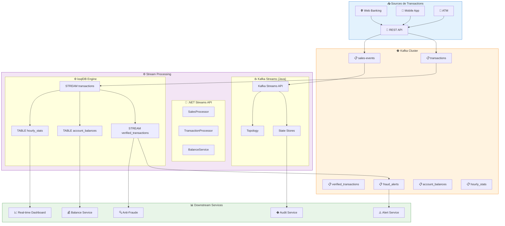
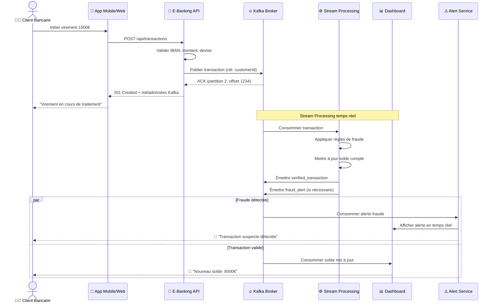
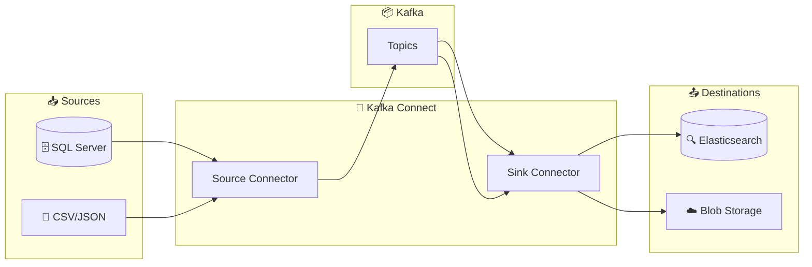
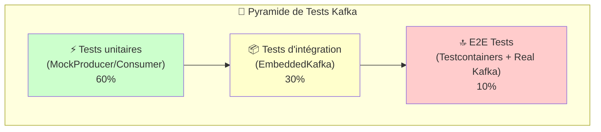
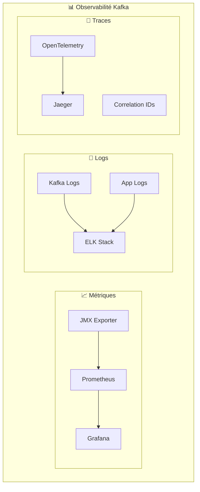
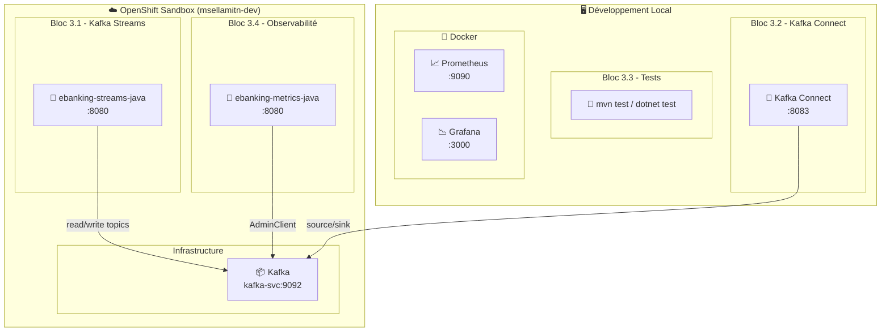

# 📅 Day 03 — Intégration, Tests & Observabilité

> **Jeudi 12 février 2026** | 6h (9h–12h / 13h30–16h30) | **Niveau** : Avancé → Production

---

## 🎯 Objectifs pédagogiques

À la fin de cette journée, vous serez capable de :

| # | Objectif | Bloc |
| --- | -------- | ---- |
| 1 | Construire un **traitement temps réel** avec Kafka Streams (KStream, KTable, agrégations) | 3.1 |
| 2 | Déployer des **connecteurs Source/Sink** et les gérer via REST API | 3.2 |
| 3 | Écrire des **tests unitaires** avec MockProducer / MockConsumer | 3.3 |
| 4 | Implémenter des **tests d'intégration** avec EmbeddedKafka | 3.3 |
| 5 | Collecter les **métriques JMX** des brokers Kafka | 3.4 |
| 6 | Surveiller le **consumer lag** et la santé du cluster via REST | 3.4 |
| 7 | Exposer des **métriques Prometheus** depuis Spring Boot / ASP.NET | 3.4 |

> **Ratio théorie/pratique** : 30% / 70% — Chaque bloc commence par 15-20 min de théorie puis enchaîne sur un lab hands-on.

---

## 📋 Prérequis

- ✅ **Day 01 & Day 02 complétés** (Labs 1.2a–2.3a)
- ✅ Infrastructure Kafka fonctionnelle (Docker ou OpenShift Sandbox)
- ✅ Topic `banking.transactions` existant (6 partitions)
- ✅ **.NET 8 SDK + Confluent.Kafka 2.3.0+** (piste .NET)
- ✅ **Java 17 + Spring Boot 3.2+** (piste Java)

---

## 🏗️ Dual Track : .NET vs Java

Day 03 propose **deux pistes parallèles** pour couvrir les deux écosystèmes principaux de Kafka :

| Piste | Technologie | Public Cible | Avantages |
| ----- | ----------- | ------------ | --------- |
| **.NET** | C# + Confluent.Kafka | Équipes Microsoft | Performance native, intégration écosystème .NET |
| **Java** | Spring Boot + Spring Kafka | Équipes Java/Spring | Écosystème mature, Kafka Streams natif |

> **📋 Choix de piste** : Les deux pistes couvrent les mêmes concepts. Choisissez selon votre expertise ou explorez les deux pour comparer !

---

## 🗓️ Planning de la journée

| Créneau | Bloc | Durée | Contenu |
| ------- | ---- | ----- | ------- |
| 09h00–09h30 | Recap | 30 min | Quiz Day 02 + correction, questions ouvertes |
| 09h30–11h00 | **3.1** | 1h30 | Kafka Streams : KStream, KTable, agrégations, fenêtrage |
| 11h00–11h15 | | 15 min | ☕ Pause |
| 11h15–12h00 | **3.2** | 45 min | Kafka Connect : Source/Sink, REST API, démo |
| 12h00–13h30 | | 1h30 | 🍽️ Déjeuner |
| 13h30–14h30 | **3.3** | 1h | Tests Kafka : MockProducer/Consumer, EmbeddedKafka |
| 14h30–14h45 | | 15 min | ☕ Pause |
| 14h45–16h00 | **3.4** | 1h15 | Observabilité : JMX, Prometheus, Grafana, Consumer Lag |
| 16h00–16h30 | Recap | 30 min | Bilan formation 3 jours, Q&A, prochaines étapes |

---

## 📚 Bloc 3.1 — Kafka Streams & ksqlDB (1h30)

> **Théorie** : 20 min | **Lab** : 1h10

### Architecture Globale



### Cycle de Vie d'une Transaction Stream Processing



### Concepts Clés Expliqués

#### 1. Kafka Streams (Java)

```java
// Topologie de traitement temps réel
StreamsBuilder builder = new StreamsBuilder();

KStream<String, Transaction> transactions = builder.stream("transactions");

// Filtrer les transactions > 10000€ (alerte fraude)
KStream<String, Transaction> highValue = transactions
    .filter((key, tx) -> tx.getAmount().compareTo(new BigDecimal("10000")) > 0);

// Agréger par produit (ventes)
KTable<String, BigDecimal> productSales = builder.stream("sales-events")
    .groupBy((key, sale) -> sale.getProductId(), Grouped.with(Serdes.String(), saleSerde))
    .aggregate(
        () -> BigDecimal.ZERO,
        (key, sale, agg) -> agg.add(sale.getUnitPrice().multiply(new BigDecimal(sale.getQuantity()))),
        Materialized.as("sales-by-product")
    );

// Fenêtrage par minute
KStream<Windowed<String>, BigDecimal> minuteStats = transactions
    .groupByKey()
    .windowedBy(TimeWindows.of(Duration.ofMinutes(1)))
    .aggregate(
        () -> BigDecimal.ZERO,
        (key, tx, agg) -> agg.add(tx.getAmount()),
        Materialized.as("minute-stats")
    );
```

#### 2. .NET Streams API

```csharp
// Service de traitement des ventes
public class SalesStreamProcessorService : BackgroundService
{
    private readonly IProducer<string, string> _producer;
    private readonly ILogger<SalesStreamProcessorService> _logger;

    protected override async Task ExecuteAsync(CancellationToken stoppingToken)
    {
        // Consommer les événements de vente
        var config = new ConsumerConfig
        {
            BootstrapServers = "kafka-svc:9092",
            GroupId = "sales-processor",
            AutoOffsetReset = AutoOffsetReset.Earliest
        };

        using var consumer = new ConsumerBuilder<string, string>(config).Build();
        consumer.Subscribe(new[] { "sales-events" });

        while (!stoppingToken.IsCancellationRequested)
        {
            var result = consumer.Consume(stoppingToken);
            var sale = JsonSerializer.Deserialize<SaleEvent>(result.Message.Value);
            
            // Traiter et agréger
            await ProcessSaleAsync(sale);
            
            consumer.Commit(result);
        }
    }

    private async Task ProcessSaleAsync(SaleEvent sale)
    {
        // Calculer les statistiques
        var stats = new SalesStats
        {
            ProductId = sale.ProductId,
            TotalAmount = sale.UnitPrice * sale.Quantity,
            Quantity = sale.Quantity,
            Timestamp = DateTime.UtcNow
        };

        // Publier les stats agrégées
        var message = new Message<string, string>
        {
            Key = sale.ProductId,
            Value = JsonSerializer.Serialize(stats)
        };

        await _producer.ProduceAsync("sales-stats", message);
    }
}
```

#### 3. ksqlDB Stream Processing

```sql
-- Créer les streams
CREATE STREAM transactions (
    transaction_id VARCHAR PRIMARY KEY,
    from_account VARCHAR,
    to_account VARCHAR,
    amount DECIMAL(10,2),
    currency VARCHAR,
    transaction_type VARCHAR,
    customer_id VARCHAR,
    timestamp VARCHAR
) WITH (
    KAFKA_TOPIC = 'transactions',
    VALUE_FORMAT = 'JSON'
);

-- Stream des transactions vérifiées
CREATE STREAM verified_transactions WITH (
    KAFKA_TOPIC = 'verified_transactions',
    VALUE_FORMAT = 'JSON'
) AS SELECT 
    *
FROM transactions
WHERE amount < 10000  -- Filtrer les montants raisonnables
  AND LENGTH(from_account) = 27  -- Valider format IBAN
  AND LENGTH(to_account) = 27;

-- Table matérialisée pour les soldes
CREATE TABLE account_balances (
    account_id VARCHAR PRIMARY KEY,
    balance DECIMAL(12,2),
    last_updated TIMESTAMP
) WITH (
    KAFKA_TOPIC = 'account_balances',
    VALUE_FORMAT = 'JSON',
    KEY = 'account_id'
);

-- Mettre à jour les soldes en continu
INSERT INTO account_balances
SELECT 
    to_account AS account_id,
    SUM(amount) AS balance,
    LATEST_BY_OFFSET(timestamp) AS last_updated
FROM transactions
GROUP BY to_account;

-- Alerts fraude
CREATE STREAM fraud_alerts WITH (
    KAFKA_TOPIC = 'fraud_alerts',
    VALUE_FORMAT = 'JSON'
) AS SELECT 
    transaction_id,
    from_account,
    to_account,
    amount,
    'HIGH_AMOUNT' AS alert_type,
    timestamp
FROM transactions
WHERE amount > 10000;
```

| Concept | Description | Exemple |
| ------- | ----------- | ------- |
| **KStream** | Flux continu d'événements | Transactions bancaires |
| **KTable** | Vue matérialisée (changelog) | Soldes par compte |
| **Aggregation** | Regroupement et calcul | Total ventes par produit |
| **Windowing** | Fenêtrage temporel | Statistiques par minute |
| **Join** | Enrichissement de données | Transaction + détails produit |
| **State Store** | Stockage local queryable | Requêtes REST sur l'état |

### Lab 3.1a — Kafka Streams Processing

#### 📂 Piste .NET
> **[lab-3.1a — Kafka Streams (.NET)](./module-05-kafka-streams-ksqldb/dotnet/)**

**Objectifs du lab** :

1. Construire une topologie de traitement temps réel
2. Implémenter des agrégations par produit
3. Configurer le fenêtrage temporel (par minute)
4. Exposer les résultats via REST API

#### 📂 Piste Java
> **[lab-3.1a — Kafka Streams (Java)](./module-05-kafka-streams-ksqldb/java/README.md)**

**Objectifs du lab** :

1. Construire une `SalesTopology` avec KStream et KTable
2. Implémenter des agrégations par produit avec state store
3. Configurer le fenêtrage temporel (par minute)
4. Exposer les state stores via REST API (Interactive Queries)

**Concepts Java** :

```java
// Aggregate sales by product
salesStream
    .groupByKey()
    .aggregate(
        SaleAggregate::new,
        (key, value, aggregate) -> aggregate.add(sale),
        Materialized.as("sales-by-product-store")
    );

// Windowed aggregation per minute
salesStream
    .windowedBy(TimeWindows.ofSizeWithNoGrace(Duration.ofMinutes(1)))
    .aggregate(/* ... */);
```

---

## 🔌 Bloc 3.2 — Kafka Connect (45 min)

> **Théorie** : 30 min | **Démo** : 15 min

### Concepts clés



| Concept | Description |
| ------- | ----------- |
| **Source Connector** | Lit des données externes → Kafka topics |
| **Sink Connector** | Lit Kafka topics → écrit vers systèmes externes |
| **Worker** | Process JVM qui exécute les connecteurs |
| **Task** | Unité de parallélisme au sein d'un connecteur |
| **Converter** | Transforme les données (JsonConverter, AvroConverter) |

> 🔗 **Lab complet Kafka Connect** : voir **[Module 06](./module-06-kafka-connect/README.md)**

---

## 🧪 Bloc 3.3 — Tests Kafka (1h)

> **Théorie** : 15 min | **Lab** : 45 min

### Concepts clés



| Niveau | Outil | Vitesse | Fidélité | Isolation |
| ------ | ----- | ------- | -------- | --------- |
| **Unit** | MockProducer/Consumer | ⚡⚡⚡ | ⭐ | ✅ Totale |
| **Integration** | EmbeddedKafka | ⚡⚡ | ⭐⭐ | ✅ Process |
| **E2E** | Testcontainers | ⚡ | ⭐⭐⭐ | ✅ Container |

### Lab 3.3a — Tests unitaires & intégration

#### 📂 Piste .NET
> **[lab-3.3a — Tests Kafka (.NET)](./module-07-testing/dotnet/)**

**Objectifs du lab** :

1. Écrire des tests unitaires avec Moq pour le Producer
2. Tester le Consumer avec des mocks
3. Implémenter des tests d'intégration avec Testcontainers
4. Valider la sérialisation/désérialisation JSON

#### 📂 Piste Java
> **[lab-3.3a — Tests Kafka (Java)](./module-07-testing/java/README.md)**

**Objectifs du lab** :

1. Écrire des tests unitaires avec `MockProducer` (5 tests)
2. Tester le Consumer avec `MockConsumer` (4 tests)
3. Valider le routage par clé, la sérialisation JSON, la gestion d'erreurs
4. (Bonus) Tests d'intégration avec EmbeddedKafka

**Concepts Java** :

```java
// MockProducer - test sans broker Kafka
MockProducer<String, String> mockProducer =
    new MockProducer<>(true, new StringSerializer(), new StringSerializer());

service.send(transaction);

assertEquals(1, mockProducer.history().size());
assertEquals("CUST-001", mockProducer.history().get(0).key());

// MockConsumer - test sans broker Kafka
MockConsumer<String, String> mockConsumer =
    new MockConsumer<>(OffsetResetStrategy.EARLIEST);
mockConsumer.addRecord(new ConsumerRecord<>(TOPIC, 0, 0L, key, json));
```

---

## 📊 Bloc 3.4 — Observabilité (1h15)

> **Théorie** : 20 min | **Lab** : 55 min

### Concepts clés — Les 3 piliers



| Métrique | Description | Seuil d'alerte |
| -------- | ----------- | -------------- |
| **consumer_lag** | Messages non consommés | > 1000 |
| **request_latency_avg** | Latence moyenne | > 100ms |
| **bytes_in_per_sec** | Débit entrant | Selon capacité |
| **under_replicated_partitions** | Partitions sous-répliquées | > 0 |
| **active_controller_count** | Contrôleurs actifs | ≠ 1 |

### Lab 3.4a — Tableau de bord Métriques

#### 📂 Piste Java
> **[lab-3.4a — Metrics Dashboard (Java)](./module-08-observability/java/README.md)**

**Objectifs du lab** :

1. Interroger la santé du cluster Kafka via `AdminClient`
2. Surveiller le **consumer lag** par groupe
3. Lister les topics avec métadonnées (partitions, réplication)
4. Exposer des métriques **Prometheus** via Micrometer

**Concepts Java** :

```java
// AdminClient pour la santé du cluster
DescribeClusterResult cluster = adminClient.describeCluster();
Collection<Node> nodes = cluster.nodes().get();
Node controller = cluster.controller().get();

// Consumer lag
Map<TopicPartition, OffsetAndMetadata> offsets =
    adminClient.listConsumerGroupOffsets(groupId)
        .partitionsToOffsetAndMetadata().get();
```

---

## 🏗️ Architecture Day 03



---

## 📦 Modules & Labs

| Bloc | Module | Lab | Durée | Description |
| ---- | ------ | --- | ----- | ----------- |
| 3.1 | [Kafka Streams](./module-05-kafka-streams-ksqldb/README.md) | Lab 3.1a | 1h10 | KStream, KTable, agrégations, fenêtrage |
| 3.2 | [Kafka Connect](./module-06-kafka-connect/README.md) | (démo) | 15 min | Source/Sink connectors, REST API |
| 3.3 | [Tests Kafka](./module-07-testing/README.md) | Lab 3.3a | 45 min | MockProducer/Consumer, EmbeddedKafka |
| 3.4 | [Observabilité](./module-08-observability/README.md) | Lab 3.4a | 55 min | AdminClient, Prometheus, Consumer Lag |

---

## 🚀 Quick Start

### Démarrer l'infrastructure

<details>
<summary>🐳 Docker</summary>

```bash
# Depuis la racine du projet
cd day-01-foundations/module-01-cluster
./scripts/up.sh

# Vérifier que Kafka est healthy
docker ps | grep kafka
```

</details>

<details>
<summary>☁️ OpenShift Sandbox</summary>

```bash
oc login --token=<TOKEN> --server=<SERVER>
oc get pods -l app=kafka
```

</details>

### Déployer les labs Java sur OpenShift

<details>
<summary>🖥️ PowerShell</summary>

```powershell
cd day-03-integration\scripts\powershell
.\deploy-all-labs.ps1 -Token "sha256~XXX" -Server "https://api.rm3.7wse.p1.openshiftapps.com:6443"
```

</details>

<details>
<summary>🐧 Bash</summary>

```bash
cd day-03-integration/scripts/bash
./deploy-all-labs.sh --token "sha256~XXX" --server "https://api.rm3.7wse.p1.openshiftapps.com:6443"
```

</details>

### Tester toutes les APIs

<details>
<summary>🖥️ PowerShell</summary>

```powershell
.\test-all-apis.ps1 -Token "sha256~XXX" -Server "https://api.rm3.7wse.p1.openshiftapps.com:6443"
```

</details>

<details>
<summary>🐧 Bash</summary>

```bash
./test-all-apis.sh --token "sha256~XXX" --server "https://api.rm3.7wse.p1.openshiftapps.com:6443"
```

</details>

### Lancer les tests locaux (Lab 3.3a)

```bash
# Piste Java
cd day-03-integration/module-07-testing/java
mvn test

# Piste .NET
cd day-03-integration/module-07-testing/dotnet

# Lab 3.1b .NET — ksqlDB Lab (déploie ksqlDB + app)
./scripts/bash/deploy-and-test-3.1b-dotnet.sh --token "sha256~XXX" --server "https://api..."
```

</details>

#### Option B : Déploiement Manuel (Étape par Étape)

<details>
<summary>📋 Déploiement Manuel Java</summary>

```bash
# 1. Builder l'application Java
cd module-05-kafka-streams-ksqldb/java
mvn clean package -DskipTests

# 2. Créer le build S2I
oc new-build java:openjdk-17-ubi8 --binary=true --name=ebanking-streams-java

# 3. Lancer la build
oc start-build ebanking-streams-java --from-dir=. --follow

# 4. Créer l'application
oc new-app ebanking-streams-java

# 5. Configurer les variables d'environnement
oc set env deployment/ebanking-streams-java \
  KAFKA_BOOTSTRAP_SERVERS=kafka-svc:9092 \
  SPRING_PROFILES_ACTIVE=openshift

# 6. Créer la route sécurisée
oc create route edge ebanking-streams-java-secure --service=ebanking-streams-java --port=8080-tcp

# 7. Attendre le déploiement
oc rollout status deployment/ebanking-streams-java
```

</details>

<details>
<summary>📋 Déploiement Manuel .NET</summary>

```bash
# 1. Builder l'application .NET
cd module-05-kafka-streams-ksqldb/dotnet/M05StreamsApi
dotnet publish -c Release -o ./publish

# 2. Créer le build S2I
oc new-build dotnet:8.0-ubi8 --binary=true --name=ebanking-streams-dotnet

# 3. Lancer la build
oc start-build ebanking-streams-dotnet --from-dir=./publish --follow

# 4. Créer l'application
oc new-app ebanking-streams-dotnet

# 5. Configurer les variables d'environnement
oc set env deployment/ebanking-streams-dotnet \
  KAFKA__BootstrapServers=kafka-svc:9092 \
  ASPNETCORE_ENVIRONMENT=Production

# 6. Créer la route sécurisée
oc create route edge ebanking-streams-dotnet-secure --service=ebanking-streams-dotnet --port=8080-tcp

# 7. Attendre le déploiement
oc rollout status deployment/ebanking-streams-dotnet
```

</details>

### Étape 4 : Valider les Déploiements

#### Vérifier les pods

```bash
# Vérifier que tous les pods sont Running
oc get pods -l app=ebanking-streams-java
oc get pods -l app=ebanking-streams-dotnet
oc get pods -l app=banking-ksqldb-lab

# Attendu : 1/1 dans la colonne READY pour chaque pod
```

#### Vérifier les routes

```bash
# Obtenir les URLs publiques
oc get route ebanking-streams-java-secure -o jsonpath='{.spec.host}'
oc get route ebanking-streams-dotnet-secure -o jsonpath='{.spec.host}'
oc get route banking-ksqldb-lab-secure -o jsonpath='{.spec.host}'
```

#### Health Checks

```bash
# Test des endpoints de santé
curl -k https://ebanking-streams-java-secure.apps.sandbox.x8i5.p1.openshiftapps.com/actuator/health
curl -k https://ebanking-streams-dotnet-secure.apps.sandbox.x8i5.p1.openshiftapps.com/api/v1/health
curl -k https://banking-ksqldb-lab-secure.apps.sandbox.x8i5.p1.openshiftapps.com/api/TransactionStream/health
```

---

## 🧪 Tests et Validation

### Scénario 1 : Produire des Événements de Vente

#### Java Kafka Streams

```bash
# Produire un événement de vente
curl -k -X POST https://ebanking-streams-java-secure.apps.sandbox.x8i5.p1.openshiftapps.com/api/v1/sales \
  -H "Content-Type: application/json" \
  -d '{"productId":"PROD-001","quantity":2,"unitPrice":125.00}'

**Réponse attendue (201 Created)**:
```json
{
  "message": "Sale event processed",
  "productId": "PROD-001",
  "quantity": 2,
  "unitPrice": 125.00,
  "totalAmount": 250.00,
  "timestamp": "2026-02-12T10:30:00Z"
}
```

# Vérifier les statistiques
curl -k https://ebanking-streams-java-secure.apps.sandbox.x8i5.p1.openshiftapps.com/api/v1/stats/by-product

**Réponse attendue**:
```json
[
  {
    "productId": "PROD-001",
    "totalAmount": 250.00,
    "totalQuantity": 2,
    "averagePrice": 125.00
  }
]
```
```

#### .NET Streams API

```bash
# Produire un événement de vente
curl -k -X POST https://ebanking-streams-dotnet-secure.apps.sandbox.x8i5.p1.openshiftapps.com/api/v1/sales \
  -H "Content-Type: application/json" \
  -d '{"productId":"PROD-002","quantity":3,"unitPrice":99.50}'

**Réponse attendue (201 Created)**:
```json
{
  "message": "Sale event processed successfully",
  "productId": "PROD-002",
  "quantity": 3,
  "unitPrice": 99.50,
  "totalAmount": 298.50
}
```

# Produire une transaction bancaire
curl -k -X POST https://ebanking-streams-dotnet-secure.apps.sandbox.x8i5.p1.openshiftapps.com/api/v1/transactions \
  -H "Content-Type: application/json" \
  -d '{"customerId":"CUST-001","amount":1500.00,"type":"TRANSFER"}'

**Réponse attendue (201 Created)**:
```json
{
  "message": "Transaction processed successfully",
  "customerId": "CUST-001",
  "amount": 1500.00,
  "type": "TRANSFER",
  "status": "Processed"
}
```
```

### Scénario 2 : ksqlDB Stream Processing

```bash
# Initialiser les streams ksqlDB
curl -k -X POST https://banking-ksqldb-lab-secure.apps.sandbox.x8i5.p1.openshiftapps.com/api/TransactionStream/initialize

**Réponse attendue (200 OK)**:
```json
{
  "message": "ksqlDB streams initialized successfully",
  "streamsCreated": ["transactions", "verified_transactions"],
  "tablesCreated": ["account_balances"]
}
```

# Générer 10 transactions de test
curl -k -X POST https://banking-ksqldb-lab-secure.apps.sandbox.x8i5.p1.openshiftapps.com/api/TransactionStream/transactions/generate/10

**Réponse attendue (200 OK)**:
```json
{
  "message": "Generated 10 test transactions",
  "transactions": [
    {
      "transactionId": "tx-001",
      "fromAccount": "FR7630001000111222334",
      "toAccount": "FR7630001000445566778",
      "amount": 250.00,
      "type": "TRANSFER"
    }
    // ... 9 more transactions
  ]
}
```

# Consulter le solde d'un compte (Pull Query)
curl -k https://banking-ksqldb-lab-secure.apps.sandbox.x8i5.p1.openshiftapps.com/api/TransactionStream/account/CUST-001/balance

**Réponse attendue (200 OK)**:
```json
{
  "accountId": "CUST-001",
  "balance": 12500.50,
  "lastUpdated": "2026-02-12T10:35:00Z",
  "transactionCount": 15
}
```

# Stream des transactions vérifiées (Push Query)
curl -k https://banking-ksqldb-lab-secure.apps.sandbox.x8i5.p1.openshiftapps.com/api/TransactionStream/verified/stream

**Réponse attendue (Server-Sent Events)**:
```
data: {"transactionId":"tx-002","amount":150.00,"verifiedAt":"2026-02-12T10:36:00Z"}

data: {"transactionId":"tx-003","amount":75.25,"verifiedAt":"2026-02-12T10:36:05Z"}
```
```

### Scénario 3 : Vérification dans Kafka

#### Using Kafka UI

**Docker**: <http://localhost:8080>

1. Aller dans **Topics** → **transactions**
2. Cliquer sur **Messages**
3. Vérifier les transactions avec format JSON valide
4. Aller dans **Topics** → **verified_transactions**
5. Vérifier que seules les transactions valides sont présentes

#### Using Kafka CLI

```bash
# Vérifier les transactions originales
oc exec kafka-0 -- /opt/kafka/bin/kafka-console-consumer.sh \
  --bootstrap-server kafka-0.kafka-svc:9092 \
  --topic transactions \
  --from-beginning \
  --max-messages 3

**Résultat attendu**:
```json
{"transactionId":"tx-001","fromAccount":"FR7630001000111222334","toAccount":"FR7630001000445566778","amount":250.00,"type":"TRANSFER"}
{"transactionId":"tx-002","fromAccount":"FR7630001000223344556","toAccount":"FR7630001000556677889","amount":150.00,"type":"PAYMENT"}
{"transactionId":"tx-003","fromAccount":"FR7630001000334455667","toAccount":"FR7630001000667788990","amount":75.25,"type":"TRANSFER"}
```

# Vérifier les transactions vérifiées
oc exec kafka-0 -- /opt/kafka/bin/kafka-console-consumer.sh \
  --bootstrap-server kafka-0.kafka-svc:9092 \
  --topic verified_transactions \
  --from-beginning \
  --max-messages 3

**Résultat attendu** (seules les transactions valides):
```json
{"transactionId":"tx-001","amount":250.00,"verifiedAt":"2026-02-12T10:36:00Z"}
{"transactionId":"tx-002","amount":150.00,"verifiedAt":"2026-02-12T10:36:05Z"}
{"transactionId":"tx-003","amount":75.25,"verifiedAt":"2026-02-12T10:36:10Z"}
```
```

---

## 🚢 Déploiement — 4 Environnements

Chaque lab Day 03 peut être déployé dans **4 environnements**, comme les labs Day 01 et Day 02 :

| Environnement | Outil | Kafka Bootstrap | Accès API |
| ------------- | ----- | --------------- | --------- |
| **🐳 Docker / Local** | `mvn spring-boot:run` / `dotnet run` | `localhost:9092` | `http://localhost:8080/` |
| **☁️ OpenShift Sandbox** | Scripts automatisés | `kafka-svc:9092` | `https://{route}/` |
| **☸️ K8s / OKD** | `docker build` + `kubectl apply` | `kafka-svc:9092` | `http://localhost:8080/` (port-forward) |
| **🖥️ Local (IDE)** | VS Code / IntelliJ | `localhost:9092` | `http://localhost:8080/` |

### Ports locaux Day 03

| Lab | API Name | Port Local | URL |
| --- | -------- | ---------- | --- |
| 3.1a | Kafka Streams API | `:8080` | `http://localhost:8080/api/v1/sales` |
| 3.4a | Metrics Dashboard API | `:8080` | `http://localhost:8080/api/v1/metrics/cluster` |

### Récapitulatif des noms d'applications

| Lab | Piste | App Name (oc/kubectl) | Route OpenShift |
| --- | ----- | --------------------- | --------------- |
| 3.1a | Java | `ebanking-streams-java` | `ebanking-streams-java-secure` |
| 3.1a | .NET | `ebanking-streams-dotnet` | `ebanking-streams-dotnet-secure` |
| 3.1b | .NET | `banking-ksqldb-lab` | `banking-ksqldb-lab-secure` |
| 3.4a | Java | `ebanking-metrics-java` | `ebanking-metrics-java-secure` |

### Déploiement sur OpenShift (Sandbox ou CRC)

```bash
# ── Piste Java (S2I avec java:openjdk-17-ubi8) ──
cd day-03-integration/module-05-kafka-streams-ksqldb/java
oc new-build java:openjdk-17-ubi8 --binary=true --name=ebanking-streams-java
oc start-build ebanking-streams-java --from-dir=. --follow
oc new-app ebanking-streams-java
oc set env deployment/ebanking-streams-java SERVER_PORT=8080 KAFKA_BOOTSTRAP_SERVERS=kafka-svc:9092
oc create route edge ebanking-streams-java-secure --service=ebanking-streams-java --port=8080-tcp

# ── Piste .NET (S2I avec dotnet:8.0-ubi8) ──
cd day-03-integration/module-05-kafka-streams-ksqldb/dotnet/M05StreamsApi
oc new-build dotnet:8.0-ubi8 --binary=true --name=ebanking-streams-dotnet
oc start-build ebanking-streams-dotnet --from-dir=. --follow
oc new-app ebanking-streams-dotnet
oc set env deployment/ebanking-streams-dotnet Kafka__BootstrapServers=kafka-svc:9092 ASPNETCORE_URLS=http://0.0.0.0:8080
oc create route edge ebanking-streams-dotnet-secure --service=ebanking-streams-dotnet --port=8080-tcp
```

> **Scripts automatisés** : Utilisez les scripts dans `scripts/bash/` ou `scripts/powershell/` pour un déploiement complet avec tests intégrés. Voir [scripts/README.md](scripts/README.md).

---

## 📋 Endpoints API

### Lab 3.1a — Kafka Streams Processing

| Méthode | Endpoint | Description |
| ------- | -------- | ----------- |
| GET | `/` | Informations de l'application |
| GET | `/actuator/health` | Vérification de santé |
| POST | `/api/v1/sales` | Produire un événement de vente |
| GET | `/api/v1/stats/by-product` | Statistiques agrégées par produit |
| GET | `/api/v1/stats/per-minute` | Statistiques fenêtrées par minute |
| GET | `/api/v1/stores/{name}/all` | Interroger un state store |
| GET | `/api/v1/stores/{name}/{key}` | Interroger un state store par clé |

### Lab 3.1a (.NET) — Streams API

| Méthode | Endpoint | Description |
| ------- | -------- | ----------- |
| GET | `/` | Informations de l'application |
| GET | `/swagger` | Swagger UI |
| GET | `/api/v1/health` | Vérification de santé |
| POST | `/api/v1/sales` | Produire un événement de vente |
| GET | `/api/v1/stats/by-product` | Statistiques agrégées par produit |
| POST | `/api/v1/transactions` | Produire une transaction bancaire |
| GET | `/api/v1/balances` | Soldes clients |
| GET | `/api/v1/stores/{name}/all` | Interroger un state store |

### Lab 3.1b (.NET) — ksqlDB Lab

| Méthode | Endpoint | Description |
| ------- | -------- | ----------- |
| GET | `/swagger` | Swagger UI |
| GET | `/api/TransactionStream/health` | Vérification de santé |
| POST | `/api/TransactionStream/initialize` | Initialiser les streams ksqlDB |
| POST | `/api/TransactionStream/transactions/generate/{n}` | Générer N transactions de test |
| GET | `/api/TransactionStream/account/{id}/balance` | Pull query — solde compte |
| GET | `/api/TransactionStream/verified/stream` | Push query — transactions vérifiées |
| GET | `/api/TransactionStream/fraud/stream` | Push query — alertes fraude |

### Lab 3.4a — Tableau de bord Métriques

| Méthode | Endpoint | Description |
| ------- | -------- | ----------- |
| GET | `/` | Informations de l'application |
| GET | `/actuator/health` | Vérification de santé |
| GET | `/actuator/prometheus` | Métriques Prometheus (Micrometer) |
| GET | `/api/v1/metrics/cluster` | Santé du cluster Kafka (brokers, contrôleur) |
| GET | `/api/v1/metrics/topics` | Métadonnées des topics (partitions, réplication) |
| GET | `/api/v1/metrics/consumers` | Consumer lag par groupe |

---

## 🧪 Tests API — Scénarios de Validation

### Lab 3.1a (Java) — Kafka Streams Processing

```bash
# Health check
curl -k https://ebanking-streams-java-secure.apps.sandbox.x8i5.p1.openshiftapps.com/actuator/health

# Produire un événement de vente
curl -k -X POST https://ebanking-streams-java-secure.apps.sandbox.x8i5.p1.openshiftapps.com/api/v1/sales \
  -H "Content-Type: application/json" \
  -d '{"productId":"PROD-001","quantity":2,"unitPrice":125.00}'

# Statistiques par produit
curl -k https://ebanking-streams-java-secure.apps.sandbox.x8i5.p1.openshiftapps.com/api/v1/stats/by-product
```

### Lab 3.1a (.NET) — Streams API

```bash
# Health check
curl -k https://ebanking-streams-dotnet-secure.apps.sandbox.x8i5.p1.openshiftapps.com/api/v1/health

# Produire un événement de vente
curl -k -X POST https://ebanking-streams-dotnet-secure.apps.sandbox.x8i5.p1.openshiftapps.com/api/v1/sales \
  -H "Content-Type: application/json" \
  -d '{"productId":"PROD-001","quantity":3,"unitPrice":99.50}'

# Produire une transaction bancaire
curl -k -X POST https://ebanking-streams-dotnet-secure.apps.sandbox.x8i5.p1.openshiftapps.com/api/v1/transactions \
  -H "Content-Type: application/json" \
  -d '{"customerId":"CUST-001","amount":1500.00,"type":"TRANSFER"}'

# Statistiques par produit
curl -k https://ebanking-streams-dotnet-secure.apps.sandbox.x8i5.p1.openshiftapps.com/api/v1/stats/by-product
```

### Lab 3.1b (.NET) — ksqlDB Lab

```bash
# Health check
curl -k https://banking-ksqldb-lab-secure.apps.sandbox.x8i5.p1.openshiftapps.com/api/TransactionStream/health

# Initialiser les streams ksqlDB
curl -k -X POST https://banking-ksqldb-lab-secure.apps.sandbox.x8i5.p1.openshiftapps.com/api/TransactionStream/initialize

# Générer 5 transactions de test
curl -k -X POST https://banking-ksqldb-lab-secure.apps.sandbox.x8i5.p1.openshiftapps.com/api/TransactionStream/transactions/generate/5

# Solde d'un compte (Pull query)
curl -k https://banking-ksqldb-lab-secure.apps.sandbox.x8i5.p1.openshiftapps.com/api/TransactionStream/account/CUST-001/balance
```

### Lab 3.4a (Java) — Metrics Dashboard

```bash
# Health check
curl -k https://ebanking-metrics-java-secure.apps.sandbox.x8i5.p1.openshiftapps.com/actuator/health

# Santé du cluster Kafka
curl -k https://ebanking-metrics-java-secure.apps.sandbox.x8i5.p1.openshiftapps.com/api/v1/metrics/cluster

# Métadonnées des topics
curl -k https://ebanking-metrics-java-secure.apps.sandbox.x8i5.p1.openshiftapps.com/api/v1/metrics/topics

# Consumer lag par groupe
curl -k https://ebanking-metrics-java-secure.apps.sandbox.x8i5.p1.openshiftapps.com/api/v1/metrics/consumers

# Métriques Prometheus
curl -k https://ebanking-metrics-java-secure.apps.sandbox.x8i5.p1.openshiftapps.com/actuator/prometheus
```

---

## ⚠️ Troubleshooting

| Erreur | Cause | Solution |
| ------ | ----- | -------- |
| `Connector not found` | Plugin non installé | Vérifier `/usr/share/java/` |
| `No tasks assigned` | Configuration invalide | Valider avec PUT validate |
| `Testcontainers timeout` | Docker lent | Augmenter timeout startup |
| `Prometheus scrape failed` | JMX non exposé | Vérifier KAFKA_JMX_OPTS |
| `Streams not ready (503)` | Kafka Streams en démarrage | Attendre state = RUNNING |
| `AdminClient timeout` | Broker Kafka inaccessible | Vérifier KAFKA_BOOTSTRAP_SERVERS |
| `MockProducer history empty` | Mock non injecté | Vérifier l'injection dans le service |
| `dotnet build failed` | .NET 8 SDK manquant | Installer .NET 8 ou utiliser `dotnet:8.0-ubi8` |
| `ksqlDB initialize failed` | ksqlDB non déployé | Déployer ksqlDB d'abord via le script 3.1b |

---

## ✅ Validation Day 03

### Piste Java

- [ ] Lab 3.1a : Topologie Kafka Streams fonctionnelle, agrégations par produit, fenêtrage par minute
- [ ] Lab 3.1a : State stores accessibles via REST API
- [ ] Lab 3.3a : 9 tests unitaires passent (5 producer + 4 consumer) avec MockProducer/Consumer
- [ ] Lab 3.4a : Santé du cluster visible via `/api/v1/metrics/cluster`
- [ ] Lab 3.4a : Consumer lag calculé via `/api/v1/metrics/consumers`
- [ ] Lab 3.4a : Métriques Prometheus exposées via `/actuator/prometheus`

### Piste .NET

- [ ] Lab 3.1a : Streams API déployée, POST /api/v1/sales accepté, stats par produit accessibles
- [ ] Lab 3.1a : Transactions bancaires et soldes clients fonctionnels
- [ ] Lab 3.1a : Swagger UI accessible
- [ ] Lab 3.1b : ksqlDB initialisé, streams créés
- [ ] Lab 3.1b : Push/Pull queries fonctionnelles (soldes, transactions vérifiées, alertes fraude)

### Commun

- [ ] Lab 3.2 : Comprendre Source/Sink connectors et la REST API de Kafka Connect
- [ ] Comprendre les 3 piliers de l'observabilité (métriques, logs, traces)

---

## ➡️ Navigation

⬅️ **[Day 02 — Patterns de Production & Sérialisation](../day-02-development/README.md)** | 🏠 **[Overview](../README.md)**
