# 📅 Day 03 — Intégration, Tests & Observabilité

> **Jeudi 12 février 2026** | 6h (9h–12h / 13h30–16h30) | **Niveau** : Avancé → Production

---

## 🎯 Objectifs pédagogiques

À la fin de cette journée, vous serez capable de :

| # | Objectif | Bloc |
| --- | -------- | ---- |
| 1 | Construire un **traitement temps réel** avec Kafka Streams (KStream, KTable, agrégations) | 3.1 |
| 2 | Déployer des **connecteurs Source/Sink** et les gérer via REST API | 3.2 |
| 3 | Écrire des **tests unitaires** avec MockProducer / MockConsumer | 3.3 |
| 4 | Implémenter des **tests d'intégration** avec EmbeddedKafka | 3.3 |
| 5 | Collecter les **métriques JMX** des brokers Kafka | 3.4 |
| 6 | Surveiller le **consumer lag** et la santé du cluster via REST | 3.4 |
| 7 | Exposer des **métriques Prometheus** depuis Spring Boot / ASP.NET | 3.4 |

> **Ratio théorie/pratique** : 30% / 70% — Chaque bloc commence par 15-20 min de théorie puis enchaîne sur un lab hands-on.

---

## 📋 Prérequis

- ✅ **Day 01 & Day 02 complétés** (Labs 1.2a–2.3a)
- ✅ Infrastructure Kafka fonctionnelle (Docker ou OpenShift Sandbox)
- ✅ Topic `banking.transactions` existant (6 partitions)
- ✅ **.NET 8 SDK + Confluent.Kafka 2.3.0+** (piste .NET)
- ✅ **Java 17 + Spring Boot 3.2+** (piste Java)

---

## 🏗️ Dual Track : .NET vs Java

Day 03 propose **deux pistes parallèles** pour couvrir les deux écosystèmes principaux de Kafka :

| Piste | Technologie | Public Cible | Avantages |
| ----- | ----------- | ------------ | --------- |
| **.NET** | C# + Confluent.Kafka | Équipes Microsoft | Performance native, intégration écosystème .NET |
| **Java** | Spring Boot + Spring Kafka | Équipes Java/Spring | Écosystème mature, Kafka Streams natif |

> **📋 Choix de piste** : Les deux pistes couvrent les mêmes concepts. Choisissez selon votre expertise ou explorez les deux pour comparer !

---

## 🗓️ Planning de la journée

| Créneau | Bloc | Durée | Contenu |
| ------- | ---- | ----- | ------- |
| 09h00–09h30 | Recap | 30 min | Quiz Day 02 + correction, questions ouvertes |
| 09h30–11h00 | **3.1** | 1h30 | Kafka Streams : KStream, KTable, agrégations, fenêtrage |
| 11h00–11h15 | | 15 min | ☕ Pause |
| 11h15–12h00 | **3.2** | 45 min | Kafka Connect : Source/Sink, REST API, démo |
| 12h00–13h30 | | 1h30 | 🍽️ Déjeuner |
| 13h30–14h30 | **3.3** | 1h | Tests Kafka : MockProducer/Consumer, EmbeddedKafka |
| 14h30–14h45 | | 15 min | ☕ Pause |
| 14h45–16h00 | **3.4** | 1h15 | Observabilité : JMX, Prometheus, Grafana, Consumer Lag |
| 16h00–16h30 | Recap | 30 min | Bilan formation 3 jours, Q&A, prochaines étapes |

---

## 📚 Bloc 3.1 — Kafka Streams (1h30)

> **Théorie** : 20 min | **Lab** : 1h10

### Concepts clés



```mermaid
flowchart LR
    subgraph Input["📥 Événements"]
        IN["sales-events"]
    end

    subgraph Topology["🔄 Kafka Streams Topology"]
        FILTER["⚡ Filter >100€"]
        AGG["📊 Aggregate par produit"]
        WIN["⏰ Fenêtrage par minute"]
        JOIN["🔗 Join avec référentiel"]
    end

    subgraph Output["📤 Résultats"]
        OUT1["large-sales"]
        OUT2["sales-by-product"]
        OUT3["sales-per-minute"]
        OUT4["enriched-sales"]
    end

    IN --> FILTER --> OUT1
    IN --> AGG --> OUT2
    IN --> WIN --> OUT3
    IN --> JOIN --> OUT4
```

| Concept | Description | Exemple |
| ------- | ----------- | ------- |
| **KStream** | Flux continu d'événements | Transactions bancaires |
| **KTable** | Vue matérialisée (changelog) | Soldes par compte |
| **Aggregation** | Regroupement et calcul | Total ventes par produit |
| **Windowing** | Fenêtrage temporel | Statistiques par minute |
| **Join** | Enrichissement de données | Transaction + détails produit |
| **State Store** | Stockage local queryable | Requêtes REST sur l'état |

### Lab 3.1a — Kafka Streams Processing

#### 📂 Piste .NET
> **[lab-3.1a — Kafka Streams (.NET)](./module-05-kafka-streams-ksqldb/dotnet/)**

**Objectifs du lab** :

1. Construire une topologie de traitement temps réel
2. Implémenter des agrégations par produit
3. Configurer le fenêtrage temporel (par minute)
4. Exposer les résultats via REST API

#### 📂 Piste Java
> **[lab-3.1a — Kafka Streams (Java)](./module-05-kafka-streams-ksqldb/java/README.md)**

**Objectifs du lab** :

1. Construire une `SalesTopology` avec KStream et KTable
2. Implémenter des agrégations par produit avec state store
3. Configurer le fenêtrage temporel (par minute)
4. Exposer les state stores via REST API (Interactive Queries)

**Concepts Java** :

```java
// Aggregate sales by product
salesStream
    .groupByKey()
    .aggregate(
        SaleAggregate::new,
        (key, value, aggregate) -> aggregate.add(sale),
        Materialized.as("sales-by-product-store")
    );

// Windowed aggregation per minute
salesStream
    .windowedBy(TimeWindows.ofSizeWithNoGrace(Duration.ofMinutes(1)))
    .aggregate(/* ... */);
```

---

## 🔌 Bloc 3.2 — Kafka Connect (45 min)

> **Théorie** : 30 min | **Démo** : 15 min

### Concepts clés



```mermaid
flowchart LR
    subgraph Sources["📥 Sources"]
        DB[("🗄️ SQL Server")]
        FILE["📄 CSV/JSON"]
    end

    subgraph Connect["🔌 Kafka Connect"]
        SC["Source Connector"]
        SK["Sink Connector"]
    end

    subgraph Kafka["📦 Kafka"]
        T["Topics"]
    end

    subgraph Sinks["📤 Destinations"]
        ES[("🔍 Elasticsearch")]
        S3["☁️ Blob Storage"]
    end

    DB --> SC --> T
    FILE --> SC
    T --> SK --> ES
    T --> SK --> S3
```

| Concept | Description |
| ------- | ----------- |
| **Source Connector** | Lit des données externes → Kafka topics |
| **Sink Connector** | Lit Kafka topics → écrit vers systèmes externes |
| **Worker** | Process JVM qui exécute les connecteurs |
| **Task** | Unité de parallélisme au sein d'un connecteur |
| **Converter** | Transforme les données (JsonConverter, AvroConverter) |

> 🔗 **Lab complet Kafka Connect** : voir **[Module 06](./module-06-kafka-connect/README.md)**

---

## 🧪 Bloc 3.3 — Tests Kafka (1h)

> **Théorie** : 15 min | **Lab** : 45 min

### Concepts clés


| Niveau | Outil | Vitesse | Fidélité | Isolation |
| ------ | ----- | ------- | -------- | --------- |
| **Unit** | MockProducer/Consumer | ⚡⚡⚡ | ⭐ | ✅ Totale |
| **Integration** | EmbeddedKafka | ⚡⚡ | ⭐⭐ | ✅ Process |
| **E2E** | Testcontainers | ⚡ | ⭐⭐⭐ | ✅ Container |

### Lab 3.3a — Tests unitaires & intégration

#### 📂 Piste .NET
> **[lab-3.3a — Tests Kafka (.NET)](./module-07-testing/dotnet/)**

**Objectifs du lab** :

1. Écrire des tests unitaires avec Moq pour le Producer
2. Tester le Consumer avec des mocks
3. Implémenter des tests d'intégration avec Testcontainers
4. Valider la sérialisation/désérialisation JSON

#### 📂 Piste Java
> **[lab-3.3a — Tests Kafka (Java)](./module-07-testing/java/README.md)**

**Objectifs du lab** :

1. Écrire des tests unitaires avec `MockProducer` (5 tests)
2. Tester le Consumer avec `MockConsumer` (4 tests)
3. Valider le routage par clé, la sérialisation JSON, la gestion d'erreurs
4. (Bonus) Tests d'intégration avec EmbeddedKafka

**Concepts Java** :

```java
// MockProducer - test sans broker Kafka
MockProducer<String, String> mockProducer =
    new MockProducer<>(true, new StringSerializer(), new StringSerializer());

service.send(transaction);

assertEquals(1, mockProducer.history().size());
assertEquals("CUST-001", mockProducer.history().get(0).key());

// MockConsumer - test sans broker Kafka
MockConsumer<String, String> mockConsumer =
    new MockConsumer<>(OffsetResetStrategy.EARLIEST);
mockConsumer.addRecord(new ConsumerRecord<>(TOPIC, 0, 0L, key, json));
```

---

## 📊 Bloc 3.4 — Observabilité (1h15)

> **Théorie** : 20 min | **Lab** : 55 min

### Concepts clés — Les 3 piliers

```mermaid
flowchart TB
    subgraph Observability["📊 Observabilité Kafka"]
        subgraph Metrics["📈 Métriques"]
            JMX["JMX Exporter"]
            PROM["Prometheus"]
            GRAF["Grafana"]
        end

        subgraph Logs["📝 Logs"]
            KL["Kafka Logs"]
            AL["App Logs"]
            ELK["ELK Stack"]
        end

        subgraph Traces["🔗 Traces"]
            OT["OpenTelemetry"]
            JAEG["Jaeger"]
            CORR["Correlation IDs"]
        end
    end

    JMX --> PROM --> GRAF
    KL --> ELK
    AL --> ELK
    OT --> JAEG
```



| Métrique | Description | Seuil d'alerte |
| -------- | ----------- | -------------- |
| **consumer_lag** | Messages non consommés | > 1000 |
| **request_latency_avg** | Latence moyenne | > 100ms |
| **bytes_in_per_sec** | Débit entrant | Selon capacité |
| **under_replicated_partitions** | Partitions sous-répliquées | > 0 |
| **active_controller_count** | Contrôleurs actifs | ≠ 1 |

### Lab 3.4a — Tableau de bord Métriques

#### 📂 Piste Java
> **[lab-3.4a — Metrics Dashboard (Java)](./module-08-observability/java/README.md)**

**Objectifs du lab** :

1. Interroger la santé du cluster Kafka via `AdminClient`
2. Surveiller le **consumer lag** par groupe
3. Lister les topics avec métadonnées (partitions, réplication)
4. Exposer des métriques **Prometheus** via Micrometer

**Concepts Java** :

```java
// AdminClient pour la santé du cluster
DescribeClusterResult cluster = adminClient.describeCluster();
Collection<Node> nodes = cluster.nodes().get();
Node controller = cluster.controller().get();

// Consumer lag
Map<TopicPartition, OffsetAndMetadata> offsets =
    adminClient.listConsumerGroupOffsets(groupId)
        .partitionsToOffsetAndMetadata().get();
```

---

## 🏗️ Architecture Day 03

```mermaid
flowchart TB
    subgraph OpenShift["☁️ OpenShift Sandbox (msellamitn-dev)"]
        subgraph Infra["Infrastructure"]
            K["📦 Kafka<br/>kafka-svc:9092"]
        end

        subgraph Bloc31["Bloc 3.1 - Kafka Streams"]
            STREAMS["🔷 ebanking-streams-java<br/>:8080"]
        end

        subgraph Bloc34["Bloc 3.4 - Observabilité"]
            METRICS["🔷 ebanking-metrics-java<br/>:8080"]
        end
    end

    subgraph Local["🖥️ Développement Local"]
        subgraph Bloc32["Bloc 3.2 - Kafka Connect"]
            KC["🔌 Kafka Connect<br/>:8083"]
        end

        subgraph Bloc33["Bloc 3.3 - Tests"]
            TESTS["🧪 mvn test / dotnet test"]
        end

        subgraph Docker["🐳 Docker"]
            PROM["📈 Prometheus<br/>:9090"]
            GRAF["📉 Grafana<br/>:3000"]
        end
    end

    STREAMS -->|"read/write topics"| K
    METRICS -->|"AdminClient"| K
    KC -->|"source/sink"| K
```



---

## 📦 Modules & Labs

| Bloc | Module | Lab | Durée | Description |
| ---- | ------ | --- | ----- | ----------- |
| 3.1 | [Kafka Streams](./module-05-kafka-streams-ksqldb/README.md) | Lab 3.1a | 1h10 | KStream, KTable, agrégations, fenêtrage |
| 3.2 | [Kafka Connect](./module-06-kafka-connect/README.md) | (démo) | 15 min | Source/Sink connectors, REST API |
| 3.3 | [Tests Kafka](./module-07-testing/README.md) | Lab 3.3a | 45 min | MockProducer/Consumer, EmbeddedKafka |
| 3.4 | [Observabilité](./module-08-observability/README.md) | Lab 3.4a | 55 min | AdminClient, Prometheus, Consumer Lag |

---

## 🚀 Quick Start

### Démarrer l'infrastructure

<details>
<summary>🐳 Docker</summary>

```bash
# Depuis la racine du projet
cd day-01-foundations/module-01-cluster
./scripts/up.sh

# Vérifier que Kafka est healthy
docker ps | grep kafka
```

</details>

<details>
<summary>☁️ OpenShift Sandbox</summary>

```bash
oc login --token=<TOKEN> --server=<SERVER>
oc get pods -l app=kafka
```

</details>

### Déployer les labs Java sur OpenShift

<details>
<summary>🖥️ PowerShell</summary>

```powershell
cd day-03-integration\scripts\powershell
.\deploy-all-labs.ps1 -Token "sha256~XXX" -Server "https://api.rm3.7wse.p1.openshiftapps.com:6443"
```

</details>

<details>
<summary>🐧 Bash</summary>

```bash
cd day-03-integration/scripts/bash
./deploy-all-labs.sh --token "sha256~XXX" --server "https://api.rm3.7wse.p1.openshiftapps.com:6443"
```

</details>

### Tester toutes les APIs

<details>
<summary>🖥️ PowerShell</summary>

```powershell
.\test-all-apis.ps1 -Token "sha256~XXX" -Server "https://api.rm3.7wse.p1.openshiftapps.com:6443"
```

</details>

<details>
<summary>🐧 Bash</summary>

```bash
./test-all-apis.sh --token "sha256~XXX" --server "https://api.rm3.7wse.p1.openshiftapps.com:6443"
```

</details>

### Lancer les tests locaux (Lab 3.3a)

```bash
# Piste Java
cd day-03-integration/module-07-testing/java
mvn test

# Piste .NET
cd day-03-integration/module-07-testing/dotnet
dotnet test
```

---

## 🚢 Déploiement — 3 Environnements

Chaque lab Day 03 peut être déployé dans **3 environnements**, comme les labs Day 01 et Day 02 :

| Environnement | Outil | Kafka Bootstrap | Accès API |
| ------------- | ----- | --------------- | --------- |
| **🐳 Docker / Local** | `mvn spring-boot:run` | `localhost:9092` | `http://localhost:8080/` |
| **☁️ OpenShift Sandbox** | `oc new-build` + Binary Build | `kafka-svc:9092` | `https://{route}/` |
| **☸️ K8s / OKD** | `docker build` + `kubectl apply` | `kafka-svc:9092` | `http://localhost:8080/` (port-forward) |

### Ports locaux Day 03

| Lab | API Name | Port Local | URL |
| --- | -------- | ---------- | --- |
| 3.1a | Kafka Streams API | `:8080` | `http://localhost:8080/api/v1/sales` |
| 3.4a | Metrics Dashboard API | `:8080` | `http://localhost:8080/api/v1/metrics/cluster` |

### Récapitulatif des noms d'applications

| Lab | App Name (oc/kubectl) | Route OpenShift |
| --- | --------------------- | --------------- |
| 3.1a | `ebanking-streams-java` | `ebanking-streams-java-secure` |
| 3.4a | `ebanking-metrics-java` | `ebanking-metrics-java-secure` |

### Déploiement sur OpenShift (Sandbox ou CRC)

```bash
# Pattern commun : Binary Build S2I pour chaque lab Java
cd day-03-integration/module-05-kafka-streams-ksqldb/java

oc new-build java:openjdk-17-ubi8 --binary=true --name=ebanking-streams-java
oc start-build ebanking-streams-java --from-dir=. --follow
oc new-app ebanking-streams-java
oc set env deployment/ebanking-streams-java SERVER_PORT=8080 KAFKA_BOOTSTRAP_SERVERS=kafka-svc:9092
oc create route edge ebanking-streams-java-secure --service=ebanking-streams-java --port=8080-tcp
```

---

## 📋 Endpoints API

### Lab 3.1a — Kafka Streams Processing

| Méthode | Endpoint | Description |
| ------- | -------- | ----------- |
| GET | `/` | Informations de l'application |
| GET | `/actuator/health` | Vérification de santé |
| POST | `/api/v1/sales` | Produire un événement de vente |
| GET | `/api/v1/stats/by-product` | Statistiques agrégées par produit |
| GET | `/api/v1/stats/per-minute` | Statistiques fenêtrées par minute |
| GET | `/api/v1/stores/{name}/all` | Interroger un state store |
| GET | `/api/v1/stores/{name}/{key}` | Interroger un state store par clé |

### Lab 3.4a — Tableau de bord Métriques

| Méthode | Endpoint | Description |
| ------- | -------- | ----------- |
| GET | `/` | Informations de l'application |
| GET | `/actuator/health` | Vérification de santé |
| GET | `/actuator/prometheus` | Métriques Prometheus (Micrometer) |
| GET | `/api/v1/metrics/cluster` | Santé du cluster Kafka (brokers, contrôleur) |
| GET | `/api/v1/metrics/topics` | Métadonnées des topics (partitions, réplication) |
| GET | `/api/v1/metrics/consumers` | Consumer lag par groupe |

---

## ⚠️ Troubleshooting

| Erreur | Cause | Solution |
| ------ | ----- | -------- |
| `Connector not found` | Plugin non installé | Vérifier `/usr/share/java/` |
| `No tasks assigned` | Configuration invalide | Valider avec PUT validate |
| `Testcontainers timeout` | Docker lent | Augmenter timeout startup |
| `Prometheus scrape failed` | JMX non exposé | Vérifier KAFKA_JMX_OPTS |
| `Streams not ready (503)` | Kafka Streams en démarrage | Attendre state = RUNNING |
| `AdminClient timeout` | Broker Kafka inaccessible | Vérifier KAFKA_BOOTSTRAP_SERVERS |
| `MockProducer history empty` | Mock non injecté | Vérifier l'injection dans le service |

---

## ✅ Validation Day 03

- [ ] Lab 3.1a : Topologie Kafka Streams fonctionnelle, agrégations par produit, fenêtrage par minute
- [ ] Lab 3.1a : State stores accessibles via REST API
- [ ] Lab 3.2 : Comprendre Source/Sink connectors et la REST API de Kafka Connect
- [ ] Lab 3.3a : 9 tests unitaires passent (5 producer + 4 consumer) avec MockProducer/Consumer
- [ ] Lab 3.4a : Santé du cluster visible via `/api/v1/metrics/cluster`
- [ ] Lab 3.4a : Consumer lag calculé via `/api/v1/metrics/consumers`
- [ ] Lab 3.4a : Métriques Prometheus exposées via `/actuator/prometheus`
- [ ] Comprendre les 3 piliers de l'observabilité (métriques, logs, traces)

---

## ➡️ Navigation

⬅️ **[Day 02 — Patterns de Production & Sérialisation](../day-02-development/README.md)** | 🏠 **[Overview](../README.md)**
