# LAB 3.1 : Kafka Streams & ksqlDB - Stream Processing Avancé

## ⏱️ Durée estimée : 2 heures

---

## 🔀 Double Piste — Java & .NET

Ce module contient **3 labs** couvrant le stream processing avec deux approches :

| Lab | Piste | Technologie | Déploiement | README |
| --- | ----- | ----------- | ----------- | ------ |
| **3.1a** | Java | Kafka Streams (Spring Boot) | OpenShift S2I | [java/README.md](java/README.md) |
| **3.1a** | .NET | Confluent.Kafka + BackgroundService | OpenShift S2I | [dotnet/M05StreamsApi/README.md](dotnet/M05StreamsApi/README.md) |
| **3.1b** | .NET | ksqlDB + C# REST Client | OpenShift + ksqlDB | [dotnet/BankingKsqlDBLab/README.md](dotnet/BankingKsqlDBLab/README.md) |

### Applications déployées sur OpenShift

| App Name | Piste | Route | Port |
| -------- | ----- | ----- | ---- |
| `ebanking-streams-java` | Java | `ebanking-streams-java-secure` | 8080 |
| `ebanking-streams-dotnet` | .NET | `ebanking-streams-dotnet-secure` | 8080 |
| `banking-ksqldb-lab` | .NET | `banking-ksqldb-lab-secure` | 8080 |

### Déploiement rapide — OpenShift Sandbox

<details>
<summary>🖥️ PowerShell</summary>

```powershell
# Lab 3.1a Java — Kafka Streams
.\scripts\powershell\deploy-and-test-3.1a-java.ps1 -Token "sha256~XXX" -Server "https://api..."

# Lab 3.1a .NET — Streams API
.\scripts\powershell\deploy-and-test-3.1a-dotnet.ps1 -Token "sha256~XXX" -Server "https://api..."

# Lab 3.1b .NET — ksqlDB Lab (déploie ksqlDB + app)
.\scripts\powershell\deploy-and-test-3.1b-dotnet.ps1 -Token "sha256~XXX" -Server "https://api..."
```

</details>

<details>
<summary>🐧 Bash</summary>

```bash
# Lab 3.1a Java — Kafka Streams
./scripts/bash/deploy-and-test-3.1a-java.sh --token "sha256~XXX" --server "https://api..."

# Lab 3.1a .NET — Streams API
./scripts/bash/deploy-and-test-3.1a-dotnet.sh --token "sha256~XXX" --server "https://api..."

# Lab 3.1b .NET — ksqlDB Lab (déploie ksqlDB + app)
./scripts/bash/deploy-and-test-3.1b-dotnet.sh --token "sha256~XXX" --server "https://api..."
```

</details>

### Déploiement local — Docker

```bash
# Lab 3.1a Java
cd java && mvn spring-boot:run

# Lab 3.1a .NET
cd dotnet/M05StreamsApi && dotnet run

# Lab 3.1b .NET (nécessite ksqlDB)
docker compose -f docker-compose.module.yml up -d
cd dotnet/BankingKsqlDBLab && dotnet run
```

---

## 🏦 Contexte E-Banking

Dans les labs précédents, vous avez appris à :
- ✅ Sérialiser les données de manière typée (Lab 2.1)
- ✅ Implémenter des producers avancés (Lab 2.2)
- ✅ Construire des consumers robustes (Lab 2.3)

Mais **transmettre les données n'est que la première étape**. En production, une banque doit **traiter les transactions en temps réel** pour :

- ❌ **Détecter la fraude** : Identifier les transactions suspectes (montants anormaux, voyages impossibles)
- ❌ **Mettre à jour les soldes** : Agréger les débits/crédits par compte
- ❌ **Générer des statistiques** : Fenêtrages horaires, quotidiens des transactions
- ❌ **Respecter la conformité** : Audit, déclenchement d'alertes réglementaires

Dans ce lab, vous allez implémenter un **système de stream processing production-grade** avec deux approches : **Kafka Streams (Java)** pour le traitement natif et **ksqlDB + C# (.NET)** pour le traitement SQL.

### Architecture Globale

```mermaid
flowchart LR
    subgraph Sources["📥 Sources de Transactions"]
        Web["🌐 Web Banking"]
        Mobile["📱 Mobile App"]
        ATM["🏧 ATM"]
    end

    subgraph KafkaCluster["🔥 Kafka Cluster"]
        T["📋 transactions"]
        VT["📋 verified_transactions"]
        FA["📋 fraud_alerts"]
        ABS["📋 account_balances"]
    end

    subgraph KsqlDB["⚙️ ksqlDB Stream Processing Engine"]
        S1["STREAM transactions"]
        S2["STREAM verified_transactions"]
        S3["STREAM fraud_alerts"]
        T1["TABLE account_balances (Materialized View)"]
        T2["TABLE hourly_stats (Windowed Aggregation)"]
    end

    subgraph DotNet["🚀 C# .NET Client"]
        API["E-Banking API"]
        Queries["Push/Pull Queries"]
        Dashboard["Real-time Dashboard"]
    end

    subgraph Consumers["📊 Downstream Services"]
        Fraud["🔍 Anti-Fraud Engine"]
        Balance["💰 Balance Updater"]
        Audit["📋 Compliance & Audit"]
        Alerts["⚠️  Alert Service"]
    end

    Web --> T
    Mobile --> T
    ATM --> T
    
    T --> S1
    S1 --> S2
    S1 --> S3
    S2 --> T1
    S3 --> FA
    T1 --> ABS
    
    S2 --> Fraud
    S3 --> Alerts
    T1 --> Balance
    ABS --> Audit
    
    KsqlDB -.->|Push/Pull Queries| DotNet
    API --> Queries
    Queries --> Dashboard

    style Sources fill:#e3f2fd,stroke:#1976d2
    style KafkaCluster fill:#fff3e0,stroke:#f57c00
    style KsqlDB fill:#f3e5f5,stroke:#7b1fa2
    style DotNet fill:#e8f5e8,stroke:#388e3c
    style Consumers fill:#fce4ec,stroke:#c62828
```



### Cycle de Vie d'une Transaction Stream Processing

```mermaid
sequenceDiagram
    actor Client as 🧑‍💼 Client Bancaire
    participant App as 📱 App
    participant API as 🚀 API
    participant Kafka as 🔥 Kafka
    participant ksqlDB as ⚙️ ksqlDB
    participant CSharp as 🚀 C# Client
    participant Dashboard as 📊 Dashboard

    Client->>App: Effectuer virement 1500€
    App->>API: POST /api/transactions
    API->>Kafka: Publish → topic: transactions
    Kafka-->>API: ACK

    Note over Kafka,CSharp: Stream Processing en temps réel
    
    Kafka->>ksqlDB: STREAM transactions
    ksqlDB->>ksqlDB: Appliquer règles de fraude<br/>(montants, géographie, temps)
    ksqlDB->>Kafka: Emit → verified_transactions
    alt Fraude détectée
        ksqlDB->>Kafka: Emit → fraud_alerts
        Kafka->>CSharp: Push query stream
        CSharp->>Dashboard: ⚠️  Afficher alerte
    else Transaction valide
        ksqlDB->>ksqlDB: Mettre à jour TABLE account_balances
        Kafka->>CSharp: Pull query result
        CSharp->>Dashboard: 💰 Afficher nouveau solde
    end
    
    Dashboard-->>Client: "Virement approuvé - Nouveau solde: 8500€"
```



### Concepts E-Banking Couverts

| Concept | ksqlDB | C# Implementation | Cas d'usage |
| ------- | ------ | ---------------- | ---------- |
| **Stream Filtering** | `SELECT * FROM transactions WHERE amount > 10000` | Push Query | Identifier les gros montants |
| **Fraud Rules** | `CASE WHEN amount > 10000 THEN risk_score=0.8` | Business Logic | Détection multi-critères |
| **Stateful Aggregations** | `SUM(amount) GROUP BY account_id` | TABLE query | Soldes par compte |
| **Time Windows** | `WINDOW TUMBLING (SIZE 1 HOUR)` | Pull Query | Statistiques horaires |
| **Materialized Views** | `CREATE TABLE AS SELECT...` | Interactive Queries | Dashboards temps réel |
| **Schema Evolution** | ADD COLUMN support | Version compatibility | Ajouter nouveaux champs |

---

## 🎯 Objectifs

À la fin de ce lab, vous serez capable de :

1. ✅ Déployer et configurer **ksqlDB** avec Kafka
2. ✅ Créer des **STREAM** pour le traitement temps réel
3. ✅ Implémenter des **règles de fraude multi-critères** en SQL
4. ✅ Utiliser le **windowing** pour les agrégations (hourly, daily)
5. ✅ Créer des **TABLE** (materialized views) pour les dashboards
6. ✅ Intégrer ksqlDB avec une **API C# .NET** via `ksqlDb.RestApi.Client`
7. ✅ Exécuter des **Push queries** pour les streams temps réel
8. ✅ Exécuter des **Pull queries** pour les snapshots
9. ✅ Monitorer les métriques et déboguer les problèmes

---

## 📋 Prérequis

### Cluster Kafka opérationnel

<details>
<summary>🐳 Docker Compose</summary>

```bash
# Démarrer le cluster (depuis le module-01)
cd ../../module-01-cluster
./scripts/up.sh

# Vérifier la santé
docker ps | grep kafka
# kafka et kafka-ui doivent être "Up"
```

</details>

<details>
<summary>☸️ OKD / K3s / Kubernetes</summary>

```bash
kubectl get kafka -n kafka
# Expected: bhf-kafka with status Ready
```

</details>

<details>
<summary>☁️ OpenShift Sandbox (Recommended)</summary>

```bash
# Prérequis: oc CLI installé
# Token et serveur depuis votre sandbox OpenShift

# Déploiement automatisé complet
./scripts/deploy-and-test-ksqldb-lab.sh \
  --token=sha256~xxxx \
  --server=https://api.sandbox.xxx.openshiftapps.com:6443

# Ou PowerShell sur Windows
./scripts/deploy-and-test-ksqldb-lab.ps1 `
  -Token "sha256~xxxx" `
  -Server "https://api.sandbox.xxx.openshiftapps.com:6443"
```

**Le script gère automatiquement :**
- ✅ Scale Kafka cluster (si nécessaire)
- ✅ Déployer ksqlDB avec configuration optimale
- ✅ Créer tous les topics Kafka requis
- ✅ Builder et déployer l'API C# .NET
- ✅ Configurer route TLS edge termination
- ✅ Initialiser les streams ksqlDB
- ✅ Générer transactions de test
- ✅ Valider les push/pull queries

</details>

### Créer les topics nécessaires

<details>
<summary>🐳 Docker Compose</summary>

```bash
# Topics pour le lab
for TOPIC in transactions verified_transactions fraud_alerts account_balances hourly_stats
do
  docker exec kafka /opt/kafka/bin/kafka-topics.sh \
    --bootstrap-server localhost:9092 \
    --create --if-not-exists \
    --topic "$TOPIC" \
    --partitions 3 \
    --replication-factor 1
done

# Vérifier
docker exec kafka /opt/kafka/bin/kafka-topics.sh \
  --bootstrap-server localhost:9092 \
  --list
```

</details>

<details>
<summary>☸️ OKD / K3s</summary>

```bash
for TOPIC in transactions verified_transactions fraud_alerts account_balances hourly_stats
do
  kubectl run kafka-cli -it --rm --image=quay.io/strimzi/kafka:latest-kafka-4.0.0 \
    --restart=Never -n kafka -- \
    bin/kafka-topics.sh --bootstrap-server bhf-kafka-kafka-bootstrap:9092 \
    --create --if-not-exists --topic "$TOPIC" --partitions 3 --replication-factor 3
done
```

</details>

<details>
<summary>☁️ OpenShift Sandbox</summary>

```bash
# Les topics sont créés automatiquement par le script de déploiement
# Si vous devez les créer manuellement :

oc exec deployment/ksqldb -n msellamitn-dev -- bash -c "
  kafka-topics --bootstrap-server kafka-0.kafka-svc:9092 --create --topic transactions --partitions 3 --replication-factor 1 --if-not-exists
  kafka-topics --bootstrap-server kafka-0.kafka-svc:9092 --create --topic verified_transactions --partitions 3 --replication-factor 1 --if-not-exists
  kafka-topics --bootstrap-server kafka-0.kafka-svc:9092 --create --topic fraud_alerts --partitions 3 --replication-factor 1 --if-not-exists
  kafka-topics --bootstrap-server kafka-0.kafka-svc:9092 --create --topic account_balances --partitions 3 --replication-factor 1 --if-not-exists
  kafka-topics --bootstrap-server kafka-0.kafka-svc:9092 --create --topic hourly_stats --partitions 3 --replication-factor 1 --if-not-exists
"
```

</details>

### Installer ksqlDB

<details>
<summary>🐳 Docker Compose</summary>

**Ajouter au docker-compose.yml :**

```yaml
ksqldb-server:
  image: confluentinc/ksqldb-server:0.29.0
  container_name: ksqldb-server
  depends_on:
    - kafka
  ports:
    - "8088:8088"
  environment:
    KSQL_BOOTSTRAP_SERVERS: kafka:29092
    KSQL_LISTENERS: http://0.0.0.0:8088
    KSQL_KSQL_LOGGING_PROCESSING_STREAM_AUTO_CREATE: "true"
    KSQL_KSQL_LOGGING_PROCESSING_TOPIC_AUTO_CREATE: "true"
    KSQL_AUTO_OFFSET_RESET: latest

ksqldb-cli:
  image: confluentinc/ksqldb-cli:0.29.0
  container_name: ksqldb-cli
  depends_on:
    - ksqldb-server
  tty: true
  stdin_open: true
```

**Redémarrer Docker:**

```bash
docker-compose down
docker-compose up -d
docker ps | grep ksqldb
```

**Vérifier ksqlDB:**

```bash
curl http://localhost:8088/info
```

</details>

<details>
<summary>☸️ OKD / Kubernetes</summary>

```bash
# ksqlDB Helm chart
helm repo add confluentinc https://confluentinc.github.io/cp-helm-charts
helm install ksqldb confluentinc/cp-ksql-server \
  -n kafka \
  --set cp-schema-registry.enabled=false \
  --set kafka.bootstrapServers="bhf-kafka-kafka-bootstrap:9092"

# Vérifier
kubectl port-forward svc/ksqldb-cp-ksql-server 8088:8088 -n kafka
# Accédez à http://localhost:8088/info
```

</details>

### Créer le projet .NET

```bash
dotnet new webapi -n BankingKsqlDBLab
cd BankingKsqlDBLab
dotnet add package ksqlDb.RestApi.Client
dotnet add package Confluent.Kafka
dotnet add package System.Reactive
```

---

## 🚀 Instructions Pas à Pas

## Bloc 1 : Préparation et Modèles (15 minutes)

### 1.1 Créer les modèles de données

```csharp
// Models/Transaction.cs
using System;
using System.Text.Json.Serialization;

namespace BankingKsqlDBLab.Models
{
    public class Transaction
    {
        [JsonPropertyName("transaction_id")]
        public string TransactionId { get; set; }

        [JsonPropertyName("account_id")]
        public string AccountId { get; set; }

        [JsonPropertyName("amount")]
        public decimal Amount { get; set; }

        [JsonPropertyName("transaction_time")]
        public long TransactionTime { get; set; }

        [JsonPropertyName("type")]
        public string Type { get; set; } // DEBIT, CREDIT

        [JsonPropertyName("merchant")]
        public string Merchant { get; set; }

        [JsonPropertyName("country")]
        public string Country { get; set; }

        [JsonPropertyName("is_online")]
        public bool IsOnline { get; set; }
    }

    public class VerifiedTransaction
    {
        [JsonPropertyName("transaction_id")]
        public string TransactionId { get; set; }

        [JsonPropertyName("account_id")]
        public string AccountId { get; set; }

        [JsonPropertyName("amount")]
        public decimal Amount { get; set; }

        [JsonPropertyName("is_fraud")]
        public bool IsFraud { get; set; }

        [JsonPropertyName("risk_score")]
        public double RiskScore { get; set; }
    }

    public class FraudAlert
    {
        [JsonPropertyName("transaction_id")]
        public string TransactionId { get; set; }

        [JsonPropertyName("account_id")]
        public string AccountId { get; set; }

        [JsonPropertyName("reason")]
        public string Reason { get; set; }

        [JsonPropertyName("risk_score")]
        public double RiskScore { get; set; }
    }

    public class AccountBalance
    {
        [JsonPropertyName("account_id")]
        public string AccountId { get; set; }

        [JsonPropertyName("balance")]
        public decimal Balance { get; set; }

        [JsonPropertyName("transaction_count")]
        public int TransactionCount { get; set; }
    }
}
```

### 1.2 Créer le service ksqlDB

```csharp
// Services/KsqlDbService.cs
using ksqlDb.RestApi.Client.KSql.Query;
using ksqlDb.RestApi.Client.KSql.RestApi;
using ksqlDb.RestApi.Client.KSql.RestApi.Statements;
using BankingKsqlDBLab.Models;
using System;
using System.Collections.Generic;
using System.Threading.Tasks;

namespace BankingKsqlDBLab.Services
{
    public class KsqlDbService
    {
        private readonly IKSqlDbRestApiClient _restApiClient;
        private readonly IKSqlDBContext _context;

        public KsqlDbService(string ksqlDbUrl = "http://localhost:8088")
        {
            var options = new KSqlDBContextOptions(ksqlDbUrl)
            {
                ShouldPluralizeFromItemName = false
            };

            _context = new KSqlDBContext(options);
            _restApiClient = new KSqlDbRestApiClient(ksqlDbUrl);
        }

        /// <summary>
        /// Initialise tous les streams et tables ksqlDB pour le lab
        /// </summary>
        public async Task InitializeStreamsAsync()
        {
            Console.WriteLine("🔧 Initialisation des streams ksqlDB...\n");

            try
            {
                // Nettoyer les streams existants
                await DropStreamIfExistsAsync("fraud_alerts");
                await DropStreamIfExistsAsync("verified_transactions");
                await DropTableIfExistsAsync("hourly_stats");
                await DropTableIfExistsAsync("account_balances");
                await DropStreamIfExistsAsync("transactions");

                // 1. Créer le stream principal des transactions
                var createTransactions = @"
                    CREATE STREAM transactions (
                        transaction_id VARCHAR,
                        account_id VARCHAR,
                        amount DECIMAL(10,2),
                        transaction_time BIGINT,
                        type VARCHAR,
                        merchant VARCHAR,
                        country VARCHAR,
                        is_online BOOLEAN
                    ) WITH (
                        kafka_topic='transactions',
                        value_format='json',
                        timestamp='transaction_time'
                    );";

                await ExecuteKsqlStatementAsync(createTransactions);
                Console.WriteLine("✅ Stream créé: transactions");

                // 2. Créer le stream des transactions vérifiées avec détection de fraude
                var createVerified = @"
                    CREATE STREAM verified_transactions WITH (
                        kafka_topic='verified_transactions',
                        value_format='json'
                    ) AS
                    SELECT
                        transaction_id,
                        account_id,
                        amount,
                        type,
                        country,
                        CASE
                            WHEN amount > 10000 THEN 0.8
                            WHEN amount > 5000 AND is_online = false THEN 0.6
                            WHEN merchant LIKE '%CASINO%' THEN 0.7
                            WHEN merchant LIKE '%GAMBLING%' THEN 0.75
                            WHEN is_online = false AND amount > 2000 THEN 0.4
                            ELSE 0.0
                        END AS risk_score,
                        CASE
                            WHEN amount > 10000 THEN true
                            WHEN merchant LIKE '%CASINO%' THEN true
                            WHEN merchant LIKE '%GAMBLING%' THEN true
                            ELSE false
                        END AS is_fraud
                    FROM transactions
                    WHERE amount > 0
                    EMIT CHANGES;";

                await ExecuteKsqlStatementAsync(createVerified);
                Console.WriteLine("✅ Stream créé: verified_transactions");

                // 3. Créer le stream des alertes fraude
                var createFraudAlerts = @"
                    CREATE STREAM fraud_alerts WITH (
                        kafka_topic='fraud_alerts',
                        value_format='json'
                    ) AS
                    SELECT
                        transaction_id,
                        account_id,
                        amount,
                        CASE
                            WHEN amount > 10000 THEN 'Large transaction detected'
                            WHEN merchant LIKE '%CASINO%' THEN 'Casino transaction flagged'
                            WHEN merchant LIKE '%GAMBLING%' THEN 'Gambling merchant flagged'
                            ELSE 'Suspicious activity'
                        END AS reason,
                        risk_score
                    FROM verified_transactions
                    WHERE is_fraud = true
                    EMIT CHANGES;";

                await ExecuteKsqlStatementAsync(createFraudAlerts);
                Console.WriteLine("✅ Stream créé: fraud_alerts");

                // 4. Créer la table des soldes de compte (materialized view)
                var createBalances = @"
                    CREATE TABLE account_balances WITH (
                        kafka_topic='account_balances',
                        value_format='json'
                    ) AS
                    SELECT
                        account_id,
                        SUM(CASE WHEN type='CREDIT' THEN amount ELSE -amount END) AS balance,
                        COUNT(*) AS transaction_count
                    FROM transactions
                    GROUP BY account_id
                    EMIT CHANGES;";

                await ExecuteKsqlStatementAsync(createBalances);
                Console.WriteLine("✅ Table créée: account_balances");

                // 5. Créer les statistiques horaires (windowed aggregation)
                var createHourlyStats = @"
                    CREATE TABLE hourly_stats WITH (
                        kafka_topic='hourly_stats',
                        value_format='json'
                    ) AS
                    SELECT
                        account_id,
                        WINDOWSTART AS window_start,
                        WINDOWEND AS window_end,
                        SUM(CASE WHEN type='DEBIT' THEN amount ELSE 0 END) AS total_debits,
                        SUM(CASE WHEN type='CREDIT' THEN amount ELSE 0 END) AS total_credits,
                        COUNT(*) AS transaction_count
                    FROM transactions
                    WINDOW TUMBLING (SIZE 1 HOUR)
                    GROUP BY account_id
                    EMIT CHANGES;";

                await ExecuteKsqlStatementAsync(createHourlyStats);
                Console.WriteLine("✅ Table créée: hourly_stats (windowed)");

                Console.WriteLine("\n✨ Initialisation réussie!\n");
            }
            catch (Exception ex)
            {
                Console.WriteLine($"❌ Erreur lors de l'initialisation: {ex.Message}");
                throw;
            }
        }

        public async Task ExecuteKsqlStatementAsync(string ksqlStatement)
        {
            var request = new KSqlDbStatement(ksqlStatement);
            await _restApiClient.ExecuteStatementAsync(request);
        }

        private async Task DropStreamIfExistsAsync(string streamName)
        {
            try
            {
                await ExecuteKsqlStatementAsync($"DROP STREAM IF EXISTS {streamName} DELETE TOPIC;");
            }
            catch { }
        }

        private async Task DropTableIfExistsAsync(string tableName)
        {
            try
            {
                await ExecuteKsqlStatementAsync($"DROP TABLE IF EXISTS {tableName} DELETE TOPIC;");
            }
            catch { }
        }

        // Push Query: Stream en temps réel
        public IAsyncEnumerable<VerifiedTransaction> StreamVerifiedTransactionsAsync()
        {
            return _context.CreatePushQuery<VerifiedTransaction>()
                .AsAsyncEnumerable();
        }

        // Push Query: Alertes fraude en temps réel
        public IAsyncEnumerable<FraudAlert> StreamFraudAlertsAsync()
        {
            return _context.CreatePushQuery<FraudAlert>()
                .AsAsyncEnumerable();
        }

        // Pull Query: Solde actuel d'un compte
        public async Task<AccountBalance> GetAccountBalanceAsync(string accountId)
        {
            var query = _context.CreatePullQuery<AccountBalance>()
                .Where(b => b.AccountId == accountId)
                .Take(1);

            var result = await query.GetAsync();
            return result?.FirstOrDefault();
        }

        public IKSqlDBContext Context => _context;
    }
}
```

---

## Bloc 2 : Producteur de Transactions (20 minutes)

### 2.1 Créer le producteur

```csharp
// Producers/TransactionProducer.cs
using Confluent.Kafka;
using BankingKsqlDBLab.Models;
using System;
using System.Collections.Generic;
using System.Text.Json;
using System.Threading;
using System.Threading.Tasks;

namespace BankingKsqlDBLab.Producers
{
    public class TransactionProducer
    {
        private readonly IProducer<string, string> _producer;
        private readonly Random _random = new();

        private readonly string[] _merchants = 
            { "WALMART", "AMAZON", "SHELL", "CASINO_VEGAS", "STARBUCKS", 
              "APPLE_STORE", "GAMBLING_ONLINE", "BOOKING_COM", "NETFLIX" };
        
        private readonly string[] _countries = { "FR", "US", "UK", "DE", "ES", "IT", "CA", "JP" };
        private readonly string[] _accountIds = { "ACC001", "ACC002", "ACC003", "ACC004", "ACC005" };

        public TransactionProducer(string bootstrapServers = "localhost:9092")
        {
            var config = new ProducerConfig
            {
                BootstrapServers = bootstrapServers,
                Acks = Acks.All,
                Retries = 3
            };
            _producer = new ProducerBuilder<string, string>(config).Build();
        }

        public async Task ProduceTransactionsAsync(int count, CancellationToken cancellationToken)
        {
            Console.WriteLine($"📤 Production de {count} transactions...\n");

            for (int i = 0; i < count; i++)
            {
                if (cancellationToken.IsCancellationRequested) break;

                var transaction = GenerateTransaction();
                var json = JsonSerializer.Serialize(transaction);

                try
                {
                    await _producer.ProduceAsync("transactions",
                        new Message<string, string>
                        {
                            Key = transaction.AccountId,
                            Value = json
                        });

                    Console.WriteLine($"✓ TXN {i + 1:D3}: {transaction.TransactionId} | " +
                        $"{transaction.AccountId} | ${transaction.Amount:F2} | {transaction.Type}");
                }
                catch (ProduceException<string, string> ex)
                {
                    Console.WriteLine($"❌ Erreur: {ex.Message}");
                }

                await Task.Delay(300, cancellationToken);
            }

            _producer.Flush();
            Console.WriteLine("\n✅ Production terminée!");
        }

        private Transaction GenerateTransaction()
        {
            var accountId = _accountIds[_random.Next(_accountIds.Length)];
            var type = _random.NextDouble() > 0.4 ? "DEBIT" : "CREDIT";
            var amount = (decimal)(_random.NextDouble() * 5000 + 10);

            // Générer occasionnellement des transactions suspectes
            if (_random.NextDouble() < 0.2)
            {
                // Montant anormal
                amount = (decimal)(_random.NextDouble() * 20000 + 5000);
            }

            // Marchand suspiccieux
            if (_random.NextDouble() < 0.1)
            {
                if (_random.NextDouble() > 0.5)
                {
                    // Casino
                    var idx = Array.IndexOf(_merchants, "CASINO_VEGAS");
                    if (idx >= 0)
                        return GenerateTransactionWith(accountId, type, amount, _merchants[idx]);
                }
                else
                {
                    // Gambling online
                    var idx = Array.IndexOf(_merchants, "GAMBLING_ONLINE");
                    if (idx >= 0)
                        return GenerateTransactionWith(accountId, type, amount, _merchants[idx]);
                }
            }

            return GenerateTransactionWith(accountId, type, amount, _merchants[_random.Next(_merchants.Length)]);
        }

        private Transaction GenerateTransactionWith(string accountId, string type, decimal amount, string merchant)
        {
            return new Transaction
            {
                TransactionId = $"TXN-{Guid.NewGuid().ToString().Substring(0, 8)}",
                AccountId = accountId,
                Amount = amount,
                TransactionTime = DateTimeOffset.UtcNow.ToUnixTimeMilliseconds(),
                Type = type,
                Merchant = merchant,
                Country = _countries[_random.Next(_countries.Length)],
                IsOnline = _random.NextDouble() > 0.2
            };
        }

        public void Dispose() => _producer?.Dispose();
    }
}
```

---

## Bloc 3 : Intégration API et Exécution (25 minutes)

### 3.1 Créer le contrôleur API

```csharp
// Controllers/TransactionStreamController.cs
using BankingKsqlDBLab.Services;
using BankingKsqlDBLab.Models;
using Microsoft.AspNetCore.Mvc;
using System;
using System.Collections.Generic;
using System.Linq;
using System.Threading;
using System.Threading.Tasks;

namespace BankingKsqlDBLab.Controllers
{
    [ApiController]
    [Route("api/[controller]")]
    public class TransactionStreamController : ControllerBase
    {
        private readonly KsqlDbService _ksqlService;
        private readonly ILogger<TransactionStreamController> _logger;

        public TransactionStreamController(KsqlDbService ksqlService, ILogger<TransactionStreamController> logger)
        {
            _ksqlService = ksqlService;
            _logger = logger;
        }

        /// <summary>
        /// Initialiser les streams ksqlDB
        /// </summary>
        [HttpPost("initialize")]
        public async Task<IActionResult> InitializeStreams()
        {
            try
            {
                await _ksqlService.InitializeStreamsAsync();
                return Ok(new { message = "Streams initialized successfully", timestamp = DateTime.UtcNow });
            }
            catch (Exception ex)
            {
                return BadRequest(new { error = ex.Message });
            }
        }

        /// <summary>
        /// Streaming des transactions vérifiées (Push Query)
        /// </summary>
        [HttpGet("verified/stream")]
        public async IAsyncEnumerable<VerifiedTransaction> StreamVerifiedTransactions(CancellationToken cancellationToken)
        {
            await foreach (var transaction in _ksqlService.StreamVerifiedTransactionsAsync().WithCancellation(cancellationToken))
            {
                yield return transaction;
            }
        }

        /// <summary>
        /// Streaming des alertes fraude (Push Query)
        /// </summary>
        [HttpGet("fraud/stream")]
        public async IAsyncEnumerable<FraudAlert> StreamFraudAlerts(CancellationToken cancellationToken)
        {
            await foreach (var alert in _ksqlService.StreamFraudAlertsAsync().WithCancellation(cancellationToken))
            {
                yield return alert;
            }
        }

        /// <summary>
        /// Obtenir le solde actuel d'un compte (Pull Query)
        /// </summary>
        [HttpGet("account/{accountId}/balance")]
        public async Task<IActionResult> GetAccountBalance(string accountId)
        {
            try
            {
                var balance = await _ksqlService.GetAccountBalanceAsync(accountId);
                if (balance == null)
                    return NotFound(new { message = $"No data for account {accountId}" });

                return Ok(balance);
            }
            catch (Exception ex)
            {
                return BadRequest(new { error = ex.Message });
            }
        }

        [HttpGet("health")]
        public IActionResult Health() => Ok(new { status = "Healthy", timestamp = DateTime.UtcNow });
    }
}
```

### 3.2 Configurer Dependency Injection

```csharp
// Program.cs
var builder = WebApplicationBuilder.CreateBuilder(args);

// Add services
builder.Services.AddControllers();
builder.Services.AddEndpointsApiExplorer();
builder.Services.AddSwaggerGen();

// Register KsqlDbService
var ksqlDbUrl = builder.Configuration["KsqlDB:Url"] ?? "http://localhost:8088";
builder.Services.AddSingleton(new KsqlDbService(ksqlDbUrl));

var app = builder.Build();

if (app.Environment.IsDevelopment())
{
    app.UseSwagger();
    app.UseSwaggerUI();
}

app.UseAuthorization();
app.MapControllers();

// Initialiser les streams au démarrage
using (var scope = app.Services.CreateScope())
{
    var ksqlService = scope.ServiceProvider.GetRequiredService<KsqlDbService>();
    try
    {
        await ksqlService.InitializeStreamsAsync();
    }
    catch (Exception ex)
    {
        Console.WriteLine($"⚠️  Erreur lors de l'initialisation: {ex.Message}");
    }
}

app.Run();
```

### 3.3 Configuration appsettings.json

```json
{
  "Logging": {
    "LogLevel": {
      "Default": "Information",
      "Microsoft.AspNetCore": "Warning"
    }
  },
  "AllowedHosts": "*",
  "KsqlDB": {
    "Url": "http://localhost:8088"
  },
  "Kafka": {
    "BootstrapServers": "localhost:9092",
    "Topic": "transactions"
  }
}
```

---

## 🎯 Concepts Clés Expliqués

### Architecture de Stream Processing


### Stratégies de Fraude (Règles SQL)

| Règle | ksqlDB SQL | Risk Score | Action |
| ---- | ---------- | ---------- | ------ |
| **Montant élevé** | `amount > 10000` | 0.80 | FLAG_FRAUD |
| **Offline gros montant** | `is_online = false AND amount > 5000` | 0.60 | FLAG_FRAUD |
| **Casino** | `merchant LIKE '%CASINO%'` | 0.70 | FLAG_FRAUD |
| **Gambling Online** | `merchant LIKE '%GAMBLING%'` | 0.75 | FLAG_FRAUD |
| **Offline montant moyen** | `is_online = false AND amount > 2000` | 0.40 | WARN |
| **Normal** | Autres | 0.00 | APPROVE |

### Types de Requêtes

```csharp
// PUSH QUERY - Streaming continu
// Use case: Affichage temps réel des alertes
await foreach (var alert in ksqlService.StreamFraudAlertsAsync())
{
    Console.WriteLine($"⚠️ Alert: {alert.Reason}");
}

// PULL QUERY - Snapshot du state
// Use case: Dashboard "Quel est mon solde actuel?"
var balance = await ksqlService.GetAccountBalanceAsync("ACC001");
Console.WriteLine($"💰 Balance: {balance.Balance}");
```

---

## Bloc 4 : Exécution et Tests (40 minutes)

### 4.1 Lancer l'application

```bash
# Terminal 1: Démarrer Kafka + ksqlDB (depuis module-01)
cd ../../module-01-cluster
./scripts/up.sh
# Attendre que tout soit healthy

# Terminal 2: Démarrer l'API .NET
cd day-03-streams/lab-3.1-ksqldb
dotnet run

# Terminal 3: Générer des transactions
dotnet run --project TransactionProducer/TransactionProducer.csproj 50
```

### 4.2 Tester via Swagger

```
http://localhost:5000/swagger
```

**Actions :**

1. **POST /api/transactionstream/initialize**
   - Initialiser les streams

2. **GET /api/transactionstream/verified/stream**
   - Streaming temps réel des transactions vérifiées
   - Voir les risk_scores en direct

3. **GET /api/transactionstream/fraud/stream**
   - Streaming des alertes fraude
   - Déclenché quand risk_score > seuil

4. **GET /api/transactionstream/account/{accountId}/balance**
   - Requête pull pour le solde d'un compte

### 4.3 Tester via CLI ksqlDB

```bash
# Accéder au CLI ksqlDB
docker exec -it ksqldb-cli ksql http://ksqldb-server:8088

# Lister les streams
ksql> LIST STREAMS;

# Décrire un stream
ksql> DESCRIBE transactions;

# Requête simple
ksql> SELECT * FROM transactions LIMIT 5;

# Requête avec fraude
ksql> SELECT transaction_id, account_id, amount, risk_score, is_fraud 
      FROM verified_transactions 
      WHERE is_fraud = true 
      LIMIT 10;

# Agrégation par compte
ksql> SELECT account_id, balance, transaction_count 
      FROM account_balances;
```

### 4.4 Monitorer avec Kafka UI

```
http://localhost:8080
```

**Topics à observer :**
- `transactions` - Transactions brutes
- `verified_transactions` - Après enrichissement
- `fraud_alerts` - Alertes fraude
- `account_balances` - Soldes agrégés

---

## ✅ Critères de Succès

```bash
# 1. Streams créés?
curl -s http://localhost:8088/ksql -X POST \
  -H "Content-Type: application/json" \
  -d '{"ksql":"LIST STREAMS;"}' | jq .
# Expected: transactions, verified_transactions, fraud_alerts

# 2. Données fluent dans Kafka?
docker exec kafka /opt/kafka/bin/kafka-console-consumer.sh \
  --bootstrap-server localhost:9092 \
  --topic transactions \
  --max-messages 3 --from-beginning

# 3. API accessible?
curl -s http://localhost:5000/api/transactionstream/health | jq .
# Expected: {"status":"Healthy", ...}

# 4. Push Query fonctionne?
# Naviguer vers /swagger et essayer GET /api/transactionstream/verified/stream
# Expected: Voir les transactions arriver en streaming

# 5. Pull Query fonctionne?
curl -s http://localhost:5000/api/transactionstream/account/ACC001/balance | jq .
# Expected: {"accountId":"ACC001","balance":...,"transactionCount":...}

# 6. Fraude détectée?
curl -s http://localhost:5000/api/transactionstream/fraud/stream | jq .
# Expected: Voir les alertes pour montants > 10000 ou merchants casino/gambling
```

---

## 📚 Exercices Pratiques

### Exercice 1: Ajouter une Règle de Fraude Géographique ⭐

**Objectif:** Détecter les "impossible travels" (changement de pays en < 5 minutes)

**Indice:**
```sql
-- Utiliser LAG() pour accéder à la transaction précédente
CREATE STREAM verified_transactions_v2 AS
SELECT
    transaction_id,
    account_id,
    LAG(country) OVER (PARTITION BY account_id ORDER BY transaction_time) AS prev_country,
    country AS curr_country,
    ...
FROM transactions;
```

**À implémenter:**
- Comparer `prev_country` et `curr_country`
- Augmenter `risk_score` de 0.3 si différents
- Ajouter le reason: "Impossible travel detected"

---

### Exercice 2: Créer une Alerte sur Montants Élevés par Heure ⭐⭐

**Objectif:** Alerter si plus de 3 transactions > 5000€ en 1 heure

**Indice:**
```sql
CREATE TABLE high_value_alerts AS
SELECT
    account_id,
    WINDOWSTART,
    COUNT(*) as high_value_count,
    SUM(amount) as total_high_value
FROM transactions
WHERE amount > 5000
WINDOW TUMBLING (SIZE 1 HOUR)
GROUP BY account_id
HAVING COUNT(*) > 3;
```

**À implémenter:**
- Créer la table
- Ajouter un endpoint API pour querier les alertes
- Retourner les comptes avec trop de gros montants

---

### Exercice 3: Dashboard Temps Réel en C# ⭐⭐⭐

**Objectif:** Créer une page de dashboard qui met à jour en temps réel

**Code starter:**
```csharp
[HttpGet("dashboard")]
public async IAsyncEnumerable<dynamic> GetDashboard(CancellationToken cancellationToken)
{
    var accounts = new[] { "ACC001", "ACC002", "ACC003", "ACC004", "ACC005" };
    
    while (!cancellationToken.IsCancellationRequested)
    {
        var dashboardData = new
        {
            timestamp = DateTime.UtcNow,
            accounts = new List<dynamic>()
        };

        // TODO: Pour chaque account
        // - Récupérer le balance avec GetAccountBalanceAsync
        // - Récupérer les alertes fraude
        // - Construire l'objet dashboard

        yield return dashboardData;
        await Task.Delay(5000, cancellationToken);
    }
}
```

---

## 🔧 Troubleshooting

| Symptôme | Cause Probable | Solution |
| -------- | -------------- | -------- |
| **STREAM cannot be created** | Topic n'existe pas | Créer le topic Kafka d'abord |
| **No data flowing** | Producer pas lancé | `dotnet run --project TransactionProducer` |
| **Pull query returns null** | Pas d'agrégation encore | Attendre que des transactions arrivent |
| **400 Bad Request on API** | ksqlDB URL incorrecte | Vérifier `appsettings.json` |
| **Socket timeout** | ksqlDB pas accessible | `curl http://localhost:8088/info` |
| **Consumer offset errors** | Group ID en conflit | Changer le `GroupId` dans config |

---

## 📖 Points à retenir

| Concept | Détail | Lab |
| ------- | ------ | --- |
| **STREAM** | Données temps réel, immutables | `CREATE STREAM transactions` |
| **TABLE** | État agrégé, mutable | `CREATE TABLE account_balances AS` |
| **Windowing** | Grouper par temps (hour, day) | `WINDOW TUMBLING (SIZE 1 HOUR)` |
| **Push Query** | Subscription temps réel | `await foreach (var item in Stream)` |
| **Pull Query** | Snapshot d'état | `GetAccountBalanceAsync()` |
| **Materialized View** | Table persistent issue d'une requête | Le topic persiste les données |
| **Schema Evolution** | Ajouter des colonnes compatiblement | `ALTER STREAM ... ADD COLUMN` |

---

## ➡️ Suite

👉 **[Bloc 3.2 — Kafka Streams Stateful Processing](../lab-3.2-stateful-processing/README.md)**

---

## 📚 Ressources Complémentaires

- [ksqlDB Documentation](https://docs.ksqldb.io/)
- [ksqlDB.RestApi.Client (GitHub)](https://github.com/tomasfabian/ksqlDB.RestApi.Client-DotNet)
- [Confluent Kafka .NET Client](https://docs.confluent.io/kafka-clients/dotnet/current/overview.html)
- [Stream Processing Patterns](https://kafka.apache.org/documentation/streams/architecture/processor-topology)
- [E-Banking Use Cases](https://www.confluent.io/en-gb/blog/kafka-banking-financial-services/)

---

**Lab Duration:** 2 heures  
**Difficulty:** Intermédiaire-Avancé  
**Best For:** Production Banking Systems with Real-time Processing