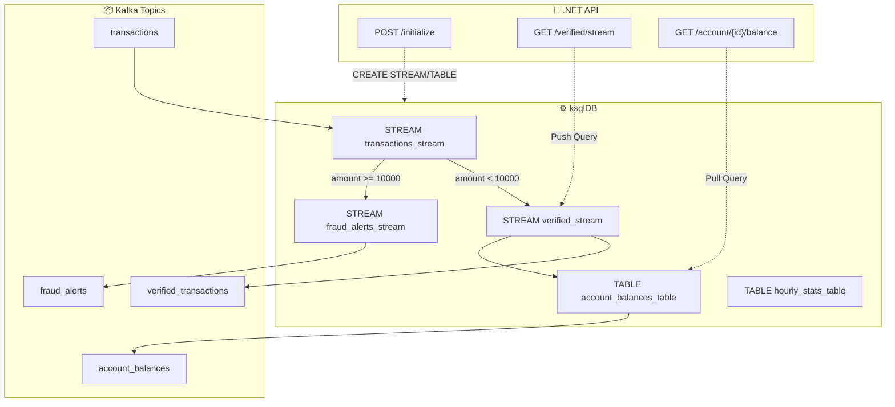

# LAB 3.1B (.NET) : Banking ksqlDB Lab - SQL Stream Processing

## ⏱️ Estimated Duration: 60-90 minutes

## 🏦 E-Banking Context

This lab implements a **ksqlDB-powered stream processing system** using .NET and the ksqlDB REST API. It demonstrates how SQL-like queries can process Kafka streams in real-time for:

- **Fraud detection** — Identify suspicious transactions via ksqlDB streams
- **Account balances** — Materialized views updated in real-time
- **Push/Pull queries** — Real-time streaming and point-in-time lookups
- **Transaction generation** — Produce test data to Kafka

> **Note**: This lab requires a running ksqlDB instance (deployed via `ksqldb-deployment.yaml`).

---

## 🏗️ Project Structure

```
BankingKsqlDBLab/
├── Controllers/
│   └── TransactionStreamController.cs   # All REST endpoints
├── Models/
│   └── Transaction.cs                   # Transaction + VerifiedTransaction + FraudAlert models
├── Producers/
│   └── TransactionProducer.cs           # Kafka producer for test data
├── Services/
│   └── KsqlDbService.cs                # ksqlDB REST API client
├── Program.cs                           # App setup
├── Dockerfile                           # Multi-stage Docker build
└── BankingKsqlDBLab.csproj             # .NET 8 project
```

---

## 🚀 Quick Start

### Prerequisites

- .NET 8 SDK
- Kafka cluster running
- ksqlDB server running (port 8088)

### Local Development

```bash
# Start ksqlDB (via Docker Compose from module root)
cd ../../
docker compose -f docker-compose.module.yml up -d

# Run the app
cd dotnet/BankingKsqlDBLab
dotnet run

# Swagger UI
open http://localhost:5000/swagger
```

### OpenShift Deployment

```bash
# Using scripts (deploys ksqlDB + app)
cd ../../scripts
./bash/deploy-and-test-3.1b-dotnet.sh --token "sha256~XXX" --server "https://api..."

# Or PowerShell
./powershell/deploy-and-test-3.1b-dotnet.ps1 -Token "sha256~XXX" -Server "https://api..."
```

---

## 📋 API Endpoints

| Method | Endpoint | Description |
| ------ | -------- | ----------- |
| GET | `/swagger` | Swagger UI |
| GET | `/api/TransactionStream/health` | Health check |
| POST | `/api/TransactionStream/initialize` | Initialize ksqlDB streams and tables |
| POST | `/api/TransactionStream/transactions` | Produce a single transaction |
| POST | `/api/TransactionStream/transactions/generate/{count}` | Generate N random transactions |
| GET | `/api/TransactionStream/verified/stream` | Push query — stream verified transactions |
| GET | `/api/TransactionStream/fraud/stream` | Push query — stream fraud alerts |
| GET | `/api/TransactionStream/account/{accountId}/balance` | Pull query — account balance |

---

## 🔧 Configuration

### Environment Variables

| Variable | Default | Description |
| -------- | ------- | ----------- |
| `Kafka__BootstrapServers` | `localhost:9092` | Kafka brokers |
| `KsqlDB__Url` | `http://localhost:8088` | ksqlDB REST endpoint |
| `ASPNETCORE_URLS` | `http://+:5000` | Listen URL |

---

## 📊 ksqlDB Topology



### ksqlDB Statements Created

```sql
-- Stream from transactions topic
CREATE STREAM transactions_stream (...)
  WITH (kafka_topic='transactions', value_format='JSON');

-- Verified transactions (amount < 10000)
CREATE STREAM verified_transactions AS
  SELECT * FROM transactions_stream WHERE amount < 10000;

-- Fraud alerts (amount >= 10000)
CREATE STREAM fraud_alerts AS
  SELECT * FROM transactions_stream WHERE amount >= 10000;

-- Account balances (materialized view)
CREATE TABLE account_balances AS
  SELECT accountId, SUM(amount) AS balance, COUNT(*) AS txCount
  FROM verified_transactions
  GROUP BY accountId;
```

---

## 🧪 Testing Flow

```bash
# 1. Initialize ksqlDB streams
curl -X POST https://<route>/api/TransactionStream/initialize

# 2. Generate test transactions
curl -X POST https://<route>/api/TransactionStream/transactions/generate/20

# 3. Wait 5 seconds for processing

# 4. Query account balance (pull query)
curl https://<route>/api/TransactionStream/account/ACC001/balance

# 5. Stream verified transactions (push query — keep open)
curl -N https://<route>/api/TransactionStream/verified/stream

# 6. Stream fraud alerts (push query — keep open)
curl -N https://<route>/api/TransactionStream/fraud/stream
```

---

## 🐛 Troubleshooting

| Issue | Cause | Solution |
| ----- | ----- | -------- |
| `Initialize` fails | ksqlDB not running | Deploy ksqlDB first |
| Empty balance query | No data processed yet | Generate transactions first |
| Push query hangs | No new data | Generate more transactions |
| Connection refused | Wrong ksqlDB URL | Check `KsqlDB__Url` env var |
| Build fails | Missing ksqlDb.RestApi.Client | Run `dotnet restore` |

---

## 📚 Concepts Covered

- **ksqlDB** — SQL-like stream processing on Kafka
- **Push queries** — Real-time streaming results (SSE)
- **Pull queries** — Point-in-time lookups on materialized views
- **Materialized views** — Auto-updated tables from streams
- **Stream/Table duality** — Streams vs Tables in ksqlDB
- **Confluent.Kafka** producer for .NET
