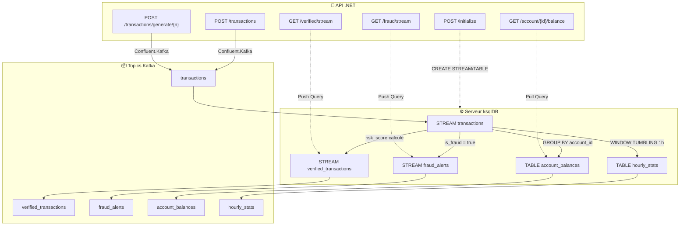

# LAB 3.1B (.NET) : Banking ksqlDB Lab - Traitement de Flux SQL

## ⏱️ Durée Estimée : 60-90 minutes

## 🏦 Contexte Bancaire E-Banking

Ce laboratoire implémente un **système de traitement de flux alimenté par ksqlDB** utilisant .NET et l'API REST ksqlDB. Il démontre comment des requêtes de type SQL peuvent traiter des flux Kafka en temps réel pour :

- ✅ **Détection de fraude** — Identifier les transactions suspectes via les streams ksqlDB
- ✅ **Soldes de comptes** — Vues matérialisées mises à jour en temps réel
- ✅ **Requêtes Push/Pull** — Streaming temps réel et consultations ponctuelles
- ✅ **Génération de transactions** — Produire des données de test vers Kafka

> **Note** : Ce lab nécessite une instance ksqlDB en cours d'exécution (déployée via `ksqldb-deployment.yaml`).

---

## 🏗️ Structure du Projet

```text
BankingKsqlDBLab/
├── Controllers/
│   └── TransactionStreamController.cs   # Tous les endpoints REST (7 endpoints)
├── Models/
│   └── Transaction.cs                   # Transaction + VerifiedTransaction + FraudAlert + AccountBalance
├── Producers/
│   └── TransactionProducer.cs           # Producteur Kafka pour données de test
├── Services/
│   └── KsqlDbService.cs                # Client API REST ksqlDB (push/pull queries)
├── Program.cs                           # Configuration de l'application
├── Dockerfile                           # Build Docker multi-étapes
├── appsettings.json                     # Configuration Kafka + ksqlDB
└── BankingKsqlDBLab.csproj             # Projet .NET 8
```

---

## 🚀 Guide Complet Étape par Étape

### 📋 Prérequis

- **.NET 8 SDK** - [Télécharger .NET 8](https://dotnet.microsoft.com/download/dotnet/8.0)
- **Cluster Kafka** - Docker Compose ou OpenShift Sandbox
- **Serveur ksqlDB** - Port 8088 (déployé via YAML ou Docker Compose)
- **IDE** - Visual Studio 2022 ou VS Code

---

## 🛠️ ÉTAPE 1 : Comprendre l'Architecture ksqlDB

### 1.1 Pipeline de Traitement



### 1.2 Objets ksqlDB Créés

```sql
-- 1. Stream principal depuis le topic transactions
CREATE STREAM transactions (
    transaction_id VARCHAR, account_id VARCHAR,
    amount DECIMAL(10,2), transaction_time BIGINT,
    type VARCHAR, merchant VARCHAR, country VARCHAR, is_online BOOLEAN
) WITH (kafka_topic='transactions', value_format='json', timestamp='transaction_time');

-- 2. Transactions vérifiées avec score de risque
CREATE STREAM verified_transactions AS
  SELECT *, CASE WHEN amount > 10000 THEN 0.8
                 WHEN merchant LIKE '%CASINO%' THEN 0.7
                 ELSE 0.0 END AS risk_score
  FROM transactions WHERE amount > 0 EMIT CHANGES;

-- 3. Alertes de fraude
CREATE STREAM fraud_alerts AS
  SELECT * FROM verified_transactions WHERE is_fraud = true EMIT CHANGES;

-- 4. Soldes de comptes (vue matérialisée)
CREATE TABLE account_balances AS
  SELECT account_id, SUM(CASE WHEN type='CREDIT' THEN amount ELSE -amount END) AS balance,
         COUNT(*) AS transaction_count
  FROM transactions GROUP BY account_id EMIT CHANGES;

-- 5. Statistiques horaires (agrégation fenêtrée)
CREATE TABLE hourly_stats AS
  SELECT account_id, SUM(...) AS total_debits, COUNT(*) AS transaction_count
  FROM transactions WINDOW TUMBLING (SIZE 1 HOUR)
  GROUP BY account_id EMIT CHANGES;
```

### 1.3 Composants Clés du Code

- **`KsqlDbService.cs`** — Client ksqlDB : initialisation des streams, push queries (streaming), pull queries (consultation ponctuelle)
- **`TransactionProducer.cs`** — Producteur Kafka : génération de transactions aléatoires avec marchands suspects (CASINO, GAMBLING)
- **`TransactionStreamController.cs`** — 7 endpoints REST pour orchestrer le tout

---

## 🔨 ÉTAPE 2 : Construction de l'Application

### 2.1 Build Local

```bash
# Restaurer les dépendances
dotnet restore

# Construire le projet
dotnet build

# Construire pour la production
dotnet build -c Release
```

### 2.2 Dépendances NuGet

| Package | Version | Rôle |
|---------|---------|------|
| `ksqlDb.RestApi.Client` | 6.0.0 | Client ksqlDB pour .NET |
| `Confluent.Kafka` | 2.8.0 | Producteur Kafka |
| `System.Reactive` | 6.0.1 | Extensions réactives pour push queries |
| `Swashbuckle.AspNetCore` | 6.6.2 | Swagger UI |

### 2.3 Build Docker (Optionnel)

```bash
docker build -t banking-ksqldb-lab .
docker run -p 5000:8080 banking-ksqldb-lab
```

---

## 🏃‍♂️ ÉTAPE 3 : Démarrer l'Infrastructure

### 3.1 Démarrer Kafka + ksqlDB (Docker)

```bash
# Depuis la racine du module
cd module-05-kafka-streams-ksqldb
docker compose -f docker-compose.module.yml up -d

# Vérifier que ksqlDB est prêt
curl http://localhost:8088/info
# Réponse attendue : {"KsqlServerInfo":{"version":"0.29.0",...}}
```

### 3.2 Démarrer l'Application

```bash
cd dotnet/BankingKsqlDBLab
dotnet run

# Sortie attendue :
# info: Now listening on: http://localhost:5000
# info: Application started.
```

### 3.3 Accéder à Swagger UI

Ouvrez votre navigateur : **http://localhost:5000/swagger**

---

## 🧪 ÉTAPE 4 : Tester les APIs — Flux Complet de Démonstration

### 4.1 Vérification de Santé

```bash
curl http://localhost:5000/api/TransactionStream/health

# Réponse attendue :
# {"status":"Healthy","timestamp":"2026-02-12T10:00:00Z"}
```

### 4.2 Initialiser les Streams ksqlDB

```bash
curl -X POST http://localhost:5000/api/TransactionStream/initialize

# Réponse attendue :
# {"message":"Streams initialized successfully","timestamp":"2026-02-12T10:00:00Z"}
```

> ⚠️ **Important** : Cette étape crée les 5 objets ksqlDB (2 streams dérivés, 2 tables, 1 stream principal). Attendez ~10 secondes après l'initialisation.

### 4.3 Produire une Transaction Unique

```bash
curl -X POST http://localhost:5000/api/TransactionStream/transactions \
  -H "Content-Type: application/json" \
  -d '{
    "account_id": "ACC001",
    "amount": 250.00,
    "type": "DEBIT",
    "merchant": "AMAZON",
    "country": "FR",
    "is_online": true
  }'

# Réponse attendue :
# {"status":"ACCEPTED","transactionId":"TXN-a1b2c3d4","partition":2,"offset":15}
```

### 4.4 Générer des Transactions de Test

```bash
# Générer 20 transactions aléatoires (dont ~20% suspectes)
curl -X POST http://localhost:5000/api/TransactionStream/transactions/generate/20

# Réponse attendue :
# {"message":"Generating 20 transactions in background","timestamp":"..."}
```

> Les transactions sont générées avec :
> - **5 comptes** : ACC001 à ACC005
> - **Types** : DEBIT (60%) / CREDIT (40%)
> - **Marchands suspects** : CASINO_VEGAS, GAMBLING_ONLINE (~10%)
> - **Montants élevés** : > 5000€ (~20%)

### 4.5 Interroger le Solde d'un Compte (Pull Query)

```bash
# Attendre 5 secondes pour le traitement ksqlDB
sleep 5

curl http://localhost:5000/api/TransactionStream/account/ACC001/balance

# Réponse attendue :
# {"account_id":"ACC001","balance":1234.56,"transaction_count":8}
```

### 4.6 Streamer les Transactions Vérifiées (Push Query)

```bash
# Ouvrir dans un terminal séparé — reste ouvert en streaming
curl -N http://localhost:5000/api/TransactionStream/verified/stream

# Réponse en streaming (une ligne par transaction) :
# {"transaction_id":"TXN-xxx","account_id":"ACC002","amount":150.00,"is_fraud":false,"risk_score":0.0}
# {"transaction_id":"TXN-yyy","account_id":"ACC001","amount":12000.00,"is_fraud":true,"risk_score":0.8}
# ...
```

> 💡 **Astuce** : Ouvrez ce terminal, puis dans un autre terminal, générez des transactions pour voir le streaming en direct.

### 4.7 Streamer les Alertes de Fraude (Push Query)

```bash
# Ouvrir dans un terminal séparé — reste ouvert en streaming
curl -N http://localhost:5000/api/TransactionStream/fraud/stream

# Réponse en streaming (uniquement les fraudes) :
# {"transaction_id":"TXN-abc","account_id":"ACC003","reason":"Large transaction detected","risk_score":0.8}
# {"transaction_id":"TXN-def","account_id":"ACC001","reason":"Casino transaction flagged","risk_score":0.7}
```

---

## 🎬 ÉTAPE 5 : Démonstration Complète en Direct

### Scénario de Démonstration (3 terminaux)

**Terminal 1 — Streamer les alertes de fraude :**

```bash
curl -N http://localhost:5000/api/TransactionStream/fraud/stream
```

**Terminal 2 — Streamer les transactions vérifiées :**

```bash
curl -N http://localhost:5000/api/TransactionStream/verified/stream
```

**Terminal 3 — Générer des transactions et interroger :**

```bash
# Générer 50 transactions
curl -X POST http://localhost:5000/api/TransactionStream/transactions/generate/50

# Attendre 10 secondes
sleep 10

# Vérifier les soldes
curl http://localhost:5000/api/TransactionStream/account/ACC001/balance
curl http://localhost:5000/api/TransactionStream/account/ACC002/balance
curl http://localhost:5000/api/TransactionStream/account/ACC003/balance

# Produire une transaction suspecte manuellement
curl -X POST http://localhost:5000/api/TransactionStream/transactions \
  -H "Content-Type: application/json" \
  -d '{"account_id":"ACC001","amount":15000.00,"type":"DEBIT","merchant":"CASINO_VEGAS","country":"US","is_online":false}'

# → Vérifier Terminal 1 : alerte de fraude apparaît immédiatement !
```

---

## 🔍 ÉTAPE 6 : Vérifier dans Kafka

### 6.1 Utiliser Kafka UI

**Accès** : <http://localhost:8080>

1. **Topics** → **transactions** — Toutes les transactions produites
2. **Topics** → **verified_transactions** — Transactions avec score de risque
3. **Topics** → **fraud_alerts** — Uniquement les fraudes détectées
4. **Topics** → **account_balances** — Soldes mis à jour en continu

### 6.2 Utiliser Kafka CLI

```bash
# Vérifier les transactions
docker exec kafka /opt/kafka/bin/kafka-console-consumer.sh \
  --bootstrap-server localhost:9092 \
  --topic transactions \
  --from-beginning --max-messages 5

# Vérifier les alertes de fraude
docker exec kafka /opt/kafka/bin/kafka-console-consumer.sh \
  --bootstrap-server localhost:9092 \
  --topic fraud_alerts \
  --from-beginning --max-messages 5
```

---

## 🚀 ÉTAPE 7 : Déploiement OpenShift (Optionnel)

### 7.1 Déployer ksqlDB d'abord

```bash
# Appliquer le YAML de déploiement ksqlDB
oc apply -f ../../ksqldb-deployment.yaml

# Attendre que ksqlDB soit prêt
oc rollout status deployment/ksqldb
```

### 7.2 Utiliser les Scripts de Déploiement

```bash
# Bash
cd ../../scripts
./bash/deploy-and-test-3.1b-dotnet.sh --token "sha256~XXX" --server "https://api..."

# PowerShell
./powershell/deploy-and-test-3.1b-dotnet.ps1 -Token "sha256~XXX" -Server "https://api..."
```

> **Le script gère automatiquement :**
> - ✅ Déployer le serveur ksqlDB
> - ✅ Créer les topics Kafka
> - ✅ Build avec S2I (dotnet:8.0-ubi8)
> - ✅ Déployer vers OpenShift
> - ✅ Configurer les variables d'environnement
> - ✅ Créer la route sécurisée edge
> - ✅ Attendre la disponibilité du pod
> - ✅ Initialiser les streams ksqlDB
> - ✅ Exécuter les tests de validation API

### 7.3 Déploiement Manuel

```bash
# Build et push
oc new-build --name banking-ksqldb-lab --binary --strategy=source \
  --image-stream=dotnet:8.0-ubi8

oc start-build banking-ksqldb-lab --from-dir=. --follow

# Déployer
oc new-app banking-ksqldb-lab

# Configurer
oc set env deployment/banking-ksqldb-lab \
  Kafka__BootstrapServers=kafka-svc:9092 \
  KsqlDB__Url=http://ksqldb:8088

# Route
oc create route edge banking-ksqldb-lab-secure \
  --service=banking-ksqldb-lab --port=8080-tcp
```

### 7.4 Tester le Déploiement OpenShift

```bash
ROUTE=$(oc get route banking-ksqldb-lab-secure -o jsonpath='{.spec.host}')

# Santé
curl -k https://$ROUTE/api/TransactionStream/health

# Initialiser
curl -k -X POST https://$ROUTE/api/TransactionStream/initialize

# Générer
curl -k -X POST https://$ROUTE/api/TransactionStream/transactions/generate/20

# Solde
curl -k https://$ROUTE/api/TransactionStream/account/ACC001/balance
```

---

## 📋 Endpoints API

| Méthode | Endpoint | Description |
| ------- | -------- | ----------- |
| GET | `/swagger` | Interface Swagger UI |
| GET | `/api/TransactionStream/health` | Vérification de santé |
| POST | `/api/TransactionStream/initialize` | Initialiser les streams et tables ksqlDB |
| POST | `/api/TransactionStream/transactions` | Produire une transaction unique |
| POST | `/api/TransactionStream/transactions/generate/{count}` | Générer N transactions aléatoires |
| GET | `/api/TransactionStream/verified/stream` | Push query — streamer les transactions vérifiées |
| GET | `/api/TransactionStream/fraud/stream` | Push query — streamer les alertes de fraude |
| GET | `/api/TransactionStream/account/{accountId}/balance` | Pull query — solde du compte |

---

## 🔧 Configuration

### appsettings.json

```json
{
  "KsqlDB": { "Url": "http://localhost:8088" },
  "Kafka": { "BootstrapServers": "localhost:9092", "Topic": "transactions" }
}
```

### Variables d'Environnement (OpenShift)

| Variable | Défaut | Description |
| -------- | ------ | ----------- |
| `Kafka__BootstrapServers` | `localhost:9092` | Brokers Kafka |
| `KsqlDB__Url` | `http://localhost:8088` | Endpoint REST ksqlDB |
| `ASPNETCORE_URLS` | `http://+:8080` | URL d'écoute |

---

## 🚢 Déploiement — 4 Environnements

| Environnement | Outil | Kafka | ksqlDB | Accès API |
| -------------- | ----- | ----- | ------ | --------- |
| **🐳 Docker** | `dotnet run` | `localhost:9092` | `http://localhost:8088` | `http://localhost:5000/` |
| **☁️ OpenShift** | Scripts | `kafka-svc:9092` | `http://ksqldb:8088` | `https://{route}/` |
| **☸️ K8s** | `kubectl apply` | `kafka-svc:9092` | `http://ksqldb:8088` | Port-forward |
| **🖥️ IDE** | VS Code | `localhost:9092` | `http://localhost:8088` | `http://localhost:5000/` |

---

## 🐛 Dépannage

| Problème | Cause | Solution |
| -------- | ----- | -------- |
| `Initialize` échoue | ksqlDB non démarré | Déployer ksqlDB d'abord |
| Solde vide | Pas de données traitées | Générer des transactions d'abord |
| Push query bloque | Pas de nouvelles données | Générer plus de transactions |
| Connexion refusée | Mauvaise URL ksqlDB | Vérifier `KsqlDB__Url` |
| Build échoue | Package manquant | Exécuter `dotnet restore` |
| Timeout ksqlDB | Streams pas encore prêts | Attendre 30s après initialize |

---

## ✅ Liste de Vérification

- [ ] ksqlDB serveur démarré et accessible (port 8088)
- [ ] Application .NET démarre sans erreurs
- [ ] Swagger UI accessible
- [ ] `POST /initialize` crée les 5 objets ksqlDB
- [ ] `POST /transactions` produit vers Kafka
- [ ] `POST /transactions/generate/20` génère des données de test
- [ ] `GET /account/ACC001/balance` retourne un solde
- [ ] `GET /verified/stream` streame en temps réel
- [ ] `GET /fraud/stream` détecte les fraudes
- [ ] Topics Kafka contiennent les données attendues

---

## 📚 Concepts Couverts

- **ksqlDB** — Traitement de flux de type SQL sur Kafka
- **Push queries** — Résultats en streaming temps réel (SSE)
- **Pull queries** — Consultations ponctuelles sur vues matérialisées
- **Vues matérialisées** — Tables auto-mises à jour depuis les streams
- **Dualité Stream/Table** — Streams vs Tables dans ksqlDB
- **Détection de fraude** — Règles métier via SQL (montant, marchand, pays)
- **Agrégation fenêtrée** — Statistiques horaires avec WINDOW TUMBLING
- **Confluent.Kafka** — Producteur .NET pour Kafka

---

## 🏆 Résumé

Ce guide complet vous a accompagné à travers :

1. **🛠️ Architecture** — Comprendre le pipeline ksqlDB
2. **🔨 Construction** — Build et dépendances NuGet
3. **🏃‍♂️ Infrastructure** — Démarrer Kafka + ksqlDB
4. **🧪 Tests API** — 7 endpoints testés avec réponses attendues
5. **🎬 Démonstration** — Scénario live avec 3 terminaux
6. **🔍 Vérification** — Kafka UI et CLI
7. **🚀 Déploiement** — OpenShift production

### 🎯 Points Clés à Retenir

- **ksqlDB** transforme Kafka en base de données streaming avec SQL
- **Push queries** = streaming continu, **Pull queries** = consultation ponctuelle
- **Vues matérialisées** maintiennent l'état en temps réel
- **Détection de fraude** via règles SQL déclaratives
- **Architecture événementielle** complète avec .NET + Kafka + ksqlDB

**🚀 Prêt pour la démonstration en direct !**
