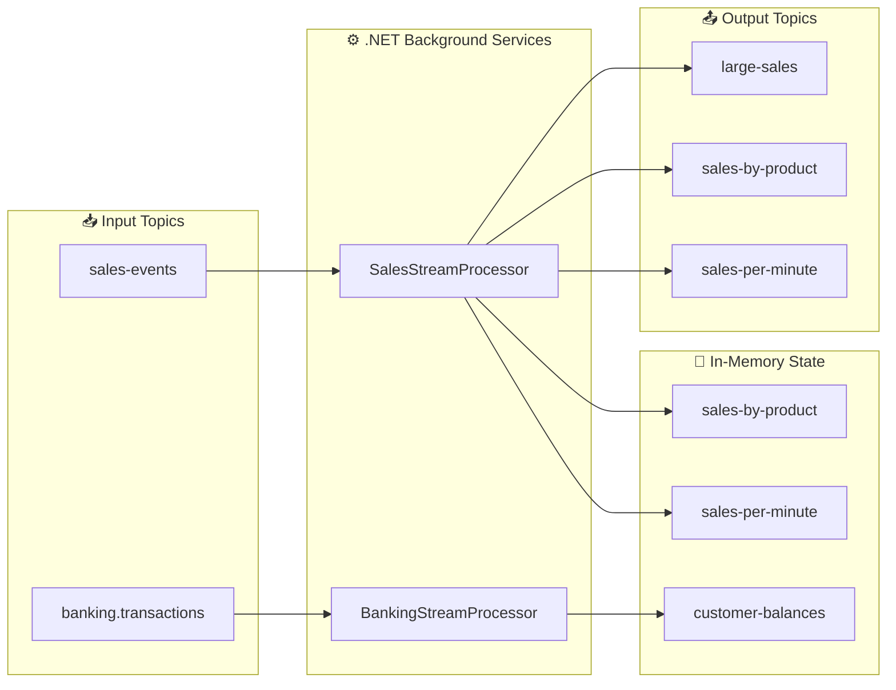

# LAB 3.1A (.NET) : E-Banking Streams API - Stream Processing

## ⏱️ Estimated Duration: 60-90 minutes

## 🏦 E-Banking Context

This lab implements a **stream processing API** using .NET and Confluent.Kafka that mirrors the Java Kafka Streams lab. It provides:

- **Sales stream processing** — Filter, aggregate, and window sales events
- **Banking transactions** — Process and track customer balances
- **State stores** — In-memory queryable state for aggregations
- **REST API** — Expose stream results via Swagger UI

---

## 🏗️ Project Structure

```
M05StreamsApi/
├── Controllers/
│   ├── BankingController.cs        # POST /api/v1/transactions, GET /api/v1/balances
│   ├── SalesController.cs          # POST /api/v1/sales, GET /api/v1/stats/*
│   └── StoresController.cs         # GET /api/v1/stores/{name}/all|{key}
├── Models/
│   ├── Sale.cs                     # Sale event model
│   ├── SaleAggregate.cs            # Aggregation model
│   ├── Transaction.cs              # Banking transaction model
│   ├── CustomerBalance.cs          # Balance model
│   └── Product.cs                  # Product reference model
├── Services/
│   ├── BankingStreamProcessorService.cs   # Banking consumer background service
│   ├── SalesStreamProcessorService.cs     # Sales consumer + stream processing
│   ├── BankingOptions.cs                  # Banking Kafka config
│   ├── BankingState.cs                    # Banking in-memory state
│   ├── StreamsOptions.cs                  # Streams Kafka config
│   └── StreamsState.cs                    # Sales in-memory state stores
├── Program.cs                      # App setup, DI, root endpoint
├── appsettings.json                # Configuration
├── Dockerfile                      # Multi-stage Docker build
└── M05StreamsApi.csproj            # .NET 8 project
```

---

## 🚀 Quick Start

### Prerequisites

- .NET 8 SDK
- Kafka cluster running (Docker or OpenShift)

---

## 🚢 Deployment — 4 Environments

| Environment | Tool | Kafka Bootstrap | API Access |
| ----------- | ---- | --------------- | ---------- |
| **🐳 Docker / Local** | `dotnet run` | `localhost:9092` | `http://localhost:5000/` |
| **☁️ OpenShift Sandbox** | Scripts automated | `kafka-svc:9092` | `https://{route}/` |
| **☸️ K8s / OKD** | `docker build` + `kubectl apply` | `kafka-svc:9092` | `http://localhost:8080/` (port-forward) |
| **🖥️ Local (IDE)** | VS Code | `localhost:9092` | `http://localhost:5000/` |

### Local Development

```bash
# Run locally
dotnet run

# Swagger UI
open http://localhost:5000/swagger
```

### OpenShift Deployment

```bash
# Deploy using scripts (recommended)
cd ../../scripts
./bash/deploy-and-test-3.1a-dotnet.sh --token "sha256~XXX" --server "https://api..."

# Or PowerShell
./powershell/deploy-and-test-3.1a-dotnet.ps1 -Token "sha256~XXX" -Server "https://api..."
```

> **The script handles automatically:**
> - ✅ Build with S2I (dotnet:8.0-ubi8)
> - ✅ Deploy to OpenShift
> - ✅ Configure environment variables
> - ✅ Create secure edge route
> - ✅ Wait for pod readiness
> - ✅ Run API validation tests

---

## 🧪 API Tests — Validation Scenarios

### Health Check

```bash
# Local
curl http://localhost:5000/api/v1/health

# OpenShift Sandbox
curl -k https://ebanking-streams-dotnet-secure.apps.sandbox.x8i5.p1.openshiftapps.com/api/v1/health
```

### Produce Sale Event

```bash
# Local
curl -X POST http://localhost:5000/api/v1/sales \
  -H "Content-Type: application/json" \
  -d '{"productId":"PROD-001","quantity":2,"unitPrice":125.00}'

# OpenShift Sandbox
curl -k -X POST https://ebanking-streams-dotnet-secure.apps.sandbox.x8i5.p1.openshiftapps.com/api/v1/sales \
  -H "Content-Type: application/json" \
  -d '{"productId":"PROD-001","quantity":2,"unitPrice":125.00}'
```

### Produce Banking Transaction

```bash
# Local
curl -X POST http://localhost:5000/api/v1/transactions \
  -H "Content-Type: application/json" \
  -d '{"customerId":"CUST-001","amount":1500.00,"type":"TRANSFER"}'

# OpenShift Sandbox
curl -k -X POST https://ebanking-streams-dotnet-secure.apps.sandbox.x8i5.p1.openshiftapps.com/api/v1/transactions \
  -H "Content-Type: application/json" \
  -d '{"customerId":"CUST-001","amount":1500.00,"type":"TRANSFER"}'
```

### Query Aggregated Stats

```bash
# Local
curl http://localhost:5000/api/v1/stats/by-product

# OpenShift Sandbox
curl -k https://ebanking-streams-dotnet-secure.apps.sandbox.x8i5.p1.openshiftapps.com/api/v1/stats/by-product
```

### Query Customer Balances

```bash
# Local
curl http://localhost:5000/api/v1/balances

# OpenShift Sandbox
curl -k https://ebanking-streams-dotnet-secure.apps.sandbox.x8i5.p1.openshiftapps.com/api/v1/balances
```

### Query State Store

```bash
# Local - All entries
curl http://localhost:5000/api/v1/stores/sales-by-product/all

# Local - By key
curl http://localhost:5000/api/v1/stores/sales-by-product/PROD-001
```

---

## 📊 Verification in Kafka

### Using Kafka UI

**Docker**: <http://localhost:8080>

1. Go to **Topics** → **sales-events**
2. Click **Messages**
3. Verify sale events with proper JSON format

### Using Kafka CLI

```bash
# Docker
docker exec kafka /opt/kafka/bin/kafka-console-consumer.sh \
  --bootstrap-server localhost:9092 \
  --topic sales-events \
  --from-beginning \
  --max-messages 5

# OpenShift Sandbox
oc exec kafka-0 -- /opt/kafka/bin/kafka-console-consumer.sh \
  --bootstrap-server kafka-0.kafka-svc:9092 \
  --topic sales-events \
  --from-beginning \
  --max-messages 5
```

---

## 📋 API Endpoints

| Method | Endpoint | Description |
| ------ | -------- | ----------- |
| GET | `/` | Application info with all endpoints |
| GET | `/swagger` | Swagger UI |
| POST | `/api/v1/sales` | Produce a sale event |
| GET | `/api/v1/stats/by-product` | Aggregated stats by product |
| GET | `/api/v1/stats/per-minute` | Windowed stats per minute |
| GET | `/api/v1/health` | Health check |
| POST | `/api/v1/transactions` | Produce a banking transaction |
| GET | `/api/v1/balances` | All customer balances |
| GET | `/api/v1/balances/{customerId}` | Balance for a specific customer |
| GET | `/api/v1/stores/{storeName}/all` | Query a state store |
| GET | `/api/v1/stores/{storeName}/{key}` | Query state store by key |

---

## 🔧 Configuration

### appsettings.json

```json
{
  "Kafka": {
    "BootstrapServers": "localhost:9092",
    "ClientId": "m05-streams-api-dotnet",
    "GroupId": "m05-streams-api-dotnet",
    "InputTopic": "sales-events",
    "TransactionsTopic": "banking.transactions"
  }
}
```

### Environment Variables (OpenShift)

| Variable | Default | Description |
| -------- | ------- | ----------- |
| `Kafka__BootstrapServers` | `localhost:9092` | Kafka brokers |
| `Kafka__ClientId` | `m05-streams-api-dotnet` | Client ID |
| `Kafka__GroupId` | `m05-streams-api-dotnet` | Consumer group |
| `Kafka__InputTopic` | `sales-events` | Sales input topic |
| `Kafka__TransactionsTopic` | `banking.transactions` | Transactions topic |
| `ASPNETCORE_URLS` | `http://+:5000` | Listen URL |

---

## 📊 Stream Processing Pipeline



### Sale Processing Logic

1. **Filter**: Sales > 100€ → `large-sales` topic
2. **Aggregate**: Group by productId → `sales-by-product` state store + topic
3. **Window**: Per-minute aggregation → `sales-per-minute` topic
4. **Enrich**: Join with product reference data → `enriched-sales` topic

---

## 🐛 Troubleshooting

| Issue | Cause | Solution |
| ----- | ----- | -------- |
| Empty stats | No sales consumed yet | POST a sale first, wait 2-3 seconds |
| Connection refused | Kafka not running | Check `Kafka__BootstrapServers` |
| Build fails on OpenShift | Missing .NET 8 image | Use `dotnet:8.0-ubi8` builder |
| Swagger not loading | Wrong port | Check `ASPNETCORE_URLS` |

---

## 📚 Concepts Covered

- **Confluent.Kafka** producer and consumer in .NET
- **BackgroundService** for continuous stream processing
- **In-memory state stores** with ConcurrentDictionary
- **Windowed aggregation** with time-based bucketing
- **REST API** exposing stream processing results
- **S2I binary build** for OpenShift deployment
