# LAB 3.1A (.NET) : E-Banking Streams API - Stream Processing

## ⏱️ Estimated Duration: 60-90 minutes

## 🏦 E-Banking Context

This lab implements a **stream processing API** using .NET and Confluent.Kafka that mirrors the Java Kafka Streams lab. It provides:

- **Sales stream processing** — Filter, aggregate, and window sales events
- **Banking transactions** — Process and track customer balances
- **State stores** — In-memory queryable state for aggregations
- **REST API** — Expose stream results via Swagger UI

---

## 🏗️ Project Structure

```
M05StreamsApi/
├── Controllers/
│   ├── BankingController.cs        # POST /api/v1/transactions, GET /api/v1/balances
│   ├── SalesController.cs          # POST /api/v1/sales, GET /api/v1/stats/*
│   └── StoresController.cs         # GET /api/v1/stores/{name}/all|{key}
├── Models/
│   ├── Sale.cs                     # Sale event model
│   ├── SaleAggregate.cs            # Aggregation model
│   ├── Transaction.cs              # Banking transaction model
│   ├── CustomerBalance.cs          # Balance model
│   └── Product.cs                  # Product reference model
├── Services/
│   ├── BankingStreamProcessorService.cs   # Banking consumer background service
│   ├── SalesStreamProcessorService.cs     # Sales consumer + stream processing
│   ├── BankingOptions.cs                  # Banking Kafka config
│   ├── BankingState.cs                    # Banking in-memory state
│   ├── StreamsOptions.cs                  # Streams Kafka config
│   └── StreamsState.cs                    # Sales in-memory state stores
├── Program.cs                      # App setup, DI, root endpoint
├── appsettings.json                # Configuration
├── Dockerfile                      # Multi-stage Docker build
└── M05StreamsApi.csproj            # .NET 8 project
```

---

## 🚀 Step-by-Step Complete Guide

### 📋 Prerequisites

- **.NET 8 SDK** - [Download .NET 8](https://dotnet.microsoft.com/download/dotnet/8.0)
- **Kafka cluster** - Docker Compose or OpenShift Sandbox
- **IDE** - Visual Studio 2022 or VS Code
- **Git** - For cloning the repository

---

## 🛠️ STEP 1: Project Setup & Coding

### 1.1 Clone and Navigate to Project

```bash
# Clone the repository (if not already done)
git clone <repository-url>
cd formation-kafka-dotnet/day-03-integration/module-05-kafka-streams-ksqldb/dotnet/M05StreamsApi
```

### 1.2 Understand the Project Structure

```bash
M05StreamsApi/
├── Controllers/
│   ├── BankingController.cs        # Banking transactions API
│   ├── SalesController.cs          # Sales events API
│   └── StoresController.cs         # State store query API
├── Services/
│   ├── BankingStreamProcessorService.cs   # Banking stream processor
│   ├── SalesStreamProcessorService.cs     # Sales stream processor
│   ├── BankingState.cs                    # Banking in-memory state
│   └── StreamsState.cs                    # Sales in-memory state
├── Models/                       # Data models
├── Program.cs                    # Application entry point
├── appsettings.json              # Configuration
└── M05StreamsApi.csproj          # Project file
```

### 1.3 Key Code Components

#### Sales Stream Processor (`Services/SalesStreamProcessorService.cs`)
```csharp
// Key functionality:
// - Consumes from 'sales-events' topic
// - Filters large sales (> 100€) to 'large-sales' topic
// - Aggregates by product ID in 'sales-by-product' store
// - Windowed aggregation per minute to 'sales-per-minute' topic
// - Maintains in-memory state stores
```

#### Banking Stream Processor (`Services/BankingStreamProcessorService.cs`)
```csharp
// Key functionality:
// - Consumes from 'banking.transactions' topic
// - Updates customer balances in-memory
// - Handles different transaction types (DEPOSIT, WITHDRAWAL, TRANSFER)
```

#### API Controllers
```csharp
// SalesController.cs:
// - POST /api/v1/sales - Produce new sale event
// - GET /api/v1/stats/by-product - Get aggregated sales by product
// - GET /api/v1/stats/per-minute - Get per-minute windowed stats

// BankingController.cs:
// - POST /api/v1/transactions - Produce banking transaction
// - GET /api/v1/balances - Get all customer balances
// - GET /api/v1/balances/{id} - Get specific customer balance
```

---

## 🔨 STEP 2: Building the Application

### 2.1 Local Development Build

```bash
# Restore dependencies
dotnet restore

# Build the project
dotnet build

# Build for release
dotnet build -c Release
```

### 2.2 Verify Build Success

```bash
# Run tests (if any)
dotnet test

# Check build output
ls bin/Release/net8.0/
```

### 2.3 Docker Build (Optional)

```bash
# Build Docker image
docker build -t m05-streams-api .

# Run container locally
docker run -p 5000:8080 m05-streams-api
```

---

## 🏃‍♂️ STEP 3: Running the Application

### 3.1 Local Development Run

```bash
# Method 1: Simple run
dotnet run

# Method 2: With specific environment
ASPNETCORE_ENVIRONMENT=Development dotnet run

# Method 3: With custom port
ASPNETCORE_URLS=http://localhost:5000 dotnet run
```

### 3.2 Verify Application Startup

**Expected Output:**
```
info: Microsoft.Hosting.Lifetime[14]
      Now listening on: http://localhost:5000
info: Microsoft.Hosting.Lifetime[14]
      Application started. Press Ctrl+C to shut down.
info: Microsoft.Hosting.Lifetime[14]
      Hosting environment: Development
```

### 3.3 Access Swagger UI

Open your browser and navigate to:
- **Swagger UI**: http://localhost:5000/swagger
- **ReDoc**: http://localhost:5000/swagger/v1/swagger.json

---

## 🧪 STEP 4: Testing the Streaming APIs

### 4.1 Health Check

```bash
# Test health endpoint
curl http://localhost:5000/api/v1/health

# Expected response:
# {"status":"Healthy","timestamp":"2024-01-01T12:00:00Z"}
```

### 4.2 Sales Streaming Tests

#### 4.2.1 Produce Sale Events

```bash
# Test sale 1 - Small amount
curl -X POST http://localhost:5000/api/v1/sales \
  -H "Content-Type: application/json" \
  -d '{"productId":"PROD-001","quantity":2,"unitPrice":25.00}'

# Expected response:
# {"status":"ACCEPTED","productId":"PROD-001","totalAmount":50.0}

# Test sale 2 - Large amount (> 100€)
curl -X POST http://localhost:5000/api/v1/sales \
  -H "Content-Type: application/json" \
  -d '{"productId":"PROD-002","quantity":5,"unitPrice":150.00}'

# Expected response:
# {"status":"ACCEPTED","productId":"PROD-002","totalAmount":750.0}

# Test sale 3 - Different product
curl -X POST http://localhost:5000/api/v1/sales \
  -H "Content-Type: application/json" \
  -d '{"productId":"PROD-003","quantity":1,"unitPrice":99.99}'
```

#### 4.2.2 Query Aggregated Statistics

```bash
# Wait 2-3 seconds for stream processing
sleep 3

# Get stats by product
curl http://localhost:5000/api/v1/stats/by-product

# Expected response:
# {
#   "PROD-001": {"totalAmount":50.0,"count":1,"totalQuantity":2},
#   "PROD-002": {"totalAmount":750.0,"count":1,"totalQuantity":5},
#   "PROD-003": {"totalAmount":99.99,"count":1,"totalQuantity":1}
# }

# Get per-minute stats
curl http://localhost:5000/api/v1/stats/per-minute

# Expected response:
# {
#   "streamsState":"RUNNING",
#   "message":"Check sales-per-minute topic in Kafka UI"
# }
```

### 4.3 Banking Streaming Tests

#### 4.3.1 Produce Banking Transactions

```bash
# Deposit transaction
curl -X POST http://localhost:5000/api/v1/transactions \
  -H "Content-Type: application/json" \
  -d '{"customerId":"CUST-001","amount":1000.00,"type":"DEPOSIT"}'

# Expected response:
# {"status":"ACCEPTED","customerId":"CUST-001","type":"DEPOSIT","amount":1000.0}

# Withdrawal transaction
curl -X POST http://localhost:5000/api/v1/transactions \
  -H "Content-Type: application/json" \
  -d '{"customerId":"CUST-001","amount":200.00,"type":"WITHDRAWAL"}'

# Transfer transaction
curl -X POST http://localhost:5000/api/v1/transactions \
  -H "Content-Type: application/json" \
  -d '{"customerId":"CUST-002","amount":500.00,"type":"TRANSFER"}'

# Another customer transaction
curl -X POST http://localhost:5000/api/v1/transactions \
  -H "Content-Type: application/json" \
  -d '{"customerId":"CUST-003","amount":750.00","type":"DEPOSIT"}'
```

#### 4.3.2 Query Customer Balances

```bash
# Wait 2-3 seconds for processing
sleep 3

# Get all customer balances
curl http://localhost:5000/api/v1/balances

# Expected response:
# {
#   "CUST-001": {"balance":800.0,"lastUpdated":"2024-01-01T12:00:00Z"},
#   "CUST-002": {"balance":500.0,"lastUpdated":"2024-01-01T12:00:00Z"},
#   "CUST-003": {"balance":750.0,"lastUpdated":"2024-01-01T12:00:00Z"}
# }

# Get specific customer balance
curl http://localhost:5000/api/v1/balances/CUST-001

# Expected response:
# {"balance":800.0,"lastUpdated":"2024-01-01T12:00:00Z"}
```

### 4.4 State Store Query Tests

```bash
# Query all entries in sales-by-product store
curl http://localhost:5000/api/v1/stores/sales-by-product/all

# Query specific product in store
curl http://localhost:5000/api/v1/stores/sales-by-product/PROD-001

# Query all customer balances store
curl http://localhost:5000/api/v1/stores/customer-balances/all

# Query specific customer balance store
curl http://localhost:5000/api/v1/stores/customer-balances/CUST-001
```

---

## 🔍 STEP 5: Verify Stream Processing in Kafka

### 5.1 Using Kafka UI (Recommended)

**Access**: http://localhost:8080 (if running Docker Kafka)

#### Check Input Topics
1. Navigate to **Topics**
2. Click on **sales-events**
3. Click **Messages** tab
4. Verify sale events are being produced

#### Check Output Topics
1. **large-sales** - Should contain sales > 100€
2. **sales-by-product** - Aggregated sales data
3. **sales-per-minute** - Windowed aggregations
4. **banking.transactions** - Banking transaction events

### 5.2 Using Kafka CLI

```bash
# Check sales-events topic
docker exec kafka /opt/kafka/bin/kafka-console-consumer.sh \
  --bootstrap-server localhost:9092 \
  --topic sales-events \
  --from-beginning \
  --max-messages 5

# Check large-sales topic (filtered sales)
docker exec kafka /opt/kafka/bin/kafka-console-consumer.sh \
  --bootstrap-server localhost:9092 \
  --topic large-sales \
  --from-beginning \
  --max-messages 5

# Check banking transactions
docker exec kafka /opt/kafka/bin/kafka-console-consumer.sh \
  --bootstrap-server localhost:9092 \
  --topic banking.transactions \
  --from-beginning \
  --max-messages 5
```

---

## 📊 STEP 6: Advanced Testing Scenarios

### 6.1 Load Testing

```bash
# Produce multiple sales rapidly
for i in {1..10}; do
  curl -X POST http://localhost:5000/api/v1/sales \
    -H "Content-Type: application/json" \
    -d "{\"productId\":\"PROD-00$i\",\"quantity\":$((i*2)),\"unitPrice\":$((i*10))}"
  sleep 0.1
done

# Check aggregated results
curl http://localhost:5000/api/v1/stats/by-product
```

### 6.2 Error Handling Tests

```bash
# Test invalid sale data
curl -X POST http://localhost:5000/api/v1/sales \
  -H "Content-Type: application/json" \
  -d '{"productId":"","quantity":-1,"unitPrice":0}'

# Expected: 400 Bad Request

# Test invalid transaction
curl -X POST http://localhost:5000/api/v1/transactions \
  -H "Content-Type: application/json" \
  -d '{"customerId":"","amount":-100,"type":"INVALID"}'

# Expected: 400 Bad Request
```

### 6.3 Concurrency Tests

```bash
# Simulate concurrent sales production
for i in {1..5}; do
  curl -X POST http://localhost:5000/api/v1/sales \
    -H "Content-Type: application/json" \
    -d "{\"productId\":\"PROD-CONC-$i\",\"quantity\":1,\"unitPrice\":100.00}" &
done
wait

# Verify all sales were processed
curl http://localhost:5000/api/v1/stats/by-product
```

---

## 🚀 STEP 7: OpenShift Deployment (Optional)

### 7.1 Using Deployment Scripts

```bash
# Navigate to scripts directory
cd ../../scripts

# Run deployment (Bash)
./bash/deploy-and-test-3.1a-dotnet.sh --token "sha256~XXX" --server "https://api..."

# Or PowerShell
./powershell/deploy-and-test-3.1a-dotnet.ps1 -Token "sha256~XXX" -Server "https://api..."
```

### 7.2 Manual OpenShift Deployment

```bash
# Build and push
oc new-build --name ebanking-streams-dotnet --binary --strategy=source \
  --image-stream=dotnet:8.0-ubi8

oc start-build ebanking-streams-dotnet --from-dir=. --follow

# Deploy
oc new-app ebanking-streams-dotnet

# Configure environment
oc set env deployment/ebanking-streams-dotnet \
  Kafka__BootstrapServers=kafka-svc:9092

# Create route
oc create route edge ebanking-streams-dotnet-secure \
  --service=ebanking-streams-dotnet --port=8080-tcp
```

### 7.3 Test OpenShift Deployment

```bash
# Get route URL
ROUTE=$(oc get route ebanking-streams-dotnet-secure -o jsonpath='{.spec.host}')

# Test health
curl -k https://$ROUTE/api/v1/health

# Test sales API
curl -k -X POST https://$ROUTE/api/v1/sales \
  -H "Content-Type: application/json" \
  -d '{"productId":"PROD-001","quantity":2,"unitPrice":125.00}'
```

---

## 🚢 Deployment — 4 Environments

| Environment | Tool | Kafka Bootstrap | API Access |
| ----------- | ---- | --------------- | ---------- |
| **🐳 Docker / Local** | `dotnet run` | `localhost:9092` | `http://localhost:5000/` |
| **☁️ OpenShift Sandbox** | Scripts automated | `kafka-svc:9092` | `https://{route}/` |
| **☸️ K8s / OKD** | `docker build` + `kubectl apply` | `kafka-svc:9092` | `http://localhost:8080/` (port-forward) |
| **🖥️ Local (IDE)** | VS Code | `localhost:9092` | `http://localhost:5000/` |

### Local Development

```bash
# Run locally
dotnet run

# Swagger UI
open http://localhost:5000/swagger
```

### OpenShift Deployment

```bash
# Deploy using scripts (recommended)
cd ../../scripts
./bash/deploy-and-test-3.1a-dotnet.sh --token "sha256~XXX" --server "https://api..."

# Or PowerShell
./powershell/deploy-and-test-3.1a-dotnet.ps1 -Token "sha256~XXX" -Server "https://api..."
```

> **The script handles automatically:**
> - ✅ Build with S2I (dotnet:8.0-ubi8)
> - ✅ Deploy to OpenShift
> - ✅ Configure environment variables
> - ✅ Create secure edge route
> - ✅ Wait for pod readiness
> - ✅ Run API validation tests

---

## 🧪 API Tests — Validation Scenarios

### Health Check

```bash
# Local
curl http://localhost:5000/api/v1/health

# OpenShift Sandbox
curl -k https://ebanking-streams-dotnet-secure.apps.sandbox.x8i5.p1.openshiftapps.com/api/v1/health
```

### Produce Sale Event

```bash
# Local
curl -X POST http://localhost:5000/api/v1/sales \
  -H "Content-Type: application/json" \
  -d '{"productId":"PROD-001","quantity":2,"unitPrice":125.00}'

# OpenShift Sandbox
curl -k -X POST https://ebanking-streams-dotnet-secure.apps.sandbox.x8i5.p1.openshiftapps.com/api/v1/sales \
  -H "Content-Type: application/json" \
  -d '{"productId":"PROD-001","quantity":2,"unitPrice":125.00}'
```

### Produce Banking Transaction

```bash
# Local
curl -X POST http://localhost:5000/api/v1/transactions \
  -H "Content-Type: application/json" \
  -d '{"customerId":"CUST-001","amount":1500.00,"type":"TRANSFER"}'

# OpenShift Sandbox
curl -k -X POST https://ebanking-streams-dotnet-secure.apps.sandbox.x8i5.p1.openshiftapps.com/api/v1/transactions \
  -H "Content-Type: application/json" \
  -d '{"customerId":"CUST-001","amount":1500.00,"type":"TRANSFER"}'
```

### Query Aggregated Stats

```bash
# Local
curl http://localhost:5000/api/v1/stats/by-product

# OpenShift Sandbox
curl -k https://ebanking-streams-dotnet-secure.apps.sandbox.x8i5.p1.openshiftapps.com/api/v1/stats/by-product
```

### Query Customer Balances

```bash
# Local
curl http://localhost:5000/api/v1/balances

# OpenShift Sandbox
curl -k https://ebanking-streams-dotnet-secure.apps.sandbox.x8i5.p1.openshiftapps.com/api/v1/balances
```

### Query State Store

```bash
# Local - All entries
curl http://localhost:5000/api/v1/stores/sales-by-product/all

# Local - By key
curl http://localhost:5000/api/v1/stores/sales-by-product/PROD-001
```

---

## 📊 Verification in Kafka

### Using Kafka UI

**Docker**: <http://localhost:8080>

1. Go to **Topics** → **sales-events**
2. Click **Messages**
3. Verify sale events with proper JSON format

### Using Kafka CLI

```bash
# Docker
docker exec kafka /opt/kafka/bin/kafka-console-consumer.sh \
  --bootstrap-server localhost:9092 \
  --topic sales-events \
  --from-beginning \
  --max-messages 5

# OpenShift Sandbox
oc exec kafka-0 -- /opt/kafka/bin/kafka-console-consumer.sh \
  --bootstrap-server kafka-0.kafka-svc:9092 \
  --topic sales-events \
  --from-beginning \
  --max-messages 5
```

---

## 📋 API Endpoints

| Method | Endpoint | Description |
| ------ | -------- | ----------- |
| GET | `/` | Application info with all endpoints |
| GET | `/swagger` | Swagger UI |
| POST | `/api/v1/sales` | Produce a sale event |
| GET | `/api/v1/stats/by-product` | Aggregated stats by product |
| GET | `/api/v1/stats/per-minute` | Windowed stats per minute |
| GET | `/api/v1/health` | Health check |
| POST | `/api/v1/transactions` | Produce a banking transaction |
| GET | `/api/v1/balances` | All customer balances |
| GET | `/api/v1/balances/{customerId}` | Balance for a specific customer |
| GET | `/api/v1/stores/{storeName}/all` | Query a state store |
| GET | `/api/v1/stores/{storeName}/{key}` | Query state store by key |

---

## 🔧 Configuration

### appsettings.json

```json
{
  "Kafka": {
    "BootstrapServers": "localhost:9092",
    "ClientId": "m05-streams-api-dotnet",
    "GroupId": "m05-streams-api-dotnet",
    "InputTopic": "sales-events",
    "TransactionsTopic": "banking.transactions"
  }
}
```

### Environment Variables (OpenShift)

| Variable | Default | Description |
| -------- | ------- | ----------- |
| `Kafka__BootstrapServers` | `localhost:9092` | Kafka brokers |
| `Kafka__ClientId` | `m05-streams-api-dotnet` | Client ID |
| `Kafka__GroupId` | `m05-streams-api-dotnet` | Consumer group |
| `Kafka__InputTopic` | `sales-events` | Sales input topic |
| `Kafka__TransactionsTopic` | `banking.transactions` | Transactions topic |
| `ASPNETCORE_URLS` | `http://+:5000` | Listen URL |

---

## 📊 Stream Processing Pipeline

```mermaid
flowchart LR
    subgraph Input["📥 Input Topics"]
        SE["sales-events"]
        BT["banking.transactions"]
    end

    subgraph Processing["⚙️ .NET Background Services"]
        SSP["SalesStreamProcessor"]
        BSP["BankingStreamProcessor"]
    end

    subgraph State["💾 In-Memory State"]
        SBP["sales-by-product"]
        SPM["sales-per-minute"]
        BAL["customer-balances"]
    end

    subgraph Output["📤 Output Topics"]
        LS["large-sales"]
        SBP_T["sales-by-product"]
        SPM_T["sales-per-minute"]
    end

    SE --> SSP --> SBP
    SSP --> SPM
    SSP --> LS
    SSP --> SBP_T
    SSP --> SPM_T
    BT --> BSP --> BAL
```



### Sale Processing Logic

1. **Filter**: Sales > 100€ → `large-sales` topic
2. **Aggregate**: Group by productId → `sales-by-product` state store + topic
3. **Window**: Per-minute aggregation → `sales-per-minute` topic
4. **Enrich**: Join with product reference data → `enriched-sales` topic

---

## 🐛 STEP 8: Troubleshooting Guide

### 8.1 Common Issues & Solutions

| Issue | Cause | Solution |
| ----- | ----- | -------- |
| **Empty stats response** | No sales consumed yet | POST a sale first, wait 2-3 seconds for processing |
| **Connection refused** | Kafka not running | Verify Kafka cluster is accessible at configured bootstrap servers |
| **Build fails on OpenShift** | Missing .NET 8 image | Use `dotnet:8.0-ubi8` builder image |
| **Swagger not loading** | Wrong port configuration | Check `ASPNETCORE_URLS` environment variable |
| **Consumer not receiving messages** | Wrong topic name | Verify topic names match configuration |
| **State store queries return empty** | Stream processing not started | Check background service logs for errors |

### 8.2 Debugging Commands

```bash
# Check application logs
dotnet run --verbosity normal

# Check Kafka topics
docker exec kafka /opt/kafka/bin/kafka-topics.sh --list --bootstrap-server localhost:9092

# Monitor topic messages in real-time
docker exec kafka /opt/kafka/bin/kafka-console-consumer.sh \
  --bootstrap-server localhost:9092 \
  --topic sales-events \
  --from-beginning

# Check consumer groups
docker exec kafka /opt/kafka/bin/kafka-consumer-groups.sh \
  --bootstrap-server localhost:9092 \
  --list
```

### 8.3 Health Check Verification

```bash
# Comprehensive health check script
#!/bin/bash
echo "=== Application Health ==="
curl -s http://localhost:5000/api/v1/health | jq .

echo -e "\n=== Kafka Connection Test ==="
curl -s http://localhost:5000/api/v1/stats/by-product | jq .

echo -e "\n=== State Store Status ==="
curl -s http://localhost:5000/api/v1/stores/sales-by-product/all | jq .
```

---

## ✅ STEP 9: Verification Checklist

### 9.1 Pre-Deployment Checklist

- [ ] .NET 8 SDK installed and accessible
- [ ] Kafka cluster running and accessible
- [ ] Project dependencies restored (`dotnet restore`)
- [ ] Build succeeds without errors (`dotnet build`)
- [ ] Configuration files updated with correct Kafka settings

### 9.2 Runtime Verification

- [ ] Application starts successfully
- [ ] Health endpoint returns 200 OK
- [ ] Swagger UI accessible at http://localhost:5000/swagger
- [ ] Background services start without errors
- [ ] Kafka topics created automatically

### 9.3 Functional Testing Checklist

- [ ] Sales events can be produced via POST /api/v1/sales
- [ ] Banking transactions can be produced via POST /api/v1/transactions
- [ ] Aggregated statistics available at GET /api/v1/stats/by-product
- [ ] Customer balances available at GET /api/v1/balances
- [ ] State stores queryable via GET /api/v1/stores/{name}/{key}
- [ ] Stream processing updates within 2-3 seconds

### 9.4 Kafka Integration Verification

- [ ] Messages appear in input topics (sales-events, banking.transactions)
- [ ] Filtered messages appear in output topics (large-sales)
- [ ] Aggregated data appears in output topics (sales-by-product)
- [ ] Consumer groups are active and consuming messages
- [ ] No consumer lag or errors in Kafka logs

---

## 📈 STEP 10: Performance & Monitoring

### 10.1 Key Metrics to Monitor

```bash
# Application metrics (if configured)
curl http://localhost:5000/metrics

# Kafka consumer lag
docker exec kafka /opt/kafka/bin/kafka-consumer-groups.sh \
  --bootstrap-server localhost:9092 \
  --group m05-streams-api-dotnet \
  --describe

# Topic throughput
docker exec kafka /opt/kafka/bin/kafka-run-class.sh kafka.tools.GetOffsetShell \
  --broker-list localhost:9092 \
  --topic sales-events
```

### 10.2 Load Testing Script

```bash
#!/bin/bash
# Performance test script
echo "Starting load test..."

# Produce 100 sales events
for i in {1..100}; do
  curl -X POST http://localhost:5000/api/v1/sales \
    -H "Content-Type: application/json" \
    -d "{\"productId\":\"PROD-L$i\",\"quantity\":$((i%5+1)),\"unitPrice\":$((i*2+10))}" &
  if [ $((i % 10)) -eq 0 ]; then
    wait
    echo "Processed $i sales..."
  fi
done

wait
echo "Load test completed. Checking results..."
curl http://localhost:5000/api/v1/stats/by-product | jq '. | length'
```

---

## 🎯 STEP 11: Success Criteria

### 11.1 Minimum Viable Functionality

✅ **Application Deployment**: .NET application runs successfully  
✅ **Kafka Integration**: Can produce and consume messages  
✅ **Stream Processing**: Sales events are aggregated correctly  
✅ **State Management**: In-memory stores maintain accurate data  
✅ **API Functionality**: All endpoints respond correctly  

### 11.2 Advanced Features (Bonus)

✅ **Windowed Aggregation**: Per-minute statistics working  
✅ **Message Filtering**: Large sales routed to separate topic  
✅ **Error Handling**: Invalid requests return proper errors  
✅ **Concurrent Processing**: Multiple simultaneous requests handled  
✅ **Performance**: Sub-second response times for API calls  

---

## 📚 STEP 12: Learning Outcomes

### 12.1 Technical Skills Acquired

- **.NET Kafka Integration**: Using Confluent.Kafka library
- **Stream Processing**: Building real-time data pipelines
- **State Management**: In-memory state stores with ConcurrentDictionary
- **Background Services**: Long-running stream processors
- **REST API Design**: Exposing stream results via HTTP endpoints
- **Docker & OpenShift**: Container deployment strategies

### 12.2 Architecture Patterns

- **Event-Driven Architecture**: Decoupled microservices
- **CQRS Pattern**: Separate read/write operations
- **Event Sourcing**: Immutable event logs
- **Stream Processing**: Real-time data transformation
- **API Gateway**: Single entry point for multiple services

---

## 🏆 Summary

This comprehensive guide has walked you through:

1. **🛠️ Project Setup** - Understanding the codebase structure
2. **🔨 Building** - Compiling and packaging the application  
3. **🏃‍♂️ Running** - Local development and deployment
4. **🧪 Testing** - Complete API validation scenarios
5. **🔍 Verification** - Kafka integration and stream processing
6. **📊 Advanced Testing** - Load testing and error handling
7. **🚀 Deployment** - OpenShift production deployment
8. **🐛 Troubleshooting** - Common issues and solutions
9. **✅ Verification** - Comprehensive checklists
10. **📈 Monitoring** - Performance metrics and optimization

### 🎯 Key Takeaways

- **Stream Processing**: Real-time aggregation and filtering of Kafka events
- **State Stores**: In-memory queryable state for fast API responses  
- **Microservices**: Decoupled sales and banking processing services
- **Production Ready**: Docker, OpenShift, and monitoring capabilities
- **Enterprise Patterns**: Event-driven architecture with CQRS

You now have a fully functional .NET Kafka Streams application that demonstrates:
- ✅ Real-time stream processing
- ✅ Stateful aggregations  
- ✅ REST API exposure
- ✅ Production deployment
- ✅ Comprehensive testing

**🚀 Ready for production deployment and further enhancement!**

---

## 📚 Concepts Covered

- **Confluent.Kafka** producer and consumer in .NET
- **BackgroundService** for continuous stream processing
- **In-memory state stores** with ConcurrentDictionary
- **Windowed aggregation** with time-based bucketing
- **REST API** exposing stream processing results
- **S2I binary build** for OpenShift deployment
