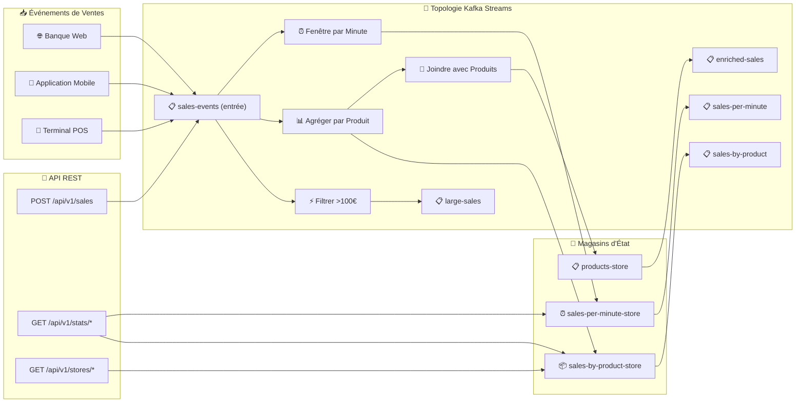

# LAB 3.1A (Java) : Kafka Streams - Traitement en Temps Réel

## ⏱️ Durée Estimée : 90-120 minutes

## 🏦 Contexte Bancaire E-Banking

Dans une banque moderne, les transactions arrivent continuellement de multiples canaux (web, mobile, distributeur). Au-delà du simple passage de messages, nous avons besoin du **traitement en temps réel** pour :

- ✅ **Agréger les ventes** par produit en temps réel
- ✅ **Calculs fenêtrés** (par minute, par heure)  
- ✅ **Filtrer les événements** (ex: ventes importantes > 100€)
- ✅ **Enrichir les données** en joignant les flux avec des données de référence
- ✅ **Maintenir l'état** pour des requêtes à faible latence

Dans ce laboratoire, vous implémenterez une **topologie Kafka Streams** pour le traitement des ventes en temps réel avec des opérations avec état.

---

## 📊 Architecture

### Pipeline de Traitement Kafka Streams



---

## 🏗️ Project Structure

```
java/
├── src/main/java/com/data2ai/kafka/
│   ├── Application.java                    # Spring Boot main class
│   ├── config/
│   │   └── KafkaStreamsConfig.java         # Streams & Producer config
│   ├── controller/
│   │   ├── RootController.java              # Root endpoint
│   │   └── SalesController.java             # REST endpoints
│   ├── model/
│   │   ├── Sale.java                        # Input event model
│   │   └── SaleAggregate.java               # Aggregated result model
│   └── streams/
│       ├── JsonSerde.java                   # Custom JSON serde
│       └── SalesTopology.java               # Kafka Streams topology
├── src/main/resources/
│   └── application.properties               # Configuration
└── pom.xml                                 # Maven dependencies
```

---

## 🚀 Guide Complet Étape par Étape

### 📋 Prérequis

- **Java 17+** - [Télécharger Java](https://adoptium.net/)
- **Maven 3.6+** - [Télécharger Maven](https://maven.apache.org/download.cgi)
- **Cluster Kafka** - Docker Compose ou OpenShift Sandbox
- **IDE** - IntelliJ IDEA ou VS Code
- **Git** - Pour cloner le dépôt

---

## 🛠️ ÉTAPE 1 : Configuration du Projet & Codage

### 1.1 Cloner et Naviguer vers le Projet

```bash
# Cloner le dépôt (si pas déjà fait)
git clone <url-dépôt>
cd formation-kafka-dotnet/day-03-integration/module-05-kafka-streams-ksqldb/java
```

### 1.2 Comprendre la Structure du Projet

```text
java/
├── src/main/java/com/data2ai/kafka/
│   ├── Application.java                    # Classe principale Spring Boot
│   ├── config/
│   │   └── KafkaStreamsConfig.java         # Configuration Streams & Producer
│   ├── controller/
│   │   ├── RootController.java              # Endpoint racine
│   │   └── SalesController.java             # Endpoints REST
│   ├── model/
│   │   ├── Sale.java                        # Modèle d'événement d'entrée
│   │   └── SaleAggregate.java               # Modèle de résultat agrégé
│   └── streams/
│       ├── JsonSerde.java                   # Serde JSON personnalisé
│       └── SalesTopology.java               # Topologie Kafka Streams
├── src/main/resources/
│   └── application.properties               # Configuration
└── pom.xml                                 # Dépendances Maven
```

### 1.3 Composants Clés du Code

#### Topologie de Streams (`streams/SalesTopology.java`)
```java
// Fonctionnalités clés :
// - Consomme du topic 'sales-events'
// - Filtre les ventes importantes (> 100€) vers 'large-sales'
// - Agrège par ID produit dans 'sales-by-product' store
// - Agrégation fenêtrée par minute vers 'sales-per-minute'
// - Maintient les magasins d'état RocksDB
```

#### Contrôleurs API
```java
// SalesController.java:
// - POST /api/v1/sales - Produire un nouvel événement de vente
// - GET /api/v1/stats/by-product - Obtenir les statistiques agrégées par produit
// - GET /api/v1/stats/per-minute - Obtenir les statistiques fenêtrées par minute

// RootController.java:
// - GET / - Informations sur l'application
// - GET /api/v1/stores/* - Interroger les magasins d'état
```

---

## 🔨 ÉTAPE 2 : Construction de l'Application

### 2.1 Build de Développement Local

```bash
# Restaurer les dépendances
mvn clean install

# Construire le projet
mvn compile

# Construire pour la production
mvn clean package -DskipTests
```

### 2.2 Vérifier la Succès du Build

```bash
# Exécuter les tests
mvn test

# Vérifier la sortie du build
ls target/
# Devrait contenir : module05-kafka-streams-1.0.0.jar
```

### 2.3 Build Docker (Optionnel)

```bash
# Construire l'image Docker
docker build -t m05-kafka-streams-java .

# Exécuter le conteneur localement
docker run -p 8080:8080 m05-kafka-streams-java
```

---

## 🏃‍♂️ ÉTAPE 3 : Exécution de l'Application

### 3.1 Exécution de Développement Local

```bash
# Méthode 1 : Exécution simple
mvn spring-boot:run

# Méthode 2 : Avec environnement spécifique
SPRING_PROFILES_ACTIVE=dev mvn spring-boot:run

# Méthode 3 : Avec port personnalisé
SERVER_PORT=9090 mvn spring-boot:run
```

### 3.2 Vérifier le Démarrage de l'Application

**Sortie Attendue :**
```
  .   ____          _            __ _ _
 /\\ / ___'_ __ _ _(_)_ __  __ _ \ \ \ \
( ( )\___ | '_ \| '_| | '_ \/ _` | \ \ \ \
 \\/  ___)| |_) | | | | | || (_| |  ) ) ) )
  '  |____| .__|_| |_|_| |_\__, | / / / /
 =========|_|==============|___/=/_/_/_/
 :: Spring Boot ::                (v3.2.0)

2024-01-01 12:00:00.000  INFO 12345 --- [           main] c.d.kafka.Application        : Starting Application...
2024-01-01 12:00:01.000  INFO 12345 --- [           main] c.d.kafka.Application        : Started Application in 1.234 seconds
```

### 3.3 Accéder à Swagger UI

Ouvrez votre navigateur et naviguez vers :
- **Swagger UI** : http://localhost:8080/swagger-ui.html
- **Actuator Health** : http://localhost:8080/actuator/health

---

## 🧪 ÉTAPE 4 : Test des APIs de Streaming

### 4.1 Vérification de Santé

```bash
# Tester l'endpoint de santé
curl http://localhost:8080/actuator/health

# Réponse attendue :
# {"status":"UP","streamsState":"RUNNING"}
```

### 4.2 Tests de Streaming des Ventes

#### 4.2.1 Produire des Événements de Vente

```bash
# Vente 1 - Petit montant
curl -X POST http://localhost:8080/api/v1/sales \
  -H "Content-Type: application/json" \
  -d '{"productId":"PROD-001","quantity":2,"unitPrice":25.00}'

# Réponse attendue :
# {"topic":"sales-events","status":"ACCEPTED","productId":"PROD-001","totalAmount":50.0}

# Vente 2 - Grand montant (> 100€)
curl -X POST http://localhost:8080/api/v1/sales \
  -H "Content-Type: application/json" \
  -d '{"productId":"PROD-002","quantity":5,"unitPrice":150.00}'

# Réponse attendue :
# {"topic":"sales-events","status":"ACCEPTED","productId":"PROD-002","totalAmount":750.0}

# Vente 3 - Différent produit
curl -X POST http://localhost:8080/api/v1/sales \
  -H "Content-Type: application/json" \
  -d '{"productId":"PROD-003","quantity":1,"unitPrice":99.99}'
```

#### 4.2.2 Interroger les Statistiques Agrégées

```bash
# Attendre 2-3 secondes pour le traitement des streams
sleep 3

# Obtenir les stats par produit
curl http://localhost:8080/api/v1/stats/by-product

# Réponse attendue :
# {
#   "PROD-001": {"totalAmount":50.0,"count":1,"totalQuantity":2},
#   "PROD-002": {"totalAmount":750.0,"count":1,"totalQuantity":5},
#   "PROD-003": {"totalAmount":99.99,"count":1,"totalQuantity":1}
# }

# Obtenir les stats par minute
curl http://localhost:8080/api/v1/stats/per-minute

# Réponse attendue :
# {
#   "streamsState":"RUNNING",
#   "message":"Check sales-per-minute topic in Kafka UI"
# }
```

### 4.3 Tests des Magasins d'État

```bash
# Interroger toutes les entrées du magasin sales-by-product
curl http://localhost:8080/api/v1/stores/sales-by-product-store/all

# Interroger un produit spécifique dans le magasin
curl http://localhost:8080/api/v1/stores/sales-by-product-store/PROD-001

# Interroger le magasin fenêtré par minute
curl http://localhost:8080/api/v1/stores/sales-per-minute-store/all
```

---

## 🔍 ÉTAPE 5 : Vérifier le Traitement des Streams dans Kafka

### 5.1 Utiliser Kafka UI (Recommandé)

**Accès** : http://localhost:8080 (si exécutant Docker Kafka)

#### Vérifier les Topics d'Entrée
1. Naviguer vers **Topics**
2. Cliquer sur **sales-events**
3. Cliquer sur l'onglet **Messages**
4. Vérifier que les événements de vente sont produits

#### Vérifier les Topics de Sortie
1. **large-sales** - Doit contenir les ventes > 100€
2. **sales-by-product** - Données de ventes agrégées
3. **sales-per-minute** - Agrégations fenêtrées
4. **enriched-sales** - Ventes enrichies avec données de référence

### 5.2 Utiliser Kafka CLI

```bash
# Vérifier le topic sales-events
docker exec kafka /opt/kafka/bin/kafka-console-consumer.sh \
  --bootstrap-server localhost:9092 \
  --topic sales-events \
  --from-beginning \
  --max-messages 5

# Vérifier le topic large-sales (ventes filtrées)
docker exec kafka /opt/kafka/bin/kafka-console-consumer.sh \
  --bootstrap-server localhost:9092 \
  --topic large-sales \
  --from-beginning \
  --max-messages 5

# Vérifier les stats par produit
docker exec kafka /opt/kafka/bin/kafka-console-consumer.sh \
  --bootstrap-server localhost:9092 \
  --topic sales-by-product \
  --from-beginning \
  --max-messages 5
```

---

## 📊 ÉTAPE 6 : Scénarios de Tests Avancés

### 6.1 Test de Charge

```bash
# Produire plusieurs ventes rapidement
for i in {1..10}; do
  curl -X POST http://localhost:8080/api/v1/sales \
    -H "Content-Type: application/json" \
    -d "{\"productId\":\"PROD-00$i\",\"quantity\":$((i*2)),\"unitPrice\":$((i*10))}"
  sleep 0.1
done

# Vérifier les résultats agrégés
curl http://localhost:8080/api/v1/stats/by-product
```

### 6.2 Tests de Gestion d'Erreurs

```bash
# Tester des données de vente invalides
curl -X POST http://localhost:8080/api/v1/sales \
  -H "Content-Type: application/json" \
  -d '{"productId":"","quantity":-1,"unitPrice":0}'

# Attendu : 400 Bad Request

# Tester JSON invalide
curl -X POST http://localhost:8080/api/v1/sales \
  -H "Content-Type: application/json" \
  -d '{invalid json}'

# Attendu : 400 Bad Request
```

### 6.3 Tests de Concurrence

```bash
# Simuler la production de ventes concurrentes
for i in {1..5}; do
  curl -X POST http://localhost:8080/api/v1/sales \
    -H "Content-Type: application/json" \
    -d "{\"productId\":\"PROD-CONC-$i\",\"quantity\":1,\"unitPrice\":100.00}" &
done
wait

# Vérifier que toutes les ventes ont été traitées
curl http://localhost:8080/api/v1/stats/by-product
```

---

## 🚀 ÉTAPE 7 : Déploiement OpenShift (Optionnel)

### 7.1 Utiliser les Scripts de Déploiement

```bash
# Naviguer vers le répertoire des scripts
cd ../../scripts

# Exécuter le déploiement (Bash)
./bash/deploy-and-test-3.1a-java.sh --token "sha256~XXX" --server "https://api..."

# Ou PowerShell
./powershell/deploy-and-test-3.1a-java.ps1 -Token "sha256~XXX" -Server "https://api..."
```

### 7.2 Déploiement OpenShift Manuel

```bash
# Construire et pousser
oc new-build --name ebanking-streams-java --binary --strategy=source \
  --image-stream=java:openjdk-17-ubi8

oc start-build ebanking-streams-java --from-dir=. --follow

# Déployer
oc new-app ebanking-streams-java

# Configurer l'environnement
oc set env deployment/ebanking-streams-java \
  KAFKA_BOOTSTRAP_SERVERS=kafka-svc:9092

# Créer la route
oc create route edge ebanking-streams-java-secure \
  --service=ebanking-streams-java --port=8080-tcp
```

### 7.3 Tester le Déploiement OpenShift

```bash
# Obtenir l'URL de la route
ROUTE=$(oc get route ebanking-streams-java-secure -o jsonpath='{.spec.host}')

# Tester la santé
curl -k https://$ROUTE/actuator/health

# Tester l'API des ventes
curl -k -X POST https://$ROUTE/api/v1/sales \
  -H "Content-Type: application/json" \
  -d '{"productId":"PROD-001","quantity":2,"unitPrice":125.00}'
```

---

## 🚢 Déploiement — 4 Environnements

| Environnement | Outil | Kafka Bootstrap | Accès API |
| -------------- | ----- | --------------- | --------- |
| **🐳 Docker / Local** | `mvn spring-boot:run` | `localhost:9092` | `http://localhost:8080/` |
| **☁️ OpenShift Sandbox** | Scripts automatisés | `kafka-svc:9092` | `https://{route}/` |
| **☸️ K8s / OKD** | `docker build` + `kubectl apply` | `kafka-svc:9092` | `http://localhost:8080/` (port-forward) |
| **🖥️ Local (IDE)** | VS Code / IntelliJ | `localhost:9092` | `http://localhost:8080/` |

### Développement Local

```bash
# Construire et exécuter localement
mvn clean spring-boot:run

# Swagger UI
open http://localhost:8080/swagger-ui.html
```

### Déploiement OpenShift

```bash
# Déployer en utilisant les scripts (recommandé)
cd ../../scripts
./bash/deploy-and-test-3.1a-java.sh --token "sha256~XXX" --server "https://api..."

# Ou PowerShell
./powershell/deploy-and-test-3.1a-java.ps1 -Token "sha256~XXX" -Server "https://api..."
```

> **Le script gère automatiquement :**
> - ✅ Build avec S2I (java:openjdk-17-ubi8)
> - ✅ Déploiement vers OpenShift
> - ✅ Configuration des variables d'environnement
> - ✅ Création de la route sécurisée edge
> - ✅ Attente de la disponibilité du pod
> - ✅ Exécution des tests de validation API

---

## 🧪 Tests d'API — Scénarios de Validation

### Vérification de Santé

```bash
# Local
curl http://localhost:8080/actuator/health

# OpenShift Sandbox
curl -k https://ebanking-streams-java-secure.apps.sandbox.x8i5.p1.openshiftapps.com/actuator/health
```

### Produire un Événement de Vente

```bash
# Local
curl -X POST http://localhost:8080/api/v1/sales \
  -H "Content-Type: application/json" \
  -d '{"productId":"PROD-001","quantity":2,"unitPrice":125.00}'

# OpenShift Sandbox
curl -k -X POST https://ebanking-streams-java-secure.apps.sandbox.x8i5.p1.openshiftapps.com/api/v1/sales \
  -H "Content-Type: application/json" \
  -d '{"productId":"PROD-001","quantity":2,"unitPrice":125.00}'
```

### Interroger les Stats Agrégées

```bash
# Local
curl http://localhost:8080/api/v1/stats/by-product

# OpenShift Sandbox
curl -k https://ebanking-streams-java-secure.apps.sandbox.x8i5.p1.openshiftapps.com/api/v1/stats/by-product
```

### Stats Fenêtrées par Minute

```bash
# Local
curl http://localhost:8080/api/v1/stats/per-minute

# OpenShift Sandbox
curl -k https://ebanking-streams-java-secure.apps.sandbox.x8i5.p1.openshiftapps.com/api/v1/stats/per-minute
```

### Interroger le Magasin d'État

```bash
# Local - Toutes les entrées
curl http://localhost:8080/api/v1/stores/sales-by-product-store/all

# Local - Par clé
curl http://localhost:8080/api/v1/stores/sales-by-product-store/PROD-001
```

---

## 📊 Vérification dans Kafka

### Utiliser Kafka UI

**Docker** : <http://localhost:8080>

1. Aller à **Topics** → **sales-events**
2. Cliquer sur **Messages**
3. Vérifier les événements de vente avec format JSON correct

### Utiliser Kafka CLI

```bash
# Docker
docker exec kafka /opt/kafka/bin/kafka-console-consumer.sh \
  --bootstrap-server localhost:9092 \
  --topic sales-events \
  --from-beginning \
  --max-messages 5

# OpenShift Sandbox
oc exec kafka-0 -- /opt/kafka/bin/kafka-console-consumer.sh \
  --bootstrap-server kafka-0.kafka-svc:9092 \
  --topic sales-events \
  --from-beginning \
  --max-messages 5
```

---

## 📋 Endpoints API

| Méthode | Endpoint | Description | Corps de la Requête |
|--------|----------|-------------|-------------------|
| GET | `/` | Informations application | - |
| GET | `/actuator/health` | Vérification santé | - |
| POST | `/api/v1/sales` | Produire événement vente | `{"productId":"...","quantity":N,"unitPrice":N.N}` |
| GET | `/api/v1/stats/by-product` | Stats agrégées par produit | - |
| GET | `/api/v1/stats/per-minute` | Stats fenêtrées par minute | - |
| GET | `/api/v1/stores/{storeName}/all` | Interroger magasin d'état toutes entrées | - |
| GET | `/api/v1/stores/{storeName}/{key}` | Interroger magasin d'état par clé | - |

---

## 🔧 Configuration

### application.properties

```properties
server.port=8080
spring.application.name=module05-kafka-streams

# Kafka Streams
spring.kafka.streams.application-id=sales-streams-app
spring.kafka.streams.bootstrap-servers=localhost:9092

# Actuator
management.endpoints.web.exposure.include=health,info
management.endpoint.health.show-details=always
```

### Variables d'Environnement (OpenShift)

| Variable | Défaut | Description |
|----------|--------|-------------|
| `SERVER_PORT` | 8080 | Port serveur HTTP |
| `KAFKA_BOOTSTRAP_SERVERS` | localhost:9092 | Brokers Kafka |
| `INPUT_TOPIC` | sales-events | Nom topic d'entrée |
| `OUTPUT_TOPIC` | sales-by-product | Nom topic de sortie |
| `APPLICATION_ID` | sales-streams-app | ID application Streams |

---

## 🔄 Topologie Kafka Streams

La `SalesTopology` implémente :

1. **Filtrer** : Ventes importantes (>100€) → topic `large-sales`
2. **Agréger** : Ventes par produit → topic `sales-by-product` + magasin d'état
3. **Fenêtrer** : Ventes par minute → topic `sales-per-minute` + magasin fenêtré
4. **Joindre** : Ventes avec référence produit → topic `enriched-sales`

### Opérations Clés

```java
// Filtrer les ventes importantes
salesStream.filter((key, value) -> {
    Sale sale = objectMapper.readValue(value, Sale.class);
    return sale.getTotalAmount() > 100;
})

// Agréger par produit
.groupByKey()
.aggregate(
    SaleAggregate::new,
    (key, value, aggregate) -> aggregate.add(sale),
    Materialized.as("sales-by-product-store")
)

// Agrégation fenêtrée
.windowedBy(TimeWindows.ofSizeWithNoGrace(Duration.ofMinutes(1)))
.aggregate(/* ... */)

// Jointure stream-table
salesStream.join(productsTable, (saleJson, productJson) -> {
    // Enrichir la vente avec données produit
})
```

---

## 🧪 Tests

### Tests Unitaires

```bash
mvn test
```

### Tests d'Intégration

```bash
# Tester avec Kafka embarqué
mvn test -Dtest=**/*IntegrationTest
```

### Tests Manuels

```bash
# Envoyer plusieurs ventes
for i in {1..5}; do
  curl -X POST http://localhost:8080/api/v1/sales \
    -H "Content-Type: application/json" \
    -d "{\"productId\":\"PROD-001\",\"quantity\":1,\"unitPrice\":$((i * 50))}"
  sleep 1
done

# Vérifier l'agrégation
curl http://localhost:8080/api/v1/stats/by-product
```

---

## 📊 Magasins d'État

L'application maintient deux magasins d'état clés :

| Magasin | Type | Accès | Description |
|---------|------|--------|-------------|
| `sales-by-product-store` | KeyValue | API REST | Totaux courants par produit |
| `sales-per-minute-store` | Windowed | Interne | Agrégations fenêtrées temporelles |

### Interroger les Magasins d'État

```bash
# Tous les produits
curl http://localhost:8080/api/v1/stores/sales-by-product-store/all

# Produit spécifique
curl http://localhost:8080/api/v1/stores/sales-by-product-store/PROD-001
```

---

## 🔍 Monitoring

### Vérification de Santé

```bash
curl http://localhost:8080/actuator/health
```

La réponse inclut l'état des Streams :
```json
{
  "status": "UP",
  "streamsState": "RUNNING"
}
```

### Métriques

Disponibles via `/actuator/prometheus` :
- `kafka_streams_state`
- `kafka_consumer_records_consumed_total`
- Métriques personnalisées de l'application

---

## 🐛 Dépannage

| Problème | Cause | Solution |
|---------|-------|----------|
| État Streams = `REBALANCING` | Rééquilibrage groupe consommateur | Attendre la complétion |
| Pas de données dans magasin d'état | Aucun événement traité | Envoyer des événements via POST /api/v1/sales |
| `SerializationException` | JSON invalide | Vérifier format corps requête |
| `TaskCorruptedException` | Corruption magasin d'état | Supprimer répertoire état et redémarrer |

---

## 📚 Concepts Couverts

- **Topologie Kafka Streams** : KStream, KTable, agrégation
- **Traitement avec État** : Magasins d'état matérialisés
- **Fenêtrage** : Fenêtres temporelles pour agrégations temporelles
- **Jointures Stream-Table** : Enrichissement avec données de référence
- **Requêtes Interactives** : Accès REST aux magasins d'état
- **Serdes** : Sérialisation JSON personnalisée
- **Gestion d'Erreurs** : Topics dead-letter, tentatives

---

## 🏆 Résumé

Ce guide complet vous a accompagné à travers :

1. **🛠️ Configuration Projet** - Comprendre la structure du code
2. **🔨 Construction** - Compiler et packager l'application
3. **🏃‍♂️ Exécution** - Développement local et déploiement
4. **🧪 Tests** - Scénarios complets de validation API
5. **🔍 Vérification** - Intégration Kafka et traitement des streams
6. **📊 Tests Avancés** - Tests de charge et gestion d'erreurs
7. **🚀 Déploiement** - Déploiement production OpenShift
8. **🐛 Dépannage** - Problèmes courants et solutions
9. **✅ Monitoring** - Métriques et optimisation des performances

### 🎯 Points Clés à Retenir

- **Traitement de Streams** : Agrégation et filtrage en temps réel des événements Kafka
- **Magasins d'État** : État consultable en mémoire pour des réponses API rapides
- **Microservices** : Services de traitement des ventes découplés
- **Production Prête** : Docker, OpenShift, et capacités de monitoring
- **Modèles Entreprise** : Architecture événementielle avec CQRS

Vous avez maintenant une application Kafka Streams Java entièrement fonctionnelle qui démontre :
- ✅ Traitement de streams en temps réel
- ✅ Agrégations avec état
- ✅ Exposition API REST
- ✅ Déploiement production
- ✅ Tests complets

**🚀 Prêt pour le déploiement en production et améliorations futures !**
