# LAB 3.1A (Java) : Kafka Streams - Real-time Processing

## ⏱️ Estimated Duration: 90-120 minutes

## 🏦 E-Banking Context

In a modern bank, transactions arrive continuously from multiple channels (web, mobile, ATM). Beyond simple message passing, we need **real-time processing** to:

- ❌ **Aggregate sales** by product in real-time
- ❌ **Window calculations** (per minute, per hour)  
- ❌ **Filter events** (e.g., large sales > 100€)
- ❌ **Enrich data** by joining streams with reference data
- ❌ **Maintain state** for low-latency queries

In this lab, you'll implement a **Kafka Streams topology** for real-time sales processing with stateful operations.

---

## 📊 Architecture

### Kafka Streams Processing Pipeline

```mermaid
flowchart LR
    subgraph Sources["📥 Sales Events"]
        WEB["🌐 Web Banking"]
        MOB["📱 Mobile App"]
        POS["🏪 POS Terminal"]
    end

    subgraph Streams["🔄 Kafka Streams Topology"]
        IN["📋 sales-events (input)"]
        FILTER["⚡ Filter >100€"]
        AGG["📊 Aggregate by Product"]
        WIN["⏰ Window per Minute"]
        JOIN["🔗 Join with Products"]
        OUT1["📋 large-sales"]
        OUT2["📋 sales-by-product"]
        OUT3["📋 sales-per-minute"]
        OUT4["📋 enriched-sales"]
    end

    subgraph Stores["💾 State Stores"]
        PROD_STORE["📦 sales-by-product-store"]
        WIN_STORE["⏰ sales-per-minute-store"]
        PROD_REF["📋 products-store"]
    end

    subgraph API["🚀 REST API"]
        POST["POST /api/v1/sales"]
        STATS["GET /api/v1/stats/*"]
        STORE["GET /api/v1/stores/*"]
    end

    WEB --> IN
    MOB --> IN
    POS --> IN
    IN --> FILTER
    FILTER --> OUT1
    IN --> AGG --> PROD_STORE --> OUT2
    IN --> WIN --> WIN_STORE --> OUT3
    AGG --> JOIN --> PROD_REF --> OUT4
    POST --> IN
    STATS --> PROD_STORE
    STATS --> WIN_STORE
    STORE --> PROD_STORE
```



---

## 🏗️ Project Structure

```
java/
├── src/main/java/com/data2ai/kafka/
│   ├── Application.java                    # Spring Boot main class
│   ├── config/
│   │   └── KafkaStreamsConfig.java         # Streams & Producer config
│   ├── controller/
│   │   ├── RootController.java              # Root endpoint
│   │   └── SalesController.java             # REST endpoints
│   ├── model/
│   │   ├── Sale.java                        # Input event model
│   │   └── SaleAggregate.java               # Aggregated result model
│   └── streams/
│       ├── JsonSerde.java                   # Custom JSON serde
│       └── SalesTopology.java               # Kafka Streams topology
├── src/main/resources/
│   └── application.properties               # Configuration
└── pom.xml                                 # Maven dependencies
```

---

## 🚀 Quick Start

### Prerequisites

- Java 17+
- Maven 3.6+
- Kafka cluster running
- OpenShift Sandbox (for deployment)

### Local Development

```bash
# Build and run locally
mvn clean spring-boot:run

# Produce a sale event
curl -X POST http://localhost:8080/api/v1/sales \
  -H "Content-Type: application/json" \
  -d '{"productId":"PROD-001","quantity":2,"unitPrice":125.00}'

# Query aggregated stats
curl http://localhost:8080/api/v1/stats/by-product
```

### OpenShift Deployment

```bash
# Deploy using scripts
cd ../../scripts
./bash/deploy-and-test-3.1a-java.sh --token "sha256~XXX" --server "https://api..."

# Or using PowerShell
./powershell/deploy-and-test-3.1a-java.ps1 -Token "sha256~XXX" -Server "https://api..."
```

---

## 📋 API Endpoints

| Method | Endpoint | Description | Request Body |
|--------|----------|-------------|--------------|
| GET | `/` | Application info | - |
| GET | `/actuator/health` | Health check | - |
| POST | `/api/v1/sales` | Produce sale event | `{"productId":"...","quantity":N,"unitPrice":N.N}` |
| GET | `/api/v1/stats/by-product` | Aggregated stats by product | - |
| GET | `/api/v1/stats/per-minute` | Windowed stats per minute | - |
| GET | `/api/v1/stores/{storeName}/all` | Query state store all entries | - |
| GET | `/api/v1/stores/{storeName}/{key}` | Query state store by key | - |

---

## 🔧 Configuration

### application.properties

```properties
server.port=8080
spring.application.name=module05-kafka-streams

# Kafka Streams
spring.kafka.streams.application-id=sales-streams-app
spring.kafka.streams.bootstrap-servers=localhost:9092

# Actuator
management.endpoints.web.exposure.include=health,info
management.endpoint.health.show-details=always
```

### Environment Variables (OpenShift)

| Variable | Default | Description |
|----------|---------|-------------|
| `SERVER_PORT` | 8080 | HTTP server port |
| `KAFKA_BOOTSTRAP_SERVERS` | localhost:9092 | Kafka brokers |
| `INPUT_TOPIC` | sales-events | Input topic name |
| `OUTPUT_TOPIC` | sales-by-product | Output topic name |
| `APPLICATION_ID` | sales-streams-app | Streams application ID |

---

## 🔄 Kafka Streams Topology

The `SalesTopology` implements:

1. **Filter**: Large sales (>100€) → `large-sales` topic
2. **Aggregate**: Sales by product → `sales-by-product` topic + state store
3. **Window**: Sales per minute → `sales-per-minute` topic + windowed store
4. **Join**: Sales with product reference → `enriched-sales` topic

### Key Operations

```java
// Filter large sales
salesStream.filter((key, value) -> {
    Sale sale = objectMapper.readValue(value, Sale.class);
    return sale.getTotalAmount() > 100;
})

// Aggregate by product
.groupByKey()
.aggregate(
    SaleAggregate::new,
    (key, value, aggregate) -> aggregate.add(sale),
    Materialized.as("sales-by-product-store")
)

// Windowed aggregation
.windowedBy(TimeWindows.ofSizeWithNoGrace(Duration.ofMinutes(1)))
.aggregate(/* ... */)

// Stream-table join
salesStream.join(productsTable, (saleJson, productJson) -> {
    // Enrich sale with product data
})
```

---

## 🧪 Testing

### Unit Tests

```bash
mvn test
```

### Integration Tests

```bash
# Test with embedded Kafka
mvn test -Dtest=**/*IntegrationTest
```

### Manual Testing

```bash
# Send multiple sales
for i in {1..5}; do
  curl -X POST http://localhost:8080/api/v1/sales \
    -H "Content-Type: application/json" \
    -d "{\"productId\":\"PROD-001\",\"quantity\":1,\"unitPrice\":$((i * 50))}"
  sleep 1
done

# Check aggregation
curl http://localhost:8080/api/v1/stats/by-product
```

---

## 📊 State Stores

The application maintains two key state stores:

| Store | Type | Access | Description |
|-------|------|--------|-------------|
| `sales-by-product-store` | KeyValue | REST API | Running totals per product |
| `sales-per-minute-store` | Windowed | Internal | Time-windowed aggregates |

### Query State Stores

```bash
# All products
curl http://localhost:8080/api/v1/stores/sales-by-product-store/all

# Specific product
curl http://localhost:8080/api/v1/stores/sales-by-product-store/PROD-001
```

---

## 🔍 Monitoring

### Health Check

```bash
curl http://localhost:8080/actuator/health
```

Response includes Streams state:
```json
{
  "status": "UP",
  "streamsState": "RUNNING"
}
```

### Metrics

Available via `/actuator/prometheus`:
- `kafka_streams_state`
- `kafka_consumer_records_consumed_total`
- Custom application metrics

---

## 🐛 Troubleshooting

| Issue | Cause | Solution |
|-------|-------|----------|
| Streams state = `REBALANCING` | Consumer group rebalance | Wait for completion |
| No data in state store | No events processed | Send events via POST /api/v1/sales |
| `SerializationException` | Invalid JSON | Verify request body format |
| `TaskCorruptedException` | State store corruption | Delete state directory and restart |

---

## 📚 Concepts Covered

- **Kafka Streams Topology**: KStream, KTable, aggregation
- **Stateful Processing**: Materialized state stores
- **Windowing**: Time windows for temporal aggregations  
- **Stream-Table Joins**: Enrichment with reference data
- **Interactive Queries**: REST access to state stores
- **Serdes**: Custom JSON serialization
- **Error Handling**: Dead-letter topics, retries
