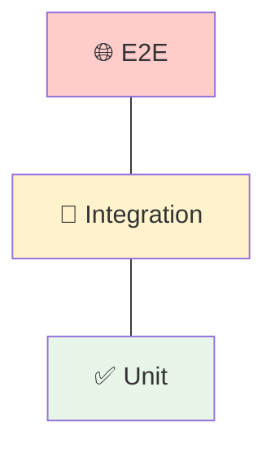

# 🧪 Module 07 - Tests d'Applications Kafka

| Durée | Niveau | Prérequis |
|-------|--------|-----------|
| 2 heures | Intermédiaire | Modules 01-06 complétés |

## 🎯 Objectifs d'apprentissage

À la fin de ce module, vous serez capable de :

- ✅ Écrire des tests unitaires avec mocking Kafka
- ✅ Utiliser Testcontainers pour les tests d'intégration
- ✅ Tester le poll loop des consumers
- ✅ Mettre en place un pipeline de test complet

---

## 📚 Partie Théorique (30%)

### 1. Stratégies de test pour Kafka



| Type | Outils | Vitesse |
|------|--------|---------|
| **Unit** | MockProducer, MockConsumer | ms |
| **Integration** | Testcontainers | secondes |
| **E2E** | Environnement complet | minutes |

---

### 2. Tests unitaires avec Mocking

#### MockProducer

```csharp
[Fact]
public async Task TestProducerSendsMessage()
{
    // Arrange
    var mockProducer = new Mock<IProducer<string, string>>();
    var deliveredMessages = new List<Message<string, string>>();

    mockProducer.Setup(p => p.ProduceAsync(
        It.IsAny<string>(),
        It.IsAny<Message<string, string>>(),
        It.IsAny<CancellationToken>()))
        .Callback<string, Message<string, string>, CancellationToken>(
            (topic, msg, ct) => deliveredMessages.Add(msg))
        .ReturnsAsync(new DeliveryResult<string, string>());

    var service = new MyService(mockProducer.Object);

    // Act
    await service.SendMessageAsync("key", "value");

    // Assert
    Assert.Single(deliveredMessages);
    Assert.Equal("key", deliveredMessages[0].Key);
    Assert.Equal("value", deliveredMessages[0].Value);
}
```

#### MockConsumer

```csharp
[Fact]
public void TestConsumerProcessesMessages()
{
    // Arrange
    var mockConsumer = new Mock<IConsumer<string, string>>();
    var testResult = new ConsumeResult<string, string>
    {
        Topic = "test-topic",
        Partition = 0,
        Offset = 0,
        Message = new Message<string, string>
        {
            Key = "key",
            Value = "value"
        }
    };

    mockConsumer.Setup(c => c.Consume(It.IsAny<CancellationToken>()))
        .Returns(testResult);

    var consumer = new MyConsumer(mockConsumer.Object);

    // Act
    var processed = consumer.PollAndProcess();

    // Assert
    Assert.Single(processed);
    Assert.Equal("value", processed[0]);
}
```

---

### 3. Tests d'intégration avec Testcontainers


#### Configuration Testcontainers

```csharp
// NuGet: Testcontainers.Kafka, xunit
public class KafkaIntegrationTest : IAsyncLifetime
{
    private readonly KafkaContainer _kafka = new KafkaBuilder()
        .WithImage("confluentinc/cp-kafka:7.5.0")
        .Build();

    public async Task InitializeAsync()
    {
        // Kafka démarre automatiquement
        await _kafka.StartAsync();
    }

    public async Task DisposeAsync() => await _kafka.DisposeAsync();

    [Fact]
    public async Task TestProduceAndConsume()
    {
        var bootstrapServers = _kafka.GetBootstrapAddress();
        // Test avec Kafka réel
    }
}
```

---

### 4. Test du Poll Loop

```csharp
[Fact]
public async Task TestConsumerPollLoop()
{
    // Configuration
    var config = new ConsumerConfig
    {
        BootstrapServers = _kafka.GetBootstrapAddress(),
        GroupId = "test-group",
        AutoOffsetReset = AutoOffsetReset.Earliest
    };

    using var consumer = new ConsumerBuilder<string, string>(config).Build();
    consumer.Subscribe("test-topic");

    // Produire un message
    await ProduceTestMessageAsync("test-topic", "key", "value");

    // Poll avec timeout
    var result = consumer.Consume(TimeSpan.FromSeconds(10));

    // Assertions
    Assert.NotNull(result);
    Assert.Equal("value", result.Message.Value);
}
```

---

## 🛠️ Partie Pratique (70%)

### Prérequis

- .NET 8.0 SDK ou supérieur
- Docker (pour Testcontainers)

```bash
dotnet --version
# Attendu : 8.0.x ou supérieur

docker info
# Docker doit être en cours d'exécution
```

> **Note** : Les tests d'intégration utilisent [Testcontainers.Kafka](https://dotnet.testcontainers.org/) qui nécessite Docker. Pour K8s, vous pouvez utiliser un cluster Kafka existant en passant `KAFKA_BOOTSTRAP_SERVERS` comme variable d'environnement.

---

### Étape 1 - Structure du projet de test

```bash
cd day-03-integration/module-07-testing/dotnet
```

**Structure** :

```
dotnet/
├── KafkaTests.csproj
├── Services/
│   ├── MessageProducer.cs
│   └── MessageConsumer.cs
├── Unit/
│   ├── ProducerUnitTest.cs
│   └── ConsumerUnitTest.cs
└── Integration/
    └── KafkaIntegrationTest.cs
```

**Restaurer les dépendances** :

```bash
dotnet restore
```

---

### Étape 2 - Lab 1 : Tests unitaires Producer

**Fichier** : `Unit/ProducerUnitTest.cs`

```bash
# Exécuter les tests unitaires du Producer
dotnet test --filter "FullyQualifiedName~ProducerUnitTest"
```

**Points à vérifier** :
- ✅ Le message est envoyé au bon topic (`SendAsync_ValidMessage_ProducesToCorrectTopic`)
- ✅ La clé et la valeur sont correctes
- ✅ Le header `correlation-id` est un GUID valide (`SendAsync_IncludesCorrelationIdHeader`)
- ✅ Les exceptions `ProduceException` sont propagées (`SendAsync_ProduceException_Propagates`)

---

### Étape 3 - Lab 2 : Tests unitaires Consumer

**Fichier** : `Unit/ConsumerUnitTest.cs`

```bash
dotnet test --filter "FullyQualifiedName~ConsumerUnitTest"
```

**Points à vérifier** :
- ✅ Un seul message est consommé et retourné (`PollAndProcess_SingleMessage_ReturnsValue`)
- ✅ Plusieurs messages sont consommés dans l'ordre (`PollAndProcess_MultipleMessages_ReturnsAll`)
- ✅ Aucun message → liste vide (`PollAndProcess_NoMessages_ReturnsEmpty`)
- ✅ Le timeout est respecté (`PollAndProcess_TimeoutExpires_ReturnsPartialResults`)

---

### Étape 4 - Lab 3 : Tests d'intégration avec Testcontainers

```bash
# Exécuter les tests d'intégration (nécessite Docker)
dotnet test --filter "FullyQualifiedName~KafkaIntegrationTest"
```

**Ce test utilise `IAsyncLifetime`** :
1. `InitializeAsync()` : Démarre un conteneur Kafka via Testcontainers
2. Chaque `[Fact]` : Produit et consomme des messages sur un Kafka réel
3. `DisposeAsync()` : Arrête et supprime le conteneur

**Tests inclus** :
- `ProduceAndConsume_SingleMessage_RoundTrip` — aller-retour complet
- `ProduceAndConsume_MultipleMessages_AllReceived` — 10 messages
- `ProduceWithHeaders_HeadersPreserved` — vérification des headers
- `ConsumerGroup_TwoConsumers_PartitionsDistributed` — scaling

---

### Étape 5 - Lab 4 : Test de bout en bout

```bash
# Exécuter tous les tests (unitaires + intégration)
dotnet test
```

**Scénario E2E testé dans `KafkaIntegrationTest`** :
1. Producer envoie 10 messages avec `MessageProducer`
2. Consumer les consomme tous via `MessageConsumer`
3. Vérification que les 10 valeurs sont présentes

---

### Étape 6 - Lab 5 : Tests de résilience

**Exercice** : Ajoutez un fichier `Integration/ResilienceTest.cs` qui teste :

```bash
# Après avoir créé le fichier
dotnet test --filter "FullyQualifiedName~ResilienceTest"
```

**Scénarios à implémenter** :
- Test de retry après `ProduceException` (mocker un producer qui échoue puis réussit)
- Test de timeout consumer (poll sans messages, vérifier que le timeout est respecté)
- Test de reconnexion (arrêter et redémarrer le conteneur Kafka)

---

## ✅ Checkpoint de validation

- [ ] Tests unitaires Producer passent
- [ ] Tests unitaires Consumer passent
- [ ] Tests d'intégration avec Testcontainers passent
- [ ] Tests E2E passent
- [ ] Tests de résilience passent

---

## 🔧 Troubleshooting

### Testcontainers ne démarre pas

```bash
# Vérifier Docker
docker info

# Vérifier les permissions
docker run hello-world

# Vérifier que l'image est accessible
docker pull confluentinc/cp-kafka:7.5.0
```

### Tests lents

- Partager le conteneur Kafka entre tests via `IAsyncLifetime` (le conteneur est démarré une fois par classe)
- Utiliser `[Collection]` pour partager un conteneur entre plusieurs classes de tests
- Augmenter le timeout si Docker est lent : `new KafkaBuilder().WithStartupCallback(...)`

### Erreur "No usable version of libssl"

```bash
# Sur Ubuntu/Debian, installer les dépendances
sudo apt-get install -y libssl-dev
```

---

## 🧹 Nettoyage

```bash
# Nettoyer les artefacts .NET
dotnet clean
rm -rf bin/ obj/

# Supprimer les images Docker de test
docker image prune -f
```

---

## 📖 Pour aller plus loin

### Exercices supplémentaires

1. **Ajoutez des tests de performance** avec BenchmarkDotNet
2. **Testez les transactions** Kafka (idempotent producer)
3. **Implémentez des tests de chaos** (kill broker pendant le test via Testcontainers)

### Tutorials pas-à-pas

| IDE | Tutorial | Description |
|-----|----------|-------------|
| **VS Code** | [🔷 TUTORIAL-DOTNET.md](./TUTORIAL-DOTNET.md) | xUnit + Moq + Testcontainers.Kafka (.NET 8) |
| **VS Code / IntelliJ** | [☕ TUTORIAL.md](./TUTORIAL.md) | JUnit 5 + MockProducer + Testcontainers (Java 17) |

### Ressources

- [Testcontainers .NET Kafka Module](https://dotnet.testcontainers.org/modules/kafka/)
- [Confluent.Kafka .NET API](https://docs.confluent.io/kafka-clients/dotnet/current/overview.html)
- [Moq Quickstart](https://github.com/devlooped/moq/wiki/Quickstart)
- [xUnit Documentation](https://xunit.net/docs/getting-started/netcore/cmdline)
