# 🛠️ Tutorial VS Code : Tests d'Applications Kafka (.NET)

## 📋 Vue d'ensemble

Ce tutorial vous guide pour implémenter des tests Kafka en .NET avec :
- **Tests unitaires** avec Moq (mock du `IProducer` / `IConsumer`)
- **Tests d'intégration** avec Testcontainers.Kafka
- **Tests E2E** avec un vrai broker Kafka dans un conteneur Docker

```mermaid
flowchart TB
    UNIT["✅ Unit Tests"] --- INT["🔗 Integration"] --- E2E["🌐 E2E"]
    style UNIT fill:#e8f5e9
```



---

## 🎯 Prérequis

| Outil | Version | Installation |
|-------|---------|--------------|
| **VS Code** | Latest | [code.visualstudio.com](https://code.visualstudio.com) |
| **.NET SDK** | 8.0+ | `winget install Microsoft.DotNet.SDK.8` |
| **Docker Desktop** | Latest | Pour Testcontainers |

### Extensions VS Code recommandées

- **C# Dev Kit** (ms-dotnettools.csdevkit)
- **.NET Core Test Explorer** (formulahendry.dotnet-test-explorer)

---

## 📁 Étape 1 : Structure du projet

```
module-07-testing/dotnet/
├── KafkaTests.csproj
├── Services/
│   ├── MessageProducer.cs
│   └── MessageConsumer.cs
├── Unit/
│   ├── ProducerUnitTest.cs
│   └── ConsumerUnitTest.cs
└── Integration/
    └── KafkaIntegrationTest.cs
```

---

## 📝 Étape 2 : Configuration du projet

Le fichier `KafkaTests.csproj` contient toutes les dépendances nécessaires :

```xml
<Project Sdk="Microsoft.NET.Sdk">
  <PropertyGroup>
    <TargetFramework>net8.0</TargetFramework>
    <IsTestProject>true</IsTestProject>
  </PropertyGroup>

  <ItemGroup>
    <!-- Kafka Client -->
    <PackageReference Include="Confluent.Kafka" Version="2.6.1" />

    <!-- Test Framework -->
    <PackageReference Include="Microsoft.NET.Test.Sdk" Version="17.11.1" />
    <PackageReference Include="xunit" Version="2.9.2" />
    <PackageReference Include="xunit.runner.visualstudio" Version="2.8.2" />

    <!-- Mocking -->
    <PackageReference Include="Moq" Version="4.20.72" />

    <!-- Testcontainers -->
    <PackageReference Include="Testcontainers.Kafka" Version="4.1.0" />

    <!-- Coverage -->
    <PackageReference Include="coverlet.collector" Version="6.0.2" />
  </ItemGroup>
</Project>
```

Restaurer les dépendances :

```powershell
cd day-03-integration/module-07-testing/dotnet
dotnet restore
```

---

## 📤 Étape 3 : Code à tester

### 3.1 `Services/MessageProducer.cs`

```csharp
using Confluent.Kafka;

namespace KafkaTests.Services;

/// <summary>
/// Producer Kafka injectable pour faciliter les tests.
/// Design Pattern : Injection de dépendance via IProducer<string, string>.
/// </summary>
public class MessageProducer : IDisposable
{
    private readonly IProducer<string, string> _producer;

    public MessageProducer(IProducer<string, string> producer)
    {
        _producer = producer;
    }

    /// <summary>
    /// Envoie un message à Kafka avec correlation-id dans les headers.
    /// </summary>
    public async Task<DeliveryResult<string, string>> SendAsync(
        string topic, string key, string value, CancellationToken ct = default)
    {
        var message = new Message<string, string>
        {
            Key = key,
            Value = value,
            Headers = new Headers
            {
                { "correlation-id", System.Text.Encoding.UTF8.GetBytes(
                    Guid.NewGuid().ToString()) },
                { "source", System.Text.Encoding.UTF8.GetBytes("message-producer") }
            }
        };

        return await _producer.ProduceAsync(topic, message, ct);
    }

    public void Dispose() => _producer?.Dispose();
}
```

> **Différence clé avec Java** : En .NET, `IProducer<TKey, TValue>` est une interface
> native de Confluent.Kafka, ce qui rend le mocking trivial avec Moq.
> En Java, on utilise `MockProducer` car `Producer` n'est pas une interface mockable facilement.

### 3.2 `Services/MessageConsumer.cs`

```csharp
using Confluent.Kafka;

namespace KafkaTests.Services;

/// <summary>
/// Consumer Kafka injectable pour faciliter les tests.
/// </summary>
public class MessageConsumer : IDisposable
{
    private readonly IConsumer<string, string> _consumer;

    public MessageConsumer(IConsumer<string, string> consumer)
    {
        _consumer = consumer;
    }

    /// <summary>
    /// Poll les messages et retourne les valeurs traitées.
    /// </summary>
    public List<string> PollAndProcess(int maxMessages = 10, TimeSpan? timeout = null)
    {
        var processed = new List<string>();
        var pollTimeout = timeout ?? TimeSpan.FromSeconds(5);
        var deadline = DateTime.UtcNow + pollTimeout;

        while (processed.Count < maxMessages && DateTime.UtcNow < deadline)
        {
            var result = _consumer.Consume(TimeSpan.FromMilliseconds(500));
            if (result == null) continue;

            processed.Add(result.Message.Value);
        }

        return processed;
    }

    public void Dispose()
    {
        _consumer?.Close();
        _consumer?.Dispose();
    }
}
```

---

## ✅ Étape 4 : Tests unitaires du Producer avec Moq

### 4.1 `Unit/ProducerUnitTest.cs`

```csharp
using Confluent.Kafka;
using KafkaTests.Services;
using Moq;

namespace KafkaTests.Unit;

/// <summary>
/// Tests unitaires du Producer avec Moq.
///
/// Moq permet de créer un mock de IProducer sans connexion réelle à Kafka.
/// Avantages :
/// - Rapide (pas de réseau)
/// - Déterministe (pas de latence)
/// - Contrôle total sur le comportement
/// </summary>
public class ProducerUnitTest
{
    // ═══════════════════════════════════════════════════════════
    // TEST 1 : Le message est envoyé au bon topic
    // ═══════════════════════════════════════════════════════════
    [Fact]
    public async Task SendAsync_ValidMessage_ProducesToCorrectTopic()
    {
        // Arrange
        var mockProducer = new Mock<IProducer<string, string>>();
        var capturedMessages = new List<(string Topic, Message<string, string> Message)>();

        mockProducer.Setup(p => p.ProduceAsync(
            It.IsAny<string>(),
            It.IsAny<Message<string, string>>(),
            It.IsAny<CancellationToken>()))
            .Callback<string, Message<string, string>, CancellationToken>(
                (topic, msg, ct) => capturedMessages.Add((topic, msg)))
            .ReturnsAsync(new DeliveryResult<string, string>
            {
                Topic = "test-topic",
                Partition = 0,
                Offset = 0
            });

        var producer = new MessageProducer(mockProducer.Object);

        // Act
        await producer.SendAsync("test-topic", "ORD-001", "{\"amount\": 99.99}");

        // Assert
        Assert.Single(capturedMessages);
        Assert.Equal("test-topic", capturedMessages[0].Topic);
        Assert.Equal("ORD-001", capturedMessages[0].Message.Key);
        Assert.Contains("99.99", capturedMessages[0].Message.Value);
    }

    // ═══════════════════════════════════════════════════════════
    // TEST 2 : Le header correlation-id est un GUID valide
    // ═══════════════════════════════════════════════════════════
    [Fact]
    public async Task SendAsync_IncludesCorrelationIdHeader()
    {
        // Arrange
        var mockProducer = new Mock<IProducer<string, string>>();
        Headers? capturedHeaders = null;

        mockProducer.Setup(p => p.ProduceAsync(
            It.IsAny<string>(),
            It.IsAny<Message<string, string>>(),
            It.IsAny<CancellationToken>()))
            .Callback<string, Message<string, string>, CancellationToken>(
                (topic, msg, ct) => capturedHeaders = msg.Headers)
            .ReturnsAsync(new DeliveryResult<string, string>());

        var producer = new MessageProducer(mockProducer.Object);

        // Act
        await producer.SendAsync("test-topic", "key-1", "value-1");

        // Assert
        Assert.NotNull(capturedHeaders);
        var correlationHeader = capturedHeaders.FirstOrDefault(
            h => h.Key == "correlation-id");
        Assert.NotNull(correlationHeader);

        var correlationId = System.Text.Encoding.UTF8.GetString(
            correlationHeader.GetValueBytes());
        Assert.True(Guid.TryParse(correlationId, out _),
            "correlation-id should be a valid GUID");
    }

    // ═══════════════════════════════════════════════════════════
    // TEST 3 : Les erreurs ProduceException sont propagées
    // ═══════════════════════════════════════════════════════════
    [Fact]
    public async Task SendAsync_ProduceException_Propagates()
    {
        // Arrange
        var mockProducer = new Mock<IProducer<string, string>>();

        mockProducer.Setup(p => p.ProduceAsync(
            It.IsAny<string>(),
            It.IsAny<Message<string, string>>(),
            It.IsAny<CancellationToken>()))
            .ThrowsAsync(new ProduceException<string, string>(
                new Error(ErrorCode.BrokerNotAvailable, "Broker not available"),
                new DeliveryResult<string, string>()));

        var producer = new MessageProducer(mockProducer.Object);

        // Act & Assert
        await Assert.ThrowsAsync<ProduceException<string, string>>(
            () => producer.SendAsync("test-topic", "key-1", "value-1"));
    }

    // ═══════════════════════════════════════════════════════════
    // TEST 4 : Envois multiples tous capturés
    // ═══════════════════════════════════════════════════════════
    [Fact]
    public async Task SendAsync_MultipleCalls_AllCaptured()
    {
        var mockProducer = new Mock<IProducer<string, string>>();

        mockProducer.Setup(p => p.ProduceAsync(
            It.IsAny<string>(),
            It.IsAny<Message<string, string>>(),
            It.IsAny<CancellationToken>()))
            .ReturnsAsync(new DeliveryResult<string, string>());

        var producer = new MessageProducer(mockProducer.Object);

        // Act
        await producer.SendAsync("topic-a", "ORD-001", "{\"amount\": 10}");
        await producer.SendAsync("topic-a", "ORD-002", "{\"amount\": 20}");
        await producer.SendAsync("topic-a", "ORD-003", "{\"amount\": 30}");

        // Assert
        mockProducer.Verify(p => p.ProduceAsync(
            "topic-a",
            It.IsAny<Message<string, string>>(),
            It.IsAny<CancellationToken>()), Times.Exactly(3));
    }
}
```

---

## ✅ Étape 5 : Tests unitaires du Consumer avec Moq

### 5.1 `Unit/ConsumerUnitTest.cs`

```csharp
using Confluent.Kafka;
using KafkaTests.Services;
using Moq;

namespace KafkaTests.Unit;

/// <summary>
/// Tests unitaires du Consumer avec Moq.
///
/// On configure le mock pour retourner des ConsumeResult prédéfinis,
/// simulant le comportement d'un vrai consumer Kafka.
/// </summary>
public class ConsumerUnitTest
{
    // ═══════════════════════════════════════════════════════════
    // TEST 1 : Un seul message consommé et traité
    // ═══════════════════════════════════════════════════════════
    [Fact]
    public void PollAndProcess_SingleMessage_ReturnsValue()
    {
        var mockConsumer = new Mock<IConsumer<string, string>>();
        var callCount = 0;

        mockConsumer.Setup(c => c.Consume(It.IsAny<TimeSpan>()))
            .Returns(() =>
            {
                callCount++;
                if (callCount == 1)
                {
                    return new ConsumeResult<string, string>
                    {
                        Topic = "test-topic", Partition = 0, Offset = 0,
                        Message = new Message<string, string>
                        {
                            Key = "ORD-001",
                            Value = "{\"orderId\":\"ORD-001\",\"amount\":100}"
                        }
                    };
                }
                return null;
            });

        var consumer = new MessageConsumer(mockConsumer.Object);

        // Act
        var processed = consumer.PollAndProcess(maxMessages: 1);

        // Assert
        Assert.Single(processed);
        Assert.Contains("ORD-001", processed[0]);
    }

    // ═══════════════════════════════════════════════════════════
    // TEST 2 : Plusieurs messages dans l'ordre
    // ═══════════════════════════════════════════════════════════
    [Fact]
    public void PollAndProcess_MultipleMessages_ReturnsAll()
    {
        var mockConsumer = new Mock<IConsumer<string, string>>();
        var callCount = 0;

        mockConsumer.Setup(c => c.Consume(It.IsAny<TimeSpan>()))
            .Returns(() =>
            {
                callCount++;
                if (callCount <= 3)
                {
                    return new ConsumeResult<string, string>
                    {
                        Topic = "test-topic", Partition = 0,
                        Offset = callCount - 1,
                        Message = new Message<string, string>
                        {
                            Key = $"key-{callCount}",
                            Value = $"value-{callCount}"
                        }
                    };
                }
                return null;
            });

        var consumer = new MessageConsumer(mockConsumer.Object);
        var processed = consumer.PollAndProcess(maxMessages: 3);

        Assert.Equal(3, processed.Count);
        Assert.Equal("value-1", processed[0]);
        Assert.Equal("value-2", processed[1]);
        Assert.Equal("value-3", processed[2]);
    }

    // ═══════════════════════════════════════════════════════════
    // TEST 3 : Aucun message → liste vide
    // ═══════════════════════════════════════════════════════════
    [Fact]
    public void PollAndProcess_NoMessages_ReturnsEmpty()
    {
        var mockConsumer = new Mock<IConsumer<string, string>>();
        mockConsumer.Setup(c => c.Consume(It.IsAny<TimeSpan>()))
            .Returns((ConsumeResult<string, string>?)null);

        var consumer = new MessageConsumer(mockConsumer.Object);
        var processed = consumer.PollAndProcess(
            maxMessages: 5, timeout: TimeSpan.FromSeconds(2));

        Assert.Empty(processed);
    }
}
```

---

## 🔗 Étape 6 : Tests d'intégration avec Testcontainers

### 6.1 `Integration/KafkaIntegrationTest.cs`

```csharp
using Confluent.Kafka;
using KafkaTests.Services;
using Testcontainers.Kafka;

namespace KafkaTests.Integration;

/// <summary>
/// Tests d'intégration avec un vrai Kafka via Testcontainers.
///
/// IAsyncLifetime démarre automatiquement un container Docker Kafka.
/// Avantages :
/// - Test avec un vrai broker Kafka
/// - Isolation complète entre classes de tests
/// - Pas de dépendance sur un Kafka externe
/// </summary>
public class KafkaIntegrationTest : IAsyncLifetime
{
    // ═══════════════════════════════════════════════════════════
    // CONTAINER KAFKA
    // IAsyncLifetime.InitializeAsync démarre le container
    // IAsyncLifetime.DisposeAsync l'arrête
    // ═══════════════════════════════════════════════════════════
    private readonly KafkaContainer _kafka = new KafkaBuilder()
        .WithImage("confluentinc/cp-kafka:7.5.0")
        .Build();

    private string BootstrapServers => _kafka.GetBootstrapAddress();

    public async Task InitializeAsync() => await _kafka.StartAsync();
    public async Task DisposeAsync() => await _kafka.DisposeAsync();

    // ═══════════════════════════════════════════════════════════
    // TEST 1 : Aller-retour complet Produce → Consume
    // ═══════════════════════════════════════════════════════════
    [Fact]
    public async Task ProduceAndConsume_SingleMessage_RoundTrip()
    {
        var topic = "test-roundtrip";

        // Produce
        using var producer = new ProducerBuilder<string, string>(
            new ProducerConfig { BootstrapServers = BootstrapServers }).Build();

        await producer.ProduceAsync(topic, new Message<string, string>
        {
            Key = "ORD-INT-001",
            Value = "{\"product\": \"Laptop\", \"amount\": 1299.99}"
        });

        // Consume
        using var consumer = new ConsumerBuilder<string, string>(
            new ConsumerConfig
            {
                BootstrapServers = BootstrapServers,
                GroupId = "test-group-roundtrip",
                AutoOffsetReset = AutoOffsetReset.Earliest
            }).Build();

        consumer.Subscribe(topic);
        var result = consumer.Consume(TimeSpan.FromSeconds(15));

        // Assert
        Assert.NotNull(result);
        Assert.Equal("ORD-INT-001", result.Message.Key);
        Assert.Contains("Laptop", result.Message.Value);
        Assert.Contains("1299.99", result.Message.Value);
    }

    // ═══════════════════════════════════════════════════════════
    // TEST 2 : Produire et consommer N messages
    // ═══════════════════════════════════════════════════════════
    [Fact]
    public async Task ProduceAndConsume_MultipleMessages_AllReceived()
    {
        var topic = "test-multi";
        var messageCount = 5;

        // Produce
        using var producer = new ProducerBuilder<string, string>(
            new ProducerConfig { BootstrapServers = BootstrapServers }).Build();

        for (int i = 1; i <= messageCount; i++)
        {
            await producer.ProduceAsync(topic, new Message<string, string>
            {
                Key = $"ORD-BATCH-{i}",
                Value = $"{{\"seq\": {i}}}"
            });
        }
        producer.Flush(TimeSpan.FromSeconds(5));

        // Consume
        using var consumer = new ConsumerBuilder<string, string>(
            new ConsumerConfig
            {
                BootstrapServers = BootstrapServers,
                GroupId = "test-group-multi",
                AutoOffsetReset = AutoOffsetReset.Earliest
            }).Build();

        consumer.Subscribe(topic);

        var received = new List<string>();
        var deadline = DateTime.UtcNow + TimeSpan.FromSeconds(30);
        while (received.Count < messageCount && DateTime.UtcNow < deadline)
        {
            var result = consumer.Consume(TimeSpan.FromSeconds(2));
            if (result != null) received.Add(result.Message.Value);
        }

        Assert.Equal(messageCount, received.Count);
    }

    // ═══════════════════════════════════════════════════════════
    // TEST 3 : Les headers sont préservés
    // ═══════════════════════════════════════════════════════════
    [Fact]
    public async Task ProduceWithHeaders_HeadersPreserved()
    {
        var topic = "test-headers";

        using var rawProducer = new ProducerBuilder<string, string>(
            new ProducerConfig { BootstrapServers = BootstrapServers }).Build();

        var messageProducer = new MessageProducer(rawProducer);
        await messageProducer.SendAsync(topic, "key-1", "value-1");

        using var consumer = new ConsumerBuilder<string, string>(
            new ConsumerConfig
            {
                BootstrapServers = BootstrapServers,
                GroupId = "test-group-headers",
                AutoOffsetReset = AutoOffsetReset.Earliest
            }).Build();

        consumer.Subscribe(topic);
        var result = consumer.Consume(TimeSpan.FromSeconds(15));

        Assert.NotNull(result?.Message.Headers);
        var corrHeader = result.Message.Headers
            .FirstOrDefault(h => h.Key == "correlation-id");
        Assert.NotNull(corrHeader);

        var sourceHeader = result.Message.Headers
            .FirstOrDefault(h => h.Key == "source");
        Assert.NotNull(sourceHeader);
        Assert.Equal("message-producer",
            System.Text.Encoding.UTF8.GetString(sourceHeader.GetValueBytes()));
    }

    // ═══════════════════════════════════════════════════════════
    // TEST 4 : Ordre préservé au sein d'une partition
    // ═══════════════════════════════════════════════════════════
    [Fact]
    public async Task SameKey_MessagesOrderedWithinPartition()
    {
        var topic = "test-ordering";
        var sameKey = "SAME-KEY";

        using var producer = new ProducerBuilder<string, string>(
            new ProducerConfig { BootstrapServers = BootstrapServers }).Build();

        await producer.ProduceAsync(topic, new Message<string, string>
            { Key = sameKey, Value = "{\"order\": 1}" });
        await producer.ProduceAsync(topic, new Message<string, string>
            { Key = sameKey, Value = "{\"order\": 2}" });
        await producer.ProduceAsync(topic, new Message<string, string>
            { Key = sameKey, Value = "{\"order\": 3}" });

        using var consumer = new ConsumerBuilder<string, string>(
            new ConsumerConfig
            {
                BootstrapServers = BootstrapServers,
                GroupId = "test-group-ordering",
                AutoOffsetReset = AutoOffsetReset.Earliest
            }).Build();

        consumer.Subscribe(topic);

        var processed = new List<string>();
        var deadline = DateTime.UtcNow + TimeSpan.FromSeconds(15);
        while (processed.Count < 3 && DateTime.UtcNow < deadline)
        {
            var result = consumer.Consume(TimeSpan.FromMilliseconds(500));
            if (result != null) processed.Add(result.Message.Value);
        }

        Assert.Equal(3, processed.Count);
        Assert.Contains("\"order\": 1", processed[0]);
        Assert.Contains("\"order\": 2", processed[1]);
        Assert.Contains("\"order\": 3", processed[2]);
    }
}
```

---

## 🚀 Étape 7 : Exécution des tests

### 7.1 Depuis VS Code

1. Ouvrir un fichier de test (ex: `ProducerUnitTest.cs`)
2. Cliquer sur "Run Test" au-dessus de chaque méthode `[Fact]`
3. Ou "Run All Tests" au-dessus de la classe

### 7.2 Depuis le terminal

```powershell
# Tous les tests
dotnet test

# Tests unitaires uniquement
dotnet test --filter "FullyQualifiedName~Unit"

# Tests d'intégration uniquement
dotnet test --filter "FullyQualifiedName~Integration"

# Test spécifique
dotnet test --filter "FullyQualifiedName~SendAsync_ValidMessage_ProducesToCorrectTopic"

# Avec verbosité et résultats détaillés
dotnet test --logger "console;verbosity=detailed"
```

### 7.3 Couverture de code

```powershell
# Générer un rapport de couverture
dotnet test --collect:"XPlat Code Coverage"

# Le rapport est dans TestResults/*/coverage.cobertura.xml
```

---

## 📊 Concepts de test Kafka

### Pyramide des tests

```mermaid
flowchart TB
    E2E["🌐 E2E<br/>Environnement complet<br/>Minutes"]
    INT["🔗 Integration<br/>Testcontainers<br/>Secondes"]
    UNIT["✅ Unit<br/>Moq IProducer/IConsumer<br/>Millisecondes"]
    
    E2E --> INT --> UNIT
    
    style UNIT fill:#e8f5e9
    style INT fill:#fff3cd
    style E2E fill:#ffcccc
```



### Java vs .NET : Comparaison des outils

| Aspect | Java | .NET |
|--------|------|------|
| **Mock Producer** | `MockProducer` (built-in) | `Mock<IProducer>` (Moq) |
| **Mock Consumer** | `MockConsumer` (built-in) | `Mock<IConsumer>` (Moq) |
| **Test Framework** | JUnit 5 | xUnit |
| **Assertions** | AssertJ | xUnit Assert / FluentAssertions |
| **Testcontainers** | `@Container` annotation | `IAsyncLifetime` interface |
| **Lifecycle** | `@BeforeEach` / `@AfterEach` | Constructor / `Dispose` |
| **Integration** | `@Testcontainers` | `IAsyncLifetime` |

### Quand utiliser quoi

| Type | Quand | Outils .NET |
|------|-------|-------------|
| **Unit** | Logique de sérialisation, validation, headers | `Mock<IProducer>`, `Mock<IConsumer>` |
| **Integration** | Interaction réelle avec Kafka | Testcontainers.Kafka |
| **E2E** | Validation du système complet | Docker Compose + `dotnet test` |

---

## ✅ Checklist de validation

- [ ] Projet .NET 8 avec dépendances test (`dotnet restore` réussit)
- [ ] `MessageProducer` injectable créé
- [ ] `MessageConsumer` injectable créé
- [ ] Tests unitaires Producer passent (`dotnet test --filter "FullyQualifiedName~ProducerUnitTest"`)
- [ ] Tests unitaires Consumer passent (`dotnet test --filter "FullyQualifiedName~ConsumerUnitTest"`)
- [ ] Tests Testcontainers passent (`dotnet test --filter "FullyQualifiedName~KafkaIntegrationTest"`)
- [ ] `dotnet test` réussit (tous les tests)

---

**🎉 Félicitations !** Vous maîtrisez les tests d'applications Kafka en .NET !
