# LAB 3.3A (Java) : Kafka Testing - Unit & Integration Tests

## ⏱️ Estimated Duration: 60 minutes

## 🏦 E-Banking Context

In production banking systems, **reliable Kafka code requires comprehensive testing**:

- ❌ **Unit tests** - Fast feedback on producer/consumer logic
- ❌ **Integration tests** - Verify real Kafka behavior
- ❌ **Mock testing** - Test without running Kafka cluster
- ❌ **Error scenarios** - Network failures, serialization errors
- ❌ **Performance tests** - Throughput and latency validation

This lab demonstrates **testing strategies** for Kafka applications using MockProducer/MockConsumer and EmbeddedKafka.

---

## 📊 Testing Pyramid

```mermaid
flowchart TB
    subgraph Pyramid["🔺 Testing Pyramid for Kafka"]
        E2E["🔝 E2E Tests<br/>(Testcontainers + Real Kafka)<br/>10%"]
        INT["📦 Integration Tests<br/>(EmbeddedKafka)<br/>30%"]
        UNIT["⚡ Unit Tests<br/>(MockProducer/Consumer)<br/>60%"]
    end
    
    UNIT --> INT --> E2E
    
    style E2E fill:#ffcccc
    style INT fill:#ffffcc
    style UNIT fill:#ccffcc
```



---

## 🏗️ Project Structure

```
java/
├── src/main/java/com/data2ai/kafka/testing/
│   ├── model/
│   │   └── Transaction.java                # Domain model
│   └── service/
│       ├── TransactionProducerService.java   # Producer to test
│       └── TransactionConsumerService.java   # Consumer to test
├── src/test/java/com/data2ai/kafka/testing/
│   └── unit/
│       ├── TransactionProducerTest.java     # MockProducer tests
│       └── TransactionConsumerTest.java     # MockConsumer tests
└── pom.xml                                 # Maven with test dependencies
```

---

## 🚀 Quick Start

### Prerequisites

- Java 17+
- Maven 3.6+
- Docker (for Testcontainers)

---

## 🚢 Deployment — 4 Environments

| Environment | Tool | Kafka Bootstrap | Test Execution |
| ----------- | ---- | --------------- | -------------- |
| **🐳 Docker / Local** | `mvn test` | Testcontainers | Local JVM |
| **☁️ OpenShift Sandbox** | N/A (local only) | N/A | N/A |
| **☸️ K8s / OKD** | N/A (local only) | N/A | N/A |
| **🖥️ Local (IDE)** | VS Code / IntelliJ | Testcontainers | Local JVM |

> **Note**: This module focuses on **local testing** with Testcontainers. It does not deploy to OpenShift/K8s like other modules.

### Local Testing

```bash
# Run all tests
mvn test

# Run only unit tests
mvn test -Dtest=**/*Test

# Run with coverage
mvn clean test jacoco:report

# Run specific test class
mvn test -Dtest=TransactionProducerTest

# Run with debug
mvn test -Dmaven.surefire.debug
```

---

## 🧪 Unit Tests with MockProducer

### TransactionProducerTest

Tests the producer logic **without a real Kafka broker**:

```java
@DisplayName("Should produce a transaction to the correct topic")
void shouldProduceToCorrectTopic() throws Exception {
    Transaction tx = new Transaction("FR7630001000111", "FR7630001000222",
            new BigDecimal("150.00"), "TRANSFER", "CUST-001");

    service.send(tx);

    List<ProducerRecord<String, String>> history = mockProducer.history();
    assertEquals(1, history.size());
    assertEquals(TOPIC, history.get(0).topic());
}
```

### Key Test Scenarios

1. **Topic verification** - Messages go to correct topic
2. **Key routing** - Uses customerId as message key
3. **JSON serialization** - Proper JSON format
4. **Multiple messages** - Ordering and batch handling
5. **Error handling** - Producer failure scenarios

---

## 🧪 Unit Tests with MockConsumer

### TransactionConsumerTest

Tests the consumer logic **without a real Kafka broker**:

```java
@DisplayName("Should consume and deserialize transactions")
void shouldConsumeTransactions() throws Exception {
    preparePartition();
    
    Transaction tx = new Transaction("FR7630001000111", "FR7630001000222",
            new BigDecimal("300.00"), "TRANSFER", "CUST-001");
    String json = objectMapper.writeValueAsString(tx);

    mockConsumer.addRecord(new ConsumerRecord<>(TOPIC, 0, 0L, "CUST-001", json));

    List<Transaction> result = service.poll(Duration.ofMillis(100));
    assertEquals(1, result.size());
    assertEquals("CUST-001", result.get(0).getCustomerId());
}
```

### Key Test Scenarios

1. **Deserialization** - JSON to Transaction objects
2. **Empty polls** - Handle no data gracefully
3. **Batch processing** - Multiple records
4. **Error handling** - Malformed JSON records

---

## 📊 Test Results

### Running the Tests

```bash
$ mvn test

[INFO] -------------------------------------------------------
[INFO]  T E S T S
[INFO] -------------------------------------------------------
[INFO] Running com.data2ai.kafka.testing.unit.TransactionProducerTest
[INFO] Tests run: 5, Failures: 0, Errors: 0, Skipped: 0
[INFO] 
[INFO] Running com.data2ai.kafka.testing.unit.TransactionConsumerTest
[INFO] Tests run: 4, Failures: 0, Errors: 0, Skipped: 0
[INFO] 
[INFO] Results:
[INFO] Tests run: 9, Failures: 0, Errors: 0, Skipped: 0
[INFO] BUILD SUCCESS
```

### Test Coverage

```bash
$ mvn jacoco:report
[INFO] Analyzed bundle 'ebanking-kafka-tests-java' with 9 classes
[INFO] Overall coverage: 85.3%
[INFO] Line coverage: 92.1%
[INFO] Branch coverage: 78.4%
```

---

## 🔧 Test Configuration

### Maven Dependencies

```xml
<dependencies>
    <!-- Production dependencies -->
    <dependency>
        <groupId>org.apache.kafka</groupId>
        <artifactId>kafka-clients</artifactId>
    </dependency>
    <dependency>
        <groupId>org.springframework.kafka</groupId>
        <artifactId>spring-kafka</artifactId>
    </dependency>
    
    <!-- Test dependencies -->
    <dependency>
        <groupId>org.junit.jupiter</groupId>
        <artifactId>junit-jupiter</artifactId>
        <scope>test</scope>
    </dependency>
    <dependency>
        <groupId>org.springframework.boot</groupId>
        <artifactId>spring-boot-starter-test</artifactId>
        <scope>test</scope>
    </dependency>
    <dependency>
        <groupId>org.springframework.kafka</groupId>
        <artifactId>spring-kafka-test</artifactId>
        <scope>test</scope>
    </dependency>
</dependencies>
```

---

## 📝 Writing Your Own Tests

### Producer Test Template

```java
@Test
@DisplayName("Should [test description]")
void shouldTestSomething() throws Exception {
    // Arrange
    Transaction tx = new Transaction(/* parameters */);
    
    // Act
    service.send(tx);
    
    // Assert
    List<ProducerRecord<String, String>> history = mockProducer.history();
    assertEquals(1, history.size());
    assertEquals(TOPIC, history.get(0).topic());
    assertEquals(expectedKey, history.get(0).key());
    
    // Verify JSON content
    String value = history.get(0).value();
    Transaction deserialized = objectMapper.readValue(value, Transaction.class);
    assertEquals(expectedField, deserialized.getField());
}
```

### Consumer Test Template

```java
@Test
@DisplayName("Should [test description]")
void shouldTestSomething() throws Exception {
    // Arrange
    preparePartition();
    Transaction tx = new Transaction(/* parameters */);
    String json = objectMapper.writeValueAsString(tx);
    mockConsumer.addRecord(new ConsumerRecord<>(TOPIC, 0, 0L, key, json));
    
    // Act
    List<Transaction> result = service.poll(Duration.ofMillis(100));
    
    // Assert
    assertEquals(1, result.size());
    assertEquals(expectedValue, result.get(0).getField());
}
```

---

## 🔍 Advanced Testing

### Integration Tests with EmbeddedKafka

```java
@SpringBootTest
@TestPropertySource(properties = {
    "spring.kafka.bootstrap-servers=${spring.embedded.kafka.brokers}"
})
class TransactionIntegrationTest {
    
    @Test
    void shouldProduceAndConsume() {
        // Use real embedded Kafka
        // Test end-to-end flow
    }
}
```

### Testcontainers (E2E)

```java
@Testcontainers
class TransactionE2ETest {
    
    @Container
    static KafkaContainer kafka = new KafkaContainer(DockerImageName.parse("confluentinc/cp-kafka:7.5.0"));
    
    @Test
    void shouldWorkWithRealKafka() {
        // Full integration test with real Kafka
    }
}
```

---

## 🐛 Common Test Issues

| Issue | Cause | Solution |
|-------|-------|----------|
| `SerializationException` | JSON format mismatch | Verify DTO matches expected JSON |
| `MockProducer history empty` | Not using the mock | Inject mock into service correctly |
| `Consumer not receiving` | Partition not assigned | Call `rebalance()` in test setup |
| `TimeoutException` | Test waiting too long | Use shorter timeouts in tests |
| `Flaky tests` | Race conditions | Use proper synchronization |

---

## 📚 Testing Best Practices

### 1. Test Structure

```java
@DisplayName("Descriptive test name")
void shouldDoSomething() throws Exception {
    // Arrange - setup test data
    // Act - execute the method
    // Assert - verify results
}
```

### 2. Use Meaningful Assertions

```java
// Good
assertEquals("CUST-001", result.getCustomerId());
assertTrue(result.getAmount().compareTo(new BigDecimal("100.00")) == 0);

// Avoid
assertNotNull(result);
```

### 3. Test Error Scenarios

```java
@Test
void shouldHandleMalformedJson() {
    mockConsumer.addRecord(new ConsumerRecord<>(TOPIC, 0, 0L, "key", "invalid-json{"));
    List<Transaction> result = service.poll(Duration.ofMillis(100));
    assertTrue(result.isEmpty()); // Should skip malformed records
}
```

### 4. Use Test Data Builders

```java
class TransactionBuilder {
    public static Transaction aTransaction() {
        return new Transaction("FR761", "FR762", new BigDecimal("100.00"), "TRANSFER", "CUST-001");
    }
    
    public static Transaction withAmount(BigDecimal amount) {
        Transaction tx = aTransaction();
        tx.setAmount(amount);
        return tx;
    }
}
```

---

## 📈 Performance Testing

### Producer Performance

```java
@Test
void shouldHandleHighThroughput() {
    int messageCount = 10000;
    long start = System.currentTimeMillis();
    
    for (int i = 0; i < messageCount; i++) {
        service.send(createTransaction(i));
    }
    
    long duration = System.currentTimeMillis() - start;
    double throughput = messageCount / (duration / 1000.0);
    
    assertThat(throughput).isGreaterThan(1000); // > 1000 msg/sec
}
```

---

## 🎯 Learning Outcomes

After completing this lab, you will understand:

- **MockProducer/MockConsumer** - Testing without Kafka
- **Unit testing patterns** - Arrange-Act-Assert
- **JSON serialization testing** - Verify data contracts
- **Error scenario testing** - Robustness validation
- **Test organization** - Clean, maintainable tests
- **Performance testing** - Throughput and latency
- **Integration testing** - With EmbeddedKafka/Testcontainers
